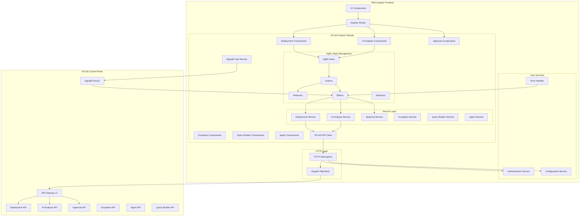

# Design Document: ATLAS Control Plane Integration

## API Specification Reference

This design is based on the ATLAS API OpenAPI specification:
#[[file:../atlas-api.json]]

## Overview

This design document outlines the architecture for integrating the ATLAS control plane microservice platform into the ARK Angular frontend. The integration introduces a modular, scalable approach that leverages NgRx for state management, implements robust error handling and resilience patterns, and maintains backward compatibility with existing ARK services.

ATLAS provides comprehensive deployment lifecycle management with AI-powered analysis, dynamic query building, approval workflows, exception management, and real-time monitoring capabilities.

### Key Design Principles

1. **Modularity**: ATLAS functionality is encapsulated in a dedicated feature module that can be lazy-loaded
2. **Gradual Migration**: Support hybrid mode where features can migrate from ARK to ATLAS incrementally
3. **Resilience**: Implement circuit breakers, retry logic, and fallback mechanisms for reliability
4. **Performance**: Use caching, memoization, and lazy loading to maintain application responsiveness
5. **Developer Experience**: Provide clear abstractions, type safety, and comprehensive tooling

### Technology Stack

- **Angular 18.2.6**: Frontend framework
- **NgRx 18.0.2**: State management (Store, Effects)
- **RxJS 7.8.0**: Reactive programming
- **SignalR 9.0.6**: Real-time communication
- **TypeScript 5.4.5**: Type-safe development
- **Angular Material 18.2.6 & PrimeNG 18.0.2**: UI components

### ATLAS API Overview

The ATLAS API (v1) provides the following major feature areas:

1. **Deployments** - Core deployment lifecycle management (CRUD, state transitions, evidence, audit)
2. **AI Analysis** - AI-powered deployment analysis, risk assessment, and recommendations
3. **Approvals** - Approval workflows, authority validation, and critical gate management
4. **Exceptions** - Exception and waiver request management with validation
5. **Agents** - AI agent execution, configuration, audit, and telemetry
6. **Query Builder** - Dynamic database query building with templates and export
7. **Health & Metrics** - System health monitoring, circuit breakers, and metrics
8. **ARK Integration** - Integration endpoints for existing ARK services

**Base URL**: `/v1` (versioned API)

**Authentication**: JWT Bearer Token or API Key (X-API-Key header)

**Rate Limiting**: 1000 requests per minute for authenticated users

## Architecture

### High-Level Architecture



### Module Structure

```
src/app/
├── features/
│   └── atlas/
│       ├── atlas.module.ts
│       ├── atlas-routing.module.ts
│       │
│       ├── components/
│       │   ├── deployments/
│       │   ├── ai-analysis/
│       │   ├── approvals/
│       │   ├── exceptions/
│       │   ├── agents/
│       │   └── query-builder/
│       │
│       ├── services/
│       │   ├── deployment.service.ts
│       │   ├── ai-analysis.service.ts
│       │   ├── approval.service.ts
│       │   ├── exception.service.ts
│       │   ├── agent.service.ts
│       │   ├── query-builder.service.ts
│       │   ├── atlas-api-client.service.ts
│       │   ├── atlas-signalr.service.ts
│       │   ├── atlas-config.service.ts
│       │   └── atlas-error-handler.service.ts
│       │
│       ├── state/
│       │   ├── deployments/
│       │   ├── ai-analysis/
│       │   ├── approvals/
│       │   ├── exceptions/
│       │   ├── agents/
│       │   └── query-builder/
│       │
│       ├── models/
│       │   ├── deployment.model.ts
│       │   ├── ai-analysis.model.ts
│       │   ├── approval.model.ts
│       │   ├── exception.model.ts
│       │   ├── agent.model.ts
│       │   ├── query-builder.model.ts
│       │   └── common.model.ts
│       │
│       ├── guards/
│       │   └── atlas-feature.guard.ts
│       │
│       ├── interceptors/
│       │   └── atlas-auth.interceptor.ts
│       │
│       └── utils/
│           ├── atlas-error-mapper.ts
│           └── atlas-retry-strategy.ts
```

## Data Models

### Common Models

```typescript
export interface PaginationMetadata {
  currentPage: number;
  pageSize: number;
  totalCount: number;
  totalPages: number;
  nextCursor?: string;
  previousCursor?: string;
  nextLink?: string;
  previousLink?: string;
}

export interface PagedResult<T> {
  items: T[];
  pagination: PaginationMetadata;
}

export interface ProblemDetails {
  type?: string;
  title?: string;
  status?: number;
  detail?: string;
  instance?: string;
  [key: string]: any;
}
```


### Deployment Models

```typescript
export enum DeploymentType {
  STANDARD = 'STANDARD',
  EMERGENCY = 'EMERGENCY',
  MAINTENANCE = 'MAINTENANCE',
  UPGRADE = 'UPGRADE',
  ROLLBACK = 'ROLLBACK'
}

export enum LifecycleState {
  DRAFT = 'DRAFT',
  SUBMITTED = 'SUBMITTED',
  INTAKE_REVIEW = 'INTAKE_REVIEW',
  PLANNING = 'PLANNING',
  READY = 'READY',
  IN_PROGRESS = 'IN_PROGRESS',
  EXECUTION_COMPLETE = 'EXECUTION_COMPLETE',
  QA_REVIEW = 'QA_REVIEW',
  APPROVED_FOR_CLOSEOUT = 'APPROVED_FOR_CLOSEOUT',
  CLOSED = 'CLOSED',
  ON_HOLD = 'ON_HOLD',
  CANCELLED = 'CANCELLED',
  REWORK_REQUIRED = 'REWORK_REQUIRED'
}

export enum TransitionResult {
  SUCCESS = 'SUCCESS',
  FAILED = 'FAILED',
  REJECTED = 'REJECTED',
  PENDING = 'PENDING'
}

export interface DeploymentDto {
  id: string;
  title: string;
  type: DeploymentType;
  currentState: LifecycleState;
  clientId: string;
  createdBy: string;
  createdAt: Date;
  updatedAt: Date;
  metadata?: Record<string, any>;
}

export interface DeploymentDetailDto extends DeploymentDto {
  transitionHistory: StateTransitionDto[];
  evidence: EvidenceDto[];
  approvals: ApprovalDto[];
  exceptions: ExceptionDto[];
}

export interface CreateDeploymentRequest {
  title: string;
  type: DeploymentType;
  metadata?: Record<string, any>;
}

export interface UpdateDeploymentRequest {
  title?: string;
  type?: DeploymentType;
  metadata?: Record<string, any>;
}

export interface StateTransitionRequest {
  targetState: LifecycleState;
  reason: string;
}

export interface StateTransitionDto {
  id: string;
  fromState: LifecycleState;
  toState: LifecycleState;
  initiatedBy: string;
  timestamp: Date;
  reason?: string;
  result: TransitionResult;
}

export enum EvidenceType {
  DOCUMENT = 'DOCUMENT',
  DOCUMENTATION = 'DOCUMENTATION',
  TEST_RESULT = 'TEST_RESULT',
  TEST_RESULTS = 'TEST_RESULTS',
  APPROVAL_RECORD = 'APPROVAL_RECORD',
  CONFIGURATION_FILE = 'CONFIGURATION_FILE',
  DEPLOYMENT_PLAN = 'DEPLOYMENT_PLAN',
  RISK_ASSESSMENT = 'RISK_ASSESSMENT',
  COMPLIANCE_CERTIFICATE = 'COMPLIANCE_CERTIFICATE',
  TECHNICAL_SPECIFICATION = 'TECHNICAL_SPECIFICATION'
}

export enum EvidenceStatus {
  PENDING = 'PENDING',
  SUBMITTED = 'SUBMITTED',
  APPROVED = 'APPROVED',
  REJECTED = 'REJECTED',
  UNDER_REVIEW = 'UNDER_REVIEW',
  EXPIRED = 'EXPIRED'
}

export interface EvidenceDto {
  id: string;
  type: EvidenceType;
  title: string;
  description?: string;
  submittedBy: string;
  submittedAt: Date;
  status: EvidenceStatus;
}

export interface EvidenceSubmissionRequest {
  type: EvidenceType;
  title: string;
  description?: string;
  content: string;
  metadata?: Record<string, any>;
}
```

### AI Analysis Models

```typescript
export enum ReadinessStatus {
  NotReady = 'NotReady',
  PartiallyReady = 'PartiallyReady',
  Ready = 'Ready',
  ReadyWithConcerns = 'ReadyWithConcerns',
  Unknown = 'Unknown'
}

export enum FindingCategory {
  Evidence = 'Evidence',
  Compliance = 'Compliance',
  Risk = 'Risk',
  Quality = 'Quality',
  Process = 'Process',
  Technical = 'Technical',
  Documentation = 'Documentation',
  Approval = 'Approval',
  Other = 'Other'
}

export enum FindingSeverity {
  Info = 'Info',
  Low = 'Low',
  Medium = 'Medium',
  High = 'High',
  Critical = 'Critical'
}

export interface ReadinessAssessment {
  status: ReadinessStatus;
  score: number;
  summary?: string;
  keyFactors?: string[];
  criticalBlockers?: string[];
  improvementAreas?: string[];
}

export interface AnalysisFinding {
  id?: string;
  title?: string;
  description?: string;
  category: FindingCategory;
  severity: FindingSeverity;
  confidence: number;
  supportingEvidence?: string[];
  potentialImpact?: string;
}

export interface Recommendation {
  id?: string;
  title?: string;
  description?: string;
  category: string;
  priority: string;
  type: string;
  rationale?: string;
  expectedBenefits?: string[];
  risksIfIgnored?: string[];
  implementationSteps?: string[];
  estimatedEffort?: string;
  successCriteria?: string[];
  confidence: number;
  relatedRecommendations?: string[];
  dependencies?: string[];
}

export interface AnalysisResult {
  analysisId?: string;
  deploymentId: string;
  agentId?: string;
  readinessAssessment: ReadinessAssessment;
  findings?: AnalysisFinding[];
  recommendations?: Recommendation[];
  confidenceLevel: number;
  explanatoryReasoning?: string;
  completedAt: Date;
  analysisDuration: string;
  correlationId?: string;
  metadata?: Record<string, any>;
}

export enum RiskLevel {
  VeryLow = 'VeryLow',
  Low = 'Low',
  Medium = 'Medium',
  High = 'High',
  VeryHigh = 'VeryHigh',
  Critical = 'Critical'
}

export enum RiskCategory {
  Technical = 'Technical',
  Operational = 'Operational',
  Security = 'Security',
  Compliance = 'Compliance',
  Performance = 'Performance',
  Integration = 'Integration',
  Resource = 'Resource',
  Timeline = 'Timeline',
  Quality = 'Quality',
  Business = 'Business',
  Other = 'Other'
}

export enum RiskSeverity {
  Negligible = 'Negligible',
  Minor = 'Minor',
  Moderate = 'Moderate',
  Major = 'Major',
  Severe = 'Severe',
  Critical = 'Critical'
}

export interface IdentifiedRisk {
  id?: string;
  title?: string;
  description?: string;
  category: RiskCategory;
  severity: RiskSeverity;
  probability: number;
  potentialImpact?: string;
  riskIndicators?: string[];
  historicalOccurrences?: string[];
  confidence: number;
}

export interface RiskMitigation {
  id?: string;
  riskId?: string;
  title?: string;
  description?: string;
  type: string;
  priority: string;
  estimatedEffort?: string;
  expectedEffectiveness: number;
  implementationSteps?: string[];
}

export interface RiskAssessment {
  assessmentId?: string;
  deploymentId: string;
  agentId?: string;
  overallRiskLevel: RiskLevel;
  overallRiskScore: number;
  identifiedRisks?: IdentifiedRisk[];
  mitigationRecommendations?: RiskMitigation[];
  riskFactors?: any[];
  confidenceLevel: number;
  explanatoryReasoning?: string;
  completedAt: Date;
  assessmentDuration: string;
  correlationId?: string;
  metadata?: Record<string, any>;
}

export interface RecommendationSet {
  recommendationSetId?: string;
  deploymentId: string;
  agentId?: string;
  recommendations?: Recommendation[];
  summary?: string;
  priorityRecommendations?: string[];
  expectedImpact?: string;
  confidenceLevel: number;
  explanatoryReasoning?: string;
  generatedAt: Date;
  generationDuration: string;
  correlationId?: string;
  metadata?: Record<string, any>;
}
```

### Approval Models

```typescript
export enum ApprovalStatus {
  PENDING = 'PENDING',
  APPROVED = 'APPROVED',
  DENIED = 'DENIED',
  EXPIRED = 'EXPIRED'
}

export interface ApprovalDto {
  id: string;
  forState: LifecycleState;
  status: ApprovalStatus;
  approverId?: string;
  approvedAt?: Date;
  comments?: string;
}

export interface ApprovalRequestDto {
  deploymentId: string;
  forState: LifecycleState;
  justification?: string;
  context?: Record<string, any>;
}

export interface ApprovalDecisionDto {
  decision: ApprovalStatus;
  comments?: string;
  approverRole?: string;
  approverAuthority?: string;
  conditions?: Record<string, any>;
}

export interface ApprovalAuthority {
  userId: string;
  isAuthorized: boolean;
  authorityLevel?: string;
  roles?: string[];
  permissions?: string[];
  clientId: string;
  authorizedStates?: LifecycleState[];
  reason?: string;
}

export interface CriticalGateDefinition {
  state: LifecycleState;
  gateName?: string;
  description?: string;
  isCritical: boolean;
  requiredAuthority?: string;
  minimumApprovals: number;
  requiresUnanimous: boolean;
  additionalRequirements?: string[];
  clientOverrides?: Record<string, any>;
}
```

### Exception Models

```typescript
export enum ExceptionStatus {
  PENDING = 'PENDING',
  APPROVED = 'APPROVED',
  DENIED = 'DENIED',
  EXPIRED = 'EXPIRED'
}

export interface ExceptionDto {
  id: string;
  exceptionType?: string;
  status: ExceptionStatus;
  requestedBy: string;
  requestedAt: Date;
  expiresAt?: Date;
  justification?: string;
}

export interface CreateExceptionRequest {
  exceptionType?: string;
  justification?: string;
  requestedBy: string;
  expiresAt?: Date;
  supportingEvidence?: string[];
  metadata?: Record<string, any>;
}

export interface ApproveExceptionRequest {
  approverId: string;
  additionalRequirements?: string[];
}

export interface DenyExceptionRequest {
  approverId: string;
  denialReason?: string;
}

export interface ExceptionValidationResult {
  isApproved: boolean;
  message?: string;
  validationErrors?: string[];
  alternativePaths?: string[];
  additionalRequirements?: string[];
  validatedAt: Date;
}
```

### Agent Models

```typescript
export enum AgentDomain {
  Deployment = 'Deployment',
  Dispatch = 'Dispatch',
  CRM = 'CRM',
  CrossCutting = 'CrossCutting'
}

export enum AgentType {
  RuleBased = 'RuleBased',
  MLBased = 'MLBased',
  Hybrid = 'Hybrid'
}

export enum AgentExecutionStatus {
  Success = 'Success',
  PartialSuccess = 'PartialSuccess',
  Failed = 'Failed',
  Timeout = 'Timeout'
}

export interface AgentMetadata {
  agentId?: string;
  agentName?: string;
  version?: string;
  domain: AgentDomain;
  type: AgentType;
  description?: string;
  capabilities?: string[];
  registeredAt: Date;
  registeredBy?: string;
  isActive: boolean;
}

export interface AgentConfiguration {
  agentId?: string;
  version?: string;
  parameters?: Record<string, any>;
  thresholds?: any;
  featureFlags?: any;
  lastUpdated: Date;
  updatedBy?: string;
}

export interface ExecuteAgentRequest {
  agentId?: string;
  input: any;
  version?: string;
}

export interface AgentRecommendation {
  recommendationId?: string;
  agentId?: string;
  agentVersion?: string;
  recommendation: any;
  confidenceScore: number;
  reasoning?: string;
  decisionFactors?: any[];
  dataSources?: any[];
  featureImportance?: Record<string, number>;
  timestamp: Date;
  executionDuration: string;
  status: AgentExecutionStatus;
}

export interface AgentPerformanceReport {
  agentId?: string;
  startDate: Date;
  endDate: Date;
  totalExecutions: number;
  successfulExecutions: number;
  failedExecutions: number;
  successRate: number;
  averageConfidenceScore: number;
  averageDuration: string;
  p95Duration: string;
  p99Duration: string;
}

export interface AgentHealthStatus {
  agentId?: string;
  state: string;
  successRate: number;
  averageResponseTime: string;
  lastExecutionTime: Date;
  issues?: string[];
}
```

### Query Builder Models

```typescript
export interface DataSourceInfo {
  id?: string;
  name?: string;
  description?: string;
  fieldCount: number;
  maxRowsTotal: number;
}

export interface FieldConfig {
  name?: string;
  displayName?: string;
  dataType?: string;
  allowedOperators?: string[];
  allowedRoles?: string[];
  isFilterable: boolean;
  isSortable: boolean;
}

export interface FilterSelection {
  field?: string;
  operator?: string;
  value: any;
  dataType?: string;
}

export interface FilterGroup {
  filters?: FilterSelection[];
  logicalOperator?: string;
}

export interface SortCriteria {
  field?: string;
  direction?: string;
}

export interface UserQuery {
  dataSource?: string;
  filters?: FilterSelection[];
  logicalOperator?: string;
  grouping?: FilterGroup[];
  sortBy?: SortCriteria[];
  limit?: number;
}

export interface ColumnMetadata {
  name?: string;
  displayName?: string;
  dataType?: string;
}

export interface QueryResult {
  columns?: ColumnMetadata[];
  rows?: any[][];
  totalRows: number;
  executionTimeMs: number;
  fromCache: boolean;
  timestamp: Date;
}

export enum ExportFormat {
  CSV = 'CSV',
  JSON = 'JSON',
  Excel = 'Excel'
}

export interface ExportRequestDto {
  queryResult: QueryResult;
  format: ExportFormat;
  dataSource?: string;
  fileName?: string;
}

export interface QueryTemplate {
  id?: string;
  name?: string;
  description?: string;
  dataSource?: string;
  parameters?: TemplateParameter[];
  sqlTemplate?: string;
  isPublic: boolean;
  createdBy?: string;
  createdAt: Date;
  modifiedAt?: Date;
}

export interface TemplateParameter {
  name?: string;
  displayName?: string;
  dataType?: string;
  isRequired: boolean;
  defaultValue?: any;
}

export interface CreateTemplateRequest {
  name?: string;
  description?: string;
  dataSource?: string;
  parameters?: TemplateParameter[];
  sqlTemplate?: string;
  isPublic: boolean;
}

export interface TemplateExecutionRequest {
  parameters?: Record<string, any>;
}
```


## Service Layer

### 1. Deployment Service

**Purpose**: Manage deployment lifecycle operations including CRUD, state transitions, evidence, and audit.

**API Endpoint Mappings**:

```typescript
@Injectable()
export class DeploymentService {
  private readonly baseUrl = '/v1/deployments';

  constructor(
    private http: HttpClient,
    private errorHandler: AtlasErrorHandlerService
  ) {}

  // GET /v1/deployments - List deployments with pagination and filtering
  getDeployments(params?: {
    state?: LifecycleState;
    type?: DeploymentType;
    page?: number;
    pageSize?: number;
  }): Observable<PagedResult<DeploymentDto>> {
    return this.http.get<PagedResult<DeploymentDto>>(this.baseUrl, { params })
      .pipe(catchError(this.errorHandler.handleError));
  }

  // GET /v1/deployments/{id} - Get deployment details
  getDeployment(id: string): Observable<DeploymentDetailDto> {
    return this.http.get<DeploymentDetailDto>(`${this.baseUrl}/${id}`)
      .pipe(catchError(this.errorHandler.handleError));
  }

  // POST /v1/deployments - Create new deployment
  createDeployment(request: CreateDeploymentRequest): Observable<DeploymentDto> {
    return this.http.post<DeploymentDto>(this.baseUrl, request)
      .pipe(catchError(this.errorHandler.handleError));
  }

  // PUT /v1/deployments/{id} - Update deployment (requires If-Match header)
  updateDeployment(id: string, request: UpdateDeploymentRequest, etag: string): Observable<DeploymentDto> {
    const headers = { 'If-Match': etag };
    return this.http.put<DeploymentDto>(`${this.baseUrl}/${id}`, request, { headers })
      .pipe(catchError(this.errorHandler.handleError));
  }

  // DELETE /v1/deployments/{id} - Soft delete (transition to CANCELLED)
  deleteDeployment(id: string, reason?: string): Observable<void> {
    return this.http.delete<void>(`${this.baseUrl}/${id}`, { body: { reason } })
      .pipe(catchError(this.errorHandler.handleError));
  }

  // POST /v1/deployments/{id}/transition - Request state transition
  transitionState(id: string, request: StateTransitionRequest): Observable<void> {
    return this.http.post<void>(`${this.baseUrl}/${id}/transition`, request)
      .pipe(catchError(this.errorHandler.handleError));
  }

  // POST /v1/deployments/{id}/validate-transition - Validate transition without executing
  validateTransition(id: string, targetState: LifecycleState): Observable<any> {
    return this.http.post<any>(`${this.baseUrl}/${id}/validate-transition`, { targetState })
      .pipe(catchError(this.errorHandler.handleError));
  }

  // POST /v1/deployments/{id}/evidence - Submit evidence
  submitEvidence(id: string, request: EvidenceSubmissionRequest): Observable<void> {
    return this.http.post<void>(`${this.baseUrl}/${id}/evidence`, request)
      .pipe(catchError(this.errorHandler.handleError));
  }

  // GET /v1/deployments/{id}/evidence/{evidenceId} - Get specific evidence
  getEvidence(deploymentId: string, evidenceId: string): Observable<any> {
    return this.http.get<any>(`${this.baseUrl}/${deploymentId}/evidence/${evidenceId}`)
      .pipe(catchError(this.errorHandler.handleError));
  }

  // GET /v1/deployments/{id}/audit - Get audit trail
  getAuditTrail(id: string): Observable<any> {
    return this.http.get<any>(`${this.baseUrl}/${id}/audit`)
      .pipe(catchError(this.errorHandler.handleError));
  }

  // POST /v1/deployments/{id}/verify-integrity - Verify audit integrity
  verifyIntegrity(id: string, auditEventId: string): Observable<any> {
    return this.http.post<any>(`${this.baseUrl}/${id}/verify-integrity`, { auditEventId })
      .pipe(catchError(this.errorHandler.handleError));
  }
}
```

### 2. AI Analysis Service

**Purpose**: Trigger AI-powered analysis, risk assessment, and recommendations for deployments.

**API Endpoint Mappings**:

```typescript
@Injectable()
export class AIAnalysisService {
  private readonly baseUrl = '/v1/ai-analysis';

  constructor(
    private http: HttpClient,
    private errorHandler: AtlasErrorHandlerService
  ) {}

  // POST /v1/ai-analysis/deployments/{deploymentId}/analyze - Trigger AI analysis
  analyzeDeployment(deploymentId: string, targetState?: string): Observable<AnalysisResult> {
    const params = targetState ? { targetState } : {};
    return this.http.post<AnalysisResult>(
      `${this.baseUrl}/deployments/${deploymentId}/analyze`,
      null,
      { params }
    ).pipe(catchError(this.errorHandler.handleError));
  }

  // POST /v1/ai-analysis/deployments/{deploymentId}/risk-assessment - Perform risk assessment
  assessRisk(deploymentId: string): Observable<RiskAssessment> {
    return this.http.post<RiskAssessment>(
      `${this.baseUrl}/deployments/${deploymentId}/risk-assessment`,
      null
    ).pipe(catchError(this.errorHandler.handleError));
  }

  // POST /v1/ai-analysis/deployments/{deploymentId}/recommendations - Generate recommendations
  generateRecommendations(deploymentId: string): Observable<RecommendationSet> {
    return this.http.post<RecommendationSet>(
      `${this.baseUrl}/deployments/${deploymentId}/recommendations`,
      null
    ).pipe(catchError(this.errorHandler.handleError));
  }

  // GET /v1/ai-analysis/agents - Get available AI agents
  getAvailableAgents(): Observable<any[]> {
    return this.http.get<any[]>(`${this.baseUrl}/agents`)
      .pipe(catchError(this.errorHandler.handleError));
  }

  // POST /v1/ai-analysis/agents/{agentId}/validate-operation - Validate agent operation
  validateAgentOperation(agentId: string, operation: string): Observable<any> {
    return this.http.post<any>(
      `${this.baseUrl}/agents/${agentId}/validate-operation`,
      operation
    ).pipe(catchError(this.errorHandler.handleError));
  }
}
```

### 3. Approval Service

**Purpose**: Manage approval workflows, authority validation, and critical gate definitions.

**API Endpoint Mappings**:

```typescript
@Injectable()
export class ApprovalService {
  private readonly baseUrl = '/v1/approvals';

  constructor(
    private http: HttpClient,
    private errorHandler: AtlasErrorHandlerService
  ) {}

  // GET /v1/approvals/authority/{deploymentId}/{forState} - Check approval authority
  checkAuthority(deploymentId: string, forState: LifecycleState): Observable<ApprovalAuthority> {
    return this.http.get<ApprovalAuthority>(
      `${this.baseUrl}/authority/${deploymentId}/${forState}`
    ).pipe(catchError(this.errorHandler.handleError));
  }

  // POST /v1/approvals/request - Request approval
  requestApproval(request: ApprovalRequestDto): Observable<void> {
    return this.http.post<void>(`${this.baseUrl}/request`, request)
      .pipe(catchError(this.errorHandler.handleError));
  }

  // POST /v1/approvals/{approvalId}/decision - Record approval decision
  recordDecision(approvalId: string, decision: ApprovalDecisionDto): Observable<void> {
    return this.http.post<void>(`${this.baseUrl}/${approvalId}/decision`, decision)
      .pipe(catchError(this.errorHandler.handleError));
  }

  // GET /v1/approvals/deployment/{deploymentId}/pending - Get pending approvals
  getPendingApprovals(deploymentId: string): Observable<any[]> {
    return this.http.get<any[]>(`${this.baseUrl}/deployment/${deploymentId}/pending`)
      .pipe(catchError(this.errorHandler.handleError));
  }

  // GET /v1/approvals/deployment/{deploymentId}/state/{forState} - Get approvals for state
  getApprovalsForState(deploymentId: string, forState: LifecycleState): Observable<any[]> {
    return this.http.get<any[]>(
      `${this.baseUrl}/deployment/${deploymentId}/state/${forState}`
    ).pipe(catchError(this.errorHandler.handleError));
  }

  // GET /v1/approvals/deployment/{deploymentId}/state/{forState}/sufficient - Check if sufficient
  checkSufficientApprovals(deploymentId: string, forState: LifecycleState): Observable<boolean> {
    return this.http.get<boolean>(
      `${this.baseUrl}/deployment/${deploymentId}/state/${forState}/sufficient`
    ).pipe(catchError(this.errorHandler.handleError));
  }

  // GET /v1/approvals/critical-gate/{state} - Get critical gate definition
  getCriticalGate(state: LifecycleState): Observable<CriticalGateDefinition> {
    return this.http.get<CriticalGateDefinition>(`${this.baseUrl}/critical-gate/${state}`)
      .pipe(catchError(this.errorHandler.handleError));
  }

  // GET /v1/approvals/user/approvals - Get user's approvals with pagination
  getUserApprovals(page: number = 1, pageSize: number = 50): Observable<PagedResult<any>> {
    return this.http.get<PagedResult<any>>(`${this.baseUrl}/user/approvals`, {
      params: { page: page.toString(), pageSize: pageSize.toString() }
    }).pipe(catchError(this.errorHandler.handleError));
  }
}
```

### 4. Exception Service

**Purpose**: Manage exception and waiver requests with validation and approval workflows.

**API Endpoint Mappings**:

```typescript
@Injectable()
export class ExceptionService {
  private readonly baseUrl = '/v1/exceptions';

  constructor(
    private http: HttpClient,
    private errorHandler: AtlasErrorHandlerService
  ) {}

  // POST /v1/exceptions/deployments/{deploymentId} - Create exception request
  createException(deploymentId: string, request: CreateExceptionRequest): Observable<ExceptionDto> {
    return this.http.post<ExceptionDto>(
      `${this.baseUrl}/deployments/${deploymentId}`,
      request
    ).pipe(catchError(this.errorHandler.handleError));
  }

  // GET /v1/exceptions/deployments/{deploymentId} - Get all exceptions with pagination
  getExceptions(
    deploymentId: string,
    page: number = 1,
    pageSize: number = 50
  ): Observable<PagedResult<ExceptionDto>> {
    return this.http.get<PagedResult<ExceptionDto>>(
      `${this.baseUrl}/deployments/${deploymentId}`,
      { params: { page: page.toString(), pageSize: pageSize.toString() } }
    ).pipe(catchError(this.errorHandler.handleError));
  }

  // POST /v1/exceptions/deployments/{deploymentId}/validate - Validate exception request
  validateException(
    deploymentId: string,
    request: CreateExceptionRequest
  ): Observable<ExceptionValidationResult> {
    return this.http.post<ExceptionValidationResult>(
      `${this.baseUrl}/deployments/${deploymentId}/validate`,
      request
    ).pipe(catchError(this.errorHandler.handleError));
  }

  // GET /v1/exceptions/{exceptionId} - Get exception by ID
  getException(exceptionId: string): Observable<ExceptionDto> {
    return this.http.get<ExceptionDto>(`${this.baseUrl}/${exceptionId}`)
      .pipe(catchError(this.errorHandler.handleError));
  }

  // GET /v1/exceptions/deployments/{deploymentId}/active - Get active exceptions
  getActiveExceptions(deploymentId: string): Observable<ExceptionDto[]> {
    return this.http.get<ExceptionDto[]>(
      `${this.baseUrl}/deployments/${deploymentId}/active`
    ).pipe(catchError(this.errorHandler.handleError));
  }

  // POST /v1/exceptions/{exceptionId}/approve - Approve exception
  approveException(exceptionId: string, request: ApproveExceptionRequest): Observable<ExceptionDto> {
    return this.http.post<ExceptionDto>(
      `${this.baseUrl}/${exceptionId}/approve`,
      request
    ).pipe(catchError(this.errorHandler.handleError));
  }

  // POST /v1/exceptions/{exceptionId}/deny - Deny exception
  denyException(exceptionId: string, request: DenyExceptionRequest): Observable<ExceptionDto> {
    return this.http.post<ExceptionDto>(
      `${this.baseUrl}/${exceptionId}/deny`,
      request
    ).pipe(catchError(this.errorHandler.handleError));
  }
}
```

### 5. Agent Service

**Purpose**: Execute AI agents, manage configurations, and monitor telemetry.

**API Endpoint Mappings**:

```typescript
@Injectable()
export class AgentService {
  private readonly baseUrl = '/api/agents';

  constructor(
    private http: HttpClient,
    private errorHandler: AtlasErrorHandlerService
  ) {}

  // GET /api/agents - List available agents with filtering
  getAgents(params?: {
    domain?: AgentDomain;
    type?: AgentType;
    searchTerm?: string;
  }): Observable<AgentMetadata[]> {
    return this.http.get<AgentMetadata[]>(this.baseUrl, { params })
      .pipe(catchError(this.errorHandler.handleError));
  }

  // GET /api/agents/{agentId} - Get agent metadata
  getAgent(agentId: string, version?: string): Observable<AgentMetadata> {
    const params = version ? { version } : {};
    return this.http.get<AgentMetadata>(`${this.baseUrl}/${agentId}`, { params })
      .pipe(catchError(this.errorHandler.handleError));
  }

  // GET /api/agents/{agentId}/versions - Get agent versions
  getAgentVersions(agentId: string): Observable<string[]> {
    return this.http.get<string[]>(`${this.baseUrl}/${agentId}/versions`)
      .pipe(catchError(this.errorHandler.handleError));
  }

  // GET /api/agents/{agentId}/configuration - Get agent configuration
  getConfiguration(agentId: string, version?: string): Observable<AgentConfiguration> {
    const params = version ? { version } : {};
    return this.http.get<AgentConfiguration>(
      `${this.baseUrl}/${agentId}/configuration`,
      { params }
    ).pipe(catchError(this.errorHandler.handleError));
  }

  // PUT /api/agents/{agentId}/configuration - Update agent configuration
  updateConfiguration(agentId: string, request: any): Observable<AgentConfiguration> {
    return this.http.put<AgentConfiguration>(
      `${this.baseUrl}/${agentId}/configuration`,
      request
    ).pipe(catchError(this.errorHandler.handleError));
  }

  // POST /api/agents/execute - Execute single agent
  executeAgent(request: ExecuteAgentRequest): Observable<AgentRecommendation> {
    return this.http.post<AgentRecommendation>(`${this.baseUrl}/execute`, request)
      .pipe(catchError(this.errorHandler.handleError));
  }

  // POST /api/agents/execute-batch - Execute multiple agents
  executeBatch(request: any): Observable<AgentRecommendation[]> {
    return this.http.post<AgentRecommendation[]>(`${this.baseUrl}/execute-batch`, request)
      .pipe(catchError(this.errorHandler.handleError));
  }

  // POST /api/agents/execute-chain - Execute agent chain
  executeChain(request: any): Observable<any> {
    return this.http.post<any>(`${this.baseUrl}/execute-chain`, request)
      .pipe(catchError(this.errorHandler.handleError));
  }

  // GET /api/agents/telemetry/performance/{agentId} - Get performance report
  getPerformanceReport(
    agentId: string,
    startDate?: Date,
    endDate?: Date
  ): Observable<AgentPerformanceReport> {
    const params: any = {};
    if (startDate) params.startDate = startDate.toISOString();
    if (endDate) params.endDate = endDate.toISOString();
    
    return this.http.get<AgentPerformanceReport>(
      `${this.baseUrl}/telemetry/performance/${agentId}`,
      { params }
    ).pipe(catchError(this.errorHandler.handleError));
  }

  // GET /api/agents/telemetry/health/{agentId} - Get agent health status
  getHealthStatus(agentId: string): Observable<AgentHealthStatus> {
    return this.http.get<AgentHealthStatus>(
      `${this.baseUrl}/telemetry/health/${agentId}`
    ).pipe(catchError(this.errorHandler.handleError));
  }

  // GET /api/agents/telemetry/health - Get all agents health
  getAllHealthStatuses(): Observable<AgentHealthStatus[]> {
    return this.http.get<AgentHealthStatus[]>(`${this.baseUrl}/telemetry/health`)
      .pipe(catchError(this.errorHandler.handleError));
  }

  // GET /api/agent-audit - Query agent audit logs
  queryAuditLogs(params?: {
    agentId?: string;
    userId?: string;
    status?: AgentExecutionStatus;
    startDate?: Date;
    endDate?: Date;
    pageSize?: number;
    pageNumber?: number;
  }): Observable<any> {
    return this.http.get<any>('/api/agent-audit', { params })
      .pipe(catchError(this.errorHandler.handleError));
  }
}
```

### 6. Query Builder Service

**Purpose**: Build and execute dynamic database queries with templates and export capabilities.

**API Endpoint Mappings**:

```typescript
@Injectable()
export class QueryBuilderService {
  private readonly baseUrl = '/v1/query-builder';

  constructor(
    private http: HttpClient,
    private errorHandler: AtlasErrorHandlerService
  ) {}

  // GET /v1/query-builder/data-sources - Get available data sources
  getDataSources(): Observable<DataSourceInfo[]> {
    return this.http.get<DataSourceInfo[]>(`${this.baseUrl}/data-sources`)
      .pipe(catchError(this.errorHandler.handleError));
  }

  // GET /v1/query-builder/data-sources/{id}/fields - Get fields for data source
  getFields(dataSourceId: string): Observable<FieldConfig[]> {
    return this.http.get<FieldConfig[]>(
      `${this.baseUrl}/data-sources/${dataSourceId}/fields`
    ).pipe(catchError(this.errorHandler.handleError));
  }

  // POST /v1/query-builder/execute - Execute user-defined query
  executeQuery(query: UserQuery): Observable<QueryResult> {
    return this.http.post<QueryResult>(`${this.baseUrl}/execute`, query)
      .pipe(catchError(this.errorHandler.handleError));
  }

  // POST /v1/query-builder/export - Export query results
  exportResults(request: ExportRequestDto): Observable<Blob> {
    return this.http.post(`${this.baseUrl}/export`, request, {
      responseType: 'blob'
    }).pipe(catchError(this.errorHandler.handleError));
  }

  // GET /v1/query-builder/templates - Get query templates
  getTemplates(): Observable<QueryTemplate[]> {
    return this.http.get<QueryTemplate[]>(`${this.baseUrl}/templates`)
      .pipe(catchError(this.errorHandler.handleError));
  }

  // POST /v1/query-builder/templates - Create query template
  createTemplate(request: CreateTemplateRequest): Observable<QueryTemplate> {
    return this.http.post<QueryTemplate>(`${this.baseUrl}/templates`, request)
      .pipe(catchError(this.errorHandler.handleError));
  }

  // GET /v1/query-builder/templates/{id} - Get template by ID
  getTemplate(templateId: string): Observable<QueryTemplate> {
    return this.http.get<QueryTemplate>(`${this.baseUrl}/templates/${templateId}`)
      .pipe(catchError(this.errorHandler.handleError));
  }

  // DELETE /v1/query-builder/templates/{id} - Delete template
  deleteTemplate(templateId: string): Observable<void> {
    return this.http.delete<void>(`${this.baseUrl}/templates/${templateId}`)
      .pipe(catchError(this.errorHandler.handleError));
  }

  // POST /v1/query-builder/templates/{id}/execute - Execute template
  executeTemplate(
    templateId: string,
    request: TemplateExecutionRequest
  ): Observable<QueryResult> {
    return this.http.post<QueryResult>(
      `${this.baseUrl}/templates/${templateId}/execute`,
      request
    ).pipe(catchError(this.errorHandler.handleError));
  }
}
```


## NgRx State Management

### Deployment State Management

#### State Interface

```typescript
export interface DeploymentState {
  deployments: {
    entities: { [id: string]: DeploymentDto };
    ids: string[];
    selectedId: string | null;
    loading: boolean;
    error: any | null;
  };
  
  deploymentDetail: {
    data: DeploymentDetailDto | null;
    loading: boolean;
    error: any | null;
  };
  
  transitions: {
    inProgress: boolean;
    error: any | null;
  };
  
  evidence: {
    submitting: boolean;
    error: any | null;
  };
  
  pagination: {
    currentPage: number;
    pageSize: number;
    totalCount: number;
    totalPages: number;
  };
  
  filters: {
    state?: LifecycleState;
    type?: DeploymentType;
  };
}
```

#### Actions

```typescript
// Load deployments
export const loadDeployments = createAction(
  '[Deployment] Load Deployments',
  props<{ page?: number; pageSize?: number; state?: LifecycleState; type?: DeploymentType }>()
);

export const loadDeploymentsSuccess = createAction(
  '[Deployment] Load Deployments Success',
  props<{ result: PagedResult<DeploymentDto> }>()
);

export const loadDeploymentsFailure = createAction(
  '[Deployment] Load Deployments Failure',
  props<{ error: any }>()
);

// Load deployment detail
export const loadDeploymentDetail = createAction(
  '[Deployment] Load Deployment Detail',
  props<{ id: string }>()
);

export const loadDeploymentDetailSuccess = createAction(
  '[Deployment] Load Deployment Detail Success',
  props<{ deployment: DeploymentDetailDto }>()
);

export const loadDeploymentDetailFailure = createAction(
  '[Deployment] Load Deployment Detail Failure',
  props<{ error: any }>()
);

// Create deployment
export const createDeployment = createAction(
  '[Deployment] Create Deployment',
  props<{ request: CreateDeploymentRequest }>()
);

export const createDeploymentSuccess = createAction(
  '[Deployment] Create Deployment Success',
  props<{ deployment: DeploymentDto }>()
);

export const createDeploymentFailure = createAction(
  '[Deployment] Create Deployment Failure',
  props<{ error: any }>()
);

// Update deployment
export const updateDeployment = createAction(
  '[Deployment] Update Deployment',
  props<{ id: string; request: UpdateDeploymentRequest; etag: string }>()
);

export const updateDeploymentSuccess = createAction(
  '[Deployment] Update Deployment Success',
  props<{ deployment: DeploymentDto }>()
);

export const updateDeploymentFailure = createAction(
  '[Deployment] Update Deployment Failure',
  props<{ error: any }>()
);

// Transition state
export const transitionState = createAction(
  '[Deployment] Transition State',
  props<{ id: string; request: StateTransitionRequest }>()
);

export const transitionStateSuccess = createAction(
  '[Deployment] Transition State Success',
  props<{ id: string }>()
);

export const transitionStateFailure = createAction(
  '[Deployment] Transition State Failure',
  props<{ error: any }>()
);

// Submit evidence
export const submitEvidence = createAction(
  '[Deployment] Submit Evidence',
  props<{ deploymentId: string; request: EvidenceSubmissionRequest }>()
);

export const submitEvidenceSuccess = createAction(
  '[Deployment] Submit Evidence Success'
);

export const submitEvidenceFailure = createAction(
  '[Deployment] Submit Evidence Failure',
  props<{ error: any }>()
);

// Set filters
export const setFilters = createAction(
  '[Deployment] Set Filters',
  props<{ state?: LifecycleState; type?: DeploymentType }>()
);

// Select deployment
export const selectDeployment = createAction(
  '[Deployment] Select Deployment',
  props<{ id: string }>()
);
```

#### Effects

```typescript
@Injectable()
export class DeploymentEffects {
  
  loadDeployments$ = createEffect(() =>
    this.actions$.pipe(
      ofType(loadDeployments),
      switchMap(({ page, pageSize, state, type }) =>
        this.deploymentService.getDeployments({ page, pageSize, state, type }).pipe(
          map(result => loadDeploymentsSuccess({ result })),
          catchError(error => of(loadDeploymentsFailure({ error })))
        )
      )
    )
  );
  
  loadDeploymentDetail$ = createEffect(() =>
    this.actions$.pipe(
      ofType(loadDeploymentDetail),
      switchMap(({ id }) =>
        this.deploymentService.getDeployment(id).pipe(
          map(deployment => loadDeploymentDetailSuccess({ deployment })),
          catchError(error => of(loadDeploymentDetailFailure({ error })))
        )
      )
    )
  );
  
  createDeployment$ = createEffect(() =>
    this.actions$.pipe(
      ofType(createDeployment),
      exhaustMap(({ request }) =>
        this.deploymentService.createDeployment(request).pipe(
          map(deployment => createDeploymentSuccess({ deployment })),
          tap(() => this.toastr.success('Deployment created successfully')),
          catchError(error => {
            this.toastr.error('Failed to create deployment');
            return of(createDeploymentFailure({ error }));
          })
        )
      )
    )
  );
  
  updateDeployment$ = createEffect(() =>
    this.actions$.pipe(
      ofType(updateDeployment),
      exhaustMap(({ id, request, etag }) =>
        this.deploymentService.updateDeployment(id, request, etag).pipe(
          map(deployment => updateDeploymentSuccess({ deployment })),
          tap(() => this.toastr.success('Deployment updated successfully')),
          catchError(error => {
            this.toastr.error('Failed to update deployment');
            return of(updateDeploymentFailure({ error }));
          })
        )
      )
    )
  );
  
  transitionState$ = createEffect(() =>
    this.actions$.pipe(
      ofType(transitionState),
      exhaustMap(({ id, request }) =>
        this.deploymentService.transitionState(id, request).pipe(
          map(() => transitionStateSuccess({ id })),
          tap(() => {
            this.toastr.success('State transition initiated');
            // Reload deployment detail to get updated state
            this.store.dispatch(loadDeploymentDetail({ id }));
          }),
          catchError(error => {
            this.toastr.error('Failed to transition state');
            return of(transitionStateFailure({ error }));
          })
        )
      )
    )
  );
  
  submitEvidence$ = createEffect(() =>
    this.actions$.pipe(
      ofType(submitEvidence),
      exhaustMap(({ deploymentId, request }) =>
        this.deploymentService.submitEvidence(deploymentId, request).pipe(
          map(() => submitEvidenceSuccess()),
          tap(() => {
            this.toastr.success('Evidence submitted successfully');
            // Reload deployment detail to show new evidence
            this.store.dispatch(loadDeploymentDetail({ id: deploymentId }));
          }),
          catchError(error => {
            this.toastr.error('Failed to submit evidence');
            return of(submitEvidenceFailure({ error }));
          })
        )
      )
    )
  );
  
  setFilters$ = createEffect(() =>
    this.actions$.pipe(
      ofType(setFilters),
      map(() => loadDeployments({ page: 1 }))
    )
  );
  
  constructor(
    private actions$: Actions,
    private deploymentService: DeploymentService,
    private store: Store,
    private toastr: ToastrService
  ) {}
}
```

#### Selectors

```typescript
export const selectDeploymentState = createFeatureSelector<DeploymentState>('deployments');

export const selectAllDeployments = createSelector(
  selectDeploymentState,
  (state) => state.deployments.ids.map(id => state.deployments.entities[id])
);

export const selectDeploymentById = (id: string) => createSelector(
  selectDeploymentState,
  (state) => state.deployments.entities[id]
);

export const selectDeploymentsLoading = createSelector(
  selectDeploymentState,
  (state) => state.deployments.loading
);

export const selectDeploymentsError = createSelector(
  selectDeploymentState,
  (state) => state.deployments.error
);

export const selectDeploymentDetail = createSelector(
  selectDeploymentState,
  (state) => state.deploymentDetail.data
);

export const selectDeploymentDetailLoading = createSelector(
  selectDeploymentState,
  (state) => state.deploymentDetail.loading
);

export const selectSelectedDeploymentId = createSelector(
  selectDeploymentState,
  (state) => state.deployments.selectedId
);

export const selectSelectedDeployment = createSelector(
  selectDeploymentState,
  selectSelectedDeploymentId,
  (state, selectedId) => selectedId ? state.deployments.entities[selectedId] : null
);

export const selectPagination = createSelector(
  selectDeploymentState,
  (state) => state.pagination
);

export const selectFilters = createSelector(
  selectDeploymentState,
  (state) => state.filters
);

export const selectFilteredDeployments = createSelector(
  selectAllDeployments,
  selectFilters,
  (deployments, filters) => {
    return deployments.filter(deployment => {
      if (filters.state && deployment.currentState !== filters.state) return false;
      if (filters.type && deployment.type !== filters.type) return false;
      return true;
    });
  }
);

export const selectTransitionInProgress = createSelector(
  selectDeploymentState,
  (state) => state.transitions.inProgress
);

export const selectEvidenceSubmitting = createSelector(
  selectDeploymentState,
  (state) => state.evidence.submitting
);
```

### AI Analysis State Management

#### State Interface

```typescript
export interface AIAnalysisState {
  analysis: {
    data: AnalysisResult | null;
    loading: boolean;
    error: any | null;
  };
  
  riskAssessment: {
    data: RiskAssessment | null;
    loading: boolean;
    error: any | null;
  };
  
  recommendations: {
    data: RecommendationSet | null;
    loading: boolean;
    error: any | null;
  };
  
  availableAgents: {
    data: any[];
    loading: boolean;
    error: any | null;
  };
}
```

#### Actions

```typescript
// Analyze deployment
export const analyzeDeployment = createAction(
  '[AI Analysis] Analyze Deployment',
  props<{ deploymentId: string; targetState?: string }>()
);

export const analyzeDeploymentSuccess = createAction(
  '[AI Analysis] Analyze Deployment Success',
  props<{ result: AnalysisResult }>()
);

export const analyzeDeploymentFailure = createAction(
  '[AI Analysis] Analyze Deployment Failure',
  props<{ error: any }>()
);

// Assess risk
export const assessRisk = createAction(
  '[AI Analysis] Assess Risk',
  props<{ deploymentId: string }>()
);

export const assessRiskSuccess = createAction(
  '[AI Analysis] Assess Risk Success',
  props<{ assessment: RiskAssessment }>()
);

export const assessRiskFailure = createAction(
  '[AI Analysis] Assess Risk Failure',
  props<{ error: any }>()
);

// Generate recommendations
export const generateRecommendations = createAction(
  '[AI Analysis] Generate Recommendations',
  props<{ deploymentId: string }>()
);

export const generateRecommendationsSuccess = createAction(
  '[AI Analysis] Generate Recommendations Success',
  props<{ recommendations: RecommendationSet }>()
);

export const generateRecommendationsFailure = createAction(
  '[AI Analysis] Generate Recommendations Failure',
  props<{ error: any }>()
);

// Load available agents
export const loadAvailableAgents = createAction(
  '[AI Analysis] Load Available Agents'
);

export const loadAvailableAgentsSuccess = createAction(
  '[AI Analysis] Load Available Agents Success',
  props<{ agents: any[] }>()
);

export const loadAvailableAgentsFailure = createAction(
  '[AI Analysis] Load Available Agents Failure',
  props<{ error: any }>()
);
```

#### Effects

```typescript
@Injectable()
export class AIAnalysisEffects {
  
  analyzeDeployment$ = createEffect(() =>
    this.actions$.pipe(
      ofType(analyzeDeployment),
      switchMap(({ deploymentId, targetState }) =>
        this.aiService.analyzeDeployment(deploymentId, targetState).pipe(
          map(result => analyzeDeploymentSuccess({ result })),
          tap(() => this.toastr.success('Analysis completed')),
          catchError(error => {
            this.toastr.error('Analysis failed');
            return of(analyzeDeploymentFailure({ error }));
          })
        )
      )
    )
  );
  
  assessRisk$ = createEffect(() =>
    this.actions$.pipe(
      ofType(assessRisk),
      switchMap(({ deploymentId }) =>
        this.aiService.assessRisk(deploymentId).pipe(
          map(assessment => assessRiskSuccess({ assessment })),
          tap(() => this.toastr.success('Risk assessment completed')),
          catchError(error => {
            this.toastr.error('Risk assessment failed');
            return of(assessRiskFailure({ error }));
          })
        )
      )
    )
  );
  
  generateRecommendations$ = createEffect(() =>
    this.actions$.pipe(
      ofType(generateRecommendations),
      switchMap(({ deploymentId }) =>
        this.aiService.generateRecommendations(deploymentId).pipe(
          map(recommendations => generateRecommendationsSuccess({ recommendations })),
          tap(() => this.toastr.success('Recommendations generated')),
          catchError(error => {
            this.toastr.error('Failed to generate recommendations');
            return of(generateRecommendationsFailure({ error }));
          })
        )
      )
    )
  );
  
  loadAvailableAgents$ = createEffect(() =>
    this.actions$.pipe(
      ofType(loadAvailableAgents),
      switchMap(() =>
        this.aiService.getAvailableAgents().pipe(
          map(agents => loadAvailableAgentsSuccess({ agents })),
          catchError(error => of(loadAvailableAgentsFailure({ error })))
        )
      )
    )
  );
  
  constructor(
    private actions$: Actions,
    private aiService: AIAnalysisService,
    private toastr: ToastrService
  ) {}
}
```

#### Selectors

```typescript
export const selectAIAnalysisState = createFeatureSelector<AIAnalysisState>('aiAnalysis');

export const selectAnalysisResult = createSelector(
  selectAIAnalysisState,
  (state) => state.analysis.data
);

export const selectAnalysisLoading = createSelector(
  selectAIAnalysisState,
  (state) => state.analysis.loading
);

export const selectRiskAssessment = createSelector(
  selectAIAnalysisState,
  (state) => state.riskAssessment.data
);

export const selectRiskAssessmentLoading = createSelector(
  selectAIAnalysisState,
  (state) => state.riskAssessment.loading
);

export const selectRecommendations = createSelector(
  selectAIAnalysisState,
  (state) => state.recommendations.data
);

export const selectRecommendationsLoading = createSelector(
  selectAIAnalysisState,
  (state) => state.recommendations.loading
);

export const selectAvailableAgents = createSelector(
  selectAIAnalysisState,
  (state) => state.availableAgents.data
);

export const selectHighPriorityRecommendations = createSelector(
  selectRecommendations,
  (recommendations) => {
    if (!recommendations || !recommendations.recommendations) return [];
    return recommendations.recommendations.filter(r => 
      r.priority === 'High' || r.priority === 'Critical' || r.priority === 'Immediate'
    );
  }
);

export const selectCriticalFindings = createSelector(
  selectAnalysisResult,
  (analysis) => {
    if (!analysis || !analysis.findings) return [];
    return analysis.findings.filter(f => f.severity === FindingSeverity.Critical);
  }
);

export const selectHighRisks = createSelector(
  selectRiskAssessment,
  (assessment) => {
    if (!assessment || !assessment.identifiedRisks) return [];
    return assessment.identifiedRisks.filter(r => 
      r.severity === RiskSeverity.Critical || r.severity === RiskSeverity.Severe
    );
  }
);
```


## Component Architecture

### Deployment Components

#### Deployment List Component

**Purpose**: Display paginated list of deployments with filtering and sorting.

**Key Features**:
- Paginated table using PrimeNG p-table
- Filter by state and type
- Sort by creation date, updated date, title
- Click to navigate to detail view
- Create new deployment button

**State Subscriptions**:
- `selectAllDeployments`
- `selectDeploymentsLoading`
- `selectPagination`
- `selectFilters`

**Actions Dispatched**:
- `loadDeployments`
- `setFilters`
- `selectDeployment`

#### Deployment Detail Component

**Purpose**: Display comprehensive deployment information with actions.

**Key Features**:
- Deployment header with title, type, state
- State transition timeline
- Evidence list with upload capability
- Approval status and requests
- Active exceptions
- Action buttons (transition, submit evidence, request approval)

**State Subscriptions**:
- `selectDeploymentDetail`
- `selectDeploymentDetailLoading`
- `selectTransitionInProgress`
- `selectEvidenceSubmitting`

**Actions Dispatched**:
- `loadDeploymentDetail`
- `transitionState`
- `submitEvidence`

#### Deployment Create Component

**Purpose**: Form for creating new deployments.

**Key Features**:
- Reactiv


## Branding and Visual Identity

### ATLAS Logo Usage

The ATLAS brand uses a distinctive logo featuring the text "ATLAS" with an orbital ring element, representing the system's comprehensive and interconnected nature.

#### Logo Assets Location

All ATLAS logo assets are stored in: `src/assets/images/atlas/`

#### Available Logo Variants

1. **Light Background Logo** (`atlas-logo-light.png`)
   - Primary color: Blue (#1E5A8E)
   - Orbital ring: Gray (#8B9DAF)
   - Use on: Light backgrounds, default theme, white surfaces

2. **Dark Background Logo** (`atlas-logo-dark.png`)
   - Primary color: White (#FFFFFF)
   - Orbital ring: Light gray (#B0BEC5)
   - Use on: Dark backgrounds, dark theme, navigation bars

#### Logo Implementation

##### In Angular Components

```typescript
// Component with theme detection
export class AtlasHeaderComponent {
  isDarkMode$ = this.themeService.isDarkMode$;
  
  constructor(private themeService: ThemeService) {}
}
```

```html
<!-- Template with dynamic logo switching -->

```

##### In Material Toolbar

```html
<mat-toolbar color="primary" class="atlas-toolbar">
  
  <span class="toolbar-title">Deployment Management</span>
  <span class="spacer"></span>
  <!-- Additional toolbar content -->
</mat-toolbar>
```

##### Shared Logo Component

Create a reusable logo component:

```typescript
// atlas-logo.component.ts
@Component({
  selector: 'app-atlas-logo',
  template: `
    
  `,
  styles: [`
    .atlas-logo {
      cursor: pointer;
      object-fit: contain;
    }
    .atlas-logo.small { height: 32px; }
    .atlas-logo.medium { height: 48px; }
    .atlas-logo.large { height: 64px; }
  `]
})
export class AtlasLogoComponent {
  @Input() size: 'small' | 'medium' | 'large' = 'medium';
  @Input() theme: 'light' | 'dark' | 'auto' = 'auto';
  @Input() routerLink: string = '/atlas';
  
  altText = 'ATLAS - Advanced Technology Logistics and Automation System';
  
  get logoSrc(): string {
    if (this.theme === 'auto') {
      // Detect theme from service or system preference
      return this.isDarkMode 
        ? 'assets/images/atlas/atlas-logo-dark.png'
        : 'assets/images/atlas/atlas-logo-light.png';
    }
    return this.theme === 'dark'
      ? 'assets/images/atlas/atlas-logo-dark.png'
      : 'assets/images/atlas/atlas-logo-light.png';
  }
  
  private get isDarkMode(): boolean {
    // Implement theme detection logic
    return window.matchMedia('(prefers-color-scheme: dark)').matches;
  }
}
```

Usage:
```html
<app-atlas-logo size="medium" theme="auto"></app-atlas-logo>
```

### Brand Colors

#### Primary Palette

```scss
// ATLAS brand colors
$atlas-primary: #1E5A8E;      // Deep blue - primary brand color
$atlas-primary-light: #4A7BA7; // Light blue - hover states
$atlas-primary-dark: #0D3A5F;  // Dark blue - active states

$atlas-secondary: #8B9DAF;     // Gray - secondary elements
$atlas-accent: #00A8E8;        // Bright blue - accents and highlights

// Semantic colors
$atlas-success: #4CAF50;       // Green - success states
$atlas-warning: #FF9800;       // Orange - warnings
$atlas-error: #F44336;         // Red - errors
$atlas-info: #2196F3;          // Blue - information
```

#### Angular Material Theme Integration

```scss
// atlas-theme.scss
@use '@angular/material' as mat;

$atlas-primary-palette: (
  50: #E3EDF5,
  100: #B9D2E6,
  200: #8BB4D5,
  300: #5D96C4,
  400: #3A7FB7,
  500: #1E5A8E,  // Primary
  600: #1A5286,
  700: #16487B,
  800: #123E71,
  900: #0A2E5F,
  A100: #9DC9FF,
  A200: #6AAFFF,
  A400: #3795FF,
  A700: #1E86FF,
  contrast: (
    50: rgba(black, 0.87),
    100: rgba(black, 0.87),
    200: rgba(black, 0.87),
    300: white,
    400: white,
    500: white,
    600: white,
    700: white,
    800: white,
    900: white,
    A100: rgba(black, 0.87),
    A200: rgba(black, 0.87),
    A400: white,
    A700: white,
  )
);

$atlas-theme: mat.define-light-theme((
  color: (
    primary: mat.define-palette($atlas-primary-palette),
    accent: mat.define-palette(mat.$cyan-palette, A200, A100, A400),
    warn: mat.define-palette(mat.$red-palette),
  )
));

@include mat.all-component-themes($atlas-theme);
```

### Typography

#### Font Stack

```scss
// ATLAS typography
$atlas-font-family: 'Roboto', 'Helvetica Neue', Arial, sans-serif;
$atlas-heading-font: 'Roboto', sans-serif;
$atlas-mono-font: 'Roboto Mono', 'Courier New', monospace;

// Font weights
$atlas-font-light: 300;
$atlas-font-regular: 400;
$atlas-font-medium: 500;
$atlas-font-bold: 700;
```

#### Typography Scale

```scss
// Heading styles
.atlas-h1 {
  font-size: 2.5rem;
  font-weight: $atlas-font-light;
  line-height: 1.2;
  letter-spacing: -0.01562em;
}

.atlas-h2 {
  font-size: 2rem;
  font-weight: $atlas-font-regular;
  line-height: 1.3;
  letter-spacing: -0.00833em;
}

.atlas-h3 {
  font-size: 1.75rem;
  font-weight: $atlas-font-regular;
  line-height: 1.4;
}

.atlas-h4 {
  font-size: 1.5rem;
  font-weight: $atlas-font-medium;
  line-height: 1.4;
}

// Body text
.atlas-body-1 {
  font-size: 1rem;
  font-weight: $atlas-font-regular;
  line-height: 1.5;
}

.atlas-body-2 {
  font-size: 0.875rem;
  font-weight: $atlas-font-regular;
  line-height: 1.43;
}

// Captions and labels
.atlas-caption {
  font-size: 0.75rem;
  font-weight: $atlas-font-regular;
  line-height: 1.66;
  letter-spacing: 0.03333em;
}

.atlas-label {
  font-size: 0.875rem;
  font-weight: $atlas-font-medium;
  line-height: 1.43;
  letter-spacing: 0.00714em;
  text-transform: uppercase;
}
```

### UI Component Styling

#### Cards and Panels

```scss
.atlas-card {
  background: white;
  border-radius: 8px;
  box-shadow: 0 2px 4px rgba(0, 0, 0, 0.1);
  padding: 24px;
  
  &.atlas-card-elevated {
    box-shadow: 0 4px 8px rgba(0, 0, 0, 0.15);
  }
  
  .atlas-card-header {
    display: flex;
    align-items: center;
    margin-bottom: 16px;
    
    .atlas-card-title {
      font-size: 1.25rem;
      font-weight: $atlas-font-medium;
      color: $atlas-primary;
      margin: 0;
    }
  }
}
```

#### Buttons

```scss
.atlas-button {
  &.mat-raised-button {
    border-radius: 4px;
    text-transform: uppercase;
    font-weight: $atlas-font-medium;
    letter-spacing: 0.0892857143em;
    
    &.atlas-button-primary {
      background-color: $atlas-primary;
      color: white;
      
      &:hover {
        background-color: $atlas-primary-light;
      }
    }
    
    &.atlas-button-secondary {
      background-color: $atlas-secondary;
      color: white;
    }
  }
}
```

#### Status Badges

```scss
.atlas-badge {
  display: inline-flex;
  align-items: center;
  padding: 4px 12px;
  border-radius: 12px;
  font-size: 0.75rem;
  font-weight: $atlas-font-medium;
  text-transform: uppercase;
  letter-spacing: 0.05em;
  
  &.atlas-badge-success {
    background-color: rgba($atlas-success, 0.1);
    color: darken($atlas-success, 10%);
  }
  
  &.atlas-badge-warning {
    background-color: rgba($atlas-warning, 0.1);
    color: darken($atlas-warning, 10%);
  }
  
  &.atlas-badge-error {
    background-color: rgba($atlas-error, 0.1);
    color: darken($atlas-error, 10%);
  }
  
  &.atlas-badge-info {
    background-color: rgba($atlas-info, 0.1);
    color: darken($atlas-info, 10%);
  }
}
```

### Layout Guidelines

#### Page Header

```html
<div class="atlas-page-header">
  <div class="atlas-page-header-content">
    <app-atlas-logo size="medium"></app-atlas-logo>
    <h1 class="atlas-page-title">Deployment Management</h1>
  </div>
  <div class="atlas-page-actions">
    <button mat-raised-button color="primary" class="atlas-button-primary">
      <mat-icon>add</mat-icon>
      New Deployment
    </button>
  </div>
</div>
```

```scss
.atlas-page-header {
  display: flex;
  justify-content: space-between;
  align-items: center;
  padding: 24px;
  background: white;
  border-bottom: 1px solid #e0e0e0;
  
  .atlas-page-header-content {
    display: flex;
    align-items: center;
    gap: 16px;
  }
  
  .atlas-page-title {
    margin: 0;
    font-size: 1.75rem;
    font-weight: $atlas-font-regular;
    color: $atlas-primary;
  }
}
```

#### Navigation

```html
<mat-sidenav-container class="atlas-sidenav-container">
  <mat-sidenav mode="side" opened class="atlas-sidenav">
    <div class="atlas-sidenav-header">
      <app-atlas-logo size="small" theme="dark"></app-atlas-logo>
    </div>
    <mat-nav-list>
      <a mat-list-item routerLink="/atlas/deployments" routerLinkActive="active">
        <mat-icon>deployment</mat-icon>
        <span>Deployments</span>
      </a>
      <a mat-list-item routerLink="/atlas/analysis" routerLinkActive="active">
        <mat-icon>analytics</mat-icon>
        <span>AI Analysis</span>
      </a>
      <a mat-list-item routerLink="/atlas/approvals" routerLinkActive="active">
        <mat-icon>approval</mat-icon>
        <span>Approvals</span>
      </a>
    </mat-nav-list>
  </mat-sidenav>
  
  <mat-sidenav-content>
    <router-outlet></router-outlet>
  </mat-sidenav-content>
</mat-sidenav-container>
```

### Accessibility

#### Logo Accessibility

```html
<!-- Always include descriptive alt text -->


<!-- For decorative usage -->


<!-- With link -->
<a routerLink="/atlas" aria-label="Go to ATLAS home">
  
</a>
```

#### Color Contrast

All text and interactive elements must meet WCAG 2.1 AA standards:
- Normal text: 4.5:1 contrast ratio minimum
- Large text (18pt+): 3:1 contrast ratio minimum
- Interactive elements: 3:1 contrast ratio minimum

### Responsive Design

#### Logo Sizing

```scss
.atlas-logo {
  height: 48px; // Desktop default
  
  @media (max-width: 768px) {
    height: 36px; // Tablet
  }
  
  @media (max-width: 480px) {
    height: 32px; // Mobile
  }
}
```

### Brand Assets Checklist

- [ ] Place `atlas-logo-light.png` in `src/assets/images/atlas/`
- [ ] Place `atlas-logo-dark.png` in `src/assets/images/atlas/`
- [ ] Create `AtlasLogoComponent` for reusable logo usage
- [ ] Implement theme detection service
- [ ] Configure Angular Material theme with ATLAS colors
- [ ] Create SCSS variables file for brand colors
- [ ] Implement responsive logo sizing
- [ ] Add accessibility attributes to all logo instances
- [ ] Test logo visibility on all background colors
- [ ] Document logo usage in component library/Storybook
