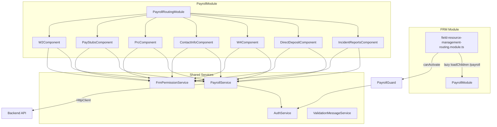
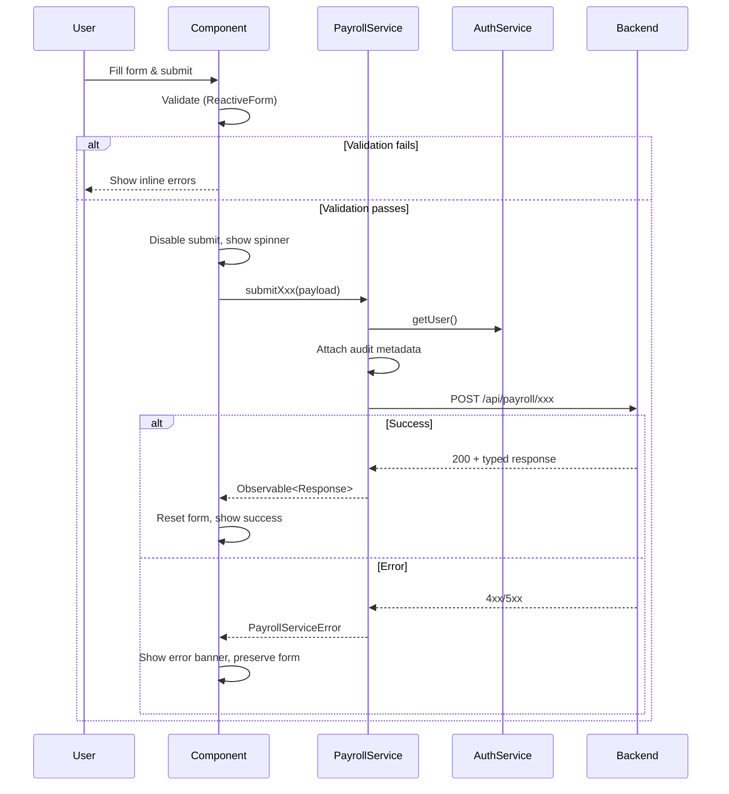

# Design Document: Back Office Employee Services

## Overview

This design describes the full implementation of the Back Office Employee Services (BOES) feature within the existing Field Resource Management (FRM) Angular module. The feature brings six service areas — Incident/Injury Reporting, Direct Deposit Changes, W-4 Changes, Contact Information Changes, PRC Signing, and Pay Stub/W-2 Viewing — from their current stub state to production quality.

The implementation builds on the existing scaffolded components under `src/app/features/field-resource-management/components/payroll/`, the existing `PayrollGuard`, `FrmPermissionService`, and `PayrollRoutingModule`. A new `PayrollService` will centralize all HTTP communication with the backend API, and each stub component will be upgraded with reactive forms, validation, error handling, audit trail integration, and role-based UI controls.

### Key Design Decisions

1. **Single `PayrollService` at root level** — All BOES HTTP calls go through one injectable service, keeping components thin and testable.
2. **Extend existing models** — The `payroll.models.ts` file already defines partial interfaces. We extend them in-place rather than creating a parallel model file.
3. **Reactive Forms everywhere** — All write forms use Angular `ReactiveFormsModule` with synchronous validators for field-level feedback.
4. **Role-based UI via `FrmPermissionService`** — Components query permissions at init to show/hide write controls. No new guard is needed; the existing `PayrollGuard` handles route-level access.
5. **Audit payload embedded in request** — The `PayrollService` attaches audit metadata (user id, name, role, UTC timestamp) to every write request payload. The backend persists the audit trail; the frontend does not maintain a separate audit store.
6. **PDF download via Blob** — Pay stub and W-2 PDF downloads use `responseType: 'blob'` and trigger a browser file-save via a temporary anchor element.

---

## Architecture



### Request Flow (Write Operations)



---

## Components and Interfaces

### PayrollService

Location: `src/app/features/field-resource-management/services/payroll.service.ts`

Provided at root level (`providedIn: 'root'`). Injects `HttpClient` and `AuthService`.

```typescript
@Injectable({ providedIn: 'root' })
export class PayrollService {
  // Incident Reports
  getIncidentReports(filters?: IncidentReportFilters): Observable<IncidentReport[]>;
  createIncidentReport(payload: CreateIncidentReportPayload): Observable<IncidentReport>;

  // Direct Deposit
  submitDirectDepositChange(payload: DirectDepositPayload): Observable<DirectDepositChange>;
  getDirectDepositHistory(employeeId: string): Observable<DirectDepositChange[]>;

  // W-4
  submitW4Change(payload: W4Payload): Observable<W4Change>;
  getW4History(employeeId: string): Observable<W4Change[]>;

  // Contact Info
  submitContactInfoChange(payload: ContactInfoPayload): Observable<ContactInfoChange>;
  getContactInfoHistory(employeeId: string): Observable<ContactInfoChange[]>;

  // PRC
  signPrc(payload: PrcPayload): Observable<PrcSignature>;
  getPrcHistory(employeeId: string): Observable<PrcSignature[]>;
  getPrcByDocRef(employeeId: string, documentRef: string): Observable<PrcSignature | null>;

  // Pay Stubs
  getPayStubs(employeeId: string, params?: PayStubFilters): Observable<PayStub[]>;
  getPayStubPdf(employeeId: string, payPeriod: string): Observable<Blob>;

  // W-2
  getW2Documents(employeeId: string, taxYear?: number): Observable<W2Document[]>;
  getW2Pdf(employeeId: string, taxYear: number): Observable<Blob>;
  getAvailableTaxYears(employeeId: string): Observable<number[]>;
}
```

Every write method internally calls `AuthService.getUser()` to obtain the authenticated user's `id`, `name`, and `role`, then attaches these plus a UTC timestamp to the request body before sending.

Error responses are caught and mapped to:

```typescript
export interface PayrollServiceError {
  statusCode: number;
  message: string;
  operation: string;
}
```

### Component Upgrades

Each component follows the same pattern:

1. Inject `PayrollService`, `FrmPermissionService`, `AuthService`, `ValidationMessageService`.
2. On init, resolve the user's role and compute a `readOnly` flag.
3. Build a `FormGroup` with validators matching the requirement constraints.
4. On submit: disable button, call service, handle success (reset + confirmation) or error (banner + preserve).
5. For list views: call the appropriate `get*` method and bind to a table with sorting/filtering.

### UnsavedChangesGuard

Location: `src/app/features/field-resource-management/guards/unsaved-changes.guard.ts`

A new `CanDeactivate` guard that checks if the component implements a `hasUnsavedChanges()` method. If true, it shows a browser `confirm()` dialog before allowing navigation away.

```typescript
export interface HasUnsavedChanges {
  hasUnsavedChanges(): boolean;
}
```

Applied to all write-capable routes in `PayrollRoutingModule`.

### PDF Download Utility

A shared helper function used by `PayStubsComponent` and `W2Component`:

```typescript
function triggerBlobDownload(blob: Blob, filename: string): void {
  const url = URL.createObjectURL(blob);
  const a = document.createElement('a');
  a.href = url;
  a.download = filename;
  a.click();
  URL.revokeObjectURL(url);
}
```

---

## Data Models

All models live in `src/app/features/field-resource-management/models/payroll.models.ts`. The existing interfaces are extended to match the full requirements.

### IncidentReport (extended)

```typescript
export type IncidentType = 'auto_accident' | 'work_injury' | 'other';

export interface IncidentReport {
  id: string;
  type: IncidentType;
  employeeId: string;
  incidentDate: string;        // ISO date
  description: string;
  reportedBy: string;
  reportedAt: string;          // ISO datetime
}

export interface CreateIncidentReportPayload {
  employeeId: string;
  type: IncidentType;
  incidentDate: string;
  description: string;
}

export interface IncidentReportFilters {
  type?: IncidentType;
  employeeId?: string;
  dateFrom?: string;
  dateTo?: string;
}
```

### DirectDepositChange (extended)

```typescript
export type AccountType = 'checking' | 'savings';

export interface DirectDepositChange {
  id: string;
  employeeId: string;
  bankName: string;
  accountType: AccountType;
  bankAccountLast4: string;
  routingNumberLast4: string;
  submittedBy: string;
  submittedAt: string;
}

export interface DirectDepositPayload {
  employeeId: string;
  bankName: string;
  accountType: AccountType;
  routingNumber: string;
  accountNumber: string;
  accountNumberConfirm: string;
}
```

### W4Change (extended)

```typescript
export type FilingStatus =
  | 'single_or_married_filing_separately'
  | 'married_filing_jointly'
  | 'head_of_household';

export interface W4Change {
  id: string;
  employeeId: string;
  filingStatus: FilingStatus;
  multipleJobsOrSpouseWorks: boolean;
  claimDependents: number;
  otherIncome: number;
  deductions: number;
  extraWithholding: number;
  submittedBy: string;
  submittedAt: string;
}

export interface W4Payload {
  employeeId: string;
  filingStatus: FilingStatus;
  multipleJobsOrSpouseWorks: boolean;
  claimDependents: number;
  otherIncome: number;
  deductions: number;
  extraWithholding: number;
}
```

### ContactInfoChange (extended)

```typescript
export interface ContactInfoChange {
  id: string;
  employeeId: string;
  address?: string;
  phone?: string;
  email?: string;
  updatedBy: string;
  updatedAt: string;
  fieldsChanged: string[];
}

export interface ContactInfoPayload {
  employeeId: string;
  address?: string;
  phone?: string;
  email?: string;
}
```

### PrcSignature (unchanged)

```typescript
export interface PrcSignature {
  id: string;
  employeeId: string;
  signedBy: string;
  signedAt: string;
  documentRef: string;
}

export interface PrcPayload {
  employeeId: string;
  documentRef: string;
  signature: string;
}
```

### PayStub (new)

```typescript
export interface PayStub {
  id: string;
  employeeId: string;
  payPeriodStart: string;
  payPeriodEnd: string;
  grossPay: number;
  deductions: DeductionItem[];
  totalDeductions: number;
  netPay: number;
  paymentDate: string;
}

export interface DeductionItem {
  name: string;
  amount: number;
}

export interface PayStubFilters {
  year?: number;
  payPeriod?: string;
}
```

### W2Document (extended)

```typescript
export interface W2Document {
  id: string;
  employeeId: string;
  taxYear: number;
  employerName: string;
  employeeName: string;
  wagesTips: number;
  federalIncomeTaxWithheld: number;
  socialSecurityWages: number;
  socialSecurityTaxWithheld: number;
  medicareWages: number;
  medicareTaxWithheld: number;
}
```

### PayrollServiceError

```typescript
export interface PayrollServiceError {
  statusCode: number;
  message: string;
  operation: string;
}
```

### AuditMetadata (attached to every write request)

```typescript
export interface AuditMetadata {
  userId: string;
  userName: string;
  userRole: string;
  timestamp: string;  // ISO UTC
}
```

