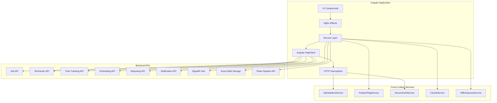

# Design Document: Backend Service Integration

## Overview

This design document specifies the technical architecture for implementing fully functional backend service layers in the SRI Frontend Angular application. The existing NgRx state management infrastructure is complete with actions, reducers, effects, and selectors, but all service implementations currently use placeholder TODO comments. This design replaces those placeholders with real HTTP-based API integrations.

### Design Goals

1. **Replace Placeholder Implementations**: Convert all TODO comments in services to real API calls
2. **Maintain Backward Compatibility**: Ensure existing NgRx effects continue to work without modification
3. **Consistent Error Handling**: Implement uniform error transformation across all services
4. **Type Safety**: Maintain strong typing throughout the service layer
5. **Environment Configuration**: Support multiple deployment environments (dev, staging, production)
6. **Feature Flag Support**: Enable gradual rollout of new functionality
7. **Security**: Implement proper authentication and authorization
8. **Performance**: Include caching, retry logic, and optimized data transfer

### Scope

This design covers:
- Angular service implementations for Job, Technician, Time Tracking, Scheduling, Reporting, and Notification operations
- HTTP client configuration and interceptors
- Data Transfer Objects (DTOs) and domain model transformations
- Error handling and retry strategies
- Feature flag integration for SignalR, offline mode, and role-based workflows
- File upload services for Azure Blob Storage and Fluke pipeline
- API authentication and authorization
- Environment-specific configuration

### Out of Scope

- Backend API implementation (assumes APIs exist)
- Database schema design
- Infrastructure provisioning
- UI component modifications (except where services are consumed)

## Architecture

### High-Level Architecture



### Service Layer Architecture

The service layer follows a consistent pattern across all domain services:

1. **Base Service Pattern**: All services use Angular's HttpClient for API communication
2. **Dependency Injection**: Services are provided at root level for singleton behavior
3. **Observable-Based**: All async operations return RxJS Observables
4. **Error Handling**: Centralized error transformation with user-friendly messages
5. **Retry Logic**: GET requests automatically retry up to 2 times
6. **Type Safety**: Strong typing with TypeScript interfaces for all requests/responses

### Service Organization

```
src/app/features/field-resource-management/services/
├── job.service.ts                    # Job CRUD and operations
├── technician.service.ts             # Technician management
├── time-tracking.service.ts          # Time entry and geolocation
├── scheduling.service.ts             # Assignment and conflict detection
├── reporting.service.ts              # Analytics and exports
├── notification.service.ts           # Notification management
├── frm-signalr.service.ts           # Real-time updates
├── cache.service.ts                  # Response caching
├── offline-queue.service.ts          # Offline request queuing
├── frm-notification-adapter.service.ts  # ARK integration
└── geolocation.service.ts            # Geolocation utilities
```

## Components and Interfaces

### Core Service Interfaces

#### JobService

**Responsibilities:**
- Job CRUD operations (create, read, update, delete)
- Job status management
- Job notes and attachments
- Batch job operations
- Template-based job creation

**Key Methods:**
```typescript
interface JobService {
  getJobs(filters?: JobFilters): Observable<Job[]>
  getJobById(id: string): Observable<Job>
  createJob(job: CreateJobDto): Observable<Job>
  updateJob(id: string, job: UpdateJobDto): Observable<Job>
  deleteJob(id: string): Observable<void>
  deleteJobs(ids: string[]): Observable<void>
  updateJobStatus(id: string, status: JobStatus, reason?: string): Observable<Job>
  getJobStatusHistory(id: string): Observable<StatusHistory[]>
  addJobNote(id: string, note: string): Observable<JobNote>
  getJobNotes(id: string): Observable<JobNote[]>
  uploadJobAttachment(id: string, file: File): Observable<HttpEvent<Attachment>>
  getJobAttachments(id: string): Observable<Attachment[]>
}
```

**API Endpoints:**
- `GET /api/jobs` - List jobs with filtering
- `GET /api/jobs/{id}` - Get single job
- `POST /api/jobs` - Create job
- `PUT /api/jobs/{id}` - Update job
- `DELETE /api/jobs/{id}` - Delete single job
- `DELETE /api/jobs` (with body) - Delete multiple jobs
- `PATCH /api/jobs/{id}/status` - Update job status
- `GET /api/jobs/{id}/status-history` - Get status history
- `POST /api/jobs/{id}/notes` - Add note
- `GET /api/jobs/{id}/notes` - Get notes
- `POST /api/jobs/{id}/attachments` - Upload attachment
- `GET /api/jobs/{id}/attachments` - Get attachments

#### TechnicianService

**Responsibilities:**
- Technician CRUD operations
- Skills and certifications management
- Availability tracking
- Role-based filtering (CM users see only their market)
- Certification expiration monitoring

**Key Methods:**
```typescript
interface TechnicianService {
  getTechnicians(filters?: TechnicianFilters): Observable<Technician[]>
  getTechnicianById(id: string): Observable<Technician>
  createTechnician(technician: CreateTechnicianDto): Observable<Technician>
  updateTechnician(id: string, technician: UpdateTechnicianDto): Observable<Technician>
  deleteTechnician(id: string): Observable<void>
  getTechnicianSkills(id: string): Observable<Skill[]>
  addTechnicianSkill(id: string, skill: Skill): Observable<void>
  removeTechnicianSkill(id: string, skillId: string): Observable<void>
  getTechnicianCertifications(id: string): Observable<Certification[]>
  getExpiringCertifications(daysThreshold: number): Observable<Certification[]>
  getTechnicianAvailability(id: string, dateRange: DateRange): Observable<Availability[]>
  updateTechnicianAvailability(id: string, availability: Availability[]): Observable<void>
  validateTechnicianAssignment(technicianId: string, projectMarket: string): Observable<boolean>
}
```

**API Endpoints:**
- `GET /api/technicians` - List technicians (with market filtering for CM users)
- `GET /api/technicians/{id}` - Get single technician
- `POST /api/technicians` - Create technician
- `PUT /api/technicians/{id}` - Update technician
- `DELETE /api/technicians/{id}` - Delete technician
- `GET /api/technicians/{id}/skills` - Get skills
- `POST /api/technicians/{id}/skills` - Add skill
- `DELETE /api/technicians/{id}/skills/{skillId}` - Remove skill
- `GET /api/technicians/{id}/certifications` - Get certifications
- `GET /api/technicians/certifications/expiring` - Get expiring certifications
- `GET /api/technicians/{id}/availability` - Get availability
- `PUT /api/technicians/{id}/availability` - Update availability

#### TimeTrackingService

**Responsibilities:**
- Clock in/out operations
- Geolocation capture
- Time entry management
- Labor hour calculations
- Manual time adjustments (admin only)

**Key Methods:**
```typescript
interface TimeTrackingService {
  clockIn(jobId: string, technicianId: string, captureLocation?: boolean): Observable<TimeEntry>
  clockOut(timeEntryId: string, captureLocation?: boolean, manualMileage?: number): Observable<TimeEntry>
  getTimeEntries(filters?: TimeEntryFilters): Observable<TimeEntry[]>
  updateTimeEntry(id: string, entry: UpdateTimeEntryDto): Observable<TimeEntry>
  getActiveTimeEntry(technicianId: string): Observable<TimeEntry | null>
  getTimeEntriesByJob(jobId: string): Observable<TimeEntry[]>
  getTimeEntriesByTechnician(technicianId: string, dateRange: DateRange): Observable<TimeEntry[]>
  calculateLaborHours(jobId: string): Observable<LaborSummary>
}
```

**API Endpoints:**
- `POST /api/time-entries/clock-in` - Clock in
- `POST /api/time-entries/clock-out` - Clock out
- `GET /api/time-entries` - List time entries
- `PUT /api/time-entries/{id}` - Update time entry (admin)
- `GET /api/time-entries/active` - Get active entry
- `GET /api/time-entries/by-job/{jobId}` - Get by job
- `GET /api/time-entries/by-technician/{technicianId}` - Get by technician
- `GET /api/time-entries/labor-summary/{jobId}` - Calculate labor

#### SchedulingService

**Responsibilities:**
- Technician assignment to jobs
- Conflict detection and resolution
- Skill matching
- Schedule retrieval
- Bulk assignment operations

**Key Methods:**
```typescript
interface SchedulingService {
  assignTechnician(jobId: string, technicianId: string, overrideConflicts?: boolean, justification?: string): Observable<Assignment>
  unassignTechnician(assignmentId: string): Observable<void>
  reassignJob(jobId: string, fromTechnicianId: string, toTechnicianId: string, reason?: string): Observable<Assignment>
  getAssignments(filters?: AssignmentFilters): Observable<Assignment[]>
  checkConflicts(technicianId: string, jobId: string): Observable<Conflict[]>
  detectAllConflicts(dateRange?: DateRange): Observable<Conflict[]>
  getQualifiedTechnicians(jobId: string): Observable<TechnicianMatch[]>
  getTechnicianSchedule(technicianId: string, dateRange: DateRange): Observable<ScheduleItem[]>
  bulkAssign(assignments: AssignmentDto[]): Observable<AssignmentResult[]>
}
```

**API Endpoints:**
- `POST /api/scheduling/assign` - Assign technician
- `DELETE /api/scheduling/assignments/{id}` - Unassign
- `POST /api/scheduling/reassign` - Reassign job
- `GET /api/scheduling/assignments` - List assignments
- `GET /api/scheduling/conflicts/check` - Check conflicts
- `GET /api/scheduling/conflicts` - Detect all conflicts
- `GET /api/scheduling/qualified-technicians/{jobId}` - Find qualified technicians
- `GET /api/scheduling/schedule/{technicianId}` - Get schedule
- `POST /api/scheduling/bulk-assign` - Bulk assign

#### ReportingService

**Responsibilities:**
- Dashboard metrics
- Utilization reports
- Performance reports
- KPI calculations
- Report exports (CSV, PDF)
- Response caching

**Key Methods:**
```typescript
interface ReportingService {
  getDashboardMetrics(): Observable<DashboardMetrics>
  getUtilizationReport(dateRange: DateRange): Observable<UtilizationReport>
  getPerformanceReport(dateRange: DateRange): Observable<PerformanceReport>
  getKPIs(): Observable<KPIMetrics>
  getScheduleAdherence(dateRange: DateRange): Observable<ScheduleAdherenceReport>
  exportReport(reportType: string, format: 'csv' | 'pdf', filters?: any): Observable<Blob>
}
```

**API Endpoints:**
- `GET /api/reports/dashboard` - Dashboard metrics (cached 5 min)
- `GET /api/reports/utilization` - Utilization report (cached 1 min)
- `GET /api/reports/performance` - Performance report (cached 1 min)
- `GET /api/reports/kpis` - KPIs (cached 5 min)
- `GET /api/reports/schedule-adherence` - Schedule adherence (cached 1 min)
- `GET /api/reports/export/{reportType}` - Export report

#### NotificationService

**Responsibilities:**
- Notification retrieval
- Mark as read operations
- Notification preferences
- Notification deletion
- Integration with ARK notification system

**Key Methods:**
```typescript
interface NotificationService {
  getNotifications(filters?: NotificationFilters): Observable<Notification[]>
  markAsRead(id: string): Observable<void>
  markAllAsRead(): Observable<void>
  getUnreadCount(): Observable<number>
  getPreferences(): Observable<NotificationPreferences>
  updatePreferences(preferences: NotificationPreferences): Observable<void>
  deleteNotification(id: string): Observable<void>
}
```

**API Endpoints:**
- `GET /api/notifications` - List notifications
- `PATCH /api/notifications/{id}/read` - Mark as read
- `PATCH /api/notifications/read-all` - Mark all as read
- `GET /api/notifications/unread-count` - Get unread count
- `GET /api/notifications/preferences` - Get preferences
- `PUT /api/notifications/preferences` - Update preferences
- `DELETE /api/notifications/{id}` - Delete notification

### Feature Flag Services

#### FrmSignalRService

**Responsibilities:**
- Real-time WebSocket connections
- Event subscription (job assignments, status changes, notifications)
- Connection lifecycle management
- Feature flag integration (liveUpdates)

**Key Methods:**
```typescript
interface FrmSignalRService {
  connect(): Promise<void>
  disconnect(): Promise<void>
  isConnected(): boolean
  onJobAssigned(callback: (assignment: Assignment) => void): void
  onJobStatusChanged(callback: (update: JobStatusUpdate) => void): void
  onNotificationReceived(callback: (notification: Notification) => void): void
}
```

**Feature Flag:** `liveUpdates`

#### OfflineQueueService

**Responsibilities:**
- Queue failed API requests
- Replay queued requests when connectivity restored
- Notify users of offline mode
- Feature flag integration (offlineMode)

**Key Methods:**
```typescript
interface OfflineQueueService {
  queueRequest(request: QueuedRequest): void
  replayQueue(): Observable<QueueReplayResult[]>
  clearQueue(): void
  getQueueSize(): number
  isOffline(): boolean
}
```

**Feature Flag:** `offlineMode`

#### CacheService

**Responsibilities:**
- Cache API responses
- Cache invalidation
- TTL management
- Memory-efficient storage

**Key Methods:**
```typescript
interface CacheService {
  get<T>(key: string): T | null
  set<T>(key: string, value: T, ttlSeconds: number): void
  invalidate(key: string): void
  invalidatePattern(pattern: string): void
  clear(): void
}
```

**Cache Configuration:**
- Dashboard metrics: 5 minutes
- Report data: 1 minute
- KPI data: 5 minutes
- Invalidate on data mutations

### File Upload Services

#### AzureBlobStorageService

**Responsibilities:**
- Upload photos to Azure Blob Storage
- Generate unique blob names
- SAS token authentication
- Progress tracking
- File validation (format, size)

**Key Methods:**
```typescript
interface AzureBlobStorageService {
  uploadPhoto(file: File, deploymentId: string): Observable<UploadProgress>
  validateFile(file: File): ValidationResult
  generateBlobName(originalFilename: string): string
}
```

**Validation Rules:**
- Supported formats: JPEG, PNG, HEIC
- Maximum size: 10 MB
- Unique naming: `{timestamp}_{originalFilename}`

#### FlukeUploadService

**Responsibilities:**
- Upload Fluke test result files
- File validation
- Batch upload support
- Processing status tracking

**Key Methods:**
```typescript
interface FlukeUploadService {
  uploadTestFile(file: File, deploymentId: string): Observable<UploadProgress>
  uploadBatch(files: File[], deploymentId: string): Observable<BatchUploadProgress>
  validateFile(file: File): ValidationResult
  getProcessingStatus(uploadId: string): Observable<ProcessingStatus>
}
```

**Validation Rules:**
- Maximum size: 50 MB
- Batch support: multiple files per deployment
- Processing notification on completion

## Data Models

### Domain Models

#### Job Model
```typescript
interface Job {
  id: string;
  title: string;
  description: string;
  status: JobStatus;
  priority: JobPriority;
  jobType: string;
  client: string;
  location: Location;
  scheduledStartDate: Date;
  scheduledEndDate: Date;
  estimatedHours: number;
  requiredSkills: string[];
  assignedTechnicians: string[];
  createdBy: string;
  createdAt: Date;
  updatedAt: Date;
}

enum JobStatus {
  Pending = 'Pending',
  Assigned = 'Assigned',
  InProgress = 'InProgress',
  OnHold = 'OnHold',
  Issue = 'Issue',
  Completed = 'Completed',
  Cancelled = 'Cancelled'
}

enum JobPriority {
  Low = 'Low',
  Medium = 'Medium',
  High = 'High',
  Critical = 'Critical'
}
```

#### Technician Model
```typescript
interface Technician {
  id: string;
  firstName: string;
  lastName: string;
  email: string;
  phone: string;
  role: TechnicianRole;
  skills: Skill[];
  certifications: Certification[];
  region: string;
  isActive: boolean;
  isAvailable: boolean;
  currentWorkload: number;
  createdAt: Date;
  updatedAt: Date;
}

interface Skill {
  id: string;
  name: string;
  level: SkillLevel;
  yearsExperience: number;
}

interface Certification {
  id: string;
  name: string;
  issueDate: Date;
  expirationDate: Date;
  issuingOrganization: string;
}

enum SkillLevel {
  Beginner = 'Beginner',
  Intermediate = 'Intermediate',
  Advanced = 'Advanced',
  Expert = 'Expert'
}
```

#### TimeEntry Model
```typescript
interface TimeEntry {
  id: string;
  jobId: string;
  technicianId: string;
  clockInTime: Date;
  clockOutTime?: Date;
  clockInLocation?: GeoLocation;
  clockOutLocation?: GeoLocation;
  totalHours?: number;
  mileage?: number;
  isManuallyAdjusted: boolean;
  adjustedBy?: string;
  adjustmentReason?: string;
  createdAt: Date;
  updatedAt: Date;
}

interface GeoLocation {
  latitude: number;
  longitude: number;
  accuracy: number;
}
```

#### Assignment Model
```typescript
interface Assignment {
  id: string;
  jobId: string;
  technicianId: string;
  assignedBy: string;
  assignedAt: Date;
  isActive: boolean;
  conflictOverride: boolean;
  overrideJustification?: string;
}

interface Conflict {
  type: ConflictType;
  technicianId: string;
  jobId: string;
  conflictingJobId: string;
  timeRange: DateRange;
  severity: ConflictSeverity;
}

enum ConflictType {
  TimeOverlap = 'TimeOverlap',
  SkillMismatch = 'SkillMismatch',
  Unavailable = 'Unavailable',
  Overbooked = 'Overbooked'
}

interface TechnicianMatch {
  technicianId: string;
  matchPercentage: number;
  matchingSkills: string[];
  missingSkills: string[];
  isAvailable: boolean;
  currentWorkload: number;
}
```

### Data Transfer Objects (DTOs)

#### Job DTOs
```typescript
interface CreateJobDto {
  title: string;
  description: string;
  priority: JobPriority;
  jobType: string;
  client: string;
  location: Location;
  scheduledStartDate: Date;
  scheduledEndDate: Date;
  estimatedHours: number;
  requiredSkills: string[];
}

interface UpdateJobDto {
  title?: string;
  description?: string;
  priority?: JobPriority;
  status?: JobStatus;
  location?: Location;
  scheduledStartDate?: Date;
  scheduledEndDate?: Date;
  estimatedHours?: number;
  requiredSkills?: string[];
}

interface JobFilters {
  searchTerm?: string;
  status?: JobStatus;
  priority?: JobPriority;
  jobType?: string;
  client?: string;
  technicianId?: string;
  region?: string;
  dateRange?: DateRange;
  page?: number;
  pageSize?: number;
}
```

#### Technician DTOs
```typescript
interface CreateTechnicianDto {
  firstName: string;
  lastName: string;
  email: string;
  phone: string;
  role: TechnicianRole;
  region: string;
  skills?: Skill[];
}

interface UpdateTechnicianDto {
  firstName?: string;
  lastName?: string;
  email?: string;
  phone?: string;
  role?: TechnicianRole;
  region?: string;
  isActive?: boolean;
  isAvailable?: boolean;
}

interface TechnicianFilters {
  searchTerm?: string;
  role?: TechnicianRole;
  skills?: string[];
  region?: string;
  isAvailable?: boolean;
  isActive?: boolean;
  page?: number;
  pageSize?: number;
}
```

#### Time Tracking DTOs
```typescript
interface ClockInDto {
  jobId: string;
  technicianId: string;
  clockInTime: Date;
  clockInLocation?: GeoLocation;
}

interface ClockOutDto {
  timeEntryId: string;
  clockOutTime: Date;
  clockOutLocation?: GeoLocation;
  mileage?: number;
}

interface UpdateTimeEntryDto {
  clockInTime?: Date;
  clockOutTime?: Date;
  mileage?: number;
  adjustmentReason: string;
}

interface TimeEntryFilters {
  technicianId?: string;
  jobId?: string;
  dateRange?: DateRange;
  isManuallyAdjusted?: boolean;
  page?: number;
  pageSize?: number;
}
```

#### Scheduling DTOs
```typescript
interface AssignmentDto {
  jobId: string;
  technicianId: string;
  overrideConflicts?: boolean;
  justification?: string;
}

interface ReassignmentDto {
  jobId: string;
  fromTechnicianId: string;
  toTechnicianId: string;
  reason?: string;
}

interface BulkAssignmentDto {
  assignments: AssignmentDto[];
}

interface AssignmentFilters {
  technicianId?: string;
  jobId?: string;
  dateRange?: DateRange;
  isActive?: boolean;
  page?: number;
  pageSize?: number;
}
```

### Response Transformation

All services transform API responses into domain models:

1. **Date Parsing**: ISO date strings → JavaScript Date objects
2. **Null Handling**: Undefined/null values → appropriate defaults
3. **Type Validation**: Runtime validation of required fields
4. **Enum Mapping**: String values → TypeScript enums

Example transformation:
```typescript
private transformJob(apiResponse: any): Job {
  return {
    ...apiResponse,
    scheduledStartDate: new Date(apiResponse.scheduledStartDate),
    scheduledEndDate: new Date(apiResponse.scheduledEndDate),
    createdAt: new Date(apiResponse.createdAt),
    updatedAt: new Date(apiResponse.updatedAt),
    status: apiResponse.status as JobStatus,
    priority: apiResponse.priority as JobPriority
  };
}
```


## Correctness Properties

*A property is a characteristic or behavior that should hold true across all valid executions of a system-essentially, a formal statement about what the system should do. Properties serve as the bridge between human-readable specifications and machine-verifiable correctness guarantees.*

### Property 1: HTTP Method and Endpoint Correctness

*For any* service method call, the HTTP request should use the correct HTTP method (GET, POST, PUT, PATCH, DELETE) and target the correct API endpoint path as specified in the API contract.

**Validates: Requirements 1.1, 1.2, 1.3, 1.4, 1.5, 2.1-2.12, 3.1-3.10, 4.1-4.10, 6.1-6.10, 7.1-7.5, 8.1-8.5, 9.1-9.2, 10.1-10.5, 11.1-11.7, 12.1-12.5, 13.1-13.5, 15.1-15.5**

### Property 2: Authentication Header Inclusion

*For any* HTTP request made by any service, the request should include authentication headers obtained from ApiHeadersService, including the Authorization header and X-Market header for CM users.

**Validates: Requirements 1.7, 27.1, 27.2, 27.3**

### Property 3: Base URL Configuration

*For any* API endpoint URL constructed by any service, the URL should start with the base URL from Environment_Config.apiUrl.

**Validates: Requirements 1.8, 30.1, 30.2, 30.3, 30.4**

### Property 4: Error Status Code Transformation

*For any* HTTP error response with a status code, the service should transform it into a user-friendly error message according to the status code mapping (400 → "Invalid request", 401 → "Unauthorized", 403 → "Access denied", 404 → resource-specific "Not found", 409 → conflict-specific message, 413 → "File too large", 415 → "Unsupported file type", 500 → "Server error").

**Validates: Requirements 1.6, 26.1, 26.2, 26.3, 26.4, 26.5, 26.6, 26.7, 26.8**

### Property 5: Error Logging and Stack Trace Preservation

*For any* HTTP error, the service should log the error to console for debugging and preserve the error stack trace in the returned Observable error.

**Validates: Requirements 26.8, 26.9, 26.10**

### Property 6: GET Request Retry Logic

*For any* HTTP GET request that fails, the service should automatically retry the request up to 2 times before returning an error.

**Validates: Requirements 1.9, 29.1**

### Property 7: Non-GET Request No Retry

*For any* HTTP POST, PUT, PATCH, or DELETE request that fails, the service should NOT retry the request and should immediately return an error.

**Validates: Requirements 29.2**

### Property 8: 4xx Error No Retry

*For any* HTTP request that fails with a 4xx status code (client error), the service should NOT retry the request regardless of HTTP method.

**Validates: Requirements 29.4**

### Property 9: 5xx Error Retry for GET

*For any* HTTP GET request that fails with a 5xx status code (server error), the service should retry the request up to 2 times.

**Validates: Requirements 29.5**

### Property 10: Response Date Parsing

*For any* API response containing ISO date string fields, the service should parse those strings into JavaScript Date objects in the transformed domain model.

**Validates: Requirements 1.10, 28.2**

### Property 11: Response Null Handling

*For any* API response containing null or undefined values, the service should handle them gracefully without throwing errors, applying appropriate defaults where necessary.

**Validates: Requirements 28.3**

### Property 12: Response Field Validation

*For any* API response, the service should validate that required fields are present, and if validation fails, should return a descriptive error.

**Validates: Requirements 28.4, 28.5**

### Property 13: Cache TTL Enforcement

*For any* cached API response, the cache should serve the cached value if the request is made within the TTL period, and should fetch fresh data if the TTL has expired.

**Validates: Requirements 5.7, 5.8, 5.9**

### Property 14: Cache Invalidation on Mutation

*For any* data mutation operation (POST, PUT, PATCH, DELETE), the service should invalidate related cache entries to ensure subsequent reads return fresh data.

**Validates: Requirements 5.10**

### Property 15: Batch Operation Isolation

*For any* batch operation containing multiple individual operations, if one operation fails, the service should continue processing the remaining operations and return individual success/failure results for each.

**Validates: Requirements 14.3, 14.4, 14.5**

### Property 16: File Size Validation

*For any* file upload operation, if the file size exceeds the maximum allowed size (10 MB for job attachments and photos, 50 MB for Fluke files), the service should reject the upload before sending the HTTP request and return a "File too large" error.

**Validates: Requirements 9.4, 24.6, 25.4**

### Property 17: File Format Validation

*For any* file upload operation, if the file format is not in the list of supported formats (JPEG, PNG, HEIC for photos; specified formats for Fluke files), the service should reject the upload before sending the HTTP request and return an "Unsupported file type" error.

**Validates: Requirements 9.5, 24.5**

### Property 18: Upload Progress Reporting

*For any* file upload operation, the service should report upload progress using HttpRequest with reportProgress enabled, allowing consumers to track upload percentage.

**Validates: Requirements 9.3, 24.7, 25.5**

### Property 19: Feature Flag Enabled Behavior

*For any* feature flag that is enabled, the associated service functionality should be activated (e.g., when liveUpdates is enabled, SignalR connections should be established; when offlineMode is enabled, failed requests should be queued).

**Validates: Requirements 16.2, 17.2, 18.2, 19.2, 20.2, 21.2, 22.2, 23.2**

### Property 20: Feature Flag Disabled Behavior

*For any* feature flag that is disabled, the associated service functionality should be deactivated (e.g., when liveUpdates is disabled, SignalR connections should not be attempted; when offlineMode is disabled, failed requests should not be queued).

**Validates: Requirements 16.3, 17.4, 18.4, 19.4, 20.4, 21.5, 22.4, 23.4**

### Property 21: Role-Based Market Filtering for CM Users

*For any* API request made by a CM user (non-admin) to retrieve technicians, the service should include the user's market in the request parameters, and the returned results should only include technicians from that market.

**Validates: Requirements 2.11**

### Property 22: Role-Based No Filtering for Admin Users

*For any* API request made by an Admin user to retrieve technicians, the service should NOT include market filtering parameters, and the returned results should include all technicians regardless of market.

**Validates: Requirements 2.12**

### Property 23: Geolocation Capture on Clock In/Out

*For any* clock in or clock out operation where geolocation capture is enabled, the service should attempt to capture the current geolocation (latitude, longitude, accuracy) and include it in the API request.

**Validates: Requirements 3.9**

### Property 24: Geolocation Failure Graceful Degradation

*For any* clock in or clock out operation where geolocation capture fails, the service should proceed with the clock in/out operation without location data rather than failing the entire operation.

**Validates: Requirements 3.10**

### Property 25: Conflict Override Justification Requirement

*For any* assignment operation where conflict override is requested (overrideConflicts = true), the service should require a justification parameter in the request, and if justification is missing, should return an error.

**Validates: Requirements 4.10**

### Property 26: Unique Blob Name Generation

*For any* photo upload to Azure Blob Storage, the service should generate a unique blob name by combining a timestamp with the original filename to prevent naming collisions.

**Validates: Requirements 24.3**

### Property 27: Blob URL Return After Upload

*For any* successful file upload to Azure Blob Storage, the service should return the blob URL, which should then be stored in the deployment record.

**Validates: Requirements 24.4, 24.10**

### Property 28: Offline Queue Replay on Connectivity Restore

*For any* queued request in the offline queue, when connectivity is restored, the service should replay the queued requests in order and return results for each.

**Validates: Requirements 17.4**

### Property 29: Offline Mode User Notification

*For any* operation performed while in offline mode, the service should notify the user that they are operating in offline mode.

**Validates: Requirements 17.5**

### Property 30: SignalR Event Dispatch to NgRx

*For any* real-time event received via SignalR (job assignment, job status change, notification), the service should dispatch the corresponding NgRx action to update the application state.

**Validates: Requirements 16.5**

## Error Handling

### Error Handling Strategy

All services implement a consistent error handling pattern:

1. **Catch HTTP Errors**: Use RxJS `catchError` operator to intercept errors
2. **Transform Errors**: Convert HTTP errors to user-friendly messages
3. **Log Errors**: Log all errors to console with full details
4. **Preserve Stack Traces**: Maintain error stack traces for debugging
5. **Return Observable Errors**: Use `throwError` to return errors as Observables

### Error Transformation Logic

```typescript
private handleError(error: any): Observable<never> {
  let errorMessage = 'An error occurred';
  
  if (error.error instanceof ErrorEvent) {
    // Client-side error
    errorMessage = `Error: ${error.error.message}`;
  } else {
    // Server-side error - map status codes to messages
    switch (error.status) {
      case 400:
        errorMessage = 'Invalid request. Please check your input.';
        break;
      case 401:
        errorMessage = 'Unauthorized. Please log in.';
        // Redirect to login
        break;
      case 403:
        errorMessage = 'Access denied. You do not have permission to perform this action.';
        break;
      case 404:
        errorMessage = `${this.resourceName} not found.`;
        break;
      case 409:
        errorMessage = this.getConflictMessage(error);
        break;
      case 413:
        errorMessage = 'File too large. Maximum file size is 10 MB.';
        break;
      case 415:
        errorMessage = 'Unsupported file type.';
        break;
      case 422:
        errorMessage = 'Validation failed. Please check your input.';
        break;
      case 500:
        errorMessage = 'Server error. Please try again later.';
        break;
    }
  }
  
  console.error(errorMessage, error);
  return throwError(() => new Error(errorMessage));
}
```

### Error Handling in NgRx Effects

NgRx effects handle service errors and dispatch failure actions:

```typescript
loadJobs$ = createEffect(() =>
  this.actions$.pipe(
    ofType(JobActions.loadJobs),
    switchMap(action =>
      this.jobService.getJobs(action.filters).pipe(
        map(jobs => JobActions.loadJobsSuccess({ jobs })),
        catchError(error => of(JobActions.loadJobsFailure({ error: error.message })))
      )
    )
  )
);
```

### Authentication Error Handling

When a 401 Unauthorized error occurs:
1. Service logs the error
2. Service returns error message "Unauthorized. Please log in."
3. Application redirects user to login page
4. User's authentication state is cleared

### Network Error Handling

When network errors occur:
1. GET requests automatically retry up to 2 times
2. If all retries fail, error is returned to caller
3. If offline mode is enabled, request is queued for later replay
4. User is notified of offline status

## Testing Strategy

### Dual Testing Approach

This feature requires both unit testing and property-based testing for comprehensive coverage:

**Unit Tests:**
- Specific examples of API calls with expected responses
- Edge cases (empty responses, malformed data, boundary conditions)
- Error conditions (specific status codes, network failures)
- Integration points between services and NgRx effects
- Feature flag toggling behavior
- File upload validation rules

**Property-Based Tests:**
- Universal properties that hold for all inputs
- HTTP method and endpoint correctness across all services
- Authentication header inclusion in all requests
- Error transformation for all status codes
- Response transformation for all API responses
- Retry logic for all GET requests
- Cache behavior for all cached endpoints
- Feature flag behavior for all flags

### Property-Based Testing Configuration

**Library:** fast-check (TypeScript property-based testing library)

**Configuration:**
- Minimum 100 iterations per property test
- Each test tagged with feature name and property number
- Tag format: `Feature: backend-service-integration, Property {number}: {property_text}`

**Example Property Test:**
```typescript
import fc from 'fast-check';

describe('Feature: backend-service-integration, Property 2: Authentication Header Inclusion', () => {
  it('should include authentication headers in all HTTP requests', () => {
    fc.assert(
      fc.property(
        fc.record({
          method: fc.constantFrom('GET', 'POST', 'PUT', 'PATCH', 'DELETE'),
          endpoint: fc.string(),
          body: fc.anything()
        }),
        (request) => {
          // Arrange: Mock HttpClient and ApiHeadersService
          const httpClient = jasmine.createSpyObj('HttpClient', [request.method.toLowerCase()]);
          const apiHeaders = jasmine.createSpyObj('ApiHeadersService', ['getApiHeaders']);
          const expectedHeaders = new HttpHeaders({
            'Authorization': 'Bearer token',
            'X-Market': 'TestMarket'
          });
          apiHeaders.getApiHeaders.and.returnValue(of(expectedHeaders));
          
          const service = new JobService(httpClient, apiHeaders);
          
          // Act: Make request
          service[`${request.method.toLowerCase()}Request`](request.endpoint, request.body);
          
          // Assert: Verify headers were included
          const callArgs = httpClient[request.method.toLowerCase()].calls.mostRecent().args;
          const headers = callArgs[callArgs.length - 1]?.headers;
          
          expect(headers.has('Authorization')).toBe(true);
          expect(headers.has('X-Market')).toBe(true);
        }
      ),
      { numRuns: 100 }
    );
  });
});
```

### Unit Test Examples

**Example: Job Creation**
```typescript
describe('JobService.createJob', () => {
  it('should send POST request to /api/jobs with job data', () => {
    const mockJob: CreateJobDto = {
      title: 'Test Job',
      description: 'Test Description',
      priority: JobPriority.High,
      jobType: 'Installation',
      client: 'Test Client',
      location: { address: '123 Main St', city: 'Test City', state: 'TS', zip: '12345' },
      scheduledStartDate: new Date('2024-01-01'),
      scheduledEndDate: new Date('2024-01-02'),
      estimatedHours: 8,
      requiredSkills: ['Fiber Optics']
    };
    
    const mockResponse: Job = { id: '123', ...mockJob, status: JobStatus.Pending };
    
    httpMock.expectOne(req => 
      req.method === 'POST' && 
      req.url === '/api/jobs'
    ).flush(mockResponse);
    
    service.createJob(mockJob).subscribe(job => {
      expect(job.id).toBe('123');
      expect(job.title).toBe('Test Job');
    });
  });
});
```

**Example: Error Handling**
```typescript
describe('JobService error handling', () => {
  it('should return "Job not found" for 404 errors', () => {
    httpMock.expectOne('/api/jobs/invalid-id').flush(
      { message: 'Not found' },
      { status: 404, statusText: 'Not Found' }
    );
    
    service.getJobById('invalid-id').subscribe(
      () => fail('Should have failed'),
      error => {
        expect(error.message).toBe('Job not found.');
      }
    );
  });
  
  it('should return "File too large" for 413 errors', () => {
    const largeFile = new File(['x'.repeat(11 * 1024 * 1024)], 'large.jpg');
    
    httpMock.expectOne('/api/jobs/123/attachments').flush(
      { message: 'Payload too large' },
      { status: 413, statusText: 'Payload Too Large' }
    );
    
    service.uploadJobAttachment('123', largeFile).subscribe(
      () => fail('Should have failed'),
      error => {
        expect(error.message).toBe('File too large. Maximum file size is 10 MB.');
      }
    );
  });
});
```

**Example: Retry Logic**
```typescript
describe('JobService retry logic', () => {
  it('should retry GET requests up to 2 times', fakeAsync(() => {
    let attemptCount = 0;
    
    service.getJobs().subscribe(
      () => fail('Should have failed'),
      error => {
        expect(attemptCount).toBe(3); // Initial + 2 retries
      }
    );
    
    // Fail initial request
    httpMock.expectOne('/api/jobs').flush(
      { message: 'Server error' },
      { status: 500, statusText: 'Internal Server Error' }
    );
    attemptCount++;
    
    tick(1000);
    
    // Fail first retry
    httpMock.expectOne('/api/jobs').flush(
      { message: 'Server error' },
      { status: 500, statusText: 'Internal Server Error' }
    );
    attemptCount++;
    
    tick(1000);
    
    // Fail second retry
    httpMock.expectOne('/api/jobs').flush(
      { message: 'Server error' },
      { status: 500, statusText: 'Internal Server Error' }
    );
    attemptCount++;
    
    tick(1000);
  }));
  
  it('should NOT retry POST requests', () => {
    const mockJob: CreateJobDto = { /* ... */ };
    
    service.createJob(mockJob).subscribe(
      () => fail('Should have failed'),
      error => {
        expect(error.message).toContain('Server error');
      }
    );
    
    httpMock.expectOne('/api/jobs').flush(
      { message: 'Server error' },
      { status: 500, statusText: 'Internal Server Error' }
    );
    
    // Verify no retry attempt
    httpMock.verify();
  });
});
```

**Example: Feature Flag Integration**
```typescript
describe('FrmSignalRService with feature flags', () => {
  it('should establish connection when liveUpdates flag is enabled', () => {
    featureFlagService.setFlag('liveUpdates', true);
    
    service.connect();
    
    expect(service.isConnected()).toBe(true);
  });
  
  it('should NOT establish connection when liveUpdates flag is disabled', () => {
    featureFlagService.setFlag('liveUpdates', false);
    
    service.connect();
    
    expect(service.isConnected()).toBe(false);
  });
});
```

**Example: Role-Based Filtering**
```typescript
describe('TechnicianService role-based filtering', () => {
  it('should filter technicians by market for CM users', () => {
    authService.setUser({ role: 'CM', market: 'West' });
    
    service.getTechnicians().subscribe(technicians => {
      expect(technicians.every(t => t.region === 'West')).toBe(true);
    });
    
    httpMock.expectOne(req => 
      req.url === '/api/technicians' && 
      req.params.get('market') === 'West'
    ).flush(mockTechnicians);
  });
  
  it('should NOT filter technicians for Admin users', () => {
    authService.setUser({ role: 'Admin' });
    
    service.getTechnicians().subscribe(technicians => {
      expect(technicians.length).toBeGreaterThan(0);
    });
    
    httpMock.expectOne(req => 
      req.url === '/api/technicians' && 
      !req.params.has('market')
    ).flush(mockTechnicians);
  });
});
```

### Integration Testing with NgRx

Integration tests verify that services work correctly with NgRx effects:

```typescript
describe('Job Effects Integration', () => {
  it('should load jobs and dispatch success action', () => {
    const mockJobs: Job[] = [/* ... */];
    
    actions$ = of(JobActions.loadJobs({ filters: {} }));
    
    effects.loadJobs$.subscribe(action => {
      expect(action.type).toBe(JobActions.loadJobsSuccess.type);
      expect(action.jobs).toEqual(mockJobs);
    });
    
    httpMock.expectOne('/api/jobs').flush(mockJobs);
  });
  
  it('should dispatch failure action on error', () => {
    actions$ = of(JobActions.loadJobs({ filters: {} }));
    
    effects.loadJobs$.subscribe(action => {
      expect(action.type).toBe(JobActions.loadJobsFailure.type);
      expect(action.error).toContain('Server error');
    });
    
    httpMock.expectOne('/api/jobs').flush(
      { message: 'Server error' },
      { status: 500, statusText: 'Internal Server Error' }
    );
  });
});
```

### Test Coverage Goals

- **Unit Test Coverage**: Minimum 80% code coverage
- **Property Test Coverage**: All 30 correctness properties implemented
- **Integration Test Coverage**: All NgRx effects tested with services
- **Edge Case Coverage**: All error conditions and boundary cases tested

### Continuous Integration

Tests run automatically on:
- Every commit to feature branches
- Pull request creation
- Merge to main branch

CI pipeline fails if:
- Any test fails
- Code coverage drops below 80%
- Property tests fail (indicating violated invariants)

