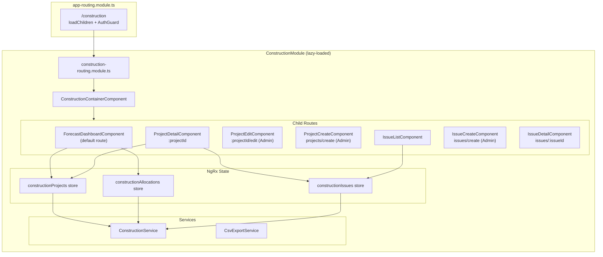

# Design Document: Construction Integration Module

## Overview

The Construction Integration module adds telecom construction deployment tracking and resource forecasting to the ARK/ATLAS application. It is a lazy-loaded Angular feature module at `src/app/features/construction-integration/` that follows the established atlas container-component routing pattern with NgRx state management.

The module provides four primary views:
1. **Forecast Dashboard** — annual grid of monthly headcount allocations per project, grouped by category
2. **Project Detail** — individual project view with resource allocations and associated issues
3. **Issue List** — filterable/sortable list of all construction issues across projects
4. **Issue Detail** — single issue view with status transition controls

Admin users get full CRUD access; non-admin users see read-only views. The existing `RoleGuard` + `AuthGuard` combination protects write routes, and components use `AuthService.isAdmin()` to conditionally render edit controls.

## Architecture



### Lazy Loading Registration

In `app-routing.module.ts`, a new route entry:

```typescript
{
  path: 'construction',
  loadChildren: () => import('./features/construction-integration/construction-integration.module')
    .then(m => m.ConstructionIntegrationModule),
  canActivate: [AuthGuard],
  data: { preload: true }
}
```

### Routing Structure

The module uses a container component pattern (like atlas) with child routes. Admin-only routes use `RoleGuard` with `expectedRoles: [UserRole.Admin]`.

```typescript
const routes: Routes = [
  {
    path: '',
    component: ConstructionContainerComponent,
    children: [
      { path: '', redirectTo: 'forecast', pathMatch: 'full' },
      { path: 'forecast', component: ForecastDashboardComponent },
      { path: 'projects/create', component: ProjectCreateComponent,
        canActivate: [RoleGuard], data: { expectedRoles: [UserRole.Admin] } },
      { path: 'projects/:projectId', component: ProjectDetailComponent },
      { path: 'projects/:projectId/edit', component: ProjectEditComponent,
        canActivate: [RoleGuard], data: { expectedRoles: [UserRole.Admin] } },
      { path: 'issues', component: IssueListComponent },
      { path: 'issues/create', component: IssueCreateComponent,
        canActivate: [RoleGuard], data: { expectedRoles: [UserRole.Admin] } },
      { path: 'issues/:issueId', component: IssueDetailComponent },
    ]
  }
];
```

## Components and Interfaces

### Module Structure

```
src/app/features/construction-integration/
├── construction-integration.module.ts
├── construction-integration-routing.module.ts
├── construction-container.component.ts
├── components/
│   ├── forecast-dashboard/
│   │   └── forecast-dashboard.component.ts|html|scss
│   ├── project-detail/
│   │   └── project-detail.component.ts|html|scss
│   ├── project-create/
│   │   └── project-create.component.ts|html|scss
│   ├── project-edit/
│   │   └── project-edit.component.ts|html|scss
│   ├── issue-list/
│   │   └── issue-list.component.ts|html|scss
│   ├── issue-create/
│   │   └── issue-create.component.ts|html|scss
│   └── issue-detail/
│       └── issue-detail.component.ts|html|scss
├── models/
│   └── construction.models.ts
├── services/
│   ├── construction.service.ts
│   └── csv-export.service.ts
└── state/
    ├── projects/
    │   ├── project.actions.ts
    │   ├── project.reducer.ts
    │   ├── project.effects.ts
    │   ├── project.selectors.ts
    │   └── project.state.ts
    ├── allocations/
    │   ├── allocation.actions.ts
    │   ├── allocation.reducer.ts
    │   ├── allocation.effects.ts
    │   ├── allocation.selectors.ts
    │   └── allocation.state.ts
    └── issues/
        ├── issue.actions.ts
        ├── issue.reducer.ts
        ├── issue.effects.ts
        ├── issue.selectors.ts
        └── issue.state.ts
```

### Component Responsibilities

**ConstructionContainerComponent** — Shell with `<router-outlet>`, sidebar navigation between forecast/issues views. Minimal layout wrapper.

**ForecastDashboardComponent** — Renders the year-selector, the tabular grid (projects × months), category grouping, row/column totals. Injects `AuthService` to toggle inline cell editing for admins. Dispatches NgRx actions for loading allocations and projects. Provides CSV export button.

**ProjectDetailComponent** — Displays project metadata (name, client, location, category), its 12-month allocation row, and a filtered issue list for that project. Shows edit/create buttons only for admins via `AuthService.isAdmin()`.

**ProjectCreateComponent / ProjectEditComponent** — Reactive forms for project CRUD. Route-guarded to Admin only. Validates required fields (name, clientName, location, category).

**IssueListComponent** — PrimeNG table with filters for severity, status, and project. Sortable columns. CSV export button. Admin users see create/edit/transition buttons; non-admins see read-only.

**IssueCreateComponent** — Reactive form for new issue (project, description, severity). Route-guarded to Admin.

**IssueDetailComponent** — Displays issue details. Admin users see status transition buttons (OPEN→IN_PROGRESS→RESOLVED→CLOSED). Non-admins see read-only view.

### Admin vs Non-Admin UI Rendering

Components inject `AuthService` and call `isAdmin()` to conditionally show/hide controls:

```typescript
@Component({ ... })
export class ForecastDashboardComponent implements OnInit {
  isAdmin = false;

  constructor(private authService: AuthService) {
    this.isAdmin = this.authService.isAdmin();
  }
}
```

In templates:
```html
<button *ngIf="isAdmin" (click)="createProject()">Add Project</button>
<span *ngIf="!isAdmin">{{ cell.headcount }}</span>
<input *ngIf="isAdmin" type="number" [(ngModel)]="cell.headcount" (blur)="saveAllocation(cell)" />
```

### Service Layer

**ConstructionService** — Centralized HTTP service for all construction API calls. Provided at module level. Follows the same pattern as atlas services (HttpClient injection, environment-based API URL, Observable returns).

```typescript
@Injectable()
export class ConstructionService {
  private baseUrl = `${environment.apiUrl}/construction`;

  constructor(private http: HttpClient) {}

  // Projects
  getProjects(): Observable<Project[]>;
  getProject(id: string): Observable<Project>;
  createProject(project: Partial<Project>): Observable<Project>;
  updateProject(id: string, project: Partial<Project>): Observable<Project>;

  // Allocations
  getAllocations(year: number): Observable<ResourceAllocation[]>;
  getAllocationsByProject(projectId: string, year: number): Observable<ResourceAllocation[]>;
  updateAllocation(allocation: ResourceAllocation): Observable<ResourceAllocation>;

  // Issues
  getIssues(filters?: IssueFilters): Observable<Issue[]>;
  getIssue(id: string): Observable<Issue>;
  getIssuesByProject(projectId: string): Observable<Issue[]>;
  createIssue(issue: Partial<Issue>): Observable<Issue>;
  updateIssue(id: string, issue: Partial<Issue>): Observable<Issue>;
  transitionIssueStatus(id: string, newStatus: IssueStatus): Observable<Issue>;
}
```

**CsvExportService** — Pure utility service (no HTTP). Takes data arrays and column definitions, generates CSV strings, triggers browser download via Blob/URL.createObjectURL.

```typescript
@Injectable()
export class CsvExportService {
  exportForecast(projects: Project[], allocations: ResourceAllocation[], year: number): void;
  exportIssues(issues: Issue[]): void;
}
```

## Data Models

All models live in `src/app/features/construction-integration/models/construction.models.ts`.

### Enums

```typescript
export enum ProjectCategory {
  BULK_LABOR_SUPPORT = 'BULK_LABOR_SUPPORT',
  HYPERSCALE_DEPLOYMENT = 'HYPERSCALE_DEPLOYMENT'
}

export enum IssueSeverity {
  LOW = 'LOW',
  MEDIUM = 'MEDIUM',
  HIGH = 'HIGH',
  CRITICAL = 'CRITICAL'
}

export enum IssueStatus {
  OPEN = 'OPEN',
  IN_PROGRESS = 'IN_PROGRESS',
  RESOLVED = 'RESOLVED',
  CLOSED = 'CLOSED'
}
```

### Interfaces

```typescript
export interface Project {
  id: string;
  name: string;
  clientName: string;
  location: string;
  category: ProjectCategory;
  createdDate: string;
  updatedDate: string;
}

export interface ResourceAllocation {
  id: string;
  projectId: string;
  year: number;
  month: number; // 1-12
  headcount: number;
}

export interface Issue {
  id: string;
  projectId: string;
  description: string;
  severity: IssueSeverity;
  status: IssueStatus;
  assignedUserId: string | null;
  createdDate: string;
  updatedDate: string;
}
```

### Filter Interface

```typescript
export interface IssueFilters {
  severity?: IssueSeverity;
  status?: IssueStatus;
  projectId?: string;
}
```

### NgRx State Interfaces

Following the atlas pattern with EntityAdapter:

**ProjectState:**
```typescript
export interface ProjectState extends EntityState<Project> {
  selectedId: string | null;
  loading: boolean;
  error: string | null;
}
```

**AllocationState:**
```typescript
export interface AllocationState extends EntityState<ResourceAllocation> {
  selectedYear: number;
  loading: boolean;
  saving: boolean;
  error: string | null;
}
```

**IssueState:**
```typescript
export interface IssueState extends EntityState<Issue> {
  selectedId: string | null;
  filters: IssueFilters;
  loading: boolean;
  saving: boolean;
  error: string | null;
}
```

### Issue Status Transition Map

Valid transitions are enforced in the component/service layer:

```typescript
export const VALID_STATUS_TRANSITIONS: Record<IssueStatus, IssueStatus[]> = {
  [IssueStatus.OPEN]: [IssueStatus.IN_PROGRESS],
  [IssueStatus.IN_PROGRESS]: [IssueStatus.RESOLVED],
  [IssueStatus.RESOLVED]: [IssueStatus.CLOSED],
  [IssueStatus.CLOSED]: []
};
```

### NgRx Actions Pattern

Each domain (projects, allocations, issues) follows the load/success/failure pattern:

```typescript
// Example: Project actions
export const loadProjects = createAction('[Construction/Projects] Load Projects');
export const loadProjectsSuccess = createAction('[Construction/Projects] Load Projects Success', props<{ projects: Project[] }>());
export const loadProjectsFailure = createAction('[Construction/Projects] Load Projects Failure', props<{ error: string }>());
export const createProject = createAction('[Construction/Projects] Create Project', props<{ project: Partial<Project> }>());
export const createProjectSuccess = createAction('[Construction/Projects] Create Project Success', props<{ project: Project }>());
export const createProjectFailure = createAction('[Construction/Projects] Create Project Failure', props<{ error: string }>());
// ... update, select, etc.
```

### Selectors Pattern

Memoized selectors using `createFeatureSelector` and `createSelector`:

```typescript
export const selectProjectState = createFeatureSelector<ProjectState>('constructionProjects');
const { selectAll, selectEntities } = projectAdapter.getSelectors(selectProjectState);
export const selectAllProjects = selectAll;
export const selectProjectsByCategory = (category: ProjectCategory) =>
  createSelector(selectAllProjects, (projects) => projects.filter(p => p.category === category));
```

For allocations, a key derived selector computes row and column totals:

```typescript
export const selectAllocationGrid = createSelector(
  selectAllProjects,
  selectAllAllocations,
  selectSelectedYear,
  (projects, allocations, year) => {
    // Build grid: project rows × 12 month columns with totals
  }
);
```


## Correctness Properties

*A property is a characteristic or behavior that should hold true across all valid executions of a system — essentially, a formal statement about what the system should do. Properties serve as the bridge between human-readable specifications and machine-verifiable correctness guarantees.*

### Property 1: Allocation grid maps data to correct cells

*For any* set of projects and resource allocations for a given year, building the forecast grid should place each allocation's headcount value at the cell corresponding to its projectId (row) and month (column), and any project-month pair without an allocation should have a value of 0.

**Validates: Requirements 2.4, 2.5**

### Property 2: Grid totals are consistent with cell values

*For any* forecast grid, the row total for each project should equal the sum of that project's 12 monthly headcount values, and the column total for each month within a category should equal the sum of all project headcount values in that category for that month.

**Validates: Requirements 2.6, 2.7, 4.4**

### Property 3: Projects are correctly grouped by category

*For any* set of projects, grouping by ProjectCategory should produce exactly two groups (BULK_LABOR_SUPPORT and HYPERSCALE_DEPLOYMENT), every project should appear in exactly one group matching its category, and no project should be missing from the grouped output.

**Validates: Requirements 2.2**

### Property 4: Project creation round trip

*For any* valid project data (non-empty name, clientName, location, and a valid ProjectCategory), creating a project and then retrieving it should return a project with matching name, clientName, location, and category fields.

**Validates: Requirements 3.1, 3.2, 3.5**

### Property 5: Project form validation rejects missing required fields

*For any* combination where at least one required field (name, clientName, location, category) is empty or missing, the project form validation should reject the submission and identify the missing fields.

**Validates: Requirements 3.3**

### Property 6: Role-based UI visibility

*For any* view in the Construction Module, when the current user's role is Admin (AuthService.isAdmin() returns true), all create/edit/delete controls should be visible; when the user's role is not Admin, all create/edit/delete controls should be hidden or disabled.

**Validates: Requirements 3.6, 4.6, 5.7, 11.3, 11.4, 11.5**

### Property 7: RoleGuard denies non-admin users on admin routes

*For any* user whose role is not in [UserRole.Admin], the RoleGuard should return false and redirect when that user attempts to activate a route configured with expectedRoles: [UserRole.Admin].

**Validates: Requirements 3.7, 11.6**

### Property 8: Allocation input validation rejects non-numeric values

*For any* string that is not a valid non-negative number, entering it into a resource allocation cell should be rejected and the cell value should remain unchanged.

**Validates: Requirements 4.3**

### Property 9: Allocation update failure reverts cell value

*For any* resource allocation cell, if the service fails to persist an update, the cell should revert to its previous value and the row/column totals should reflect the reverted value.

**Validates: Requirements 4.5**

### Property 10: Issue creation produces OPEN status

*For any* valid issue data (non-empty projectId, description, and a valid IssueSeverity), creating an issue should return a record with status equal to IssueStatus.OPEN.

**Validates: Requirements 5.2, 5.3**

### Property 11: Issue status transitions follow the state machine

*For any* issue with a given IssueStatus, attempting a transition to a new status should succeed if and only if the transition is in the valid set: OPEN→IN_PROGRESS, IN_PROGRESS→RESOLVED, RESOLVED→CLOSED. All other transitions should be rejected.

**Validates: Requirements 5.4, 5.5**

### Property 12: Issue filters return correct intersection

*For any* combination of issue filters (severity, status, projectId), the filtered result set should contain only issues that match ALL applied filter criteria, and every issue in the full set that matches all criteria should be present in the result.

**Validates: Requirements 6.1, 6.2, 6.3, 6.4, 10.4**

### Property 13: Issue list sorting preserves all elements in correct order

*For any* list of issues and a chosen sort field (severity, status, or createdDate), the sorted result should contain exactly the same issues as the input and they should be ordered according to the sort field's natural ordering.

**Validates: Requirements 6.5**

### Property 14: Forecast CSV round trip

*For any* set of projects and allocations for a given year, the generated forecast CSV should contain one data row per project, each row should have 12 monthly headcount values matching the allocation data, and a row total column matching the sum of those values.

**Validates: Requirements 7.1**

### Property 15: Issue CSV contains all filtered issues with required columns

*For any* filtered issue list, the generated CSV should contain one row per issue and each row should include the project name, description, severity, status, assigned user, and created date.

**Validates: Requirements 7.2**

### Property 16: CSV filename contains export type and date

*For any* CSV export (forecast or issue), the generated filename should contain the export type identifier and the current date in a parseable format.

**Validates: Requirements 7.3**

### Property 17: Year selection loads correct allocations

*For any* selected forecast year, all resource allocations loaded into the store should have a year value equal to the selected year.

**Validates: Requirements 8.2**

### Property 18: ResourceAllocation month is in range 1-12

*For any* ResourceAllocation entity in the system, the month field should be an integer between 1 and 12 inclusive.

**Validates: Requirements 9.2**

### Property 19: API errors produce descriptive Observable errors

*For any* failed API call in ConstructionService, the returned Observable should emit an error containing a non-empty descriptive message string.

**Validates: Requirements 10.5**

### Property 20: Project issues filter matches project

*For any* project, the issues displayed on the project detail view should all have a projectId equal to that project's id, and no issue with a matching projectId should be excluded.

**Validates: Requirements 5.6**

## Error Handling

### API Error Strategy

All HTTP errors from `ConstructionService` are caught in NgRx Effects using `catchError` and dispatched as failure actions (e.g., `loadProjectsFailure({ error: message })`). The error message is stored in the relevant state slice and displayed via Angular Material snackbar notifications.

```typescript
// In effects
loadProjects$ = createEffect(() => this.actions$.pipe(
  ofType(ProjectActions.loadProjects),
  switchMap(() => this.constructionService.getProjects().pipe(
    map(projects => ProjectActions.loadProjectsSuccess({ projects })),
    catchError(error => of(ProjectActions.loadProjectsFailure({
      error: error?.message || 'Failed to load projects'
    })))
  ))
));
```

### Allocation Update Failure

When an inline allocation edit fails to persist:
1. The effect dispatches `updateAllocationFailure` with the error and the original allocation value
2. The reducer reverts the allocation entity to its previous value
3. A snackbar notification displays the error message
4. Row and column totals are recalculated from the reverted state

### Form Validation Errors

Project and issue creation forms use Angular Reactive Forms with synchronous validators:
- `Validators.required` on all mandatory fields
- Custom numeric validator on headcount inputs (non-negative integers only)
- Validation errors are displayed inline below each form field using `<mat-error>`

### Invalid Status Transitions

The `VALID_STATUS_TRANSITIONS` map is checked before dispatching a transition action. If the transition is invalid, the component displays a snackbar message listing the allowed transitions from the current status. No API call is made.

### Guard Redirects

- `AuthGuard` redirects unauthenticated users to `/login` with a `returnUrl` query param
- `RoleGuard` redirects unauthorized users to `/unauthorized`

## Testing Strategy

### Unit Tests

Unit tests cover specific examples, edge cases, and integration points:

- Route configuration: verify AuthGuard on parent route, RoleGuard on admin child routes
- Component rendering: verify admin controls visible/hidden based on role
- Form validation: specific examples of valid/invalid project and issue forms
- Default year: verify forecast dashboard defaults to current calendar year
- Enum values: verify ProjectCategory, IssueSeverity, IssueStatus contain expected values
- Empty state: verify forecast grid renders correctly with zero projects/allocations

### Property-Based Tests

Property-based tests use **fast-check** (TypeScript PBT library) with a minimum of 100 iterations per property. Each test references its design document property.

Tag format: **Feature: construction-integration, Property {number}: {property_text}**

Properties to implement:

1. **Grid cell mapping** (Property 1) — Generate random projects + allocations, build grid, verify cell placement
2. **Totals consistency** (Property 2) — Generate random grid, verify row/column sums
3. **Category grouping** (Property 3) — Generate random projects, verify grouping completeness
4. **Project CRUD round trip** (Property 4) — Generate random valid project data, create then retrieve
5. **Form validation rejection** (Property 5) — Generate random subsets of missing fields, verify rejection
6. **Role-based visibility** (Property 6) — Generate random admin/non-admin roles, verify control visibility
7. **RoleGuard denial** (Property 7) — Generate random non-admin roles, verify guard returns false
8. **Non-numeric rejection** (Property 8) — Generate random non-numeric strings, verify rejection
9. **Allocation revert on failure** (Property 9) — Generate random allocation + failure, verify revert
10. **Issue initial status** (Property 10) — Generate random valid issue data, verify OPEN status
11. **Status transition state machine** (Property 11) — Generate random issue status + target status, verify valid/invalid
12. **Filter intersection** (Property 12) — Generate random issues + filter combos, verify correct filtering
13. **Sort preservation** (Property 13) — Generate random issues + sort field, verify ordering
14. **Forecast CSV content** (Property 14) — Generate random projects + allocations, verify CSV content
15. **Issue CSV content** (Property 15) — Generate random issues, verify CSV columns
16. **CSV filename format** (Property 16) — Generate random export types + dates, verify filename
17. **Year-scoped allocations** (Property 17) — Generate random year, verify loaded allocations match
18. **Month range invariant** (Property 18) — Generate random allocations, verify month in 1-12
19. **API error messages** (Property 19) — Generate random error scenarios, verify non-empty message
20. **Project issue filter** (Property 20) — Generate random project + issues, verify filter correctness

### Test Configuration

```typescript
import fc from 'fast-check';

// Minimum 100 iterations per property
const PBT_CONFIG = { numRuns: 100 };

// Example property test
describe('Construction Integration Properties', () => {
  it('Property 2: Grid totals are consistent with cell values', () => {
    // Feature: construction-integration, Property 2: Grid totals are consistent with cell values
    fc.assert(
      fc.property(
        fc.array(arbProject()),
        fc.array(arbAllocation()),
        (projects, allocations) => {
          const grid = buildForecastGrid(projects, allocations, 2026);
          for (const row of grid.rows) {
            expect(row.total).toEqual(row.months.reduce((sum, m) => sum + m.headcount, 0));
          }
        }
      ),
      PBT_CONFIG
    );
  });
});
```

### Test File Organization

```
src/app/features/construction-integration/
├── services/
│   ├── construction.service.spec.ts
│   └── csv-export.service.spec.ts
├── state/
│   ├── projects/project.reducer.spec.ts
│   ├── allocations/allocation.reducer.spec.ts
│   └── issues/issue.reducer.spec.ts
├── components/
│   ├── forecast-dashboard/forecast-dashboard.component.spec.ts
│   ├── issue-list/issue-list.component.spec.ts
│   └── ...
└── testing/
    ├── construction.properties.spec.ts  (all property-based tests)
    └── arbitraries.ts                   (fast-check generators for domain models)
```
