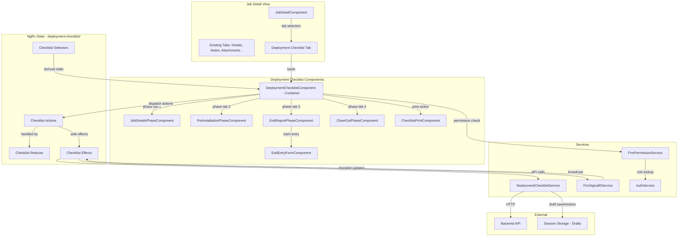
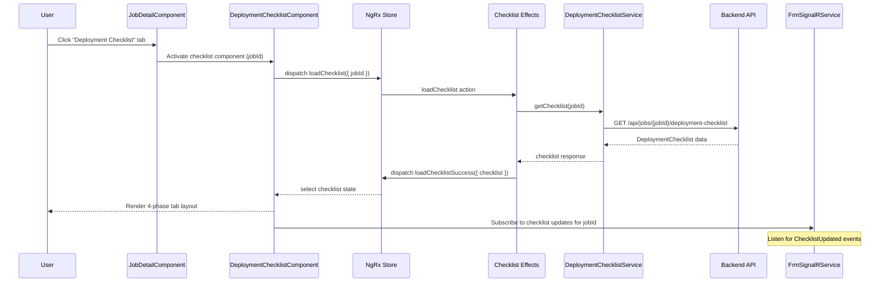
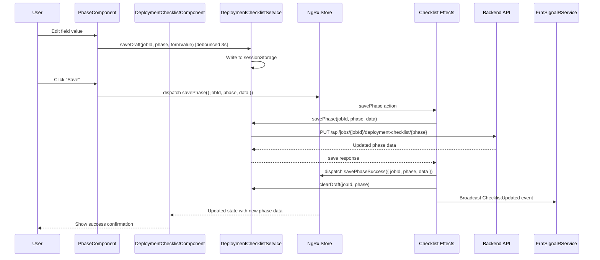

# Design Document: Deployment Checklist Workflow

## Overview

This design adds a Deployment Checklist Workflow to the FRM module, enabling field teams to track deployment activities across four phases: Job Details, Pre-Installation, End of Day Reports, and Close-Out. The checklist is accessible as a tab within the existing `JobDetailComponent` and integrates with the established permission system, NgRx state management, SignalR real-time updates, and session-storage draft persistence.

The design builds on existing infrastructure:
- `FrmPermissionService` for role-based permission checks (extended with three new permission keys)
- `Job` model and `JobDetailComponent` for the parent context
- `FrmSignalRService` for real-time broadcast of checklist updates
- `JobSetupService` pattern for session-storage draft persistence with debounced saves
- `CustomValidators` for phone, email, date, and numeric validation
- NgRx action/reducer/effect/selector pattern used by the `jobs` state slice
- Angular Reactive Forms with `<mat-form-field>` and `<mat-error>` for validation display

### Design Decisions

1. **Separate NgRx state slice** (`state/deployment-checklist/`) rather than nesting inside the jobs state. The checklist has its own lifecycle, loading, and error states independent of the job entity. This follows the same pattern as `assignments/`, `timecards/`, and other feature-specific state slices.
2. **Tab within `JobDetailComponent`** rather than a standalone route. The checklist is contextually tied to a single job, so it belongs as a tab alongside existing job detail content. The tab visibility is controlled by `*appFrmHasPermission="'canViewDeploymentChecklist'"`.
3. **Session storage for draft persistence** with 3-second debounced saves, matching the `JobSetupService` pattern. Each phase gets its own draft key (`frm_checklist_draft_{jobId}_{phase}`) so phases don't overwrite each other.
4. **Phase-level save operations** rather than saving the entire checklist at once. Each phase is independently saveable, reducing payload size and conflict risk when multiple users edit different phases.
5. **Computed status via NgRx selectors** rather than storing status in the state. `Checklist_Status` and `Phase_Status` are derived from the underlying data, ensuring consistency without synchronization logic.
6. **EOD entries as a sub-collection** within the checklist state, loaded and saved independently. This supports the append-only nature of daily reports and allows Field_Users to submit EOD entries without editing other phases.

---

## Architecture



### Sequence: Loading a Deployment Checklist



### Sequence: Saving a Phase with Draft Auto-Save



---

## Components and Interfaces

### 1. FrmPermissionService Extension

**Location:** `src/app/features/field-resource-management/services/frm-permission.service.ts`

Add three new keys to `FrmPermissionKey`:

```typescript
export type FrmPermissionKey =
  | 'canViewDeploymentChecklist'   // NEW
  | 'canEditDeploymentChecklist'   // NEW
  | 'canSubmitEODReport'           // NEW
  | 'canCreateJob'
  // ... existing keys
```

Permission grants by role group:

| Role | `canViewDeploymentChecklist` | `canEditDeploymentChecklist` | `canSubmitEODReport` |
|---|---|---|---|
| Admin | ✅ | ✅ | ✅ |
| PM (Manager_Group) | ✅ | ✅ | ✅ |
| DCOps (Manager_Group) | ✅ | ✅ | ✅ |
| OSPCoordinator (Manager_Group) | ✅ | ✅ | ✅ |
| EngineeringFieldSupport (Manager_Group) | ✅ | ✅ | ✅ |
| Manager (Manager_Group) | ✅ | ✅ | ✅ |
| DeploymentEngineer (Field_Group) | ✅ | ✅ | ✅ |
| Technician (Field_Group) | ✅ | ❌ | ✅ |
| SRITech (Field_Group) | ✅ | ❌ | ✅ |
| CM (Field_Group) | ✅ | ❌ | ✅ |
| HR_Group | ❌ | ❌ | ❌ |
| Payroll_Group | ❌ | ❌ | ❌ |
| ReadOnly_Group | ❌ | ❌ | ❌ |

### 2. DeploymentChecklistComponent (Container)

**Location:** `src/app/features/field-resource-management/components/jobs/deployment-checklist/deployment-checklist.component.ts`

Responsibilities:
- Receives `jobId` from parent `JobDetailComponent` via `@Input()`
- Dispatches `loadChecklist` on init, subscribes to SignalR updates
- Manages the 4-phase tab layout using `<mat-tab-group>`
- Displays `Phase_Status` badges on each tab
- Provides Print and Export PDF actions in the toolbar
- Shows unsaved-changes confirmation dialog on tab switch
- Passes `canEdit` and `canSubmitEOD` flags to child phase components

```typescript
@Component({
  selector: 'app-deployment-checklist',
  templateUrl: './deployment-checklist.component.html',
  styleUrls: ['./deployment-checklist.component.scss']
})
export class DeploymentChecklistComponent implements OnInit, OnDestroy {
  @Input() jobId: string;
  @Input() job: Job;

  checklist$: Observable<DeploymentChecklist | null>;
  checklistStatus$: Observable<ChecklistStatus>;
  loading$: Observable<boolean>;
  saving$: Observable<boolean>;
  error$: Observable<string | null>;
  canEdit$: Observable<boolean>;
  canSubmitEOD$: Observable<boolean>;

  selectedPhaseIndex = 0;
  phases: PhaseTab[] = [
    { label: 'Job Details', phase: 'jobDetails' },
    { label: 'Pre-Installation', phase: 'preInstallation' },
    { label: 'End of Day Reports', phase: 'eodReports' },
    { label: 'Close-Out', phase: 'closeOut' }
  ];
}
```

### 3. Phase Components

Each phase component receives its data via `@Input()` and emits save events via `@Output()`. All use Angular Reactive Forms.

**JobDetailsPhaseComponent**
- `src/app/features/field-resource-management/components/jobs/deployment-checklist/phases/job-details-phase.component.ts`
- Manages form with dynamic arrays for SRI Job Numbers, Customer Job Numbers, Change Tickets, Site Access Tickets
- Pre-populates site info from `Job.siteAddress`
- Contact sections for Technical Lead, Technicians (up to 2), SRI Project Lead, Primary/Secondary Customer Contacts
- Uses `CustomValidators.phoneNumber()` and `Validators.email` for contact validation

**PreInstallationPhaseComponent**
- `src/app/features/field-resource-management/components/jobs/deployment-checklist/phases/pre-installation-phase.component.ts`
- Renders 11 fixed checklist items with Yes/No/N/A radio groups
- Displays Playbook_Reference badges where applicable
- Shows warning indicator when "No" is selected
- Optional notes field per item (maxLength 1000)

**EodReportPhaseComponent**
- `src/app/features/field-resource-management/components/jobs/deployment-checklist/phases/eod-report-phase.component.ts`
- Displays existing EOD entries in reverse chronological order
- "Add EOD Report" button creates a new `EodEntryFormComponent`
- Requires `canSubmitEODReport` permission to add entries

**EodEntryFormComponent**
- `src/app/features/field-resource-management/components/jobs/deployment-checklist/phases/eod-entry-form.component.ts`
- Standalone form for a single EOD entry
- Pre-populates date with current date
- Percentage fields validated 0–100 integer
- Time In/Out as time picker fields
- Yes/No toggles for Daily Pictures and EDP Redline
- Three narrative text areas (maxLength 3000 each)

**CloseOutPhaseComponent**
- `src/app/features/field-resource-management/components/jobs/deployment-checklist/phases/close-out-phase.component.ts`
- Equipment Hand-off section with Company/Date/Name for SRI Lead and Customer Lead
- Required Pictures checklist items (Yes/No/N/A) organized by category
- Documentation and Final Inspection checklist items
- Site Acceptance section with customer contact validation

### 4. ChecklistPrintComponent

**Location:** `src/app/features/field-resource-management/components/jobs/deployment-checklist/checklist-print.component.ts`

- Renders a print-friendly layout of the entire checklist
- Triggered via `window.print()` for Print action
- Uses a separate print stylesheet
- For PDF export, uses the browser print-to-PDF or a library like `jspdf` + `html2canvas`
- Includes Job identifier, checklist status, all phase data, and generation timestamp

### 5. DeploymentChecklistService

**Location:** `src/app/features/field-resource-management/services/deployment-checklist.service.ts`

```typescript
@Injectable({ providedIn: 'root' })
export class DeploymentChecklistService {
  private readonly DRAFT_KEY_PREFIX = 'frm_checklist_draft';
  private readonly DEBOUNCE_MS = 3000;

  constructor(
    private http: HttpClient,
    private authService: AuthService
  ) {}

  // API methods
  getChecklist(jobId: string): Observable<DeploymentChecklist>;
  createChecklist(jobId: string): Observable<DeploymentChecklist>;
  saveJobDetailsPhase(jobId: string, data: JobDetailsPhaseData): Observable<JobDetailsPhaseData>;
  savePreInstallationPhase(jobId: string, data: PreInstallationPhaseData): Observable<PreInstallationPhaseData>;
  saveEodEntry(jobId: string, entry: EodEntry): Observable<EodEntry>;
  updateEodEntry(jobId: string, entryId: string, entry: EodEntry): Observable<EodEntry>;
  saveCloseOutPhase(jobId: string, data: CloseOutPhaseData): Observable<CloseOutPhaseData>;
  exportPdf(jobId: string): Observable<Blob>;

  // Draft persistence
  saveDraft(jobId: string, phase: ChecklistPhase, formValue: any): void;
  restoreDraft(jobId: string, phase: ChecklistPhase): any | null;
  clearDraft(jobId: string, phase: ChecklistPhase): void;
  clearAllDrafts(jobId: string): void;

  // Status computation helpers
  computePhaseStatus(phase: ChecklistPhase, data: any): PhaseStatus;
  computeChecklistStatus(checklist: DeploymentChecklist): ChecklistStatus;
}
```

### 6. NgRx State Slice: `deployment-checklist/`

**Location:** `src/app/features/field-resource-management/state/deployment-checklist/`

**Actions** (`checklist.actions.ts`):
```typescript
// Load
export const loadChecklist = createAction('[Checklist] Load', props<{ jobId: string }>());
export const loadChecklistSuccess = createAction('[Checklist] Load Success', props<{ checklist: DeploymentChecklist }>());
export const loadChecklistFailure = createAction('[Checklist] Load Failure', props<{ error: string }>());

// Save Phase
export const savePhase = createAction('[Checklist] Save Phase', props<{ jobId: string; phase: ChecklistPhase; data: any }>());
export const savePhaseSuccess = createAction('[Checklist] Save Phase Success', props<{ jobId: string; phase: ChecklistPhase; data: any }>());
export const savePhaseFailure = createAction('[Checklist] Save Phase Failure', props<{ error: string }>());

// EOD Entry
export const addEodEntry = createAction('[Checklist] Add EOD Entry', props<{ jobId: string; entry: EodEntry }>());
export const addEodEntrySuccess = createAction('[Checklist] Add EOD Entry Success', props<{ jobId: string; entry: EodEntry }>());
export const addEodEntryFailure = createAction('[Checklist] Add EOD Entry Failure', props<{ error: string }>());

// Auto-create on OnSite transition
export const autoCreateChecklist = createAction('[Checklist] Auto Create', props<{ jobId: string }>());
export const autoCreateChecklistSuccess = createAction('[Checklist] Auto Create Success', props<{ checklist: DeploymentChecklist }>());
export const autoCreateChecklistFailure = createAction('[Checklist] Auto Create Failure', props<{ error: string }>());

// SignalR real-time update
export const checklistUpdatedRemotely = createAction('[Checklist] Updated Remotely', props<{ checklist: DeploymentChecklist }>());
```

**Selectors** (`checklist.selectors.ts`):
```typescript
export const selectChecklistState: (state: AppState) => ChecklistState;
export const selectChecklist: (state: AppState) => DeploymentChecklist | null;
export const selectChecklistLoading: (state: AppState) => boolean;
export const selectChecklistSaving: (state: AppState) => boolean;
export const selectChecklistError: (state: AppState) => string | null;

// Computed status selectors
export const selectChecklistStatus: (state: AppState) => ChecklistStatus;
export const selectJobDetailsPhaseStatus: (state: AppState) => PhaseStatus;
export const selectPreInstallationPhaseStatus: (state: AppState) => PhaseStatus;
export const selectEodReportPhaseStatus: (state: AppState) => PhaseStatus;
export const selectCloseOutPhaseStatus: (state: AppState) => PhaseStatus;

// Phase data selectors
export const selectJobDetailsPhase: (state: AppState) => JobDetailsPhaseData | null;
export const selectPreInstallationPhase: (state: AppState) => PreInstallationPhaseData | null;
export const selectEodEntries: (state: AppState) => EodEntry[];
export const selectCloseOutPhase: (state: AppState) => CloseOutPhaseData | null;
```

### 7. SignalR Integration

Extend `FrmSignalRService.setupEventHandlers()` to listen for a new `ChecklistUpdated` event:

```typescript
// In setupEventHandlers():
this.connection.on('ChecklistUpdated', (update: { jobId: string; checklist: DeploymentChecklist }) => {
  this.store.dispatch(ChecklistActions.checklistUpdatedRemotely({ checklist: update.checklist }));
});
```

The `Checklist Effects` will broadcast updates after successful saves:

```typescript
// In checklist.effects.ts, after savePhaseSuccess:
this.signalRService.connection.invoke('BroadcastChecklistUpdate', jobId, updatedChecklist);
```

### 8. Route Integration

The Deployment Checklist is not a separate route — it's a tab within `JobDetailComponent`. The component is conditionally rendered based on the `canViewDeploymentChecklist` permission:

```html
<!-- In job-detail.component.html -->
<mat-tab *appFrmHasPermission="'canViewDeploymentChecklist'" label="Deployment Checklist">
  <ng-template mat-tab-label>
    Deployment Checklist
    <app-status-badge [status]="checklistStatus$ | async"></app-status-badge>
  </ng-template>
  <app-deployment-checklist [jobId]="job.id" [job]="job"></app-deployment-checklist>
</mat-tab>
```

For deep-linking, the `JobDetailComponent` accepts an optional `tab` query parameter. When `tab=deployment-checklist&phase=preInstallation`, the component activates the checklist tab and selects the specified phase.

---

## Data Models

### DeploymentChecklist

```typescript
export enum ChecklistStatus {
  NotStarted = 'NotStarted',
  InProgress = 'InProgress',
  Completed = 'Completed'
}

export enum PhaseStatus {
  NotStarted = 'NotStarted',
  InProgress = 'InProgress',
  Completed = 'Completed'
}

export type ChecklistPhase = 'jobDetails' | 'preInstallation' | 'eodReports' | 'closeOut';

export type ChecklistItemResponse = 'Yes' | 'No' | 'NotApplicable' | null;

export interface DeploymentChecklist {
  id: string;
  jobId: string;
  jobDetails: JobDetailsPhaseData;
  preInstallation: PreInstallationPhaseData;
  eodEntries: EodEntry[];
  closeOut: CloseOutPhaseData;
  lastModifiedBy: string;
  lastModifiedAt: string; // ISO UTC
  createdAt: string;
  createdBy: string;
}
```

### JobDetailsPhaseData

```typescript
export interface ChecklistContact {
  name: string;
  phone: string;
  email: string;
}

export interface JobDetailsPhaseData {
  sriJobNumbers: string[];
  customerJobNumbers: string[];
  changeTickets: string[];
  siteAccessTickets: string[];
  jobStartDate: string | null;       // ISO date
  jobCompleteDate: string | null;     // ISO date
  siteName: string;
  suiteNumber: string;
  street: string;
  cityState: string;
  zipCode: string;
  proposedValidationDateTime: string | null; // ISO datetime
  technicalLead: ChecklistContact;
  technician1: ChecklistContact;
  technician2: ChecklistContact;
  sriProjectLead: ChecklistContact;
  primaryCustomerContact: ChecklistContact;
  secondaryCustomerContact: ChecklistContact;
  statementOfWork: string;           // maxLength 5000
}
```

### PreInstallationPhaseData

```typescript
export interface ChecklistItem {
  id: string;
  label: string;
  playbookReference: string | null;  // e.g., "2.1", "1.4"
  response: ChecklistItemResponse;
  notes: string;                     // maxLength 1000
}

export interface PreInstallationPhaseData {
  items: ChecklistItem[];
  markedComplete: boolean;           // explicit completion flag
}
```

The 11 pre-installation items are defined as a constant:

```typescript
export const PRE_INSTALLATION_ITEMS: Array<{ label: string; playbookReference: string | null }> = [
  { label: 'Required Tickets Opened', playbookReference: null },
  { label: 'Customer Equipment Received', playbookReference: '2.1' },
  { label: 'SRI Materials Received', playbookReference: null },
  { label: 'Documentation Received', playbookReference: null },
  { label: 'Before Pictures Taken', playbookReference: null },
  { label: 'Site Inspection Completed', playbookReference: '1.4' },
  { label: 'Rack Assignments Clear', playbookReference: '1.1' },
  { label: 'Equipment Ports Available', playbookReference: null },
  { label: 'Patch Panel Ports Available', playbookReference: '1.2' },
  { label: 'PDU Assignments Available', playbookReference: '1.3' },
  { label: 'Equipment Orientation Correct', playbookReference: '2.1.3' }
];
```

### EodEntry

```typescript
export interface DailyProgress {
  devicesRacked: number;        // 0-100
  devicesPowered: number;       // 0-100
  cablingInstalledDressed: number; // 0-100
  cablesTested: number;         // 0-100
  labelsInstalled: number;      // 0-100
  customerValidation: number;   // 0-100
}

export interface EodEntry {
  id: string;
  date: string;                 // ISO date
  personnelOnSite: string;
  technicalLeadName: string;
  technicianNames: string;
  timeIn: string;               // HH:mm
  timeOut: string;              // HH:mm
  customerNotificationName: string;
  customerNotificationMethod: string;
  dailyProgress: DailyProgress;
  dailyPicturesProvided: boolean;
  edpRedlineRequired: boolean;
  workCompletedToday: string;   // maxLength 3000
  issuesRoadblocks: string;     // maxLength 3000
  planForTomorrow: string;      // maxLength 3000
  submittedBy: string;
  submittedAt: string;          // ISO UTC
}
```

### CloseOutPhaseData

```typescript
export interface HandoffParticipant {
  company: string;
  date: string | null;          // ISO date
  name: string;
}

export interface CloseOutPhaseData {
  // Equipment Hand-off
  sriLead: HandoffParticipant;
  customerLead: HandoffParticipant;
  otherParticipants: string;

  // Required Pictures
  requiredPictures: ChecklistItem[];

  // Documentation and Final Inspection
  finalInspectionItems: ChecklistItem[];

  // Site Acceptance
  siteAcceptance: {
    customerName: string;
    customerEmail: string;
    customerPhone: string;
    dateTimeSiteAccepted: string | null; // ISO datetime
  };
}
```

The required pictures items are defined as a constant:

```typescript
export const REQUIRED_PICTURES_ITEMS: Array<{ label: string; category: string }> = [
  // General
  { label: 'Overview of Work Area', category: 'General' },
  { label: 'Design Modifications', category: 'General' },
  { label: 'Equipment Discrepancies', category: 'General' },
  // Rack/Cabinet View
  { label: 'Front Top', category: 'Rack/Cabinet View' },
  { label: 'Front Middle', category: 'Rack/Cabinet View' },
  { label: 'Front Bottom', category: 'Rack/Cabinet View' },
  { label: 'Rear Top', category: 'Rack/Cabinet View' },
  { label: 'Rear Middle', category: 'Rack/Cabinet View' },
  { label: 'Rear Bottom', category: 'Rack/Cabinet View' },
  // Equipment & Patch Panel Detail
  { label: 'Front', category: 'Equipment & Patch Panel Detail' },
  { label: 'Rear', category: 'Equipment & Patch Panel Detail' }
];

export const FINAL_INSPECTION_ITEMS: string[] = [
  'Site Cleanliness',
  'Workmanship',
  'EDP Updated',
  'Cable Test Results',
  'Label Audit'
];
```

### NgRx State Shape

```typescript
export interface ChecklistState {
  checklist: DeploymentChecklist | null;
  loading: boolean;
  saving: boolean;
  error: string | null;
  lastSavedAt: string | null; // ISO UTC
}

export const initialChecklistState: ChecklistState = {
  checklist: null,
  loading: false,
  saving: false,
  error: null,
  lastSavedAt: null
};
```

### Draft Storage Shape

```typescript
interface ChecklistDraft {
  formValue: any;
  savedAt: string; // ISO timestamp
}
// Key format: `frm_checklist_draft_{jobId}_{phase}`
```

### Validation Rules Summary

| Field | Validators |
|---|---|
| Phone numbers (all contact fields) | `CustomValidators.phoneNumber()` — 10-digit US format |
| Email addresses (all contact fields) | `Validators.email` |
| Statement of Work | `Validators.maxLength(5000)` |
| Checklist item notes | `Validators.maxLength(1000)` |
| EOD narrative fields | `Validators.maxLength(3000)` |
| Daily progress percentages | `Validators.min(0)`, `Validators.max(100)`, integer pattern |
| Job Start Date | `Validators.required` |
| Technical Lead name | `Validators.required` |
| SRI Job Number (at least one) | Custom array-min-length validator |
| EOD Time In / Time Out | `Validators.required`, time format pattern |
| Site Acceptance Customer Name | `Validators.required` (for phase completion) |
| Site Acceptance Date/Time | `Validators.required` (for phase completion) |

### API Endpoints

| Method | Endpoint | Description |
|---|---|---|
| GET | `/api/jobs/{jobId}/deployment-checklist` | Load full checklist |
| POST | `/api/jobs/{jobId}/deployment-checklist` | Create checklist (auto-create on OnSite) |
| PUT | `/api/jobs/{jobId}/deployment-checklist/job-details` | Save Job Details phase |
| PUT | `/api/jobs/{jobId}/deployment-checklist/pre-installation` | Save Pre-Installation phase |
| POST | `/api/jobs/{jobId}/deployment-checklist/eod-entries` | Add new EOD entry |
| PUT | `/api/jobs/{jobId}/deployment-checklist/eod-entries/{entryId}` | Update EOD entry |
| PUT | `/api/jobs/{jobId}/deployment-checklist/close-out` | Save Close-Out phase |
| GET | `/api/jobs/{jobId}/deployment-checklist/export-pdf` | Export PDF |


---

## Correctness Properties

*A property is a characteristic or behavior that should hold true across all valid executions of a system — essentially, a formal statement about what the system should do. Properties serve as the bridge between human-readable specifications and machine-verifiable correctness guarantees.*

### Property 1: Permission controls tab visibility

*For any* user role, the Deployment Checklist tab should be visible if and only if `FrmPermissionService.hasPermission(role, 'canViewDeploymentChecklist')` returns `true`. Roles without this permission should never see the tab.

**Validates: Requirements 1.10, 10.2**

### Property 2: Permission controls field editability

*For any* user role viewing the Deployment Checklist, all checklist form fields should be editable if and only if `FrmPermissionService.hasPermission(role, 'canEditDeploymentChecklist')` returns `true`. Roles without this permission should see all fields as read-only.

**Validates: Requirements 1.11**

### Property 3: Checklist-Job association invariant

*For any* valid Job ID, creating or loading a `DeploymentChecklist` should always produce a checklist whose `jobId` field equals the originating Job's ID. The relationship is one-to-one and immutable after creation.

**Validates: Requirements 2.2**

### Property 4: Checklist status computation

*For any* `DeploymentChecklist` state, `computeChecklistStatus` should return:
- `NotStarted` when all four phases have `PhaseStatus.NotStarted`
- `Completed` when all four phases have `PhaseStatus.Completed`
- `InProgress` in all other cases (at least one phase started but not all completed)

**Validates: Requirements 2.3, 2.4, 2.5**

### Property 5: Tab navigation preserves form data

*For any* form data entered in any checklist phase, navigating to a different phase tab and then returning to the original phase should preserve all previously entered field values exactly.

**Validates: Requirements 3.3, 3.4**

### Property 6: Unsaved changes triggers confirmation dialog

*For any* checklist phase with a dirty form (modified but unsaved fields), attempting to switch to a different phase tab should trigger an unsaved-changes confirmation dialog before navigation proceeds.

**Validates: Requirements 3.5**

### Property 7: Site info pre-population from Job

*For any* Job with a non-empty `siteAddress`, loading the Job Details phase should pre-populate the Site Name, Street, City/State, and Zip Code fields with values matching the Job's `siteAddress` data.

**Validates: Requirements 4.6**

### Property 8: Phone number format validation

*For any* string input to a phone number field, the `CustomValidators.phoneNumber()` validator should return `null` (valid) if and only if the input contains exactly 10 digits (ignoring formatting characters). All other inputs should produce a `phoneNumber` validation error.

**Validates: Requirements 4.14, 7.8, 9.6**

### Property 9: Email format validation

*For any* string input to an email field, the Angular `Validators.email` validator should return `null` (valid) if and only if the input matches a valid email format. All other inputs should produce an `email` validation error.

**Validates: Requirements 4.15, 7.7, 9.7**

### Property 10: Job Details phase status computation

*For any* `JobDetailsPhaseData`, `computePhaseStatus('jobDetails', data)` should return `Completed` if and only if `technicalLead.name` is non-empty, `sriJobNumbers` contains at least one non-empty entry, and `jobStartDate` is non-null. Otherwise it should return `NotStarted` if all fields are empty, or `InProgress` if some but not all completion criteria are met.

**Validates: Requirements 4.16**

### Property 11: Pre-Installation phase status computation

*For any* `PreInstallationPhaseData`, `computePhaseStatus('preInstallation', data)` should return:
- `NotStarted` when no items have a response selected (all null)
- `Completed` when all 11 items have a response of `Yes` or `NotApplicable`, OR when all items have any response selected and `markedComplete` is true
- `InProgress` in all other cases

**Validates: Requirements 5.5, 5.6, 5.7**

### Property 12: Percentage field validation (0–100 integer)

*For any* numeric input to a Daily Progress percentage field, the field should be valid if and only if the value is an integer between 0 and 100 inclusive. Non-integer values, negative values, and values greater than 100 should produce validation errors.

**Validates: Requirements 6.7, 9.2**

### Property 13: EOD entries display in reverse chronological order

*For any* list of `EodEntry` records with distinct dates, the displayed order should be reverse chronological — the entry with the most recent date appears first, and each subsequent entry has an equal or earlier date.

**Validates: Requirements 6.12, 6.13**

### Property 14: EOD Report phase status computation

*For any* `DeploymentChecklist` state, the EOD Report phase status should be:
- `NotStarted` when the `eodEntries` array is empty
- `Completed` when the Close-Out phase has `PhaseStatus.Completed`
- `InProgress` when at least one EOD entry exists and the Close-Out phase is not `Completed`

**Validates: Requirements 6.14, 6.15, 6.16**

### Property 15: Close-Out phase status computation

*For any* `CloseOutPhaseData`, `computePhaseStatus('closeOut', data)` should return:
- `NotStarted` when no fields have been populated (all empty/null)
- `Completed` when `siteAcceptance.customerName` is non-empty, `siteAcceptance.dateTimeSiteAccepted` is non-null, and all `finalInspectionItems` have a response selected
- `InProgress` in all other cases (at least one field populated but completion criteria not met)

**Validates: Requirements 7.9, 7.10, 7.11**

### Property 16: Save operation records lastModifiedBy

*For any* save operation performed by any authenticated user, the resulting checklist data should have `lastModifiedBy` set to the authenticated user's identity.

**Validates: Requirements 8.7**

### Property 17: Error state clears on valid input

*For any* form field that is currently in an invalid state (has validation errors), when the field value is changed to a valid value, the field's error state should immediately become `null` (no errors) and any visual error indicators should be removed.

**Validates: Requirements 9.5**

### Property 18: Draft persistence round trip

*For any* checklist phase form value, saving it as a draft via `saveDraft(jobId, phase, formValue)` and then restoring it via `restoreDraft(jobId, phase)` should return a value deeply equal to the original form value.

**Validates: Requirements 13.1, 13.2**

---

## Error Handling

### Form Validation Errors
- Each phase component marks all fields as touched on "Save" click to trigger inline error display
- Error messages are shown below each invalid field using Angular Material's `<mat-error>` within `<mat-form-field>`
- The "Save" button remains enabled but the save action is blocked when the form has required-field errors
- `maxlength` attribute on text inputs prevents exceeding character limits at the browser level (Requirements 9.3)
- Invalid fields are highlighted with a red border via Angular Material's built-in error styling (Requirements 9.4)
- Error messages clear immediately when the field value becomes valid (Requirements 9.5)

### Phone and Email Validation
- Phone fields use `CustomValidators.phoneNumber()` with error message: "Please enter a valid 10-digit phone number"
- Email fields use `Validators.email` with error message: "Please enter a valid email address"
- Validation runs on blur and on value change, providing immediate feedback

### Save Operation Errors
- `DeploymentChecklistService` save methods catch HTTP errors and return them as observable errors
- The phase component displays the error message in a `<mat-error>` banner above the Save button
- The Save button remains enabled after an error for retry (Requirements 8.4)
- Network timeout errors display: "Unable to reach server. Please try again."
- 409 Conflict errors (concurrent edit) display: "This checklist was updated by another user. Please reload and try again."

### Loading Errors
- If `loadChecklist` fails, the container component displays an error message with a "Retry" button
- If the checklist doesn't exist yet (404), the component shows a message indicating the checklist will be created when the job reaches OnSite status

### SignalR Connection Errors
- Connection loss displays a yellow warning banner: "Real-time updates unavailable. Reconnecting..."
- Automatic reconnection follows the existing `FrmSignalRService` exponential backoff pattern
- On reconnection, the checklist data is reloaded from the API to synchronize state (Requirements 11.4)

### Draft Persistence Errors
- `sessionStorage` operations are wrapped in try/catch to handle quota exceeded or disabled storage
- If draft restore fails, the form loads from the last saved server state with no error shown
- If draft save fails, a console warning is logged but the user is not interrupted
- Draft data includes a `savedAt` timestamp; drafts older than 24 hours are automatically discarded

### Unsaved Changes Warning
- When the user switches phase tabs with a dirty form, a Material dialog asks: "You have unsaved changes. Do you want to save before leaving?"
- Options: "Save & Continue", "Discard Changes", "Cancel"
- "Save & Continue" triggers a save, then navigates on success
- "Discard Changes" clears the draft and navigates
- "Cancel" stays on the current tab

### Permission Errors
- If a user without `canViewDeploymentChecklist` somehow reaches the component (e.g., direct URL manipulation), the component renders an "Access Denied" message
- If a user without `canEditDeploymentChecklist` attempts to save (e.g., via browser dev tools), the API rejects the request and the component shows an error

---

## Testing Strategy

### Unit Tests

Unit tests cover specific examples, edge cases, and integration points:

- **FrmPermissionService**: Test that each role has the correct `canViewDeploymentChecklist`, `canEditDeploymentChecklist`, and `canSubmitEODReport` values (Requirements 1.4–1.9)
- **DeploymentChecklistComponent**: Test tab rendering, phase status badge display, print/export button visibility, loading/error states
- **JobDetailsPhaseComponent**: Test site info pre-population, dynamic array fields (add/remove SRI Job Numbers), contact field rendering, form validation on save
- **PreInstallationPhaseComponent**: Test 11 checklist items render with correct labels and playbook references, "No" selection shows warning indicator, notes field maxLength
- **EodReportPhaseComponent**: Test reverse chronological display, "Add EOD Report" button visibility based on permission, empty state message
- **EodEntryFormComponent**: Test date pre-population, required field validation, percentage field range validation, boolean toggle rendering
- **CloseOutPhaseComponent**: Test required pictures items by category, final inspection items, site acceptance validation
- **ChecklistPrintComponent**: Test that all four phases render in print layout
- **DeploymentChecklistService**: Test API method calls with correct endpoints, draft save/restore/clear operations, `computePhaseStatus` with specific inputs, `computeChecklistStatus` with specific inputs
- **NgRx Reducer**: Test state transitions for all actions (loadChecklist, savePhase, addEodEntry, checklistUpdatedRemotely)
- **NgRx Effects**: Test that loadChecklist triggers API call, savePhaseSuccess clears draft and broadcasts SignalR, autoCreateChecklist triggers on job OnSite transition
- **NgRx Selectors**: Test computed status selectors with specific state shapes
- **Route Integration**: Test that deep-link query params activate correct tab and phase

### Property-Based Tests

Property-based tests use `fast-check` (already used in this project) to verify universal properties across randomized inputs. Each test runs a minimum of 100 iterations.

Each property test references its design document property with a tag comment:

- **Feature: deployment-checklist-workflow, Property 1: Permission controls tab visibility**
- **Feature: deployment-checklist-workflow, Property 2: Permission controls field editability**
- **Feature: deployment-checklist-workflow, Property 3: Checklist-Job association invariant**
- **Feature: deployment-checklist-workflow, Property 4: Checklist status computation**
- **Feature: deployment-checklist-workflow, Property 5: Tab navigation preserves form data**
- **Feature: deployment-checklist-workflow, Property 6: Unsaved changes triggers confirmation dialog**
- **Feature: deployment-checklist-workflow, Property 7: Site info pre-population from Job**
- **Feature: deployment-checklist-workflow, Property 8: Phone number format validation**
- **Feature: deployment-checklist-workflow, Property 9: Email format validation**
- **Feature: deployment-checklist-workflow, Property 10: Job Details phase status computation**
- **Feature: deployment-checklist-workflow, Property 11: Pre-Installation phase status computation**
- **Feature: deployment-checklist-workflow, Property 12: Percentage field validation (0–100 integer)**
- **Feature: deployment-checklist-workflow, Property 13: EOD entries display in reverse chronological order**
- **Feature: deployment-checklist-workflow, Property 14: EOD Report phase status computation**
- **Feature: deployment-checklist-workflow, Property 15: Close-Out phase status computation**
- **Feature: deployment-checklist-workflow, Property 16: Save operation records lastModifiedBy**
- **Feature: deployment-checklist-workflow, Property 17: Error state clears on valid input**
- **Feature: deployment-checklist-workflow, Property 18: Draft persistence round trip**

**PBT Library:** `fast-check` (compatible with Jasmine/Karma test runner used in this Angular project)

**Configuration:** Each property test uses `fc.assert(fc.property(...), { numRuns: 100 })` minimum.

**Generator Strategy:**

- **Roles:** `fc.constantFrom(...Object.values(UserRole))` for testing permission properties
- **Phone numbers:** `fc.oneof(fc.stringOf(fc.constantFrom('0','1','2','3','4','5','6','7','8','9'), { minLength: 10, maxLength: 10 }), fc.string())` for valid/invalid phone inputs
- **Email addresses:** `fc.oneof(fc.emailAddress(), fc.string())` for valid/invalid email inputs
- **Checklist items:** Custom generator producing `ChecklistItem` with random `response` from `[null, 'Yes', 'No', 'NotApplicable']` and random notes strings
- **Phase data:** Composite generators for `JobDetailsPhaseData`, `PreInstallationPhaseData`, `CloseOutPhaseData` combining field generators
- **EOD entries:** Generator producing `EodEntry` with random dates, progress percentages (0–100), and narrative text
- **Percentage values:** `fc.oneof(fc.integer({ min: 0, max: 100 }), fc.integer({ min: -100, max: 200 }), fc.double())` for valid/invalid percentage inputs
- **Form values:** Composite generators for each phase's form value, used for draft round-trip testing
- **Job objects:** Generator extending the existing `Job` interface with random `siteAddress` data

Each correctness property is implemented by a single property-based test. Unit tests complement PBT by covering specific examples, error conditions, and integration points that don't lend themselves to randomized input generation.
