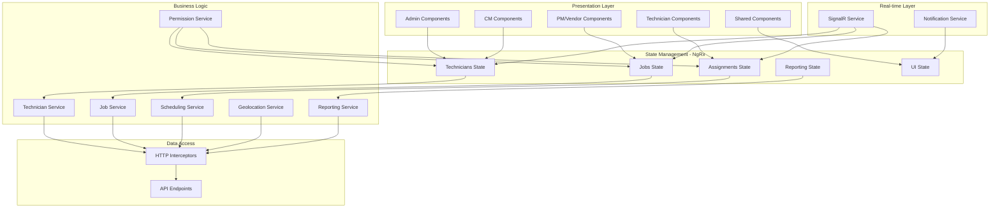
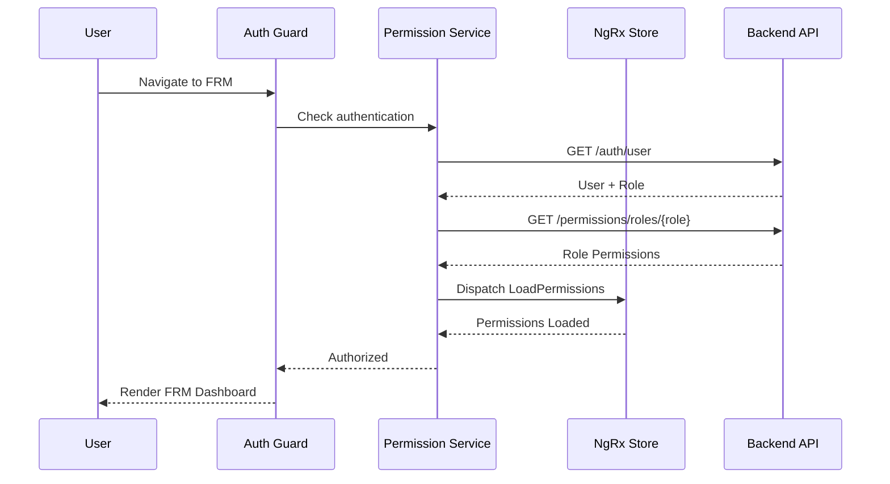
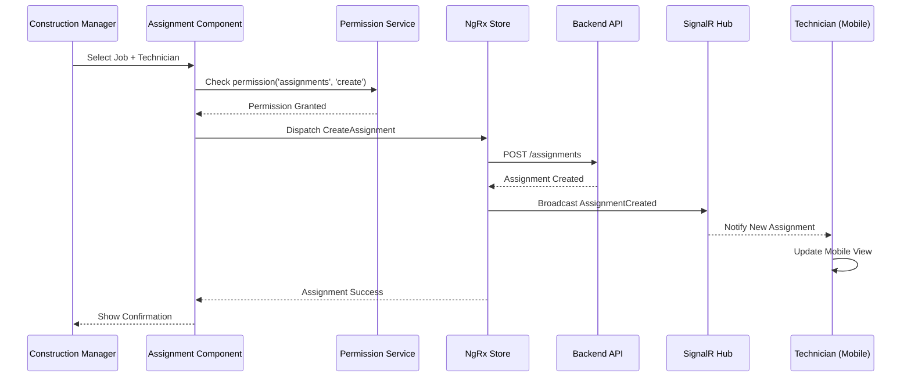
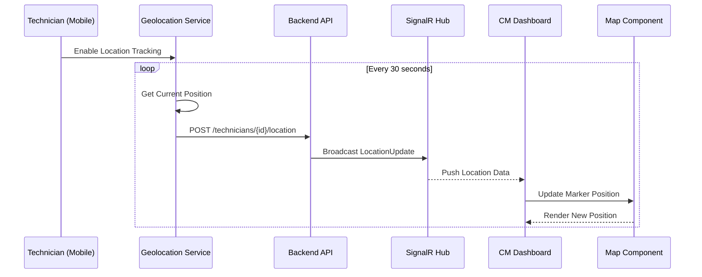

# Design Document: Field Resource Management System

## Overview

The Field Resource Management (FRM) system is a comprehensive Angular application for managing field technicians, crews, and jobs with real-time geographic tracking and role-based access control. The system provides capabilities for editing, scheduling, assigning, and tracking field resources while enforcing strict permission boundaries across four user tiers: Admins, Construction Managers (CMs), Project Managers (PMs)/Vendors, and Technicians.

The system leverages Angular with NgRx for state management, integrates with geographic mapping services for real-time location tracking, and implements a sophisticated RBAC system that scopes data visibility based on user role, market, and company affiliation. Real-time updates are handled through SignalR for crew movement and assignment changes.

## Architecture

The system follows Angular's feature module architecture with NgRx for centralized state management. The architecture is organized into distinct layers: presentation (components), state management (NgRx store), business logic (services), and data access (API integration).



### Key Architectural Decisions

1. **NgRx State Management**: Centralized state for predictable data flow and time-travel debugging
2. **Feature Module Isolation**: Each major capability (technicians, jobs, scheduling) is a separate module
3. **Permission-First Design**: All data access flows through permission checks before rendering
4. **Real-time Integration**: SignalR for live updates of crew positions and job assignments
5. **Offline-First Approach**: Service workers and local caching for field technician mobile access

## Sequence Diagrams

### User Authentication and Permission Loading



### Technician Assignment Workflow



### Geographic Tracking Update



## Components and Interfaces

### Core State Interfaces

```typescript
// Technician State
interface TechnicianState {
  entities: { [id: string]: Technician };
  ids: string[];
  selectedId: string | null;
  loading: boolean;
  error: string | null;
  filters: TechnicianFilters;
  pagination: PaginationState;
}

// Job State
interface JobState {
  entities: { [id: string]: Job };
  ids: string[];
  selectedId: string | null;
  loading: boolean;
  error: string | null;
  filters: JobFilters;
  pagination: PaginationState;
}

// Assignment State
interface AssignmentState {
  entities: { [id: string]: Assignment };
  ids: string[];
  loading: boolean;
  error: string | null;
  conflicts: AssignmentConflict[];
}

// Reporting State
interface ReportingState {
  kpis: KPIMetrics;
  utilizationData: UtilizationReport[];
  performanceData: PerformanceReport[];
  loading: boolean;
  error: string | null;
  dateRange: DateRange;
}

// UI State
interface UIState {
  sidebarOpen: boolean;
  mapView: MapViewState;
  selectedFilters: FilterState;
  notifications: Notification[];
}
```

### Data Models

```typescript
// Technician Model
interface Technician {
  id: string;
  firstName: string;
  lastName: string;
  email: string;
  phone: string;
  skills: Skill[];
  certifications: Certification[];
  status: TechnicianStatus;
  market: string;
  company: string;
  currentLocation?: GeoLocation;
  availability: AvailabilitySchedule;
  createdAt: Date;
  updatedAt: Date;
}

enum TechnicianStatus {
  Available = 'AVAILABLE',
  OnJob = 'ON_JOB',
  Unavailable = 'UNAVAILABLE',
  OffDuty = 'OFF_DUTY'
}

interface Skill {
  id: string;
  name: string;
  level: SkillLevel;
  verifiedDate?: Date;
}

enum SkillLevel {
  Beginner = 'BEGINNER',
  Intermediate = 'INTERMEDIATE',
  Advanced = 'ADVANCED',
  Expert = 'EXPERT'
}

interface Certification {
  id: string;
  name: string;
  issuedBy: string;
  issuedDate: Date;
  expiryDate?: Date;
  documentUrl?: string;
}

// Job Model
interface Job {
  id: string;
  title: string;
  description: string;
  status: JobStatus;
  priority: JobPriority;
  market: string;
  company: string;
  location: JobLocation;
  scheduledStart: Date;
  scheduledEnd: Date;
  actualStart?: Date;
  actualEnd?: Date;
  requiredSkills: Skill[];
  assignedTechnicians: string[];
  estimatedHours: number;
  actualHours?: number;
  notes: JobNote[];
  createdBy: string;
  createdAt: Date;
  updatedAt: Date;
}

enum JobStatus {
  Pending = 'PENDING',
  Scheduled = 'SCHEDULED',
  InProgress = 'IN_PROGRESS',
  Completed = 'COMPLETED',
  Cancelled = 'CANCELLED',
  OnHold = 'ON_HOLD'
}

enum JobPriority {
  Low = 'LOW',
  Medium = 'MEDIUM',
  High = 'HIGH',
  Critical = 'CRITICAL'
}

interface JobLocation {
  address: string;
  city: string;
  state: string;
  zipCode: string;
  coordinates: GeoLocation;
}

interface GeoLocation {
  latitude: number;
  longitude: number;
  accuracy?: number;
  timestamp?: Date;
}

// Assignment Model
interface Assignment {
  id: string;
  jobId: string;
  technicianId: string;
  assignedBy: string;
  assignedAt: Date;
  status: AssignmentStatus;
  startTime?: Date;
  endTime?: Date;
  notes?: string;
}

enum AssignmentStatus {
  Assigned = 'ASSIGNED',
  Accepted = 'ACCEPTED',
  Rejected = 'REJECTED',
  InProgress = 'IN_PROGRESS',
  Completed = 'COMPLETED'
}

// Crew Model
interface Crew {
  id: string;
  name: string;
  leadTechnicianId: string;
  memberIds: string[];
  market: string;
  company: string;
  status: CrewStatus;
  currentLocation?: GeoLocation;
  activeJobId?: string;
  createdAt: Date;
  updatedAt: Date;
}

enum CrewStatus {
  Available = 'AVAILABLE',
  OnJob = 'ON_JOB',
  Unavailable = 'UNAVAILABLE'
}
```

### Permission Model

```typescript
// Role-Based Permission Model
interface RolePermission {
  role: UserRole;
  permissions: Permission[];
  dataScopes: DataScope[];
}

enum UserRole {
  Admin = 'ADMIN',
  ConstructionManager = 'CM',
  ProjectManager = 'PM',
  Vendor = 'VENDOR',
  Technician = 'TECHNICIAN'
}

interface Permission {
  resource: ResourceType;
  actions: PermissionAction[];
  conditions?: PermissionCondition[];
}

enum ResourceType {
  Technicians = 'technicians',
  Crews = 'crews',
  Jobs = 'jobs',
  Assignments = 'assignments',
  Reports = 'reports',
  KPIs = 'kpis',
  SystemConfig = 'system_config'
}

enum PermissionAction {
  Create = 'create',
  Read = 'read',
  Update = 'update',
  Delete = 'delete',
  Execute = 'execute'
}

interface PermissionCondition {
  field: string;
  operator: ConditionOperator;
  value: any;
}

enum ConditionOperator {
  Equals = 'equals',
  NotEquals = 'notEquals',
  In = 'in',
  NotIn = 'notIn',
  Contains = 'contains'
}

interface DataScope {
  scopeType: ScopeType;
  scopeValues: string[];
}

enum ScopeType {
  Market = 'market',
  Company = 'company',
  Self = 'self',
  All = 'all'
}
```

## Key Functions with Formal Specifications

### Function 1: checkPermission()

```typescript
function checkPermission(
  user: User,
  resource: ResourceType,
  action: PermissionAction,
  context?: PermissionContext
): boolean
```

**Preconditions:**
- `user` is non-null and has a defined role
- `user.role` is a valid UserRole enum value
- `resource` is a valid ResourceType enum value
- `action` is a valid PermissionAction enum value
- If `context` is provided, it contains valid data scope information

**Postconditions:**
- Returns `true` if and only if user's role has permission for resource+action
- If conditions exist, all conditions must evaluate to true for permission grant
- No side effects on user or permission data
- Result is deterministic for same inputs

**Loop Invariants:** N/A (no loops in main logic)

### Function 2: filterDataByScope()

```typescript
function filterDataByScope<T extends ScopedEntity>(
  data: T[],
  user: User,
  rolePermission: RolePermission
): T[]
```

**Preconditions:**
- `data` is a valid array (may be empty)
- `user` is non-null with valid role and scope information
- `rolePermission` contains valid data scopes for the user's role
- All items in `data` implement ScopedEntity interface (have market, company fields)

**Postconditions:**
- Returns filtered array containing only items user has permission to see
- If user has 'all' scope, returns entire input array
- If user has 'market' scope, returns items matching user's market
- If user has 'company' scope, returns items matching user's company AND market
- If user has 'self' scope, returns only items where user is the owner/assignee
- Original data array is not mutated
- Order of items is preserved

**Loop Invariants:**
- For each iteration through data array: all previously processed items either passed scope check or were excluded
- Filtered result array contains only valid items that passed scope validation

### Function 3: assignTechnicianToJob()

```typescript
function assignTechnicianToJob(
  jobId: string,
  technicianId: string,
  assignedBy: string
): Observable<Assignment>
```

**Preconditions:**
- `jobId` is a valid UUID of an existing job
- `technicianId` is a valid UUID of an existing technician
- `assignedBy` is a valid UUID of the user making the assignment
- User has 'create' permission on 'assignments' resource
- Job status is not 'COMPLETED' or 'CANCELLED'
- Technician is not already assigned to overlapping job
- Technician has required skills for the job

**Postconditions:**
- Returns Observable that emits new Assignment object
- Assignment is persisted to backend
- NgRx store is updated with new assignment
- SignalR notification is broadcast to assigned technician
- If technician is unavailable, conflict is detected and error is thrown
- If assignment fails, Observable emits error and no state changes occur

**Loop Invariants:** N/A (async operation, no loops)

### Function 4: updateTechnicianLocation()

```typescript
function updateTechnicianLocation(
  technicianId: string,
  location: GeoLocation
): Observable<void>
```

**Preconditions:**
- `technicianId` is a valid UUID of an existing technician
- `location.latitude` is between -90 and 90
- `location.longitude` is between -180 and 180
- `location.accuracy` (if provided) is a positive number
- User is either the technician themselves or has 'update' permission on 'technicians'

**Postconditions:**
- Location is updated in backend
- NgRx store reflects new location
- SignalR broadcasts location update to subscribed CMs/Admins
- Map markers are updated in real-time for monitoring users
- If location update fails, Observable emits error
- Previous location is preserved in history for audit trail

**Loop Invariants:** N/A (async operation, no loops)

### Function 5: calculateKPIMetrics()

```typescript
function calculateKPIMetrics(
  jobs: Job[],
  technicians: Technician[],
  dateRange: DateRange,
  userScope: DataScope[]
): KPIMetrics
```

**Preconditions:**
- `jobs` is a valid array of Job objects
- `technicians` is a valid array of Technician objects
- `dateRange.start` is before or equal to `dateRange.end`
- `userScope` contains valid scope definitions
- All jobs and technicians are already filtered by user's data scope

**Postconditions:**
- Returns KPIMetrics object with calculated values
- All percentage values are between 0 and 100
- All count values are non-negative integers
- Calculations are based only on data within dateRange
- If no data exists for dateRange, returns metrics with zero values
- Original input arrays are not mutated

**Loop Invariants:**
- When iterating through jobs: running totals (completed, in-progress, etc.) are accurate for all processed jobs
- When calculating utilization: sum of technician hours does not exceed total available hours
- All intermediate calculations maintain numerical precision

## Algorithmic Pseudocode

### Main Permission Check Algorithm

```typescript
ALGORITHM checkPermissionWithScope(user, resource, action, targetEntity)
INPUT: 
  user: User object with role and scope information
  resource: ResourceType enum value
  action: PermissionAction enum value
  targetEntity: Optional entity being accessed
OUTPUT: 
  boolean indicating permission granted or denied

BEGIN
  // Step 1: Validate inputs
  ASSERT user IS NOT NULL
  ASSERT user.role IS VALID UserRole
  ASSERT resource IS VALID ResourceType
  ASSERT action IS VALID PermissionAction
  
  // Step 2: Get role permissions from store
  rolePermissions ← getRolePermissions(user.role)
  
  IF rolePermissions IS NULL THEN
    RETURN false
  END IF
  
  // Step 3: Find matching permission for resource
  matchingPermission ← NULL
  FOR EACH permission IN rolePermissions.permissions DO
    IF permission.resource = resource THEN
      matchingPermission ← permission
      BREAK
    END IF
  END FOR
  
  IF matchingPermission IS NULL THEN
    RETURN false
  END IF
  
  // Step 4: Check if action is allowed
  IF action NOT IN matchingPermission.actions THEN
    RETURN false
  END IF
  
  // Step 5: Evaluate conditions if present
  IF matchingPermission.conditions IS NOT EMPTY THEN
    FOR EACH condition IN matchingPermission.conditions DO
      IF NOT evaluateCondition(condition, user) THEN
        RETURN false
      END IF
    END FOR
  END IF
  
  // Step 6: Check data scope if targetEntity provided
  IF targetEntity IS NOT NULL THEN
    IF NOT checkDataScope(user, rolePermissions.dataScopes, targetEntity) THEN
      RETURN false
    END IF
  END IF
  
  // All checks passed
  RETURN true
END

PRECONDITIONS:
  - user is authenticated and has valid role
  - resource and action are valid enum values
  - rolePermissions store is initialized

POSTCONDITIONS:
  - Returns true if and only if all permission checks pass
  - No side effects on any input parameters
  - Result is deterministic for same inputs

LOOP INVARIANTS:
  - Permission loop: All previously checked permissions did not match resource
  - Condition loop: All previously evaluated conditions returned true
```

### Data Scope Filtering Algorithm

```typescript
ALGORITHM filterDataByScope(data, user, dataScopes)
INPUT:
  data: Array of entities with market, company, and owner fields
  user: User object with role, market, company
  dataScopes: Array of DataScope objects defining access boundaries
OUTPUT:
  filteredData: Array of entities user has permission to access

BEGIN
  filteredData ← EMPTY ARRAY
  
  // Step 1: Determine scope type
  scopeType ← determineScopeType(dataScopes)
  
  // Step 2: Apply scope filter
  CASE scopeType OF
    'all':
      // Admin: see everything
      filteredData ← data
      
    'market':
      // CM: see all in their market (or all markets if RG market CM)
      IF user.market = 'RG' THEN
        filteredData ← data
      ELSE
        FOR EACH entity IN data DO
          IF entity.market = user.market THEN
            filteredData.ADD(entity)
          END IF
        END FOR
      END IF
      
    'company':
      // PM/Vendor: see only their company AND market
      FOR EACH entity IN data DO
        IF entity.company = user.company AND entity.market = user.market THEN
          filteredData.ADD(entity)
        END IF
      END FOR
      
    'self':
      // Technician: see only assigned to them
      FOR EACH entity IN data DO
        IF entity.assignedTo = user.id OR entity.ownerId = user.id THEN
          filteredData.ADD(entity)
        END IF
      END FOR
  END CASE
  
  RETURN filteredData
END

PRECONDITIONS:
  - data is a valid array (may be empty)
  - user has valid role, market, and company fields
  - dataScopes contains at least one scope definition
  - All entities in data have required scope fields

POSTCONDITIONS:
  - Returns array containing only entities within user's scope
  - Original data array is not mutated
  - Order of entities is preserved
  - If no entities match scope, returns empty array

LOOP INVARIANTS:
  - filteredData contains only entities that passed scope check
  - All previously processed entities were evaluated correctly
  - No duplicate entities in filteredData
```

### Assignment Conflict Detection Algorithm

```typescript
ALGORITHM detectAssignmentConflicts(jobId, technicianId, scheduledStart, scheduledEnd)
INPUT:
  jobId: UUID of job to assign
  technicianId: UUID of technician to assign
  scheduledStart: Start datetime of job
  scheduledEnd: End datetime of job
OUTPUT:
  conflicts: Array of AssignmentConflict objects

BEGIN
  conflicts ← EMPTY ARRAY
  
  // Step 1: Get technician's existing assignments
  existingAssignments ← getAssignmentsByTechnician(technicianId)
  
  // Step 2: Check for time overlaps
  FOR EACH assignment IN existingAssignments DO
    ASSERT assignment.status ≠ 'CANCELLED'
    
    job ← getJobById(assignment.jobId)
    
    // Check if time ranges overlap
    IF timeRangesOverlap(
      scheduledStart, scheduledEnd,
      job.scheduledStart, job.scheduledEnd
    ) THEN
      conflict ← CREATE AssignmentConflict WITH
        type: 'TIME_OVERLAP'
        existingJobId: job.id
        existingJobTitle: job.title
        overlapStart: MAX(scheduledStart, job.scheduledStart)
        overlapEnd: MIN(scheduledEnd, job.scheduledEnd)
      
      conflicts.ADD(conflict)
    END IF
  END FOR
  
  // Step 3: Check skill requirements
  technician ← getTechnicianById(technicianId)
  newJob ← getJobById(jobId)
  
  FOR EACH requiredSkill IN newJob.requiredSkills DO
    hasSkill ← false
    
    FOR EACH techSkill IN technician.skills DO
      IF techSkill.id = requiredSkill.id AND 
         techSkill.level >= requiredSkill.level THEN
        hasSkill ← true
        BREAK
      END IF
    END FOR
    
    IF NOT hasSkill THEN
      conflict ← CREATE AssignmentConflict WITH
        type: 'MISSING_SKILL'
        skillName: requiredSkill.name
        requiredLevel: requiredSkill.level
      
      conflicts.ADD(conflict)
    END IF
  END FOR
  
  // Step 4: Check location distance
  IF technician.currentLocation IS NOT NULL THEN
    distance ← calculateDistance(
      technician.currentLocation,
      newJob.location.coordinates
    )
    
    IF distance > MAX_REASONABLE_DISTANCE THEN
      conflict ← CREATE AssignmentConflict WITH
        type: 'EXCESSIVE_DISTANCE'
        distance: distance
        technicianLocation: technician.currentLocation
        jobLocation: newJob.location.coordinates
      
      conflicts.ADD(conflict)
    END IF
  END IF
  
  RETURN conflicts
END

PRECONDITIONS:
  - jobId and technicianId are valid UUIDs
  - scheduledStart is before scheduledEnd
  - Job and technician exist in system
  - User has permission to view assignments

POSTCONDITIONS:
  - Returns array of all detected conflicts
  - If no conflicts, returns empty array
  - Conflicts are categorized by type
  - No side effects on existing data

LOOP INVARIANTS:
  - Assignment loop: All processed assignments have been checked for overlap
  - Skill loop: All processed skills have been validated
  - conflicts array contains only valid conflict objects
```

### Real-time Location Update Algorithm

```typescript
ALGORITHM processLocationUpdate(technicianId, newLocation)
INPUT:
  technicianId: UUID of technician
  newLocation: GeoLocation object with lat/lng
OUTPUT:
  success: boolean indicating update success

BEGIN
  // Step 1: Validate location data
  ASSERT -90 ≤ newLocation.latitude ≤ 90
  ASSERT -180 ≤ newLocation.longitude ≤ 180
  ASSERT newLocation.accuracy > 0 IF PROVIDED
  
  // Step 2: Get current technician state
  technician ← getTechnicianById(technicianId)
  
  IF technician IS NULL THEN
    RETURN false
  END IF
  
  // Step 3: Check if location changed significantly
  IF technician.currentLocation IS NOT NULL THEN
    distance ← calculateDistance(
      technician.currentLocation,
      newLocation
    )
    
    // Skip update if movement is negligible (< 10 meters)
    IF distance < 10 THEN
      RETURN true
    END IF
  END IF
  
  // Step 4: Update location in database
  TRY
    previousLocation ← technician.currentLocation
    technician.currentLocation ← newLocation
    technician.updatedAt ← CURRENT_TIMESTAMP
    
    saveToDatabase(technician)
    
    // Step 5: Archive previous location for history
    IF previousLocation IS NOT NULL THEN
      locationHistory ← CREATE LocationHistoryEntry WITH
        technicianId: technicianId
        location: previousLocation
        timestamp: previousLocation.timestamp
      
      saveLocationHistory(locationHistory)
    END IF
    
    // Step 6: Update NgRx store
    dispatch(UpdateTechnicianLocation(technicianId, newLocation))
    
    // Step 7: Broadcast via SignalR to subscribed users
    subscribedUsers ← getSubscribedUsers(technicianId)
    
    FOR EACH user IN subscribedUsers DO
      IF hasPermissionToViewTechnician(user, technician) THEN
        signalR.send(user.connectionId, 'LocationUpdate', {
          technicianId: technicianId,
          location: newLocation,
          timestamp: CURRENT_TIMESTAMP
        })
      END IF
    END FOR
    
    RETURN true
    
  CATCH error
    logError('Location update failed', error)
    RETURN false
  END TRY
END

PRECONDITIONS:
  - technicianId is valid UUID
  - newLocation has valid latitude and longitude
  - Technician exists in system
  - Database connection is available

POSTCONDITIONS:
  - If successful: location is updated in DB, store, and broadcast
  - If failed: no changes are made, returns false
  - Previous location is preserved in history
  - Only authorized users receive SignalR updates

LOOP INVARIANTS:
  - subscribedUsers loop: All notified users have valid permissions
  - No duplicate notifications sent to same user
```

## Example Usage

### Example 1: Admin Viewing All KPIs

```typescript
// Admin user logs in
const adminUser: User = {
  id: 'admin-123',
  role: UserRole.Admin,
  market: 'ALL',
  company: 'INTERNAL'
};

// Check permission
const canViewKPIs = permissionService.checkPermission(
  adminUser,
  ResourceType.KPIs,
  PermissionAction.Read
);
// Returns: true

// Load KPIs for all markets
store.dispatch(ReportingActions.loadKPIs({
  dateRange: { start: startDate, end: endDate },
  markets: ['ALL']
}));

// KPIs are loaded without filtering
store.select(selectKPIMetrics).subscribe(kpis => {
  console.log('Total Jobs:', kpis.totalJobs);
  console.log('Utilization:', kpis.utilizationRate);
});
```

### Example 2: CM Editing Technician in Their Market

```typescript
// CM user in Dallas market
const cmUser: User = {
  id: 'cm-456',
  role: UserRole.ConstructionManager,
  market: 'DALLAS',
  company: 'INTERNAL'
};

// Check permission to edit technician
const technician: Technician = {
  id: 'tech-789',
  market: 'DALLAS',
  company: 'ACME_CORP',
  // ... other fields
};

const canEdit = permissionService.checkPermission(
  cmUser,
  ResourceType.Technicians,
  PermissionAction.Update,
  { entity: technician }
);
// Returns: true (same market)

// Update technician
store.dispatch(TechnicianActions.updateTechnician({
  id: technician.id,
  changes: {
    skills: [...technician.skills, newSkill]
  }
}));
```

### Example 3: PM Viewing Only Their Company's Jobs

```typescript
// PM user from ACME Corp in Dallas
const pmUser: User = {
  id: 'pm-101',
  role: UserRole.ProjectManager,
  market: 'DALLAS',
  company: 'ACME_CORP'
};

// Load jobs - automatically filtered by service
store.dispatch(JobActions.loadJobs({
  filters: { status: JobStatus.InProgress }
}));

// Selector applies scope filtering
store.select(selectFilteredJobs).subscribe(jobs => {
  // Only jobs where:
  // job.market === 'DALLAS' AND job.company === 'ACME_CORP'
  console.log('My company jobs:', jobs);
});
```

### Example 4: Technician Viewing Assigned Jobs

```typescript
// Technician user
const techUser: User = {
  id: 'tech-202',
  role: UserRole.Technician,
  market: 'DALLAS',
  company: 'ACME_CORP'
};

// Load assignments
store.dispatch(AssignmentActions.loadMyAssignments());

// Only sees jobs assigned to them
store.select(selectMyAssignments).subscribe(assignments => {
  // Only assignments where:
  // assignment.technicianId === 'tech-202'
  console.log('My assignments:', assignments);
});

// Cannot view other technicians
const canViewOthers = permissionService.checkPermission(
  techUser,
  ResourceType.Technicians,
  PermissionAction.Read
);
// Returns: false (can only see self)
```

### Example 5: Real-time Location Tracking

```typescript
// Technician enables location tracking
geolocationService.startTracking('tech-202').subscribe(
  location => {
    // Update sent every 30 seconds
    store.dispatch(TechnicianActions.updateLocation({
      technicianId: 'tech-202',
      location: location
    }));
  }
);

// CM monitoring on dashboard
signalRService.on('LocationUpdate').subscribe(update => {
  // Receives real-time updates for technicians in their market
  if (update.technicianId) {
    store.dispatch(TechnicianActions.updateLocationSuccess({
      technicianId: update.technicianId,
      location: update.location
    }));
    
    // Map component automatically updates marker
  }
});
```

## Correctness Properties

### Property 1: Permission Consistency
```typescript
∀ user, resource, action:
  checkPermission(user, resource, action) = true
  ⟹ user.role has explicit permission for (resource, action)
```

### Property 2: Data Scope Enforcement
```typescript
∀ user, entity:
  user.role = Technician ⟹ 
    canAccess(user, entity) = true ⟺ entity.assignedTo = user.id

∀ user, entity:
  user.role = PM ⟹
    canAccess(user, entity) = true ⟺ 
      (entity.market = user.market ∧ entity.company = user.company)

∀ user, entity:
  user.role = CM ⟹
    canAccess(user, entity) = true ⟺
      (entity.market = user.market ∨ user.market = 'RG')

∀ user, entity:
  user.role = Admin ⟹ canAccess(user, entity) = true
```

### Property 3: Assignment Conflict Prevention
```typescript
∀ job1, job2, technician:
  (assigned(technician, job1) ∧ assigned(technician, job2) ∧ job1 ≠ job2)
  ⟹ ¬timeOverlap(job1.schedule, job2.schedule)
```

### Property 4: Location Update Atomicity
```typescript
∀ technician, location:
  updateLocation(technician.id, location) succeeds
  ⟹ (database.location = location ∧ 
      store.location = location ∧
      signalR.broadcast(location) completed)
  
  updateLocation(technician.id, location) fails
  ⟹ (database.location = previousLocation ∧
      store.location = previousLocation)
```

### Property 5: Real-time Notification Delivery
```typescript
∀ event, user:
  (event occurs ∧ hasPermission(user, event.resource))
  ⟹ ∃ notification: delivered(notification, user) within 5 seconds
```

### Property 6: State Consistency
```typescript
∀ entity:
  entity in NgRx store ⟹ entity in backend database
  
∀ entity:
  entity updated in store ⟹ 
    (API call initiated ∧ 
     (API success ⟹ store reflects new state) ∧
     (API failure ⟹ store reverts to previous state))
```

## Error Handling

### Error Scenario 1: Permission Denied

**Condition**: User attempts action without required permission

**Response**: 
- HTTP 403 Forbidden returned from API
- Error interceptor catches and displays user-friendly message
- UI element is disabled/hidden via role enforcement directive
- Action is logged in audit log

**Recovery**: 
- User is informed of insufficient permissions
- Suggested actions displayed (e.g., "Contact your administrator")
- No state changes occur

### Error Scenario 2: Assignment Conflict Detected

**Condition**: Technician assigned to overlapping jobs

**Response**:
- Conflict detection algorithm identifies overlap
- Conflict dialog displayed with details
- Options presented: Override, Reschedule, Cancel

**Recovery**:
- If Override: Warning acknowledged, assignment proceeds
- If Reschedule: Date picker shown to select new time
- If Cancel: Assignment cancelled, no changes made

### Error Scenario 3: Location Update Failure

**Condition**: GPS unavailable or network error during location update

**Response**:
- Location update queued in offline queue
- User notified of offline mode
- UI shows "Location tracking paused" indicator

**Recovery**:
- When connectivity restored, queued updates sent
- If GPS unavailable, manual location entry option shown
- Fallback to last known location for display

### Error Scenario 4: Real-time Connection Lost

**Condition**: SignalR connection drops

**Response**:
- Connection status indicator shows "Disconnected"
- Automatic reconnection attempts (exponential backoff)
- Polling fallback for critical updates

**Recovery**:
- When reconnected, missed updates fetched via API
- Store synchronized with latest backend state
- User notified of reconnection

### Error Scenario 5: Data Scope Violation

**Condition**: User attempts to access entity outside their scope

**Response**:
- Backend returns 403 or filtered empty result
- Frontend selector filters out unauthorized entities
- Audit log records attempted access

**Recovery**:
- User sees empty state or "No data available"
- No error message shown (security by obscurity)
- No indication that data exists but is restricted

## Testing Strategy

### Unit Testing Approach

**Permission Service Tests**:
- Test each role's permissions against all resources
- Verify condition evaluation logic
- Test edge cases (null user, invalid role, etc.)
- Mock NgRx store and API calls

**Selector Tests**:
- Test data scope filtering for each role
- Verify selector memoization
- Test with empty state and populated state
- Verify derived data calculations

**Component Tests**:
- Test permission-based rendering
- Verify form validation
- Test user interactions and event emissions
- Mock services and store

**Coverage Goal**: 80% code coverage minimum

### Property-Based Testing Approach

**Property Test Library**: fast-check (for TypeScript/JavaScript)

**Key Properties to Test**:

1. **Permission Idempotence**:
```typescript
fc.assert(
  fc.property(
    fc.record({ role: fc.constantFrom(...Object.values(UserRole)) }),
    fc.constantFrom(...Object.values(ResourceType)),
    fc.constantFrom(...Object.values(PermissionAction)),
    (user, resource, action) => {
      const result1 = checkPermission(user, resource, action);
      const result2 = checkPermission(user, resource, action);
      return result1 === result2; // Same inputs = same output
    }
  )
);
```

2. **Data Scope Filtering Preserves Order**:
```typescript
fc.assert(
  fc.property(
    fc.array(fc.record({ id: fc.uuid(), market: fc.string() })),
    fc.record({ role: fc.constantFrom(...Object.values(UserRole)) }),
    (data, user) => {
      const filtered = filterDataByScope(data, user);
      const filteredIds = filtered.map(e => e.id);
      const originalIds = data.map(e => e.id);
      
      // Filtered IDs appear in same order as original
      return isSubsequence(filteredIds, originalIds);
    }
  )
);
```

3. **Assignment Conflict Detection is Symmetric**:
```typescript
fc.assert(
  fc.property(
    fc.uuid(),
    fc.uuid(),
    fc.date(),
    fc.date(),
    (job1, job2, start, end) => {
      const conflicts1 = detectConflicts(job1, tech, start, end);
      const conflicts2 = detectConflicts(job2, tech, start, end);
      
      // If job1 conflicts with job2, then job2 conflicts with job1
      return (conflicts1.length > 0) === (conflicts2.length > 0);
    }
  )
);
```

### Integration Testing Approach

**NgRx Integration Tests**:
- Test complete action → effect → reducer → selector flow
- Verify API integration with mock backend
- Test error handling and retry logic
- Verify state persistence

**Component Integration Tests**:
- Test component interaction with store
- Verify routing and navigation
- Test real-time updates via SignalR mock
- Test form submission and validation

**E2E Scenarios**:
- Complete user workflows (login → assign job → track completion)
- Cross-role interactions (CM assigns, technician accepts)
- Real-time collaboration scenarios
- Offline/online transitions

## Performance Considerations

**Virtual Scrolling**: 
- Implement virtual scrolling for lists > 100 items
- Use CDK Virtual Scroll for technician and job lists
- Render only visible items + buffer

**Lazy Loading**:
- Feature modules loaded on-demand
- Route-based code splitting
- Reduce initial bundle size

**Memoization**:
- Use NgRx selector memoization
- Cache expensive calculations (KPI metrics, distance calculations)
- Implement request caching with TTL

**Real-time Optimization**:
- Throttle location updates to 30-second intervals
- Batch SignalR notifications
- Use WebSocket compression

**Map Performance**:
- Cluster markers when zoomed out
- Lazy load map tiles
- Limit simultaneous marker animations

## Security Considerations

**Authentication**:
- JWT tokens with short expiration (15 minutes)
- Refresh token rotation
- Secure token storage (httpOnly cookies)

**Authorization**:
- Permission checks on every API call
- Frontend permission checks for UX only (not security boundary)
- Backend enforces all authorization rules

**Data Protection**:
- HTTPS only for all communications
- Encrypt sensitive data at rest
- Sanitize all user inputs
- XSS protection via Angular's built-in sanitization

**Audit Logging**:
- Log all permission checks
- Log all data access attempts
- Log all state changes
- Retain logs for compliance

**Location Privacy**:
- Technicians can disable tracking when off-duty
- Location data encrypted in transit and at rest
- Location history retention policy (30 days)
- GDPR compliance for location data

## Dependencies

**Core Framework**:
- Angular 15+
- NgRx 15+ (Store, Effects, Entity)
- RxJS 7+
- TypeScript 4.9+

**UI Libraries**:
- Angular Material or PrimeNG
- Leaflet or Google Maps for mapping
- Chart.js or D3.js for visualizations

**Real-time**:
- @microsoft/signalr
- Socket.io (alternative)

**Utilities**:
- date-fns or moment.js for date handling
- lodash for utility functions
- uuid for ID generation

**Testing**:
- Jasmine/Karma for unit tests
- fast-check for property-based tests
- Cypress or Playwright for E2E tests

**Build & Dev**:
- Angular CLI
- Webpack
- ESLint + Prettier
- Husky for git hooks
