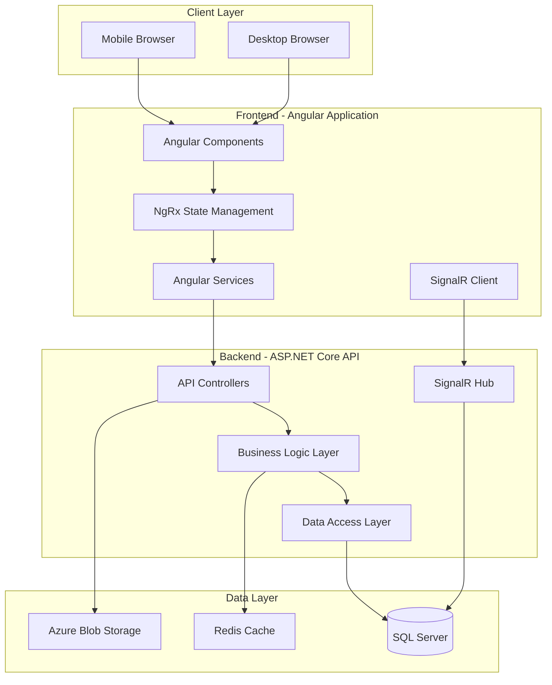

# Design Document: Field Resource Management Tool

## Overview

The Field Resource Management Tool is a full-stack web application integrated into the ATLAS system that provides comprehensive field technician scheduling, job management, and performance tracking capabilities. The system follows a modern Angular-based frontend architecture with NgRx state management, communicating with a RESTful backend API.

### Design Goals

1. **Mobile-First Experience**: Prioritize mobile usability for field technicians
2. **Real-Time Updates**: Provide live job status and schedule changes via SignalR
3. **Scalability**: Support 100+ concurrent users and 1000+ active jobs
4. **Integration**: Seamlessly integrate with existing ATLAS infrastructure
5. **Offline Capability**: Allow basic functionality when connectivity is limited
6. **Performance**: Maintain sub-2-second response times for standard operations

### Technology Stack

**Frontend:**
- Angular 15+ with TypeScript
- NgRx for state management
- Angular Material for UI components
- SignalR client for real-time updates
- Progressive Web App (PWA) capabilities for offline support

**Backend:**
- ASP.NET Core Web API
- Entity Framework Core for data access
- SignalR for real-time communication
- SQL Server database
- Azure Blob Storage for file attachments

**Infrastructure:**
- Azure App Service for hosting
- Azure SQL Database
- Azure Blob Storage
- Azure Application Insights for monitoring

## Architecture

### System Architecture




### Layered Architecture

The system follows a clean layered architecture:

1. **Presentation Layer**: Angular components and UI logic
2. **State Management Layer**: NgRx store, actions, reducers, effects
3. **Service Layer**: Angular services for API communication
4. **API Layer**: RESTful endpoints and SignalR hubs
5. **Business Logic Layer**: Domain logic and validation
6. **Data Access Layer**: Entity Framework Core repositories
7. **Database Layer**: SQL Server with optimized schema

### Module Organization


The frontend will be organized as a feature module within the ATLAS application:

```
src/app/features/field-resource-management/
├── components/
│   ├── technicians/
│   │   ├── technician-list/
│   │   ├── technician-detail/
│   │   └── technician-form/
│   ├── jobs/
│   │   ├── job-list/
│   │   ├── job-detail/
│   │   └── job-form/
│   ├── scheduling/
│   │   ├── calendar-view/
│   │   ├── assignment-dialog/
│   │   └── conflict-resolver/
│   ├── mobile/
│   │   ├── daily-view/
│   │   ├── job-card/
│   │   └── time-tracker/
│   ├── reporting/
│   │   ├── dashboard/
│   │   ├── utilization-report/
│   │   └── job-performance-report/
│   └── shared/
│       ├── skill-selector/
│       ├── status-badge/
│       └── file-upload/
├── state/
│   ├── technicians/
│   ├── jobs/
│   ├── assignments/
│   ├── time-entries/
│   └── notifications/
├── services/
│   ├── technician.service.ts
│   ├── job.service.ts
│   ├── scheduling.service.ts
│   ├── time-tracking.service.ts
│   ├── reporting.service.ts
│   └── frm-signalr.service.ts
├── models/
│   ├── technician.model.ts
│   ├── job.model.ts
│   ├── assignment.model.ts
│   └── time-entry.model.ts
└── field-resource-management.module.ts
```

## Components and Interfaces

### Core Components

#### 1. Technician Management Components

**TechnicianListComponent**
- Displays paginated list of all technicians
- Supports search and filtering by name, role, skills, availability
- Provides quick actions: view details, edit, deactivate
- Shows key information: name, role, skills, current assignment status

**TechnicianDetailComponent**
- Displays comprehensive technician profile
- Shows skills, certifications with expiration tracking
- Displays availability calendar
- Shows assignment history and performance metrics
- Provides edit and delete actions (admin only)

**TechnicianFormComponent**
- Create/edit technician profiles
- Multi-step form: basic info, skills, certifications, availability
- Validates required fields and data formats
- Supports skill tag selection with autocomplete
- Handles certification date validation

#### 2. Job Management Components

**JobListComponent**
- Displays paginated list of jobs with filtering
- Supports search by job ID, client, site name
- Filter by status, priority, job type, date range
- Batch selection for bulk operations
- Quick actions: view, edit, assign, delete

**JobDetailComponent**
- Displays complete job information
- Shows assigned technicians with contact info
- Displays time entries and labor hours
- Shows job status history timeline
- Displays attachments and notes
- Provides actions: edit, reassign, add notes

**JobFormComponent**
- Create/edit job work orders
- Validates required fields
- Skill requirement selector
- File attachment upload
- Address validation and geocoding
- Estimated hours and crew size input

#### 3. Scheduling Components

**CalendarViewComponent**
- Day and week view toggle
- Displays technician schedules in grid format
- Color-coded job status indicators
- Drag-and-drop job assignment
- Conflict highlighting
- Click to view job details
- Right-click context menu for quick actions

**AssignmentDialogComponent**
- Modal for assigning technicians to jobs
- Displays qualified technicians ranked by skill match
- Shows technician availability and current workload
- Conflict detection with override option
- Skill mismatch warnings
- Assignment confirmation

**ConflictResolverComponent**
- Lists all scheduling conflicts
- Shows conflicting jobs with details
- Provides resolution options: reassign, reschedule, override
- Requires justification for overrides
- Batch conflict resolution

#### 4. Mobile Components

**DailyViewComponent**
- Mobile-optimized today's schedule
- Card-based job display
- Swipe gestures for status updates
- Pull-to-refresh
- Offline data caching
- Quick access to job details

**JobCardComponent**
- Compact job information display
- Status update buttons
- Clock in/out buttons
- Navigation to full job details
- Customer contact quick actions (call, email)
- Photo upload shortcut

**TimeTrackerComponent**
- Active job timer display
- Clock in/out functionality
- Automatic location capture
- Mileage calculation display
- Manual time adjustment (admin override)
- Break time tracking

#### 5. Reporting Components

**DashboardComponent**
- KPI summary cards
- Jobs by status chart
- Technician utilization gauge
- Recent activity feed
- Alerts and notifications panel
- Quick links to detailed reports

**UtilizationReportComponent**
- Technician utilization table and charts
- Date range selector
- Filter by technician, role, region
- Export to CSV/PDF
- Drill-down to individual technician details
- Trend analysis visualization

**JobPerformanceReportComponent**
- Jobs completed metrics
- Planned vs actual hours comparison
- Schedule adherence percentage
- Filter by job type, priority, client
- Export functionality
- Graphical trend analysis

### Service Interfaces

#### TechnicianService

```typescript
interface TechnicianService {
  getTechnicians(filters?: TechnicianFilters): Observable<Technician[]>;
  getTechnicianById(id: string): Observable<Technician>;
  createTechnician(technician: CreateTechnicianDto): Observable<Technician>;
  updateTechnician(id: string, technician: UpdateTechnicianDto): Observable<Technician>;
  deleteTechnician(id: string): Observable<void>;
  getTechnicianAvailability(id: string, dateRange: DateRange): Observable<Availability[]>;
  updateTechnicianAvailability(id: string, availability: Availability[]): Observable<void>;
  getTechnicianSkills(id: string): Observable<Skill[]>;
  addTechnicianSkill(id: string, skill: Skill): Observable<void>;
  removeTechnicianSkill(id: string, skillId: string): Observable<void>;
  getTechnicianCertifications(id: string): Observable<Certification[]>;
  getExpiringCertifications(daysThreshold: number): Observable<Certification[]>;
}
```

#### JobService

```typescript
interface JobService {
  getJobs(filters?: JobFilters): Observable<Job[]>;
  getJobById(id: string): Observable<Job>;
  createJob(job: CreateJobDto): Observable<Job>;
  updateJob(id: string, job: UpdateJobDto): Observable<Job>;
  deleteJob(id: string): Observable<void>;
  deleteJobs(ids: string[]): Observable<void>;
  getJobsByTechnician(technicianId: string, dateRange?: DateRange): Observable<Job[]>;
  updateJobStatus(id: string, status: JobStatus, reason?: string): Observable<Job>;
  addJobNote(id: string, note: string): Observable<JobNote>;
  uploadJobAttachment(id: string, file: File): Observable<Attachment>;
  getJobStatusHistory(id: string): Observable<StatusHistory[]>;
  createJobFromTemplate(templateId: string): Observable<Job>;
}
```

#### SchedulingService

```typescript
interface SchedulingService {
  assignTechnician(jobId: string, technicianId: string): Observable<Assignment>;
  unassignTechnician(assignmentId: string): Observable<void>;
  reassignJob(jobId: string, fromTechnicianId: string, toTechnicianId: string): Observable<Assignment>;
  getAssignments(filters?: AssignmentFilters): Observable<Assignment[]>;
  checkConflicts(technicianId: string, jobId: string): Observable<Conflict[]>;
  getQualifiedTechnicians(jobId: string): Observable<TechnicianMatch[]>;
  getTechnicianSchedule(technicianId: string, dateRange: DateRange): Observable<ScheduleItem[]>;
  bulkAssign(assignments: BulkAssignmentDto[]): Observable<AssignmentResult[]>;
  detectAllConflicts(dateRange?: DateRange): Observable<Conflict[]>;
}
```

#### TimeTrackingService

```typescript
interface TimeTrackingService {
  clockIn(jobId: string, technicianId: string, location?: GeoLocation): Observable<TimeEntry>;
  clockOut(timeEntryId: string, location?: GeoLocation): Observable<TimeEntry>;
  getTimeEntries(filters?: TimeEntryFilters): Observable<TimeEntry[]>;
  updateTimeEntry(id: string, entry: UpdateTimeEntryDto): Observable<TimeEntry>;
  getTimeEntriesByJob(jobId: string): Observable<TimeEntry[]>;
  getTimeEntriesByTechnician(technicianId: string, dateRange: DateRange): Observable<TimeEntry[]>;
  calculateLaborHours(jobId: string): Observable<LaborSummary>;
  getActiveTimeEntry(technicianId: string): Observable<TimeEntry | null>;
}
```

#### ReportingService

```typescript
interface ReportingService {
  getDashboardMetrics(): Observable<DashboardMetrics>;
  getTechnicianUtilization(filters: UtilizationFilters): Observable<UtilizationReport>;
  getJobPerformance(filters: PerformanceFilters): Observable<PerformanceReport>;
  getKPIs(): Observable<KPI[]>;
  exportReport(reportType: ReportType, filters: any, format: ExportFormat): Observable<Blob>;
  getScheduleAdherence(dateRange: DateRange): Observable<AdherenceMetrics>;
}
```

#### FrmSignalRService

```typescript
interface FrmSignalRService {
  connect(): Promise<void>;
  disconnect(): Promise<void>;
  onJobAssigned(callback: (assignment: Assignment) => void): void;
  onJobStatusChanged(callback: (update: JobStatusUpdate) => void): void;
  onJobReassigned(callback: (reassignment: Reassignment) => void): void;
  onNotification(callback: (notification: Notification) => void): void;
  subscribeToTechnicianUpdates(technicianId: string): void;
  unsubscribeFromTechnicianUpdates(technicianId: string): void;
}
```

## Data Models

### Core Entities

#### Technician

```typescript
interface Technician {
  id: string;
  technicianId: string; // Business ID
  firstName: string;
  lastName: string;
  email: string;
  phone: string;
  role: TechnicianRole; // Installer, Lead, Level1-4
  employmentType: EmploymentType; // W2, 1099
  homeBase: string;
  region: string;
  skills: Skill[];
  certifications: Certification[];
  availability: Availability[];
  hourlyCostRate?: number; // Admin only
  isActive: boolean;
  createdAt: Date;
  updatedAt: Date;
}

enum TechnicianRole {
  Installer = 'Installer',
  Lead = 'Lead',
  Level1 = 'Level1',
  Level2 = 'Level2',
  Level3 = 'Level3',
  Level4 = 'Level4'
}

enum EmploymentType {
  W2 = 'W2',
  Contractor1099 = '1099'
}

interface Skill {
  id: string;
  name: string;
  category: string;
}

interface Certification {
  id: string;
  name: string;
  issueDate: Date;
  expirationDate: Date;
  status: CertificationStatus;
}

enum CertificationStatus {
  Active = 'Active',
  ExpiringSoon = 'ExpiringSoon',
  Expired = 'Expired'
}

interface Availability {
  id: string;
  technicianId: string;
  date: Date;
  isAvailable: boolean;
  reason?: string; // PTO, Sick, Training
}
```

#### Job

```typescript
interface Job {
  id: string;
  jobId: string; // Business ID
  client: string;
  siteName: string;
  siteAddress: Address;
  jobType: JobType;
  priority: Priority;
  status: JobStatus;
  scopeDescription: string;
  requiredSkills: Skill[];
  requiredCrewSize: number;
  estimatedLaborHours: number;
  scheduledStartDate: Date;
  scheduledEndDate: Date;
  actualStartDate?: Date;
  actualEndDate?: Date;
  customerPOC?: ContactInfo;
  attachments: Attachment[];
  notes: JobNote[];
  assignments: Assignment[];
  timeEntries: TimeEntry[];
  createdBy: string;
  createdAt: Date;
  updatedAt: Date;
}

enum JobType {
  Install = 'Install',
  Decom = 'Decom',
  SiteSurvey = 'SiteSurvey',
  PM = 'PM'
}

enum Priority {
  P1 = 'P1',
  P2 = 'P2',
  Normal = 'Normal'
}

enum JobStatus {
  NotStarted = 'NotStarted',
  EnRoute = 'EnRoute',
  OnSite = 'OnSite',
  Completed = 'Completed',
  Issue = 'Issue',
  Cancelled = 'Cancelled'
}

interface Address {
  street: string;
  city: string;
  state: string;
  zipCode: string;
  latitude?: number;
  longitude?: number;
}

interface ContactInfo {
  name: string;
  phone: string;
  email: string;
}

interface Attachment {
  id: string;
  fileName: string;
  fileSize: number;
  fileType: string;
  blobUrl: string;
  uploadedBy: string;
  uploadedAt: Date;
}

interface JobNote {
  id: string;
  jobId: string;
  text: string;
  author: string;
  createdAt: Date;
  updatedAt?: Date;
}
```

#### Assignment

```typescript
interface Assignment {
  id: string;
  jobId: string;
  technicianId: string;
  assignedBy: string;
  assignedAt: Date;
  isActive: boolean;
  job?: Job;
  technician?: Technician;
}

interface TechnicianMatch {
  technician: Technician;
  matchPercentage: number;
  missingSkills: Skill[];
  currentWorkload: number;
  hasConflicts: boolean;
  conflicts: Conflict[];
}

interface Conflict {
  technicianId: string;
  conflictingJobId: string;
  conflictingJobTitle: string;
  timeRange: DateRange;
  severity: ConflictSeverity;
}

enum ConflictSeverity {
  Warning = 'Warning',
  Error = 'Error'
}
```

#### TimeEntry

```typescript
interface TimeEntry {
  id: string;
  jobId: string;
  technicianId: string;
  clockInTime: Date;
  clockOutTime?: Date;
  clockInLocation?: GeoLocation;
  clockOutLocation?: GeoLocation;
  totalHours?: number;
  mileage?: number;
  isManuallyAdjusted: boolean;
  adjustedBy?: string;
  adjustmentReason?: string;
  createdAt: Date;
  updatedAt: Date;
}

interface GeoLocation {
  latitude: number;
  longitude: number;
  accuracy: number;
}
```

### Reporting Models

```typescript
interface DashboardMetrics {
  totalActiveJobs: number;
  totalAvailableTechnicians: number;
  jobsByStatus: Record<JobStatus, number>;
  averageUtilization: number;
  jobsRequiringAttention: Job[];
  recentActivity: ActivityItem[];
  kpis: KPI[];
}

interface KPI {
  name: string;
  value: number;
  target: number;
  unit: string;
  trend: Trend;
  status: KPIStatus;
}

enum Trend {
  Up = 'Up',
  Down = 'Down',
  Stable = 'Stable'
}

enum KPIStatus {
  OnTrack = 'OnTrack',
  AtRisk = 'AtRisk',
  BelowTarget = 'BelowTarget'
}

interface UtilizationReport {
  dateRange: DateRange;
  technicians: TechnicianUtilization[];
  averageUtilization: number;
}

interface TechnicianUtilization {
  technician: Technician;
  availableHours: number;
  workedHours: number;
  utilizationRate: number;
  jobsCompleted: number;
}

interface PerformanceReport {
  dateRange: DateRange;
  totalJobsCompleted: number;
  totalJobsOpen: number;
  averageLaborHours: number;
  scheduleAdherence: number;
  jobsByType: Record<JobType, number>;
  topPerformers: TechnicianPerformance[];
}

interface TechnicianPerformance {
  technician: Technician;
  jobsCompleted: number;
  totalHours: number;
  averageJobDuration: number;
  onTimeCompletionRate: number;
}
```

### State Models

```typescript
interface FrmState {
  technicians: TechnicianState;
  jobs: JobState;
  assignments: AssignmentState;
  timeEntries: TimeEntryState;
  notifications: NotificationState;
  ui: UIState;
}

interface TechnicianState {
  entities: Record<string, Technician>;
  ids: string[];
  selectedId: string | null;
  loading: boolean;
  error: string | null;
  filters: TechnicianFilters;
}

interface JobState {
  entities: Record<string, Job>;
  ids: string[];
  selectedId: string | null;
  loading: boolean;
  error: string | null;
  filters: JobFilters;
}

interface AssignmentState {
  entities: Record<string, Assignment>;
  ids: string[];
  conflicts: Conflict[];
  loading: boolean;
  error: string | null;
}

interface TimeEntryState {
  entities: Record<string, TimeEntry>;
  ids: string[];
  activeEntry: TimeEntry | null;
  loading: boolean;
  error: string | null;
}

interface NotificationState {
  notifications: Notification[];
  unreadCount: number;
}

interface UIState {
  calendarView: CalendarViewType;
  selectedDate: Date;
  sidebarOpen: boolean;
  mobileMenuOpen: boolean;
}
```

