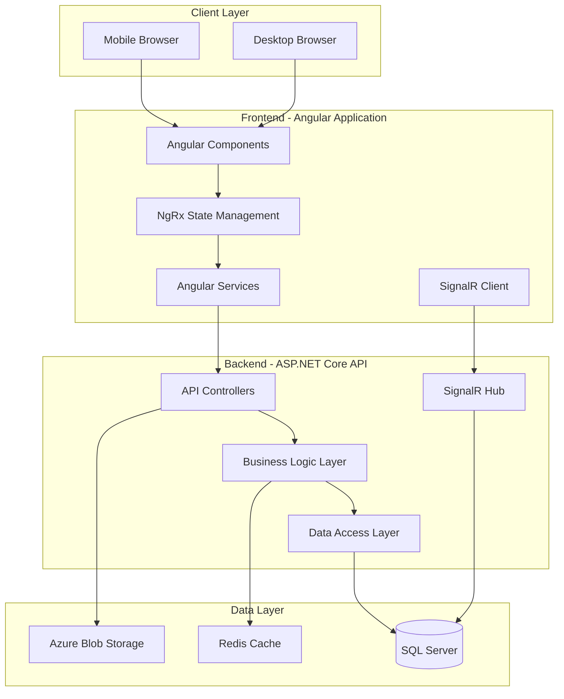

# Design Document: Field Resource Management Tool

## Overview

The Field Resource Management Tool is a full-stack web application integrated into the ATLAS system that provides comprehensive field technician scheduling, job management, and performance tracking capabilities. The system follows a modern Angular-based frontend architecture with NgRx state management, communicating with a RESTful backend API.

### Design Goals

1. **Mobile-First Experience**: Prioritize mobile usability for field technicians
2. **Real-Time Updates**: Provide live job status and schedule changes via SignalR
3. **Scalability**: Support 100+ concurrent users and 1000+ active jobs
4. **Integration**: Seamlessly integrate with existing ATLAS infrastructure
5. **Offline Capability**: Allow basic functionality when connectivity is limited
6. **Performance**: Maintain sub-2-second response times for standard operations

### Technology Stack

**Frontend:**
- Angular 15+ with TypeScript
- NgRx for state management
- Angular Material for UI components
- SignalR client for real-time updates
- Progressive Web App (PWA) capabilities for offline support

**Backend:**
- ASP.NET Core Web API
- Entity Framework Core for data access
- SignalR for real-time communication
- SQL Server database
- Azure Blob Storage for file attachments

**Infrastructure:**
- Azure App Service for hosting
- Azure SQL Database
- Azure Blob Storage
- Azure Application Insights for monitoring

## Architecture

### System Architecture




### Layered Architecture

The system follows a clean layered architecture:

1. **Presentation Layer**: Angular components and UI logic
2. **State Management Layer**: NgRx store, actions, reducers, effects
3. **Service Layer**: Angular services for API communication
4. **API Layer**: RESTful endpoints and SignalR hubs
5. **Business Logic Layer**: Domain logic and validation
6. **Data Access Layer**: Entity Framework Core repositories
7. **Database Layer**: SQL Server with optimized schema

### Module Organization


The frontend will be organized as a feature module within the ATLAS application:

```
src/app/features/field-resource-management/
├── components/
│   ├── technicians/
│   │   ├── technician-list/
│   │   ├── technician-detail/
│   │   └── technician-form/
│   ├── jobs/
│   │   ├── job-list/
│   │   ├── job-detail/
│   │   └── job-form/
│   ├── scheduling/
│   │   ├── calendar-view/
│   │   ├── assignment-dialog/
│   │   └── conflict-resolver/
│   ├── mobile/
│   │   ├── daily-view/
│   │   ├── job-card/
│   │   └── time-tracker/
│   ├── reporting/
│   │   ├── dashboard/
│   │   ├── utilization-report/
│   │   └── job-performance-report/
│   └── shared/
│       ├── skill-selector/
│       ├── status-badge/
│       └── file-upload/
├── state/
│   ├── technicians/
│   ├── jobs/
│   ├── assignments/
│   ├── time-entries/
│   └── notifications/
├── services/
│   ├── technician.service.ts
│   ├── job.service.ts
│   ├── scheduling.service.ts
│   ├── time-tracking.service.ts
│   ├── reporting.service.ts
│   └── frm-signalr.service.ts
├── models/
│   ├── technician.model.ts
│   ├── job.model.ts
│   ├── assignment.model.ts
│   └── time-entry.model.ts
└── field-resource-management.module.ts
```

## Components and Interfaces

### Core Components

#### 1. Technician Management Components

**TechnicianListComponent**
- Displays paginated list of all technicians
- Supports search and filtering by name, role, skills, availability
- Provides quick actions: view details, edit, deactivate
- Shows key information: name, role, skills, current assignment status

**TechnicianDetailComponent**
- Displays comprehensive technician profile
- Shows skills, certifications with expiration tracking
- Displays availability calendar
- Shows assignment history and performance metrics
- Provides edit and delete actions (admin only)

**TechnicianFormComponent**
- Create/edit technician profiles
- Multi-step form: basic info, skills, certifications, availability
- Validates required fields and data formats
- Supports skill tag selection with autocomplete
- Handles certification date validation

#### 2. Job Management Components

**JobListComponent**
- Displays paginated list of jobs with filtering
- Supports search by job ID, client, site name
- Filter by status, priority, job type, date range
- Batch selection for bulk operations
- Quick actions: view, edit, assign, delete

**JobDetailComponent**
- Displays complete job information
- Shows assigned technicians with contact info
- Displays time entries and labor hours
- Shows job status history timeline
- Displays attachments and notes
- Provides actions: edit, reassign, add notes

**JobFormComponent**
- Create/edit job work orders
- Validates required fields
- Skill requirement selector
- File attachment upload
- Address validation and geocoding
- Estimated hours and crew size input

#### 3. Scheduling Components

**CalendarViewComponent**
- Day and week view toggle
- Displays technician schedules in grid format
- Color-coded job status indicators
- Drag-and-drop job assignment
- Conflict highlighting
- Click to view job details
- Right-click context menu for quick actions

**AssignmentDialogComponent**
- Modal for assigning technicians to jobs
- Displays qualified technicians ranked by skill match
- Shows technician availability and current workload
- Conflict detection with override option
- Skill mismatch warnings
- Assignment confirmation

**ConflictResolverComponent**
- Lists all scheduling conflicts
- Shows conflicting jobs with details
- Provides resolution options: reassign, reschedule, override
- Requires justification for overrides
- Batch conflict resolution

#### 4. Mobile Components

**DailyViewComponent**
- Mobile-optimized today's schedule
- Card-based job display
- Swipe gestures for status updates
- Pull-to-refresh
- Offline data caching
- Quick access to job details

**JobCardComponent**
- Compact job information display
- Status update buttons
- Clock in/out buttons
- Navigation to full job details
- Customer contact quick actions (call, email)
- Photo upload shortcut

**TimeTrackerComponent**
- Active job timer display
- Clock in/out functionality
- Automatic location capture
- Mileage calculation display
- Manual time adjustment (admin override)
- Break time tracking

#### 5. Reporting Components

**DashboardComponent**
- KPI summary cards
- Jobs by status chart
- Technician utilization gauge
- Recent activity feed
- Alerts and notifications panel
- Quick links to detailed reports

**UtilizationReportComponent**
- Technician utilization table and charts
- Date range selector
- Filter by technician, role, region
- Export to CSV/PDF
- Drill-down to individual technician details
- Trend analysis visualization

**JobPerformanceReportComponent**
- Jobs completed metrics
- Planned vs actual hours comparison
- Schedule adherence percentage
- Filter by job type, priority, client
- Export functionality
- Graphical trend analysis

### Service Interfaces

#### TechnicianService

```typescript
interface TechnicianService {
  getTechnicians(filters?: TechnicianFilters): Observable<Technician[]>;
  getTechnicianById(id: string): Observable<Technician>;
  createTechnician(technician: CreateTechnicianDto): Observable<Technician>;
  updateTechnician(id: string, technician: UpdateTechnicianDto): Observable<Technician>;
  deleteTechnician(id: string): Observable<void>;
  getTechnicianAvailability(id: string, dateRange: DateRange): Observable<Availability[]>;
  updateTechnicianAvailability(id: string, availability: Availability[]): Observable<void>;
  getTechnicianSkills(id: string): Observable<Skill[]>;
  addTechnicianSkill(id: string, skill: Skill): Observable<void>;
  removeTechnicianSkill(id: string, skillId: string): Observable<void>;
  getTechnicianCertifications(id: string): Observable<Certification[]>;
  getExpiringCertifications(daysThreshold: number): Observable<Certification[]>;
}
```

#### JobService

```typescript
interface JobService {
  getJobs(filters?: JobFilters): Observable<Job[]>;
  getJobById(id: string): Observable<Job>;
  createJob(job: CreateJobDto): Observable<Job>;
  updateJob(id: string, job: UpdateJobDto): Observable<Job>;
  deleteJob(id: string): Observable<void>;
  deleteJobs(ids: string[]): Observable<void>;
  getJobsByTechnician(technicianId: string, dateRange?: DateRange): Observable<Job[]>;
  updateJobStatus(id: string, status: JobStatus, reason?: string): Observable<Job>;
  addJobNote(id: string, note: string): Observable<JobNote>;
  uploadJobAttachment(id: string, file: File): Observable<Attachment>;
  getJobStatusHistory(id: string): Observable<StatusHistory[]>;
  createJobFromTemplate(templateId: string): Observable<Job>;
}
```

#### SchedulingService

```typescript
interface SchedulingService {
  assignTechnician(jobId: string, technicianId: string): Observable<Assignment>;
  unassignTechnician(assignmentId: string): Observable<void>;
  reassignJob(jobId: string, fromTechnicianId: string, toTechnicianId: string): Observable<Assignment>;
  getAssignments(filters?: AssignmentFilters): Observable<Assignment[]>;
  checkConflicts(technicianId: string, jobId: string): Observable<Conflict[]>;
  getQualifiedTechnicians(jobId: string): Observable<TechnicianMatch[]>;
  getTechnicianSchedule(technicianId: string, dateRange: DateRange): Observable<ScheduleItem[]>;
  bulkAssign(assignments: BulkAssignmentDto[]): Observable<AssignmentResult[]>;
  detectAllConflicts(dateRange?: DateRange): Observable<Conflict[]>;
}
```

#### TimeTrackingService

```typescript
interface TimeTrackingService {
  clockIn(jobId: string, technicianId: string, location?: GeoLocation): Observable<TimeEntry>;
  clockOut(timeEntryId: string, location?: GeoLocation): Observable<TimeEntry>;
  getTimeEntries(filters?: TimeEntryFilters): Observable<TimeEntry[]>;
  updateTimeEntry(id: string, entry: UpdateTimeEntryDto): Observable<TimeEntry>;
  getTimeEntriesByJob(jobId: string): Observable<TimeEntry[]>;
  getTimeEntriesByTechnician(technicianId: string, dateRange: DateRange): Observable<TimeEntry[]>;
  calculateLaborHours(jobId: string): Observable<LaborSummary>;
  getActiveTimeEntry(technicianId: string): Observable<TimeEntry | null>;
}
```

#### ReportingService

```typescript
interface ReportingService {
  getDashboardMetrics(): Observable<DashboardMetrics>;
  getTechnicianUtilization(filters: UtilizationFilters): Observable<UtilizationReport>;
  getJobPerformance(filters: PerformanceFilters): Observable<PerformanceReport>;
  getKPIs(): Observable<KPI[]>;
  exportReport(reportType: ReportType, filters: any, format: ExportFormat): Observable<Blob>;
  getScheduleAdherence(dateRange: DateRange): Observable<AdherenceMetrics>;
}
```

#### FrmSignalRService

```typescript
interface FrmSignalRService {
  connect(): Promise<void>;
  disconnect(): Promise<void>;
  onJobAssigned(callback: (assignment: Assignment) => void): void;
  onJobStatusChanged(callback: (update: JobStatusUpdate) => void): void;
  onJobReassigned(callback: (reassignment: Reassignment) => void): void;
  onNotification(callback: (notification: Notification) => void): void;
  subscribeToTechnicianUpdates(technicianId: string): void;
  unsubscribeFromTechnicianUpdates(technicianId: string): void;
}
```

## Data Models

### Core Entities

#### Technician

```typescript
interface Technician {
  id: string;
  technicianId: string; // Business ID
  firstName: string;
  lastName: string;
  email: string;
  phone: string;
  role: TechnicianRole; // Installer, Lead, Level1-4
  employmentType: EmploymentType; // W2, 1099
  homeBase: string;
  region: string;
  skills: Skill[];
  certifications: Certification[];
  availability: Availability[];
  hourlyCostRate?: number; // Admin only
  isActive: boolean;
  createdAt: Date;
  updatedAt: Date;
}

enum TechnicianRole {
  Installer = 'Installer',
  Lead = 'Lead',
  Level1 = 'Level1',
  Level2 = 'Level2',
  Level3 = 'Level3',
  Level4 = 'Level4'
}

enum EmploymentType {
  W2 = 'W2',
  Contractor1099 = '1099'
}

interface Skill {
  id: string;
  name: string;
  category: string;
}

interface Certification {
  id: string;
  name: string;
  issueDate: Date;
  expirationDate: Date;
  status: CertificationStatus;
}

enum CertificationStatus {
  Active = 'Active',
  ExpiringSoon = 'ExpiringSoon',
  Expired = 'Expired'
}

interface Availability {
  id: string;
  technicianId: string;
  date: Date;
  isAvailable: boolean;
  reason?: string; // PTO, Sick, Training
}
```

#### Job

```typescript
interface Job {
  id: string;
  jobId: string; // Business ID
  client: string;
  siteName: string;
  siteAddress: Address;
  jobType: JobType;
  priority: Priority;
  status: JobStatus;
  scopeDescription: string;
  requiredSkills: Skill[];
  requiredCrewSize: number;
  estimatedLaborHours: number;
  scheduledStartDate: Date;
  scheduledEndDate: Date;
  actualStartDate?: Date;
  actualEndDate?: Date;
  customerPOC?: ContactInfo;
  attachments: Attachment[];
  notes: JobNote[];
  assignments: Assignment[];
  timeEntries: TimeEntry[];
  createdBy: string;
  createdAt: Date;
  updatedAt: Date;
}

enum JobType {
  Install = 'Install',
  Decom = 'Decom',
  SiteSurvey = 'SiteSurvey',
  PM = 'PM'
}

enum Priority {
  P1 = 'P1',
  P2 = 'P2',
  Normal = 'Normal'
}

enum JobStatus {
  NotStarted = 'NotStarted',
  EnRoute = 'EnRoute',
  OnSite = 'OnSite',
  Completed = 'Completed',
  Issue = 'Issue',
  Cancelled = 'Cancelled'
}

interface Address {
  street: string;
  city: string;
  state: string;
  zipCode: string;
  latitude?: number;
  longitude?: number;
}

interface ContactInfo {
  name: string;
  phone: string;
  email: string;
}

interface Attachment {
  id: string;
  fileName: string;
  fileSize: number;
  fileType: string;
  blobUrl: string;
  uploadedBy: string;
  uploadedAt: Date;
}

interface JobNote {
  id: string;
  jobId: string;
  text: string;
  author: string;
  createdAt: Date;
  updatedAt?: Date;
}
```

#### Assignment

```typescript
interface Assignment {
  id: string;
  jobId: string;
  technicianId: string;
  assignedBy: string;
  assignedAt: Date;
  isActive: boolean;
  job?: Job;
  technician?: Technician;
}

interface TechnicianMatch {
  technician: Technician;
  matchPercentage: number;
  missingSkills: Skill[];
  currentWorkload: number;
  hasConflicts: boolean;
  conflicts: Conflict[];
}

interface Conflict {
  technicianId: string;
  conflictingJobId: string;
  conflictingJobTitle: string;
  timeRange: DateRange;
  severity: ConflictSeverity;
}

enum ConflictSeverity {
  Warning = 'Warning',
  Error = 'Error'
}
```

#### TimeEntry

```typescript
interface TimeEntry {
  id: string;
  jobId: string;
  technicianId: string;
  clockInTime: Date;
  clockOutTime?: Date;
  clockInLocation?: GeoLocation;
  clockOutLocation?: GeoLocation;
  totalHours?: number;
  mileage?: number;
  isManuallyAdjusted: boolean;
  adjustedBy?: string;
  adjustmentReason?: string;
  createdAt: Date;
  updatedAt: Date;
}

interface GeoLocation {
  latitude: number;
  longitude: number;
  accuracy: number;
}
```

### Reporting Models

```typescript
interface DashboardMetrics {
  totalActiveJobs: number;
  totalAvailableTechnicians: number;
  jobsByStatus: Record<JobStatus, number>;
  averageUtilization: number;
  jobsRequiringAttention: Job[];
  recentActivity: ActivityItem[];
  kpis: KPI[];
}

interface KPI {
  name: string;
  value: number;
  target: number;
  unit: string;
  trend: Trend;
  status: KPIStatus;
}

enum Trend {
  Up = 'Up',
  Down = 'Down',
  Stable = 'Stable'
}

enum KPIStatus {
  OnTrack = 'OnTrack',
  AtRisk = 'AtRisk',
  BelowTarget = 'BelowTarget'
}

interface UtilizationReport {
  dateRange: DateRange;
  technicians: TechnicianUtilization[];
  averageUtilization: number;
}

interface TechnicianUtilization {
  technician: Technician;
  availableHours: number;
  workedHours: number;
  utilizationRate: number;
  jobsCompleted: number;
}

interface PerformanceReport {
  dateRange: DateRange;
  totalJobsCompleted: number;
  totalJobsOpen: number;
  averageLaborHours: number;
  scheduleAdherence: number;
  jobsByType: Record<JobType, number>;
  topPerformers: TechnicianPerformance[];
}

interface TechnicianPerformance {
  technician: Technician;
  jobsCompleted: number;
  totalHours: number;
  averageJobDuration: number;
  onTimeCompletionRate: number;
}
```

### State Models

```typescript
interface FrmState {
  technicians: TechnicianState;
  jobs: JobState;
  assignments: AssignmentState;
  timeEntries: TimeEntryState;
  notifications: NotificationState;
  ui: UIState;
}

interface TechnicianState {
  entities: Record<string, Technician>;
  ids: string[];
  selectedId: string | null;
  loading: boolean;
  error: string | null;
  filters: TechnicianFilters;
}

interface JobState {
  entities: Record<string, Job>;
  ids: string[];
  selectedId: string | null;
  loading: boolean;
  error: string | null;
  filters: JobFilters;
}

interface AssignmentState {
  entities: Record<string, Assignment>;
  ids: string[];
  conflicts: Conflict[];
  loading: boolean;
  error: string | null;
}

interface TimeEntryState {
  entities: Record<string, TimeEntry>;
  ids: string[];
  activeEntry: TimeEntry | null;
  loading: boolean;
  error: string | null;
}

interface NotificationState {
  notifications: Notification[];
  unreadCount: number;
}

interface UIState {
  calendarView: CalendarViewType;
  selectedDate: Date;
  sidebarOpen: boolean;
  mobileMenuOpen: boolean;
}
```


## Correctness Properties

*A property is a characteristic or behavior that should hold true across all valid executions of a system-essentially, a formal statement about what the system should do. Properties serve as the bridge between human-readable specifications and machine-verifiable correctness guarantees.*

Based on the prework analysis and property reflection, the following properties capture the core correctness requirements of the Field Resource Management Tool:

### Authentication and Authorization Properties

**Property 1: Valid Credentials Authenticate Successfully**

*For any* user with valid credentials in the database, authentication should succeed and return the user's designated role.

**Validates: Requirements 1.1, 1.2**

**Property 2: Authorization Enforces Role Permissions**

*For any* user and any feature, access should be granted if and only if the user's role has the required permissions for that feature.

**Validates: Requirements 1.3**

**Property 3: Technicians Can Only Update Their Assigned Jobs**

*For any* technician and any job status update attempt, the update should succeed if and only if the job is currently assigned to that technician.

**Validates: Requirements 6.3**

### Data Validation Properties

**Property 4: Required Fields Are Enforced**

*For any* entity (technician, job, etc.) being saved, the save operation should succeed if and only if all required fields are populated with valid data.

**Validates: Requirements 2.1, 2.7, 3.8**

**Property 5: Field Constraints Are Enforced**

*For any* input field with size or format constraints (photo size ≤ 10MB, notes ≤ 2000 chars, valid email/phone formats), invalid inputs should be rejected.

**Validates: Requirements 9.7, 24.5, 25.4, 30.6**

### Scheduling and Conflict Detection Properties

**Property 6: Unique Job IDs**

*For any* set of created jobs, all job IDs should be unique across the system.

**Validates: Requirements 3.1**

**Property 7: Scheduling Conflicts Are Detected and Prevented**

*For any* technician and any two job assignments with overlapping time periods, the system should detect the conflict and prevent the second assignment unless explicitly overridden.

**Validates: Requirements 4.2, 4.3, 18.1**

**Property 8: Skill Matching Validation**

*For any* job assignment where the job specifies required skills, the system should verify the technician possesses those skills and display a warning if any skills are missing.

**Validates: Requirements 4.4, 4.5**

**Property 9: Technician Ranking by Skill Match**

*For any* job with required skills and a set of available technicians, technicians should be ranked in descending order by skill match percentage (matching skills / required skills).

**Validates: Requirements 19.2**

**Property 10: Cross-Region Assignment Detection**

*For any* job assignment where the job's region differs from the technician's home region, the system should flag the assignment as cross-region.

**Validates: Requirements 28.6**

### Time Tracking Properties

**Property 11: Clock-In Creates Time Entry**

*For any* technician clocking in to a job, a time entry should be created with the current timestamp as the start time and the technician's current location (if available).

**Validates: Requirements 7.1**

**Property 12: Clock-Out Completes Time Entry**

*For any* active time entry, clocking out should update the entry with the current timestamp as the stop time and the technician's current location (if available).

**Validates: Requirements 7.2**

**Property 13: Labor Hours Calculation**

*For any* time entry with both clock-in and clock-out times, the total labor hours should equal the time difference in hours (clock-out time - clock-in time).

**Validates: Requirements 7.3**

**Property 14: Single Active Job Per Technician**

*For any* technician, attempting to clock in to a second job while already clocked in to another job should be rejected.

**Validates: Requirements 7.4**

**Property 15: Mileage Calculation Validity**

*For any* time entry with start and end locations, the calculated mileage should be non-negative and within reasonable bounds based on the distance between locations.

**Validates: Requirements 8.3**

### Audit and History Properties

**Property 16: Status Changes Are Recorded**

*For any* job status update, a status history record should be created containing the new status, timestamp, and the user who made the change.

**Validates: Requirements 6.2**

**Property 17: Audit Log Completeness**

*For any* logged action (job creation, profile change, assignment, time entry modification), the audit log entry should contain user ID, timestamp, and action type.

**Validates: Requirements 17.5**

**Property 18: Time Entries Preserved on Reassignment**

*For any* job reassignment, all existing time entries associated with the job should remain unchanged (no deletions or modifications).

**Validates: Requirements 20.3**

### Reporting and Calculation Properties

**Property 19: Utilization Rate Formula**

*For any* technician with recorded labor hours and available hours, the utilization rate should equal (actual labor hours / available hours) × 100.

**Validates: Requirements 10.1**

**Property 20: Unavailable Dates Excluded from Utilization**

*For any* technician's utilization calculation, dates marked as unavailable (PTO, sick days) should not be counted in the available hours.

**Validates: Requirements 10.5**

**Property 21: Schedule Adherence Calculation**

*For any* set of jobs in a date range, schedule adherence should equal (jobs completed on scheduled date / total jobs) × 100.

**Validates: Requirements 11.4**

**Property 22: System Assignment Tracking**

*For any* date range, the percentage of jobs assigned through the system should equal (jobs with assignments / total jobs) × 100.

**Validates: Requirements 29.1**

### Notification Properties

**Property 23: Assignment Notifications**

*For any* job assignment to a technician, a notification should be created and delivered to that technician.

**Validates: Requirements 12.1**

**Property 24: Certification Expiration Notifications**

*For any* certification with an expiration date within 30 days, a notification should be sent to administrators.

**Validates: Requirements 26.3**

### Business Logic Properties

**Property 25: Expired Certifications Remove Skills**

*For any* technician certification that has expired, the associated skill tag should be automatically removed from the technician's profile.

**Validates: Requirements 26.4**

**Property 26: Job Template Field Population**

*For any* job created from a template, all fields defined in the template should be copied to the new job with their template values.

**Validates: Requirements 27.4**

**Property 27: Batch Operation Validation**

*For any* batch operation on multiple entities, each individual operation should be validated independently, and any failures should be reported without affecting valid operations.

**Validates: Requirements 21.5**

**Property 28: Export Data Completeness**

*For any* data export operation, the exported data should include all visible columns and respect all applied filters from the current view.

**Validates: Requirements 23.5**

## Error Handling

The Field Resource Management Tool implements comprehensive error handling across all layers:

### Frontend Error Handling

**HTTP Error Interceptor**
- Intercepts all HTTP errors from API calls
- Displays user-friendly error messages via toast notifications
- Logs errors to console in development mode
- Handles specific status codes:
  - 401: Redirect to login
  - 403: Display "Access Denied" message
  - 404: Display "Resource Not Found" message
  - 500: Display "Server Error" message with retry option
  - Network errors: Display "Connection Lost" message

**Form Validation Errors**
- Real-time validation feedback on form fields
- Display validation messages below invalid fields
- Prevent form submission until all validations pass
- Highlight invalid fields with red borders

**State Management Errors**
- NgRx effects catch and handle service errors
- Update state with error information
- Display error messages in UI components
- Provide retry actions for failed operations

**SignalR Connection Errors**
- Automatic reconnection with exponential backoff
- Display connection status indicator
- Queue updates during disconnection
- Sync state upon reconnection

### Backend Error Handling

**Global Exception Handler**
- Catches all unhandled exceptions
- Logs exceptions with stack traces
- Returns standardized error responses
- Prevents sensitive information leakage

**Validation Errors**
- Model validation using Data Annotations
- FluentValidation for complex business rules
- Return 400 Bad Request with detailed validation errors
- Include field-level error messages

**Business Logic Errors**
- Custom exception types for domain errors:
  - `ConflictException`: Scheduling conflicts
  - `SkillMismatchException`: Missing required skills
  - `AuthorizationException`: Permission denied
  - `ResourceNotFoundException`: Entity not found
  - `ValidationException`: Business rule violations
- Map exceptions to appropriate HTTP status codes
- Include actionable error messages

**Database Errors**
- Catch and handle Entity Framework exceptions
- Retry transient errors (connection timeouts, deadlocks)
- Log database errors for troubleshooting
- Return generic error messages to clients

**File Upload Errors**
- Validate file size before upload
- Validate file types (whitelist approach)
- Handle Azure Blob Storage errors
- Clean up partial uploads on failure

### Error Response Format

All API errors follow a consistent format:

```typescript
interface ErrorResponse {
  statusCode: number;
  message: string;
  errors?: Record<string, string[]>; // Field-level validation errors
  traceId: string; // For support troubleshooting
  timestamp: Date;
}
```

### Logging Strategy

**Application Insights Integration**
- Log all errors with severity levels
- Track custom events for business operations
- Monitor performance metrics
- Set up alerts for critical errors

**Log Levels**
- Error: Exceptions and failures
- Warning: Validation failures, conflicts, skill mismatches
- Information: Successful operations, assignments, completions
- Debug: Detailed execution flow (development only)

**Sensitive Data Protection**
- Never log passwords or authentication tokens
- Mask PII in logs (email, phone, SSN)
- Sanitize user input before logging

## Testing Strategy

The Field Resource Management Tool employs a comprehensive dual testing approach combining unit tests and property-based tests to ensure correctness and reliability.

### Testing Philosophy

**Complementary Testing Approaches:**
- **Unit Tests**: Verify specific examples, edge cases, and error conditions
- **Property Tests**: Verify universal properties across all inputs through randomization
- Both approaches are necessary for comprehensive coverage
- Unit tests catch concrete bugs; property tests verify general correctness

### Property-Based Testing

**Framework Selection:**
- **Frontend**: fast-check (TypeScript property-based testing library)
- **Backend**: FsCheck (F# property-based testing library for .NET)

**Configuration:**
- Minimum 100 iterations per property test (due to randomization)
- Configurable seed for reproducible test runs
- Shrinking enabled to find minimal failing examples

**Property Test Organization:**

Each correctness property from the design document must be implemented as a property-based test with the following tag format:

```typescript
// Feature: field-resource-management, Property 7: Scheduling Conflicts Are Detected and Prevented
```

**Example Property Test (Frontend):**

```typescript
import * as fc from 'fast-check';

describe('Scheduling Service - Property Tests', () => {
  // Feature: field-resource-management, Property 7: Scheduling Conflicts Are Detected and Prevented
  it('should detect conflicts for overlapping assignments', () => {
    fc.assert(
      fc.property(
        fc.record({
          technicianId: fc.uuid(),
          job1: fc.record({
            id: fc.uuid(),
            startDate: fc.date(),
            endDate: fc.date()
          }),
          job2: fc.record({
            id: fc.uuid(),
            startDate: fc.date(),
            endDate: fc.date()
          })
        }),
        (data) => {
          // Ensure job1 dates are valid
          if (data.job1.endDate < data.job1.startDate) {
            [data.job1.startDate, data.job1.endDate] = [data.job1.endDate, data.job1.startDate];
          }
          
          // Ensure job2 dates are valid
          if (data.job2.endDate < data.job2.startDate) {
            [data.job2.startDate, data.job2.endDate] = [data.job2.endDate, data.job2.startDate];
          }
          
          // Check if jobs overlap
          const overlaps = 
            (data.job1.startDate <= data.job2.endDate) &&
            (data.job2.startDate <= data.job1.endDate);
          
          // Assign job1
          schedulingService.assignTechnician(data.job1.id, data.technicianId);
          
          // Try to assign job2
          const result = schedulingService.checkConflicts(data.technicianId, data.job2.id);
          
          // If jobs overlap, conflicts should be detected
          if (overlaps) {
            expect(result.length).toBeGreaterThan(0);
          }
        }
      ),
      { numRuns: 100 }
    );
  });
});
```

**Example Property Test (Backend):**

```csharp
using FsCheck;
using FsCheck.Xunit;

public class TimeTrackingPropertyTests
{
    // Feature: field-resource-management, Property 13: Labor Hours Calculation
    [Property(Arbitrary = new[] { typeof(Generators) })]
    public Property LaborHoursEqualsTimeDifference(DateTime clockIn, DateTime clockOut)
    {
        return (clockOut > clockIn).ImpliesProperty(() =>
        {
            var timeEntry = new TimeEntry
            {
                ClockInTime = clockIn,
                ClockOutTime = clockOut
            };
            
            var calculatedHours = timeTrackingService.CalculateLaborHours(timeEntry);
            var expectedHours = (clockOut - clockIn).TotalHours;
            
            return (Math.Abs(calculatedHours - expectedHours) < 0.001)
                .Label($"Expected {expectedHours}, got {calculatedHours}");
        });
    }
}
```

### Unit Testing

**Framework Selection:**
- **Frontend**: Jasmine + Karma (Angular default)
- **Backend**: xUnit + Moq

**Unit Test Focus Areas:**

1. **Component Tests**
   - Component initialization
   - User interactions (button clicks, form submissions)
   - Data binding and display
   - Navigation and routing
   - Error message display

2. **Service Tests**
   - HTTP request/response handling
   - Error handling and retry logic
   - Data transformation
   - State updates

3. **Business Logic Tests**
   - Specific edge cases (empty lists, null values)
   - Boundary conditions (max file size, character limits)
   - Error conditions (invalid input, missing data)
   - Integration between components

4. **State Management Tests**
   - Action dispatching
   - Reducer logic
   - Selector outputs
   - Effect side effects

**Example Unit Test:**

```typescript
describe('TechnicianFormComponent', () => {
  it('should reject technician creation when required fields are missing', () => {
    const component = fixture.componentInstance;
    component.technicianForm.patchValue({
      firstName: 'John',
      lastName: 'Doe'
      // Missing technicianId, role, homeBase
    });
    
    expect(component.technicianForm.valid).toBeFalse();
    expect(component.technicianForm.get('technicianId')?.errors?.['required']).toBeTruthy();
  });
  
  it('should validate email format', () => {
    const component = fixture.componentInstance;
    component.technicianForm.patchValue({
      email: 'invalid-email'
    });
    
    expect(component.technicianForm.get('email')?.errors?.['email']).toBeTruthy();
  });
});
```

### Integration Testing

**API Integration Tests:**
- Test complete request/response cycles
- Use in-memory database for isolation
- Test authentication and authorization
- Test file upload/download
- Test SignalR connections

**End-to-End Tests:**
- Critical user workflows only (avoid over-testing)
- Use Cypress or Playwright
- Test: Login → Create Job → Assign Technician → Clock In → Complete Job
- Test: Create Technician → Add Skills → Assign to Job
- Run in CI/CD pipeline

### Test Coverage Goals

- **Unit Test Coverage**: 80%+ for business logic and services
- **Property Test Coverage**: 100% of correctness properties implemented
- **Integration Test Coverage**: All API endpoints
- **E2E Test Coverage**: Critical user workflows

### Continuous Integration

**Test Execution:**
- Run all unit tests on every commit
- Run property tests (100 iterations) on every commit
- Run integration tests on pull requests
- Run E2E tests nightly and before releases

**Quality Gates:**
- All tests must pass before merge
- Code coverage must meet thresholds
- No critical security vulnerabilities
- Performance benchmarks must pass

### Test Data Generation

**Property Test Generators:**
- Custom generators for domain entities (Technician, Job, Assignment)
- Constrained generators (valid dates, non-empty strings, valid enums)
- Relationship generators (technician with skills, job with assignments)

**Example Generator:**

```typescript
const technicianArbitrary = fc.record({
  id: fc.uuid(),
  technicianId: fc.string({ minLength: 1, maxLength: 20 }),
  firstName: fc.string({ minLength: 1, maxLength: 50 }),
  lastName: fc.string({ minLength: 1, maxLength: 50 }),
  email: fc.emailAddress(),
  phone: fc.string({ minLength: 10, maxLength: 15 }),
  role: fc.constantFrom('Installer', 'Lead', 'Level1', 'Level2', 'Level3', 'Level4'),
  employmentType: fc.constantFrom('W2', '1099'),
  homeBase: fc.string({ minLength: 1, maxLength: 100 }),
  region: fc.string({ minLength: 1, maxLength: 50 }),
  skills: fc.array(skillArbitrary, { minLength: 0, maxLength: 10 }),
  isActive: fc.boolean()
});
```

### Testing Best Practices

1. **Keep Tests Fast**: Unit and property tests should run in seconds
2. **Isolate Tests**: No shared state between tests
3. **Clear Test Names**: Describe what is being tested and expected outcome
4. **Arrange-Act-Assert**: Follow AAA pattern for clarity
5. **Test Behavior, Not Implementation**: Focus on what, not how
6. **Avoid Test Duplication**: Property tests cover many cases; don't duplicate with unit tests
7. **Use Meaningful Assertions**: Provide context in assertion messages
8. **Clean Up Resources**: Dispose of services, close connections
9. **Mock External Dependencies**: Don't call real APIs or databases in unit tests
10. **Review Test Failures**: Understand why tests fail before fixing

