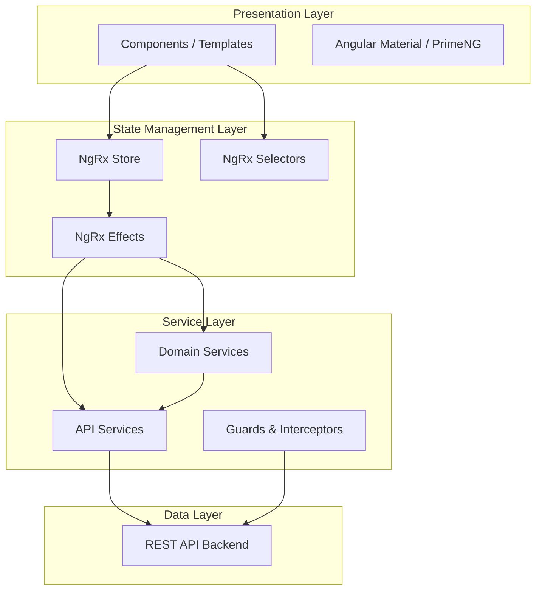
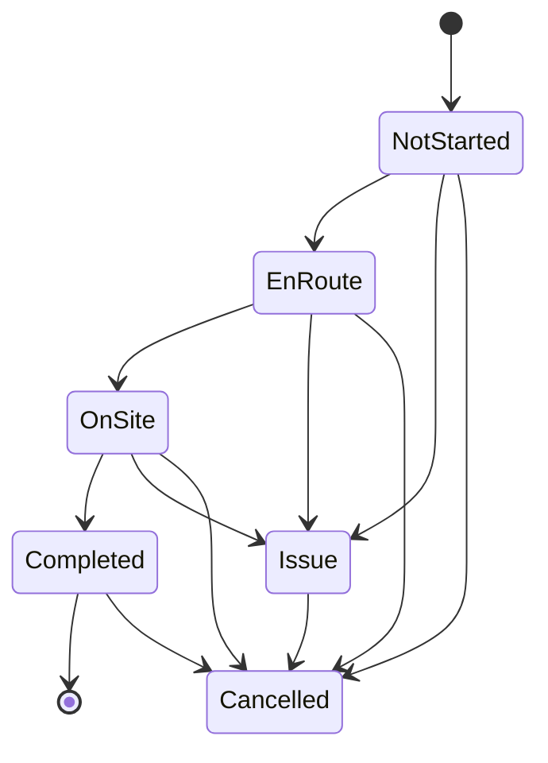

# Design Document: Field Resources UAT Readiness

## Overview

This design addresses making the Field Resource Management (FRM) module UAT-ready by ensuring end-to-end functionality across six core workflow areas: technician time tracking (clock-in/clock-out), timecard display, schedule viewing, job management (CRUD + status lifecycle), technician management, and crew management. The existing Angular application already has the foundational components, services, NgRx state slices, and routing in place. The focus of this effort is to harden these existing pieces — filling in missing validation, wiring up error/loading/empty states, ensuring NgRx state consistency after mutations, and enforcing role-based route protection — so that UAT testers can exercise all primary paths and edge cases without encountering broken flows.

The application uses Angular with NgRx for state management, Angular Material for UI components, and PrimeNG for charts. The FRM module is lazy-loaded and organized into sub-modules (jobs, technicians, crews, scheduling, mobile, reporting) each with their own components, services, and state slices.

## Architecture

The FRM module follows a layered architecture within the Angular application:



The data flow for a typical mutation (e.g., creating a job) follows the NgRx pattern:

1. Component dispatches an action (e.g., `createJob`)
2. Effect intercepts the action, calls the service
3. Service makes the HTTP request
4. On success, effect dispatches a success action (e.g., `createJobSuccess`)
5. Reducer updates the entity state
6. Selectors emit updated data to subscribed components

For UAT readiness, every step in this chain must handle loading states, error states, and empty states correctly.

### Key Architectural Decisions

- **Entity Adapter pattern**: All NgRx state slices (jobs, technicians, crews, time-entries) use `@ngrx/entity` with `EntityState` for normalized entity storage. This is already in place and will be leveraged for consistent CRUD operations.
- **Lazy-loaded sub-modules**: Each feature area (jobs, technicians, crews, mobile, scheduling) is a lazy-loaded Angular module. Route guards are applied at the lazy-load boundary.
- **Centralized error handling**: The `ErrorInterceptor` already handles HTTP errors globally with status-specific messages and snackbar notifications. UAT readiness requires ensuring all components also handle NgRx error states locally for retry UX.
- **Role-based access**: Guards (`DispatcherGuard`, `TechnicianGuard`, `AdminGuard`, `CreateJobGuard`) protect routes. The `FrmPermissionService` provides permission checks. CM users get market-scoped data via `RoleBasedDataService`.

## Components and Interfaces

### Time Tracking (Requirements 1, 2)

| Component / Service | Responsibility |
|---|---|
| `TimeTrackerComponent` (mobile) | Clock-in/clock-out UI with elapsed timer, geolocation capture, mileage entry |
| `TimeTrackingService` | HTTP calls for clock-in, clock-out, active entry retrieval; geolocation capture via browser API |
| `TimeEntryEffects` | Orchestrates clock-in/clock-out actions, dispatches success/failure |
| `TimeEntryState` | Stores entities + `activeEntry` + `loading` + `error` |

The `TimeTrackingService.clockIn()` already handles geolocation gracefully — if capture fails, it proceeds without location and logs a warning. The same pattern applies to `clockOut()`. For UAT, the component must:
- Display elapsed time while clocked in (derived from `activeEntry.clockInTime`)
- Prevent double clock-in by checking `activeEntry !== null`
- Show error messages from `TimeEntryState.error` with retry capability
- Allow optional mileage entry on clock-out

### Timecard Display (Requirement 3)

| Component / Service | Responsibility |
|---|---|
| `TimecardDashboardComponent` | Displays timecard period with daily/weekly summaries |
| `TimecardEntryComponent` | Individual time entry row display |
| `TimecardService` | Business logic for hour calculations, daily/weekly summaries, overtime |
| `TimecardEffects` / `TimeEntryEffects` | Loads time entries for the selected period |

The `TimecardService` already implements `calculateHours()`, `createDailySummaries()`, and `createWeeklySummary()` with regular/overtime hour breakdowns. For UAT:
- Loading indicator while fetching time entries
- Empty state when no entries exist for the period
- Error state with retry on load failure

### Schedule Viewing (Requirement 4)

| Component / Service | Responsibility |
|---|---|
| `CalendarViewComponent` | Calendar-based schedule display |
| `TechnicianScheduleComponent` | Per-technician timeline view |
| `SchedulingService` | Fetches assignments for date ranges |
| `AssignmentEffects` | Loads assignments, handles filters |
| `AssignmentState` | Stores assignment entities + loading/error |

### Job Management (Requirements 5, 6, 7)

| Component / Service | Responsibility |
|---|---|
| `JobSetupComponent` | Multi-step wizard for job creation (Customer Info → Pricing/Billing → SRI Internal) |
| `JobListComponent` | Paginated job list with filtering |
| `JobDetailComponent` | Full job view with notes, attachments, status history |
| `JobFormComponent` | Job edit form |
| `JobService` | CRUD operations, status updates, notes, attachments |
| `JobEffects` | Orchestrates all job actions |
| `JobState` | Entity state + selectedId + loading + error + filters |
| `CreateJobGuard` | Route guard for job creation (Dispatcher/Admin only) |

The `JobSetupComponent` is a multi-step wizard with form groups for each step. `CustomValidators.dateRange()` validates scheduledEndDate > scheduledStartDate. The `JobService.updateJobStatus()` handles status transitions server-side.

Valid status transitions (enforced client-side for UX, server-side for security):
- `NotStarted → EnRoute → OnSite → Completed`
- Any status → `Issue`
- Any status → `Cancelled`

### Technician Management (Requirements 8, 9)

| Component / Service | Responsibility |
|---|---|
| `TechnicianFormComponent` | Create/edit form with validation |
| `TechnicianListComponent` | Filterable technician list |
| `TechnicianDetailComponent` | Full technician profile view |
| `TechnicianService` | CRUD with role-based market filtering |
| `TechnicianEffects` | Orchestrates technician actions |
| `TechnicianState` | Entity state + filters + loading/error |

The `TechnicianService.createTechnician()` already validates required fields (firstName, lastName, email, region), email format, and phone format. CM users are restricted to their market via `applyRoleBasedFiltering()`.

### Crew Management (Requirements 10, 11, 12)

| Component / Service | Responsibility |
|---|---|
| `CrewFormComponent` | Create/edit form |
| `CrewListComponent` | Filterable crew list |
| `CrewDetailComponent` | Crew view with member management |
| `CrewService` | CRUD + `addCrewMember()` / `removeCrewMember()` |
| `CrewEffects` | Orchestrates crew actions including member operations |
| `CrewState` | Entity state + filters + loading/error + locationHistory |

### Cross-Cutting (Requirements 13, 14, 15)

| Component / Service | Responsibility |
|---|---|
| `ErrorInterceptor` | Global HTTP error handling with status-specific messages |
| `FrmPermissionService` | Permission checks by role |
| Route Guards | `DispatcherGuard`, `TechnicianGuard`, `AdminGuard`, `CreateJobGuard`, `EnhancedRoleGuard` |
| `LoadingSpinnerComponent` | Shared loading indicator |
| `EmptyStateComponent` | Shared empty state display |

## Data Models

The existing data models are well-defined and sufficient for UAT readiness. Key models:

### TimeEntry
```typescript
interface TimeEntry {
  id: string;
  jobId: string;
  technicianId: string;
  clockInTime: Date;
  clockOutTime?: Date;
  clockInLocation?: GeoLocation;
  clockOutLocation?: GeoLocation;
  totalHours?: number;
  regularHours?: number;
  overtimeHours?: number;
  mileage?: number;
  isManuallyAdjusted: boolean;
  isLocked: boolean;
  createdAt: Date;
  updatedAt: Date;
}
```

### Job
```typescript
interface Job {
  id: string;
  jobId: string;           // Business ID
  client: string;
  siteName: string;
  siteAddress: Address;
  jobType: JobType;        // Install | Decom | SiteSurvey | PM
  priority: Priority;      // P1 | P2 | Normal
  status: JobStatus;       // NotStarted | EnRoute | OnSite | Completed | Issue | Cancelled
  requiredSkills: Skill[];
  scheduledStartDate: Date;
  scheduledEndDate: Date;
  notes: JobNote[];
  attachments: Attachment[];
  market: string;
  company: string;
  createdAt: Date;
  updatedAt: Date;
}
```

### Technician
```typescript
interface Technician {
  id: string;
  firstName: string;
  lastName: string;
  email: string;
  phone: string;
  role: TechnicianRole;    // Installer | Lead | Level1-4
  employmentType: EmploymentType;
  homeBase: string;
  region: string;
  skills: Skill[];
  certifications: Certification[];
  isActive: boolean;
  createdAt: Date;
  updatedAt: Date;
}
```

### Crew
```typescript
interface Crew {
  id: string;
  name: string;
  leadTechnicianId: string;
  memberIds: string[];
  market: string;
  company: string;
  status: CrewStatus;      // Available | OnJob | Unavailable
  currentLocation?: GeoLocation;
  createdAt: Date;
  updatedAt: Date;
}
```

### NgRx State Slices

All state slices follow the same pattern using `@ngrx/entity`:

```typescript
interface XState extends EntityState<X> {
  selectedId: string | null;
  loading: boolean;
  error: string | null;
  filters: XFilters;
}
```

The `TimeEntryState` additionally includes `activeEntry: TimeEntry | null` for tracking the currently clocked-in entry.

### Job Status Transition Model




## Correctness Properties

*A property is a characteristic or behavior that should hold true across all valid executions of a system — essentially, a formal statement about what the system should do. Properties serve as the bridge between human-readable specifications and machine-verifiable correctness guarantees.*

### Property 1: Clock-in creates a valid TimeEntry

*For any* valid technician ID and assigned job ID, calling `clockIn` should produce a TimeEntry whose `jobId` matches the provided job ID, whose `technicianId` matches the provided technician ID, and whose `clockInTime` is within a small tolerance of the current time.

**Validates: Requirements 1.1**

### Property 2: Geolocation captured on time tracking operations when available

*For any* clock-in or clock-out operation where the browser geolocation API returns a valid position, the resulting TimeEntry should have the corresponding location field (`clockInLocation` or `clockOutLocation`) set with latitude, longitude, and accuracy values matching the geolocation response.

**Validates: Requirements 1.2, 2.2**

### Property 3: No concurrent clock-in

*For any* technician who already has an active TimeEntry (no `clockOutTime`), attempting a second clock-in should be rejected, and the existing active entry should remain unchanged.

**Validates: Requirements 1.4**

### Property 4: Clock-out sets timestamp and calculates totalHours

*For any* active TimeEntry, clocking out should set `clockOutTime` and compute `totalHours` such that `totalHours` equals the difference between `clockOutTime` and `clockInTime` in hours (minus any break time), and `totalHours >= 0`.

**Validates: Requirements 2.1**

### Property 5: Mileage stored on clock-out when provided

*For any* clock-out operation where a non-negative mileage value is provided, the resulting TimeEntry should have its `mileage` field set to that value. When no mileage is provided, the `mileage` field should remain undefined.

**Validates: Requirements 2.4**

### Property 6: Time entries grouped by date correctly

*For any* set of TimeEntries, `groupEntriesByDate` should produce groups where every entry in a group has a `clockInTime` on the same calendar date, and the union of all groups equals the original set (no entries lost or duplicated).

**Validates: Requirements 3.1**

### Property 7: Hour calculation invariants

*For any* set of TimeEntries passed to `calculateHours`, the result should satisfy: `total = regular + overtime`, `regular <= 40`, `overtime = max(0, total - 40)`, and `total >= 0`.

**Validates: Requirements 3.2**

### Property 8: Schedule filtering by date returns correct assignments

*For any* set of assignments and a selected date, filtering assignments for that date should return only assignments whose time range (startTime to endTime) overlaps with the selected date, and no assignments outside that date.

**Validates: Requirements 4.2**

### Property 9: Job wizard required field validation

*For any* job creation form state where at least one required field (client, siteName, siteAddress, jobType, priority, scheduledStartDate, scheduledEndDate) is empty or missing, the form group should be invalid and submission should be prevented.

**Validates: Requirements 5.2**

### Property 10: Date range validation rejects end before start

*For any* pair of dates where `scheduledEndDate < scheduledStartDate`, the `CustomValidators.dateRange` validator should return a validation error. For any pair where `scheduledEndDate >= scheduledStartDate`, it should return null.

**Validates: Requirements 5.5**

### Property 11: CreateJobGuard role enforcement

*For any* user role, the `CreateJobGuard` should return `true` only when the user has the `canCreateJob` permission (Dispatcher or Admin roles), and `false` for all other roles, redirecting to the dashboard.

**Validates: Requirements 5.6, 14.4**

### Property 12: Job list filtering

*For any* set of jobs and any combination of filters (status, priority, jobType, client, market, search term), the filtered result should contain only jobs that match all applied filter criteria, and should contain every job that matches all criteria.

**Validates: Requirements 6.2**

### Property 13: Job status transition validity

*For any* current `JobStatus` and target `JobStatus`, the transition should be allowed if and only if it follows the valid transition rules: `NotStarted → EnRoute → OnSite → Completed` (sequential), or any status → `Issue`, or any status → `Cancelled`. All other transitions should be rejected.

**Validates: Requirements 7.3, 7.4**

### Property 14: Job note includes author and timestamp

*For any* job and any note text, after successfully adding a note via `addJobNote`, the resulting `JobNote` should have a non-empty `author`, a `createdAt` timestamp, and `text` matching the provided note text.

**Validates: Requirements 7.5**

### Property 15: Technician form required field and email validation

*For any* technician form state where at least one required field (firstName, lastName, email, region) is empty, the form should be invalid. Additionally, *for any* email string that does not match the pattern `[^\s@]+@[^\s@]+\.[^\s@]+`, the email field should have a validation error.

**Validates: Requirements 8.2**

### Property 16: Phone number format validation

*For any* string, the `CustomValidators.phoneNumber` validator should return null (valid) if and only if the string, after removing non-digit characters, is a 10 or 11 digit US phone number. For all other strings, it should return a validation error.

**Validates: Requirements 8.6**

### Property 17: Entity edit form pre-population

*For any* existing entity (Technician or Crew) loaded into its edit form, every form field should be populated with the corresponding value from the entity. The form values should match the entity's current data.

**Validates: Requirements 8.5, 10.5**

### Property 18: Technician list filtering

*For any* set of technicians and any combination of filters (role, skills, region, availability, active status, search term), the filtered result should contain only technicians matching all applied filter criteria.

**Validates: Requirements 9.2**

### Property 19: CM market-based technician filtering

*For any* CM user with a specific market and any set of technicians, the `applyRoleBasedFiltering` function should return only technicians whose `region` matches the CM user's market.

**Validates: Requirements 9.6**

### Property 20: Crew form required field validation

*For any* crew creation form state where at least one required field (name, leadTechnicianId, market) is empty, the form should be invalid and submission should be prevented.

**Validates: Requirements 10.2**

### Property 21: Crew list filtering

*For any* set of crews and any combination of filters (status, market, company, search term), the filtered result should contain only crews matching all applied filter criteria.

**Validates: Requirements 11.2**

### Property 22: Add crew member updates memberIds

*For any* crew and any technician ID not already in the crew's `memberIds`, after successfully calling `addCrewMember`, the crew's `memberIds` in the NgRx store should contain the new technician ID, and the length should have increased by one.

**Validates: Requirements 12.1**

### Property 23: Remove crew member updates memberIds

*For any* crew with at least one member and any technician ID currently in the crew's `memberIds`, after successfully calling `removeCrewMember`, the crew's `memberIds` in the NgRx store should no longer contain that technician ID, and the length should have decreased by one.

**Validates: Requirements 12.2**

### Property 24: Entity creation reflected in NgRx store

*For any* entity type (Job, Technician, Crew, TimeEntry), after dispatching a create action and receiving a success action with the created entity, the entity should be present in the corresponding NgRx entity state slice, retrievable by its ID, and the `loading` flag should be `false`.

**Validates: Requirements 5.3, 8.3, 10.3, 13.1, 13.2, 13.3, 13.4**

### Property 25: Job status update reflected in NgRx store

*For any* job in the store and any valid status transition, after dispatching `updateJobStatusSuccess` with the updated job, the job's status in the store should match the new status.

**Validates: Requirements 7.2, 13.5**

### Property 26: Role-based route access matrix

*For any* user role and any FRM route, the route guards should allow access if and only if the role-route combination is in the permitted set: Technician → mobile + timecard; Dispatcher → technicians + jobs + crews + scheduling; Admin → all routes. Unauthenticated users should be redirected to login for all routes.

**Validates: Requirements 14.1, 14.2, 14.3, 14.5**

### Property 27: HTTP error status code handling

*For any* HTTP error response with a status code in {400, 401, 403, 404, 409, 500}, the `ErrorInterceptor` should produce the correct user-facing action: 400 → invalid input message, 401 → redirect to login, 403 → access-denied message, 404 → not-found message, 409 → conflict message, 500 → server error with retry suggestion.

**Validates: Requirements 15.1, 15.2, 15.3, 15.4, 15.5, 15.6**

## Error Handling

### HTTP Error Handling Strategy

The existing `ErrorInterceptor` provides centralized HTTP error handling. For UAT readiness, the following must be ensured:

| HTTP Status | User-Facing Action | Implementation |
|---|---|---|
| 400 | Snackbar: "Invalid request. Please check your input." | `ErrorInterceptor.handleGenericError()` |
| 401 | Clear auth tokens, redirect to `/login` with returnUrl | `ErrorInterceptor.handleUnauthorized()` |
| 403 | Snackbar: "Access denied. You do not have permission." | `ErrorInterceptor.handleForbidden()` |
| 404 | Snackbar: "Resource not found." | `ErrorInterceptor.handleNotFound()` |
| 409 | Snackbar with conflict details and resolution guidance | `ErrorInterceptor.handleConflict()` |
| 500+ | Snackbar: "Server error. Please try again later." | `ErrorInterceptor.handleServerError()` |
| 0 (network) | Snackbar: "Unable to connect. Check your internet." | `ErrorInterceptor.handleNetworkError()` |

### NgRx Error State Handling

Each state slice has an `error: string | null` field. Components must:

1. Subscribe to the error selector for their state slice
2. Display the error message in the UI when non-null
3. Provide a retry action (re-dispatch the original load/create/update action)
4. Clear the error state when the user navigates away or retries

### Form Validation Error Handling

- Required field errors: Display inline "This field is required" messages
- Email format errors: Display "Please enter a valid email address"
- Phone format errors: Display "Please enter a valid US phone number"
- Date range errors: Display "End date must be after start date"
- The `ValidationMessageService` provides consistent error message formatting

### Geolocation Error Handling

The `TimeTrackingService` already handles geolocation failures gracefully:
- If `navigator.geolocation` is not supported: proceed without location
- If permission denied / position unavailable / timeout: log warning, proceed without location
- The TimeEntry is created regardless; location fields are simply omitted

### Optimistic Update Rollback

For crew member add/remove operations (Requirement 12.3), if the server call fails:
1. The effect dispatches a failure action
2. The reducer reverts the `memberIds` to the previous state
3. The component displays an error snackbar

## Testing Strategy

### Dual Testing Approach

Testing for UAT readiness uses both unit tests and property-based tests:

- **Unit tests** (Jasmine + Karma): Verify specific examples, edge cases, integration points, and UI behavior (loading/empty/error states). These cover the "example" and "edge-case" criteria from the prework analysis.
- **Property-based tests** (fast-check): Verify universal properties across randomly generated inputs. Each property from the Correctness Properties section maps to exactly one property-based test.

### Property-Based Testing Configuration

- **Library**: `fast-check` (TypeScript-native PBT library, integrates with Jasmine)
- **Minimum iterations**: 100 per property test
- **Tag format**: Each test must include a comment: `// Feature: field-resources-uat-readiness, Property {N}: {title}`

### Test Organization

Property-based tests are organized by domain area:

| Test File | Properties Covered |
|---|---|
| `time-tracking.service.pbt.spec.ts` | P1, P2, P3, P4, P5 |
| `timecard.service.pbt.spec.ts` | P6, P7 |
| `scheduling.service.pbt.spec.ts` | P8 |
| `job-form.pbt.spec.ts` | P9, P10 |
| `create-job.guard.pbt.spec.ts` | P11 |
| `job-list.filter.pbt.spec.ts` | P12 |
| `job-status.pbt.spec.ts` | P13 |
| `job-notes.pbt.spec.ts` | P14 |
| `technician-form.pbt.spec.ts` | P15, P16 |
| `entity-form-prepopulation.pbt.spec.ts` | P17 |
| `technician-list.filter.pbt.spec.ts` | P18, P19 |
| `crew-form.pbt.spec.ts` | P20 |
| `crew-list.filter.pbt.spec.ts` | P21 |
| `crew-members.pbt.spec.ts` | P22, P23 |
| `ngrx-entity-creation.pbt.spec.ts` | P24 |
| `ngrx-job-status.pbt.spec.ts` | P25 |
| `route-guards.pbt.spec.ts` | P26 |
| `error-interceptor.pbt.spec.ts` | P27 |

### Unit Test Coverage

Unit tests focus on:

- **UI state examples**: Loading indicator shown when `loading === true`, empty state shown when entity list is empty, error message shown when `error !== null`
- **Edge cases**: Geolocation failure during clock-in/clock-out (1.3, 2.3), server error on form submission (1.5, 2.5, 5.4, 8.4, 10.4), crew member operation failure with rollback (12.3)
- **Integration points**: Component dispatches correct NgRx actions, effects call correct service methods, reducers update state correctly on success/failure actions
- **Specific examples**: Wizard starts at step 1 (5.1), job detail shows all fields (7.1), technician form has all expected fields (8.1), crew form has all expected fields (10.1)

### Test Execution

- Property-based tests: `ng test --include='**/*.pbt.spec.ts'`
- Unit tests: `ng test --include='**/*.spec.ts' --exclude='**/*.pbt.spec.ts'`
- All tests: `ng test`
