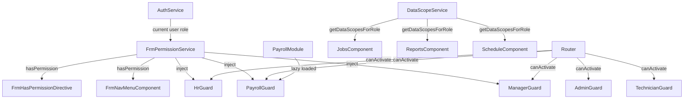

# Design Document: FRM Role-Based Views

## Overview

This design extends the existing `field-resource-management` (FRM) Angular feature with a comprehensive role-based access control (RBAC) system. The implementation introduces a centralized `FrmPermissionService`, a structural directive for template-level gating, two new route guards (`HrGuard`, `PayrollGuard`), extensions to `DataScopeService`, a new payroll feature module, and updates to the navigation menu component.

The design builds on existing infrastructure:
- `UserRole` enum at `src/app/models/role.enum.ts`
- Existing guards: `AdminGuard`, `TechnicianGuard`, `ManagerGuard`, `DispatcherGuard`, `PMGuard`, `CMGuard`
- `BudgetPermissionService` and `DataScopeService`
- Lazy-loaded routing in `FieldResourceManagementRoutingModule`

### Role Groups

| Group | Roles |
|---|---|
| Field_Group | Technician, DeploymentEngineer, CM, SRITech |
| Manager_Group | PM, Admin, DCOps, OSPCoordinator, EngineeringFieldSupport, MaterialsManager |
| HR_Group | HR |
| Payroll_Group | Payroll |
| ReadOnly_Group | VendorRep, Client, Controller |

---

## Architecture



The central design decision is to keep all permission logic in `FrmPermissionService` rather than scattering role checks across components and guards. Guards delegate their role-membership checks to `FrmPermissionService.hasPermission()` or `getPermissionsForRole()`, ensuring a single source of truth. The structural directive consumes the same service, so template-level and route-level enforcement are always consistent.

---

## Components and Interfaces

### 1. FrmPermissionService

**Location:** `src/app/features/field-resource-management/services/frm-permission.service.ts`

```typescript
export type FrmPermissionKey =
  | 'canStartJob' | 'canEditJob'
  | 'canViewOwnSchedule' | 'canViewAllSchedules' | 'canEditSchedule' | 'canAssignCrew'
  | 'canTrackTime' | 'canSubmitTimecard' | 'canApproveTimecard'
  | 'canApproveExpense' | 'canApproveTravelRequest' | 'canApproveBreakRequest'
  | 'canViewBudget' | 'canManageBudget'
  | 'canViewReports' | 'canViewManagementReports'
  | 'canManageIncidentReports' | 'canManageDirectDeposit' | 'canManageW4'
  | 'canManageContactInfo' | 'canSignPRC' | 'canViewPayStubs' | 'canViewW2'
  | 'canAccessAdminPanel' | 'canViewReadOnly';

export type FrmPermissionSet = Record<FrmPermissionKey, boolean>;

@Injectable({ providedIn: 'root' })
export class FrmPermissionService {
  // Static permission map keyed by UserRole string value
  private readonly permissionMap: Record<string, FrmPermissionSet>;

  hasPermission(role: string | null | undefined, permission: FrmPermissionKey): boolean;
  getPermissionsForRole(role: string | null | undefined): FrmPermissionSet;
}
```

The permission map is a plain object literal defined at construction time — no async loading, no HTTP calls. Each role entry is a full `FrmPermissionSet` with every flag explicitly set to `true` or `false`. This makes the map easy to audit and test.

**Permission Map Summary:**

| Permission | Field | Manager | HR | Payroll | ReadOnly | Admin |
|---|---|---|---|---|---|---|
| canStartJob | ✓ | ✓ | | | | ✓ |
| canEditJob | ✓ | ✓ | | | | ✓ |
| canViewOwnSchedule | ✓ | ✓ | | | | ✓ |
| canViewAllSchedules | | ✓ | | | | ✓ |
| canEditSchedule | | ✓ | | | | ✓ |
| canAssignCrew | | ✓ | | | | ✓ |
| canTrackTime | ✓ | ✓ | | | | ✓ |
| canSubmitTimecard | ✓ | ✓ | | | | ✓ |
| canApproveTimecard | | ✓ | ✓ | ✓ | | ✓ |
| canApproveExpense | | ✓ | ✓ | ✓ | | ✓ |
| canApproveTravelRequest | | ✓ | ✓ | ✓ | | ✓ |
| canApproveBreakRequest | | | ✓ | ✓ | | ✓ |
| canViewBudget | | ✓ | | | | ✓ |
| canManageBudget | | | | | | ✓ |
| canViewReports | | ✓ | | | | ✓ |
| canViewManagementReports | | ✓ | | | | ✓ |
| canManageIncidentReports | | | | ✓ | | ✓ |
| canManageDirectDeposit | | | | ✓ | | ✓ |
| canManageW4 | | | | ✓ | | ✓ |
| canManageContactInfo | | | | ✓ | | ✓ |
| canSignPRC | | | | ✓ | | ✓ |
| canViewPayStubs | | | | ✓ | | ✓ |
| canViewW2 | | | | ✓ | | ✓ |
| canAccessAdminPanel | | | | | | ✓ |
| canViewReadOnly | | | | | ✓ | ✓ |

### 2. FrmHasPermission Structural Directive

**Location:** `src/app/features/field-resource-management/directives/frm-has-permission.directive.ts`

```typescript
@Directive({ selector: '[frmHasPermission]' })
export class FrmHasPermissionDirective implements OnInit, OnDestroy {
  @Input('frmHasPermission') permission!: FrmPermissionKey;

  constructor(
    private templateRef: TemplateRef<unknown>,
    private viewContainer: ViewContainerRef,
    private permissionService: FrmPermissionService,
    private authService: AuthService
  ) {}
}
```

The directive subscribes to `AuthService`'s current user observable. On each emission it calls `FrmPermissionService.hasPermission(role, permission)` and either creates or clears the embedded view. This is a structural directive (uses `TemplateRef` + `ViewContainerRef`) so the host element is fully removed from the DOM when permission is denied — not just hidden.

### 3. HrGuard

**Location:** `src/app/features/field-resource-management/guards/hr.guard.ts`

Allows: `HR`, `Payroll`, `Admin`

```typescript
@Injectable({ providedIn: 'root' })
export class HrGuard implements CanActivate {
  private readonly allowedRoles = [UserRole.HR, UserRole.Admin];
  // Also allows Payroll once that enum value is added
}
```

### 4. PayrollGuard

**Location:** `src/app/features/field-resource-management/guards/payroll.guard.ts`

Allows: `Payroll`, `Admin` only.

### 5. Updated ManagerGuard

The existing `ManagerGuard` will be updated to use `FrmPermissionService` for its allowed-roles list, covering all `Manager_Group` roles: `PM`, `Admin`, `DCOps`, `OSPCoordinator`, `EngineeringFieldSupport`, `MaterialsManager`, `Manager`.

### 6. Payroll Feature Module

**Location:** `src/app/features/field-resource-management/components/payroll/`

Lazy-loaded module with child routes:

| Route | Component | Description |
|---|---|---|
| `payroll/incident-reports` | `IncidentReportsComponent` | Auto accident, work injury, other incidents |
| `payroll/direct-deposit` | `DirectDepositComponent` | Direct deposit change form |
| `payroll/w4` | `W4Component` | W-4 withholding change form |
| `payroll/contact-info` | `ContactInfoComponent` | Address, phone, email updates |
| `payroll/prc` | `PrcComponent` | Personnel Record Change signing |
| `payroll/pay-stubs` | `PayStubsComponent` | Pay stub viewer by employee |
| `payroll/w2` | `W2Component` | W-2 document viewer by employee |

All payroll routes are protected by `PayrollGuard`.

### 7. Updated FrmNavMenuComponent

The nav menu will be refactored to inject `FrmPermissionService` instead of checking raw role arrays. Each `FrmNavItem` will carry a `permission: FrmPermissionKey` field (or a `roles` allowlist for backward compatibility). The `filterMenuByRole` method will call `hasPermission(currentRole, item.permission)`.

Navigation items by role group:

| Nav Item | Field | Manager | HR | Payroll | ReadOnly | Admin |
|---|---|---|---|---|---|---|
| Dashboard | ✓ | ✓ | ✓ | ✓ | ✓ | ✓ |
| My Schedule | ✓ | ✓ | | | | ✓ |
| Jobs | ✓ | ✓ | | | | ✓ |
| Mobile | ✓ | ✓ | | | | ✓ |
| Timecards | ✓ | ✓ | ✓ | ✓ | | ✓ |
| Technicians | | ✓ | | | | ✓ |
| Crews | | ✓ | | | | ✓ |
| Schedule (mgmt) | | ✓ | | | | ✓ |
| Approvals | | ✓ | ✓ | ✓ | | ✓ |
| Reports | | ✓ | | | ✓ | ✓ |
| Map | | ✓ | | | | ✓ |
| Inventory | | ✓ | | | | ✓ |
| Travel | | ✓ | | | | ✓ |
| Materials | | ✓ | | | | ✓ |
| Incident Reports | | | | ✓ | | ✓ |
| Direct Deposit | | | | ✓ | | ✓ |
| W-4 | | | | ✓ | | ✓ |
| Contact Info | | | | ✓ | | ✓ |
| PRC | | | | ✓ | | ✓ |
| Pay Stubs | | | | ✓ | | ✓ |
| W-2 | | | | ✓ | | ✓ |
| Admin | | | | | | ✓ |

---

## Data Models

### UserRole Enum Extension

Add `Payroll = 'Payroll'` to the existing enum. All existing values are preserved unchanged.

```typescript
export enum UserRole {
  // ... existing values unchanged ...
  Payroll = 'Payroll'  // new
}
```

### FrmPermissionSet

```typescript
export type FrmPermissionKey =
  | 'canStartJob' | 'canEditJob'
  | 'canViewOwnSchedule' | 'canViewAllSchedules' | 'canEditSchedule' | 'canAssignCrew'
  | 'canTrackTime' | 'canSubmitTimecard' | 'canApproveTimecard'
  | 'canApproveExpense' | 'canApproveTravelRequest' | 'canApproveBreakRequest'
  | 'canViewBudget' | 'canManageBudget'
  | 'canViewReports' | 'canViewManagementReports'
  | 'canManageIncidentReports' | 'canManageDirectDeposit' | 'canManageW4'
  | 'canManageContactInfo' | 'canSignPRC' | 'canViewPayStubs' | 'canViewW2'
  | 'canAccessAdminPanel' | 'canViewReadOnly';

export type FrmPermissionSet = Record<FrmPermissionKey, boolean>;
```

### Payroll Document Models

```typescript
export interface IncidentReport {
  id: string;
  type: 'auto_accident' | 'work_injury' | 'other';
  employeeId: string;
  reportedBy: string;
  reportedAt: Date;
  description: string;
}

export interface DirectDepositChange {
  id: string;
  employeeId: string;
  submittedBy: string;
  submittedAt: Date;
  bankAccountLast4: string;
  routingNumberLast4: string;
}

export interface W4Change {
  id: string;
  employeeId: string;
  submittedBy: string;
  submittedAt: Date;
  filingStatus: string;
  allowances: number;
}

export interface ContactInfoChange {
  id: string;
  employeeId: string;
  updatedBy: string;
  updatedAt: Date;
  address?: string;
  phone?: string;
  email?: string;
}

export interface PrcSignature {
  id: string;
  employeeId: string;
  signedBy: string;
  signedAt: Date;
  documentRef: string;
}
```

### DataScope Extension

`DataScopeService.getDataScopesForRole` will be extended with a complete switch covering all `UserRole` values:

| Role(s) | Scope |
|---|---|
| Admin, DCOps, Controller, HR, Payroll | `all` |
| CM, OSPCoordinator, EngineeringFieldSupport, MaterialsManager | `market` |
| PM, VendorRep, Client | `company` |
| Technician, DeploymentEngineer, SRITech | `self` |

---


## Correctness Properties

*A property is a characteristic or behavior that should hold true across all valid executions of a system — essentially, a formal statement about what the system should do. Properties serve as the bridge between human-readable specifications and machine-verifiable correctness guarantees.*

### Property 1: Existing enum values are preserved

*For any* member of the `UserRole` enum that existed before this change, its string value must remain identical after the `Payroll` member is added.

**Validates: Requirements 1.2**

---

### Property 2: hasPermission and getPermissionsForRole are consistent

*For any* valid `UserRole` value `r` and any `FrmPermissionKey` `p`, `hasPermission(r, p)` must equal `getPermissionsForRole(r)[p]`. Additionally, `getPermissionsForRole(r)` must contain all 25 defined permission keys (none missing, none extra).

**Validates: Requirements 2.2, 2.4**

---

### Property 3: Role group permissions are correctly assigned

*For any* role in `Field_Group`, `Manager_Group`, `HR_Group`, `Payroll_Group`, and `ReadOnly_Group`, the permissions returned by `getPermissionsForRole` must exactly match the group's defined permission set — no required permission is missing and no forbidden permission is granted.

Specifically:
- Field_Group roles: `canStartJob`, `canEditJob`, `canViewOwnSchedule`, `canTrackTime`, `canSubmitTimecard` are `true`; payroll/HR/admin permissions are `false`.
- Manager_Group roles: all Field_Group permissions plus `canViewAllSchedules`, `canEditSchedule`, `canAssignCrew`, `canApproveTimecard`, `canApproveExpense`, `canApproveTravelRequest`, `canViewBudget`, `canViewReports`, `canViewManagementReports` are `true`; payroll/admin permissions are `false`.
- HR_Group roles: `canApproveExpense`, `canApproveTravelRequest`, `canApproveTimecard`, `canApproveBreakRequest` are `true`; payroll-specific and admin permissions are `false`.
- Payroll_Group roles: all HR_Group permissions plus `canManageIncidentReports`, `canManageDirectDeposit`, `canManageW4`, `canManageContactInfo`, `canSignPRC`, `canViewPayStubs`, `canViewW2` are `true`; admin permissions are `false`.
- ReadOnly_Group roles: only `canViewReadOnly` is `true`; all other permissions are `false`.

**Validates: Requirements 2.7, 2.8, 2.9, 2.10, 2.11**

---

### Property 4: Guards allow exactly their intended role sets

*For any* route guard (`HrGuard`, `PayrollGuard`, `AdminGuard`, `TechnicianGuard`, `ManagerGuard`) and *for any* `UserRole` value, the guard's `canActivate` result must be `true` if and only if the role is in the guard's allowed set:

- `AdminGuard`: allows only `Admin`
- `TechnicianGuard`: allows `Field_Group` ∪ `Manager_Group`
- `ManagerGuard`: allows `Manager_Group`
- `HrGuard`: allows `HR_Group` ∪ `Payroll_Group` ∪ `{Admin}`
- `PayrollGuard`: allows `Payroll_Group` ∪ `{Admin}`

*For any* role not in the allowed set, the guard must redirect to `/field-resource-management/dashboard` with `error=insufficient_permissions`.

**Validates: Requirements 4.1, 4.2, 4.3, 4.4, 4.5, 4.6, 4.7**

---

### Property 5: Directive renders iff user holds permission

*For any* `FrmPermissionKey` `p` and *for any* `UserRole` `r`, when the directive is applied with permission `p` and the current user has role `r`:
- If `hasPermission(r, p)` is `true`, the host element must be present in the DOM.
- If `hasPermission(r, p)` is `false`, the host element must be absent from the DOM.

**Validates: Requirements 3.2, 3.3**

---

### Property 6: Directive re-evaluates on user role change

*For any* sequence of user role changes, after each change the directive's DOM state must equal the result of evaluating `hasPermission(newRole, permission)` — the directive must never show stale state from a previous role.

**Validates: Requirements 3.4**

---

### Property 7: DataScopeService maps every role to the correct scope

*For any* `UserRole` value `r`, `getDataScopesForRole(r)` must return the scope type defined by the role's group:
- `Admin`, `DCOps`, `Controller`, `HR`, `Payroll` → `all`
- `CM`, `OSPCoordinator`, `EngineeringFieldSupport`, `MaterialsManager` → `market`
- `PM`, `VendorRep`, `Client` → `company`
- `Technician`, `DeploymentEngineer`, `SRITech` → `self`

**Validates: Requirements 11.1, 11.2, 11.3, 11.4, 11.5, 11.6**

---

### Property 8: Payroll actions produce complete audit records

*For any* payroll action (direct deposit change, W-4 change, PRC signing) submitted by *any* user with `Payroll_Group` role, the resulting persisted record must contain a non-null `submittedBy` (or `signedBy`) field equal to the submitting user's identity, and a non-null `submittedAt` (or `signedAt`) timestamp.

**Validates: Requirements 8.3, 8.4, 8.6**

---

### Property 9: Contact info update requires at least one changed field

*For any* contact info update request where all of `address`, `phone`, and `email` are either absent or identical to the current values, the system must reject the update and return a validation error. *For any* update where at least one field differs from the current value, the system must accept it.

**Validates: Requirements 8.5**

---

### Property 10: Navigation menu items match role permissions

*For any* `UserRole` `r`, the set of navigation items rendered by `FrmNavMenuComponent` must be exactly the set of items whose required permission is granted by `getPermissionsForRole(r)` — no item is shown for a permission the role lacks, and no item is hidden for a permission the role holds.

**Validates: Requirements 10.1, 10.4**

---

### Property 11: HR approval records approver identity and timestamp

*For any* approval action (timecard, expense) performed by *any* user with `HR_Group` or `Payroll_Group` role, the resulting record must contain a non-null approver identity field and a non-null timestamp field.

**Validates: Requirements 7.3, 7.4**

---

## Error Handling

### Guard Redirects

All guards follow a consistent error redirect pattern:
```
this.router.navigate(['/field-resource-management/dashboard'], {
  queryParams: { error: 'insufficient_permissions', message: '<role> access required' }
});
```
No guard throws an exception — they always return `false` after redirecting.

### FrmPermissionService

- `hasPermission(null, ...)` and `hasPermission(undefined, ...)` return `false` without throwing.
- `getPermissionsForRole(unknownRole)` returns an all-`false` `FrmPermissionSet` rather than throwing.
- The permission map is built at construction time; if a role is missing from the map, the service logs a warning and returns the all-false set.

### FrmHasPermissionDirective

- An unrecognized permission key is treated as denied: the view is cleared and a `console.warn` is emitted.
- If `AuthService` emits `null` (unauthenticated), the directive clears the view.

### Payroll Form Validation

- Direct deposit, W-4, and contact info forms validate client-side before submission.
- Contact info update returns a `400 Bad Request`-equivalent error if no fields are changed.
- PRC signing requires a non-empty signature value; empty submissions are rejected with a validation message.

### DataScopeService

- Unknown roles default to `self` scope (most restrictive) and emit a `console.warn`.
- Null/undefined inputs to `filterDataByScope` return an empty array.

---

## Testing Strategy

### Dual Testing Approach

Both unit tests and property-based tests are required. They are complementary:
- Unit tests cover specific examples, integration points, and edge cases.
- Property-based tests verify universal correctness across all valid inputs.

### Property-Based Testing Library

Use **fast-check** (`npm install --save-dev fast-check`) for TypeScript/Angular property-based testing. Each property test runs a minimum of **100 iterations**.

Each property test must be tagged with a comment in this format:
```
// Feature: frm-role-based-views, Property N: <property_text>
```

### Property Test Specifications

**Property 1 — Enum preservation**
```
// Feature: frm-role-based-views, Property 1: existing enum values are preserved
// Generator: fc.constantFrom(...existingRoleValues)
// Check: UserRole[role] === originalValue
```

**Property 2 — hasPermission/getPermissionsForRole consistency**
```
// Feature: frm-role-based-views, Property 2: hasPermission and getPermissionsForRole are consistent
// Generator: fc.tuple(fc.constantFrom(...allRoles), fc.constantFrom(...allPermissionKeys))
// Check: service.hasPermission(r, p) === service.getPermissionsForRole(r)[p]
//        AND Object.keys(service.getPermissionsForRole(r)).length === 25
```

**Property 3 — Role group permissions**
```
// Feature: frm-role-based-views, Property 3: role group permissions are correctly assigned
// Generator: fc.constantFrom(...allRoles)
// Check: for each role, verify required permissions are true and forbidden ones are false
```

**Property 4 — Guard access control**
```
// Feature: frm-role-based-views, Property 4: guards allow exactly their intended role sets
// Generator: fc.constantFrom(...allRoles) for each guard
// Check: guard.canActivate() result matches expected allow/deny for each role
```

**Property 5 — Directive renders iff user holds permission**
```
// Feature: frm-role-based-views, Property 5: directive renders iff user holds permission
// Generator: fc.tuple(fc.constantFrom(...allRoles), fc.constantFrom(...allPermissionKeys))
// Check: viewContainer.length > 0 === service.hasPermission(role, permission)
```

**Property 6 — Directive re-evaluates on user change**
```
// Feature: frm-role-based-views, Property 6: directive re-evaluates on user role change
// Generator: fc.array(fc.constantFrom(...allRoles), { minLength: 2, maxLength: 5 })
// Check: after each role change, DOM state matches hasPermission(newRole, permission)
```

**Property 7 — DataScopeService role-to-scope mapping**
```
// Feature: frm-role-based-views, Property 7: DataScopeService maps every role to correct scope
// Generator: fc.constantFrom(...allRoles)
// Check: service.getDataScopesForRole(role)[0].scopeType === expectedScope[role]
```

**Property 8 — Payroll action audit trail**
```
// Feature: frm-role-based-views, Property 8: payroll actions produce complete audit records
// Generator: fc.record({ employeeId: fc.string(), submittedBy: fc.string() })
// Check: record.submittedBy !== null && record.submittedAt instanceof Date
```

**Property 9 — Contact info validation**
```
// Feature: frm-role-based-views, Property 9: contact info update requires at least one changed field
// Generator: fc.record({ address: fc.option(fc.string()), phone: fc.option(fc.string()), email: fc.option(fc.emailAddress()) })
// Check: if all fields are null/unchanged → validation rejects; if any field differs → validation accepts
```

**Property 10 — Nav menu matches permissions**
```
// Feature: frm-role-based-views, Property 10: navigation menu items match role permissions
// Generator: fc.constantFrom(...allRoles)
// Check: rendered menu items === items whose permission is true in getPermissionsForRole(role)
```

**Property 11 — HR approval audit trail**
```
// Feature: frm-role-based-views, Property 11: HR approval records approver identity and timestamp
// Generator: fc.record({ approverId: fc.string(), timecardId: fc.string() })
// Check: record.approvedBy !== null && record.approvedAt instanceof Date
```

### Unit Test Focus Areas

- `FrmPermissionService`: specific examples for Admin (all true), ReadOnly (only canViewReadOnly), null role (all false), unknown role (all false).
- Guards: specific redirect URL and query params when access is denied.
- `FrmHasPermissionDirective`: unrecognized permission key removes element; null user removes element.
- Payroll forms: empty PRC signature rejected; contact info with no changes rejected.
- `DataScopeService`: null input returns empty array; unknown role defaults to `self`.

### Test File Locations

```
src/app/features/field-resource-management/services/frm-permission.service.spec.ts
src/app/features/field-resource-management/guards/hr.guard.spec.ts
src/app/features/field-resource-management/guards/payroll.guard.spec.ts
src/app/features/field-resource-management/directives/frm-has-permission.directive.spec.ts
src/app/features/field-resource-management/services/data-scope.service.spec.ts
src/app/features/field-resource-management/components/payroll/*.spec.ts
```
