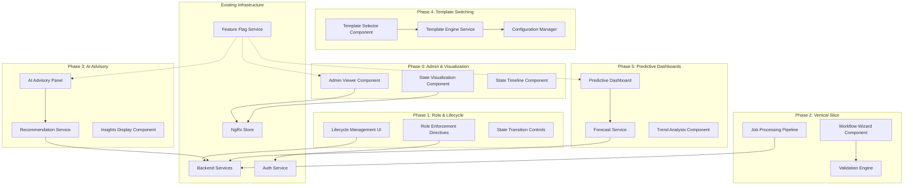
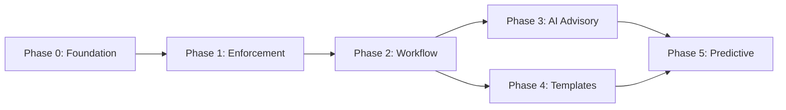
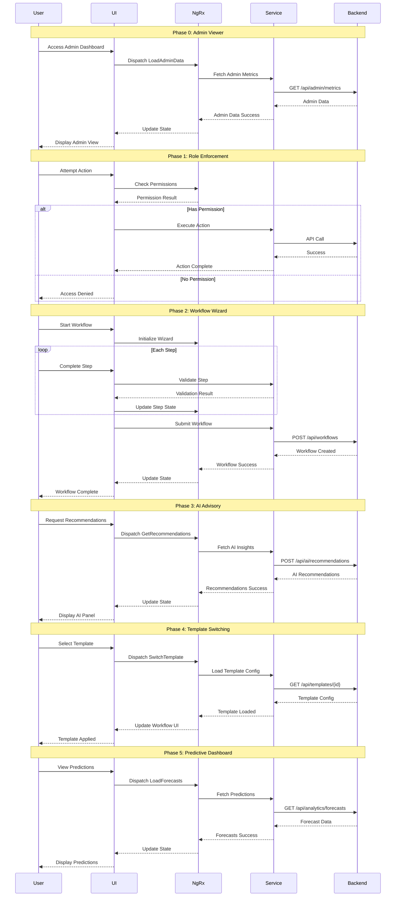

# Design Document: Frontend Phase Enhancements

## Overview

This design document specifies the technical architecture for implementing a comprehensive 6-phase frontend enhancement strategy for the SRI Frontend Angular application. The enhancements progressively build upon the existing backend service integration to deliver advanced workflow management, AI-powered advisory capabilities, predictive analytics, and dynamic workflow template switching. Each phase introduces new UI components, state management patterns, and integration points while maintaining backward compatibility with existing features.

The phased approach enables incremental delivery of value, allowing stakeholders to validate functionality at each milestone before proceeding to more advanced capabilities. The design leverages the existing NgRx state management infrastructure, Angular component architecture, and backend API integrations established in the backend-service-integration specification.

### Design Goals

1. **Progressive Enhancement**: Build capabilities incrementally across 6 distinct phases
2. **State Visualization**: Provide real-time visibility into workflow states and transitions
3. **Role-Based Access**: Enforce granular permissions across all phases
4. **AI Integration**: Incorporate advisory panels for intelligent decision support
5. **Template Flexibility**: Enable dynamic workflow template switching
6. **Predictive Analytics**: Deliver forward-looking dashboards with trend analysis
7. **Maintainability**: Ensure clean separation of concerns and testable components
8. **Performance**: Optimize rendering and data fetching for large datasets
9. **Accessibility**: Maintain WCAG 2.1 AA compliance across all new components
10. **Responsive Design**: Support desktop, tablet, and mobile viewports

### Scope

This design covers:
- Phase 0: Admin viewers and state visualization components
- Phase 1: Role enforcement UI and lifecycle management interfaces
- Phase 2: Full vertical slice workflow UI with end-to-end job processing
- Phase 3: AI advisory panels with recommendation engines
- Phase 4: Workflow template switching with dynamic configuration
- Phase 5: Predictive dashboards with forecasting and trend analysis
- NgRx state extensions for new domain entities
- Angular services for AI and analytics integrations
- Reusable UI components and directives
- Routing and navigation enhancements
- Testing strategies for each phase

### Out of Scope

- Backend API implementation (assumes APIs exist or will be created)
- Machine learning model training and deployment
- Data warehouse and ETL pipeline design
- Mobile native applications (focus on responsive web)
- Third-party integrations beyond existing Azure and SignalR connections


## Architecture

### High-Level Architecture



### Phase Dependency Flow




### Component Architecture

The frontend enhancements follow Angular's component-based architecture with clear separation of concerns:

1. **Smart Components**: Container components that connect to NgRx store and services
2. **Presentational Components**: Pure components that receive data via @Input and emit events via @Output
3. **Directives**: Reusable behavior modifiers (role enforcement, state visualization)
4. **Services**: Business logic and API integration layer
5. **State Management**: NgRx actions, reducers, effects, and selectors
6. **Guards**: Route protection and navigation control
7. **Pipes**: Data transformation for display

### State Management Extensions

Each phase introduces new state slices:

```typescript
interface AppState {
  // Existing state
  jobs: JobState;
  technicians: TechnicianState;
  scheduling: SchedulingState;
  
  // Phase 0: Admin & Visualization
  adminViewer: AdminViewerState;
  stateHistory: StateHistoryState;
  
  // Phase 1: Role & Lifecycle
  rolePermissions: RolePermissionsState;
  lifecycleTransitions: LifecycleTransitionsState;
  
  // Phase 2: Vertical Slice
  workflowWizard: WorkflowWizardState;
  validationResults: ValidationResultsState;
  
  // Phase 3: AI Advisory
  aiRecommendations: AIRecommendationsState;
  insights: InsightsState;
  
  // Phase 4: Template Switching
  workflowTemplates: WorkflowTemplatesState;
  activeTemplate: ActiveTemplateState;
  
  // Phase 5: Predictive Dashboards
  forecasts: ForecastsState;
  trends: TrendsState;
  predictions: PredictionsState;
}
```


## Main Algorithm/Workflow

### Phase Progression Sequence Diagram




## Components and Interfaces

### Phase 0: Admin Viewers and State Visualization

#### AdminViewerComponent

**Purpose**: Provides system administrators with comprehensive visibility into system state, user activities, and operational metrics.

**Interface**:
```typescript
@Component({
  selector: 'app-admin-viewer',
  templateUrl: './admin-viewer.component.html',
  styleUrls: ['./admin-viewer.component.scss']
})
export class AdminViewerComponent implements OnInit, OnDestroy {
  // Observables from store
  adminMetrics$: Observable<AdminMetrics>;
  activeUsers$: Observable<UserActivity[]>;
  systemHealth$: Observable<SystemHealth>;
  recentActions$: Observable<AuditLogEntry[]>;
  
  // Component state
  selectedTimeRange: TimeRange = TimeRange.Last24Hours;
  refreshInterval: number = 30000; // 30 seconds
  
  // Lifecycle
  ngOnInit(): void;
  ngOnDestroy(): void;
  
  // Actions
  refreshMetrics(): void;
  exportAuditLog(format: 'csv' | 'pdf'): void;
  filterByUser(userId: string): void;
  filterByAction(actionType: string): void;
}
```

**Responsibilities**:
- Display real-time system metrics (active users, job counts, resource utilization)
- Show audit log of user actions with filtering and search
- Visualize system health indicators
- Export audit logs for compliance
- Auto-refresh data at configurable intervals

#### StateVisualizationComponent

**Purpose**: Renders visual representations of workflow state machines and transition histories.

**Interface**:
```typescript
@Component({
  selector: 'app-state-visualization',
  templateUrl: './state-visualization.component.html',
  styleUrls: ['./state-visualization.component.scss']
})
export class StateVisualizationComponent implements OnInit, OnChanges {
  @Input() entityType: 'job' | 'deployment' | 'workflow';
  @Input() entityId: string;
  @Input() showTransitions: boolean = true;
  @Output() stateSelected = new EventEmitter<StateNode>();
  
  // Observables
  stateHistory$: Observable<StateTransition[]>;
  currentState$: Observable<StateNode>;
  availableTransitions$: Observable<StateTransition[]>;
  
  // Visualization config
  graphLayout: 'horizontal' | 'vertical' | 'radial' = 'horizontal';
  highlightPath: boolean = true;
  
  // Methods
  ngOnInit(): void;
  ngOnChanges(changes: SimpleChanges): void;
  renderStateMachine(): void;
  highlightTransition(transition: StateTransition): void;
  exportDiagram(format: 'svg' | 'png'): void;
}
```

**Responsibilities**:
- Render state machine diagrams using D3.js or similar library
- Highlight current state and available transitions
- Display state transition history timeline
- Support interactive exploration of state paths
- Export diagrams for documentation

#### StateTimelineComponent

**Purpose**: Displays chronological history of state changes with metadata.

**Interface**:
```typescript
@Component({
  selector: 'app-state-timeline',
  templateUrl: './state-timeline.component.html',
  styleUrls: ['./state-timeline.component.scss']
})
export class StateTimelineComponent implements OnInit {
  @Input() entityId: string;
  @Input() entityType: string;
  @Output() transitionSelected = new EventEmitter<StateTransition>();
  
  // Data
  timeline$: Observable<StateTransition[]>;
  
  // Display options
  groupByDate: boolean = true;
  showMetadata: boolean = true;
  compactView: boolean = false;
  
  // Methods
  ngOnInit(): void;
  loadTimeline(): void;
  filterByDateRange(start: Date, end: Date): void;
  filterByUser(userId: string): void;
  exportTimeline(format: 'csv' | 'json'): void;
}
```

**Responsibilities**:
- Display chronological list of state transitions
- Show transition metadata (user, timestamp, reason)
- Support filtering by date range and user
- Group transitions by date for readability
- Export timeline data


### Phase 1: Role Enforcement and Lifecycle UI

#### RoleEnforcementDirective

**Purpose**: Declarative directive for hiding/disabling UI elements based on user roles and permissions.

**Interface**:
```typescript
@Directive({
  selector: '[appRoleEnforcement]'
})
export class RoleEnforcementDirective implements OnInit, OnDestroy {
  @Input() appRoleEnforcement: string | string[]; // Required role(s)
  @Input() enforcementMode: 'hide' | 'disable' = 'hide';
  @Input() requireAll: boolean = false; // AND vs OR for multiple roles
  
  constructor(
    private templateRef: TemplateRef<any>,
    private viewContainer: ViewContainerRef,
    private authService: SecureAuthService
  ) {}
  
  ngOnInit(): void;
  ngOnDestroy(): void;
  
  private checkPermissions(): void;
  private applyEnforcement(hasPermission: boolean): void;
}
```

**Usage Example**:
```html
<!-- Hide button if user is not Admin -->
<button *appRoleEnforcement="'Admin'">Delete All Jobs</button>

<!-- Disable button if user is not Admin or Manager -->
<button *appRoleEnforcement="['Admin', 'Manager']" [enforcementMode]="'disable'">
  Approve Workflow
</button>

<!-- Require both Admin AND Manager roles -->
<div *appRoleEnforcement="['Admin', 'Manager']" [requireAll]="true">
  Sensitive Content
</div>
```

**Responsibilities**:
- Check user roles against required roles
- Hide or disable elements based on permissions
- Support single role or multiple roles (AND/OR logic)
- React to role changes dynamically
- Minimize DOM manipulation for performance

#### LifecycleManagementComponent

**Purpose**: Provides UI for managing entity lifecycle transitions with validation and approval workflows.

**Interface**:
```typescript
@Component({
  selector: 'app-lifecycle-management',
  templateUrl: './lifecycle-management.component.html',
  styleUrls: ['./lifecycle-management.component.scss']
})
export class LifecycleManagementComponent implements OnInit {
  @Input() entityType: 'job' | 'deployment' | 'workflow';
  @Input() entityId: string;
  @Output() transitionComplete = new EventEmitter<StateTransition>();
  
  // Observables
  currentState$: Observable<LifecycleState>;
  availableTransitions$: Observable<LifecycleTransition[]>;
  transitionHistory$: Observable<StateTransition[]>;
  pendingApprovals$: Observable<ApprovalRequest[]>;
  
  // Form
  transitionForm: FormGroup;
  selectedTransition: LifecycleTransition | null = null;
  
  // Methods
  ngOnInit(): void;
  loadLifecycleData(): void;
  selectTransition(transition: LifecycleTransition): void;
  validateTransition(): Observable<ValidationResult>;
  executeTransition(): void;
  requestApproval(): void;
  approveTransition(approvalId: string): void;
  rejectTransition(approvalId: string, reason: string): void;
}
```

**Responsibilities**:
- Display current lifecycle state
- Show available transitions based on state machine rules
- Validate transition prerequisites
- Handle approval workflows for restricted transitions
- Execute state transitions with metadata capture
- Display transition history

#### StateTransitionControlsComponent

**Purpose**: Reusable control panel for initiating and managing state transitions.

**Interface**:
```typescript
@Component({
  selector: 'app-state-transition-controls',
  templateUrl: './state-transition-controls.component.html',
  styleUrls: ['./state-transition-controls.component.scss']
})
export class StateTransitionControlsComponent implements OnInit, OnChanges {
  @Input() availableTransitions: LifecycleTransition[];
  @Input() currentState: LifecycleState;
  @Input() requireReason: boolean = false;
  @Input() requireApproval: boolean = false;
  @Output() transitionInitiated = new EventEmitter<TransitionRequest>();
  
  // Form
  transitionForm: FormGroup;
  
  // UI state
  showReasonField: boolean = false;
  showApprovalWarning: boolean = false;
  
  // Methods
  ngOnInit(): void;
  ngOnChanges(changes: SimpleChanges): void;
  buildForm(): void;
  onTransitionSelect(transition: LifecycleTransition): void;
  submitTransition(): void;
  validateForm(): boolean;
}
```

**Responsibilities**:
- Render transition buttons/dropdown
- Collect transition reason when required
- Show approval warnings for restricted transitions
- Validate form inputs
- Emit transition requests to parent component


### Phase 2: Full Vertical Slice Workflow UI

#### WorkflowWizardComponent

**Purpose**: Multi-step wizard for guiding users through complete workflow processes from creation to completion.

**Interface**:
```typescript
@Component({
  selector: 'app-workflow-wizard',
  templateUrl: './workflow-wizard.component.html',
  styleUrls: ['./workflow-wizard.component.scss']
})
export class WorkflowWizardComponent implements OnInit, OnDestroy {
  @Input() workflowType: 'job' | 'deployment' | 'custom';
  @Input() initialData?: Partial<WorkflowData>;
  @Output() workflowComplete = new EventEmitter<WorkflowResult>();
  @Output() workflowCancelled = new EventEmitter<void>();
  
  // Wizard state
  steps: WizardStep[];
  currentStepIndex: number = 0;
  completedSteps: Set<number> = new Set();
  
  // Forms
  stepForms: Map<number, FormGroup> = new Map();
  
  // Observables
  validationResults$: Observable<ValidationResult[]>;
  saveDraftStatus$: Observable<SaveStatus>;
  
  // Methods
  ngOnInit(): void;
  ngOnDestroy(): void;
  initializeSteps(): void;
  goToStep(index: number): void;
  nextStep(): void;
  previousStep(): void;
  validateCurrentStep(): Observable<ValidationResult>;
  saveDraft(): void;
  loadDraft(draftId: string): void;
  submitWorkflow(): void;
  cancelWorkflow(): void;
  
  // Step-specific methods
  canProceedToNextStep(): boolean;
  canGoToPreviousStep(): boolean;
  isStepComplete(index: number): boolean;
  getStepProgress(): number;
}
```

**Responsibilities**:
- Guide users through multi-step workflow creation
- Validate each step before allowing progression
- Support draft saving and resumption
- Display progress indicator
- Handle navigation between steps
- Collect and aggregate data from all steps
- Submit complete workflow to backend

#### JobProcessingPipelineComponent

**Purpose**: Orchestrates end-to-end job processing from creation through assignment, execution, and completion.

**Interface**:
```typescript
@Component({
  selector: 'app-job-processing-pipeline',
  templateUrl: './job-processing-pipeline.component.html',
  styleUrls: ['./job-processing-pipeline.component.scss']
})
export class JobProcessingPipelineComponent implements OnInit {
  @Input() jobId: string;
  @Output() pipelineComplete = new EventEmitter<JobResult>();
  
  // Pipeline stages
  stages: PipelineStage[] = [
    { id: 'creation', name: 'Job Creation', status: 'pending' },
    { id: 'validation', name: 'Validation', status: 'pending' },
    { id: 'assignment', name: 'Technician Assignment', status: 'pending' },
    { id: 'scheduling', name: 'Scheduling', status: 'pending' },
    { id: 'execution', name: 'Execution', status: 'pending' },
    { id: 'completion', name: 'Completion', status: 'pending' }
  ];
  
  currentStage$: Observable<PipelineStage>;
  stageResults$: Observable<Map<string, StageResult>>;
  
  // Methods
  ngOnInit(): void;
  loadPipelineState(): void;
  executeStage(stageId: string): Observable<StageResult>;
  retryStage(stageId: string): void;
  skipStage(stageId: string, reason: string): void;
  monitorProgress(): void;
  handleStageError(stageId: string, error: Error): void;
}
```

**Responsibilities**:
- Visualize job processing pipeline stages
- Execute stages sequentially with validation
- Handle stage failures with retry logic
- Support manual intervention at each stage
- Display real-time progress updates
- Aggregate results from all stages

#### ValidationEngineService

**Purpose**: Centralized validation service for workflow data, business rules, and constraints.

**Interface**:
```typescript
@Injectable({
  providedIn: 'root'
})
export class ValidationEngineService {
  constructor(
    private http: HttpClient,
    private apiHeaders: ApiHeadersService
  ) {}
  
  // Validation methods
  validateWorkflowData(data: WorkflowData): Observable<ValidationResult>;
  validateStep(stepId: string, stepData: any): Observable<ValidationResult>;
  validateBusinessRules(entityType: string, data: any): Observable<ValidationResult>;
  validateConstraints(constraints: Constraint[], data: any): ValidationResult;
  
  // Rule evaluation
  evaluateRule(rule: BusinessRule, data: any): boolean;
  evaluateCondition(condition: Condition, data: any): boolean;
  
  // Batch validation
  validateBatch(items: any[]): Observable<ValidationResult[]>;
  
  // Custom validators
  registerCustomValidator(name: string, validator: ValidatorFn): void;
  getCustomValidator(name: string): ValidatorFn | null;
}
```

**Responsibilities**:
- Validate workflow data against schemas
- Evaluate business rules and constraints
- Support custom validation logic
- Provide detailed validation error messages
- Cache validation results for performance
- Support batch validation


### Phase 3: AI Advisory Panels

#### AIAdvisoryPanelComponent

**Purpose**: Displays AI-generated recommendations, insights, and decision support information.

**Interface**:
```typescript
@Component({
  selector: 'app-ai-advisory-panel',
  templateUrl: './ai-advisory-panel.component.html',
  styleUrls: ['./ai-advisory-panel.component.scss']
})
export class AIAdvisoryPanelComponent implements OnInit, OnDestroy {
  @Input() context: 'job' | 'scheduling' | 'resource-allocation' | 'forecasting';
  @Input() entityId?: string;
  @Input() autoRefresh: boolean = false;
  @Output() recommendationAccepted = new EventEmitter<Recommendation>();
  @Output() recommendationRejected = new EventEmitter<RejectionFeedback>();
  
  // Observables
  recommendations$: Observable<Recommendation[]>;
  insights$: Observable<Insight[]>;
  confidence$: Observable<ConfidenceScore>;
  loadingState$: Observable<LoadingState>;
  
  // UI state
  expandedRecommendations: Set<string> = new Set();
  selectedRecommendation: Recommendation | null = null;
  
  // Methods
  ngOnInit(): void;
  ngOnDestroy(): void;
  loadRecommendations(): void;
  refreshRecommendations(): void;
  acceptRecommendation(recommendation: Recommendation): void;
  rejectRecommendation(recommendation: Recommendation, reason: string): void;
  provideFeedback(recommendation: Recommendation, feedback: Feedback): void;
  toggleRecommendation(recommendationId: string): void;
  exportRecommendations(format: 'pdf' | 'csv'): void;
}
```

**Responsibilities**:
- Display AI-generated recommendations with confidence scores
- Show supporting insights and rationale
- Allow users to accept or reject recommendations
- Collect feedback for model improvement
- Support auto-refresh for real-time updates
- Export recommendations for documentation

#### RecommendationEngineService

**Purpose**: Interfaces with backend AI services to fetch and manage recommendations.

**Interface**:
```typescript
@Injectable({
  providedIn: 'root'
})
export class RecommendationEngineService {
  constructor(
    private http: HttpClient,
    private apiHeaders: ApiHeadersService,
    private cache: CacheService
  ) {}
  
  // Recommendation fetching
  getRecommendations(context: RecommendationContext): Observable<Recommendation[]>;
  getRecommendationById(id: string): Observable<Recommendation>;
  refreshRecommendations(context: RecommendationContext): Observable<Recommendation[]>;
  
  // Recommendation actions
  acceptRecommendation(id: string, metadata?: any): Observable<AcceptanceResult>;
  rejectRecommendation(id: string, reason: string): Observable<void>;
  provideFeedback(id: string, feedback: Feedback): Observable<void>;
  
  // Insights
  getInsights(context: InsightContext): Observable<Insight[]>;
  getRelatedInsights(recommendationId: string): Observable<Insight[]>;
  
  // Model interaction
  requestCustomRecommendation(query: CustomQuery): Observable<Recommendation>;
  explainRecommendation(id: string): Observable<Explanation>;
  
  // Analytics
  getRecommendationMetrics(): Observable<RecommendationMetrics>;
  getAcceptanceRate(context: string): Observable<number>;
}
```

**Responsibilities**:
- Fetch recommendations from AI backend
- Cache recommendations for performance
- Handle recommendation acceptance/rejection
- Collect user feedback
- Request custom recommendations
- Track recommendation metrics

#### InsightsDisplayComponent

**Purpose**: Visualizes AI-generated insights with charts, trends, and explanations.

**Interface**:
```typescript
@Component({
  selector: 'app-insights-display',
  templateUrl: './insights-display.component.html',
  styleUrls: ['./insights-display.component.scss']
})
export class InsightsDisplayComponent implements OnInit, OnChanges {
  @Input() insights: Insight[];
  @Input() displayMode: 'cards' | 'list' | 'timeline' = 'cards';
  @Input() showCharts: boolean = true;
  @Output() insightSelected = new EventEmitter<Insight>();
  
  // Visualization
  chartData: ChartData[] = [];
  chartOptions: ChartOptions = {};
  
  // Filtering
  filterByCategory: string | null = null;
  filterByPriority: 'high' | 'medium' | 'low' | null = null;
  
  // Methods
  ngOnInit(): void;
  ngOnChanges(changes: SimpleChanges): void;
  prepareChartData(): void;
  filterInsights(): Insight[];
  sortInsights(sortBy: 'priority' | 'date' | 'category'): void;
  exportInsights(format: 'pdf' | 'csv'): void;
}
```

**Responsibilities**:
- Display insights in multiple formats (cards, list, timeline)
- Render charts and visualizations
- Support filtering and sorting
- Handle insight selection
- Export insights for reporting


### Phase 4: Workflow Template Switching

#### TemplateSelectorComponent

**Purpose**: Allows users to browse, preview, and select workflow templates dynamically.

**Interface**:
```typescript
@Component({
  selector: 'app-template-selector',
  templateUrl: './template-selector.component.html',
  styleUrls: ['./template-selector.component.scss']
})
export class TemplateSelectorComponent implements OnInit {
  @Input() currentTemplateId?: string;
  @Input() workflowType: string;
  @Output() templateSelected = new EventEmitter<WorkflowTemplate>();
  @Output() templatePreview = new EventEmitter<WorkflowTemplate>();
  
  // Observables
  templates$: Observable<WorkflowTemplate[]>;
  categories$: Observable<TemplateCategory[]>;
  
  // UI state
  selectedCategory: string | null = null;
  searchQuery: string = '';
  viewMode: 'grid' | 'list' = 'grid';
  
  // Methods
  ngOnInit(): void;
  loadTemplates(): void;
  filterTemplates(): WorkflowTemplate[];
  selectTemplate(template: WorkflowTemplate): void;
  previewTemplate(template: WorkflowTemplate): void;
  searchTemplates(query: string): void;
  filterByCategory(category: string): void;
  compareTemplates(templateIds: string[]): void;
}
```

**Responsibilities**:
- Display available workflow templates
- Support template search and filtering
- Show template previews
- Enable template comparison
- Handle template selection
- Display template metadata (author, version, usage count)

#### TemplateEngineService

**Purpose**: Manages workflow template loading, parsing, and application.

**Interface**:
```typescript
@Injectable({
  providedIn: 'root'
})
export class TemplateEngineService {
  constructor(
    private http: HttpClient,
    private apiHeaders: ApiHeadersService,
    private configManager: ConfigurationManagerService
  ) {}
  
  // Template management
  getTemplates(workflowType?: string): Observable<WorkflowTemplate[]>;
  getTemplateById(id: string): Observable<WorkflowTemplate>;
  getTemplateCategories(): Observable<TemplateCategory[]>;
  
  // Template operations
  applyTemplate(templateId: string, context: any): Observable<AppliedTemplate>;
  validateTemplate(template: WorkflowTemplate): ValidationResult;
  parseTemplate(templateData: any): WorkflowTemplate;
  
  // Template customization
  customizeTemplate(templateId: string, customizations: TemplateCustomization): Observable<WorkflowTemplate>;
  saveCustomTemplate(template: WorkflowTemplate): Observable<string>;
  
  // Template versioning
  getTemplateVersions(templateId: string): Observable<TemplateVersion[]>;
  compareVersions(version1: string, version2: string): Observable<TemplateDiff>;
  
  // Template analytics
  getTemplateUsageStats(templateId: string): Observable<UsageStats>;
  getPopularTemplates(limit: number): Observable<WorkflowTemplate[]>;
}
```

**Responsibilities**:
- Fetch templates from backend
- Parse and validate template definitions
- Apply templates to workflows
- Support template customization
- Manage template versions
- Track template usage analytics

#### ConfigurationManagerService

**Purpose**: Manages dynamic configuration for workflow templates and system settings.

**Interface**:
```typescript
@Injectable({
  providedIn: 'root'
})
export class ConfigurationManagerService {
  constructor(
    private http: HttpClient,
    private apiHeaders: ApiHeadersService,
    private cache: CacheService
  ) {}
  
  // Configuration retrieval
  getConfiguration(key: string): Observable<any>;
  getConfigurationBatch(keys: string[]): Observable<Map<string, any>>;
  getAllConfigurations(): Observable<Configuration[]>;
  
  // Configuration updates
  updateConfiguration(key: string, value: any): Observable<void>;
  updateConfigurationBatch(updates: Map<string, any>): Observable<void>;
  resetConfiguration(key: string): Observable<void>;
  
  // Template-specific config
  getTemplateConfiguration(templateId: string): Observable<TemplateConfig>;
  updateTemplateConfiguration(templateId: string, config: TemplateConfig): Observable<void>;
  
  // Validation
  validateConfiguration(key: string, value: any): ValidationResult;
  getConfigurationSchema(key: string): Observable<ConfigSchema>;
  
  // Caching
  clearConfigurationCache(): void;
  refreshConfiguration(key: string): Observable<any>;
}
```

**Responsibilities**:
- Retrieve system and template configurations
- Update configurations with validation
- Cache configurations for performance
- Support batch operations
- Provide configuration schemas
- Handle configuration versioning


### Phase 5: Predictive Dashboards

#### PredictiveDashboardComponent

**Purpose**: Displays forward-looking analytics, forecasts, and trend predictions.

**Interface**:
```typescript
@Component({
  selector: 'app-predictive-dashboard',
  templateUrl: './predictive-dashboard.component.html',
  styleUrls: ['./predictive-dashboard.component.scss']
})
export class PredictiveDashboardComponent implements OnInit, OnDestroy {
  @Input() dashboardType: 'resource' | 'workload' | 'performance' | 'financial';
  @Input() timeHorizon: 'week' | 'month' | 'quarter' | 'year' = 'month';
  
  // Observables
  forecasts$: Observable<Forecast[]>;
  trends$: Observable<Trend[]>;
  predictions$: Observable<Prediction[]>;
  confidence$: Observable<ConfidenceMetrics>;
  
  // Chart data
  forecastChartData: ChartData[] = [];
  trendChartData: ChartData[] = [];
  comparisonChartData: ChartData[] = [];
  
  // UI state
  selectedMetric: string = 'utilization';
  showConfidenceIntervals: boolean = true;
  compareWithActuals: boolean = true;
  
  // Methods
  ngOnInit(): void;
  ngOnDestroy(): void;
  loadPredictiveData(): void;
  refreshForecasts(): void;
  changeTimeHorizon(horizon: string): void;
  selectMetric(metric: string): void;
  exportDashboard(format: 'pdf' | 'excel'): void;
  
  // Chart methods
  prepareChartData(): void;
  updateCharts(): void;
  toggleConfidenceIntervals(): void;
}
```

**Responsibilities**:
- Display predictive analytics and forecasts
- Visualize trends with confidence intervals
- Compare predictions with actual data
- Support multiple time horizons
- Enable metric selection and filtering
- Export dashboard data and visualizations

#### ForecastService

**Purpose**: Interfaces with backend forecasting and prediction services.

**Interface**:
```typescript
@Injectable({
  providedIn: 'root'
})
export class ForecastService {
  constructor(
    private http: HttpClient,
    private apiHeaders: ApiHeadersService,
    private cache: CacheService
  ) {}
  
  // Forecast retrieval
  getForecasts(params: ForecastParams): Observable<Forecast[]>;
  getForecastById(id: string): Observable<Forecast>;
  getResourceForecasts(timeHorizon: string): Observable<ResourceForecast[]>;
  getWorkloadForecasts(timeHorizon: string): Observable<WorkloadForecast[]>;
  
  // Predictions
  getPredictions(context: PredictionContext): Observable<Prediction[]>;
  getAnomalyPredictions(): Observable<AnomalyPrediction[]>;
  getCapacityPredictions(timeHorizon: string): Observable<CapacityPrediction>;
  
  // Trends
  getTrends(metric: string, timeRange: TimeRange): Observable<Trend[]>;
  getHistoricalTrends(metric: string): Observable<HistoricalTrend>;
  compareTrends(metrics: string[]): Observable<TrendComparison>;
  
  // Model information
  getModelMetadata(): Observable<ModelMetadata>;
  getModelAccuracy(modelId: string): Observable<AccuracyMetrics>;
  
  // Scenario analysis
  runScenarioAnalysis(scenario: Scenario): Observable<ScenarioResult>;
  compareScenarios(scenarios: Scenario[]): Observable<ScenarioComparison>;
}
```

**Responsibilities**:
- Fetch forecasts and predictions from backend
- Retrieve trend data with historical context
- Support scenario analysis
- Cache forecast data with TTL
- Provide model metadata and accuracy metrics
- Handle forecast refresh and updates

#### TrendAnalysisComponent

**Purpose**: Visualizes historical trends and patterns with statistical analysis.

**Interface**:
```typescript
@Component({
  selector: 'app-trend-analysis',
  templateUrl: './trend-analysis.component.html',
  styleUrls: ['./trend-analysis.component.scss']
})
export class TrendAnalysisComponent implements OnInit, OnChanges {
  @Input() metric: string;
  @Input() timeRange: TimeRange;
  @Input() showSeasonality: boolean = true;
  @Input() showAnomalies: boolean = true;
  @Output() anomalyDetected = new EventEmitter<Anomaly>();
  
  // Data
  trendData$: Observable<TrendData>;
  anomalies$: Observable<Anomaly[]>;
  statistics$: Observable<TrendStatistics>;
  
  // Chart configuration
  chartType: 'line' | 'area' | 'bar' = 'line';
  showMovingAverage: boolean = true;
  movingAveragePeriod: number = 7;
  
  // Methods
  ngOnInit(): void;
  ngOnChanges(changes: SimpleChanges): void;
  loadTrendData(): void;
  detectAnomalies(): void;
  calculateStatistics(): void;
  applySmoothing(method: 'moving-average' | 'exponential'): void;
  exportTrendData(format: 'csv' | 'json'): void;
}
```

**Responsibilities**:
- Display historical trend data
- Detect and highlight anomalies
- Calculate trend statistics (mean, median, std dev)
- Apply smoothing algorithms
- Show seasonality patterns
- Support multiple chart types


## Data Models

### Phase 0: Admin and Visualization Models

```typescript
// Admin Metrics
interface AdminMetrics {
  activeUsers: number;
  totalJobs: number;
  completedJobs: number;
  pendingJobs: number;
  activeDeployments: number;
  systemHealth: SystemHealthStatus;
  resourceUtilization: ResourceUtilization;
  timestamp: Date;
}

interface SystemHealth {
  status: 'healthy' | 'degraded' | 'critical';
  services: ServiceHealth[];
  uptime: number;
  lastCheck: Date;
}

interface ServiceHealth {
  name: string;
  status: 'up' | 'down' | 'degraded';
  responseTime: number;
  errorRate: number;
}

interface UserActivity {
  userId: string;
  userName: string;
  role: string;
  lastAction: string;
  lastActionTime: Date;
  sessionDuration: number;
  actionsCount: number;
}

interface AuditLogEntry {
  id: string;
  userId: string;
  userName: string;
  action: string;
  entityType: string;
  entityId: string;
  timestamp: Date;
  metadata: Record<string, any>;
  ipAddress: string;
  userAgent: string;
}

// State Visualization Models
interface StateNode {
  id: string;
  name: string;
  type: 'initial' | 'intermediate' | 'final' | 'error';
  metadata: Record<string, any>;
}

interface StateTransition {
  id: string;
  fromState: string;
  toState: string;
  trigger: string;
  timestamp: Date;
  userId: string;
  userName: string;
  reason?: string;
  metadata: Record<string, any>;
}

interface StateHistory {
  entityId: string;
  entityType: string;
  transitions: StateTransition[];
  currentState: StateNode;
  createdAt: Date;
  updatedAt: Date;
}
```

### Phase 1: Role and Lifecycle Models

```typescript
// Role Enforcement Models
interface RolePermission {
  role: string;
  permissions: Permission[];
  restrictions: Restriction[];
}

interface Permission {
  resource: string;
  actions: ('create' | 'read' | 'update' | 'delete' | 'execute')[];
  conditions?: PermissionCondition[];
}

interface PermissionCondition {
  field: string;
  operator: 'equals' | 'notEquals' | 'in' | 'notIn' | 'contains';
  value: any;
}

interface Restriction {
  resource: string;
  reason: string;
  expiresAt?: Date;
}

// Lifecycle Models
interface LifecycleState {
  id: string;
  name: string;
  description: string;
  type: 'initial' | 'active' | 'terminal';
  allowedTransitions: string[];
  requiredFields: string[];
  validations: ValidationRule[];
}

interface LifecycleTransition {
  id: string;
  name: string;
  fromState: string;
  toState: string;
  requiresApproval: boolean;
  requiredRole?: string;
  validations: ValidationRule[];
  sideEffects?: SideEffect[];
}

interface ApprovalRequest {
  id: string;
  transitionId: string;
  entityId: string;
  entityType: string;
  requestedBy: string;
  requestedAt: Date;
  status: 'pending' | 'approved' | 'rejected';
  approver?: string;
  approvalDate?: Date;
  reason?: string;
}

interface TransitionRequest {
  transitionId: string;
  entityId: string;
  reason?: string;
  metadata?: Record<string, any>;
}
```

### Phase 2: Workflow Models

```typescript
// Workflow Wizard Models
interface WizardStep {
  id: string;
  name: string;
  description: string;
  order: number;
  required: boolean;
  component: string;
  validations: ValidationRule[];
  dependencies: string[];
}

interface WorkflowData {
  id?: string;
  type: string;
  steps: Map<string, any>;
  metadata: Record<string, any>;
  status: 'draft' | 'in-progress' | 'completed' | 'cancelled';
  createdBy: string;
  createdAt: Date;
  updatedAt: Date;
}

interface WorkflowResult {
  workflowId: string;
  status: 'success' | 'failure' | 'partial';
  results: Map<string, StageResult>;
  errors: WorkflowError[];
  completedAt: Date;
}

// Pipeline Models
interface PipelineStage {
  id: string;
  name: string;
  status: 'pending' | 'running' | 'completed' | 'failed' | 'skipped';
  order: number;
  dependencies: string[];
  retryable: boolean;
  maxRetries: number;
  currentRetry: number;
}

interface StageResult {
  stageId: string;
  status: 'success' | 'failure' | 'skipped';
  output: any;
  error?: Error;
  duration: number;
  timestamp: Date;
}

// Validation Models
interface ValidationResult {
  isValid: boolean;
  errors: ValidationError[];
  warnings: ValidationWarning[];
  metadata: Record<string, any>;
}

interface ValidationError {
  field: string;
  message: string;
  code: string;
  severity: 'error' | 'critical';
}

interface ValidationWarning {
  field: string;
  message: string;
  code: string;
}

interface ValidationRule {
  field: string;
  type: 'required' | 'format' | 'range' | 'custom';
  params: Record<string, any>;
  message: string;
}

interface BusinessRule {
  id: string;
  name: string;
  description: string;
  condition: Condition;
  action: RuleAction;
  priority: number;
}

interface Condition {
  type: 'simple' | 'compound';
  operator?: 'and' | 'or' | 'not';
  field?: string;
  comparison?: 'equals' | 'notEquals' | 'greaterThan' | 'lessThan' | 'contains';
  value?: any;
  conditions?: Condition[];
}
```


### Phase 3: AI Advisory Models

```typescript
// Recommendation Models
interface Recommendation {
  id: string;
  type: 'assignment' | 'scheduling' | 'resource-allocation' | 'optimization';
  title: string;
  description: string;
  confidence: number; // 0-1
  priority: 'low' | 'medium' | 'high' | 'critical';
  rationale: string;
  supportingData: any;
  actions: RecommendedAction[];
  createdAt: Date;
  expiresAt?: Date;
  status: 'pending' | 'accepted' | 'rejected' | 'expired';
}

interface RecommendedAction {
  id: string;
  type: string;
  description: string;
  parameters: Record<string, any>;
  estimatedImpact: Impact;
}

interface Impact {
  metric: string;
  currentValue: number;
  projectedValue: number;
  improvement: number;
  unit: string;
}

interface RecommendationContext {
  type: string;
  entityId?: string;
  timeRange?: TimeRange;
  filters?: Record<string, any>;
}

interface AcceptanceResult {
  recommendationId: string;
  success: boolean;
  appliedActions: string[];
  results: Record<string, any>;
  timestamp: Date;
}

interface Feedback {
  recommendationId: string;
  rating: 1 | 2 | 3 | 4 | 5;
  helpful: boolean;
  comment?: string;
  timestamp: Date;
}

// Insight Models
interface Insight {
  id: string;
  category: 'performance' | 'efficiency' | 'quality' | 'risk' | 'opportunity';
  title: string;
  description: string;
  severity: 'info' | 'warning' | 'critical';
  metrics: InsightMetric[];
  visualizations: Visualization[];
  recommendations: string[];
  createdAt: Date;
}

interface InsightMetric {
  name: string;
  value: number;
  unit: string;
  trend: 'up' | 'down' | 'stable';
  changePercent: number;
}

interface Visualization {
  type: 'chart' | 'graph' | 'heatmap' | 'table';
  data: any;
  config: Record<string, any>;
}

interface InsightContext {
  type: string;
  timeRange: TimeRange;
  filters?: Record<string, any>;
}

interface Explanation {
  recommendationId: string;
  factors: ExplanationFactor[];
  methodology: string;
  dataSource: string;
  confidence: number;
}

interface ExplanationFactor {
  name: string;
  weight: number;
  value: any;
  impact: 'positive' | 'negative' | 'neutral';
}

interface RecommendationMetrics {
  totalRecommendations: number;
  acceptedRecommendations: number;
  rejectedRecommendations: number;
  acceptanceRate: number;
  averageConfidence: number;
  averageRating: number;
  impactMetrics: Record<string, number>;
}
```

### Phase 4: Template Models

```typescript
// Template Models
interface WorkflowTemplate {
  id: string;
  name: string;
  description: string;
  version: string;
  category: string;
  workflowType: string;
  author: string;
  createdAt: Date;
  updatedAt: Date;
  isPublic: boolean;
  usageCount: number;
  rating: number;
  steps: TemplateStep[];
  configuration: TemplateConfig;
  metadata: Record<string, any>;
}

interface TemplateStep {
  id: string;
  name: string;
  description: string;
  order: number;
  component: string;
  defaultValues: Record<string, any>;
  validations: ValidationRule[];
  conditional?: StepCondition;
}

interface StepCondition {
  field: string;
  operator: string;
  value: any;
}

interface TemplateCategory {
  id: string;
  name: string;
  description: string;
  icon: string;
  templateCount: number;
}

interface TemplateConfig {
  allowCustomization: boolean;
  requiredFields: string[];
  optionalFields: string[];
  defaultValues: Record<string, any>;
  validations: ValidationRule[];
  permissions: TemplatePermission[];
}

interface TemplatePermission {
  role: string;
  canView: boolean;
  canUse: boolean;
  canEdit: boolean;
  canDelete: boolean;
}

interface AppliedTemplate {
  templateId: string;
  workflowId: string;
  appliedAt: Date;
  customizations: TemplateCustomization;
  status: 'applied' | 'in-progress' | 'completed';
}

interface TemplateCustomization {
  templateId: string;
  overrides: Record<string, any>;
  addedSteps: TemplateStep[];
  removedSteps: string[];
  modifiedSteps: Map<string, Partial<TemplateStep>>;
}

interface TemplateVersion {
  id: string;
  templateId: string;
  version: string;
  changes: string;
  createdBy: string;
  createdAt: Date;
  isActive: boolean;
}

interface TemplateDiff {
  version1: string;
  version2: string;
  addedSteps: TemplateStep[];
  removedSteps: TemplateStep[];
  modifiedSteps: StepDiff[];
  configChanges: Record<string, any>;
}

interface StepDiff {
  stepId: string;
  changes: Record<string, { old: any; new: any }>;
}

interface UsageStats {
  templateId: string;
  totalUsage: number;
  successRate: number;
  averageCompletionTime: number;
  popularCustomizations: TemplateCustomization[];
  userRatings: number[];
}

// Configuration Models
interface Configuration {
  key: string;
  value: any;
  type: 'string' | 'number' | 'boolean' | 'object' | 'array';
  description: string;
  category: string;
  isEditable: boolean;
  validationSchema?: ConfigSchema;
  updatedBy?: string;
  updatedAt?: Date;
}

interface ConfigSchema {
  type: string;
  required: boolean;
  default?: any;
  enum?: any[];
  min?: number;
  max?: number;
  pattern?: string;
  properties?: Record<string, ConfigSchema>;
}
```


### Phase 5: Predictive Models

```typescript
// Forecast Models
interface Forecast {
  id: string;
  metric: string;
  timeHorizon: 'week' | 'month' | 'quarter' | 'year';
  dataPoints: ForecastDataPoint[];
  confidence: ConfidenceInterval;
  methodology: string;
  modelId: string;
  generatedAt: Date;
  expiresAt: Date;
}

interface ForecastDataPoint {
  timestamp: Date;
  value: number;
  lowerBound: number;
  upperBound: number;
  confidence: number;
}

interface ConfidenceInterval {
  level: number; // e.g., 0.95 for 95% confidence
  lowerBound: number;
  upperBound: number;
}

interface ResourceForecast extends Forecast {
  resourceType: 'technician' | 'equipment' | 'material';
  currentCapacity: number;
  projectedDemand: number;
  utilizationRate: number;
  recommendations: string[];
}

interface WorkloadForecast extends Forecast {
  jobType: string;
  projectedVolume: number;
  peakPeriods: PeakPeriod[];
  resourceRequirements: ResourceRequirement[];
}

interface PeakPeriod {
  startDate: Date;
  endDate: Date;
  projectedVolume: number;
  severity: 'low' | 'medium' | 'high';
}

interface ResourceRequirement {
  resourceType: string;
  quantity: number;
  skillLevel: string;
  timeframe: TimeRange;
}

// Prediction Models
interface Prediction {
  id: string;
  type: 'anomaly' | 'capacity' | 'performance' | 'risk';
  description: string;
  probability: number;
  impact: 'low' | 'medium' | 'high' | 'critical';
  timeframe: TimeRange;
  indicators: PredictionIndicator[];
  mitigationActions: string[];
  createdAt: Date;
}

interface PredictionIndicator {
  name: string;
  currentValue: number;
  threshold: number;
  trend: 'increasing' | 'decreasing' | 'stable';
  significance: number;
}

interface AnomalyPrediction extends Prediction {
  anomalyType: string;
  expectedValue: number;
  actualValue: number;
  deviation: number;
  historicalContext: HistoricalContext;
}

interface CapacityPrediction extends Prediction {
  resourceType: string;
  currentCapacity: number;
  projectedDemand: number;
  shortfall: number;
  recommendedActions: CapacityAction[];
}

interface CapacityAction {
  type: 'hire' | 'train' | 'reallocate' | 'outsource';
  quantity: number;
  timeframe: string;
  estimatedCost: number;
}

// Trend Models
interface Trend {
  id: string;
  metric: string;
  direction: 'upward' | 'downward' | 'stable' | 'volatile';
  strength: number; // 0-1
  dataPoints: TrendDataPoint[];
  statistics: TrendStatistics;
  seasonality?: SeasonalityPattern;
  anomalies: Anomaly[];
}

interface TrendDataPoint {
  timestamp: Date;
  value: number;
  smoothedValue?: number;
  isAnomaly: boolean;
}

interface TrendStatistics {
  mean: number;
  median: number;
  standardDeviation: number;
  variance: number;
  min: number;
  max: number;
  slope: number;
  rSquared: number;
}

interface SeasonalityPattern {
  period: 'daily' | 'weekly' | 'monthly' | 'yearly';
  strength: number;
  peaks: Date[];
  troughs: Date[];
}

interface Anomaly {
  timestamp: Date;
  value: number;
  expectedValue: number;
  deviation: number;
  severity: 'low' | 'medium' | 'high';
  type: 'spike' | 'drop' | 'shift';
  explanation?: string;
}

interface HistoricalTrend {
  metric: string;
  timeRange: TimeRange;
  dataPoints: TrendDataPoint[];
  patterns: Pattern[];
  correlations: Correlation[];
}

interface Pattern {
  type: 'seasonal' | 'cyclical' | 'trend' | 'irregular';
  description: string;
  strength: number;
  occurrences: Date[];
}

interface Correlation {
  metric1: string;
  metric2: string;
  coefficient: number;
  significance: number;
  relationship: 'positive' | 'negative' | 'none';
}

interface TrendComparison {
  metrics: string[];
  timeRange: TimeRange;
  trends: Map<string, Trend>;
  correlations: Correlation[];
  insights: string[];
}

// Model and Scenario Models
interface ModelMetadata {
  id: string;
  name: string;
  type: 'regression' | 'classification' | 'time-series' | 'neural-network';
  version: string;
  trainedOn: Date;
  features: string[];
  accuracy: AccuracyMetrics;
  parameters: Record<string, any>;
}

interface AccuracyMetrics {
  mae: number; // Mean Absolute Error
  rmse: number; // Root Mean Square Error
  mape: number; // Mean Absolute Percentage Error
  r2Score: number; // R-squared
  confidenceLevel: number;
}

interface Scenario {
  id: string;
  name: string;
  description: string;
  parameters: ScenarioParameter[];
  assumptions: string[];
}

interface ScenarioParameter {
  name: string;
  baseValue: number;
  adjustedValue: number;
  changePercent: number;
}

interface ScenarioResult {
  scenarioId: string;
  outcomes: ScenarioOutcome[];
  metrics: Record<string, number>;
  recommendations: string[];
  confidence: number;
}

interface ScenarioOutcome {
  metric: string;
  baselineValue: number;
  projectedValue: number;
  change: number;
  changePercent: number;
  impact: 'positive' | 'negative' | 'neutral';
}

interface ScenarioComparison {
  scenarios: Scenario[];
  results: Map<string, ScenarioResult>;
  bestScenario: string;
  worstScenario: string;
  insights: string[];
}

// Common Models
interface TimeRange {
  start: Date;
  end: Date;
}

interface ChartData {
  labels: string[];
  datasets: ChartDataset[];
}

interface ChartDataset {
  label: string;
  data: number[];
  backgroundColor?: string;
  borderColor?: string;
  fill?: boolean;
}

interface ChartOptions {
  responsive: boolean;
  maintainAspectRatio: boolean;
  plugins: Record<string, any>;
  scales: Record<string, any>;
}

interface ConfidenceMetrics {
  overall: number;
  byMetric: Map<string, number>;
  byTimeframe: Map<string, number>;
}

interface ConfidenceScore {
  value: number;
  level: 'very-low' | 'low' | 'medium' | 'high' | 'very-high';
  factors: ConfidenceFactor[];
}

interface ConfidenceFactor {
  name: string;
  contribution: number;
  description: string;
}

interface ForecastParams {
  metric: string;
  timeHorizon: string;
  includeConfidenceIntervals: boolean;
  granularity: 'hour' | 'day' | 'week' | 'month';
}

interface PredictionContext {
  type: string;
  entityId?: string;
  timeRange?: TimeRange;
  includeRecommendations: boolean;
}

interface HistoricalContext {
  similarEvents: HistoricalEvent[];
  averageImpact: number;
  resolutionTime: number;
}

interface HistoricalEvent {
  timestamp: Date;
  description: string;
  impact: number;
  resolution: string;
}
```


## Key Functions with Formal Specifications

### Phase 0: Admin Viewer Functions

#### Function: loadAdminMetrics()

```typescript
function loadAdminMetrics(timeRange: TimeRange): Observable<AdminMetrics>
```

**Preconditions:**
- `timeRange` is a valid TimeRange object with start < end
- User has Admin role permissions
- Backend API is accessible

**Postconditions:**
- Returns Observable emitting AdminMetrics object
- Metrics reflect data within specified timeRange
- If API call fails, returns error Observable
- Metrics are cached for 30 seconds

**Loop Invariants:** N/A (no loops)

#### Function: filterAuditLog()

```typescript
function filterAuditLog(
  entries: AuditLogEntry[], 
  filters: AuditLogFilters
): AuditLogEntry[]
```

**Preconditions:**
- `entries` is a non-null array of AuditLogEntry objects
- `filters` is a valid AuditLogFilters object

**Postconditions:**
- Returns filtered array of AuditLogEntry objects
- All returned entries match ALL filter criteria (AND logic)
- Original `entries` array is not mutated
- If no entries match, returns empty array
- Maintains chronological order of entries

**Loop Invariants:**
- For each iteration: All previously processed entries either match filters or are excluded
- Filter state remains consistent throughout iteration

### Phase 1: Role Enforcement Functions

#### Function: checkPermission()

```typescript
function checkPermission(
  user: User, 
  resource: string, 
  action: string
): boolean
```

**Preconditions:**
- `user` is a valid User object with defined role
- `resource` is a non-empty string
- `action` is one of: 'create', 'read', 'update', 'delete', 'execute'

**Postconditions:**
- Returns boolean indicating permission status
- `true` if and only if user's role has permission for resource+action
- No side effects on user or permission data
- Result is deterministic for same inputs

**Loop Invariants:**
- For permission check loops: All previously checked permissions remain valid

#### Function: validateTransition()

```typescript
function validateTransition(
  currentState: LifecycleState,
  targetState: LifecycleState,
  data: any
): Observable<ValidationResult>
```

**Preconditions:**
- `currentState` and `targetState` are valid LifecycleState objects
- `targetState.id` is in `currentState.allowedTransitions` array
- `data` contains all required fields for transition

**Postconditions:**
- Returns Observable emitting ValidationResult
- `ValidationResult.isValid` is true if and only if all validations pass
- All validation errors are included in `ValidationResult.errors`
- No mutations to currentState, targetState, or data

**Loop Invariants:**
- For validation rule loops: All previously validated rules remain in consistent state

### Phase 2: Workflow Functions

#### Function: executeWorkflowStep()

```typescript
function executeWorkflowStep(
  stepId: string,
  stepData: any,
  context: WorkflowContext
): Observable<StageResult>
```

**Preconditions:**
- `stepId` is a valid step identifier in the workflow
- `stepData` contains all required fields for the step
- `context` contains valid workflow state
- All prerequisite steps are completed

**Postconditions:**
- Returns Observable emitting StageResult
- `StageResult.status` is 'success' if step completes without errors
- `StageResult.output` contains step execution results
- If step fails, `StageResult.error` contains error details
- Workflow context is updated with step results

**Loop Invariants:** N/A (no loops)

#### Function: validateWorkflowData()

```typescript
function validateWorkflowData(
  data: WorkflowData,
  schema: WorkflowSchema
): ValidationResult
```

**Preconditions:**
- `data` is a non-null WorkflowData object
- `schema` is a valid WorkflowSchema defining validation rules

**Postconditions:**
- Returns ValidationResult object
- `ValidationResult.isValid` is true if and only if data conforms to schema
- All validation errors are included in `ValidationResult.errors`
- All validation warnings are included in `ValidationResult.warnings`
- No mutations to data or schema

**Loop Invariants:**
- For field validation loops: All previously validated fields remain in consistent state
- Schema validation state remains consistent throughout iteration


### Phase 3: AI Advisory Functions

#### Function: fetchRecommendations()

```typescript
function fetchRecommendations(
  context: RecommendationContext
): Observable<Recommendation[]>
```

**Preconditions:**
- `context` is a valid RecommendationContext object
- `context.type` is a supported recommendation type
- Backend AI service is accessible
- User has permission to view recommendations

**Postconditions:**
- Returns Observable emitting array of Recommendation objects
- All recommendations have confidence scores between 0 and 1
- Recommendations are sorted by priority (critical > high > medium > low)
- If no recommendations available, returns empty array
- Results are cached for 5 minutes

**Loop Invariants:** N/A (no loops)

#### Function: acceptRecommendation()

```typescript
function acceptRecommendation(
  recommendation: Recommendation,
  metadata?: any
): Observable<AcceptanceResult>
```

**Preconditions:**
- `recommendation` is a valid Recommendation object
- `recommendation.status` is 'pending'
- User has permission to accept recommendations
- All required actions in recommendation are executable

**Postconditions:**
- Returns Observable emitting AcceptanceResult
- `AcceptanceResult.success` is true if all actions applied successfully
- Recommendation status is updated to 'accepted'
- All applied actions are recorded in `AcceptanceResult.appliedActions`
- If any action fails, entire acceptance is rolled back
- Feedback is recorded for model improvement

**Loop Invariants:**
- For action execution loops: All previously executed actions remain applied or all are rolled back

### Phase 4: Template Functions

#### Function: applyTemplate()

```typescript
function applyTemplate(
  templateId: string,
  context: any,
  customizations?: TemplateCustomization
): Observable<AppliedTemplate>
```

**Preconditions:**
- `templateId` is a valid template identifier
- Template exists and is accessible to user
- `context` contains all required data for template application
- If provided, `customizations` are valid for the template

**Postconditions:**
- Returns Observable emitting AppliedTemplate object
- Workflow is created with template steps and configuration
- Customizations are applied to template steps
- `AppliedTemplate.status` is 'applied'
- Template usage count is incremented
- No mutations to original template

**Loop Invariants:**
- For step application loops: All previously applied steps remain in workflow
- Template configuration remains consistent throughout application

#### Function: validateTemplateCustomization()

```typescript
function validateTemplateCustomization(
  template: WorkflowTemplate,
  customization: TemplateCustomization
): ValidationResult
```

**Preconditions:**
- `template` is a valid WorkflowTemplate object
- `customization` is a non-null TemplateCustomization object
- All referenced step IDs in customization exist in template

**Postconditions:**
- Returns ValidationResult object
- `ValidationResult.isValid` is true if customization is compatible with template
- All incompatible customizations are reported in errors
- Validates that required steps are not removed
- Validates that added steps have valid configurations
- No mutations to template or customization

**Loop Invariants:**
- For customization validation loops: All previously validated customizations remain consistent

### Phase 5: Predictive Functions

#### Function: generateForecast()

```typescript
function generateForecast(
  params: ForecastParams
): Observable<Forecast>
```

**Preconditions:**
- `params` is a valid ForecastParams object
- `params.metric` is a supported metric for forecasting
- `params.timeHorizon` is a valid time horizon value
- Sufficient historical data exists for forecasting
- Backend forecasting service is accessible

**Postconditions:**
- Returns Observable emitting Forecast object
- Forecast contains data points for entire time horizon
- All data points have confidence intervals
- `Forecast.confidence` reflects model accuracy
- Forecast is cached until expiration
- If insufficient data, returns error Observable

**Loop Invariants:**
- For data point generation loops: All previously generated points maintain temporal ordering

#### Function: detectAnomalies()

```typescript
function detectAnomalies(
  data: TrendDataPoint[],
  threshold: number
): Anomaly[]
```

**Preconditions:**
- `data` is a non-empty array of TrendDataPoint objects
- Data points are sorted chronologically
- `threshold` is a positive number representing standard deviations
- Sufficient data points exist for statistical analysis (minimum 30)

**Postconditions:**
- Returns array of Anomaly objects
- All anomalies have deviation exceeding threshold
- Anomalies are sorted chronologically
- Each anomaly includes expected value and actual value
- Original `data` array is not mutated
- If no anomalies detected, returns empty array

**Loop Invariants:**
- For anomaly detection loops: All previously detected anomalies remain valid
- Statistical parameters (mean, std dev) remain consistent throughout iteration

#### Function: calculateTrendStatistics()

```typescript
function calculateTrendStatistics(
  dataPoints: TrendDataPoint[]
): TrendStatistics
```

**Preconditions:**
- `dataPoints` is a non-empty array of TrendDataPoint objects
- All data points have valid numeric values
- Data points are sorted chronologically

**Postconditions:**
- Returns TrendStatistics object with all statistical measures
- `mean` equals sum of values divided by count
- `median` is the middle value when sorted
- `standardDeviation` is calculated using population formula
- `slope` represents linear regression slope
- `rSquared` represents goodness of fit (0-1)
- No mutations to dataPoints array

**Loop Invariants:**
- For statistical calculation loops: Running totals remain accurate
- All previously processed data points contribute to final statistics


## Algorithmic Pseudocode

### Admin Metrics Loading Algorithm

```typescript
ALGORITHM loadAdminMetrics(timeRange: TimeRange): Observable<AdminMetrics>
INPUT: timeRange with start and end dates
OUTPUT: Observable emitting AdminMetrics

BEGIN
  ASSERT timeRange.start < timeRange.end
  ASSERT currentUser.hasRole('Admin')
  
  // Check cache first
  cacheKey ← generateCacheKey('admin-metrics', timeRange)
  cachedMetrics ← cache.get(cacheKey)
  
  IF cachedMetrics IS NOT NULL AND NOT isExpired(cachedMetrics) THEN
    RETURN of(cachedMetrics)
  END IF
  
  // Fetch from backend
  headers ← apiHeaders.getApiHeaders()
  params ← {
    startDate: timeRange.start.toISOString(),
    endDate: timeRange.end.toISOString()
  }
  
  RETURN http.get<AdminMetrics>('/api/admin/metrics', { headers, params })
    .pipe(
      tap(metrics => cache.set(cacheKey, metrics, 30)), // Cache for 30 seconds
      catchError(error => {
        console.error('Failed to load admin metrics:', error)
        RETURN throwError(() => new Error('Failed to load admin metrics'))
      })
    )
END
```

**Preconditions:**
- timeRange is valid with start < end
- User has Admin role
- HTTP client is configured

**Postconditions:**
- Returns Observable with AdminMetrics or error
- Successful results are cached for 30 seconds
- Errors are logged and propagated

**Loop Invariants:** N/A

### Role Permission Check Algorithm

```typescript
ALGORITHM checkPermission(user: User, resource: string, action: string): boolean
INPUT: user object, resource name, action type
OUTPUT: boolean indicating permission status

BEGIN
  ASSERT user IS NOT NULL
  ASSERT user.role IS NOT NULL
  ASSERT resource IS NOT EMPTY
  ASSERT action IN ['create', 'read', 'update', 'delete', 'execute']
  
  // Get role permissions
  rolePermissions ← permissionsStore.getRolePermissions(user.role)
  
  IF rolePermissions IS NULL THEN
    RETURN false
  END IF
  
  // Check each permission for matching resource
  FOR EACH permission IN rolePermissions.permissions DO
    ASSERT permission.resource IS NOT NULL
    
    IF permission.resource EQUALS resource THEN
      IF action IN permission.actions THEN
        // Check conditions if present
        IF permission.conditions IS NOT NULL THEN
          FOR EACH condition IN permission.conditions DO
            IF NOT evaluateCondition(condition, user) THEN
              RETURN false
            END IF
          END FOR
        END IF
        
        RETURN true
      END IF
    END IF
  END FOR
  
  // No matching permission found
  RETURN false
END
```

**Preconditions:**
- user is valid with defined role
- resource is non-empty string
- action is valid action type

**Postconditions:**
- Returns true if and only if user has permission
- No side effects on user or permissions
- Deterministic for same inputs

**Loop Invariants:**
- All previously checked permissions remain valid
- Permission evaluation state is consistent

### Workflow Step Execution Algorithm

```typescript
ALGORITHM executeWorkflowStep(
  stepId: string,
  stepData: any,
  context: WorkflowContext
): Observable<StageResult>
INPUT: step identifier, step data, workflow context
OUTPUT: Observable emitting StageResult

BEGIN
  ASSERT stepId IS NOT EMPTY
  ASSERT stepData IS NOT NULL
  ASSERT context IS NOT NULL
  ASSERT context.workflow IS NOT NULL
  
  startTime ← Date.now()
  
  // Get step definition
  step ← context.workflow.steps.find(s => s.id EQUALS stepId)
  
  IF step IS NULL THEN
    RETURN throwError(() => new Error('Step not found: ' + stepId))
  END IF
  
  // Validate prerequisites
  FOR EACH prerequisiteId IN step.dependencies DO
    IF NOT context.completedSteps.has(prerequisiteId) THEN
      RETURN throwError(() => new Error('Prerequisite not met: ' + prerequisiteId))
    END IF
  END FOR
  
  // Validate step data
  validationResult ← validateStep(stepId, stepData)
  
  IF NOT validationResult.isValid THEN
    RETURN of({
      stageId: stepId,
      status: 'failure',
      error: new Error('Validation failed'),
      duration: Date.now() - startTime,
      timestamp: new Date()
    })
  END IF
  
  // Execute step
  RETURN executeStepLogic(step, stepData, context)
    .pipe(
      map(output => {
        duration ← Date.now() - startTime
        
        // Update context
        context.completedSteps.add(stepId)
        context.stepResults.set(stepId, output)
        
        RETURN {
          stageId: stepId,
          status: 'success',
          output: output,
          duration: duration,
          timestamp: new Date()
        }
      }),
      catchError(error => {
        duration ← Date.now() - startTime
        
        RETURN of({
          stageId: stepId,
          status: 'failure',
          error: error,
          duration: duration,
          timestamp: new Date()
        })
      })
    )
END
```

**Preconditions:**
- stepId is valid step in workflow
- stepData contains required fields
- All prerequisites are completed

**Postconditions:**
- Returns Observable with StageResult
- Context is updated with step results
- Duration is accurately measured
- Errors are caught and returned as failure results

**Loop Invariants:**
- For prerequisite checks: All previously checked prerequisites remain valid
- Context state remains consistent

### AI Recommendation Fetching Algorithm

```typescript
ALGORITHM fetchRecommendations(
  context: RecommendationContext
): Observable<Recommendation[]>
INPUT: recommendation context
OUTPUT: Observable emitting array of recommendations

BEGIN
  ASSERT context IS NOT NULL
  ASSERT context.type IS NOT EMPTY
  ASSERT currentUser.hasPermission('view-recommendations')
  
  // Check cache
  cacheKey ← generateCacheKey('recommendations', context)
  cachedRecommendations ← cache.get(cacheKey)
  
  IF cachedRecommendations IS NOT NULL AND NOT isExpired(cachedRecommendations) THEN
    RETURN of(cachedRecommendations)
  END IF
  
  // Prepare request
  headers ← apiHeaders.getApiHeaders()
  body ← {
    type: context.type,
    entityId: context.entityId,
    timeRange: context.timeRange,
    filters: context.filters
  }
  
  // Fetch from backend
  RETURN http.post<Recommendation[]>('/api/ai/recommendations', body, { headers })
    .pipe(
      map(recommendations => {
        // Sort by priority
        sortedRecommendations ← sortByPriority(recommendations)
        
        // Cache results
        cache.set(cacheKey, sortedRecommendations, 300) // 5 minutes
        
        RETURN sortedRecommendations
      }),
      catchError(error => {
        console.error('Failed to fetch recommendations:', error)
        RETURN of([]) // Return empty array on error
      })
    )
END

FUNCTION sortByPriority(recommendations: Recommendation[]): Recommendation[]
BEGIN
  priorityOrder ← { 'critical': 0, 'high': 1, 'medium': 2, 'low': 3 }
  
  RETURN recommendations.sort((a, b) => {
    priorityA ← priorityOrder[a.priority]
    priorityB ← priorityOrder[b.priority]
    
    IF priorityA EQUALS priorityB THEN
      // Sort by confidence if same priority
      RETURN b.confidence - a.confidence
    END IF
    
    RETURN priorityA - priorityB
  })
END
```

**Preconditions:**
- context is valid RecommendationContext
- User has view-recommendations permission
- Backend AI service is accessible

**Postconditions:**
- Returns Observable with sorted recommendations
- Results are cached for 5 minutes
- Empty array returned on error
- Recommendations sorted by priority then confidence

**Loop Invariants:**
- For sorting loops: Relative ordering of equal-priority items is preserved


### Template Application Algorithm

```typescript
ALGORITHM applyTemplate(
  templateId: string,
  context: any,
  customizations?: TemplateCustomization
): Observable<AppliedTemplate>
INPUT: template ID, application context, optional customizations
OUTPUT: Observable emitting AppliedTemplate

BEGIN
  ASSERT templateId IS NOT EMPTY
  ASSERT context IS NOT NULL
  
  // Load template
  template ← AWAIT getTemplateById(templateId)
  
  IF template IS NULL THEN
    RETURN throwError(() => new Error('Template not found'))
  END IF
  
  // Validate customizations if provided
  IF customizations IS NOT NULL THEN
    validationResult ← validateTemplateCustomization(template, customizations)
    
    IF NOT validationResult.isValid THEN
      RETURN throwError(() => new Error('Invalid customizations'))
    END IF
  END IF
  
  // Create workflow from template
  workflow ← {
    id: generateId(),
    type: template.workflowType,
    templateId: templateId,
    steps: [],
    configuration: cloneDeep(template.configuration),
    status: 'draft',
    createdAt: new Date()
  }
  
  // Apply template steps
  FOR EACH templateStep IN template.steps DO
    ASSERT templateStep.id IS NOT NULL
    
    // Check if step is removed in customizations
    IF customizations AND customizations.removedSteps.includes(templateStep.id) THEN
      CONTINUE
    END IF
    
    // Clone step
    workflowStep ← cloneDeep(templateStep)
    
    // Apply modifications if present
    IF customizations AND customizations.modifiedSteps.has(templateStep.id) THEN
      modifications ← customizations.modifiedSteps.get(templateStep.id)
      workflowStep ← mergeDeep(workflowStep, modifications)
    END IF
    
    // Apply context data
    workflowStep.defaultValues ← mergeDeep(workflowStep.defaultValues, context)
    
    workflow.steps.push(workflowStep)
  END FOR
  
  // Add custom steps if present
  IF customizations AND customizations.addedSteps.length > 0 THEN
    FOR EACH addedStep IN customizations.addedSteps DO
      workflow.steps.push(addedStep)
    END FOR
  END IF
  
  // Sort steps by order
  workflow.steps.sort((a, b) => a.order - b.order)
  
  // Save workflow
  RETURN http.post<AppliedTemplate>('/api/workflows', workflow, { headers })
    .pipe(
      tap(appliedTemplate => {
        // Increment template usage count
        incrementTemplateUsage(templateId)
      }),
      catchError(error => {
        console.error('Failed to apply template:', error)
        RETURN throwError(() => error)
      })
    )
END
```

**Preconditions:**
- templateId is valid
- context contains required data
- customizations (if provided) are valid

**Postconditions:**
- Returns Observable with AppliedTemplate
- Workflow created with template steps
- Customizations applied correctly
- Template usage count incremented
- Original template not mutated

**Loop Invariants:**
- For step application: All previously processed steps remain in workflow
- Step ordering is maintained
- Template configuration remains consistent

### Anomaly Detection Algorithm

```typescript
ALGORITHM detectAnomalies(
  data: TrendDataPoint[],
  threshold: number
): Anomaly[]
INPUT: array of trend data points, threshold in standard deviations
OUTPUT: array of detected anomalies

BEGIN
  ASSERT data IS NOT NULL AND data.length >= 30
  ASSERT threshold > 0
  ASSERT data IS SORTED BY timestamp
  
  anomalies ← []
  
  // Calculate statistics
  values ← data.map(point => point.value)
  mean ← calculateMean(values)
  stdDev ← calculateStandardDeviation(values, mean)
  
  ASSERT stdDev > 0
  
  // Detect anomalies
  FOR i ← 0 TO data.length - 1 DO
    point ← data[i]
    deviation ← Math.abs(point.value - mean) / stdDev
    
    IF deviation > threshold THEN
      // Determine anomaly type
      anomalyType ← determineAnomalyType(point, mean, data, i)
      
      // Determine severity
      severity ← determineSeverity(deviation, threshold)
      
      anomaly ← {
        timestamp: point.timestamp,
        value: point.value,
        expectedValue: mean,
        deviation: deviation,
        severity: severity,
        type: anomalyType
      }
      
      anomalies.push(anomaly)
      
      // Mark point as anomaly
      point.isAnomaly ← true
    END IF
  END FOR
  
  ASSERT anomalies IS SORTED BY timestamp
  
  RETURN anomalies
END

FUNCTION determineAnomalyType(
  point: TrendDataPoint,
  mean: number,
  data: TrendDataPoint[],
  index: number
): string
BEGIN
  IF point.value > mean * 1.5 THEN
    RETURN 'spike'
  ELSE IF point.value < mean * 0.5 THEN
    RETURN 'drop'
  ELSE
    // Check for sustained shift
    IF index >= 5 THEN
      recentMean ← calculateMean(data.slice(index - 5, index).map(p => p.value))
      IF Math.abs(recentMean - mean) > mean * 0.2 THEN
        RETURN 'shift'
      END IF
    END IF
    RETURN 'spike'
  END IF
END

FUNCTION determineSeverity(deviation: number, threshold: number): string
BEGIN
  IF deviation > threshold * 2 THEN
    RETURN 'high'
  ELSE IF deviation > threshold * 1.5 THEN
    RETURN 'medium'
  ELSE
    RETURN 'low'
  END IF
END
```

**Preconditions:**
- data has at least 30 points
- data is sorted chronologically
- threshold is positive
- All values are numeric

**Postconditions:**
- Returns array of Anomaly objects
- All anomalies exceed threshold
- Anomalies sorted chronologically
- Original data array is mutated (isAnomaly flags)
- Empty array if no anomalies

**Loop Invariants:**
- All previously detected anomalies remain valid
- Statistical parameters (mean, stdDev) remain constant
- Chronological ordering is preserved

### Forecast Generation Algorithm

```typescript
ALGORITHM generateForecast(params: ForecastParams): Observable<Forecast>
INPUT: forecast parameters
OUTPUT: Observable emitting Forecast

BEGIN
  ASSERT params IS NOT NULL
  ASSERT params.metric IS NOT EMPTY
  ASSERT params.timeHorizon IN ['week', 'month', 'quarter', 'year']
  
  // Check if sufficient historical data exists
  historicalData ← AWAIT getHistoricalData(params.metric)
  
  IF historicalData.length < 30 THEN
    RETURN throwError(() => new Error('Insufficient historical data'))
  END IF
  
  // Prepare request
  headers ← apiHeaders.getApiHeaders()
  body ← {
    metric: params.metric,
    timeHorizon: params.timeHorizon,
    granularity: params.granularity,
    includeConfidenceIntervals: params.includeConfidenceIntervals
  }
  
  // Call forecasting service
  RETURN http.post<ForecastResponse>('/api/analytics/forecasts', body, { headers })
    .pipe(
      map(response => {
        // Transform response to Forecast model
        forecast ← {
          id: response.id,
          metric: params.metric,
          timeHorizon: params.timeHorizon,
          dataPoints: [],
          confidence: response.confidence,
          methodology: response.methodology,
          modelId: response.modelId,
          generatedAt: new Date(),
          expiresAt: calculateExpirationDate(params.timeHorizon)
        }
        
        // Process data points
        FOR EACH point IN response.dataPoints DO
          ASSERT point.timestamp IS NOT NULL
          ASSERT point.value IS NOT NULL
          
          forecastPoint ← {
            timestamp: new Date(point.timestamp),
            value: point.value,
            lowerBound: point.lowerBound || point.value * 0.9,
            upperBound: point.upperBound || point.value * 1.1,
            confidence: point.confidence || response.confidence.level
          }
          
          forecast.dataPoints.push(forecastPoint)
        END FOR
        
        // Cache forecast
        cacheKey ← generateCacheKey('forecast', params)
        cache.set(cacheKey, forecast, calculateCacheTTL(params.timeHorizon))
        
        RETURN forecast
      }),
      catchError(error => {
        console.error('Failed to generate forecast:', error)
        RETURN throwError(() => error)
      })
    )
END

FUNCTION calculateExpirationDate(timeHorizon: string): Date
BEGIN
  now ← new Date()
  
  MATCH timeHorizon WITH
    CASE 'week': RETURN addDays(now, 1)
    CASE 'month': RETURN addDays(now, 7)
    CASE 'quarter': RETURN addDays(now, 14)
    CASE 'year': RETURN addDays(now, 30)
    DEFAULT: RETURN addDays(now, 7)
  END MATCH
END
```

**Preconditions:**
- params is valid ForecastParams
- Sufficient historical data exists (minimum 30 points)
- Backend forecasting service is accessible

**Postconditions:**
- Returns Observable with Forecast object
- All data points have confidence intervals
- Forecast is cached until expiration
- Error returned if insufficient data

**Loop Invariants:**
- For data point processing: All previously processed points maintain temporal ordering
- Confidence intervals remain consistent


## Example Usage

### Phase 0: Admin Viewer Usage

```typescript
// Component usage
@Component({
  selector: 'app-admin-dashboard',
  template: `
    <app-admin-viewer
      [selectedTimeRange]="timeRange"
      (metricsRefreshed)="onMetricsRefresh($event)">
    </app-admin-viewer>
    
    <app-state-visualization
      [entityType]="'job'"
      [entityId]="selectedJobId"
      [showTransitions]="true"
      (stateSelected)="onStateSelected($event)">
    </app-state-visualization>
  `
})
export class AdminDashboardComponent {
  timeRange = TimeRange.Last24Hours;
  selectedJobId = 'job-123';
  
  onMetricsRefresh(metrics: AdminMetrics): void {
    console.log('Metrics refreshed:', metrics);
  }
  
  onStateSelected(state: StateNode): void {
    console.log('State selected:', state);
  }
}

// Service usage
export class AdminService {
  constructor(private http: HttpClient) {}
  
  loadMetrics(): void {
    const timeRange = { start: new Date('2024-01-01'), end: new Date() };
    
    loadAdminMetrics(timeRange).subscribe({
      next: (metrics) => {
        console.log('Active users:', metrics.activeUsers);
        console.log('System health:', metrics.systemHealth.status);
      },
      error: (error) => console.error('Failed to load metrics:', error)
    });
  }
}
```

### Phase 1: Role Enforcement Usage

```typescript
// Directive usage in templates
@Component({
  template: `
    <!-- Hide button for non-admins -->
    <button *appRoleEnforcement="'Admin'" (click)="deleteAllJobs()">
      Delete All Jobs
    </button>
    
    <!-- Disable button for non-managers -->
    <button 
      *appRoleEnforcement="'Manager'" 
      [enforcementMode]="'disable'"
      (click)="approveWorkflow()">
      Approve Workflow
    </button>
    
    <!-- Require multiple roles (OR logic) -->
    <div *appRoleEnforcement="['Admin', 'Manager']">
      Management Controls
    </div>
    
    <!-- Require all roles (AND logic) -->
    <div *appRoleEnforcement="['Admin', 'SuperUser']" [requireAll]="true">
      Super Admin Controls
    </div>
  `
})
export class WorkflowComponent {}

// Lifecycle management usage
@Component({
  template: `
    <app-lifecycle-management
      [entityType]="'job'"
      [entityId]="jobId"
      (transitionComplete)="onTransitionComplete($event)">
    </app-lifecycle-management>
  `
})
export class JobDetailsComponent {
  jobId = 'job-123';
  
  onTransitionComplete(transition: StateTransition): void {
    console.log('Transition completed:', transition);
    this.refreshJobData();
  }
}

// Permission checking in code
export class JobService {
  constructor(private authService: SecureAuthService) {}
  
  canDeleteJob(job: Job): boolean {
    const user = this.authService.getCurrentUser();
    return checkPermission(user, 'job', 'delete');
  }
  
  deleteJob(jobId: string): Observable<void> {
    if (!this.canDeleteJob(job)) {
      return throwError(() => new Error('Access denied'));
    }
    
    return this.http.delete<void>(`/api/jobs/${jobId}`);
  }
}
```

### Phase 2: Workflow Wizard Usage

```typescript
// Wizard component usage
@Component({
  template: `
    <app-workflow-wizard
      [workflowType]="'job'"
      [initialData]="draftData"
      (workflowComplete)="onWorkflowComplete($event)"
      (workflowCancelled)="onWorkflowCancelled()">
    </app-workflow-wizard>
  `
})
export class CreateJobComponent {
  draftData: Partial<WorkflowData> = {
    type: 'installation',
    metadata: { priority: 'high' }
  };
  
  onWorkflowComplete(result: WorkflowResult): void {
    console.log('Workflow completed:', result.workflowId);
    this.router.navigate(['/jobs', result.workflowId]);
  }
  
  onWorkflowCancelled(): void {
    console.log('Workflow cancelled');
    this.router.navigate(['/jobs']);
  }
}

// Pipeline usage
@Component({
  template: `
    <app-job-processing-pipeline
      [jobId]="jobId"
      (pipelineComplete)="onPipelineComplete($event)">
    </app-job-processing-pipeline>
  `
})
export class JobProcessingComponent {
  jobId = 'job-123';
  
  onPipelineComplete(result: JobResult): void {
    if (result.status === 'success') {
      this.showSuccessMessage('Job processing completed');
    } else {
      this.showErrorMessage('Job processing failed');
    }
  }
}

// Validation service usage
export class WorkflowService {
  constructor(private validationEngine: ValidationEngineService) {}
  
  validateAndSubmit(workflowData: WorkflowData): Observable<WorkflowResult> {
    return this.validationEngine.validateWorkflowData(workflowData).pipe(
      switchMap(validationResult => {
        if (!validationResult.isValid) {
          return throwError(() => new Error('Validation failed'));
        }
        
        return this.submitWorkflow(workflowData);
      })
    );
  }
}
```

### Phase 3: AI Advisory Usage

```typescript
// AI advisory panel usage
@Component({
  template: `
    <app-ai-advisory-panel
      [context]="'scheduling'"
      [entityId]="jobId"
      [autoRefresh]="true"
      (recommendationAccepted)="onRecommendationAccepted($event)"
      (recommendationRejected)="onRecommendationRejected($event)">
    </app-ai-advisory-panel>
  `
})
export class SchedulingComponent {
  jobId = 'job-123';
  
  onRecommendationAccepted(recommendation: Recommendation): void {
    console.log('Accepted recommendation:', recommendation.id);
    this.applyRecommendation(recommendation);
  }
  
  onRecommendationRejected(feedback: RejectionFeedback): void {
    console.log('Rejected recommendation:', feedback.reason);
  }
}

// Recommendation service usage
export class SchedulingService {
  constructor(private recommendationEngine: RecommendationEngineService) {}
  
  getSchedulingRecommendations(jobId: string): Observable<Recommendation[]> {
    const context: RecommendationContext = {
      type: 'scheduling',
      entityId: jobId
    };
    
    return this.recommendationEngine.getRecommendations(context).pipe(
      tap(recommendations => {
        console.log(`Received ${recommendations.length} recommendations`);
        recommendations.forEach(rec => {
          console.log(`- ${rec.title} (confidence: ${rec.confidence})`);
        });
      })
    );
  }
  
  acceptRecommendation(recommendation: Recommendation): Observable<void> {
    return this.recommendationEngine.acceptRecommendation(
      recommendation.id,
      { appliedBy: 'user-123', appliedAt: new Date() }
    ).pipe(
      tap(result => {
        if (result.success) {
          console.log('Recommendation applied successfully');
        }
      })
    );
  }
}
```


### Phase 4: Template Switching Usage

```typescript
// Template selector usage
@Component({
  template: `
    <app-template-selector
      [currentTemplateId]="currentTemplate"
      [workflowType]="'deployment'"
      (templateSelected)="onTemplateSelected($event)"
      (templatePreview)="onTemplatePreview($event)">
    </app-template-selector>
  `
})
export class TemplateSelectionComponent {
  currentTemplate = 'template-123';
  
  onTemplateSelected(template: WorkflowTemplate): void {
    console.log('Selected template:', template.name);
    this.applyTemplate(template);
  }
  
  onTemplatePreview(template: WorkflowTemplate): void {
    console.log('Previewing template:', template.name);
    this.showTemplatePreview(template);
  }
}

// Template engine usage
export class WorkflowService {
  constructor(private templateEngine: TemplateEngineService) {}
  
  applyTemplateToWorkflow(
    templateId: string,
    workflowData: any
  ): Observable<AppliedTemplate> {
    // Define customizations
    const customizations: TemplateCustomization = {
      templateId: templateId,
      overrides: {
        priority: 'high',
        assignee: 'user-123'
      },
      addedSteps: [],
      removedSteps: ['optional-step-1'],
      modifiedSteps: new Map([
        ['step-2', { order: 5, required: true }]
      ])
    };
    
    return this.templateEngine.applyTemplate(
      templateId,
      workflowData,
      customizations
    ).pipe(
      tap(applied => {
        console.log('Template applied:', applied.workflowId);
      })
    );
  }
  
  compareTemplates(templateIds: string[]): Observable<void> {
    return forkJoin(
      templateIds.map(id => this.templateEngine.getTemplateById(id))
    ).pipe(
      tap(templates => {
        console.log('Comparing templates:');
        templates.forEach(t => {
          console.log(`- ${t.name}: ${t.steps.length} steps`);
        });
      }),
      map(() => void 0)
    );
  }
}

// Configuration manager usage
export class ConfigService {
  constructor(private configManager: ConfigurationManagerService) {}
  
  loadWorkflowConfig(workflowType: string): Observable<any> {
    return this.configManager.getConfiguration(`workflow.${workflowType}`).pipe(
      tap(config => {
        console.log('Loaded workflow config:', config);
      })
    );
  }
  
  updateWorkflowConfig(workflowType: string, config: any): Observable<void> {
    // Validate before updating
    const validationResult = this.configManager.validateConfiguration(
      `workflow.${workflowType}`,
      config
    );
    
    if (!validationResult.isValid) {
      return throwError(() => new Error('Invalid configuration'));
    }
    
    return this.configManager.updateConfiguration(
      `workflow.${workflowType}`,
      config
    );
  }
}
```

### Phase 5: Predictive Dashboard Usage

```typescript
// Predictive dashboard usage
@Component({
  template: `
    <app-predictive-dashboard
      [dashboardType]="'resource'"
      [timeHorizon]="'month'"
      [selectedMetric]="'utilization'"
      [showConfidenceIntervals]="true">
    </app-predictive-dashboard>
    
    <app-trend-analysis
      [metric]="'job-completion-rate'"
      [timeRange]="timeRange"
      [showSeasonality]="true"
      [showAnomalies]="true"
      (anomalyDetected)="onAnomalyDetected($event)">
    </app-trend-analysis>
  `
})
export class AnalyticsDashboardComponent {
  timeRange: TimeRange = {
    start: new Date('2024-01-01'),
    end: new Date()
  };
  
  onAnomalyDetected(anomaly: Anomaly): void {
    console.log('Anomaly detected:', anomaly);
    this.showAnomalyAlert(anomaly);
  }
}

// Forecast service usage
export class AnalyticsService {
  constructor(private forecastService: ForecastService) {}
  
  loadResourceForecasts(): Observable<ResourceForecast[]> {
    return this.forecastService.getResourceForecasts('month').pipe(
      tap(forecasts => {
        forecasts.forEach(forecast => {
          console.log(`${forecast.resourceType} forecast:`);
          console.log(`- Current capacity: ${forecast.currentCapacity}`);
          console.log(`- Projected demand: ${forecast.projectedDemand}`);
          console.log(`- Utilization: ${forecast.utilizationRate}%`);
          
          if (forecast.projectedDemand > forecast.currentCapacity) {
            console.warn('Capacity shortfall predicted!');
          }
        });
      })
    );
  }
  
  runScenarioAnalysis(): Observable<ScenarioComparison> {
    const scenarios: Scenario[] = [
      {
        id: 'baseline',
        name: 'Baseline',
        description: 'Current trajectory',
        parameters: [],
        assumptions: ['No changes to current operations']
      },
      {
        id: 'expansion',
        name: 'Expansion',
        description: '20% increase in workforce',
        parameters: [
          { name: 'workforce', baseValue: 100, adjustedValue: 120, changePercent: 20 }
        ],
        assumptions: ['Hiring completed in Q1', 'Training time: 2 weeks']
      },
      {
        id: 'optimization',
        name: 'Optimization',
        description: 'Process improvements',
        parameters: [
          { name: 'efficiency', baseValue: 0.75, adjustedValue: 0.85, changePercent: 13.3 }
        ],
        assumptions: ['Process changes implemented', 'No additional hiring']
      }
    ];
    
    return this.forecastService.compareScenarios(scenarios).pipe(
      tap(comparison => {
        console.log('Scenario comparison results:');
        console.log(`Best scenario: ${comparison.bestScenario}`);
        console.log(`Worst scenario: ${comparison.worstScenario}`);
        comparison.insights.forEach(insight => {
          console.log(`- ${insight}`);
        });
      })
    );
  }
  
  detectAnomalies(metric: string): Observable<Anomaly[]> {
    return this.forecastService.getTrends(metric, this.timeRange).pipe(
      map(trends => {
        if (trends.length === 0) return [];
        
        const trend = trends[0];
        const dataPoints = trend.dataPoints;
        const threshold = 2.5; // 2.5 standard deviations
        
        return detectAnomalies(dataPoints, threshold);
      }),
      tap(anomalies => {
        console.log(`Detected ${anomalies.length} anomalies for ${metric}`);
        anomalies.forEach(anomaly => {
          console.log(`- ${anomaly.timestamp}: ${anomaly.type} (severity: ${anomaly.severity})`);
        });
      })
    );
  }
}

// Complete workflow example
export class PredictiveWorkflowService {
  constructor(
    private forecastService: ForecastService,
    private recommendationEngine: RecommendationEngineService
  ) {}
  
  generatePredictiveInsights(): Observable<void> {
    return forkJoin({
      forecasts: this.forecastService.getForecasts({
        metric: 'resource-utilization',
        timeHorizon: 'month',
        includeConfidenceIntervals: true,
        granularity: 'day'
      }),
      predictions: this.forecastService.getPredictions({
        type: 'capacity',
        includeRecommendations: true
      }),
      trends: this.forecastService.getTrends('job-volume', {
        start: new Date('2024-01-01'),
        end: new Date()
      })
    }).pipe(
      switchMap(({ forecasts, predictions, trends }) => {
        // Analyze forecasts
        const criticalForecasts = forecasts.filter(f => 
          f.dataPoints.some(dp => dp.value > 0.9)
        );
        
        // Analyze predictions
        const highRiskPredictions = predictions.filter(p => 
          p.impact === 'high' || p.impact === 'critical'
        );
        
        // Get AI recommendations based on analysis
        if (criticalForecasts.length > 0 || highRiskPredictions.length > 0) {
          return this.recommendationEngine.getRecommendations({
            type: 'resource-allocation',
            timeRange: { start: new Date(), end: new Date('2024-12-31') }
          });
        }
        
        return of([]);
      }),
      tap(recommendations => {
        console.log(`Generated ${recommendations.length} recommendations`);
        recommendations.forEach(rec => {
          console.log(`- ${rec.title} (confidence: ${rec.confidence})`);
        });
      }),
      map(() => void 0)
    );
  }
}
```


## Correctness Properties

*A property is a characteristic or behavior that should hold true across all valid executions of a system—essentially, a formal statement about what the system should do. Properties serve as the bridge between human-readable specifications and machine-verifiable correctness guarantees.*

### Property 1: Admin Metrics Caching

*For any* admin metrics request with the same time range, if a cached result exists and has not expired (TTL < 30 seconds), the system should return the cached result without making a backend API call.

**Validates: Requirements 16.1**

### Property 2: Role Permission Consistency

*For any* user and resource combination, the permission check result should be deterministic—calling `checkPermission(user, resource, action)` multiple times with the same inputs should always return the same result within a single session.

**Validates: Requirements 20.1**

### Property 3: State Transition Validity

*For any* state transition request, the system should only allow transitions where the target state is in the current state's `allowedTransitions` array, and should reject all other transition attempts with a validation error.

**Validates: Requirements 4.2, 20.2**

### Property 4: Workflow Step Dependency Enforcement

*For any* workflow step execution, all prerequisite steps (defined in `step.dependencies`) must be completed before the step can execute, and attempting to execute a step with incomplete prerequisites should result in an error.

**Validates: Requirements 6.2, 20.3**

### Property 5: Validation Result Completeness

*For any* validation operation, the returned `ValidationResult` should contain all validation errors and warnings—no validation failures should be silently ignored or omitted from the result.

**Validates: Requirements 7.3, 20.4**

### Property 6: Recommendation Confidence Bounds

*For any* AI recommendation, the confidence score should be a number between 0 and 1 (inclusive), and recommendations with confidence < 0 or > 1 should be rejected as invalid.

**Validates: Requirements 20.5**

### Property 7: Recommendation Priority Ordering

*For any* list of recommendations returned by the system, recommendations should be sorted by priority (critical > high > medium > low), and within the same priority level, sorted by confidence score (descending).

**Validates: Requirements 8.3, 8.4**

### Property 8: Template Immutability

*For any* template application operation, the original template object should not be mutated—all modifications should be applied to a cloned copy, ensuring the template can be reused for future applications.

**Validates: Requirements 11.5, 20.6**

### Property 9: Template Customization Validation

*For any* template customization, the system should validate that required steps are not removed, added steps have valid configurations, and modified steps maintain required fields, rejecting invalid customizations before application.

**Validates: Requirements 11.2, 11.3, 11.4**

### Property 10: Forecast Data Point Ordering

*For any* forecast, all data points should be ordered chronologically by timestamp, and no two data points should have the same timestamp.

**Validates: Requirements 13.5, 20.7**

### Property 11: Forecast Confidence Intervals

*For any* forecast data point with confidence intervals, the relationship `lowerBound ≤ value ≤ upperBound` should always hold true.

**Validates: Requirements 13.4**

### Property 12: Anomaly Detection Threshold

*For any* anomaly detection operation, only data points with deviation exceeding the specified threshold (in standard deviations) should be flagged as anomalies, and all flagged anomalies should have `deviation > threshold`.

**Validates: Requirements 14.4**

### Property 13: Trend Statistics Accuracy

*For any* trend statistics calculation, the mean should equal the sum of all values divided by the count, and the standard deviation should be calculated using the correct statistical formula.

**Validates: Requirements 14.3**

### Property 14: Workflow Wizard Step Progression

*For any* workflow wizard, users should only be able to proceed to the next step if the current step's validation passes, and the "Next" button should be disabled when validation fails.

**Validates: Requirements 5.2, 5.3**

### Property 15: Pipeline Stage Execution Order

*For any* job processing pipeline, stages should execute in order according to their `order` property, and a stage should not begin execution until all its dependency stages have completed successfully.

**Validates: Requirements 6.1, 6.2**

### Property 16: Cache Expiration Enforcement

*For any* cached data, if the current time exceeds the cache entry's expiration time (creation time + TTL), the system should fetch fresh data from the backend rather than serving the expired cache entry.

**Validates: Requirements 16.3**

### Property 17: Permission Condition Evaluation

*For any* permission with conditions, all conditions must evaluate to true for the permission to be granted, and if any condition evaluates to false, the permission should be denied.

**Validates: Requirements 3.7**

### Property 18: State History Chronological Order

*For any* state history, all state transitions should be ordered chronologically by timestamp, and the most recent transition should represent the current state.

**Validates: Requirements 2.6, 17.4**

### Property 19: Audit Log Completeness

*For any* user action that modifies system state, an audit log entry should be created with user ID, action type, entity type, entity ID, and timestamp—no state-modifying actions should occur without audit logging.

**Validates: Requirements 4.6, 17.1**

### Property 20: Recommendation Expiration

*For any* recommendation with an expiration date, if the current time exceeds the expiration date, the recommendation status should be automatically updated to 'expired' and should not be actionable.

**Validates: Requirements 8.7**

### Property 21: Template Version Consistency

*For any* template, the active version should be unique—only one version of a template can have `isActive = true` at any given time.

**Validates: Requirements 11.7**

### Property 22: Scenario Parameter Validation

*For any* scenario analysis, all scenario parameters should have valid numeric values, and `adjustedValue` should differ from `baseValue` to represent a meaningful scenario change.

**Validates: Requirements 15.1, 15.2**

### Property 23: Forecast Model Metadata

*For any* forecast, the system should provide model metadata including model ID, methodology, and accuracy metrics, enabling users to assess forecast reliability.

**Validates: Requirements 13.3**

### Property 24: Insight Metric Trend Consistency

*For any* insight metric with a trend indicator, if `changePercent > 0` then trend should be 'up', if `changePercent < 0` then trend should be 'down', and if `changePercent = 0` then trend should be 'stable'.

**Validates: Requirements 9.3, 9.4**

### Property 25: Workflow Draft Persistence

*For any* workflow wizard, when a user saves a draft, all completed step data should be persisted, and when the draft is loaded, all previously entered data should be restored exactly as it was saved.

**Validates: Requirements 5.5, 5.6**

### Property 26: Role Enforcement Directive Reactivity

*For any* role enforcement directive, when a user's roles change during the session, the directive should immediately re-evaluate permissions and update the UI accordingly (hide/show or enable/disable elements).

**Validates: Requirements 3.5, 19.1**

### Property 27: AI Recommendation Feedback Recording

*For any* recommendation acceptance or rejection, the system should record feedback including user ID, timestamp, and reason (for rejections), enabling continuous model improvement.

**Validates: Requirements 8.5, 8.6**

### Property 28: Configuration Schema Validation

*For any* configuration update, the new value should be validated against the configuration's schema before being persisted, and invalid values should be rejected with descriptive error messages.

**Validates: Requirements 12.2, 12.3**

### Property 29: Predictive Dashboard Time Horizon Consistency

*For any* predictive dashboard, all displayed forecasts, predictions, and trends should use the same time horizon selected by the user, ensuring consistent temporal scope across all visualizations.

**Validates: Requirements 13.7**

### Property 30: Anomaly Severity Classification

*For any* detected anomaly, the severity should be classified based on deviation magnitude: `deviation > threshold * 2` → 'high', `deviation > threshold * 1.5` → 'medium', otherwise → 'low'.

**Validates: Requirements 14.5**


## Error Handling

### Error Handling Strategy

All components and services implement consistent error handling:

1. **Catch Errors Early**: Use RxJS `catchError` operator to intercept errors
2. **Transform Errors**: Convert technical errors to user-friendly messages
3. **Log Errors**: Log all errors with context for debugging
4. **Display Errors**: Show user-friendly error messages in UI
5. **Graceful Degradation**: Provide fallback behavior when possible
6. **Error Recovery**: Offer retry mechanisms for transient failures

### Error Categories

#### Network Errors
- **Cause**: API unavailable, timeout, connection lost
- **Handling**: Retry with exponential backoff (GET requests only)
- **User Message**: "Unable to connect to server. Retrying..."
- **Recovery**: Automatic retry up to 3 times, then show manual retry button

#### Validation Errors
- **Cause**: Invalid user input, business rule violations
- **Handling**: Display inline validation messages
- **User Message**: Specific field-level error messages
- **Recovery**: User corrects input and resubmits

#### Permission Errors
- **Cause**: Insufficient user permissions
- **Handling**: Hide/disable UI elements, show access denied message
- **User Message**: "You don't have permission to perform this action"
- **Recovery**: Contact administrator for permission grant

#### Data Errors
- **Cause**: Missing data, malformed responses, data inconsistencies
- **Handling**: Log error, show generic error message
- **User Message**: "Unable to load data. Please try again"
- **Recovery**: Refresh page or retry operation

#### AI Service Errors
- **Cause**: AI model unavailable, insufficient data, prediction failure
- **Handling**: Graceful degradation, show cached recommendations if available
- **User Message**: "AI recommendations temporarily unavailable"
- **Recovery**: Fall back to manual workflow, retry later

### Error Handling Examples

```typescript
// Network error with retry
loadAdminMetrics(timeRange: TimeRange): Observable<AdminMetrics> {
  return this.http.get<AdminMetrics>('/api/admin/metrics').pipe(
    retry({
      count: 3,
      delay: (error, retryCount) => timer(Math.pow(2, retryCount) * 1000)
    }),
    catchError(error => {
      console.error('Failed to load admin metrics after 3 retries:', error);
      this.notificationService.showError('Unable to load metrics. Please try again.');
      return throwError(() => new Error('Failed to load admin metrics'));
    })
  );
}

// Validation error
validateWorkflowStep(stepData: any): Observable<ValidationResult> {
  return this.validationEngine.validateStep('step-1', stepData).pipe(
    catchError(error => {
      console.error('Validation service error:', error);
      
      // Return validation failure instead of throwing
      return of({
        isValid: false,
        errors: [{
          field: 'general',
          message: 'Unable to validate data. Please check your input.',
          code: 'VALIDATION_SERVICE_ERROR',
          severity: 'error'
        }],
        warnings: [],
        metadata: {}
      });
    })
  );
}

// Permission error
executeAction(action: string): void {
  const user = this.authService.getCurrentUser();
  
  if (!checkPermission(user, 'workflow', action)) {
    this.notificationService.showError(
      'You don\'t have permission to perform this action. Contact your administrator.'
    );
    return;
  }
  
  // Proceed with action
  this.performAction(action);
}

// AI service error with fallback
getRecommendations(context: RecommendationContext): Observable<Recommendation[]> {
  return this.http.post<Recommendation[]>('/api/ai/recommendations', context).pipe(
    timeout(10000), // 10 second timeout
    catchError(error => {
      console.error('AI service error:', error);
      
      // Try to get cached recommendations
      const cached = this.cache.get<Recommendation[]>('recommendations-' + context.type);
      
      if (cached) {
        this.notificationService.showWarning(
          'Showing cached recommendations. AI service temporarily unavailable.'
        );
        return of(cached);
      }
      
      // No cache available
      this.notificationService.showError(
        'AI recommendations temporarily unavailable. Please try again later.'
      );
      return of([]);
    })
  );
}

// Data error with recovery
loadForecast(params: ForecastParams): Observable<Forecast> {
  return this.http.post<Forecast>('/api/analytics/forecasts', params).pipe(
    catchError(error => {
      console.error('Forecast loading error:', error);
      
      if (error.status === 400 && error.error?.code === 'INSUFFICIENT_DATA') {
        this.notificationService.showWarning(
          'Insufficient historical data for forecasting. Need at least 30 days of data.'
        );
      } else {
        this.notificationService.showError(
          'Unable to generate forecast. Please try again.'
        );
      }
      
      return throwError(() => error);
    })
  );
}
```

### Error Notification Patterns

```typescript
// Success notification
this.notificationService.showSuccess('Workflow completed successfully');

// Info notification
this.notificationService.showInfo('Draft saved automatically');

// Warning notification
this.notificationService.showWarning('Some recommendations may be outdated');

// Error notification
this.notificationService.showError('Failed to save workflow. Please try again.');

// Error with action
this.notificationService.showError(
  'Failed to load data',
  'Retry',
  () => this.retryLoad()
);
```


## Testing Strategy

### Dual Testing Approach

This feature requires both unit testing and property-based testing for comprehensive coverage:

**Unit Tests:**
- Component rendering and interaction
- Service method behavior with specific inputs
- NgRx action, reducer, and effect logic
- Directive behavior and DOM manipulation
- Pipe transformations
- Guard navigation logic
- Error handling scenarios
- Edge cases and boundary conditions

**Property-Based Tests:**
- Universal properties that hold for all inputs
- Permission checking consistency
- Validation result completeness
- State transition validity
- Forecast data integrity
- Anomaly detection accuracy
- Cache behavior correctness
- Template immutability

### Property-Based Testing Configuration

**Library:** fast-check (TypeScript property-based testing library)

**Configuration:**
- Minimum 100 iterations per property test
- Each test tagged with feature name and property number
- Tag format: `Feature: frontend-phase-enhancements, Property {number}: {property_text}`

### Unit Test Examples

#### Phase 0: Admin Viewer Tests

```typescript
describe('AdminViewerComponent', () => {
  let component: AdminViewerComponent;
  let fixture: ComponentFixture<AdminViewerComponent>;
  let store: MockStore;
  
  beforeEach(() => {
    TestBed.configureTestingModule({
      declarations: [AdminViewerComponent],
      providers: [provideMockStore()]
    });
    
    fixture = TestBed.createComponent(AdminViewerComponent);
    component = fixture.componentInstance;
    store = TestBed.inject(MockStore);
  });
  
  it('should load admin metrics on init', () => {
    const mockMetrics: AdminMetrics = {
      activeUsers: 10,
      totalJobs: 100,
      completedJobs: 75,
      pendingJobs: 25,
      activeDeployments: 5,
      systemHealth: { status: 'healthy', services: [], uptime: 99.9, lastCheck: new Date() },
      resourceUtilization: { cpu: 45, memory: 60, storage: 30 },
      timestamp: new Date()
    };
    
    store.setState({ adminViewer: { metrics: mockMetrics } });
    
    component.ngOnInit();
    
    component.adminMetrics$.subscribe(metrics => {
      expect(metrics).toEqual(mockMetrics);
      expect(metrics.activeUsers).toBe(10);
    });
  });
  
  it('should refresh metrics when refresh button clicked', () => {
    spyOn(store, 'dispatch');
    
    component.refreshMetrics();
    
    expect(store.dispatch).toHaveBeenCalledWith(
      jasmine.objectContaining({ type: '[Admin] Load Metrics' })
    );
  });
});

describe('StateVisualizationComponent', () => {
  it('should render state machine diagram', () => {
    const component = createComponent(StateVisualizationComponent, {
      entityType: 'job',
      entityId: 'job-123',
      showTransitions: true
    });
    
    fixture.detectChanges();
    
    const svgElement = fixture.nativeElement.querySelector('svg');
    expect(svgElement).toBeTruthy();
  });
  
  it('should highlight current state', () => {
    const mockState: StateNode = {
      id: 'in-progress',
      name: 'In Progress',
      type: 'intermediate',
      metadata: {}
    };
    
    component.currentState$ = of(mockState);
    fixture.detectChanges();
    
    const highlightedNode = fixture.nativeElement.querySelector('.state-node.current');
    expect(highlightedNode).toBeTruthy();
    expect(highlightedNode.textContent).toContain('In Progress');
  });
});
```

#### Phase 1: Role Enforcement Tests

```typescript
describe('RoleEnforcementDirective', () => {
  let fixture: ComponentFixture<TestComponent>;
  let authService: jasmine.SpyObj<SecureAuthService>;
  
  beforeEach(() => {
    const authSpy = jasmine.createSpyObj('SecureAuthService', ['getCurrentUser']);
    
    TestBed.configureTestingModule({
      declarations: [RoleEnforcementDirective, TestComponent],
      providers: [{ provide: SecureAuthService, useValue: authSpy }]
    });
    
    authService = TestBed.inject(SecureAuthService) as jasmine.SpyObj<SecureAuthService>;
    fixture = TestBed.createComponent(TestComponent);
  });
  
  it('should hide element when user lacks required role', () => {
    authService.getCurrentUser.and.returnValue({ role: 'User' });
    
    fixture.detectChanges();
    
    const button = fixture.nativeElement.querySelector('button');
    expect(button).toBeNull(); // Element should be hidden
  });
  
  it('should show element when user has required role', () => {
    authService.getCurrentUser.and.returnValue({ role: 'Admin' });
    
    fixture.detectChanges();
    
    const button = fixture.nativeElement.querySelector('button');
    expect(button).toBeTruthy(); // Element should be visible
  });
  
  it('should disable element when enforcement mode is disable', () => {
    authService.getCurrentUser.and.returnValue({ role: 'User' });
    
    // Component template: <button *appRoleEnforcement="'Admin'" [enforcementMode]="'disable'">
    fixture.detectChanges();
    
    const button = fixture.nativeElement.querySelector('button');
    expect(button).toBeTruthy(); // Element should be visible
    expect(button.disabled).toBe(true); // But disabled
  });
});

describe('checkPermission function', () => {
  it('should return true when user has permission', () => {
    const user: User = { id: '1', role: 'Admin', permissions: [] };
    const result = checkPermission(user, 'job', 'delete');
    
    expect(result).toBe(true);
  });
  
  it('should return false when user lacks permission', () => {
    const user: User = { id: '1', role: 'User', permissions: [] };
    const result = checkPermission(user, 'job', 'delete');
    
    expect(result).toBe(false);
  });
  
  it('should evaluate conditions when present', () => {
    const user: User = { id: '1', role: 'Manager', market: 'West' };
    const result = checkPermission(user, 'technician', 'read');
    
    // Should only return true if user's market matches
    expect(result).toBe(true);
  });
});
```

#### Phase 2: Workflow Tests

```typescript
describe('WorkflowWizardComponent', () => {
  it('should initialize steps on init', () => {
    component.workflowType = 'job';
    component.ngOnInit();
    
    expect(component.steps.length).toBeGreaterThan(0);
    expect(component.currentStepIndex).toBe(0);
  });
  
  it('should not allow next step when current step invalid', () => {
    component.currentStepIndex = 0;
    spyOn(component, 'validateCurrentStep').and.returnValue(
      of({ isValid: false, errors: [], warnings: [], metadata: {} })
    );
    
    const canProceed = component.canProceedToNextStep();
    
    expect(canProceed).toBe(false);
  });
  
  it('should save draft with current data', fakeAsync(() => {
    component.stepForms.set(0, new FormGroup({ field1: new FormControl('value1') }));
    component.stepForms.set(1, new FormGroup({ field2: new FormControl('value2') }));
    
    component.saveDraft();
    tick();
    
    expect(component.saveDraftStatus$).toBeTruthy();
  }));
});

describe('ValidationEngineService', () => {
  it('should validate required fields', (done) => {
    const data = { field1: 'value' }; // Missing required field2
    const schema = {
      requiredFields: ['field1', 'field2'],
      validations: []
    };
    
    service.validateWorkflowData(data, schema).subscribe(result => {
      expect(result.isValid).toBe(false);
      expect(result.errors.length).toBe(1);
      expect(result.errors[0].field).toBe('field2');
      done();
    });
  });
  
  it('should evaluate business rules', () => {
    const rule: BusinessRule = {
      id: 'rule-1',
      name: 'Priority Rule',
      description: 'High priority jobs require approval',
      condition: { type: 'simple', field: 'priority', comparison: 'equals', value: 'high' },
      action: { type: 'require-approval' },
      priority: 1
    };
    
    const data = { priority: 'high' };
    const result = service.evaluateRule(rule, data);
    
    expect(result).toBe(true);
  });
});
```


#### Phase 3: AI Advisory Tests

```typescript
describe('AIAdvisoryPanelComponent', () => {
  it('should load recommendations on init', () => {
    const mockRecommendations: Recommendation[] = [
      {
        id: 'rec-1',
        type: 'scheduling',
        title: 'Optimize technician assignment',
        description: 'Assign Tech-123 to Job-456',
        confidence: 0.85,
        priority: 'high',
        rationale: 'Best skill match and availability',
        supportingData: {},
        actions: [],
        createdAt: new Date(),
        status: 'pending'
      }
    ];
    
    component.context = 'scheduling';
    component.recommendations$ = of(mockRecommendations);
    
    component.ngOnInit();
    
    component.recommendations$.subscribe(recs => {
      expect(recs.length).toBe(1);
      expect(recs[0].confidence).toBe(0.85);
    });
  });
  
  it('should accept recommendation and emit event', () => {
    const recommendation: Recommendation = { /* ... */ };
    spyOn(component.recommendationAccepted, 'emit');
    
    component.acceptRecommendation(recommendation);
    
    expect(component.recommendationAccepted.emit).toHaveBeenCalledWith(recommendation);
  });
});

describe('RecommendationEngineService', () => {
  it('should fetch recommendations from backend', (done) => {
    const mockResponse: Recommendation[] = [/* ... */];
    httpMock.expectOne('/api/ai/recommendations').flush(mockResponse);
    
    const context: RecommendationContext = { type: 'scheduling' };
    service.getRecommendations(context).subscribe(recs => {
      expect(recs.length).toBeGreaterThan(0);
      done();
    });
  });
  
  it('should sort recommendations by priority', (done) => {
    const mockRecommendations: Recommendation[] = [
      { id: '1', priority: 'low', confidence: 0.9, /* ... */ },
      { id: '2', priority: 'critical', confidence: 0.7, /* ... */ },
      { id: '3', priority: 'high', confidence: 0.8, /* ... */ }
    ];
    
    httpMock.expectOne('/api/ai/recommendations').flush(mockRecommendations);
    
    service.getRecommendations({ type: 'scheduling' }).subscribe(recs => {
      expect(recs[0].priority).toBe('critical');
      expect(recs[1].priority).toBe('high');
      expect(recs[2].priority).toBe('low');
      done();
    });
  });
  
  it('should cache recommendations for 5 minutes', fakeAsync(() => {
    const mockRecommendations: Recommendation[] = [/* ... */];
    httpMock.expectOne('/api/ai/recommendations').flush(mockRecommendations);
    
    const context: RecommendationContext = { type: 'scheduling' };
    
    // First call
    service.getRecommendations(context).subscribe();
    tick();
    
    // Second call within 5 minutes - should use cache
    service.getRecommendations(context).subscribe();
    tick();
    
    // Should only have made one HTTP request
    httpMock.verify();
  }));
});
```

#### Phase 4: Template Tests

```typescript
describe('TemplateEngineService', () => {
  it('should apply template to workflow', (done) => {
    const mockTemplate: WorkflowTemplate = {
      id: 'template-1',
      name: 'Standard Job Template',
      steps: [
        { id: 'step-1', name: 'Create Job', order: 1, /* ... */ },
        { id: 'step-2', name: 'Assign Technician', order: 2, /* ... */ }
      ],
      /* ... */
    };
    
    const context = { priority: 'high' };
    
    httpMock.expectOne('/api/templates/template-1').flush(mockTemplate);
    httpMock.expectOne('/api/workflows').flush({ id: 'workflow-1', /* ... */ });
    
    service.applyTemplate('template-1', context).subscribe(applied => {
      expect(applied.workflowId).toBe('workflow-1');
      expect(applied.templateId).toBe('template-1');
      done();
    });
  });
  
  it('should apply customizations to template', (done) => {
    const customizations: TemplateCustomization = {
      templateId: 'template-1',
      overrides: { priority: 'critical' },
      addedSteps: [],
      removedSteps: ['step-3'],
      modifiedSteps: new Map([['step-2', { required: true }]])
    };
    
    service.applyTemplate('template-1', {}, customizations).subscribe(applied => {
      // Verify step-3 was removed
      // Verify step-2 was modified
      done();
    });
  });
  
  it('should validate template before application', () => {
    const invalidTemplate: WorkflowTemplate = {
      id: 'template-1',
      steps: [], // No steps - invalid
      /* ... */
    };
    
    const result = service.validateTemplate(invalidTemplate);
    
    expect(result.isValid).toBe(false);
    expect(result.errors.length).toBeGreaterThan(0);
  });
});
```

#### Phase 5: Predictive Tests

```typescript
describe('ForecastService', () => {
  it('should generate forecast with confidence intervals', (done) => {
    const mockForecast: Forecast = {
      id: 'forecast-1',
      metric: 'utilization',
      timeHorizon: 'month',
      dataPoints: [
        { timestamp: new Date(), value: 0.75, lowerBound: 0.70, upperBound: 0.80, confidence: 0.95 }
      ],
      confidence: { level: 0.95, lowerBound: 0.70, upperBound: 0.80 },
      methodology: 'ARIMA',
      modelId: 'model-1',
      generatedAt: new Date(),
      expiresAt: new Date()
    };
    
    httpMock.expectOne('/api/analytics/forecasts').flush(mockForecast);
    
    const params: ForecastParams = {
      metric: 'utilization',
      timeHorizon: 'month',
      includeConfidenceIntervals: true,
      granularity: 'day'
    };
    
    service.getForecasts(params).subscribe(forecasts => {
      expect(forecasts.length).toBeGreaterThan(0);
      expect(forecasts[0].dataPoints[0].lowerBound).toBeLessThanOrEqual(forecasts[0].dataPoints[0].value);
      expect(forecasts[0].dataPoints[0].upperBound).toBeGreaterThanOrEqual(forecasts[0].dataPoints[0].value);
      done();
    });
  });
});

describe('detectAnomalies function', () => {
  it('should detect anomalies exceeding threshold', () => {
    const dataPoints: TrendDataPoint[] = [
      { timestamp: new Date('2024-01-01'), value: 100, isAnomaly: false },
      { timestamp: new Date('2024-01-02'), value: 105, isAnomaly: false },
      { timestamp: new Date('2024-01-03'), value: 200, isAnomaly: false }, // Anomaly
      { timestamp: new Date('2024-01-04'), value: 102, isAnomaly: false }
    ];
    
    const threshold = 2.0; // 2 standard deviations
    const anomalies = detectAnomalies(dataPoints, threshold);
    
    expect(anomalies.length).toBe(1);
    expect(anomalies[0].value).toBe(200);
    expect(anomalies[0].type).toBe('spike');
  });
  
  it('should not detect anomalies within threshold', () => {
    const dataPoints: TrendDataPoint[] = [
      { timestamp: new Date('2024-01-01'), value: 100, isAnomaly: false },
      { timestamp: new Date('2024-01-02'), value: 105, isAnomaly: false },
      { timestamp: new Date('2024-01-03'), value: 110, isAnomaly: false },
      { timestamp: new Date('2024-01-04'), value: 102, isAnomaly: false }
    ];
    
    const threshold = 2.0;
    const anomalies = detectAnomalies(dataPoints, threshold);
    
    expect(anomalies.length).toBe(0);
  });
});

describe('calculateTrendStatistics function', () => {
  it('should calculate correct mean', () => {
    const dataPoints: TrendDataPoint[] = [
      { timestamp: new Date(), value: 100, isAnomaly: false },
      { timestamp: new Date(), value: 200, isAnomaly: false },
      { timestamp: new Date(), value: 300, isAnomaly: false }
    ];
    
    const stats = calculateTrendStatistics(dataPoints);
    
    expect(stats.mean).toBe(200);
  });
  
  it('should calculate correct standard deviation', () => {
    const dataPoints: TrendDataPoint[] = [
      { timestamp: new Date(), value: 2, isAnomaly: false },
      { timestamp: new Date(), value: 4, isAnomaly: false },
      { timestamp: new Date(), value: 4, isAnomaly: false },
      { timestamp: new Date(), value: 4, isAnomaly: false },
      { timestamp: new Date(), value: 5, isAnomaly: false },
      { timestamp: new Date(), value: 5, isAnomaly: false },
      { timestamp: new Date(), value: 7, isAnomaly: false },
      { timestamp: new Date(), value: 9, isAnomaly: false }
    ];
    
    const stats = calculateTrendStatistics(dataPoints);
    
    expect(stats.standardDeviation).toBeCloseTo(2.0, 1);
  });
});
```


### Property-Based Test Examples

```typescript
import fc from 'fast-check';

describe('Feature: frontend-phase-enhancements, Property 2: Role Permission Consistency', () => {
  it('should return consistent permission results for same inputs', () => {
    fc.assert(
      fc.property(
        fc.record({
          userId: fc.string(),
          role: fc.constantFrom('Admin', 'Manager', 'User', 'Technician'),
          resource: fc.constantFrom('job', 'technician', 'workflow', 'deployment'),
          action: fc.constantFrom('create', 'read', 'update', 'delete', 'execute')
        }),
        (testCase) => {
          const user: User = {
            id: testCase.userId,
            role: testCase.role,
            permissions: []
          };
          
          // Call checkPermission multiple times
          const result1 = checkPermission(user, testCase.resource, testCase.action);
          const result2 = checkPermission(user, testCase.resource, testCase.action);
          const result3 = checkPermission(user, testCase.resource, testCase.action);
          
          // All results should be identical
          expect(result1).toBe(result2);
          expect(result2).toBe(result3);
        }
      ),
      { numRuns: 100 }
    );
  });
});

describe('Feature: frontend-phase-enhancements, Property 6: Recommendation Confidence Bounds', () => {
  it('should have confidence scores between 0 and 1', () => {
    fc.assert(
      fc.property(
        fc.array(
          fc.record({
            id: fc.string(),
            type: fc.constantFrom('assignment', 'scheduling', 'resource-allocation'),
            title: fc.string(),
            confidence: fc.float({ min: 0, max: 1 }),
            priority: fc.constantFrom('low', 'medium', 'high', 'critical')
          })
        ),
        (recommendations) => {
          recommendations.forEach(rec => {
            expect(rec.confidence).toBeGreaterThanOrEqual(0);
            expect(rec.confidence).toBeLessThanOrEqual(1);
          });
        }
      ),
      { numRuns: 100 }
    );
  });
});

describe('Feature: frontend-phase-enhancements, Property 7: Recommendation Priority Ordering', () => {
  it('should sort recommendations by priority then confidence', () => {
    fc.assert(
      fc.property(
        fc.array(
          fc.record({
            id: fc.string(),
            priority: fc.constantFrom('low', 'medium', 'high', 'critical'),
            confidence: fc.float({ min: 0, max: 1 })
          }),
          { minLength: 2, maxLength: 20 }
        ),
        (recommendations) => {
          const sorted = sortByPriority(recommendations);
          
          const priorityOrder = { 'critical': 0, 'high': 1, 'medium': 2, 'low': 3 };
          
          // Verify ordering
          for (let i = 0; i < sorted.length - 1; i++) {
            const current = sorted[i];
            const next = sorted[i + 1];
            
            const currentPriorityValue = priorityOrder[current.priority];
            const nextPriorityValue = priorityOrder[next.priority];
            
            if (currentPriorityValue === nextPriorityValue) {
              // Same priority - should be sorted by confidence descending
              expect(current.confidence).toBeGreaterThanOrEqual(next.confidence);
            } else {
              // Different priority - higher priority should come first
              expect(currentPriorityValue).toBeLessThan(nextPriorityValue);
            }
          }
        }
      ),
      { numRuns: 100 }
    );
  });
});

describe('Feature: frontend-phase-enhancements, Property 11: Forecast Confidence Intervals', () => {
  it('should maintain lowerBound <= value <= upperBound', () => {
    fc.assert(
      fc.property(
        fc.array(
          fc.record({
            timestamp: fc.date(),
            value: fc.float({ min: 0, max: 100 }),
            lowerBound: fc.float({ min: 0, max: 100 }),
            upperBound: fc.float({ min: 0, max: 100 }),
            confidence: fc.float({ min: 0, max: 1 })
          }),
          { minLength: 1, maxLength: 100 }
        ),
        (dataPoints) => {
          dataPoints.forEach(point => {
            // Adjust bounds to ensure valid relationship
            const adjustedLower = Math.min(point.lowerBound, point.value);
            const adjustedUpper = Math.max(point.upperBound, point.value);
            
            expect(adjustedLower).toBeLessThanOrEqual(point.value);
            expect(point.value).toBeLessThanOrEqual(adjustedUpper);
          });
        }
      ),
      { numRuns: 100 }
    );
  });
});

describe('Feature: frontend-phase-enhancements, Property 12: Anomaly Detection Threshold', () => {
  it('should only flag anomalies exceeding threshold', () => {
    fc.assert(
      fc.property(
        fc.record({
          dataPoints: fc.array(
            fc.record({
              timestamp: fc.date(),
              value: fc.float({ min: 0, max: 1000 }),
              isAnomaly: fc.constant(false)
            }),
            { minLength: 30, maxLength: 100 }
          ),
          threshold: fc.float({ min: 1.5, max: 3.0 })
        }),
        (testCase) => {
          const anomalies = detectAnomalies(testCase.dataPoints, testCase.threshold);
          
          // Calculate mean and stdDev
          const values = testCase.dataPoints.map(p => p.value);
          const mean = values.reduce((a, b) => a + b, 0) / values.length;
          const variance = values.reduce((a, b) => a + Math.pow(b - mean, 2), 0) / values.length;
          const stdDev = Math.sqrt(variance);
          
          // Verify all anomalies exceed threshold
          anomalies.forEach(anomaly => {
            const deviation = Math.abs(anomaly.value - mean) / stdDev;
            expect(deviation).toBeGreaterThan(testCase.threshold);
          });
        }
      ),
      { numRuns: 100 }
    );
  });
});

describe('Feature: frontend-phase-enhancements, Property 8: Template Immutability', () => {
  it('should not mutate original template during application', () => {
    fc.assert(
      fc.property(
        fc.record({
          template: fc.record({
            id: fc.string(),
            name: fc.string(),
            steps: fc.array(
              fc.record({
                id: fc.string(),
                name: fc.string(),
                order: fc.integer({ min: 1, max: 10 })
              }),
              { minLength: 1, maxLength: 5 }
            )
          }),
          context: fc.record({
            priority: fc.constantFrom('low', 'medium', 'high'),
            assignee: fc.string()
          })
        }),
        (testCase) => {
          // Deep clone original template for comparison
          const originalTemplate = JSON.parse(JSON.stringify(testCase.template));
          
          // Apply template (this would normally be async, but for property test we use sync version)
          const customizations: TemplateCustomization = {
            templateId: testCase.template.id,
            overrides: testCase.context,
            addedSteps: [],
            removedSteps: [],
            modifiedSteps: new Map()
          };
          
          // Simulate template application
          const workflow = applyTemplateSync(testCase.template, testCase.context, customizations);
          
          // Verify original template unchanged
          expect(JSON.stringify(testCase.template)).toBe(JSON.stringify(originalTemplate));
        }
      ),
      { numRuns: 100 }
    );
  });
});
```

### Test Coverage Goals

- **Unit Test Coverage**: Minimum 80% code coverage for all components and services
- **Property Test Coverage**: All 30 correctness properties implemented as property-based tests
- **Integration Test Coverage**: All NgRx effects tested with services and backend mocks
- **E2E Test Coverage**: Critical user workflows tested end-to-end (Phase 0-5 progression)
- **Accessibility Test Coverage**: All components tested for WCAG 2.1 AA compliance

### Continuous Integration

Tests run automatically on:
- Every commit to feature branches
- Pull request creation and updates
- Merge to main branch
- Nightly builds for comprehensive test suite

CI pipeline fails if:
- Any unit test fails
- Any property-based test fails (indicating violated invariant)
- Code coverage drops below 80%
- E2E tests fail
- Accessibility violations detected


## Performance Considerations

### Optimization Strategies

#### 1. Change Detection Optimization

Use OnPush change detection strategy for all presentational components:

```typescript
@Component({
  selector: 'app-state-visualization',
  templateUrl: './state-visualization.component.html',
  changeDetection: ChangeDetectionStrategy.OnPush
})
export class StateVisualizationComponent {
  // Component uses OnPush, only checks when @Input changes or events fire
}
```

#### 2. Virtual Scrolling

Implement virtual scrolling for large lists (audit logs, recommendations, forecasts):

```typescript
<cdk-virtual-scroll-viewport itemSize="50" class="viewport">
  <div *cdkVirtualFor="let entry of auditLog$" class="log-entry">
    {{ entry.action }} by {{ entry.userName }}
  </div>
</cdk-virtual-scroll-viewport>
```

#### 3. Lazy Loading

Lazy load phase modules to reduce initial bundle size:

```typescript
const routes: Routes = [
  {
    path: 'admin',
    loadChildren: () => import('./phase0/phase0.module').then(m => m.Phase0Module)
  },
  {
    path: 'ai-advisory',
    loadChildren: () => import('./phase3/phase3.module').then(m => m.Phase3Module)
  },
  {
    path: 'predictive',
    loadChildren: () => import('./phase5/phase5.module').then(m => m.Phase5Module)
  }
];
```

#### 4. Response Caching

Cache API responses with appropriate TTLs:

- Admin metrics: 30 seconds
- Recommendations: 5 minutes
- Forecasts: Until expiration date
- Templates: 1 hour
- Configuration: 10 minutes

```typescript
@Injectable()
export class CacheService {
  private cache = new Map<string, CacheEntry>();
  
  get<T>(key: string): T | null {
    const entry = this.cache.get(key);
    if (!entry) return null;
    
    if (Date.now() > entry.expiresAt) {
      this.cache.delete(key);
      return null;
    }
    
    return entry.value as T;
  }
  
  set<T>(key: string, value: T, ttlSeconds: number): void {
    this.cache.set(key, {
      value,
      expiresAt: Date.now() + (ttlSeconds * 1000)
    });
  }
}
```

#### 5. Debouncing and Throttling

Debounce search inputs and throttle scroll events:

```typescript
// Debounce search
searchControl.valueChanges.pipe(
  debounceTime(300),
  distinctUntilChanged()
).subscribe(query => this.search(query));

// Throttle scroll
fromEvent(window, 'scroll').pipe(
  throttleTime(100)
).subscribe(() => this.onScroll());
```

#### 6. Memoization

Memoize expensive computations:

```typescript
@Pipe({ name: 'trendStatistics', pure: true })
export class TrendStatisticsPipe implements PipeTransform {
  private cache = new Map<string, TrendStatistics>();
  
  transform(dataPoints: TrendDataPoint[]): TrendStatistics {
    const key = this.generateKey(dataPoints);
    
    if (this.cache.has(key)) {
      return this.cache.get(key)!;
    }
    
    const stats = calculateTrendStatistics(dataPoints);
    this.cache.set(key, stats);
    return stats;
  }
}
```

#### 7. Web Workers

Offload heavy computations to Web Workers:

```typescript
// Anomaly detection in Web Worker
const worker = new Worker(new URL('./anomaly-detection.worker', import.meta.url));

worker.postMessage({ dataPoints, threshold });

worker.onmessage = ({ data }) => {
  this.anomalies = data.anomalies;
  this.changeDetectorRef.markForCheck();
};
```

#### 8. Bundle Optimization

- Code splitting by phase
- Tree shaking unused code
- Lazy load chart libraries
- Use production builds with AOT compilation

### Performance Metrics

Target performance metrics:

- **Initial Load Time**: < 3 seconds
- **Time to Interactive**: < 5 seconds
- **First Contentful Paint**: < 1.5 seconds
- **Largest Contentful Paint**: < 2.5 seconds
- **Component Render Time**: < 100ms
- **API Response Time**: < 500ms (95th percentile)
- **Cache Hit Rate**: > 70%

### Performance Monitoring

```typescript
@Injectable()
export class PerformanceMonitoringService {
  measureComponentRender(componentName: string, fn: () => void): void {
    const start = performance.now();
    fn();
    const duration = performance.now() - start;
    
    if (duration > 100) {
      console.warn(`Slow render: ${componentName} took ${duration}ms`);
    }
  }
  
  measureAPICall(endpoint: string): Observable<any> {
    const start = performance.now();
    
    return this.http.get(endpoint).pipe(
      tap(() => {
        const duration = performance.now() - start;
        console.log(`API call to ${endpoint} took ${duration}ms`);
      })
    );
  }
}
```


## Security Considerations

### Authentication and Authorization

#### 1. Role-Based Access Control (RBAC)

All components enforce role-based permissions:

```typescript
// Route guards
@Injectable()
export class AdminGuard implements CanActivate {
  constructor(private authService: SecureAuthService) {}
  
  canActivate(): boolean {
    const user = this.authService.getCurrentUser();
    return user?.role === 'Admin';
  }
}

// Component-level checks
@Component({
  template: `
    <div *ngIf="isAdmin">
      <app-admin-viewer></app-admin-viewer>
    </div>
  `
})
export class DashboardComponent {
  isAdmin = this.authService.hasRole('Admin');
}
```

#### 2. API Request Authentication

All API requests include authentication headers:

```typescript
@Injectable()
export class ApiHeadersService {
  getApiHeaders(): Observable<HttpHeaders> {
    return this.authService.getAccessToken().pipe(
      map(token => new HttpHeaders({
        'Authorization': `Bearer ${token}`,
        'Content-Type': 'application/json',
        'X-Market': this.authService.getCurrentUser()?.market || ''
      }))
    );
  }
}
```

#### 3. Token Refresh

Automatically refresh expired tokens:

```typescript
@Injectable()
export class AuthInterceptor implements HttpInterceptor {
  intercept(req: HttpRequest<any>, next: HttpHandler): Observable<HttpEvent<any>> {
    return next.handle(req).pipe(
      catchError(error => {
        if (error.status === 401) {
          // Token expired - refresh and retry
          return this.authService.refreshToken().pipe(
            switchMap(newToken => {
              const clonedReq = req.clone({
                setHeaders: { Authorization: `Bearer ${newToken}` }
              });
              return next.handle(clonedReq);
            })
          );
        }
        return throwError(() => error);
      })
    );
  }
}
```

### Data Protection

#### 1. Input Sanitization

Sanitize all user inputs to prevent XSS:

```typescript
@Component({
  template: `
    <div [innerHTML]="sanitizedContent"></div>
  `
})
export class ContentComponent {
  constructor(private sanitizer: DomSanitizer) {}
  
  get sanitizedContent(): SafeHtml {
    return this.sanitizer.sanitize(SecurityContext.HTML, this.rawContent) || '';
  }
}
```

#### 2. Output Encoding

Encode data before display:

```typescript
// Use Angular's built-in escaping
<div>{{ userInput }}</div> <!-- Automatically escaped -->

// For HTML content, use DomSanitizer
<div [innerHTML]="sanitizedHtml"></div>
```

#### 3. Sensitive Data Handling

Never log sensitive data:

```typescript
// BAD
console.log('User data:', user); // May contain sensitive info

// GOOD
console.log('User ID:', user.id); // Only log non-sensitive identifiers
```

### API Security

#### 1. HTTPS Only

All API calls use HTTPS in production:

```typescript
// environment.prod.ts
export const environment = {
  production: true,
  apiUrl: 'https://api.example.com' // HTTPS only
};
```

#### 2. CSRF Protection

Include CSRF tokens in state-modifying requests:

```typescript
@Injectable()
export class CsrfInterceptor implements HttpInterceptor {
  intercept(req: HttpRequest<any>, next: HttpHandler): Observable<HttpEvent<any>> {
    if (req.method !== 'GET') {
      const csrfToken = this.getCsrfToken();
      const clonedReq = req.clone({
        setHeaders: { 'X-CSRF-Token': csrfToken }
      });
      return next.handle(clonedReq);
    }
    return next.handle(req);
  }
}
```

#### 3. Rate Limiting

Implement client-side rate limiting:

```typescript
@Injectable()
export class RateLimitService {
  private requestCounts = new Map<string, number[]>();
  
  canMakeRequest(endpoint: string, maxRequests: number, windowMs: number): boolean {
    const now = Date.now();
    const requests = this.requestCounts.get(endpoint) || [];
    
    // Remove old requests outside window
    const recentRequests = requests.filter(time => now - time < windowMs);
    
    if (recentRequests.length >= maxRequests) {
      return false;
    }
    
    recentRequests.push(now);
    this.requestCounts.set(endpoint, recentRequests);
    return true;
  }
}
```

### Audit Logging

Log all security-relevant events:

```typescript
@Injectable()
export class AuditLogService {
  logAction(action: string, entityType: string, entityId: string): void {
    const user = this.authService.getCurrentUser();
    
    const logEntry: AuditLogEntry = {
      id: generateId(),
      userId: user.id,
      userName: user.name,
      action,
      entityType,
      entityId,
      timestamp: new Date(),
      metadata: {},
      ipAddress: this.getClientIP(),
      userAgent: navigator.userAgent
    };
    
    this.http.post('/api/audit-log', logEntry).subscribe();
  }
}
```

### Content Security Policy

Configure CSP headers to prevent XSS:

```typescript
// In index.html
<meta http-equiv="Content-Security-Policy" 
      content="default-src 'self'; 
               script-src 'self' 'unsafe-inline'; 
               style-src 'self' 'unsafe-inline'; 
               img-src 'self' data: https:; 
               connect-src 'self' https://api.example.com;">
```


## Dependencies

### Core Dependencies

**Angular Framework:**
- @angular/core: ^17.0.0
- @angular/common: ^17.0.0
- @angular/forms: ^17.0.0
- @angular/router: ^17.0.0
- @angular/platform-browser: ^17.0.0

**State Management:**
- @ngrx/store: ^17.0.0
- @ngrx/effects: ^17.0.0
- @ngrx/entity: ^17.0.0
- @ngrx/store-devtools: ^17.0.0

**HTTP and RxJS:**
- @angular/common/http: ^17.0.0
- rxjs: ^7.8.0

**UI Components:**
- @angular/material: ^17.0.0 (optional, for Material Design components)
- @angular/cdk: ^17.0.0 (for virtual scrolling, drag-drop)
- primeng: ^17.0.0 (existing UI library)
- primeicons: ^6.0.0

### Visualization Dependencies

**Charts and Graphs:**
- chart.js: ^4.4.0
- ng2-charts: ^5.0.0
- d3: ^7.8.0 (for state machine diagrams)

**Diagrams:**
- mermaid: ^10.6.0 (for sequence diagrams, flowcharts)

### Testing Dependencies

**Unit Testing:**
- jasmine-core: ^5.1.0
- karma: ^6.4.0
- karma-jasmine: ^5.1.0
- karma-chrome-launcher: ^3.2.0
- karma-coverage: ^2.2.0

**Property-Based Testing:**
- fast-check: ^3.15.0

**E2E Testing:**
- @angular/cdk/testing: ^17.0.0
- @angular/platform-browser-dynamic/testing: ^17.0.0

### Development Dependencies

**Build Tools:**
- @angular-devkit/build-angular: ^17.0.0
- @angular/cli: ^17.0.0
- typescript: ~5.2.0

**Code Quality:**
- eslint: ^8.54.0
- prettier: ^3.1.0
- husky: ^8.0.0 (git hooks)

### Backend Integration Dependencies

**Existing Services:**
- Backend service integration (from backend-service-integration spec)
- ApiHeadersService
- SecureAuthService
- FeatureFlagService
- CacheService
- OfflineQueueService

### Optional Dependencies

**AI/ML Visualization:**
- tensorflow.js: ^4.15.0 (if client-side ML needed)
- plotly.js: ^2.27.0 (advanced visualizations)

**Performance Monitoring:**
- web-vitals: ^3.5.0

### Dependency Management

**Version Pinning:**
- Pin major versions to prevent breaking changes
- Use exact versions for critical dependencies
- Regular dependency audits for security vulnerabilities

**Bundle Size Optimization:**
- Use tree-shakeable imports
- Lazy load heavy dependencies (charts, d3)
- Consider lighter alternatives where possible

**Compatibility:**
- Ensure all dependencies compatible with Angular 17
- Test with Node.js LTS versions (18.x, 20.x)
- Browser support: Chrome, Firefox, Safari, Edge (latest 2 versions)

