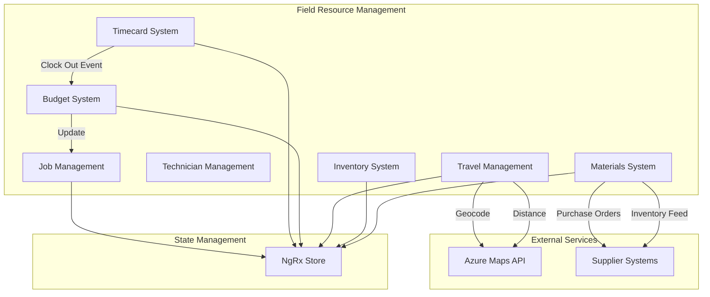
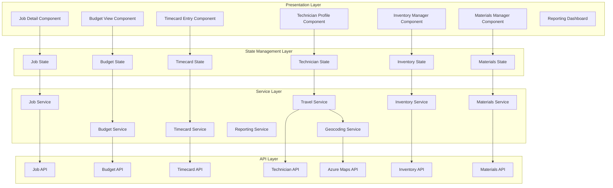
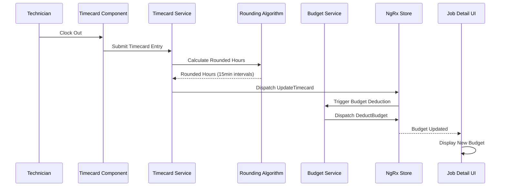
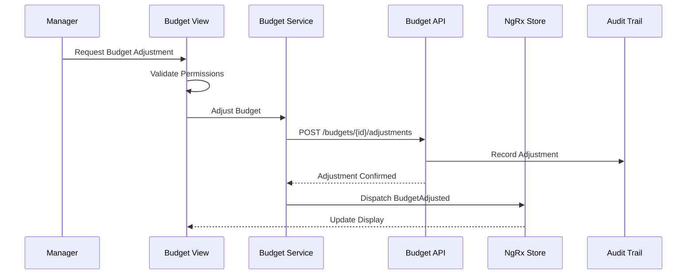
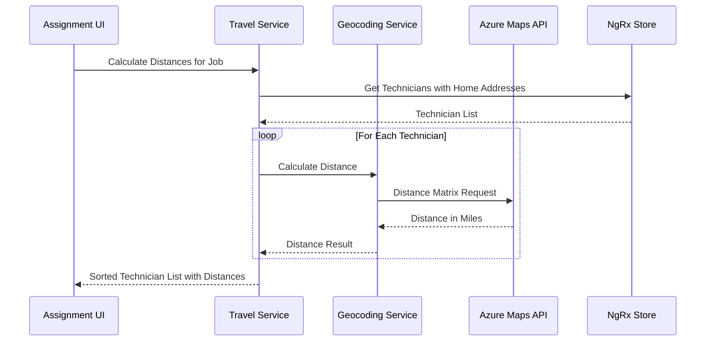

# Design Document: Job Budget and Tracking Enhancements

## Overview

This design document specifies the technical architecture for enhanced job and timecard management features in the field resource management application. The enhancements add comprehensive budget tracking with automatic hour deduction, manual budget adjustments with full audit trails, timecard rounding to 15-minute intervals, travel management with geocoding integration, and inventory/materials tracking systems.

### Goals

- Implement automated job budget tracking that decrements as technicians clock out
- Provide manual budget adjustment capabilities with complete audit history
- Apply industry-standard 15-minute rounding to all timecard entries
- Track technician travel willingness and home addresses for per diem calculations
- Build comprehensive inventory tracking across jobs, technicians, and vendors
- Implement materials tracking with supplier automation integration
- Maintain real-time budget updates through NgRx state management
- Generate comprehensive reports combining labor, materials, and travel costs

### Non-Goals

- Payroll processing (out of scope - rounded hours provided to external payroll system)
- Supplier ERP system implementation (integration only)
- Advanced route optimization (basic distance calculation only)
- Mobile offline budget editing (read-only offline access)

### Key Design Decisions

1. **State Management**: Use NgRx for all budget, timecard, inventory, and materials state to enable real-time updates across components
2. **Rounding Algorithm**: Round up to nearest 15 minutes (industry standard for billing)
3. **Geocoding Service**: Use Azure Maps API for address geocoding and distance calculations
4. **Audit Trail**: Store all budget adjustments with user, timestamp, reason, and amount
5. **Property-Based Testing**: Use fast-check library for comprehensive property testing
6. **Inventory Model**: Single unified inventory system with location-based categorization
7. **Materials vs Inventory**: Materials are consumables with supplier integration; inventory items are trackable assets

## Architecture

### System Context

The job budget and tracking enhancements integrate with existing field resource management components:



### Component Architecture



### Data Flow

#### Budget Deduction Flow



#### Manual Budget Adjustment Flow



#### Travel Distance Calculation Flow



## Components and Interfaces

### Budget Management Components

#### BudgetViewComponent

Displays job budget information with real-time updates.

```typescript
@Component({
  selector: 'app-budget-view',
  templateUrl: './budget-view.component.html',
  styleUrls: ['./budget-view.component.scss'],
  changeDetection: ChangeDetectionStrategy.OnPush
})
export class BudgetViewComponent implements OnInit {
  @Input() jobId!: string;
  
  budget$: Observable<JobBudget | null>;
  adjustmentHistory$: Observable<BudgetAdjustment[]>;
  budgetStatus$: Observable<BudgetStatus>;
  canAdjustBudget$: Observable<boolean>;
  
  constructor(
    private store: Store,
    private budgetService: BudgetService,
    private permissionService: PermissionService
  ) {}
  
  ngOnInit(): void {
    this.budget$ = this.store.select(selectBudgetByJobId(this.jobId));
    this.adjustmentHistory$ = this.store.select(selectBudgetAdjustmentHistory(this.jobId));
    this.budgetStatus$ = this.store.select(selectBudgetStatus(this.jobId));
    this.canAdjustBudget$ = this.permissionService.hasPermission('budget.adjust');
  }
  
  adjustBudget(amount: number, reason: string): void {
    this.store.dispatch(BudgetActions.adjustBudget({ 
      jobId: this.jobId, 
      amount, 
      reason 
    }));
  }
}
```

#### BudgetAdjustmentDialogComponent

Modal dialog for manual budget adjustments.

```typescript
@Component({
  selector: 'app-budget-adjustment-dialog',
  templateUrl: './budget-adjustment-dialog.component.html',
  changeDetection: ChangeDetectionStrategy.OnPush
})
export class BudgetAdjustmentDialogComponent {
  adjustmentForm: FormGroup;
  
  constructor(
    private dialogRef: MatDialogRef<BudgetAdjustmentDialogComponent>,
    @Inject(MAT_DIALOG_DATA) public data: { currentBudget: number },
    private fb: FormBuilder
  ) {
    this.adjustmentForm = this.fb.group({
      amount: [0, [Validators.required, Validators.min(-1000), Validators.max(1000)]],
      reason: ['', [Validators.required, Validators.minLength(10)]]
    });
  }
  
  submit(): void {
    if (this.adjustmentForm.valid) {
      this.dialogRef.close(this.adjustmentForm.value);
    }
  }
}
```

### Timecard Components

#### TimecardEntryComponent (Enhanced)

Enhanced to display rounded time alongside actual time.

```typescript
@Component({
  selector: 'app-timecard-entry',
  templateUrl: './timecard-entry.component.html',
  changeDetection: ChangeDetectionStrategy.OnPush
})
export class TimecardEntryComponent {
  @Input() entry!: TimecardEntry;
  
  get actualHours(): number {
    return this.calculateHours(this.entry.clockIn, this.entry.clockOut);
  }
  
  get roundedHours(): number {
    return this.roundToNearest15Minutes(this.actualHours);
  }
  
  get roundingDifference(): number {
    return this.roundedHours - this.actualHours;
  }
  
  private calculateHours(start: Date, end: Date): number {
    const diffMs = end.getTime() - start.getTime();
    return diffMs / (1000 * 60 * 60);
  }
  
  private roundToNearest15Minutes(hours: number): number {
    const minutes = hours * 60;
    const roundedMinutes = Math.ceil(minutes / 15) * 15;
    return roundedMinutes / 60;
  }
}
```

### Travel Management Components

#### TechnicianTravelProfileComponent

Manages travel flag and home address for technicians.

```typescript
@Component({
  selector: 'app-technician-travel-profile',
  templateUrl: './technician-travel-profile.component.html',
  changeDetection: ChangeDetectionStrategy.OnPush
})
export class TechnicianTravelProfileComponent implements OnInit {
  @Input() technicianId!: string;
  
  travelProfile$: Observable<TravelProfile | null>;
  canEdit$: Observable<boolean>;
  geocodingStatus$: Observable<GeocodingStatus>;
  
  addressForm: FormGroup;
  
  constructor(
    private store: Store,
    private travelService: TravelService,
    private fb: FormBuilder
  ) {
    this.addressForm = this.fb.group({
      street: ['', Validators.required],
      city: ['', Validators.required],
      state: ['', [Validators.required, Validators.pattern(/^[A-Z]{2}$/)]],
      postalCode: ['', [Validators.required, Validators.pattern(/^\d{5}(-\d{4})?$/)]]
    });
  }
  
  ngOnInit(): void {
    this.travelProfile$ = this.store.select(selectTravelProfile(this.technicianId));
    this.canEdit$ = this.store.select(selectCanEditTravelProfile(this.technicianId));
    this.geocodingStatus$ = this.store.select(selectGeocodingStatus(this.technicianId));
  }
  
  toggleTravelFlag(willing: boolean): void {
    this.store.dispatch(TravelActions.updateTravelFlag({ 
      technicianId: this.technicianId, 
      willing 
    }));
  }
  
  updateHomeAddress(): void {
    if (this.addressForm.valid) {
      const address = this.addressForm.value;
      this.store.dispatch(TravelActions.updateHomeAddress({ 
        technicianId: this.technicianId, 
        address 
      }));
    }
  }
}
```

#### TechnicianDistanceListComponent

Displays technicians sorted by distance from job location.

```typescript
@Component({
  selector: 'app-technician-distance-list',
  templateUrl: './technician-distance-list.component.html',
  changeDetection: ChangeDetectionStrategy.OnPush
})
export class TechnicianDistanceListComponent implements OnInit {
  @Input() jobId!: string;
  @Input() travelRequired: boolean = false;
  
  techniciansWithDistance$: Observable<TechnicianDistance[]>;
  loading$: Observable<boolean>;
  
  constructor(
    private store: Store,
    private travelService: TravelService
  ) {}
  
  ngOnInit(): void {
    this.store.dispatch(TravelActions.calculateDistances({ jobId: this.jobId }));
    
    this.techniciansWithDistance$ = this.store.select(
      selectTechniciansWithDistance(this.jobId, this.travelRequired)
    );
    this.loading$ = this.store.select(selectDistanceCalculationLoading);
  }
  
  getPerDiemEligibility(distance: number): boolean {
    return distance >= 50; // 50 miles threshold
  }
}
```

### Inventory Management Components

#### InventoryManagerComponent

Main component for inventory tracking and management.

```typescript
@Component({
  selector: 'app-inventory-manager',
  templateUrl: './inventory-manager.component.html',
  changeDetection: ChangeDetectionStrategy.OnPush
})
export class InventoryManagerComponent implements OnInit {
  inventory$: Observable<InventoryItem[]>;
  filteredInventory$: Observable<InventoryItem[]>;
  filters$: Observable<InventoryFilters>;
  lowStockItems$: Observable<InventoryItem[]>;
  
  constructor(
    private store: Store,
    private inventoryService: InventoryService
  ) {}
  
  ngOnInit(): void {
    this.store.dispatch(InventoryActions.loadInventory());
    
    this.inventory$ = this.store.select(selectAllInventory);
    this.filteredInventory$ = this.store.select(selectFilteredInventory);
    this.filters$ = this.store.select(selectInventoryFilters);
    this.lowStockItems$ = this.store.select(selectLowStockItems);
  }
  
  assignToJob(itemId: string, jobId: string): void {
    this.store.dispatch(InventoryActions.assignToJob({ itemId, jobId }));
  }
  
  assignToTechnician(itemId: string, technicianId: string): void {
    this.store.dispatch(InventoryActions.assignToTechnician({ itemId, technicianId }));
  }
  
  setFilters(filters: InventoryFilters): void {
    this.store.dispatch(InventoryActions.setFilters({ filters }));
  }
}
```

### Materials Management Components

#### MaterialsManagerComponent

Main component for materials tracking with supplier integration.

```typescript
@Component({
  selector: 'app-materials-manager',
  templateUrl: './materials-manager.component.html',
  changeDetection: ChangeDetectionStrategy.OnPush
})
export class MaterialsManagerComponent implements OnInit {
  materials$: Observable<Material[]>;
  suppliers$: Observable<Supplier[]>;
  reorderRecommendations$: Observable<ReorderRecommendation[]>;
  
  constructor(
    private store: Store,
    private materialsService: MaterialsService
  ) {}
  
  ngOnInit(): void {
    this.store.dispatch(MaterialsActions.loadMaterials());
    this.store.dispatch(MaterialsActions.loadSuppliers());
    
    this.materials$ = this.store.select(selectAllMaterials);
    this.suppliers$ = this.store.select(selectAllSuppliers);
    this.reorderRecommendations$ = this.store.select(selectReorderRecommendations);
  }
  
  consumeMaterial(materialId: string, jobId: string, quantity: number): void {
    this.store.dispatch(MaterialsActions.consumeMaterial({ 
      materialId, 
      jobId, 
      quantity 
    }));
  }
  
  createPurchaseOrder(recommendation: ReorderRecommendation): void {
    this.store.dispatch(MaterialsActions.createPurchaseOrder({ 
      materialId: recommendation.materialId,
      supplierId: recommendation.supplierId,
      quantity: recommendation.recommendedQuantity
    }));
  }
}
```

### Reporting Components

#### JobCostReportComponent

Comprehensive job cost report combining labor, materials, and travel.

```typescript
@Component({
  selector: 'app-job-cost-report',
  templateUrl: './job-cost-report.component.html',
  changeDetection: ChangeDetectionStrategy.OnPush
})
export class JobCostReportComponent implements OnInit {
  @Input() jobId!: string;
  
  costBreakdown$: Observable<JobCostBreakdown>;
  budgetComparison$: Observable<BudgetComparison>;
  
  constructor(
    private store: Store,
    private reportingService: ReportingService
  ) {}
  
  ngOnInit(): void {
    this.store.dispatch(ReportingActions.loadJobCostReport({ jobId: this.jobId }));
    
    this.costBreakdown$ = this.store.select(selectJobCostBreakdown(this.jobId));
    this.budgetComparison$ = this.store.select(selectBudgetComparison(this.jobId));
  }
  
  exportReport(format: 'pdf' | 'excel'): void {
    this.reportingService.exportJobCostReport(this.jobId, format).subscribe();
  }
}
```


## Data Models

### Budget Models

```typescript
/**
 * Job budget tracking model
 */
export interface JobBudget {
  id: string;
  jobId: string;
  allocatedHours: number;
  consumedHours: number;
  remainingHours: number;
  status: BudgetStatus;
  createdAt: Date;
  updatedAt: Date;
}

export enum BudgetStatus {
  OnTrack = 'on-track',
  Warning = 'warning',      // 80% consumed
  OverBudget = 'over-budget' // 100%+ consumed
}

/**
 * Budget adjustment record with full audit trail
 */
export interface BudgetAdjustment {
  id: string;
  jobId: string;
  amount: number;           // Positive = increase, negative = decrease
  reason: string;
  adjustedBy: string;       // User ID
  adjustedByName: string;   // User display name
  timestamp: Date;
  previousBudget: number;
  newBudget: number;
}

/**
 * Budget deduction record (from timecard entries)
 */
export interface BudgetDeduction {
  id: string;
  jobId: string;
  timecardEntryId: string;
  technicianId: string;
  technicianName: string;
  hoursDeducted: number;
  timestamp: Date;
}
```

### Timecard Models (Enhanced)

```typescript
/**
 * Enhanced timecard entry with rounding
 */
export interface TimecardEntry {
  id: string;
  technicianId: string;
  jobId: string;
  clockIn: Date;
  clockOut: Date;
  actualHours: number;      // Exact hours worked
  roundedHours: number;     // Rounded to nearest 15 minutes
  roundingDifference: number; // roundedHours - actualHours
  status: TimecardStatus;
  createdAt: Date;
  updatedAt: Date;
}

export enum TimecardStatus {
  Draft = 'draft',
  Submitted = 'submitted',
  Approved = 'approved',
  Rejected = 'rejected'
}

/**
 * Rounding configuration
 */
export interface RoundingConfig {
  intervalMinutes: number;  // Default: 15
  roundingMethod: RoundingMethod;
}

export enum RoundingMethod {
  RoundUp = 'round-up',     // Always round up (default)
  RoundDown = 'round-down',
  RoundNearest = 'round-nearest'
}
```

### Travel Models

```typescript
/**
 * Technician travel profile
 */
export interface TravelProfile {
  technicianId: string;
  willingToTravel: boolean;
  homeAddress: Address;
  homeCoordinates: Coordinates | null;
  geocodingStatus: GeocodingStatus;
  geocodingError: string | null;
  lastGeocodedAt: Date | null;
  updatedAt: Date;
}

export interface Address {
  street: string;
  city: string;
  state: string;
  postalCode: string;
}

export interface Coordinates {
  latitude: number;
  longitude: number;
}

export enum GeocodingStatus {
  NotGeocoded = 'not-geocoded',
  Pending = 'pending',
  Success = 'success',
  Failed = 'failed'
}

/**
 * Technician distance calculation result
 */
export interface TechnicianDistance {
  technicianId: string;
  technicianName: string;
  willingToTravel: boolean;
  distanceMiles: number | null;
  drivingTimeMinutes: number | null;
  perDiemEligible: boolean;
  calculatedAt: Date;
}

/**
 * Per diem configuration
 */
export interface PerDiemConfig {
  minimumDistanceMiles: number;  // Default: 50
  ratePerMile: number;           // Default: 0.655 (IRS rate)
  flatRateAmount: number | null; // Optional flat rate
}
```

### Inventory Models

```typescript
/**
 * Inventory item model
 */
export interface InventoryItem {
  id: string;
  itemNumber: string;
  name: string;
  description: string;
  category: InventoryCategory;
  currentLocation: InventoryLocation;
  quantity: number;
  unitCost: number;
  totalValue: number;
  minimumThreshold: number;
  serialNumber: string | null;
  manufacturer: string | null;
  model: string | null;
  purchaseDate: Date | null;
  warrantyExpiration: Date | null;
  status: InventoryStatus;
  createdAt: Date;
  updatedAt: Date;
}

export enum InventoryCategory {
  Tools = 'tools',
  Equipment = 'equipment',
  Vehicles = 'vehicles',
  SafetyGear = 'safety-gear',
  TestEquipment = 'test-equipment',
  Other = 'other'
}

export interface InventoryLocation {
  type: LocationType;
  id: string;           // Job ID, Technician ID, Vendor ID, or Warehouse ID
  name: string;         // Display name
  assignedAt: Date;
}

export enum LocationType {
  Job = 'job',
  Technician = 'technician',
  Vendor = 'vendor',
  Warehouse = 'warehouse'
}

export enum InventoryStatus {
  Available = 'available',
  Assigned = 'assigned',
  InUse = 'in-use',
  Maintenance = 'maintenance',
  Retired = 'retired'
}

/**
 * Inventory location history
 */
export interface InventoryLocationHistory {
  id: string;
  inventoryItemId: string;
  fromLocation: InventoryLocation | null;
  toLocation: InventoryLocation;
  movedBy: string;      // User ID
  movedByName: string;
  reason: string | null;
  timestamp: Date;
}

/**
 * Inventory filters
 */
export interface InventoryFilters {
  searchTerm?: string;
  category?: InventoryCategory;
  locationType?: LocationType;
  locationId?: string;
  status?: InventoryStatus;
  lowStock?: boolean;
}
```

### Materials Models

```typescript
/**
 * Material model with supplier integration
 */
export interface Material {
  id: string;
  materialNumber: string;
  name: string;
  description: string;
  category: MaterialCategory;
  unit: string;           // e.g., 'ft', 'ea', 'box'
  currentQuantity: number;
  reorderPoint: number;
  reorderQuantity: number;
  unitCost: number;
  preferredSupplierId: string;
  alternateSupplierIds: string[];
  lastOrderDate: Date | null;
  lastReceivedDate: Date | null;
  createdAt: Date;
  updatedAt: Date;
}

export enum MaterialCategory {
  Cable = 'cable',
  Connectors = 'connectors',
  Hardware = 'hardware',
  Consumables = 'consumables',
  Other = 'other'
}

/**
 * Supplier model
 */
export interface Supplier {
  id: string;
  name: string;
  contactName: string;
  email: string;
  phone: string;
  address: Address;
  automationEnabled: boolean;
  apiEndpoint: string | null;
  apiKey: string | null;
  leadTimeDays: number;
  minimumOrderAmount: number | null;
  createdAt: Date;
  updatedAt: Date;
}

/**
 * Material transaction (consumption or receipt)
 */
export interface MaterialTransaction {
  id: string;
  materialId: string;
  transactionType: TransactionType;
  quantity: number;
  unitCost: number;
  totalCost: number;
  jobId: string | null;        // For consumption
  supplierId: string | null;   // For receipt
  purchaseOrderId: string | null;
  performedBy: string;         // User ID
  performedByName: string;
  notes: string | null;
  timestamp: Date;
}

export enum TransactionType {
  Receipt = 'receipt',
  Consumption = 'consumption',
  Adjustment = 'adjustment',
  Return = 'return'
}

/**
 * Purchase order
 */
export interface PurchaseOrder {
  id: string;
  poNumber: string;
  supplierId: string;
  supplierName: string;
  items: PurchaseOrderItem[];
  totalAmount: number;
  status: PurchaseOrderStatus;
  orderDate: Date;
  expectedDeliveryDate: Date | null;
  actualDeliveryDate: Date | null;
  createdBy: string;
  createdByName: string;
  createdAt: Date;
  updatedAt: Date;
}

export interface PurchaseOrderItem {
  materialId: string;
  materialName: string;
  quantity: number;
  unitCost: number;
  totalCost: number;
}

export enum PurchaseOrderStatus {
  Draft = 'draft',
  Submitted = 'submitted',
  Approved = 'approved',
  Ordered = 'ordered',
  PartiallyReceived = 'partially-received',
  Received = 'received',
  Cancelled = 'cancelled'
}

/**
 * Reorder recommendation
 */
export interface ReorderRecommendation {
  materialId: string;
  materialName: string;
  currentQuantity: number;
  reorderPoint: number;
  recommendedQuantity: number;
  supplierId: string;
  supplierName: string;
  estimatedCost: number;
  urgency: ReorderUrgency;
}

export enum ReorderUrgency {
  Low = 'low',
  Medium = 'medium',
  High = 'high',
  Critical = 'critical'
}
```

### Reporting Models

```typescript
/**
 * Job cost breakdown
 */
export interface JobCostBreakdown {
  jobId: string;
  laborCosts: LaborCosts;
  materialCosts: MaterialCosts;
  travelCosts: TravelCosts;
  totalCosts: number;
  budgetVariance: number;
  budgetVariancePercent: number;
}

export interface LaborCosts {
  totalHours: number;
  totalRoundedHours: number;
  averageHourlyRate: number;
  totalCost: number;
  byTechnician: TechnicianLaborCost[];
}

export interface TechnicianLaborCost {
  technicianId: string;
  technicianName: string;
  hours: number;
  roundedHours: number;
  hourlyRate: number;
  totalCost: number;
}

export interface MaterialCosts {
  totalCost: number;
  byMaterial: MaterialCostItem[];
}

export interface MaterialCostItem {
  materialId: string;
  materialName: string;
  quantity: number;
  unitCost: number;
  totalCost: number;
}

export interface TravelCosts {
  totalCost: number;
  byTechnician: TechnicianTravelCost[];
}

export interface TechnicianTravelCost {
  technicianId: string;
  technicianName: string;
  distanceMiles: number;
  perDiemAmount: number;
}

/**
 * Budget comparison
 */
export interface BudgetComparison {
  allocatedBudget: number;
  actualCost: number;
  variance: number;
  variancePercent: number;
  status: BudgetStatus;
}
```

### DTOs (Data Transfer Objects)

```typescript
/**
 * Create budget DTO
 */
export interface CreateBudgetDto {
  jobId: string;
  allocatedHours: number;
}

/**
 * Adjust budget DTO
 */
export interface AdjustBudgetDto {
  amount: number;
  reason: string;
}

/**
 * Update travel profile DTO
 */
export interface UpdateTravelProfileDto {
  willingToTravel?: boolean;
  homeAddress?: Address;
}

/**
 * Create inventory item DTO
 */
export interface CreateInventoryItemDto {
  itemNumber: string;
  name: string;
  description: string;
  category: InventoryCategory;
  quantity: number;
  unitCost: number;
  minimumThreshold: number;
  serialNumber?: string;
  manufacturer?: string;
  model?: string;
}

/**
 * Assign inventory DTO
 */
export interface AssignInventoryDto {
  locationType: LocationType;
  locationId: string;
  reason?: string;
}

/**
 * Create material DTO
 */
export interface CreateMaterialDto {
  materialNumber: string;
  name: string;
  description: string;
  category: MaterialCategory;
  unit: string;
  currentQuantity: number;
  reorderPoint: number;
  reorderQuantity: number;
  unitCost: number;
  preferredSupplierId: string;
}

/**
 * Consume material DTO
 */
export interface ConsumeMaterialDto {
  materialId: string;
  jobId: string;
  quantity: number;
  notes?: string;
}

/**
 * Create purchase order DTO
 */
export interface CreatePurchaseOrderDto {
  supplierId: string;
  items: PurchaseOrderItemDto[];
  expectedDeliveryDate?: Date;
}

export interface PurchaseOrderItemDto {
  materialId: string;
  quantity: number;
  unitCost: number;
}
```

## Services

### BudgetService

Manages job budget operations and calculations.

```typescript
@Injectable({
  providedIn: 'root'
})
export class BudgetService {
  private readonly apiUrl = '/api/budgets';
  
  constructor(
    private http: HttpClient,
    private store: Store
  ) {}
  
  /**
   * Get budget for a job
   */
  getBudget(jobId: string): Observable<JobBudget> {
    return this.http.get<JobBudget>(`${this.apiUrl}/job/${jobId}`).pipe(
      retry(2),
      catchError(this.handleError)
    );
  }
  
  /**
   * Create initial budget for a job
   */
  createBudget(dto: CreateBudgetDto): Observable<JobBudget> {
    return this.http.post<JobBudget>(this.apiUrl, dto).pipe(
      catchError(this.handleError)
    );
  }
  
  /**
   * Adjust budget manually
   */
  adjustBudget(jobId: string, dto: AdjustBudgetDto): Observable<BudgetAdjustment> {
    return this.http.post<BudgetAdjustment>(
      `${this.apiUrl}/${jobId}/adjustments`, 
      dto
    ).pipe(
      catchError(this.handleError)
    );
  }
  
  /**
   * Deduct hours from budget (called by timecard system)
   */
  deductHours(jobId: string, hours: number, timecardEntryId: string): Observable<JobBudget> {
    return this.http.post<JobBudget>(
      `${this.apiUrl}/${jobId}/deductions`,
      { hours, timecardEntryId }
    ).pipe(
      catchError(this.handleError)
    );
  }
  
  /**
   * Get budget adjustment history
   */
  getAdjustmentHistory(jobId: string): Observable<BudgetAdjustment[]> {
    return this.http.get<BudgetAdjustment[]>(
      `${this.apiUrl}/${jobId}/adjustments`
    ).pipe(
      retry(2),
      catchError(this.handleError)
    );
  }
  
  /**
   * Get budget deduction history
   */
  getDeductionHistory(jobId: string): Observable<BudgetDeduction[]> {
    return this.http.get<BudgetDeduction[]>(
      `${this.apiUrl}/${jobId}/deductions`
    ).pipe(
      retry(2),
      catchError(this.handleError)
    );
  }
  
  /**
   * Calculate budget status
   */
  calculateBudgetStatus(budget: JobBudget): BudgetStatus {
    const percentConsumed = (budget.consumedHours / budget.allocatedHours) * 100;
    
    if (percentConsumed >= 100) {
      return BudgetStatus.OverBudget;
    } else if (percentConsumed >= 80) {
      return BudgetStatus.Warning;
    } else {
      return BudgetStatus.OnTrack;
    }
  }
  
  private handleError(error: HttpErrorResponse): Observable<never> {
    let errorMessage = 'An error occurred';
    
    if (error.error instanceof ErrorEvent) {
      errorMessage = `Error: ${error.error.message}`;
    } else {
      switch (error.status) {
        case 400:
          errorMessage = 'Invalid budget data';
          break;
        case 403:
          errorMessage = 'Insufficient permissions to modify budget';
          break;
        case 404:
          errorMessage = 'Budget not found';
          break;
        case 409:
          errorMessage = 'Budget conflict';
          break;
        default:
          errorMessage = `Server error: ${error.status}`;
      }
    }
    
    return throwError(() => new Error(errorMessage));
  }
}
```

### TimecardRoundingService

Handles timecard rounding calculations.

```typescript
@Injectable({
  providedIn: 'root'
})
export class TimecardRoundingService {
  private config: RoundingConfig = {
    intervalMinutes: 15,
    roundingMethod: RoundingMethod.RoundUp
  };
  
  /**
   * Round hours to nearest interval
   */
  roundHours(hours: number): number {
    const minutes = hours * 60;
    const roundedMinutes = this.roundMinutes(minutes);
    return roundedMinutes / 60;
  }
  
  /**
   * Round minutes to nearest interval
   */
  private roundMinutes(minutes: number): number {
    const interval = this.config.intervalMinutes;
    
    switch (this.config.roundingMethod) {
      case RoundingMethod.RoundUp:
        return Math.ceil(minutes / interval) * interval;
      
      case RoundingMethod.RoundDown:
        return Math.floor(minutes / interval) * interval;
      
      case RoundingMethod.RoundNearest:
        return Math.round(minutes / interval) * interval;
      
      default:
        return Math.ceil(minutes / interval) * interval;
    }
  }
  
  /**
   * Calculate actual hours from clock in/out times
   */
  calculateActualHours(clockIn: Date, clockOut: Date): number {
    const diffMs = clockOut.getTime() - clockIn.getTime();
    return diffMs / (1000 * 60 * 60);
  }
  
  /**
   * Process timecard entry with rounding
   */
  processTimecardEntry(clockIn: Date, clockOut: Date): {
    actualHours: number;
    roundedHours: number;
    roundingDifference: number;
  } {
    const actualHours = this.calculateActualHours(clockIn, clockOut);
    const roundedHours = this.roundHours(actualHours);
    const roundingDifference = roundedHours - actualHours;
    
    return {
      actualHours,
      roundedHours,
      roundingDifference
    };
  }
  
  /**
   * Update rounding configuration
   */
  updateConfig(config: Partial<RoundingConfig>): void {
    this.config = { ...this.config, ...config };
  }
}
```

### GeocodingService

Handles address geocoding and distance calculations using Azure Maps.

```typescript
@Injectable({
  providedIn: 'root'
})
export class GeocodingService {
  private readonly azureMapsKey = environment.azureMapsKey;
  private readonly geocodeUrl = 'https://atlas.microsoft.com/search/address/json';
  private readonly distanceUrl = 'https://atlas.microsoft.com/route/matrix/json';
  
  constructor(private http: HttpClient) {}
  
  /**
   * Geocode an address to coordinates
   */
  geocodeAddress(address: Address): Observable<Coordinates> {
    const query = `${address.street}, ${address.city}, ${address.state} ${address.postalCode}`;
    
    const params = new HttpParams()
      .set('api-version', '1.0')
      .set('subscription-key', this.azureMapsKey)
      .set('query', query);
    
    return this.http.get<any>(this.geocodeUrl, { params }).pipe(
      map(response => {
        if (response.results && response.results.length > 0) {
          const position = response.results[0].position;
          return {
            latitude: position.lat,
            longitude: position.lon
          };
        }
        throw new Error('Address not found');
      }),
      retry(2),
      catchError(error => {
        console.error('Geocoding error:', error);
        return throwError(() => new Error('Failed to geocode address'));
      })
    );
  }
  
  /**
   * Calculate distance between two coordinates
   */
  calculateDistance(
    origin: Coordinates,
    destination: Coordinates
  ): Observable<{ distanceMiles: number; drivingTimeMinutes: number }> {
    const params = new HttpParams()
      .set('api-version', '1.0')
      .set('subscription-key', this.azureMapsKey);
    
    const body = {
      origins: {
        type: 'MultiPoint',
        coordinates: [[origin.longitude, origin.latitude]]
      },
      destinations: {
        type: 'MultiPoint',
        coordinates: [[destination.longitude, destination.latitude]]
      }
    };
    
    return this.http.post<any>(this.distanceUrl, body, { params }).pipe(
      map(response => {
        const summary = response.matrix[0][0].response.routeSummary;
        return {
          distanceMiles: summary.lengthInMeters * 0.000621371, // Convert to miles
          drivingTimeMinutes: summary.travelTimeInSeconds / 60
        };
      }),
      retry(2),
      catchError(error => {
        console.error('Distance calculation error:', error);
        return throwError(() => new Error('Failed to calculate distance'));
      })
    );
  }
  
  /**
   * Batch calculate distances from multiple origins to one destination
   */
  calculateDistancesBatch(
    origins: Coordinates[],
    destination: Coordinates
  ): Observable<{ distanceMiles: number; drivingTimeMinutes: number }[]> {
    // Azure Maps supports up to 700 origins in one request
    // For simplicity, we'll process in batches of 100
    const batchSize = 100;
    const batches: Observable<any>[] = [];
    
    for (let i = 0; i < origins.length; i += batchSize) {
      const batch = origins.slice(i, i + batchSize);
      batches.push(this.calculateDistanceBatch(batch, destination));
    }
    
    return forkJoin(batches).pipe(
      map(results => results.flat())
    );
  }
  
  private calculateDistanceBatch(
    origins: Coordinates[],
    destination: Coordinates
  ): Observable<{ distanceMiles: number; drivingTimeMinutes: number }[]> {
    const params = new HttpParams()
      .set('api-version', '1.0')
      .set('subscription-key', this.azureMapsKey);
    
    const body = {
      origins: {
        type: 'MultiPoint',
        coordinates: origins.map(o => [o.longitude, o.latitude])
      },
      destinations: {
        type: 'MultiPoint',
        coordinates: [[destination.longitude, destination.latitude]]
      }
    };
    
    return this.http.post<any>(this.distanceUrl, body, { params }).pipe(
      map(response => {
        return response.matrix.map((row: any) => {
          const summary = row[0].response.routeSummary;
          return {
            distanceMiles: summary.lengthInMeters * 0.000621371,
            drivingTimeMinutes: summary.travelTimeInSeconds / 60
          };
        });
      }),
      retry(2),
      catchError(error => {
        console.error('Batch distance calculation error:', error);
        return throwError(() => new Error('Failed to calculate distances'));
      })
    );
  }
}
```

### TravelService

Manages travel profiles and distance calculations.

```typescript
@Injectable({
  providedIn: 'root'
})
export class TravelService {
  private readonly apiUrl = '/api/travel';
  
  constructor(
    private http: HttpClient,
    private geocodingService: GeocodingService,
    private store: Store
  ) {}
  
  /**
   * Get travel profile for technician
   */
  getTravelProfile(technicianId: string): Observable<TravelProfile> {
    return this.http.get<TravelProfile>(`${this.apiUrl}/profiles/${technicianId}`).pipe(
      retry(2),
      catchError(this.handleError)
    );
  }
  
  /**
   * Update travel flag
   */
  updateTravelFlag(technicianId: string, willing: boolean): Observable<TravelProfile> {
    return this.http.patch<TravelProfile>(
      `${this.apiUrl}/profiles/${technicianId}/flag`,
      { willingToTravel: willing }
    ).pipe(
      catchError(this.handleError)
    );
  }
  
  /**
   * Update home address (triggers geocoding)
   */
  updateHomeAddress(technicianId: string, address: Address): Observable<TravelProfile> {
    return this.http.patch<TravelProfile>(
      `${this.apiUrl}/profiles/${technicianId}/address`,
      { homeAddress: address }
    ).pipe(
      switchMap(profile => {
        // Trigger geocoding
        return this.geocodingService.geocodeAddress(address).pipe(
          switchMap(coordinates => {
            return this.updateCoordinates(technicianId, coordinates);
          }),
          catchError(error => {
            // Update profile with geocoding error
            return this.updateGeocodingStatus(
              technicianId, 
              GeocodingStatus.Failed, 
              error.message
            );
          })
        );
      }),
      catchError(this.handleError)
    );
  }
  
  /**
   * Update geocoded coordinates
   */
  private updateCoordinates(
    technicianId: string, 
    coordinates: Coordinates
  ): Observable<TravelProfile> {
    return this.http.patch<TravelProfile>(
      `${this.apiUrl}/profiles/${technicianId}/coordinates`,
      { 
        homeCoordinates: coordinates,
        geocodingStatus: GeocodingStatus.Success,
        geocodingError: null,
        lastGeocodedAt: new Date()
      }
    );
  }
  
  /**
   * Update geocoding status
   */
  private updateGeocodingStatus(
    technicianId: string,
    status: GeocodingStatus,
    error: string | null
  ): Observable<TravelProfile> {
    return this.http.patch<TravelProfile>(
      `${this.apiUrl}/profiles/${technicianId}/geocoding-status`,
      { geocodingStatus: status, geocodingError: error }
    );
  }
  
  /**
   * Calculate distances from technicians to job
   */
  calculateDistancesToJob(jobId: string): Observable<TechnicianDistance[]> {
    // Get job location
    return this.store.select(selectJobById(jobId)).pipe(
      take(1),
      switchMap(job => {
        if (!job || !job.siteAddress.latitude || !job.siteAddress.longitude) {
          return throwError(() => new Error('Job location not available'));
        }
        
        const jobCoords: Coordinates = {
          latitude: job.siteAddress.latitude,
          longitude: job.siteAddress.longitude
        };
        
        // Get technicians with geocoded addresses
        return this.store.select(selectTechniciansWithGeocodedAddresses).pipe(
          take(1),
          switchMap(technicians => {
            if (technicians.length === 0) {
              return of([]);
            }
            
            const origins = technicians.map(t => t.homeCoordinates!);
            
            return this.geocodingService.calculateDistancesBatch(origins, jobCoords).pipe(
              map(distances => {
                return technicians.map((tech, index) => ({
                  technicianId: tech.id,
                  technicianName: `${tech.firstName} ${tech.lastName}`,
                  willingToTravel: tech.travelProfile?.willingToTravel || false,
                  distanceMiles: distances[index].distanceMiles,
                  drivingTimeMinutes: distances[index].drivingTimeMinutes,
                  perDiemEligible: distances[index].distanceMiles >= 50,
                  calculatedAt: new Date()
                }));
              })
            );
          })
        );
      }),
      catchError(this.handleError)
    );
  }
  
  /**
   * Calculate per diem amount
   */
  calculatePerDiem(distanceMiles: number, config: PerDiemConfig): number {
    if (distanceMiles < config.minimumDistanceMiles) {
      return 0;
    }
    
    if (config.flatRateAmount !== null) {
      return config.flatRateAmount;
    }
    
    return distanceMiles * config.ratePerMile;
  }
  
  private handleError(error: HttpErrorResponse): Observable<never> {
    let errorMessage = 'An error occurred';
    
    if (error.error instanceof ErrorEvent) {
      errorMessage = `Error: ${error.error.message}`;
    } else {
      switch (error.status) {
        case 400:
          errorMessage = 'Invalid travel data';
          break;
        case 403:
          errorMessage = 'Insufficient permissions';
          break;
        case 404:
          errorMessage = 'Travel profile not found';
          break;
        default:
          errorMessage = `Server error: ${error.status}`;
      }
    }
    
    return throwError(() => new Error(errorMessage));
  }
}
```


### InventoryService

Manages inventory tracking and location assignments.

```typescript
@Injectable({
  providedIn: 'root'
})
export class InventoryService {
  private readonly apiUrl = '/api/inventory';
  
  constructor(private http: HttpClient) {}
  
  getInventory(filters?: InventoryFilters): Observable<InventoryItem[]> {
    let params = new HttpParams();
    if (filters) {
      if (filters.searchTerm) params = params.set('search', filters.searchTerm);
      if (filters.category) params = params.set('category', filters.category);
      if (filters.locationType) params = params.set('locationType', filters.locationType);
      if (filters.locationId) params = params.set('locationId', filters.locationId);
      if (filters.status) params = params.set('status', filters.status);
      if (filters.lowStock) params = params.set('lowStock', 'true');
    }
    
    return this.http.get<InventoryItem[]>(this.apiUrl, { params }).pipe(
      retry(2),
      catchError(this.handleError)
    );
  }
  
  assignToJob(itemId: string, jobId: string, reason?: string): Observable<InventoryItem> {
    return this.http.post<InventoryItem>(
      `${this.apiUrl}/${itemId}/assign`,
      { locationType: LocationType.Job, locationId: jobId, reason }
    ).pipe(catchError(this.handleError));
  }
  
  assignToTechnician(itemId: string, technicianId: string, reason?: string): Observable<InventoryItem> {
    return this.http.post<InventoryItem>(
      `${this.apiUrl}/${itemId}/assign`,
      { locationType: LocationType.Technician, locationId: technicianId, reason }
    ).pipe(catchError(this.handleError));
  }
  
  getLocationHistory(itemId: string): Observable<InventoryLocationHistory[]> {
    return this.http.get<InventoryLocationHistory[]>(
      `${this.apiUrl}/${itemId}/history`
    ).pipe(retry(2), catchError(this.handleError));
  }
  
  private handleError(error: HttpErrorResponse): Observable<never> {
    return throwError(() => new Error(`Inventory error: ${error.status}`));
  }
}
```

### MaterialsService

Manages materials tracking and supplier integration.

```typescript
@Injectable({
  providedIn: 'root'
})
export class MaterialsService {
  private readonly apiUrl = '/api/materials';
  
  constructor(private http: HttpClient) {}
  
  getMaterials(): Observable<Material[]> {
    return this.http.get<Material[]>(this.apiUrl).pipe(
      retry(2),
      catchError(this.handleError)
    );
  }
  
  consumeMaterial(dto: ConsumeMaterialDto): Observable<MaterialTransaction> {
    return this.http.post<MaterialTransaction>(
      `${this.apiUrl}/${dto.materialId}/consume`,
      dto
    ).pipe(catchError(this.handleError));
  }
  
  receiveMaterial(materialId: string, quantity: number, supplierId: string): Observable<MaterialTransaction> {
    return this.http.post<MaterialTransaction>(
      `${this.apiUrl}/${materialId}/receive`,
      { quantity, supplierId }
    ).pipe(catchError(this.handleError));
  }
  
  createPurchaseOrder(dto: CreatePurchaseOrderDto): Observable<PurchaseOrder> {
    return this.http.post<PurchaseOrder>('/api/purchase-orders', dto).pipe(
      catchError(this.handleError)
    );
  }
  
  getReorderRecommendations(): Observable<ReorderRecommendation[]> {
    return this.http.get<ReorderRecommendation[]>(`${this.apiUrl}/reorder-recommendations`).pipe(
      retry(2),
      catchError(this.handleError)
    );
  }
  
  private handleError(error: HttpErrorResponse): Observable<never> {
    return throwError(() => new Error(`Materials error: ${error.status}`));
  }
}
```


## Correctness Properties

*A property is a characteristic or behavior that should hold true across all valid executions of a system-essentially, a formal statement about what the system should do. Properties serve as the bridge between human-readable specifications and machine-verifiable correctness guarantees.*

### Property Reflection

After analyzing all acceptance criteria, I identified the following redundancies:

- **2.1 and 2.2**: Both test authorization for budget adjustments - combined into Property 2
- **2.3, 2.4, 2.5, 2.6**: All test audit trail recording - combined into Property 3
- **3.2 and 3.3**: Both test rounding behavior - combined into Property 5 (round-trip property)
- **3.6 and 3.7**: Both test that rounded time is used for calculations - combined into Property 6
- **6.5, 6.6, 6.7**: All test location updates for different assignment types - combined into Property 14
- **8.1 and 8.2**: Redundant with 1.3 and 3.6 - not creating separate properties
- **8.5 and 8.6**: Both test alert generation at thresholds - combined into Property 8
- **9.2 and 5.6**: Both test distance calculation - using Property 11
- **9.5 and 5.7**: Both test per diem eligibility - using Property 12

The remaining properties provide unique validation value and comprehensive coverage of testable requirements.

### Property 1: Budget Hour Calculation

*For any* valid clock-in and clock-out timestamps where clock-out is after clock-in, calculating the hours worked should produce a non-negative value equal to the time difference in hours.

**Validates: Requirements 1.2**

### Property 2: Budget Adjustment Authorization

*For any* user and budget adjustment request, the system should allow the adjustment if and only if the user has Admin or Manager role.

**Validates: Requirements 2.1, 2.2**

### Property 3: Budget Adjustment Audit Trail Completeness

*For any* budget adjustment, the system should record all audit fields (amount, user ID, user name, timestamp, reason, previous budget, new budget) and all fields should be non-null and valid.

**Validates: Requirements 2.3, 2.4, 2.5, 2.6**

### Property 4: Budget Remaining Calculation

*For any* job budget with allocated hours and consumed hours, the remaining hours should equal allocated minus consumed, regardless of whether the result is negative.

**Validates: Requirements 1.5**

### Property 5: Timecard Rounding to 15 Minutes

*For any* number of minutes worked, rounding up to the nearest 15-minute interval and then rounding again should produce the same result (idempotence), and the rounded value should always be greater than or equal to the original value.

**Validates: Requirements 3.2, 3.3**

### Property 6: Rounded Time Used for Budget Deduction

*For any* timecard entry with actual hours and rounded hours, when the entry is used to deduct from a job budget, the deduction amount should equal the rounded hours, not the actual hours.

**Validates: Requirements 3.6, 3.7, 8.1, 8.2**

### Property 7: Budget Status Determination

*For any* job budget, if consumed hours >= allocated hours, the status should be OverBudget; if consumed hours >= 80% of allocated hours, the status should be Warning; otherwise, the status should be OnTrack.

**Validates: Requirements 1.6**

### Property 8: Budget Alert Generation at Thresholds

*For any* job budget, alerts should be generated when consumed hours reach 80% of allocated hours and when consumed hours reach 100% of allocated hours.

**Validates: Requirements 8.5, 8.6**

### Property 9: Travel Flag Valid States

*For any* technician travel profile, the travel flag should only accept boolean values (willing or not willing), and attempting to set any other value should fail validation.

**Validates: Requirements 4.2**

### Property 10: Home Address Validation

*For any* address, the system should accept it as valid if and only if it contains non-empty street, city, state, and postal code fields.

**Validates: Requirements 5.2**

### Property 11: Distance Calculation Symmetry

*For any* two valid coordinates A and B, the calculated distance from A to B should equal the distance from B to A (within a small tolerance for floating-point precision).

**Validates: Requirements 5.6, 9.2**

### Property 12: Per Diem Eligibility Threshold

*For any* distance in miles and per diem configuration, a technician should be eligible for per diem if and only if the distance is greater than or equal to the configured minimum distance threshold.

**Validates: Requirements 5.7, 9.5**

### Property 13: Inventory Item Unique Identifiers

*For any* set of inventory items created in the system, all item IDs should be unique (no duplicates).

**Validates: Requirements 6.1**

### Property 14: Inventory Location Update on Assignment

*For any* inventory item and assignment to a location (job, technician, or vendor), after the assignment, the item's current location should reflect the new assignment.

**Validates: Requirements 6.5, 6.6, 6.7**

### Property 15: Inventory Location History Accumulation

*For any* inventory item with multiple location assignments, the location history should contain all assignments in chronological order, and the count of history entries should equal the number of assignments.

**Validates: Requirements 6.8**

### Property 16: Inventory Filtering Correctness

*For any* inventory list and filter criteria, all items in the filtered result should match the filter criteria, and all items matching the criteria should be in the result.

**Validates: Requirements 6.9**

### Property 17: Inventory Value Calculation by Location

*For any* location, the total inventory value should equal the sum of (quantity × unit cost) for all items at that location.

**Validates: Requirements 6.10**

### Property 18: Low Stock Alert Generation

*For any* inventory item, when the quantity is less than or equal to the minimum threshold, a low stock alert should be generated.

**Validates: Requirements 6.11**

### Property 19: Material Quantity Update on Receipt

*For any* material with initial quantity Q and receipt of quantity R, after the receipt transaction, the material quantity should equal Q + R.

**Validates: Requirements 7.8**

### Property 20: Material Quantity Reduction on Consumption

*For any* material with initial quantity Q and consumption of quantity C (where C ≤ Q), after the consumption transaction, the material quantity should equal Q - C.

**Validates: Requirements 7.9**

### Property 21: Material Transaction History Completeness

*For any* material with multiple transactions (receipts and consumptions), the transaction history should contain all transactions in chronological order, and the current quantity should equal the initial quantity plus all receipts minus all consumptions.

**Validates: Requirements 7.10**

### Property 22: Material Cost Calculation per Job

*For any* job with assigned materials, the total material cost should equal the sum of (quantity × unit cost) for all materials assigned to that job.

**Validates: Requirements 7.11, 11.2**

### Property 23: Reorder Recommendation Generation

*For any* material, when the current quantity is less than or equal to the reorder point, a reorder recommendation should be generated.

**Validates: Requirements 7.6**

### Property 24: Technician Distance Sorting

*For any* list of technicians with calculated distances to a job, when sorted by distance, each technician's distance should be less than or equal to the next technician's distance (ascending order).

**Validates: Requirements 9.6**

### Property 25: Inventory Availability Check on Assignment

*For any* inventory item assignment attempt, the assignment should succeed if and only if the item status is Available and the item is not currently assigned to another active job.

**Validates: Requirements 10.2, 10.5**

### Property 26: Inventory Release on Job Cancellation

*For any* job with assigned inventory items, when the job is cancelled, all assigned items should return to Available status and their location should be updated to warehouse.

**Validates: Requirements 10.6**

### Property 27: Material Inventory Adjustment on Consumption Variance

*For any* job with allocated material quantity A and actual consumption C, if A ≠ C, the material inventory should be adjusted by (A - C), returning unused materials or accounting for overages.

**Validates: Requirements 11.5**

### Property 28: Material Cost Variance Calculation

*For any* job with estimated material cost E and actual material cost A, the cost variance should equal A - E.

**Validates: Requirements 11.7**


## Error Handling

### Budget System Errors

**Budget Not Found (404)**
- Occurs when: Requesting budget for non-existent job
- Handling: Display user-friendly message, log error, allow retry
- Recovery: Redirect to job list or create budget

**Insufficient Permissions (403)**
- Occurs when: Non-admin/manager attempts budget adjustment
- Handling: Display permission error, log attempt
- Recovery: Contact administrator for access

**Invalid Budget Data (400)**
- Occurs when: Negative budget values, invalid adjustment amounts
- Handling: Display validation errors, prevent submission
- Recovery: Correct input values

**Budget Conflict (409)**
- Occurs when: Concurrent budget modifications
- Handling: Display conflict message, show current state
- Recovery: Refresh and retry operation

### Timecard System Errors

**Invalid Time Range (400)**
- Occurs when: Clock-out before clock-in, future timestamps
- Handling: Display validation error, highlight invalid fields
- Recovery: Correct time values

**Timecard Already Submitted (409)**
- Occurs when: Attempting to modify submitted timecard
- Handling: Display status message, explain unlock process
- Recovery: Request unlock from manager

**Rounding Configuration Error (500)**
- Occurs when: Invalid rounding interval configuration
- Handling: Use default 15-minute interval, log error
- Recovery: Administrator fixes configuration

### Travel Management Errors

**Geocoding Failed (502)**
- Occurs when: Azure Maps API unavailable or address invalid
- Handling: Mark geocoding status as Failed, store error message
- Recovery: Retry geocoding, allow manual coordinate entry

**Invalid Address Format (400)**
- Occurs when: Missing required address fields
- Handling: Display validation errors for each missing field
- Recovery: Complete all required fields

**Distance Calculation Failed (502)**
- Occurs when: Azure Maps API error or invalid coordinates
- Handling: Display error message, log failure
- Recovery: Retry calculation, use cached distances if available

**Privacy Violation (403)**
- Occurs when: Unauthorized access to home address
- Handling: Return 403, log security event
- Recovery: Request proper authorization

### Inventory System Errors

**Item Not Available (409)**
- Occurs when: Attempting to assign already-assigned item
- Handling: Display availability status, suggest alternatives
- Recovery: Select different item or wait for return

**Item Not Found (404)**
- Occurs when: Invalid inventory item ID
- Handling: Display error message, refresh inventory list
- Recovery: Select valid item from list

**Low Stock Warning**
- Occurs when: Quantity at or below threshold
- Handling: Display warning badge, generate alert
- Recovery: Reorder or adjust threshold

**Invalid Location Assignment (400)**
- Occurs when: Invalid location type or ID
- Handling: Display validation error
- Recovery: Select valid location

### Materials System Errors

**Insufficient Quantity (409)**
- Occurs when: Consumption exceeds available quantity
- Handling: Display available quantity, prevent over-consumption
- Recovery: Reduce consumption amount or receive more materials

**Supplier Integration Failed (502)**
- Occurs when: Supplier API unavailable
- Handling: Queue purchase order for retry, notify user
- Recovery: Manual order or retry when supplier available

**Purchase Order Conflict (409)**
- Occurs when: Duplicate PO number or concurrent modifications
- Handling: Display conflict message, show current state
- Recovery: Refresh and retry with new PO number

**Material Not Found (404)**
- Occurs when: Invalid material ID
- Handling: Display error message, refresh materials list
- Recovery: Select valid material from list

### General Error Handling Strategy

1. **Validation Errors**: Prevent submission, display inline errors, guide user to correction
2. **Authorization Errors**: Clear messaging, log security events, guide to proper channels
3. **Network Errors**: Retry with exponential backoff, queue for offline processing if applicable
4. **External Service Errors**: Graceful degradation, use cached data when possible, clear user communication
5. **Conflict Errors**: Refresh state, show current data, allow user to retry with updated information
6. **Server Errors**: Log detailed error, display user-friendly message, provide support contact

### Error Logging

All errors should be logged with:
- Timestamp
- User ID and role
- Operation attempted
- Error type and message
- Stack trace (for server errors)
- Request/response data (sanitized)

Critical errors (security violations, data corruption) should trigger immediate alerts to administrators.

## Testing Strategy

### Dual Testing Approach

This feature requires both unit tests and property-based tests for comprehensive coverage:

**Unit Tests** focus on:
- Specific examples and edge cases
- Integration points between components
- Error conditions and boundary values
- UI component behavior
- Service method contracts

**Property-Based Tests** focus on:
- Universal properties across all inputs
- Comprehensive input coverage through randomization
- Invariants that must hold for all valid states
- Round-trip properties (e.g., serialize/deserialize)
- Calculation correctness across ranges

Both testing approaches are complementary and necessary. Unit tests catch concrete bugs and verify specific scenarios, while property tests verify general correctness across the input space.

### Property-Based Testing Configuration

**Library**: fast-check (TypeScript/JavaScript property-based testing library)

**Installation**:
```bash
npm install --save-dev fast-check
```

**Configuration**:
- Minimum 100 iterations per property test (due to randomization)
- Each property test must reference its design document property
- Tag format: `Feature: job-budget-and-tracking-enhancements, Property {number}: {property_text}`

**Example Property Test**:
```typescript
import * as fc from 'fast-check';

describe('Budget System Properties', () => {
  // Feature: job-budget-and-tracking-enhancements, Property 4: Budget Remaining Calculation
  it('Property 4: remaining hours should equal allocated minus consumed', () => {
    fc.assert(
      fc.property(
        fc.float({ min: 0, max: 1000 }), // allocated hours
        fc.float({ min: 0, max: 1000 }), // consumed hours
        (allocated, consumed) => {
          const budget: JobBudget = {
            id: 'test',
            jobId: 'job-1',
            allocatedHours: allocated,
            consumedHours: consumed,
            remainingHours: 0,
            status: BudgetStatus.OnTrack,
            createdAt: new Date(),
            updatedAt: new Date()
          };
          
          const remaining = budgetService.calculateRemaining(budget);
          const expected = allocated - consumed;
          
          // Allow small floating-point tolerance
          expect(Math.abs(remaining - expected)).toBeLessThan(0.001);
        }
      ),
      { numRuns: 100 }
    );
  });
});
```

### Unit Testing Strategy

**Budget System Unit Tests**:
- Budget creation with valid/invalid data
- Budget adjustment with different user roles
- Budget deduction on timecard submission
- Budget status calculation at various thresholds
- Audit trail recording completeness
- Error handling for all error types

**Timecard Rounding Unit Tests**:
- Rounding at exact 15-minute intervals (no change)
- Rounding at 1-14 minutes past interval (round up)
- Rounding with different rounding methods
- Edge cases: 0 minutes, very large values
- Integration with budget deduction

**Travel Management Unit Tests**:
- Address validation with missing fields
- Geocoding success and failure scenarios
- Distance calculation with valid coordinates
- Per diem calculation at various distances
- Authorization for address viewing/editing
- Travel flag filtering

**Inventory System Unit Tests**:
- Item creation with unique IDs
- Assignment to different location types
- Availability checking before assignment
- Location history recording
- Low stock alert generation
- Filtering by various criteria

**Materials System Unit Tests**:
- Material consumption reducing quantity
- Material receipt increasing quantity
- Reorder recommendation generation
- Purchase order creation
- Transaction history recording
- Cost calculations

### Integration Testing

**Budget-Timecard Integration**:
- Verify timecard submission triggers budget deduction
- Verify rounded hours are used for deduction
- Verify budget status updates in real-time
- Verify alerts generated at thresholds

**Travel-Job Assignment Integration**:
- Verify distance calculations for job assignments
- Verify travel flag filtering
- Verify per diem eligibility determination
- Verify technician sorting by distance

**Inventory-Job Integration**:
- Verify inventory assignment to jobs
- Verify availability checking
- Verify inventory release on job completion/cancellation
- Verify location history tracking

**Materials-Job Integration**:
- Verify material allocation to jobs
- Verify material consumption recording
- Verify cost calculations
- Verify variance tracking

### End-to-End Testing Scenarios

1. **Complete Job Lifecycle with Budget Tracking**:
   - Create job with budget
   - Assign technicians
   - Technicians clock in/out
   - Verify budget decrements with rounded hours
   - Verify alerts at 80% and 100%
   - Complete job and generate cost report

2. **Travel Job Assignment**:
   - Create job requiring travel
   - Calculate distances for all technicians
   - Filter by travel willingness
   - Assign technician
   - Calculate per diem
   - Verify travel costs in final report

3. **Inventory Management Workflow**:
   - Assign inventory to job
   - Track inventory during job
   - Return inventory on completion
   - Verify location history
   - Check low stock alerts

4. **Materials Procurement and Consumption**:
   - Allocate materials to job
   - Consume materials during job
   - Record actual consumption
   - Adjust inventory for variance
   - Generate reorder recommendations
   - Create purchase order

### Performance Testing

**Budget Calculations**:
- Target: < 100ms for budget deduction
- Target: < 50ms for budget status calculation
- Load: 1000 concurrent timecard submissions

**Distance Calculations**:
- Target: < 2s for 100 technicians
- Target: < 5s for 500 technicians
- Use batch API calls to Azure Maps

**Inventory Queries**:
- Target: < 200ms for filtered inventory list
- Target: < 100ms for location history
- Index on location type and ID

**Materials Queries**:
- Target: < 200ms for materials list with reorder recommendations
- Target: < 100ms for transaction history
- Index on material ID and timestamp

### Test Data Generation

Use fast-check arbitraries for generating test data:

```typescript
// Budget arbitrary
const budgetArbitrary = fc.record({
  allocatedHours: fc.float({ min: 1, max: 1000 }),
  consumedHours: fc.float({ min: 0, max: 1000 })
});

// Address arbitrary
const addressArbitrary = fc.record({
  street: fc.string({ minLength: 5, maxLength: 100 }),
  city: fc.string({ minLength: 2, maxLength: 50 }),
  state: fc.constantFrom('TX', 'CA', 'NY', 'FL'),
  postalCode: fc.string({ minLength: 5, maxLength: 10 })
});

// Timecard entry arbitrary
const timecardArbitrary = fc.record({
  clockIn: fc.date(),
  clockOut: fc.date()
}).filter(({ clockIn, clockOut }) => clockOut > clockIn);
```

### Continuous Integration

All tests should run on:
- Every pull request
- Every commit to main branch
- Nightly full test suite

Property-based tests should run with increased iterations (1000+) in nightly builds to catch rare edge cases.


## API Specifications

### Budget API Endpoints

**GET /api/budgets/job/:jobId**
- Description: Get budget for a specific job
- Authorization: All authenticated users
- Response: `JobBudget`
- Errors: 404 (job not found), 401 (unauthorized)

**POST /api/budgets**
- Description: Create initial budget for a job
- Authorization: Admin, Manager
- Request Body: `CreateBudgetDto`
- Response: `JobBudget`
- Errors: 400 (invalid data), 403 (insufficient permissions), 409 (budget already exists)

**POST /api/budgets/:jobId/adjustments**
- Description: Manually adjust job budget
- Authorization: Admin, Manager
- Request Body: `AdjustBudgetDto`
- Response: `BudgetAdjustment`
- Errors: 400 (invalid data), 403 (insufficient permissions), 404 (budget not found)

**GET /api/budgets/:jobId/adjustments**
- Description: Get budget adjustment history
- Authorization: Admin, Manager
- Response: `BudgetAdjustment[]`
- Errors: 404 (budget not found), 401 (unauthorized)

**POST /api/budgets/:jobId/deductions**
- Description: Deduct hours from budget (internal API, called by timecard system)
- Authorization: System
- Request Body: `{ hours: number, timecardEntryId: string }`
- Response: `JobBudget`
- Errors: 400 (invalid data), 404 (budget not found)

**GET /api/budgets/:jobId/deductions**
- Description: Get budget deduction history
- Authorization: Admin, Manager
- Response: `BudgetDeduction[]`
- Errors: 404 (budget not found), 401 (unauthorized)

### Travel API Endpoints

**GET /api/travel/profiles/:technicianId**
- Description: Get travel profile for technician
- Authorization: Admin, Manager, Self
- Response: `TravelProfile`
- Errors: 404 (profile not found), 403 (insufficient permissions)

**PATCH /api/travel/profiles/:technicianId/flag**
- Description: Update travel willingness flag
- Authorization: Admin, Manager, Self
- Request Body: `{ willingToTravel: boolean }`
- Response: `TravelProfile`
- Errors: 400 (invalid data), 403 (insufficient permissions)

**PATCH /api/travel/profiles/:technicianId/address**
- Description: Update home address (triggers geocoding)
- Authorization: Admin
- Request Body: `{ homeAddress: Address }`
- Response: `TravelProfile`
- Errors: 400 (invalid address), 403 (insufficient permissions)

**PATCH /api/travel/profiles/:technicianId/coordinates**
- Description: Update geocoded coordinates (internal API)
- Authorization: System
- Request Body: `{ homeCoordinates: Coordinates, geocodingStatus: GeocodingStatus }`
- Response: `TravelProfile`

**POST /api/travel/calculate-distances**
- Description: Calculate distances from technicians to job
- Authorization: Admin, Manager
- Request Body: `{ jobId: string, technicianIds?: string[] }`
- Response: `TechnicianDistance[]`
- Errors: 400 (invalid data), 404 (job not found)

### Inventory API Endpoints

**GET /api/inventory**
- Description: Get inventory items with optional filters
- Authorization: All authenticated users
- Query Parameters: `searchTerm`, `category`, `locationType`, `locationId`, `status`, `lowStock`
- Response: `InventoryItem[]`

**POST /api/inventory**
- Description: Create new inventory item
- Authorization: Admin, Manager
- Request Body: `CreateInventoryItemDto`
- Response: `InventoryItem`
- Errors: 400 (invalid data), 403 (insufficient permissions), 409 (duplicate item number)

**GET /api/inventory/:itemId**
- Description: Get specific inventory item
- Authorization: All authenticated users
- Response: `InventoryItem`
- Errors: 404 (item not found)

**POST /api/inventory/:itemId/assign**
- Description: Assign inventory item to location
- Authorization: Admin, Manager
- Request Body: `AssignInventoryDto`
- Response: `InventoryItem`
- Errors: 400 (invalid data), 403 (insufficient permissions), 409 (item not available)

**GET /api/inventory/:itemId/history**
- Description: Get location history for item
- Authorization: Admin, Manager
- Response: `InventoryLocationHistory[]`
- Errors: 404 (item not found)

**GET /api/inventory/low-stock**
- Description: Get items below minimum threshold
- Authorization: Admin, Manager
- Response: `InventoryItem[]`

### Materials API Endpoints

**GET /api/materials**
- Description: Get all materials
- Authorization: All authenticated users
- Response: `Material[]`

**POST /api/materials**
- Description: Create new material
- Authorization: Admin, Manager
- Request Body: `CreateMaterialDto`
- Response: `Material`
- Errors: 400 (invalid data), 403 (insufficient permissions), 409 (duplicate material number)

**POST /api/materials/:materialId/consume**
- Description: Consume material for a job
- Authorization: Admin, Manager, Technician
- Request Body: `ConsumeMaterialDto`
- Response: `MaterialTransaction`
- Errors: 400 (invalid data), 409 (insufficient quantity)

**POST /api/materials/:materialId/receive**
- Description: Receive material from supplier
- Authorization: Admin, Manager
- Request Body: `{ quantity: number, supplierId: string, purchaseOrderId?: string }`
- Response: `MaterialTransaction`
- Errors: 400 (invalid data), 403 (insufficient permissions)

**GET /api/materials/:materialId/transactions**
- Description: Get transaction history for material
- Authorization: Admin, Manager
- Response: `MaterialTransaction[]`
- Errors: 404 (material not found)

**GET /api/materials/reorder-recommendations**
- Description: Get materials needing reorder
- Authorization: Admin, Manager
- Response: `ReorderRecommendation[]`

**POST /api/purchase-orders**
- Description: Create purchase order
- Authorization: Admin, Manager
- Request Body: `CreatePurchaseOrderDto`
- Response: `PurchaseOrder`
- Errors: 400 (invalid data), 403 (insufficient permissions)

**GET /api/purchase-orders/:poId**
- Description: Get purchase order details
- Authorization: Admin, Manager
- Response: `PurchaseOrder`
- Errors: 404 (PO not found)

**PATCH /api/purchase-orders/:poId/status**
- Description: Update purchase order status
- Authorization: Admin, Manager
- Request Body: `{ status: PurchaseOrderStatus }`
- Response: `PurchaseOrder`
- Errors: 400 (invalid status transition), 403 (insufficient permissions)

### Reporting API Endpoints

**GET /api/reports/job-cost/:jobId**
- Description: Get comprehensive job cost report
- Authorization: Admin, Manager
- Response: `JobCostBreakdown`
- Errors: 404 (job not found), 403 (insufficient permissions)

**GET /api/reports/budget-variance**
- Description: Get budget variance report for all jobs
- Authorization: Admin, Manager
- Query Parameters: `startDate`, `endDate`, `status`
- Response: `BudgetComparison[]`

**GET /api/reports/travel-costs**
- Description: Get travel costs report
- Authorization: Admin, Manager
- Query Parameters: `startDate`, `endDate`, `technicianId`, `jobId`
- Response: `TravelCosts`

**GET /api/reports/material-usage**
- Description: Get material usage report
- Authorization: Admin, Manager
- Query Parameters: `startDate`, `endDate`, `jobType`, `materialId`
- Response: `MaterialUsageReport`


## State Management (NgRx)

### Budget State

**State Interface**:
```typescript
export interface BudgetState {
  budgets: EntityState<JobBudget>;
  adjustments: { [jobId: string]: BudgetAdjustment[] };
  deductions: { [jobId: string]: BudgetDeduction[] };
  selectedJobId: string | null;
  loading: boolean;
  error: string | null;
}
```

**Actions**:
```typescript
// Load Budget
export const loadBudget = createAction(
  '[Budget] Load Budget',
  props<{ jobId: string }>()
);
export const loadBudgetSuccess = createAction(
  '[Budget] Load Budget Success',
  props<{ budget: JobBudget }>()
);
export const loadBudgetFailure = createAction(
  '[Budget] Load Budget Failure',
  props<{ error: string }>()
);

// Adjust Budget
export const adjustBudget = createAction(
  '[Budget] Adjust Budget',
  props<{ jobId: string; amount: number; reason: string }>()
);
export const adjustBudgetSuccess = createAction(
  '[Budget] Adjust Budget Success',
  props<{ budget: JobBudget; adjustment: BudgetAdjustment }>()
);
export const adjustBudgetFailure = createAction(
  '[Budget] Adjust Budget Failure',
  props<{ error: string }>()
);

// Deduct Hours
export const deductHours = createAction(
  '[Budget] Deduct Hours',
  props<{ jobId: string; hours: number; timecardEntryId: string }>()
);
export const deductHoursSuccess = createAction(
  '[Budget] Deduct Hours Success',
  props<{ budget: JobBudget; deduction: BudgetDeduction }>()
);
export const deductHoursFailure = createAction(
  '[Budget] Deduct Hours Failure',
  props<{ error: string }>()
);
```

**Selectors**:
```typescript
export const selectBudgetByJobId = (jobId: string) => createSelector(
  selectBudgetState,
  (state) => state.budgets.entities[jobId]
);

export const selectBudgetStatus = (jobId: string) => createSelector(
  selectBudgetByJobId(jobId),
  (budget) => budget ? calculateBudgetStatus(budget) : null
);

export const selectBudgetAdjustmentHistory = (jobId: string) => createSelector(
  selectBudgetState,
  (state) => state.adjustments[jobId] || []
);

export const selectBudgetDeductionHistory = (jobId: string) => createSelector(
  selectBudgetState,
  (state) => state.deductions[jobId] || []
);
```

### Travel State

**State Interface**:
```typescript
export interface TravelState {
  profiles: EntityState<TravelProfile>;
  distances: { [jobId: string]: TechnicianDistance[] };
  perDiemConfig: PerDiemConfig;
  loading: boolean;
  error: string | null;
  geocodingInProgress: Set<string>;
}
```

**Actions**:
```typescript
// Update Travel Flag
export const updateTravelFlag = createAction(
  '[Travel] Update Travel Flag',
  props<{ technicianId: string; willing: boolean }>()
);
export const updateTravelFlagSuccess = createAction(
  '[Travel] Update Travel Flag Success',
  props<{ profile: TravelProfile }>()
);

// Update Home Address
export const updateHomeAddress = createAction(
  '[Travel] Update Home Address',
  props<{ technicianId: string; address: Address }>()
);
export const updateHomeAddressSuccess = createAction(
  '[Travel] Update Home Address Success',
  props<{ profile: TravelProfile }>()
);

// Calculate Distances
export const calculateDistances = createAction(
  '[Travel] Calculate Distances',
  props<{ jobId: string }>()
);
export const calculateDistancesSuccess = createAction(
  '[Travel] Calculate Distances Success',
  props<{ jobId: string; distances: TechnicianDistance[] }>()
);
```

**Selectors**:
```typescript
export const selectTravelProfile = (technicianId: string) => createSelector(
  selectTravelState,
  (state) => state.profiles.entities[technicianId]
);

export const selectTechniciansWithDistance = (jobId: string, travelRequired: boolean) => createSelector(
  selectTravelState,
  (state) => {
    const distances = state.distances[jobId] || [];
    if (travelRequired) {
      return distances.filter(d => d.willingToTravel);
    }
    return distances;
  }
);

export const selectGeocodingStatus = (technicianId: string) => createSelector(
  selectTravelProfile(technicianId),
  (profile) => profile?.geocodingStatus || GeocodingStatus.NotGeocoded
);
```

### Inventory State

**State Interface**:
```typescript
export interface InventoryState {
  items: EntityState<InventoryItem>;
  locationHistory: { [itemId: string]: InventoryLocationHistory[] };
  filters: InventoryFilters;
  lowStockItems: string[];
  loading: boolean;
  error: string | null;
}
```

**Actions**:
```typescript
// Load Inventory
export const loadInventory = createAction('[Inventory] Load Inventory');
export const loadInventorySuccess = createAction(
  '[Inventory] Load Inventory Success',
  props<{ items: InventoryItem[] }>()
);

// Assign to Job
export const assignToJob = createAction(
  '[Inventory] Assign to Job',
  props<{ itemId: string; jobId: string; reason?: string }>()
);
export const assignToJobSuccess = createAction(
  '[Inventory] Assign to Job Success',
  props<{ item: InventoryItem; historyEntry: InventoryLocationHistory }>()
);

// Set Filters
export const setFilters = createAction(
  '[Inventory] Set Filters',
  props<{ filters: InventoryFilters }>()
);
```

**Selectors**:
```typescript
export const selectAllInventory = createSelector(
  selectInventoryState,
  (state) => Object.values(state.items.entities).filter(Boolean) as InventoryItem[]
);

export const selectFilteredInventory = createSelector(
  selectAllInventory,
  selectInventoryFilters,
  (items, filters) => applyInventoryFilters(items, filters)
);

export const selectLowStockItems = createSelector(
  selectAllInventory,
  (items) => items.filter(item => item.quantity <= item.minimumThreshold)
);

export const selectInventoryByLocation = (locationType: LocationType, locationId: string) => createSelector(
  selectAllInventory,
  (items) => items.filter(item => 
    item.currentLocation.type === locationType && 
    item.currentLocation.id === locationId
  )
);
```

### Materials State

**State Interface**:
```typescript
export interface MaterialsState {
  materials: EntityState<Material>;
  suppliers: EntityState<Supplier>;
  transactions: { [materialId: string]: MaterialTransaction[] };
  purchaseOrders: EntityState<PurchaseOrder>;
  reorderRecommendations: ReorderRecommendation[];
  loading: boolean;
  error: string | null;
}
```

**Actions**:
```typescript
// Consume Material
export const consumeMaterial = createAction(
  '[Materials] Consume Material',
  props<{ materialId: string; jobId: string; quantity: number; notes?: string }>()
);
export const consumeMaterialSuccess = createAction(
  '[Materials] Consume Material Success',
  props<{ material: Material; transaction: MaterialTransaction }>()
);

// Receive Material
export const receiveMaterial = createAction(
  '[Materials] Receive Material',
  props<{ materialId: string; quantity: number; supplierId: string }>()
);
export const receiveMaterialSuccess = createAction(
  '[Materials] Receive Material Success',
  props<{ material: Material; transaction: MaterialTransaction }>()
);

// Create Purchase Order
export const createPurchaseOrder = createAction(
  '[Materials] Create Purchase Order',
  props<{ dto: CreatePurchaseOrderDto }>()
);
export const createPurchaseOrderSuccess = createAction(
  '[Materials] Create Purchase Order Success',
  props<{ purchaseOrder: PurchaseOrder }>()
);
```

**Selectors**:
```typescript
export const selectAllMaterials = createSelector(
  selectMaterialsState,
  (state) => Object.values(state.materials.entities).filter(Boolean) as Material[]
);

export const selectReorderRecommendations = createSelector(
  selectMaterialsState,
  (state) => state.reorderRecommendations
);

export const selectMaterialTransactions = (materialId: string) => createSelector(
  selectMaterialsState,
  (state) => state.transactions[materialId] || []
);

export const selectMaterialsByJob = (jobId: string) => createSelector(
  selectMaterialTransactions,
  (transactions) => transactions.filter(t => t.jobId === jobId)
);
```

### Effects

**Budget Effects**:
```typescript
@Injectable()
export class BudgetEffects {
  loadBudget$ = createEffect(() =>
    this.actions$.pipe(
      ofType(BudgetActions.loadBudget),
      switchMap(({ jobId }) =>
        this.budgetService.getBudget(jobId).pipe(
          map(budget => BudgetActions.loadBudgetSuccess({ budget })),
          catchError(error => of(BudgetActions.loadBudgetFailure({ error: error.message })))
        )
      )
    )
  );

  adjustBudget$ = createEffect(() =>
    this.actions$.pipe(
      ofType(BudgetActions.adjustBudget),
      switchMap(({ jobId, amount, reason }) =>
        this.budgetService.adjustBudget(jobId, { amount, reason }).pipe(
          switchMap(adjustment =>
            this.budgetService.getBudget(jobId).pipe(
              map(budget => BudgetActions.adjustBudgetSuccess({ budget, adjustment }))
            )
          ),
          catchError(error => of(BudgetActions.adjustBudgetFailure({ error: error.message })))
        )
      )
    )
  );

  deductHours$ = createEffect(() =>
    this.actions$.pipe(
      ofType(BudgetActions.deductHours),
      switchMap(({ jobId, hours, timecardEntryId }) =>
        this.budgetService.deductHours(jobId, hours, timecardEntryId).pipe(
          map(budget => {
            const deduction: BudgetDeduction = {
              id: generateId(),
              jobId,
              timecardEntryId,
              technicianId: '', // Retrieved from timecard
              technicianName: '',
              hoursDeducted: hours,
              timestamp: new Date()
            };
            return BudgetActions.deductHoursSuccess({ budget, deduction });
          }),
          catchError(error => of(BudgetActions.deductHoursFailure({ error: error.message })))
        )
      )
    )
  );

  // Alert on budget thresholds
  budgetAlert$ = createEffect(() =>
    this.actions$.pipe(
      ofType(BudgetActions.deductHoursSuccess, BudgetActions.adjustBudgetSuccess),
      map(({ budget }) => {
        const percentConsumed = (budget.consumedHours / budget.allocatedHours) * 100;
        
        if (percentConsumed >= 100) {
          return NotificationActions.showAlert({
            message: `Job ${budget.jobId} is over budget`,
            severity: 'error'
          });
        } else if (percentConsumed >= 80) {
          return NotificationActions.showAlert({
            message: `Job ${budget.jobId} has reached 80% of budget`,
            severity: 'warning'
          });
        }
        
        return NotificationActions.noOp();
      })
    )
  );
}
```

**Travel Effects**:
```typescript
@Injectable()
export class TravelEffects {
  updateHomeAddress$ = createEffect(() =>
    this.actions$.pipe(
      ofType(TravelActions.updateHomeAddress),
      switchMap(({ technicianId, address }) =>
        this.travelService.updateHomeAddress(technicianId, address).pipe(
          map(profile => TravelActions.updateHomeAddressSuccess({ profile })),
          catchError(error => of(TravelActions.updateHomeAddressFailure({ error: error.message })))
        )
      )
    )
  );

  calculateDistances$ = createEffect(() =>
    this.actions$.pipe(
      ofType(TravelActions.calculateDistances),
      switchMap(({ jobId }) =>
        this.travelService.calculateDistancesToJob(jobId).pipe(
          map(distances => TravelActions.calculateDistancesSuccess({ jobId, distances })),
          catchError(error => of(TravelActions.calculateDistancesFailure({ error: error.message })))
        )
      )
    )
  );
}
```

## Integration with Existing Systems

### Job Management Integration

The budget system integrates with existing job management:

1. **Job Creation**: When a job is created, automatically create a budget with allocated hours from `estimatedLaborHours`
2. **Job Detail View**: Display budget information alongside job details
3. **Job Status Updates**: Budget status influences job health indicators
4. **Job Completion**: Generate final cost report combining all cost components

### Timecard Integration

The timecard system triggers budget deductions:

1. **Clock Out Event**: When technician clocks out, calculate rounded hours
2. **Timecard Submission**: Submit timecard with both actual and rounded hours
3. **Budget Deduction**: Automatically deduct rounded hours from job budget
4. **Real-time Updates**: Budget updates propagate through NgRx store to all components

### Technician Management Integration

Travel profiles extend technician records:

1. **Technician Profile**: Add travel tab showing travel flag and home address
2. **Technician List**: Add travel filter to technician list
3. **Assignment Interface**: Show distances and travel eligibility when assigning jobs
4. **Per Diem Calculation**: Calculate per diem for travel jobs based on distance

### Reporting Integration

New reports integrate with existing reporting dashboard:

1. **Job Cost Report**: Add to job detail view and reporting dashboard
2. **Budget Variance Report**: Add to manager dashboard
3. **Travel Cost Report**: Add to financial reporting
4. **Material Usage Report**: Add to inventory/procurement dashboard

## Security Considerations

### Authorization

- Budget adjustments: Admin, Manager only
- Home address viewing: Admin only (privacy protection)
- Home address editing: Admin only
- Travel flag editing: Admin, Manager, Self
- Inventory assignment: Admin, Manager
- Material consumption: Admin, Manager, Technician (own jobs only)
- Purchase orders: Admin, Manager only

### Data Privacy

- Home addresses are PII and must be protected
- Implement field-level encryption for home addresses
- Audit all access to home address data
- Comply with GDPR/CCPA requirements for PII handling
- Allow technicians to request address deletion

### Audit Trail

- All budget adjustments logged with user, timestamp, reason
- All inventory location changes logged
- All material transactions logged
- All purchase orders logged
- Audit logs retained for 7 years (compliance requirement)

## Performance Optimization

### Caching Strategy

- Cache geocoding results for 30 days
- Cache distance calculations for 24 hours
- Cache budget status calculations (invalidate on update)
- Cache inventory availability checks (invalidate on assignment)

### Database Indexing

- Index on `job_budgets.job_id`
- Index on `budget_adjustments.job_id, timestamp`
- Index on `travel_profiles.technician_id`
- Index on `inventory_items.current_location_type, current_location_id`
- Index on `material_transactions.material_id, timestamp`
- Index on `material_transactions.job_id`

### Batch Operations

- Batch distance calculations (up to 100 technicians per request)
- Batch inventory queries by location
- Batch material transaction history queries

### Real-time Updates

- Use WebSocket for budget updates (avoid polling)
- Use WebSocket for inventory availability updates
- Debounce distance calculations (wait for user to stop typing)

## Deployment Considerations

### Environment Configuration

```typescript
export const environment = {
  production: true,
  azureMapsKey: process.env.AZURE_MAPS_KEY,
  budgetAlertThresholds: {
    warning: 80,
    critical: 100
  },
  perDiemConfig: {
    minimumDistanceMiles: 50,
    ratePerMile: 0.655,
    flatRateAmount: null
  },
  roundingConfig: {
    intervalMinutes: 15,
    roundingMethod: RoundingMethod.RoundUp
  },
  inventoryConfig: {
    lowStockAlertEnabled: true,
    autoReorderEnabled: false
  },
  supplierIntegration: {
    enabled: true,
    retryAttempts: 3,
    timeoutMs: 5000
  }
};
```

### Database Migrations

1. Create `job_budgets` table
2. Create `budget_adjustments` table
3. Create `budget_deductions` table
4. Create `travel_profiles` table
5. Create `inventory_items` table
6. Create `inventory_location_history` table
7. Create `materials` table
8. Create `material_transactions` table
9. Create `suppliers` table
10. Create `purchase_orders` table
11. Add indexes for performance
12. Migrate existing job data to create initial budgets

### Feature Flags

- `budget_tracking_enabled`: Enable/disable budget tracking
- `travel_management_enabled`: Enable/disable travel management
- `inventory_tracking_enabled`: Enable/disable inventory tracking
- `materials_tracking_enabled`: Enable/disable materials tracking
- `supplier_automation_enabled`: Enable/disable supplier integration

### Monitoring

- Monitor Azure Maps API usage and costs
- Monitor budget deduction latency
- Monitor geocoding success rate
- Monitor supplier integration failures
- Alert on repeated authorization failures
- Track property test failures in CI/CD

## Future Enhancements

1. **Predictive Budget Alerts**: Use ML to predict budget overruns before they occur
2. **Route Optimization**: Integrate route optimization for multi-job assignments
3. **Mobile Offline Support**: Enable offline budget viewing and inventory tracking
4. **Advanced Supplier Integration**: Two-way sync with supplier ERP systems
5. **Automated Reordering**: Automatically create and submit purchase orders
6. **Budget Templates**: Create budget templates based on job type
7. **Material Substitution**: Suggest alternative materials when primary is unavailable
8. **Inventory Reservations**: Reserve inventory for upcoming jobs
9. **Travel Cost Optimization**: Suggest technician assignments to minimize travel costs
10. **Real-time Inventory Tracking**: GPS tracking for high-value inventory items

