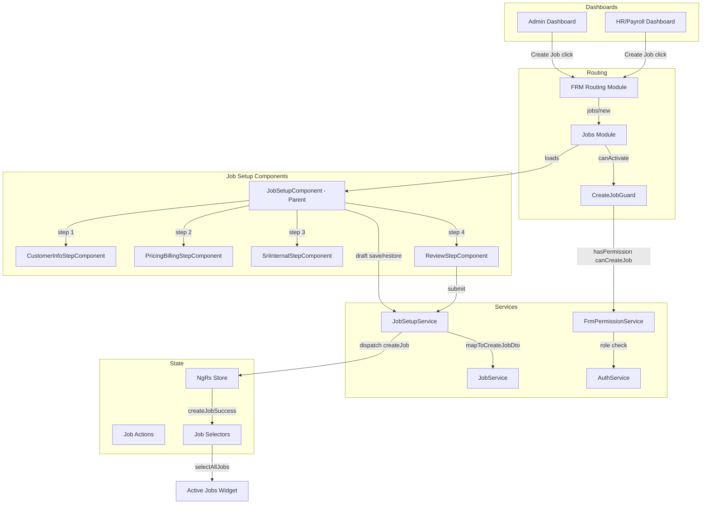

# Design Document: Job Setup Workflow

## Overview

This design adds a multi-step Job Setup Workflow to the FRM module, enabling Admin, Payroll, and HR users to create new jobs through a guided four-step form. The implementation extends the existing permission system with a `canCreateJob` flag, introduces a new `JobSetupComponent` with child step components, a `JobSetupService` for form orchestration and draft persistence, and a `CreateJobGuard` for route protection.

The design builds on existing infrastructure:
- `FrmPermissionService` for role-based permission checks
- `Job` model and `CreateJobDto` for job data structures
- `JobService` for backend API communication
- NgRx `createJob` / `createJobSuccess` actions for state management
- `EnhancedRoleGuard` pattern for configurable route protection
- `JobsModule` lazy-loaded routing at `jobs/` path
- `ActiveJobsWidget` for real-time job list updates via NgRx store

### Design Decisions

1. **Extend existing `JobsModule` routing** rather than creating a separate module. The `jobs/new` route already exists pointing to `JobFormComponent`; we replace it with `JobSetupComponent` and add a `canCreateJob` guard.
2. **Use Angular Reactive Forms** with a single `FormGroup` containing nested `FormGroup`s per step. This allows cross-step validation (e.g., OT rate >= standard rate) and simple serialization for draft persistence.
3. **Session storage for draft persistence** with debounced saves (2-second delay). This avoids backend complexity while protecting against accidental tab closure.
4. **Reuse existing NgRx actions** (`createJob`, `createJobSuccess`, `createJobFailure`) rather than introducing new action types. The `CreateJobDto` will be extended to include pricing/billing and SRI internal fields.

---

## Architecture



---

## Components and Interfaces

### 1. FrmPermissionService Extension

**Location:** `src/app/features/field-resource-management/services/frm-permission.service.ts`

Add `canCreateJob` to `FrmPermissionKey` and grant it to Admin, Payroll, and HR roles.

```typescript
export type FrmPermissionKey =
  | 'canCreateJob'   // NEW
  | 'canStartJob'
  | 'canEditJob'
  // ... existing keys
```

Permission grants:
| Role Group | `canCreateJob` |
|---|---|
| Admin | ✅ |
| Payroll_Group | ✅ |
| HR_Group | ✅ |
| Manager_Group | ❌ |
| Field_Group | ❌ |
| ReadOnly_Group | ❌ |

### 2. CreateJobGuard

**Location:** `src/app/features/field-resource-management/guards/create-job.guard.ts`

Follows the same pattern as `AdminGuard`. Injects `AuthService` and `FrmPermissionService`, checks `canCreateJob` permission, redirects to `/field-resource-management/dashboard` on denial.

```typescript
@Injectable({ providedIn: 'root' })
export class CreateJobGuard implements CanActivate {
  constructor(
    private authService: AuthService,
    private frmPermissionService: FrmPermissionService,
    private router: Router
  ) {}

  canActivate(): boolean {
    const user = this.authService.getUser();
    if (this.frmPermissionService.hasPermission(user?.role, 'canCreateJob')) {
      return true;
    }
    this.router.navigate(['/field-resource-management/dashboard']);
    return false;
  }
}
```

### 3. JobSetupComponent (Parent)

**Location:** `src/app/features/field-resource-management/components/jobs/job-setup/job-setup.component.ts`

Responsibilities:
- Owns the master `FormGroup` with four nested groups: `customerInfo`, `pricingBilling`, `sriInternal`
- Manages current step index (0–3)
- Renders step indicator, navigation buttons (Back/Next/Submit/Cancel)
- Delegates to `JobSetupService` for draft save/restore and submission
- Implements `CanDeactivate` guard for unsaved changes warning

```typescript
interface JobSetupStep {
  label: string;
  formGroupName: string;
  isValid: boolean;
}

@Component({
  selector: 'app-job-setup',
  templateUrl: './job-setup.component.html',
  styleUrls: ['./job-setup.component.scss']
})
export class JobSetupComponent implements OnInit, OnDestroy {
  form: FormGroup;
  currentStep = 0;
  steps: JobSetupStep[] = [
    { label: 'Customer Info', formGroupName: 'customerInfo', isValid: false },
    { label: 'Pricing & Billing', formGroupName: 'pricingBilling', isValid: false },
    { label: 'SRI Internal', formGroupName: 'sriInternal', isValid: false },
    { label: 'Review', formGroupName: '', isValid: true }
  ];
  submitting = false;
  submitError: string | null = null;
}
```

### 4. Step Components

Each step component receives its `FormGroup` via `@Input()` and renders the form fields.

**CustomerInfoStepComponent**
- `src/app/features/field-resource-management/components/jobs/job-setup/steps/customer-info-step.component.ts`
- Fields: clientName, siteName, siteAddress (street, city, state, zipCode), pocName, pocPhone, pocEmail, targetStartDate, authorizationStatus, hasPurchaseOrders, purchaseOrderNumber (conditional)

**PricingBillingStepComponent**
- `src/app/features/field-resource-management/components/jobs/job-setup/steps/pricing-billing-step.component.ts`
- Fields: standardBillRate, overtimeBillRate, perDiem, invoicingProcess
- Cross-field validation: overtimeBillRate >= standardBillRate

**SriInternalStepComponent**
- `src/app/features/field-resource-management/components/jobs/job-setup/steps/sri-internal-step.component.ts`
- Fields: projectDirector, targetResources, bizDevContact, requestedHours, overtimeRequired, estimatedOvertimeHours (conditional)

**ReviewStepComponent**
- `src/app/features/field-resource-management/components/jobs/job-setup/steps/review-step.component.ts`
- Receives the entire form value as `@Input()`, displays read-only summary
- Emits `editSection` event with step index when user clicks "Edit" links

### 5. JobSetupService

**Location:** `src/app/features/field-resource-management/services/job-setup.service.ts`

Responsibilities:
- Draft persistence: save/restore/clear from `sessionStorage` with key `frm_job_setup_draft`
- Maps form data to `CreateJobDto` (extended)
- Dispatches `createJob` NgRx action
- Listens for `createJobSuccess` / `createJobFailure` to resolve submission

```typescript
@Injectable({ providedIn: 'root' })
export class JobSetupService {
  private readonly DRAFT_KEY = 'frm_job_setup_draft';

  saveDraft(formValue: any, currentStep: number): void;
  restoreDraft(): { formValue: any; currentStep: number } | null;
  clearDraft(): void;
  mapToCreateJobDto(formValue: any): CreateJobDto;
  submitJob(formValue: any): Observable<Job>;
}
```

### 6. Route Registration

**In `JobsModule` routes** (`src/app/features/field-resource-management/components/jobs/jobs.module.ts`):

Replace the existing `jobs/new` route:

```typescript
{
  path: 'new',
  component: JobSetupComponent,  // was JobFormComponent
  canActivate: [CreateJobGuard],
  data: {
    title: 'New Job Setup',
    breadcrumb: 'New Job'
  }
}
```

### 7. Dashboard Quick Actions

Add a "Create Job" quick action to both admin and HR/payroll dashboards. The action navigates to `/field-resource-management/jobs/new`. Visibility is controlled by the existing `*appFrmHasPermission="'canCreateJob'"` directive.

---

## Data Models

### Extended CreateJobDto

The existing `CreateJobDto` will be extended with pricing/billing and SRI internal fields:

```typescript
export interface CreateJobDto {
  // Existing fields
  client: string;
  siteName: string;
  siteAddress: Address;
  jobType: JobType;
  priority: Priority;
  scopeDescription: string;
  requiredSkills: Skill[];
  requiredCrewSize: number;
  estimatedLaborHours: number;
  scheduledStartDate: Date;
  scheduledEndDate: Date;
  customerPOC?: ContactInfo;

  // New fields from Job Setup Workflow
  authorizationStatus: 'authorized' | 'pending';
  hasPurchaseOrders: boolean;
  purchaseOrderNumber?: string;
  standardBillRate: number;
  overtimeBillRate: number;
  perDiem: number;
  invoicingProcess: 'weekly' | 'bi-weekly' | 'monthly' | 'per-milestone' | 'upon-completion';
  projectDirector: string;
  targetResources: number;
  bizDevContact: string;
  requestedHours: number;
  overtimeRequired: boolean;
  estimatedOvertimeHours?: number;
}
```

### Job Setup Form Value Interface

```typescript
export interface JobSetupFormValue {
  customerInfo: {
    clientName: string;
    siteName: string;
    street: string;
    city: string;
    state: string;
    zipCode: string;
    pocName: string;
    pocPhone: string;
    pocEmail: string;
    targetStartDate: string;       // ISO date
    authorizationStatus: 'authorized' | 'pending';
    hasPurchaseOrders: boolean;
    purchaseOrderNumber: string;
  };
  pricingBilling: {
    standardBillRate: number;
    overtimeBillRate: number;
    perDiem: number;
    invoicingProcess: string;
  };
  sriInternal: {
    projectDirector: string;
    targetResources: number;
    bizDevContact: string;
    requestedHours: number;
    overtimeRequired: boolean;
    estimatedOvertimeHours: number | null;
  };
}
```

### Draft Storage Shape

```typescript
interface JobSetupDraft {
  formValue: JobSetupFormValue;
  currentStep: number;
  savedAt: string; // ISO timestamp
}
```

### Validation Rules Summary

| Field | Validators |
|---|---|
| clientName | required, maxLength(200) |
| siteName | required, maxLength(200) |
| street, city, state, zipCode | required |
| pocName | required |
| pocPhone | required, pattern (10-digit US) |
| pocEmail | required, email |
| targetStartDate | required, minDate(today) |
| authorizationStatus | required |
| hasPurchaseOrders | required |
| purchaseOrderNumber | required if hasPurchaseOrders=true |
| standardBillRate | required, min(0.01), pattern (2 decimal) |
| overtimeBillRate | required, min(0.01), >= standardBillRate |
| perDiem | required, min(0) |
| invoicingProcess | required |
| projectDirector | required, maxLength(150) |
| targetResources | required, min(1), max(500), integer |
| bizDevContact | required, maxLength(150) |
| requestedHours | required, min(0.01) |
| overtimeRequired | required |
| estimatedOvertimeHours | required if overtimeRequired=true, min(0.01) |


---

## Correctness Properties

*A property is a characteristic or behavior that should hold true across all valid executions of a system — essentially, a formal statement about what the system should do. Properties serve as the bridge between human-readable specifications and machine-verifiable correctness guarantees.*

### Property 1: Unauthorized role denial

*For any* user role that is not Admin, Payroll, or HR, the `CreateJobGuard` should deny access and return `false`, preventing navigation to the job setup route.

**Validates: Requirements 1.5**

### Property 2: Step validation blocks advancement

*For any* step in the job setup form and any form state where that step's `FormGroup` is invalid, attempting to advance to the next step should leave the current step index unchanged.

**Validates: Requirements 2.3**

### Property 3: Navigation preserves form data

*For any* valid form data entered across any steps, navigating backward (via "Back" button) or to a specific step (via "Edit" link on the Review step) and then returning should preserve all previously entered field values exactly.

**Validates: Requirements 2.5, 6.3**

### Property 4: Required text field validation

*For any* required text field in the form (clientName, siteName, street, city, state, zipCode, pocName, projectDirector, bizDevContact) and *for any* input string, the field should be valid if and only if the trimmed string is non-empty and its length does not exceed the field's maximum character limit (200 for client/site names, 150 for director/contact names).

**Validates: Requirements 3.1, 3.2, 3.3, 3.4, 5.1, 5.3**

### Property 5: Phone number format validation

*For any* string input to the phone number field, the field should be valid if and only if the input matches a 10-digit US phone number pattern (exactly 10 digits, optionally formatted).

**Validates: Requirements 3.5**

### Property 6: Email format validation

*For any* string input to the email field, the field should be valid if and only if the input matches a valid email address format (contains `@` with valid local and domain parts).

**Validates: Requirements 3.6**

### Property 7: Start date must not be in the past

*For any* date value selected for the target start date field, the field should be valid if and only if the date is today or in the future.

**Validates: Requirements 3.7**

### Property 8: Conditional field requirements

*For any* boolean trigger field (hasPurchaseOrders, overtimeRequired) and its dependent field (purchaseOrderNumber, estimatedOvertimeHours), when the trigger is `true` the dependent field should be required for the step to be valid, and when the trigger is `false` the dependent field should not affect step validity.

**Validates: Requirements 3.10, 5.6**

### Property 9: Numeric field range validation

*For any* numeric input field (standardBillRate, overtimeBillRate, perDiem, targetResources, requestedHours, estimatedOvertimeHours) and *for any* numeric value, the field should be valid if and only if the value falls within the field's specified range (e.g., standardBillRate > 0, perDiem >= 0, targetResources in [1, 500]).

**Validates: Requirements 4.1, 4.2, 4.4, 5.2, 5.4**

### Property 10: Overtime rate must be >= standard rate

*For any* pair of (standardBillRate, overtimeBillRate) values where both are positive numbers, the pricing/billing step should be valid only if overtimeBillRate >= standardBillRate.

**Validates: Requirements 4.3**

### Property 11: Form-to-DTO mapping correctness

*For any* valid complete `JobSetupFormValue`, the `mapToCreateJobDto` function should produce a `CreateJobDto` where: (a) all customer info fields map to the corresponding DTO fields, (b) all pricing/billing fields map correctly, (c) all SRI internal fields map correctly, (d) `status` is always `JobStatus.NotStarted`, and (e) `createdBy` is set to the authenticated user's identity.

**Validates: Requirements 6.4, 7.1, 7.2, 7.3, 7.4, 7.5**

### Property 12: Error state clears on valid input

*For any* form field that is currently in an invalid state (has validation errors), when the field value is changed to a valid value, the field's error state should immediately become `null` (no errors).

**Validates: Requirements 8.5**

### Property 13: Draft persistence round trip

*For any* `JobSetupFormValue` and current step index, saving the draft to session storage via `saveDraft()` and then restoring it via `restoreDraft()` should return a value equal to the original form value and step index.

**Validates: Requirements 10.1, 10.2**

---

## Error Handling

### Form Validation Errors
- Each step component marks all fields as touched on "Next" click to trigger inline error display
- Error messages are shown below each invalid field using Angular Material's `<mat-error>` within `<mat-form-field>`
- The "Next" button is disabled when the current step's `FormGroup` is invalid (Requirement 8.6)
- `maxlength` attribute on text inputs prevents exceeding character limits at the browser level (Requirement 8.3)

### Cross-Field Validation Errors
- The overtime bill rate vs. standard bill rate comparison is implemented as a custom validator on the `pricingBilling` `FormGroup`
- Error is displayed below the overtime bill rate field when the cross-field validator fails

### Submission Errors
- `JobSetupService.submitJob()` catches HTTP errors and returns them as observable errors
- The `ReviewStepComponent` displays the error message in a `<mat-error>` banner above the Submit button
- The Submit button remains enabled after an error for retry (Requirement 6.7)
- Network timeout errors display a generic "Unable to reach server. Please try again." message

### Guard / Permission Errors
- `CreateJobGuard` redirects to `/field-resource-management/dashboard` with a query param `error=insufficient_permissions`
- The dashboard can optionally display a snackbar notification based on this query param

### Draft Persistence Errors
- `sessionStorage` operations are wrapped in try/catch to handle quota exceeded or disabled storage
- If draft restore fails, the form starts fresh with no error shown to the user
- If draft save fails, a console warning is logged but the user is not interrupted

### Unsaved Changes Warning
- `CanDeactivate` guard on `JobSetupComponent` checks if the form is dirty and not submitted
- Displays a browser `confirm()` dialog: "You have unsaved changes. Are you sure you want to leave?"

---

## Testing Strategy

### Unit Tests

Unit tests cover specific examples, edge cases, and integration points:

- **CreateJobGuard**: Test that Admin, Payroll, HR roles are granted access; test that Technician, PM, VendorRep roles are denied
- **FrmPermissionService**: Test `canCreateJob` is `true` for Admin/Payroll/HR and `false` for all other roles
- **JobSetupComponent**: Test step navigation (forward, backward, edit links), step indicator rendering, button state (Back disabled on step 0, Submit on step 3)
- **CustomerInfoStepComponent**: Test conditional PO number field visibility
- **PricingBillingStepComponent**: Test billing summary display
- **SriInternalStepComponent**: Test conditional overtime hours field visibility
- **ReviewStepComponent**: Test read-only display of all sections, edit link emissions, loading state during submission, error display on failure, success navigation
- **JobSetupService**: Test `mapToCreateJobDto` with specific valid inputs, test draft save/restore/clear operations, test submission dispatches correct NgRx action
- **Route configuration**: Test that `jobs/new` route exists with `CreateJobGuard`

### Property-Based Tests

Property-based tests use a PBT library (e.g., `fast-check`) to verify universal properties across randomized inputs. Each test runs a minimum of 100 iterations.

Each property test references its design document property with a tag comment:
- **Feature: job-setup-workflow, Property 1: Unauthorized role denial**
- **Feature: job-setup-workflow, Property 2: Step validation blocks advancement**
- **Feature: job-setup-workflow, Property 3: Navigation preserves form data**
- **Feature: job-setup-workflow, Property 4: Required text field validation**
- **Feature: job-setup-workflow, Property 5: Phone number format validation**
- **Feature: job-setup-workflow, Property 6: Email format validation**
- **Feature: job-setup-workflow, Property 7: Start date must not be in the past**
- **Feature: job-setup-workflow, Property 8: Conditional field requirements**
- **Feature: job-setup-workflow, Property 9: Numeric field range validation**
- **Feature: job-setup-workflow, Property 10: Overtime rate must be >= standard rate**
- **Feature: job-setup-workflow, Property 11: Form-to-DTO mapping correctness**
- **Feature: job-setup-workflow, Property 12: Error state clears on valid input**
- **Feature: job-setup-workflow, Property 13: Draft persistence round trip**

**PBT Library:** `fast-check` (compatible with Jasmine/Karma test runner used in this Angular project)

**Configuration:** Each property test uses `fc.assert(fc.property(...), { numRuns: 100 })` minimum.

**Generator Strategy:**
- Text fields: `fc.string()` with `fc.oneof(fc.constant(''), fc.stringOf(fc.constant(' ')), fc.string())` for edge cases
- Numeric fields: `fc.double()`, `fc.integer()`, `fc.oneof(fc.constant(0), fc.constant(-1), fc.double({ min: 0.01, max: 10000 }))`
- Dates: `fc.date()` with past/future filtering
- Roles: `fc.constantFrom(...Object.values(UserRole))`
- Complete form values: composite generator combining all field generators
- Boolean triggers: `fc.boolean()` for conditional field testing

Each correctness property is implemented by a single property-based test. Unit tests complement PBT by covering specific examples, error conditions, and integration points that don't lend themselves to randomized input generation.
