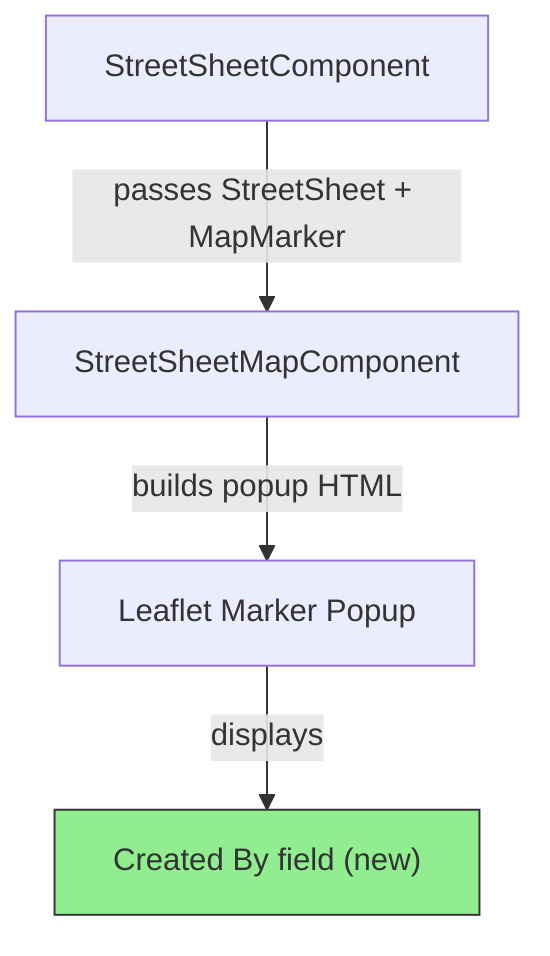
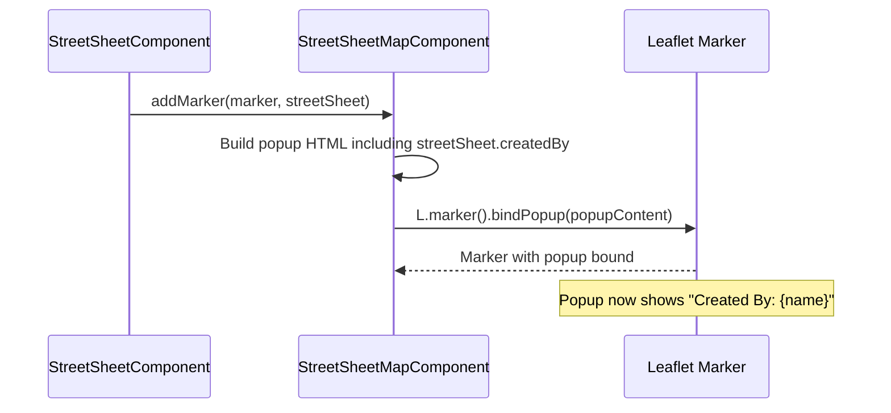

# Design Document: Map Marker Created By Display

## Overview

The street sheet map currently displays marker popups with vendor name, segment, address, city, state, deployment, PM, and date. The `StreetSheet` model already has a `createdBy` field that is populated when sheets are created, but this information is not shown in the map marker popup.

This feature adds the `createdBy` value from the `StreetSheet` model into the Leaflet marker popup content in `StreetSheetMapComponent.addMarker()`. Since the data is already available on the model and passed into the method, this is a display-only change requiring no backend or service modifications.

## Architecture



The change is isolated to the popup content string built inside `StreetSheetMapComponent.addMarker()`. No new components, services, or data flows are needed.

## Sequence Diagram



## Components and Interfaces

### Component: StreetSheetMapComponent

**Purpose**: Renders the Leaflet map and manages markers with popups.

**Affected Method**:
```typescript
public addMarker(marker: MapMarker, streetSheet: StreetSheet): void
```

**Responsibilities**:
- Build popup HTML string from `streetSheet` and `marker` data
- Include `streetSheet.createdBy` in the popup content
- Handle missing/undefined `createdBy` gracefully with a fallback

### Existing Data Model: StreetSheet

```typescript
class StreetSheet {
  // ... existing fields
  createdBy?: string;  // Already exists, already populated
  // ...
}
```

No changes needed to the model. The `createdBy` field is already optional (`string | undefined`) and is populated by the backend when street sheets are created.

## Data Models

No new data models are required. The existing `StreetSheet.createdBy` field provides the data.

**Validation Rules**:
- `createdBy` may be `undefined` or an empty string — display "N/A" in those cases
- `createdBy` is a plain string (user name or identifier) — no sanitization beyond what Leaflet already does for popup content

## Key Functions with Formal Specifications

### Function: addMarker (modified)

```typescript
public addMarker(marker: MapMarker, streetSheet: StreetSheet): void
```

**Preconditions:**
- `marker.latitude` and `marker.longitude` are truthy (non-zero, non-null)
- `streetSheet` is a valid `StreetSheet` instance
- `this.mapReady` is `true` (otherwise marker is queued)

**Postconditions:**
- A Leaflet marker is added to the map at `[marker.latitude, marker.longitude]`
- The marker's popup HTML contains a "Created By" line
- If `streetSheet.createdBy` is truthy, the line displays its value
- If `streetSheet.createdBy` is falsy, the line displays "N/A"
- All previously displayed popup fields remain unchanged

**Loop Invariants:** N/A

## Algorithmic Pseudocode

### Popup Content Construction (modified section)

```typescript
// Inside addMarker(), the popup content string gains one new line:

const createdByDisplay = streetSheet.createdBy || 'N/A';

const popupContent = `
  <div style="font-size:13px;line-height:1.6">
    <b>${streetSheet.vendorName || ''}</b><br>
    <b>Segment:</b> ${streetSheet.segmentId || ''}<br>
    <b>Address:</b> ${streetSheet.streetAddress || ''}<br>
    <b>City:</b> ${streetSheet.city || ''}<br>
    <b>State:</b> ${streetSheet.state || ''}<br>
    <b>Deployment:</b> ${streetSheet.deployment || ''}<br>
    <b>PM:</b> ${streetSheet.pm || 'N/A'}<br>
    <b>Created By:</b> ${createdByDisplay}<br>
    <b>Date:</b> ${date}<br>
  </div>`;
```

## Example Usage

When a user clicks a map marker, the popup now shows:

```
Acme Telecom
Segment: SEG-1234
Address: 123 Main St
City: Springfield
State: IL
Deployment: Fiber
PM: Jane Smith
Created By: John Doe
Date: Jan 15, 2025 2:30 PM
```

If `createdBy` is not set:

```
...
Created By: N/A
...
```

## Correctness Properties

*A property is a characteristic or behavior that should hold true across all valid executions of a system-essentially, a formal statement about what the system should do. Properties serve as the bridge between human-readable specifications and machine-verifiable correctness guarantees.*

### Property 1: Created By label always present

*For any* StreetSheet object passed to addMarker(), the resulting popup HTML shall contain a "Created By:" label, regardless of the value of the createdBy field.

**Validates: Requirement 1.1**

### Property 2: Non-empty createdBy value displayed verbatim

*For any* StreetSheet with a non-empty createdBy string, the popup HTML shall contain that exact string as the Created By value.

**Validates: Requirement 1.2**

### Property 3: Existing popup fields preserved in order

*For any* StreetSheet object, the popup HTML shall contain all previously existing field labels (vendor name, Segment, Address, City, State, Deployment, PM, Date) and those labels shall appear in their original relative order.

**Validates: Requirements 2.1, 2.2**

## Error Handling

### Scenario: createdBy is undefined/null/empty

**Condition**: `streetSheet.createdBy` is falsy
**Response**: Display "N/A" as the created-by value
**Recovery**: No recovery needed — this is expected behavior for older records

### Scenario: createdBy contains special characters

**Condition**: `streetSheet.createdBy` contains HTML-special characters
**Response**: Leaflet's popup binding handles basic content rendering. The existing pattern (template literals) is consistent with all other fields in the popup.
**Recovery**: N/A — follows existing pattern used by all other fields

## Testing Strategy

### Unit Testing Approach

- Test `addMarker()` with a `streetSheet` that has `createdBy` set — verify popup content includes the value
- Test `addMarker()` with a `streetSheet` where `createdBy` is `undefined` — verify popup shows "N/A"
- Test `addMarker()` with a `streetSheet` where `createdBy` is empty string — verify popup shows "N/A"
- Verify all existing popup fields are still present and unchanged

### Property-Based Testing Approach

**Property Test Library**: fast-check

- For any arbitrary string `createdBy`, the popup content always contains a "Created By:" label
- The popup content never omits the "Created By" line regardless of input

## Dependencies

No new dependencies. Uses existing:
- Leaflet (`L.marker`, `bindPopup`)
- `StreetSheet` model (`createdBy` field)
- `DatePipe` (unchanged)
