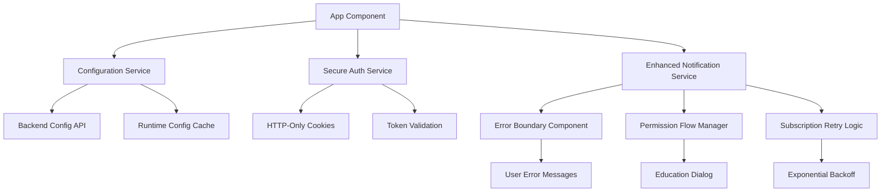

# Design Document: Notification Security Fixes

## Overview

This design addresses critical security vulnerabilities and reliability issues in the Angular notification system. The solution implements secure configuration management, proper token storage, comprehensive error handling, and robust push subscription management while maintaining backward compatibility with the existing notification infrastructure.

## Architecture

### Current State Analysis

The current implementation has several security and reliability issues:

1. **Security Vulnerabilities:**
   - API subscription keys hardcoded in 17+ service files
   - VAPID public key exposed in environment files
   - JWT tokens stored in sessionStorage (XSS vulnerable)

2. **Reliability Issues:**
   - No error boundaries for notification failures
   - Silent failures during push subscription sync
   - No retry logic for failed operations
   - Immediate permission requests without user education

3. **Code Quality Issues:**
   - Duplicate configuration across multiple services
   - No centralized configuration management
   - Inconsistent error handling patterns

### Target Architecture

The new architecture introduces several key components:



## Components and Interfaces

### 1. Configuration Service

**Purpose:** Centralized, secure configuration management that fetches sensitive data at runtime.

**Interface:**
```typescript
interface RuntimeConfiguration {
  vapidPublicKey: string;
  apiBaseUrl: string;
  pushSubscriptionEndpoint: string;
  retryConfiguration: RetryConfig;
  notificationSettings: NotificationConfig;
}

interface RetryConfig {
  maxAttempts: number;
  baseDelayMs: number;
  maxDelayMs: number;
  backoffMultiplier: number;
}

interface NotificationConfig {
  permissionEducationEnabled: boolean;
  maxNotificationHistory: number;
  defaultTimeouts: Record<string, number>;
}

@Injectable({ providedIn: 'root' })
export class ConfigurationService {
  private config$ = new BehaviorSubject<RuntimeConfiguration | null>(null);
  
  async initialize(): Promise<void>;
  getConfig(): Observable<RuntimeConfiguration>;
  isConfigured(): boolean;
  refreshConfiguration(): Promise<void>;
}
```

**Key Features:**
- Fetches configuration from `/api/config/runtime` endpoint
- Caches configuration in memory for session duration
- Validates configuration schema before use
- Provides fallback behavior for failed fetches
- Supports hot-reloading in development

### 2. Secure Authentication Service

**Purpose:** Enhanced authentication with secure token storage and proper session management.

**Interface:**
```typescript
interface SecureAuthConfig {
  useHttpOnlyCookies: boolean;
  tokenValidationInterval: number;
  sessionTimeoutWarning: number;
}

@Injectable({ providedIn: 'root' })
export class SecureAuthService extends AuthService {
  private authConfig: SecureAuthConfig;
  private tokenValidationTimer?: number;
  
  async login(credentials: LoginModel): Promise<AuthResult>;
  async logout(): Promise<void>;
  isAuthenticated(): Observable<boolean>;
  getAuthHeaders(): Observable<HttpHeaders>;
  validateTokenExpiration(): Promise<boolean>;
}
```

**Key Features:**
- Uses HTTP-only cookies when available
- Automatic token validation and refresh
- Secure session timeout handling
- Centralized authentication header management
- Graceful fallback for environments without cookie support

### 3. HTTP Configuration Interceptor

**Purpose:** Automatically adds authentication and subscription headers to all HTTP requests.

**Interface:**
```typescript
@Injectable()
export class ConfigurationInterceptor implements HttpInterceptor {
  intercept(req: HttpRequest<any>, next: HttpHandler): Observable<HttpEvent<any>>;
  private addAuthHeaders(req: HttpRequest<any>): HttpRequest<any>;
  private addSubscriptionHeaders(req: HttpRequest<any>): HttpRequest<any>;
}
```

**Key Features:**
- Automatically adds API subscription key to all requests
- Includes authentication headers when available
- Handles token refresh scenarios
- Provides consistent header management across all services

### 4. Enhanced Notification Service

**Purpose:** Robust notification management with comprehensive error handling and retry logic.

**Interface:**
```typescript
interface NotificationInitializationResult {
  success: boolean;
  error?: NotificationError;
  fallbackMode?: boolean;
}

interface NotificationError {
  type: 'PERMISSION_DENIED' | 'SERVICE_WORKER_FAILED' | 'CONFIG_MISSING' | 'NETWORK_ERROR';
  message: string;
  userMessage: string;
  retryable: boolean;
}

@Injectable({ providedIn: 'root' })
export class EnhancedNotificationService extends DeploymentPushNotificationService {
  async initializeWithErrorHandling(): Promise<NotificationInitializationResult>;
  async requestPermissionWithEducation(): Promise<NotificationPermission>;
  async subscribeWithRetry(): Promise<boolean>;
  showUserFriendlyError(error: NotificationError): void;
  enterFallbackMode(): void;
}
```

**Key Features:**
- Comprehensive error categorization and handling
- User-friendly error messages with actionable guidance
- Exponential backoff retry logic for failed operations
- Permission education flow before requesting access
- Fallback mode for degraded functionality

### 5. Permission Education Component

**Purpose:** Educates users about notification benefits before requesting permissions.

**Interface:**
```typescript
interface PermissionEducationConfig {
  showExamples: boolean;
  allowDismiss: boolean;
  trackDismissals: boolean;
  maxDismissals: number;
}

@Component({
  selector: 'app-permission-education',
  template: `...`
})
export class PermissionEducationComponent {
  @Input() config: PermissionEducationConfig;
  @Output() permissionRequested = new EventEmitter<boolean>();
  @Output() dismissed = new EventEmitter<void>();
  
  showExamples(): void;
  requestPermission(): void;
  dismiss(): void;
}
```

**Key Features:**
- Shows notification examples and benefits
- Tracks dismissal history to prevent spam
- Configurable display options
- Accessible design with proper ARIA labels

### 6. Notification Error Boundary

**Purpose:** Catches and handles notification-related errors gracefully.

**Interface:**
```typescript
@Component({
  selector: 'app-notification-error-boundary',
  template: `...`
})
export class NotificationErrorBoundaryComponent implements OnInit, OnDestroy {
  @Input() fallbackTemplate: TemplateRef<any>;
  
  private errorState$ = new BehaviorSubject<NotificationError | null>(null);
  
  handleNotificationError(error: NotificationError): void;
  retry(): void;
  enterFallbackMode(): void;
  clearError(): void;
}
```

**Key Features:**
- Catches all notification-related errors
- Provides retry mechanisms for recoverable errors
- Shows user-friendly error messages
- Supports custom fallback templates

## Data Models

### Configuration Models

```typescript
interface RuntimeConfiguration {
  vapidPublicKey: string;
  apiBaseUrl: string;
  pushSubscriptionEndpoint: string;
  retryConfiguration: RetryConfig;
  notificationSettings: NotificationConfig;
  version: string;
  lastUpdated: string;
}

interface RetryConfig {
  maxAttempts: number;
  baseDelayMs: number;
  maxDelayMs: number;
  backoffMultiplier: number;
}

interface NotificationConfig {
  permissionEducationEnabled: boolean;
  maxNotificationHistory: number;
  defaultTimeouts: Record<NotificationType, number>;
  supportedBrowsers: string[];
}
```

### Error Models

```typescript
enum NotificationErrorType {
  PERMISSION_DENIED = 'PERMISSION_DENIED',
  SERVICE_WORKER_FAILED = 'SERVICE_WORKER_FAILED',
  CONFIG_MISSING = 'CONFIG_MISSING',
  NETWORK_ERROR = 'NETWORK_ERROR',
  SUBSCRIPTION_FAILED = 'SUBSCRIPTION_FAILED',
  VALIDATION_ERROR = 'VALIDATION_ERROR'
}

interface NotificationError {
  type: NotificationErrorType;
  message: string;
  userMessage: string;
  retryable: boolean;
  timestamp: Date;
  context?: Record<string, any>;
}
```

### Authentication Models

```typescript
interface AuthResult {
  success: boolean;
  user?: User;
  token?: string;
  expiresAt?: Date;
  error?: string;
}

interface SecureAuthState {
  isAuthenticated: boolean;
  user: User | null;
  tokenExpiresAt: Date | null;
  lastValidated: Date | null;
}
```

## Correctness Properties

*A property is a characteristic or behavior that should hold true across all valid executions of a system-essentially, a formal statement about what the system should do. Properties serve as the bridge between human-readable specifications and machine-verifiable correctness guarantees.*

### Property Reflection

After analyzing all acceptance criteria, I identified several areas where properties can be consolidated:

- Configuration fetching properties (1.1, 1.2) can be combined into a comprehensive configuration retrieval property
- Bundle security properties (1.3, 1.4) are examples that verify build-time security
- Authentication storage properties (2.1, 2.2) can be combined into a secure storage property
- Error handling properties (3.1-3.6) share common patterns around user feedback and recovery
- Retry logic properties (4.1-4.6) can be consolidated around subscription reliability
- Permission flow properties (5.1-5.6) follow a common pattern of user education and consent

### Configuration Security Properties

**Property 1: Secure Configuration Retrieval**
*For any* application startup, the Configuration Service should fetch all required configuration from secure backend endpoints and cache the results in memory without exposing sensitive data in the frontend bundle
**Validates: Requirements 1.1, 1.2, 1.6**

**Property 2: Configuration Error Handling**
*For any* configuration fetch failure, the service should provide fallback behavior, log appropriate errors, and continue operating in a degraded mode
**Validates: Requirements 1.5**

**Property 3: Configuration Validation**
*For any* fetched configuration, the service should validate all required fields, check data formats, and provide meaningful error messages for validation failures
**Validates: Requirements 6.1, 6.2, 6.4, 6.5**

### Authentication Security Properties

**Property 4: Secure Token Storage**
*For any* authentication operation, the service should use the most secure available storage method (preferring httpOnly cookies) and never store tokens in browser storage
**Validates: Requirements 2.1, 2.2, 2.4**

**Property 5: Authentication Header Management**
*For any* API request, the HTTP client should automatically include proper authentication headers and handle token validation
**Validates: Requirements 2.3, 2.6**

**Property 6: Authentication Cleanup**
*For any* logout operation, the service should clear all authentication data and reset the authentication state
**Validates: Requirements 2.5**

### Error Handling Properties

**Property 7: Notification Error Recovery**
*For any* notification initialization failure, the service should display user-friendly error messages, provide specific guidance, and offer retry mechanisms
**Validates: Requirements 3.1, 3.2, 3.3, 3.6**

**Property 8: Error Boundary Protection**
*For any* notification-related error, the error boundary should catch the error, prevent application crashes, and provide fallback functionality
**Validates: Requirements 3.4, 3.5**

### Subscription Reliability Properties

**Property 9: Subscription Retry Logic**
*For any* failed push subscription operation, the service should retry with exponential backoff, validate subscription status, and handle network failures gracefully
**Validates: Requirements 4.1, 4.2, 4.4**

**Property 10: Subscription Recovery**
*For any* subscription validation failure, the service should attempt to create a new subscription and verify success by testing the backend connection
**Validates: Requirements 4.3, 4.6**

**Property 11: Subscription Fallback**
*For any* repeated subscription failures, the service should disable push notifications, notify the user, and provide alternative functionality
**Validates: Requirements 4.5**

### Permission Management Properties

**Property 12: Permission Education Flow**
*For any* permission request, the service should show educational content before requesting, track request history, and respect previous denials
**Validates: Requirements 5.1, 5.5, 5.6**

**Property 13: Permission Denial Handling**
*For any* permission denial, the service should provide instructions for re-enabling notifications and avoid repeated requests
**Validates: Requirements 5.4**

### Configuration Reliability Properties

**Property 14: Configuration Endpoint Failover**
*For any* unreachable API endpoint, the service should retry with alternative endpoints if available and maintain service availability
**Validates: Requirements 6.3**

**Property 15: Development Configuration Hot-Reload**
*For any* development environment, the service should support configuration hot-reloading without requiring application restart
**Validates: Requirements 6.6**

<function_calls>
<invoke name="prework">
<parameter name="featureName">notification-security-fixes

## Error Handling

### Error Categories

The system categorizes errors into several types for appropriate handling:

1. **Configuration Errors**
   - Missing or invalid VAPID keys
   - Unreachable configuration endpoints
   - Schema validation failures
   - Network connectivity issues

2. **Authentication Errors**
   - Token expiration or invalidity
   - Cookie storage unavailability
   - Session timeout
   - Authorization failures

3. **Notification Errors**
   - Browser permission denial
   - Service worker registration failure
   - Push subscription sync failures
   - Network errors during notification operations

4. **User Experience Errors**
   - Repeated permission requests
   - Silent failures without user feedback
   - Lack of fallback functionality
   - Poor error messaging

### Error Handling Strategies

**Graceful Degradation:**
- Configuration failures → Use cached config or disable features
- Authentication failures → Redirect to login or use guest mode
- Notification failures → Fall back to in-app notifications only
- Permission denial → Provide clear re-enablement instructions

**User Communication:**
- Show specific, actionable error messages
- Provide retry mechanisms for recoverable errors
- Offer alternative workflows when primary features fail
- Maintain application functionality despite component failures

**Logging and Monitoring:**
- Log all errors with appropriate context
- Track error patterns for system improvement
- Monitor configuration fetch success rates
- Alert on critical authentication failures

### Recovery Mechanisms

**Automatic Recovery:**
- Exponential backoff for network failures
- Token refresh for expired authentication
- Service worker re-registration on failure
- Configuration re-fetch on validation errors

**User-Initiated Recovery:**
- Manual retry buttons for failed operations
- Settings to re-enable disabled features
- Clear instructions for permission re-granting
- Support contact information for persistent issues

## Testing Strategy

### Dual Testing Approach

The testing strategy employs both unit tests and property-based tests to ensure comprehensive coverage:

**Unit Tests:**
- Test specific error scenarios and edge cases
- Verify component integration points
- Test user interface interactions
- Validate error message content and formatting

**Property-Based Tests:**
- Verify universal properties across all inputs
- Test configuration validation with random data
- Validate retry logic with various failure patterns
- Test authentication flows with different token states

### Property-Based Testing Configuration

**Testing Framework:** We will use `fast-check` for TypeScript property-based testing, integrated with Jasmine/Karma.

**Test Configuration:**
- Minimum 100 iterations per property test
- Each property test references its design document property
- Tag format: **Feature: notification-security-fixes, Property {number}: {property_text}**

**Key Testing Areas:**

1. **Configuration Properties:**
   - Generate random configuration objects and test validation
   - Test network failure scenarios with various error types
   - Verify caching behavior with different timing patterns

2. **Authentication Properties:**
   - Test token storage with various browser environments
   - Generate random token expiration times and test validation
   - Test authentication header inclusion across different request types

3. **Error Handling Properties:**
   - Generate various error conditions and test recovery mechanisms
   - Test user message generation with different error types
   - Verify error boundary behavior with random error scenarios

4. **Subscription Properties:**
   - Test retry logic with random failure patterns
   - Generate various subscription states and test validation
   - Test exponential backoff timing with different failure counts

### Integration Testing

**End-to-End Scenarios:**
- Complete application startup with configuration fetching
- User login flow with secure token storage
- Notification permission request and handling
- Push subscription creation and synchronization
- Error recovery and fallback mode activation

**Browser Compatibility Testing:**
- Test across different browsers and versions
- Verify cookie support and fallback mechanisms
- Test service worker functionality
- Validate notification API support

### Security Testing

**Vulnerability Testing:**
- Verify no sensitive data in built bundles
- Test XSS protection with token storage
- Validate HTTPS requirement enforcement
- Test configuration endpoint security

**Penetration Testing:**
- Attempt to extract API keys from frontend
- Test authentication bypass scenarios
- Verify secure cookie configuration
- Test for information disclosure vulnerabilities