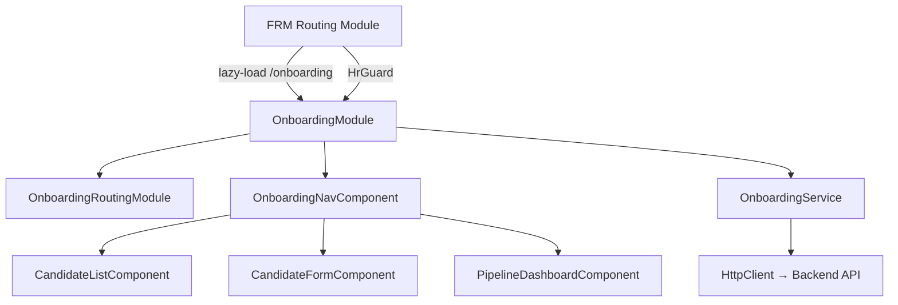
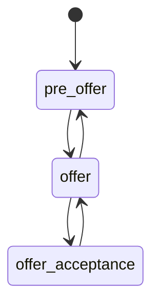

# Design Document: Onboarding/Recruiting Module

## Overview

This design describes the Onboarding/Recruiting module for the FRM Angular application. The module provides HR, Payroll, and Admin users with the ability to create, edit, and track technician candidates through a defined onboarding lifecycle: Pre Offer → Offer → Offer Acceptance, along with certification tracking, drug test status, and work-site assignment.

The module follows the established FRM patterns: lazy-loaded NgModule, root-provided service with typed error mapping, role-based route guards, and reactive forms with `UnsavedChangesGuard` protection. It mirrors the payroll module structure as the closest architectural reference.

## Architecture

### Module Structure

The onboarding module is a lazy-loaded Angular feature module nested under the FRM layout, consistent with existing modules (payroll, approvals, inventory, etc.).



### Route Guard Flow

```mermaid
flowchart LR
    User -->|navigates to /onboarding| HrGuard
    HrGuard -->|HR / Payroll / Admin| OnboardingModule
    HrGuard -->|other roles| Redirect[/field-resource-management/dashboard]
```

### Key Design Decisions

1. **Reuse HrGuard** — The existing `HrGuard` already gates access to HR, Payroll, and Admin roles. No new guard is needed.
2. **Single form component for create/edit** — `CandidateFormComponent` operates in both create and edit mode based on the presence of a `candidateId` route parameter, reducing duplication.
3. **Client-side offer status transition validation** — The state machine is enforced in a pure utility function (`getValidTransitions`) so it can be unit-tested independently of Angular.
4. **Root-provided service** — `OnboardingService` is `providedIn: 'root'` following the payroll service pattern, ensuring a single instance across all onboarding components.

## Components and Interfaces

### OnboardingModule

- **Path**: `src/app/features/field-resource-management/components/onboarding/onboarding.module.ts`
- **Type**: NgModule (lazy-loaded)
- **Imports**: `CommonModule`, `ReactiveFormsModule`, `OnboardingRoutingModule`, shared UI modules
- **Declarations**: `OnboardingNavComponent`, `CandidateListComponent`, `CandidateFormComponent`, `PipelineDashboardComponent`

### OnboardingRoutingModule

- **Path**: `src/app/features/field-resource-management/components/onboarding/onboarding-routing.module.ts`
- **Routes**:

| Path | Component | Guards | Notes |
|------|-----------|--------|-------|
| `` | `OnboardingNavComponent` | — | Layout wrapper with sub-nav |
| `` (redirect) | → `candidates` | — | Default child redirect |
| `candidates` | `CandidateListComponent` | — | List view |
| `candidates/new` | `CandidateFormComponent` | `UnsavedChangesGuard` | Create mode |
| `candidates/:candidateId` | `CandidateFormComponent` | `UnsavedChangesGuard` | Edit mode |
| `pipeline` | `PipelineDashboardComponent` | — | Dashboard view |

### OnboardingNavComponent

- **Path**: `src/app/features/field-resource-management/components/onboarding/onboarding-nav/onboarding-nav.component.ts`
- **Responsibility**: Renders sub-navigation links (Candidate List, Pipeline Dashboard, Add Candidate) and hosts `<router-outlet>` for child routes.
- **Satisfies**: Requirement 1.4

### CandidateListComponent

- **Path**: `src/app/features/field-resource-management/components/onboarding/candidate-list/candidate-list.component.ts`
- **Responsibility**: Displays a sortable, filterable table of all candidates.
- **Inputs**: None (fetches data via `OnboardingService`)
- **Behavior**:
  - Calls `OnboardingService.getCandidates()` on init
  - Supports column sorting (click header toggles asc/desc)
  - Text search filters on `techName`, `techEmail`, `workSite` (case-insensitive)
  - Offer status dropdown filter
  - Boolean fields rendered as checkmark (✓) / dash (—) indicators
  - Row click navigates to edit form (`candidates/:candidateId`)
  - Empty state message when no candidates match filters
  - Error banner on API failure
- **Satisfies**: Requirements 5.1–5.7

### CandidateFormComponent

- **Path**: `src/app/features/field-resource-management/components/onboarding/candidate-form/candidate-form.component.ts`
- **Responsibility**: Reactive form for creating and editing candidate records.
- **Mode detection**: If `ActivatedRoute.params` contains `candidateId`, the component enters edit mode and pre-populates the form via `OnboardingService.getCandidateById()`. Otherwise, it enters create mode.
- **Form controls**:
  - `techName` — required, text
  - `techEmail` — required, email validator
  - `techPhone` — required, pattern validator (min 10 digits, allows `+`, `-`, `()`, spaces)
  - `vestSize` — required, select dropdown (`XS`, `S`, `M`, `L`, `XL`, `2XL`, `3XL`)
  - `workSite` — required, text
  - `startDate` — required, date picker (ISO format)
  - `offerStatus` — required, select dropdown (filtered by valid transitions in edit mode)
  - `drugTestComplete` — checkbox (edit mode only, defaults `false` on create)
  - `oshaCertified` — checkbox (edit mode only, defaults `false` on create)
  - `scissorLiftCertified` — checkbox (edit mode only, defaults `false` on create)
  - `biisciCertified` — checkbox (edit mode only, defaults `false` on create)
- **Validation**: Field-level inline errors displayed on blur and on submit attempt
- **Submit behavior**:
  - Disables submit button and shows loading spinner while request is in flight
  - On success: shows success toast, navigates to candidate list (create) or stays on form (edit)
  - On API error: shows dismissible error banner, preserves form data
- **Implements**: `CanDeactivate` interface for unsaved changes dialog
- **Satisfies**: Requirements 3.1–3.7, 4.1–4.6, 7.1–7.4, 10.1–10.5

### PipelineDashboardComponent

- **Path**: `src/app/features/field-resource-management/components/onboarding/pipeline-dashboard/pipeline-dashboard.component.ts`
- **Responsibility**: Displays summary cards with candidate counts by offer status, certification gaps, drug test gaps, and upcoming start dates.
- **Cards**:
  - Pre Offer count — clickable, navigates to list filtered by `pre_offer`
  - Offer count — clickable, navigates to list filtered by `offer`
  - Offer Acceptance count — clickable, navigates to list filtered by `offer_acceptance`
  - Incomplete Certifications count — clickable, navigates to list filtered by incomplete certs
  - Incomplete Drug Test count
  - Starting Within 14 Days count
- **Satisfies**: Requirements 6.1–6.6

### OnboardingService

- **Path**: `src/app/features/field-resource-management/services/onboarding.service.ts`
- **Provided in**: `root`
- **Base URL**: `${environment.apiUrl}/onboarding`
- **Methods**:

| Method | Signature | HTTP | Description |
|--------|-----------|------|-------------|
| `getCandidates` | `(filters?: CandidateFilters) => Observable<Candidate[]>` | `GET /onboarding/candidates` | List with optional query params |
| `getCandidateById` | `(id: string) => Observable<Candidate>` | `GET /onboarding/candidates/:id` | Single candidate |
| `createCandidate` | `(payload: CreateCandidatePayload) => Observable<Candidate>` | `POST /onboarding/candidates` | Create with audit metadata |
| `updateCandidate` | `(id: string, payload: UpdateCandidatePayload) => Observable<Candidate>` | `PUT /onboarding/candidates/:id` | Update with audit metadata |
| `deleteCandidateById` | `(id: string) => Observable<void>` | `DELETE /onboarding/candidates/:id` | Delete candidate |

- **Error handling**: All methods pipe through `catchError(this.mapError(operationName))` producing typed `OnboardingServiceError` objects, following the payroll service pattern.
- **Audit**: `createCandidate` and `updateCandidate` attach `AuditMetadata` (userId, userName, userRole, timestamp) from `AuthService`.
- **Satisfies**: Requirements 8.1–8.5


## Data Models

All models are defined in `src/app/features/field-resource-management/models/onboarding.models.ts`, following the pattern established by `payroll.models.ts`.

### Type Aliases

```typescript
export type OfferStatus = 'pre_offer' | 'offer' | 'offer_acceptance';

export type VestSize = 'XS' | 'S' | 'M' | 'L' | 'XL' | '2XL' | '3XL';
```

### Candidate Interface

```typescript
export interface Candidate {
  candidateId: string;
  techName: string;
  techEmail: string;
  techPhone: string;
  vestSize: VestSize;
  drugTestComplete: boolean;
  oshaCertified: boolean;
  scissorLiftCertified: boolean;
  biisciCertified: boolean;
  workSite: string;
  startDate: string;          // ISO date
  offerStatus: OfferStatus;
  createdBy: string;
  createdAt: string;          // ISO datetime
  updatedBy: string;
  updatedAt: string;          // ISO datetime
}
```

### CreateCandidatePayload

```typescript
export interface CreateCandidatePayload {
  techName: string;
  techEmail: string;
  techPhone: string;
  vestSize: VestSize;
  workSite: string;
  startDate: string;
  offerStatus: OfferStatus;
}
```

### UpdateCandidatePayload

```typescript
export interface UpdateCandidatePayload {
  techName?: string;
  techEmail?: string;
  techPhone?: string;
  vestSize?: VestSize;
  drugTestComplete?: boolean;
  oshaCertified?: boolean;
  scissorLiftCertified?: boolean;
  biisciCertified?: boolean;
  workSite?: string;
  startDate?: string;
  offerStatus?: OfferStatus;
}
```

### CandidateFilters

```typescript
export interface CandidateFilters {
  offerStatus?: OfferStatus;
  search?: string;
  incompleteCerts?: boolean;
}
```

### OnboardingServiceError

```typescript
export interface OnboardingServiceError {
  statusCode: number;
  message: string;
  operation: string;
}
```

### Offer Status Transition Map

A pure utility function enforces the state machine:

```typescript
// src/app/features/field-resource-management/utils/offer-status.util.ts

const OFFER_TRANSITIONS: Record<OfferStatus, OfferStatus[]> = {
  pre_offer: ['offer'],
  offer: ['pre_offer', 'offer_acceptance'],
  offer_acceptance: ['offer'],
};

export function getValidTransitions(current: OfferStatus): OfferStatus[] {
  return OFFER_TRANSITIONS[current] ?? [];
}

export function isValidTransition(from: OfferStatus, to: OfferStatus): boolean {
  return getValidTransitions(from).includes(to);
}
```

### Offer Status State Machine Diagram



### Permission Key Extension

The `FrmPermissionKey` type union in `frm-permission.service.ts` will be extended with:

```typescript
| 'canManageOnboarding'
```

The permission is granted to `HR_GROUP_PERMISSIONS`, `PAYROLL_GROUP_PERMISSIONS`, and `ADMIN_PERMISSIONS` sets.


## Correctness Properties

*A property is a characteristic or behavior that should hold true across all valid executions of a system — essentially, a formal statement about what the system should do. Properties serve as the bridge between human-readable specifications and machine-verifiable correctness guarantees.*

### Property 1: Non-allowed roles are denied onboarding permission

*For any* user role that is not in the set {HR, Payroll, Admin}, the `FrmPermissionService.hasPermission(role, 'canManageOnboarding')` call should return `false`.

**Validates: Requirements 1.2, 9.5**

### Property 2: Allowed roles are granted onboarding permission

*For any* user role in the set {HR, Payroll, Admin}, the `FrmPermissionService.hasPermission(role, 'canManageOnboarding')` call should return `true`.

**Validates: Requirements 9.2, 9.3, 9.4**

### Property 3: Vest size validation accepts only valid values

*For any* string, the vest size validator should accept it if and only if it is one of `XS`, `S`, `M`, `L`, `XL`, `2XL`, `3XL`.

**Validates: Requirements 2.4**

### Property 4: Required field validation rejects incomplete forms

*For any* candidate form state (create or edit mode) where at least one required field (`techName`, `techEmail`, `techPhone`, `vestSize`, `workSite`, `startDate`, `offerStatus`) is empty or missing, the form should be invalid and submission should be prevented.

**Validates: Requirements 3.1, 3.5, 4.4**

### Property 5: Email validation rejects invalid formats

*For any* string that does not conform to a valid email format, setting it as the `techEmail` value should cause the email form control to be invalid.

**Validates: Requirements 3.3**

### Property 6: Phone validation rejects strings with fewer than 10 digits

*For any* string containing fewer than 10 digit characters (regardless of formatting characters like spaces, hyphens, parentheses, or `+`), setting it as the `techPhone` value should cause the phone form control to be invalid.

**Validates: Requirements 3.4**

### Property 7: New candidates default all certifications and drug test to false

*For any* valid `CreateCandidatePayload`, when a candidate is created, the resulting `Candidate` object should have `drugTestComplete`, `oshaCertified`, `scissorLiftCertified`, and `biisciCertified` all set to `false`.

**Validates: Requirements 3.2**

### Property 8: Edit form pre-populates with candidate data

*For any* `Candidate` object, when the edit form is loaded with that candidate's data, every form control value should match the corresponding field on the candidate object.

**Validates: Requirements 4.1**

### Property 9: Update payloads include audit metadata

*For any* candidate update operation, the payload sent to the backend should include `userId`, `userName`, `userRole`, and `timestamp` fields from the authenticated user.

**Validates: Requirements 4.2**

### Property 10: Text search filters candidates correctly

*For any* list of candidates and any non-empty search string, the filtered result should contain only candidates where `techName`, `techEmail`, or `workSite` contains the search string (case-insensitive), and every candidate matching that criterion should be included.

**Validates: Requirements 5.4**

### Property 11: Offer status filter returns only matching candidates

*For any* list of candidates and any `OfferStatus` filter value, the filtered result should contain only candidates whose `offerStatus` equals the filter value, and every candidate with that status should be included.

**Validates: Requirements 5.5**

### Property 12: Column sorting produces correctly ordered results

*For any* list of candidates and any sortable column, sorting in ascending order should produce a list where each element is less than or equal to the next element (by that column's value), and sorting in descending order should produce the reverse.

**Validates: Requirements 5.3**

### Property 13: Pipeline dashboard counts are correct

*For any* list of candidates, the pipeline dashboard should display: (a) for each `OfferStatus` value, a count equal to the number of candidates with that status; (b) an incomplete certifications count equal to the number of candidates where at least one of `oshaCertified`, `scissorLiftCertified`, `biisciCertified` is `false`; (c) an incomplete drug test count equal to the number of candidates where `drugTestComplete` is `false`.

**Validates: Requirements 6.1, 6.2, 6.3**

### Property 14: Upcoming start date count is correct

*For any* list of candidates and any reference date, the "starting within 14 days" count should equal the number of candidates whose `startDate` falls between the reference date (inclusive) and reference date + 14 calendar days (inclusive).

**Validates: Requirements 6.6**

### Property 15: Valid offer status transitions are accepted

*For any* `OfferStatus` value and any target status in its valid transition set (`pre_offer→offer`, `offer→pre_offer|offer_acceptance`, `offer_acceptance→offer`), `isValidTransition(from, to)` should return `true`.

**Validates: Requirements 7.1, 7.2, 7.3**

### Property 16: Invalid offer status transitions are rejected

*For any* `OfferStatus` value and any target status NOT in its valid transition set, `isValidTransition(from, to)` should return `false`.

**Validates: Requirements 7.4**

### Property 17: Service error mapping produces typed errors

*For any* HTTP error response received by any `OnboardingService` method, the error should be mapped to an `OnboardingServiceError` object containing a numeric `statusCode`, a string `message`, and a string `operation` identifying the method that failed.

**Validates: Requirements 8.2**

### Property 18: Service passes filter parameters as query params

*For any* `CandidateFilters` object with at least one defined property, calling `OnboardingService.getCandidates(filters)` should result in an HTTP GET request where each defined filter property appears as a query parameter.

**Validates: Requirements 8.5**

### Property 19: Form data is preserved on submission failure

*For any* form state (with all fields populated) where submission fails (either validation error or API error), all form control values should remain unchanged after the failure.

**Validates: Requirements 10.1, 10.2**

### Property 20: Unsaved changes guard triggers on dirty form

*For any* form state where at least one control has been modified from its initial value (the form is dirty), attempting to navigate away should trigger the unsaved changes confirmation dialog.

**Validates: Requirements 10.5**

## Error Handling

### Service Layer Errors

All `OnboardingService` methods follow the payroll service error pattern:

1. **HTTP errors** are caught via `catchError` in the RxJS pipe
2. Errors are mapped to `OnboardingServiceError` with:
   - `statusCode`: HTTP status code (or `0` for network errors)
   - `message`: Backend error message or fallback "An unexpected error occurred."
   - `operation`: Name of the service method that failed (e.g., `'getCandidates'`, `'createCandidate'`)
3. The mapped error is re-thrown via `throwError(() => error)` so components can handle it

### Component Layer Error Handling

| Scenario | Behavior |
|----------|----------|
| API error loading candidate list | Error banner displayed above table, retry button offered |
| API error loading single candidate (edit) | Error banner on form, back-to-list link offered |
| API error on create/update | Dismissible error banner at top of form, form data preserved |
| Validation error on submit | Inline field-level errors shown, submit button remains enabled |
| Network timeout | Treated as HTTP error with `statusCode: 0` |

### Form Validation Error Display

- Errors appear adjacent to the invalid field
- Errors are shown on blur (first touch) and on submit attempt
- Error messages are human-readable (e.g., "Valid email address is required", "Phone number must contain at least 10 digits")
- The submit button is not disabled due to validation errors — it triggers validation display on click

### Loading States

- Submit button is disabled and shows a spinner while the HTTP request is in flight
- The candidate list shows a loading skeleton while `getCandidates` is pending
- The pipeline dashboard shows placeholder cards while data loads

## Testing Strategy

### Unit Tests

Unit tests cover specific examples, edge cases, and component integration points:

- **OnboardingNavComponent**: Renders correct nav links
- **CandidateListComponent**: Renders table columns, displays empty state, shows error banner
- **CandidateFormComponent**: Create mode initializes empty form, edit mode pre-populates, success navigation, error banner display, loading state on submit
- **PipelineDashboardComponent**: Renders summary cards, click navigation to filtered list
- **OnboardingService**: Each method calls correct HTTP endpoint, error mapping produces typed errors
- **FrmPermissionService**: `canManageOnboarding` returns correct value for each role
- **Offer status utility**: Specific transition examples (e.g., `pre_offer → offer` is valid, `pre_offer → offer_acceptance` is invalid)

### Property-Based Tests

Property-based tests use **fast-check** (the standard PBT library for TypeScript/JavaScript) to verify universal properties across randomized inputs. Each property test runs a minimum of 100 iterations.

Each test is tagged with a comment referencing the design property:

```typescript
// Feature: onboarding-recruiting, Property 15: Valid offer status transitions are accepted
```

Property tests to implement:

| Property | What is generated | What is asserted |
|----------|-------------------|------------------|
| Property 1: Non-allowed roles denied | Random role from non-allowed set | `hasPermission` returns `false` |
| Property 2: Allowed roles granted | Random role from {HR, Payroll, Admin} | `hasPermission` returns `true` |
| Property 3: Vest size validation | Random strings | Accepted iff in valid set |
| Property 4: Required field validation | Form states with random empty fields | Form is invalid |
| Property 5: Email validation | Random non-email strings | Control is invalid |
| Property 6: Phone validation | Strings with <10 digits | Control is invalid |
| Property 7: Default certifications | Random valid create payloads | All booleans are `false` |
| Property 8: Edit form population | Random candidate objects | Form values match candidate |
| Property 10: Text search filtering | Random candidate lists + search strings | Filtered results correct |
| Property 11: Offer status filtering | Random candidate lists + status filter | Only matching candidates |
| Property 12: Column sorting | Random candidate lists + column | Correct sort order |
| Property 13: Pipeline counts | Random candidate lists | Counts match manual computation |
| Property 14: Upcoming start dates | Random candidate lists + reference date | Count matches manual computation |
| Property 15: Valid transitions | All (from, to) pairs in valid set | `isValidTransition` returns `true` |
| Property 16: Invalid transitions | All (from, to) pairs NOT in valid set | `isValidTransition` returns `false` |
| Property 17: Error mapping | Random HTTP error objects | Produces typed `OnboardingServiceError` |
| Property 18: Filter query params | Random `CandidateFilters` | HTTP request includes query params |
| Property 19: Form preservation on failure | Random form states + simulated failure | Values unchanged |
| Property 20: Unsaved changes guard | Random dirty form states | Dialog triggered |

### Test Configuration

- **Library**: `fast-check` (npm package)
- **Minimum iterations**: 100 per property test
- **Test runner**: Jasmine (Angular default) or Jest if configured
- **Tag format**: `// Feature: onboarding-recruiting, Property {N}: {title}`
- Each correctness property is implemented by a single property-based test

