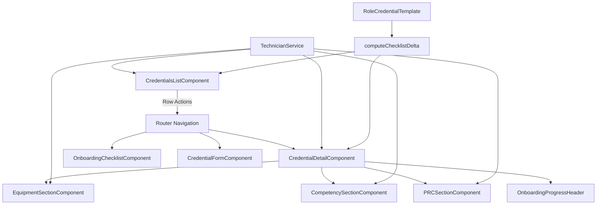
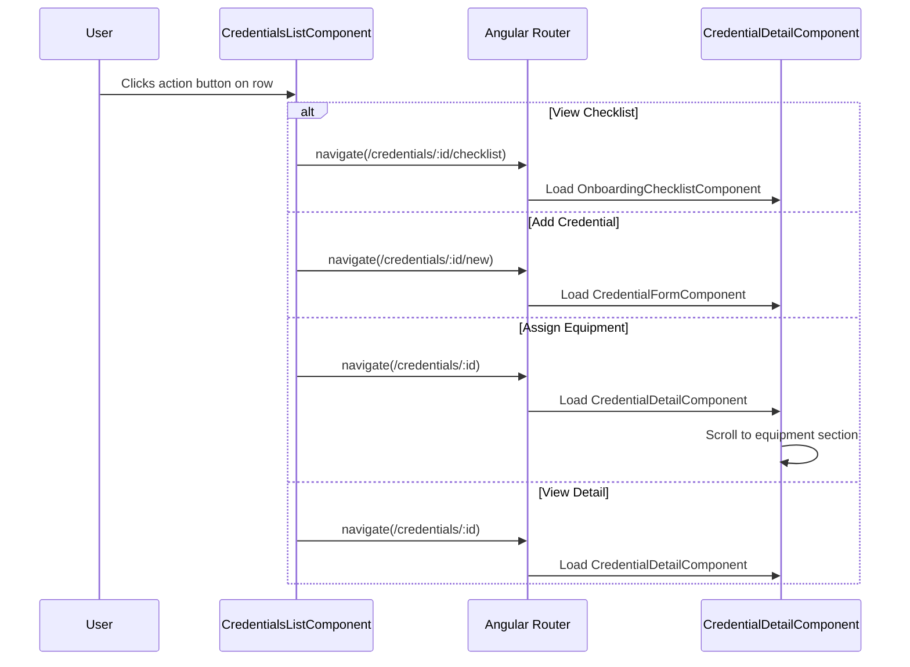
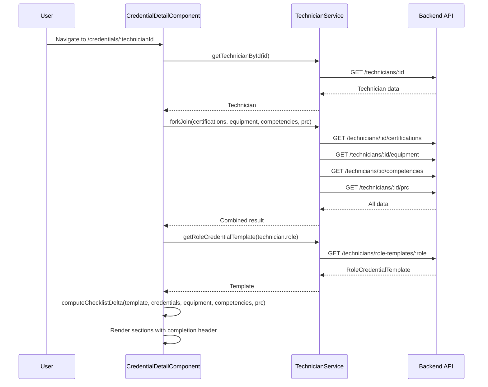
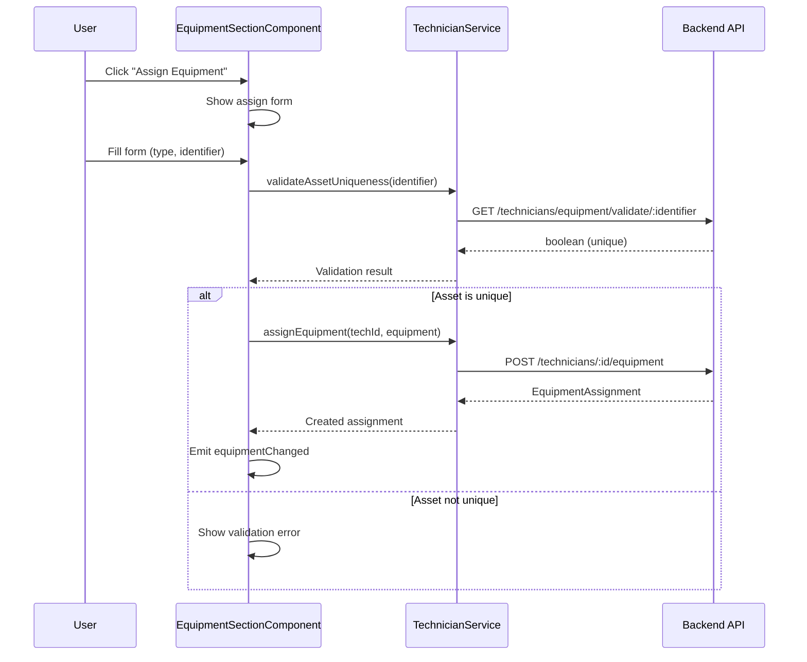

# Design Document: Onboarding Technician Actions

## Overview

This feature adds row-level actions to the Tech Credentials list page and builds out the Technician Onboarding Detail page as a unified hub for managing a technician's full onboarding lifecycle. The list page gains contextual action buttons (View Checklist, Add Credential, Assign Equipment) per technician row, while the detail page composes existing section components (credentials, equipment, competencies, PRC, checklist) into a tabbed or sectioned layout with full CRUD capabilities.

The design leverages existing Angular components (`credential-detail`, `equipment-section`, `competency-section`, `prc-section`, `onboarding-checklist`) and the `TechnicianService` API layer. The primary work involves wiring these components together with proper data flow, adding action buttons to the list, and creating a cohesive detail page that surfaces onboarding completion status prominently.

## Architecture



## Sequence Diagrams

### List Page Row Actions Flow



### Detail Page Data Loading Flow



### Equipment Assignment Flow



## Components and Interfaces

### Component 1: CredentialsListComponent (Enhanced)

**Purpose**: Displays the technician credentials list with per-row action buttons for quick navigation to common onboarding tasks.

**Interface**:
```typescript
interface RowAction {
  label: string;
  icon: string;
  ariaLabel: string;
  action: (technicianId: string) => void;
}

// New methods added to existing component
interface CredentialsListEnhancements {
  rowActions: RowAction[];
  navigateToDetail(technicianId: string): void;
  navigateToChecklist(technicianId: string): void;
  navigateToAddCredential(technicianId: string): void;
  navigateToAssignEquipment(technicianId: string): void;
}
```

**Responsibilities**:
- Render action buttons in the "Actions" column for each technician row
- Provide quick-access navigation to checklist, add credential, and assign equipment
- Stop event propagation on action clicks to prevent row-click navigation
- Show contextual tooltips on action buttons

### Component 2: CredentialDetailComponent (Enhanced)

**Purpose**: Serves as the unified Technician Onboarding Detail page, composing all section components and displaying an onboarding progress header.

**Interface**:
```typescript
interface OnboardingDetailState {
  technician: Technician | null;
  credentials: CredentialDisplay[];
  equipmentAssignments: EquipmentAssignment[];
  competencies: TechnicalCompetency[];
  prc: PRC | null;
  checklistSummary: ChecklistSummary | null;
  roleTemplate: RoleCredentialTemplate | null;
  isLoading: boolean;
  errorMessage: string;
  activeSection: 'credentials' | 'equipment' | 'competencies' | 'prc' | 'checklist';
}

interface CredentialDetailEnhancements {
  checklistSummary: ChecklistSummary | null;
  roleTemplate: RoleCredentialTemplate | null;
  activeSection: string;
  
  loadRoleTemplate(): void;
  computeOnboardingStatus(): void;
  scrollToSection(section: string): void;
  navigateBack(): void;
}
```

**Responsibilities**:
- Load technician data and all related onboarding data via `forkJoin`
- Fetch the role credential template and compute checklist delta
- Display onboarding progress header with completion percentage and status badges
- Compose child section components (equipment, competency, PRC)
- Handle section navigation via anchor links or tab switching
- Provide back-navigation to the credentials list

### Component 3: OnboardingProgressHeader (New)

**Purpose**: Displays a summary bar at the top of the detail page showing onboarding completion percentage, missing items count, and ready-to-start status.

**Interface**:
```typescript
@Component({ selector: 'app-onboarding-progress-header' })
class OnboardingProgressHeaderComponent {
  @Input() technician: Technician;
  @Input() checklistSummary: ChecklistSummary;
  @Input() prcIndicator: 'upcoming' | 'overdue' | null;
}
```

**Responsibilities**:
- Render a progress bar with completion percentage
- Show counts: complete, missing, expired items
- Display "Ready to Start" badge when all items are complete
- Show PRC status indicator (upcoming/overdue)
- Provide visual urgency cues for incomplete onboarding

### Component 4: EquipmentSectionComponent (Existing)

**Purpose**: Manages equipment assignments for a technician with inline add/edit capabilities.

**Interface**:
```typescript
@Component({ selector: 'app-equipment-section' })
class EquipmentSectionComponent {
  @Input() technicianId: string;
  @Input() equipmentAssignments: EquipmentAssignment[];
  @Output() equipmentChanged: EventEmitter<void>;
}
```

**Responsibilities**:
- Display list of equipment assignments with status badges
- Provide inline form for assigning new equipment
- Validate asset identifier uniqueness before submission
- Allow status updates (assigned → returned, assigned → lost)
- Emit change events to trigger parent data reload

### Component 5: CompetencySectionComponent (Existing)

**Purpose**: Manages technical competencies for a technician.

**Interface**:
```typescript
@Component({ selector: 'app-competency-section' })
class CompetencySectionComponent {
  @Input() technicianId: string;
  @Input() competencies: TechnicalCompetency[];
  @Output() competencyChanged: EventEmitter<void>;
}
```

**Responsibilities**:
- Display competencies with proficiency levels
- Provide form for adding new competencies (predefined or custom)
- Allow editing proficiency level and verification date
- Emit change events to trigger parent data reload

### Component 6: PRCSectionComponent (Existing)

**Purpose**: Manages the Performance Review Cycle and goals for a technician.

**Interface**:
```typescript
@Component({ selector: 'app-prc-section' })
class PRCSectionComponent {
  @Input() technicianId: string;
  @Input() prc: PRC | null;
  @Output() prcChanged: EventEmitter<void>;
}
```

**Responsibilities**:
- Display PRC status (upcoming, overdue, completed)
- Show goals with their statuses
- Allow marking PRC as complete
- Provide form for adding new goals
- Emit change events to trigger parent data reload

## Data Models

### TechnicianCredentialSummary (List Page)

```typescript
interface TechnicianCredentialSummary {
  technician: Technician;
  activeCount: number;
  expiringSoonCount: number;
  expiredCount: number;
  totalCount: number;
  onboardingCompletionPercentage: number;
  prcIndicator: 'upcoming' | 'overdue' | null;
  checklistSummary: ChecklistSummary | null;
}
```

**Validation Rules**:
- `onboardingCompletionPercentage` must be between 0 and 100
- `activeCount + expiringSoonCount + expiredCount <= totalCount`
- `prcIndicator` is derived from PRC due date relative to current date

### RowActionConfig

```typescript
interface RowActionConfig {
  id: string;
  label: string;
  icon: string;
  tooltip: string;
  ariaLabel: (technician: Technician) => string;
  isVisible: (summary: TechnicianCredentialSummary) => boolean;
  execute: (technicianId: string) => void;
}
```

**Validation Rules**:
- `id` must be unique across all row actions
- `ariaLabel` must produce a non-empty string
- `isVisible` determines conditional rendering (e.g., hide "Assign Equipment" if all equipment assigned)

### OnboardingDetailViewModel

```typescript
interface OnboardingDetailViewModel {
  technician: Technician;
  credentials: CredentialDisplay[];
  equipmentAssignments: EquipmentAssignment[];
  competencies: TechnicalCompetency[];
  prc: PRC | null;
  checklistSummary: ChecklistSummary;
  roleTemplate: RoleCredentialTemplate;
  sections: SectionVisibility;
}

interface SectionVisibility {
  credentials: boolean;
  equipment: boolean;
  competencies: boolean;
  prc: boolean;
  checklist: boolean;
}
```

**Validation Rules**:
- All sections default to visible
- `checklistSummary.totalCount` equals `roleTemplate.requiredItems.length`
- `checklistSummary.completionPercentage` is consistent with complete/total ratio

## Algorithmic Pseudocode

### Row Actions Rendering Algorithm

```typescript
/**
 * Determines which actions to display for a given technician row
 * based on their onboarding status.
 */
function getVisibleRowActions(
  summary: TechnicianCredentialSummary,
  allActions: RowActionConfig[]
): RowActionConfig[] {
  // PRECONDITION: summary is non-null with valid technician
  // PRECONDITION: allActions is a non-empty array of valid configs
  
  const visibleActions = allActions.filter(action => action.isVisible(summary));
  
  // POSTCONDITION: returned array is a subset of allActions
  // POSTCONDITION: all returned actions have isVisible(summary) === true
  // INVARIANT: order of actions is preserved from allActions
  return visibleActions;
}
```

### Onboarding Detail Data Loading Algorithm

```typescript
/**
 * Loads all data required for the onboarding detail page.
 * Uses forkJoin for parallel requests, then computes derived state.
 */
function loadOnboardingDetail(technicianId: string): Observable<OnboardingDetailViewModel> {
  // PRECONDITION: technicianId is a non-empty string
  // PRECONDITION: TechnicianService is available and authenticated
  
  return technicianService.getTechnicianById(technicianId).pipe(
    switchMap(technician => {
      // INVARIANT: technician is non-null at this point
      
      return forkJoin({
        certifications: technicianService.getTechnicianCertifications(technicianId),
        equipment: technicianService.getTechnicianEquipment(technicianId),
        competencies: technicianService.getTechnicianCompetencies(technicianId),
        prc: technicianService.getTechnicianPRC(technicianId),
        template: technicianService.getRoleCredentialTemplate(technician.role)
      }).pipe(
        map(result => {
          const checklistSummary = computeChecklistDelta(
            result.template,
            result.certifications as unknown as TypedCredential[],
            result.equipment,
            result.competencies,
            result.prc
          );
          
          // POSTCONDITION: checklistSummary.totalCount === result.template.requiredItems.length
          // POSTCONDITION: checklistSummary.completionPercentage is between 0 and 100
          
          return {
            technician,
            credentials: mapToCredentialDisplay(result.certifications),
            equipmentAssignments: result.equipment,
            competencies: result.competencies,
            prc: result.prc,
            checklistSummary,
            roleTemplate: result.template,
            sections: { credentials: true, equipment: true, competencies: true, prc: true, checklist: true }
          };
        })
      );
    })
  );
  
  // POSTCONDITION: emits exactly one OnboardingDetailViewModel on success
  // POSTCONDITION: emits error if any sub-request fails
}
```

### Onboarding Completion Percentage Algorithm

```typescript
/**
 * Computes the onboarding completion percentage for display in the list
 * and detail pages. This wraps computeChecklistDelta for the specific
 * use case of percentage extraction.
 */
function computeOnboardingPercentage(
  template: RoleCredentialTemplate,
  credentials: TypedCredential[],
  equipment: EquipmentAssignment[],
  competencies: TechnicalCompetency[],
  prc: PRC | null,
  referenceDate: Date = new Date()
): number {
  // PRECONDITION: template is non-null with requiredItems array
  // PRECONDITION: credentials, equipment, competencies are arrays (may be empty)
  
  if (template.requiredItems.length === 0) {
    // POSTCONDITION: returns 100 when no items are required
    return 100;
  }
  
  const summary = computeChecklistDelta(
    template, credentials, equipment, competencies, prc, referenceDate
  );
  
  // POSTCONDITION: result is between 0 and 100 inclusive
  // POSTCONDITION: result === 100 implies summary.isReadyToStart === true
  return summary.completionPercentage;
}
```

### Section Scroll Navigation Algorithm

```typescript
/**
 * Scrolls to a specific section within the detail page.
 * Used when navigating from list page actions that target a specific section.
 */
function scrollToSection(sectionId: string): void {
  // PRECONDITION: sectionId is one of 'credentials' | 'equipment' | 'competencies' | 'prc' | 'checklist'
  
  const element = document.getElementById(`section-${sectionId}`);
  
  if (element) {
    element.scrollIntoView({ behavior: 'smooth', block: 'start' });
    element.focus();
    // POSTCONDITION: element is visible in viewport
    // POSTCONDITION: element has focus for accessibility
  }
  
  // POSTCONDITION: if element not found, no-op (graceful degradation)
}
```

## Key Functions with Formal Specifications

### Function 1: navigateToAssignEquipment()

```typescript
navigateToAssignEquipment(technicianId: string): void
```

**Preconditions:**
- `technicianId` is a non-empty string corresponding to an existing technician
- User has navigation permissions (authenticated)

**Postconditions:**
- Router navigates to `/onboarding/credentials/:technicianId`
- Query parameter `section=equipment` is appended
- On page load, equipment section is scrolled into view

**Loop Invariants:** N/A

### Function 2: loadAllData()

```typescript
private loadAllData(): void
```

**Preconditions:**
- `this.technicianId` is set to a valid technician ID
- `this.technician` is loaded (non-null)
- Component is not destroyed (subscriptions are active)

**Postconditions:**
- `this.credentials` contains sorted credential display items
- `this.equipmentAssignments` contains all equipment for the technician
- `this.competencies` contains all competencies for the technician
- `this.prc` contains the current PRC or null
- `this.checklistSummary` is computed from role template and on-file data
- `this.isLoading` is set to false
- On error: `this.errorMessage` is set, all data arrays remain unchanged

**Loop Invariants:** N/A

### Function 3: getVisibleRowActions()

```typescript
getVisibleRowActions(summary: TechnicianCredentialSummary): RowActionConfig[]
```

**Preconditions:**
- `summary` is non-null with a valid `technician` property
- `this.rowActions` is initialized with all possible actions

**Postconditions:**
- Returns a subset of `this.rowActions` where `isVisible(summary)` is true
- Returned array preserves original ordering
- Returned array length is between 0 and `this.rowActions.length`

**Loop Invariants:**
- For each processed action: visibility check is pure (no side effects)

### Function 4: computeChecklistDelta() (Existing)

```typescript
computeChecklistDelta(
  template: RoleCredentialTemplate,
  credentials: TypedCredential[],
  equipment: EquipmentAssignment[],
  competencies: TechnicalCompetency[],
  prc: PRC | null,
  referenceDate?: Date
): ChecklistSummary
```

**Preconditions:**
- `template` is non-null with a `requiredItems` array
- `credentials`, `equipment`, `competencies` are arrays (may be empty)
- `referenceDate` defaults to `new Date()` if not provided

**Postconditions:**
- `result.items.length === template.requiredItems.length`
- `result.completeCount + result.missingCount + result.expiredCount === result.totalCount`
- `result.completionPercentage === (result.completeCount / result.totalCount) * 100` (or 0 if totalCount is 0)
- `result.isReadyToStart === (result.missingCount === 0 && result.expiredCount === 0)`

**Loop Invariants:**
- Each required item maps to exactly one checklist item
- Status resolution is deterministic for the same inputs

## Example Usage

```typescript
// Example 1: Row actions configuration in CredentialsListComponent
const rowActions: RowActionConfig[] = [
  {
    id: 'view-detail',
    label: 'View',
    icon: '👁',
    tooltip: 'View onboarding detail',
    ariaLabel: (tech) => `View onboarding detail for ${tech.firstName} ${tech.lastName}`,
    isVisible: () => true,
    execute: (id) => this.router.navigate(['credentials', id], { relativeTo: this.route })
  },
  {
    id: 'view-checklist',
    label: 'Checklist',
    icon: '☑',
    tooltip: 'View onboarding checklist',
    ariaLabel: (tech) => `View onboarding checklist for ${tech.firstName} ${tech.lastName}`,
    isVisible: () => true,
    execute: (id) => this.router.navigate(['credentials', id, 'checklist'], { relativeTo: this.route })
  },
  {
    id: 'add-credential',
    label: 'Add Credential',
    icon: '+',
    tooltip: 'Add a new credential',
    ariaLabel: (tech) => `Add credential for ${tech.firstName} ${tech.lastName}`,
    isVisible: (summary) => summary.onboardingCompletionPercentage < 100,
    execute: (id) => this.router.navigate(['credentials', id, 'new'], { relativeTo: this.route })
  },
  {
    id: 'assign-equipment',
    label: 'Equipment',
    icon: '🔧',
    tooltip: 'Assign equipment',
    ariaLabel: (tech) => `Assign equipment to ${tech.firstName} ${tech.lastName}`,
    isVisible: (summary) => summary.onboardingCompletionPercentage < 100,
    execute: (id) => this.router.navigate(['credentials', id], {
      relativeTo: this.route,
      queryParams: { section: 'equipment' }
    })
  }
];

// Example 2: Detail page loading with checklist computation
ngOnInit(): void {
  this.technicianId = this.route.snapshot.paramMap.get('technicianId') || '';
  this.loadData();
  
  // Handle section query param for deep-linking
  const section = this.route.snapshot.queryParamMap.get('section');
  if (section) {
    setTimeout(() => this.scrollToSection(section), 500);
  }
}

// Example 3: Progress header usage in template
// <app-onboarding-progress-header
//   [technician]="technician"
//   [checklistSummary]="checklistSummary"
//   [prcIndicator]="prcIndicator">
// </app-onboarding-progress-header>

// Example 4: Equipment section with change propagation
// <app-equipment-section
//   [technicianId]="technicianId"
//   [equipmentAssignments]="equipmentAssignments"
//   (equipmentChanged)="reloadData()">
// </app-equipment-section>
```

## Correctness Properties

*A property is a characteristic or behavior that should hold true across all valid executions of a system — essentially, a formal statement about what the system should do. Properties serve as the bridge between human-readable specifications and machine-verifiable correctness guarantees.*

### Property 1: Action visibility filtering preserves correctness and order

*For any* technician credential summary and any defined set of row actions, the `getVisibleRowActions` function SHALL return exactly those actions where `isVisible(summary)` returns true, in the same relative order as the original action definitions. Additionally, the "View Detail" and "View Checklist" actions SHALL always be present in the result regardless of the summary state.

**Validates: Requirements 1.2, 1.3, 10.3**

### Property 2: Aria-label produces accessible identifiers

*For any* technician and any row action configuration, the `ariaLabel` function SHALL produce a non-empty string that contains the technician's first name and last name.

**Validates: Requirement 1.4**

### Property 3: Checklist delta partition invariant

*For any* valid RoleCredentialTemplate and any combination of on-file credentials, equipment, competencies, and PRC data, the computed ChecklistSummary SHALL satisfy: `totalCount === template.requiredItems.length` AND `completeCount + missingCount + expiredCount === totalCount`.

**Validates: Requirements 5.1, 5.2**

### Property 4: Completion percentage bounds

*For any* valid inputs to the checklist delta computation, the resulting `completionPercentage` SHALL be a number between 0 and 100 inclusive.

**Validates: Requirement 5.3**

### Property 5: Expired credential classification

*For any* credential that is on-file but whose expiration date is before the reference date, the checklist delta computation SHALL classify that item as "expired" rather than "complete".

**Validates: Requirement 5.5**

### Property 6: Equipment validation precedes creation

*For any* equipment assignment submission, `validateAssetUniqueness` SHALL be invoked before `assignEquipment` is called — ensuring no duplicate asset identifiers are created in the system.

**Validates: Requirement 7.1**

### Property 7: Completion percentage monotonicity on valid additions

*For any* onboarding state and any valid credential, equipment assignment, or competency that satisfies a required item in the Role_Template, adding that item SHALL not decrease the Completion_Percentage.

**Validates: Requirement 8.3**

## Error Handling

### Error Scenario 1: Data Load Failure

**Condition**: Any HTTP request in the `forkJoin` fails (network error, 500, 404)
**Response**: Set `errorMessage` with user-friendly text, hide all sections, show retry button
**Recovery**: User clicks "Retry" which re-invokes `loadData()` from scratch

### Error Scenario 2: Equipment Assignment Validation Failure

**Condition**: `validateAssetUniqueness` returns false (duplicate asset identifier)
**Response**: Display inline validation error below the asset identifier field
**Recovery**: User corrects the identifier and resubmits

### Error Scenario 3: Credential Deletion Failure

**Condition**: DELETE request for a credential returns error
**Response**: Display `deleteErrorMessage` banner with retry button, preserve credential in list
**Recovery**: User clicks "Retry" which re-attempts the delete with the stored credential ID

### Error Scenario 4: Role Template Not Found

**Condition**: `getRoleCredentialTemplate` returns 404 (role has no template defined)
**Response**: Hide the onboarding progress header, show informational message "No onboarding template configured for this role"
**Recovery**: Admin configures a template for the role; page refresh picks it up

### Error Scenario 5: Navigation to Non-Existent Technician

**Condition**: `getTechnicianById` returns 404
**Response**: Display "Technician not found" error with a "Back to List" button
**Recovery**: User navigates back to the credentials list

## Testing Strategy

### Unit Testing Approach

- Test `getVisibleRowActions` with various summary states (100% complete, 0% complete, mixed)
- Test `computeOnboardingPercentage` wrapper function
- Test section scroll behavior with mocked DOM elements
- Test query parameter handling for deep-linking to sections
- Test error state transitions (loading → error → retry → success)
- Test action button click handlers with router spy

### Property-Based Testing Approach

**Property Test Library**: fast-check

- **Checklist delta consistency**: For any valid template and credential set, `completeCount + missingCount + expiredCount === totalCount`
- **Percentage bounds**: For any inputs, `0 <= completionPercentage <= 100`
- **Idempotent reload**: Loading data twice with same inputs produces identical view model
- **Action visibility determinism**: Same summary always produces same visible actions set
- **Progress monotonicity**: Adding a valid credential/equipment/competency never decreases completion percentage

### Integration Testing Approach

- Test full page load with mocked HTTP responses
- Test navigation from list row actions to correct detail page sections
- Test child component change events triggering parent reload
- Test back-navigation from detail to list preserving filter state
- Test deep-link via query params scrolling to correct section

## Performance Considerations

- Use `forkJoin` for parallel data loading (credentials, equipment, competencies, PRC, template) to minimize load time
- Avoid re-computing `checklistSummary` on every change detection cycle — compute only on data load/reload
- Use `OnPush` change detection on the progress header component since its inputs change infrequently
- Consider caching `RoleCredentialTemplate` since it rarely changes (could use a simple in-memory cache in the service)
- Limit the number of action buttons per row to prevent table layout overflow on narrow screens

## Security Considerations

- Role-based access control is enforced by `TechnicianService` (CM users can only view/edit technicians in their market)
- Credential deletion requires confirmation dialog to prevent accidental data loss
- SSN Last Four digits are masked in display (show as `***1234`)
- Equipment asset identifiers are validated for uniqueness to prevent inventory conflicts
- All navigation respects existing `UnsavedChangesGuard` on form routes

## Dependencies

- **Angular Router** — navigation between list and detail pages, query parameter handling
- **RxJS** — `forkJoin`, `switchMap`, `Subscription` management for parallel data loading
- **TechnicianService** — all HTTP communication with backend API
- **computeChecklistDelta utility** — pure function for onboarding status computation
- **computeCredentialStatus utility** — credential expiration status derivation
- **computePRCStatus utility** — PRC timer status computation
- **Existing section components** — `EquipmentSectionComponent`, `CompetencySectionComponent`, `PRCSectionComponent`
- **@ngrx/store** (optional) — state management for list page (already in use)
