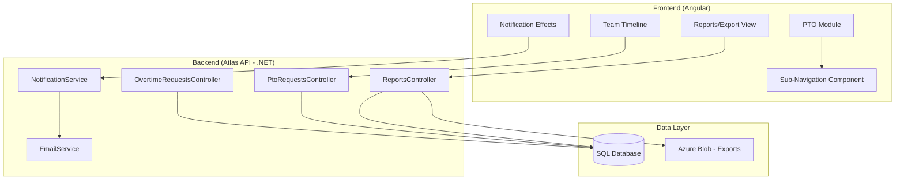

# Design Document: PTO & Overtime Enhancements — Phase 2

## Overview

Phase 2 completes the PTO/Overtime management system by delivering backend API infrastructure, data model alignment, navigation improvements, team-wide timeline data, notification/email integration, and a reporting/export view. This builds on the Phase 1 frontend components (overtime form/list, approval dashboard, team timeline, enhanced PTO form).

### Key Design Decisions

1. **Backend endpoints in Atlas API** — Overtime endpoints follow the same controller/service/repository pattern as existing PTO endpoints in the atlas-platform .NET project.
2. **Shared notification infrastructure** — Overtime notifications reuse the existing `NotificationService` and email sending patterns already established for PTO.
3. **Team availability as a dedicated read-only endpoint** — Rather than loading all users' data through the existing per-user endpoints, a new lightweight endpoint returns only the data needed for the timeline.
4. **CSV export server-side** — Export happens server-side to handle large datasets without browser memory issues.
5. **Progressive enhancement for navigation** — Sub-nav is added within the PTO module without changing the top-level FRM layout.

## Architecture



## Task 1: Backend API — Overtime Endpoints

### Controller: `OvertimeRequestsController`

```
POST   /v1/overtime-requests                 → Create
GET    /v1/overtime-requests                 → List (my requests, paginated)
GET    /v1/overtime-requests/{id}            → Get by ID
POST   /v1/overtime-requests/{id}/cancel     → Cancel
POST   /v1/overtime-requests/{id}/approve    → Approve (Manager/Admin)
POST   /v1/overtime-requests/{id}/reject     → Reject (Manager/Admin, reason required)
GET    /v1/overtime-requests/manager-queue   → Manager pending queue
```

### Entity: `OvertimeRequest`

```csharp
public class OvertimeRequest
{
    public Guid Id { get; set; }
    public string EmployeeId { get; set; }
    public string EmployeeFullName { get; set; }
    public string Department { get; set; }
    public string Market { get; set; }
    public bool EmailedSriLead { get; set; }
    public string SriLeadName { get; set; }
    public bool IsPreApproved { get; set; }
    public DateTime SubmissionDate { get; set; }
    public DateTime OvertimeStartDate { get; set; }
    public int EstimatedHours { get; set; }
    public int EstimatedMinutes { get; set; }
    public string Justification { get; set; }
    public string ManagerId { get; set; }
    public string ManagerName { get; set; }
    public string ApprovalStatus { get; set; }  // Pending_Manager_Approval, Approved, Rejected, Cancelled
    public DateTime CreatedAt { get; set; }
    public DateTime UpdatedAt { get; set; }
    public List<OvertimeApprovalEntry> ApprovalHistory { get; set; }
}
```

### Service Layer

- `IOvertimeRequestService` — Business logic, status transitions, validation
- `IOvertimeRequestRepository` — Data access (EF Core)
- Follows same patterns as existing PTO service layer

---

## Task 2: PTO Data Model Extension

### New Fields on PtoRequest Entity

```csharp
// Added to existing PtoRequest entity
public string CoveragePerson { get; set; }          // nullable
public bool? EmailedSriLead { get; set; }           // nullable
public string IsApprovedByLead { get; set; }        // "yes" | "no" | "pending" | null
public string Market { get; set; }                  // nullable
public bool OutOfOfficeCalendar { get; set; }       // default false
public bool OutOfOfficeChat { get; set; }           // default false
public bool OutOfOfficeEmail { get; set; }          // default false
```

### Migration Strategy

- Add nullable columns with `ALTER TABLE ... ADD COLUMN ... NULL`
- No data migration needed — existing rows get NULL for new columns
- Frontend DTO extended with matching optional fields

### Frontend DTO Update

```typescript
// Extended CreatePtoRequestDto
export interface CreatePtoRequestDto {
  employeeId: string;
  startDate: string;
  endDate: string;
  requestType: string;
  reason?: string;
  // New Phase 2 fields
  employeeName?: string;
  coveragePerson?: string;
  emailedSriLead?: boolean;
  isApprovedByLead?: string;
  market?: string;
  outOfOfficeCalendar?: boolean;
  outOfOfficeChat?: boolean;
  outOfOfficeEmail?: boolean;
}
```

---

## Task 3: Navigation & UX

### Sub-Navigation Component

A persistent tab bar rendered within the PTO module's root layout:

```
┌────────────────────────────────────────────────────────────────────┐
│  My Requests  │  Overtime  │  Timeline  │  Approvals (3)  │  Reports  │
└────────────────────────────────────────────────────────────────────┘
```

- Lives in `components/pto/pto-sub-nav/pto-sub-nav.component.ts`
- Uses Angular Router's `routerLinkActive` for highlighting
- Badge count via NgRx selector (pending PTO + overtime count)
- Role-based visibility: "Approvals" and "Reports" shown only for Manager/Admin/PayrollGuard roles

### Home Dashboard Cards

Add quick-action cards to the existing `HomeDashboardComponent`:
- "Request Time Off" → navigates to `/field-resource-management/pto/new`
- "Request Overtime" → navigates to `/field-resource-management/pto/overtime/new`
- "View Availability" → navigates to `/field-resource-management/pto/timeline`
- "Review Approvals" (manager only) → navigates to `/field-resource-management/pto/approvals`

---

## Task 4: Team Availability Endpoint

### Endpoint: `GET /v1/pto-requests/team-availability`

**Query Parameters:**
- `startDate` (required, ISO date)
- `endDate` (required, ISO date, max 365 days from startDate)
- `market` (optional, string filter)

**Response:**
```json
[
  {
    "id": "uuid",
    "employeeName": "John Doe",
    "startDate": "2026-01-15",
    "endDate": "2026-01-20",
    "market": "Nevada",
    "requestType": "Vacation"
  }
]
```

**Implementation:**
- Query all PtoRequests where `Status = Approved` AND date ranges overlap with the requested range
- If market filter provided, add `WHERE Market = @market`
- Returns lightweight projection (no approval history, no internal IDs)
- No pagination (bounded by 365-day limit)

### Frontend Integration

Update `TeamTimelineComponent` to:
1. Call the team-availability endpoint on init and when year/market changes
2. Use API data instead of the NgRx store's user-specific requests
3. Add loading state and error handling

---

## Task 5: Notification & Email

### Notification Events

| Event | In-App | Email | Recipients |
|-------|--------|-------|------------|
| Overtime submitted | Yes | No | Manager/SRI Lead |
| Overtime approved | Yes | Yes | Employee |
| Overtime rejected | Yes | Yes | Employee (includes reason) |
| PTO submitted | Yes | No | Manager (existing) |
| PTO manager approved | Yes | No | Backoffice (existing) |
| PTO final approved | Yes | Yes | Employee |
| PTO rejected | Yes | Yes | Employee (includes reason) |
| PTO cancelled | Yes | No | Manager + Backoffice |

### Email Template Structure

```
Subject: [SRI] Your {PTO/Overtime} Request Has Been {Approved/Rejected}

Hi {EmployeeName},

Your {request type} request for {dates} has been {status}.

{If rejected: Reason: {reason}}

View your request: {link}

— SRI Team
```

### Implementation

- Create `OvertimeNotificationEffects` (NgRx effects) mirroring existing `PtoNotificationEffects`
- Backend: Add notification dispatch in the overtime service's approve/reject methods
- Email: Use existing Azure Communication Services / SendGrid integration

---

## Task 6: Reports & Export

### Reports Component

New component: `components/pto/reports/pto-reports.component.ts`

**Features:**
- Data table with columns from the Google Sheets reference
- Server-side pagination (25/page default)
- Column sorting
- Filters: date range picker, market dropdown, status dropdown, type (PTO/Overtime)
- "Export CSV" button

### Reports API Endpoint

```
GET /v1/reports/time-off
  ?startDate=2024-01-01
  &endDate=2025-12-31
  &market=Nevada
  &status=Approved
  &type=pto
  &page=1
  &pageSize=25
  &sortBy=submissionDate
  &sortDir=desc
```

**Response:** Paginated response with `items`, `totalCount`, `page`, `pageSize`

```
GET /v1/reports/time-off/export
  ?startDate=...&endDate=...&market=...&status=...&type=...
```

**Response:** `Content-Type: text/csv` file download

### Authorization

- Manager, Admin, and Payroll roles only
- Enforced via `[Authorize(Roles = "Manager,Admin,Payroll")]`

---

## Error Handling

### Backend Errors

| Scenario | HTTP Status | Error Body |
|----------|-------------|------------|
| Missing required field | 400 | `{ "errors": { "field": ["message"] } }` |
| Not authenticated | 401 | Standard 401 |
| Not authorized (role) | 403 | `{ "message": "Forbidden" }` |
| Request not found | 404 | `{ "message": "Not found" }` |
| Invalid status transition | 409 | `{ "message": "Invalid operation for current status" }` |
| Date range > 365 days | 400 | `{ "message": "Date range cannot exceed 1 year" }` |
| Email delivery failure | — | Log error, continue with in-app notification |

### Frontend Error Handling

- API errors surface as toast notifications via existing `ToastService`
- Network failures show retry option
- Loading states displayed during API calls
- Export failures show "Export failed, please try again" message

---

## Testing Strategy

### Backend Tests

| Area | Test Type | What It Validates |
|------|-----------|-------------------|
| OvertimeRequestsController | Integration | Endpoint routing, authorization, validation |
| OvertimeRequestService | Unit | Business logic, status transitions |
| Team availability query | Integration | Date range filtering, market filter, performance |
| Reports endpoint | Integration | Pagination, sorting, filtering, CSV generation |
| Email notifications | Unit (mocked) | Correct recipients, template rendering |

### Frontend Tests

| Area | Test Type | What It Validates |
|------|-----------|-------------------|
| Sub-navigation | Unit | Active route highlighting, role-based visibility |
| Timeline API integration | Unit | API call parameters, loading/error states |
| Reports data table | Unit | Pagination, sorting, filter dispatch |
| CSV export | Unit | Download trigger, filename format |
| Notification effects | Unit | Correct actions dispatched on status changes |
