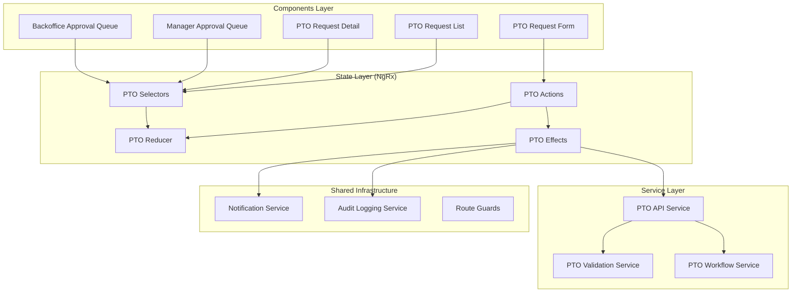
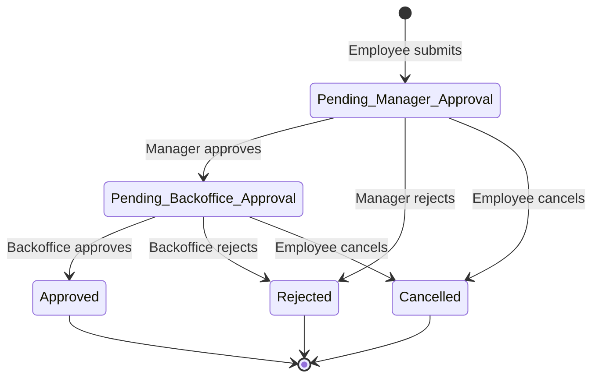

# Design Document: PTO/Time Off Requests

## Overview

This feature adds a PTO (Paid Time Off) request management system to the existing Angular 18 field resource management application. It enables employees to submit time off requests, which then flow through a two-stage approval workflow: first by the employee's direct manager, then by backoffice/payroll personnel.

The system integrates with the existing NgRx state management, notification infrastructure, and audit logging patterns already established in the application. It introduces a new `pto` state slice, a dedicated API service, and a set of components organized under a new `pto` component directory within the field-resource-management feature module.

### Key Design Decisions

1. **Single feature module integration** — The PTO feature lives within the existing `field-resource-management` module rather than a standalone lazy-loaded module, consistent with how other sub-features (quotes, timecards, payroll) are organized.
2. **NgRx Entity for request management** — Uses `@ngrx/entity` for normalized PTO request storage, following the same pattern as notifications, timecards, and quotes.
3. **State machine for workflow status** — Request status transitions are enforced via a deterministic state machine, preventing invalid transitions at the service layer.
4. **Reuse of existing infrastructure** — Leverages the existing `NotificationService`, `AuditLoggingService`, route guards, and `CustomValidators` rather than creating parallel systems.

## Architecture



### Workflow State Machine



## Components and Interfaces

### Components

| Component | Purpose | Route |
|-----------|---------|-------|
| `PtoRequestFormComponent` | Create/edit PTO request with reactive form | `/pto/new` |
| `PtoRequestListComponent` | List employee's own requests with status filters | `/pto` |
| `PtoRequestDetailComponent` | View full request details and approval history | `/pto/:id` |
| `PtoManagerQueueComponent` | Manager's pending approval queue | `/pto/approvals/manager` |
| `PtoBackofficeQueueComponent` | Backoffice pending approval queue | `/pto/approvals/backoffice` |
| `PtoLeaveTypeChipComponent` | Shared chip display for leave types | (inline) |

### Services

| Service | Responsibility |
|---------|---------------|
| `PtoApiService` | HTTP communication with backend API endpoints |
| `PtoValidationService` | Business rule validation (date rules, status transitions) |
| `PtoWorkflowService` | Orchestrates status transitions, enforces workflow integrity |

### Route Guards

| Guard | Purpose |
|-------|---------|
| `ManagerGuard` (existing) | Protects manager approval routes |
| `PayrollGuard` (existing) | Protects backoffice approval routes |

### Key Interfaces

```typescript
// PTO API Service
interface PtoApiService {
  getMyRequests(): Observable<PtoRequest[]>;
  getRequestById(id: string): Observable<PtoRequest>;
  createRequest(payload: CreatePtoRequestDto): Observable<PtoRequest>;
  cancelRequest(id: string): Observable<PtoRequest>;
  getManagerQueue(): Observable<PtoRequest[]>;
  getBackofficeQueue(): Observable<PtoRequest[]>;
  approveAsManager(id: string): Observable<PtoRequest>;
  rejectAsManager(id: string, reason: string): Observable<PtoRequest>;
  approveAsBackoffice(id: string): Observable<PtoRequest>;
  rejectAsBackoffice(id: string, reason: string): Observable<PtoRequest>;
  getLeaveTypes(): Observable<LeaveType[]>;
}

// PTO Validation Service
interface PtoValidationService {
  validateRequest(request: CreatePtoRequestDto): ValidationResult;
  canTransition(currentStatus: RequestStatus, targetStatus: RequestStatus): boolean;
  isValidTransition(from: RequestStatus, to: RequestStatus, role: UserRole): boolean;
}

// PTO Workflow Service
interface PtoWorkflowService {
  submit(request: CreatePtoRequestDto): Observable<PtoRequest>;
  cancel(requestId: string): Observable<PtoRequest>;
  managerApprove(requestId: string): Observable<PtoRequest>;
  managerReject(requestId: string, reason: string): Observable<PtoRequest>;
  backofficeApprove(requestId: string): Observable<PtoRequest>;
  backofficeReject(requestId: string, reason: string): Observable<PtoRequest>;
}
```

## Data Models

### Core Models

```typescript
export enum RequestStatus {
  Pending_Manager_Approval = 'Pending_Manager_Approval',
  Pending_Backoffice_Approval = 'Pending_Backoffice_Approval',
  Approved = 'Approved',
  Rejected = 'Rejected',
  Cancelled = 'Cancelled'
}

export interface LeaveType {
  id: string;
  name: string;
  isPredefined: boolean;
  isActive: boolean;
}

export interface PtoRequest {
  id: string;
  employeeId: string;
  employeeName: string;
  managerId: string;
  managerName: string;
  startDate: string;           // ISO date
  endDate: string;             // ISO date
  leaveTypeId: string;
  leaveTypeName: string;
  notes: string | null;
  status: RequestStatus;
  approvalHistory: ApprovalEntry[];
  createdAt: string;           // ISO UTC
  updatedAt: string;           // ISO UTC
}

export interface ApprovalEntry {
  id: string;
  requestId: string;
  action: ApprovalAction;
  performedBy: string;
  performedByName: string;
  performedAt: string;         // ISO UTC
  reason: string | null;       // Required for rejections
  fromStatus: RequestStatus;
  toStatus: RequestStatus;
}

export type ApprovalAction = 'submitted' | 'manager_approved' | 'manager_rejected' 
  | 'backoffice_approved' | 'backoffice_rejected' | 'cancelled';

export type UserRole = 'employee' | 'manager' | 'backoffice';
```

### DTOs

```typescript
export interface CreatePtoRequestDto {
  startDate: string;           // ISO date, not in the past
  endDate: string;             // ISO date, >= startDate
  leaveTypeId: string;         // Must reference valid LeaveType
  notes?: string;              // Optional, max 1000 chars
}

export interface RejectPtoRequestDto {
  reason: string;              // Required, max 500 chars
}
```

### NgRx State

```typescript
export interface PtoState extends EntityState<PtoRequest> {
  leaveTypes: LeaveType[];
  managerQueue: string[];      // IDs of requests in manager queue
  backofficeQueue: string[];   // IDs of requests in backoffice queue
  selectedRequestId: string | null;
  loading: boolean;
  error: string | null;
}
```

### Valid Status Transitions

```typescript
export const VALID_TRANSITIONS: Record<RequestStatus, RequestStatus[]> = {
  [RequestStatus.Pending_Manager_Approval]: [
    RequestStatus.Pending_Backoffice_Approval,
    RequestStatus.Rejected,
    RequestStatus.Cancelled
  ],
  [RequestStatus.Pending_Backoffice_Approval]: [
    RequestStatus.Approved,
    RequestStatus.Rejected,
    RequestStatus.Cancelled
  ],
  [RequestStatus.Approved]: [],
  [RequestStatus.Rejected]: [],
  [RequestStatus.Cancelled]: []
};
```


## Correctness Properties

*A property is a characteristic or behavior that should hold true across all valid executions of a system — essentially, a formal statement about what the system should do. Properties serve as the bridge between human-readable specifications and machine-verifiable correctness guarantees.*

### Property 1: Date validation rejects invalid date ranges

*For any* PTO request submission where the start date is in the past OR the end date is before the start date, the validation service SHALL reject the request and return appropriate validation errors.

**Validates: Requirements 1.2, 1.3**

### Property 2: Valid submissions always start in Pending_Manager_Approval

*For any* PTO request with valid data (start date not in past, end date >= start date, valid leave type), submitting the request SHALL always produce a request with status `Pending_Manager_Approval`.

**Validates: Requirements 1.4**

### Property 3: State machine transition integrity

*For any* PTO request in a given status and any attempted status transition, the transition SHALL succeed if and only if it is in the set of valid transitions for that status. Specifically:
- From `Pending_Manager_Approval`: only `Pending_Backoffice_Approval`, `Rejected`, or `Cancelled` are valid
- From `Pending_Backoffice_Approval`: only `Approved`, `Rejected`, or `Cancelled` are valid
- From `Approved`, `Rejected`, `Cancelled`: no transitions are valid

**Validates: Requirements 3.1, 3.2, 3.4, 4.2, 4.3, 5.2, 5.3, 7.1, 7.2, 7.3**

### Property 4: Rejection always requires a non-empty reason

*For any* rejection action (manager or backoffice), the action SHALL succeed only when a non-empty reason string is provided. Rejection attempts with empty or whitespace-only reasons SHALL be rejected.

**Validates: Requirements 4.4, 5.4**

### Property 5: Queue filtering returns only role-appropriate requests

*For any* set of PTO requests in various statuses, the manager queue SHALL contain only requests in `Pending_Manager_Approval` status for the manager's direct reports, and the backoffice queue SHALL contain only requests in `Pending_Backoffice_Approval` status.

**Validates: Requirements 2.1, 4.1, 5.1**

### Property 6: Request list is sorted by start date descending

*For any* list of PTO requests returned for an employee, the requests SHALL be ordered such that for every adjacent pair (request[i], request[i+1]), request[i].startDate >= request[i+1].startDate.

**Validates: Requirements 2.4**

### Property 7: Modification resets approval workflow

*For any* PTO request in a non-terminal status (`Pending_Manager_Approval` or `Pending_Backoffice_Approval`), modifying the request SHALL reset the status to `Pending_Manager_Approval`.

**Validates: Requirements 7.4**

### Property 8: Every status transition produces an audit entry

*For any* valid status transition on a PTO request, the system SHALL append an audit entry containing the timestamp, acting user, previous status, and new status. The number of audit entries SHALL equal the number of status transitions performed.

**Validates: Requirements 7.5**

### Property 9: Leave type list is a superset of predefined types

*For any* configuration of custom leave types, the returned leave type list SHALL contain all predefined types (Vacation, Sick Leave, Personal Day, Bereavement, Jury Duty) plus all active custom types, with no duplicates.

**Validates: Requirements 8.2**

## Error Handling

### Validation Errors

| Scenario | Error Handling |
|----------|---------------|
| Start date in the past | Display inline error: "Start date cannot be in the past" |
| End date before start date | Display inline error: "End date must be on or after start date" |
| Missing leave type | Display inline error: "Please select a leave type" |
| Empty rejection reason | Display inline error: "A reason is required when rejecting a request" |
| Invalid status transition | Display toast error: "This action is not available for the current request status" |

### API Errors

| Scenario | Error Handling |
|----------|---------------|
| Network failure | Display toast with retry option; preserve form state |
| 401 Unauthorized | Redirect to login |
| 403 Forbidden | Display "You do not have permission to perform this action" |
| 404 Not Found | Display "Request not found" with navigation back to list |
| 409 Conflict (stale state) | Reload request data and display "Request was updated by another user" |
| 500 Server Error | Display generic error toast with retry option |

### Optimistic Update Strategy

- **Cancellation**: Optimistically update status to Cancelled in the store; revert on API failure
- **Approval/Rejection**: Wait for API confirmation before updating store (to prevent race conditions in multi-approver scenarios)
- **Submission**: Wait for API confirmation to get server-generated ID and timestamps

## Testing Strategy

### Property-Based Tests (fast-check)

The project already uses `fast-check` (v4.5.3) for property-based testing. Each correctness property maps to a property-based test with minimum 100 iterations.

| Property | Test File | What It Validates |
|----------|-----------|-------------------|
| Property 1: Date validation | `pto-validation.property.spec.ts` | Date rules reject invalid ranges |
| Property 2: Initial status | `pto-workflow.property.spec.ts` | Submissions always start pending |
| Property 3: State machine | `pto-workflow.property.spec.ts` | Only valid transitions succeed |
| Property 4: Rejection reason | `pto-workflow.property.spec.ts` | Rejections require reasons |
| Property 5: Queue filtering | `pto-selectors.property.spec.ts` | Queues show correct requests |
| Property 6: Sort order | `pto-selectors.property.spec.ts` | List is sorted descending |
| Property 7: Modification reset | `pto-workflow.property.spec.ts` | Edits reset to pending |
| Property 8: Audit trail | `pto-workflow.property.spec.ts` | Every transition is audited |
| Property 9: Leave types | `pto-leave-types.property.spec.ts` | Predefined + custom types |

**Configuration:**
- Library: `fast-check` (already in devDependencies)
- Minimum iterations: 100 per property
- Tag format: `Feature: pto-time-off-requests, Property {N}: {title}`

### Unit Tests (Jasmine/Karma)

| Area | Test Focus |
|------|------------|
| `PtoValidationService` | Specific validation examples, edge cases (boundary dates, max-length notes) |
| `PtoRequestFormComponent` | Form initialization, field interactions, error display |
| `PtoManagerQueueComponent` | Approve/reject button states, rejection dialog |
| `PtoBackofficeQueueComponent` | Queue display, approval actions |
| `PTO Reducer` | State transitions for each action |
| `PTO Selectors` | Derived state computation |
| `PTO Effects` | Side effect orchestration (API calls, notifications) |

### Integration Tests

| Scenario | What It Validates |
|----------|-------------------|
| Full approval workflow | Submit → Manager approve → Backoffice approve → Approved status |
| Rejection workflow | Submit → Manager reject → Employee notified |
| Cancellation workflow | Submit → Employee cancel → All parties notified |
| Notification dispatch | Correct notifications sent at each workflow step |

### Test Organization

```
src/app/features/field-resource-management/
├── services/
│   └── pto-validation.property.spec.ts
├── state/pto/
│   ├── pto-workflow.property.spec.ts
│   ├── pto-selectors.property.spec.ts
│   ├── pto-leave-types.property.spec.ts
│   ├── pto.reducer.spec.ts
│   ├── pto.effects.spec.ts
│   └── pto.selectors.spec.ts
└── components/pto/
    ├── pto-request-form/pto-request-form.component.spec.ts
    ├── pto-request-list/pto-request-list.component.spec.ts
    ├── pto-manager-queue/pto-manager-queue.component.spec.ts
    └── pto-backoffice-queue/pto-backoffice-queue.component.spec.ts
```
