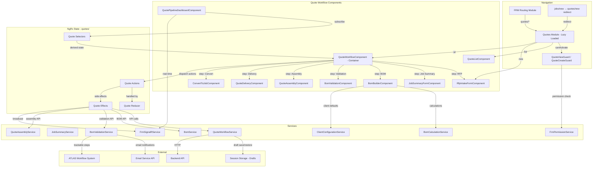
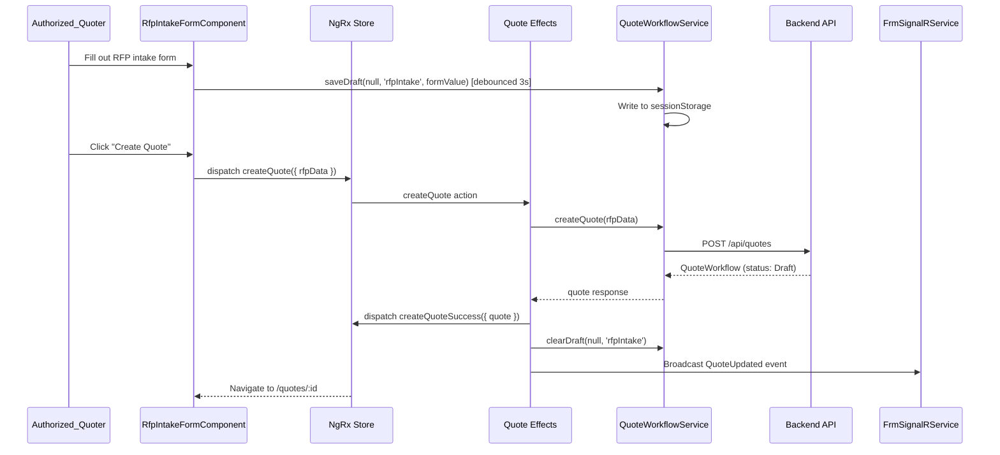
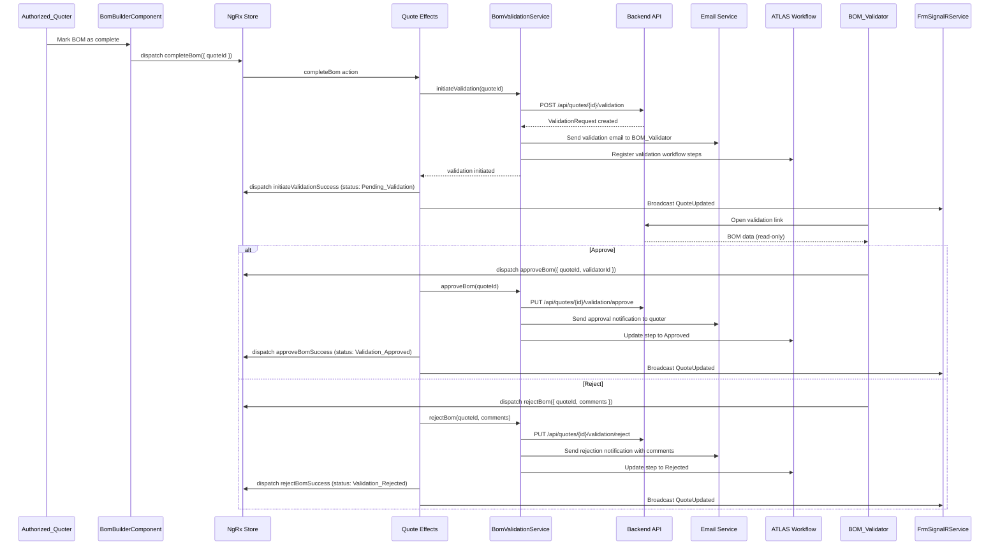
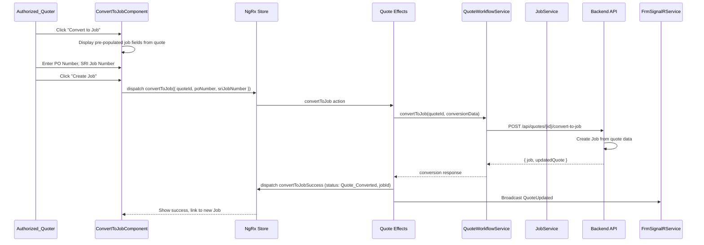

# Design Document: Quote/RFP Workflow

## Overview

This design adds a Quote/RFP Workflow to the FRM module, implementing the Initiating and Planning phases of the SRI Project Life Cycle. The workflow manages the full pipeline from receiving a customer RFP/RFQ through labor estimation, material sourcing (BOM), internal BOM validation, quote assembly, delivery, and conversion to a Job. **This workflow becomes the primary path for creating Jobs in the FRM module** — the existing standalone `jobs/new` route redirects to `quotes/new`.

The feature introduces:
- A multi-step Quote Workflow view with status-driven progression through 9 workflow statuses
- An RFP Intake Form for capturing customer request details
- A Job Summary form for labor hour estimation
- A BOM Builder with configurable markup, tax, and freight
- An internal BOM Validation workflow with automated email notifications and ATLAS integration
- A Quote Assembly and Delivery pipeline with PDF export
- A Quote Pipeline Dashboard with real-time status visibility via SignalR
- Per-client configuration for quote presentation (tax/freight visibility, default markup)
- Quote-to-Job conversion that pre-populates Job data from the approved quote

The design builds on existing infrastructure:
- `FrmPermissionService` for role-based permission checks (extended with four new permission keys)
- `Job` model, `JobType`, `Priority`, `Address`, `ContactInfo` for shared data structures
- `FrmSignalRService` for real-time broadcast of quote status changes
- `JobSetupService` pattern for session-storage draft persistence with debounced saves
- `CustomValidators` for phone, email, date, and numeric validation
- NgRx action/reducer/effect/selector pattern used by existing state slices
- Angular Reactive Forms with `<mat-form-field>` and `<mat-error>` for validation display
- `FrmLayoutComponent` as the parent layout for all FRM routes

### Design Decisions

1. **Separate `QuotesModule` with lazy-loaded routes** at `quotes/` path, following the same pattern as `JobsModule`, `CrewsModule`, etc. The quote workflow has its own lifecycle, components, and state independent of jobs.
2. **Dedicated NgRx state slice** (`state/quotes/`) rather than nesting inside the jobs state. Quotes have their own entity collection, loading states, and complex status transitions. This follows the pattern of `deployment-checklist/`, `timecards/`, and other feature-specific slices.
3. **Status-driven step progression** rather than a fixed linear stepper. The `Workflow_Status` enum governs which steps are accessible and which actions are available. This allows for non-linear flows (e.g., BOM revision after validation rejection).
4. **Session storage for draft persistence** with 3-second debounced saves per workflow step, matching the `DeploymentChecklistService` pattern. Each step gets its own draft key (`frm_quote_draft_{quoteId}_{step}`) so steps don't overwrite each other.
5. **BOM calculations as pure functions** in a `BomCalculationService`. Markup, tax, freight, and totals are computed via pure functions that take BOM data and configuration as input and return computed values. This enables property-based testing of financial calculations.
6. **Client Configuration as a separate entity** stored in NgRx and loaded on demand. When a client is selected during RFP intake, the configuration is fetched and applied as defaults to the BOM Builder.
7. **Redirect `jobs/new` to `quotes/new`** rather than removing the route entirely. This preserves backward compatibility for bookmarks and external links while enforcing the new workflow.
8. **Quote Pipeline Dashboard as a widget** on the FRM home dashboard, similar to how `ActiveJobsWidget` works. It subscribes to the quotes NgRx state and updates in real time via SignalR.

---

## Architecture



### Sequence: Creating a New Quote (RFP Intake)



### Sequence: BOM Validation Workflow



### Sequence: Quote-to-Job Conversion



---

## Components and Interfaces

### 1. FrmPermissionService Extension

**Location:** `src/app/features/field-resource-management/services/frm-permission.service.ts`

Add four new keys to `FrmPermissionKey`:

```typescript
export type FrmPermissionKey =
  | 'canCreateQuote'              // NEW
  | 'canEditQuote'                // NEW
  | 'canValidateBOM'              // NEW
  | 'canViewQuote'                // NEW
  | 'canCreateJob'
  // ... existing keys
```

Permission grants by role:

| Role | `canCreateQuote` | `canEditQuote` | `canValidateBOM` | `canViewQuote` |
|---|---|---|---|---|
| Admin | ✅ | ✅ | ✅ | ✅ |
| PM (Manager_Group) | ✅ | ✅ | ❌ | ✅ |
| DCOps (Manager_Group) | ✅ | ✅ | ❌ | ✅ |
| OSPCoordinator (Manager_Group) | ✅ | ✅ | ❌ | ✅ |
| EngineeringFieldSupport (Manager_Group) | ✅ | ✅ | ❌ | ✅ |
| Manager (Manager_Group) | ✅ | ✅ | ❌ | ✅ |
| MaterialsManager | ❌ | ✅ | ✅ | ✅ |
| Field_Group (Technician, DE, CM, SRITech) | ❌ | ❌ | ❌ | ❌ |
| HR_Group | ❌ | ❌ | ❌ | ❌ |
| Payroll_Group | ❌ | ❌ | ❌ | ❌ |
| ReadOnly_Group | ❌ | ❌ | ❌ | ❌ |

### 2. Route Guards

**QuoteViewGuard** — `src/app/features/field-resource-management/guards/quote-view.guard.ts`

Follows the `CreateJobGuard` pattern. Checks `canViewQuote` permission, redirects to `/field-resource-management/dashboard` on denial.

**QuoteCreateGuard** — `src/app/features/field-resource-management/guards/quote-create.guard.ts`

Checks `canCreateQuote` permission, redirects to `/field-resource-management/dashboard` on denial.

### 3. QuoteWorkflowComponent (Container)

**Location:** `src/app/features/field-resource-management/components/quotes/quote-workflow/quote-workflow.component.ts`

Responsibilities:
- Receives `quoteId` from route params
- Dispatches `loadQuote` on init, subscribes to SignalR updates for this quote
- Renders a visual progress indicator showing all 9 workflow statuses with the current status highlighted
- Conditionally renders the active step component based on `Workflow_Status`
- Passes `canEdit` flag to child components based on `canEditQuote` permission
- Displays status transition history with dates and user identities
- Provides navigation links to associated Job (when converted) and back to quote list

```typescript
@Component({
  selector: 'app-quote-workflow',
  templateUrl: './quote-workflow.component.html',
  styleUrls: ['./quote-workflow.component.scss']
})
export class QuoteWorkflowComponent implements OnInit, OnDestroy {
  quoteId: string;
  quote$: Observable<QuoteWorkflow | null>;
  workflowStatus$: Observable<WorkflowStatus>;
  loading$: Observable<boolean>;
  saving$: Observable<boolean>;
  error$: Observable<string | null>;
  canEdit$: Observable<boolean>;
  canValidate$: Observable<boolean>;
  statusHistory$: Observable<StatusTransition[]>;
}
```

### 4. RfpIntakeFormComponent

**Location:** `src/app/features/field-resource-management/components/quotes/rfp-intake/rfp-intake-form.component.ts`

Multi-section reactive form capturing all RFP/RFQ details:
- **Client & Project**: Client name (with autocomplete for existing clients), project name
- **Site Information**: Site name, street, city, state, zip code
- **Customer Contact**: Name, phone (validated via `CustomValidators.phoneNumber()`), email (validated via `Validators.email`)
- **Scope & Materials**: Scope of work (textarea, max 5000), material specifications (textarea, max 5000)
- **Dates**: RFP received date (date picker, required), requested completion date (date picker, validated >= received date via `CustomValidators.dateRange()`)
- **Classification**: Job type (select from `JobType` enum), priority (select from `Priority` enum)
- **Attachments**: File upload for original RFP document (PDF/DOCX/XLSX, max 25 MB)

On client selection, loads `ClientConfiguration` and stores it for later use by the BOM Builder.

### 5. JobSummaryFormComponent

**Location:** `src/app/features/field-resource-management/components/quotes/job-summary/job-summary-form.component.ts`

- Pre-populates project name, site name, and scope of work from the RFP_Record
- Total estimated labor hours field (positive number, 2 decimal places)
- Repeatable labor line items section using `FormArray`:
  - Task description (max 500 chars)
  - Labor category (max 100 chars)
  - Estimated hours (positive number)
  - Hourly rate (positive number, 2 decimal places)
- Running total of estimated hours (computed sum of line item hours)
- Running total of estimated labor cost (computed sum of hours × rate per line item)
- "Save" action persists data, "Mark Complete" validates at least one line item and hours > 0

### 6. BomBuilderComponent

**Location:** `src/app/features/field-resource-management/components/quotes/bom-builder/bom-builder.component.ts`

- Repeatable BOM line items section using `FormArray`:
  - Material description (non-empty, max 500 chars)
  - Quantity (positive integer)
  - Unit of measure (max 50 chars)
  - Unit cost (positive number, 2 decimal places)
  - Supplier name (max 200 chars)
- Extended cost per line item: `quantity × unitCost` (computed by `BomCalculationService`)
- Marked-up extended cost per line item: `extendedCost × (1 + markupPercentage / 100)` (computed)
- Markup percentage field: defaults to 10% (or client config default), overridable 0–100 with 2 decimal places
- Tax amount field (non-negative, 2 decimal places)
- Freight/shipping cost field (non-negative, 2 decimal places)
- Subtotal: sum of all marked-up extended costs (computed)
- Grand total: subtotal + tax + freight (computed)
- Tax/freight visibility toggle: defaults based on `ClientConfiguration`, controls customer-facing display
- Customer-facing BOM preview panel that respects visibility toggle
- "Save" persists data, "Mark Complete" validates at least one line item

### 7. BomValidationComponent

**Location:** `src/app/features/field-resource-management/components/quotes/bom-validation/bom-validation.component.ts`

- Read-only display of the complete BOM with all line items, markup, tax, freight, and grand total
- "Approve" and "Reject" buttons (visible only to users with `canValidateBOM` permission)
- Rejection requires comments (non-empty, max 2000 chars) via a dialog
- Validation timeline showing all steps (Request_Sent, Under_Review, Approved/Rejected) with timestamps and actor identities
- Integrates with ATLAS workflow system for trackable validation steps

### 8. QuoteAssemblyComponent

**Location:** `src/app/features/field-resource-management/components/quotes/quote-assembly/quote-assembly.component.ts`

- Enabled only when `Workflow_Status` is `Validation_Approved`
- Displays three sections: Price Summary, SOW, BOM
- Price Summary: total labor cost, total material cost (marked-up subtotal), combined project total; respects tax/freight visibility config
- SOW: editable scope of work text (max 10000 chars), pre-populated from RFP_Record
- BOM: read-only display of BOM with marked-up pricing, respects tax/freight visibility
- Preview mode for the assembled Quote Document
- "Finalize" action records timestamp and user identity, updates status to `Quote_Assembled`

### 9. QuoteDeliveryComponent

**Location:** `src/app/features/field-resource-management/components/quotes/quote-delivery/quote-delivery.component.ts`

- "Export PDF" action generates downloadable PDF with company logo, project name, client name, date, Price Summary, SOW, BOM
- "Send to Customer" action opens email composition form pre-populated with customer contact email, default subject line, and PDF attachment
- "Print" action generates print-friendly layout
- After sending, records delivery timestamp and recipient email, updates status to `Quote_Delivered`
- Displays delivery history when status is `Quote_Delivered`

### 10. ConvertToJobComponent

**Location:** `src/app/features/field-resource-management/components/quotes/convert-to-job/convert-to-job.component.ts`

- Available when `Workflow_Status` is `Quote_Delivered`
- Displays pre-populated job fields from quote data (read-only summary)
- PO Number field (text, optional — required if client works off purchase orders)
- SRI Job Number field (text, required)
- "Create Job" action creates a Job via the backend, stores Job ID on the quote, updates status to `Quote_Converted`
- Displays link to created Job after conversion

### 11. QuotePipelineDashboardComponent

**Location:** `src/app/features/field-resource-management/components/quotes/pipeline-dashboard/quote-pipeline-dashboard.component.ts`

- Widget displayed on the FRM home dashboard for users with `canViewQuote` permission
- Six pipeline categories with counts and clickable lists:
  - **RFPs Received**: `Draft` + `Job_Summary_In_Progress`
  - **BOMs Not Ready**: `BOM_In_Progress` + `Validation_Rejected`
  - **BOMs Ready**: `Pending_Validation` + `Validation_Approved`
  - **Quotes Ready for Customer**: `Quote_Assembled`
  - **Quotes Delivered**: `Quote_Delivered`
  - **Quotes Converted to Job**: `Quote_Converted`
- PO Number and SRI Job Number indicators per quote
- Clicking a count navigates to filtered quote list; clicking a quote navigates to its workflow view
- Real-time updates via SignalR subscription

### 12. QuoteWorkflowService

**Location:** `src/app/features/field-resource-management/services/quote-workflow.service.ts`

```typescript
@Injectable({ providedIn: 'root' })
export class QuoteWorkflowService {
  private readonly DRAFT_KEY_PREFIX = 'frm_quote_draft';
  private readonly DEBOUNCE_MS = 3000;

  // API methods
  getQuote(quoteId: string): Observable<QuoteWorkflow>;
  getQuotes(filters?: QuoteFilters): Observable<QuoteWorkflow[]>;
  createQuote(rfpData: RfpRecord): Observable<QuoteWorkflow>;
  updateRfp(quoteId: string, rfpData: RfpRecord): Observable<QuoteWorkflow>;
  convertToJob(quoteId: string, data: ConvertToJobData): Observable<{ job: Job; quote: QuoteWorkflow }>;
  markQuoteDelivered(quoteId: string, deliveryData: DeliveryRecord): Observable<QuoteWorkflow>;

  // Draft persistence (per-step, per-quote)
  saveDraft(quoteId: string | null, step: QuoteStep, formValue: any): void;
  restoreDraft(quoteId: string | null, step: QuoteStep): any | null;
  clearDraft(quoteId: string | null, step: QuoteStep): void;
  clearAllDrafts(quoteId: string): void;
}
```

### 13. BomCalculationService

**Location:** `src/app/features/field-resource-management/services/bom-calculation.service.ts`

Pure calculation functions for BOM financial computations:

```typescript
@Injectable({ providedIn: 'root' })
export class BomCalculationService {
  /** Computes extended cost: quantity × unitCost */
  computeExtendedCost(quantity: number, unitCost: number): number;

  /** Computes marked-up cost: extendedCost × (1 + markupPercentage / 100) */
  computeMarkedUpCost(extendedCost: number, markupPercentage: number): number;

  /** Computes subtotal: sum of all marked-up extended costs */
  computeSubtotal(lineItems: BomLineItem[], markupPercentage: number): number;

  /** Computes grand total: subtotal + tax + freight */
  computeGrandTotal(subtotal: number, tax: number, freight: number): number;

  /** Computes all BOM totals from raw line items and configuration */
  computeBomTotals(lineItems: BomLineItem[], markupPercentage: number, tax: number, freight: number): BomTotals;

  /** Computes labor total from job summary line items */
  computeLaborTotal(lineItems: LaborLineItem[]): LaborTotals;
}
```

### 14. BomValidationService

**Location:** `src/app/features/field-resource-management/services/bom-validation.service.ts`

```typescript
@Injectable({ providedIn: 'root' })
export class BomValidationService {
  initiateValidation(quoteId: string): Observable<ValidationRequest>;
  approveBom(quoteId: string): Observable<ValidationRequest>;
  rejectBom(quoteId: string, comments: string): Observable<ValidationRequest>;
  getValidationHistory(quoteId: string): Observable<ValidationStep[]>;
}
```

### 15. QuoteAssemblyService

**Location:** `src/app/features/field-resource-management/services/quote-assembly.service.ts`

```typescript
@Injectable({ providedIn: 'root' })
export class QuoteAssemblyService {
  assembleQuoteDocument(quoteId: string): Observable<QuoteDocument>;
  updateSow(quoteId: string, sowText: string): Observable<QuoteDocument>;
  finalizeQuote(quoteId: string): Observable<QuoteWorkflow>;
  exportPdf(quoteId: string): Observable<Blob>;
  sendToCustomer(quoteId: string, emailData: QuoteEmailData): Observable<QuoteWorkflow>;
}
```

### 16. ClientConfigurationService

**Location:** `src/app/features/field-resource-management/services/client-configuration.service.ts`

```typescript
@Injectable({ providedIn: 'root' })
export class ClientConfigurationService {
  getClientConfiguration(clientName: string): Observable<ClientConfiguration>;
  getDefaultConfiguration(): ClientConfiguration;
  saveClientConfiguration(config: ClientConfiguration): Observable<ClientConfiguration>;
  getAllClientConfigurations(): Observable<ClientConfiguration[]>;
}
```

### 17. NgRx State Slice: `quotes/`

**Location:** `src/app/features/field-resource-management/state/quotes/`

**Actions** (`quote.actions.ts`):
```typescript
// Load
export const loadQuotes = createAction('[Quote] Load Quotes', props<{ filters?: QuoteFilters }>());
export const loadQuotesSuccess = createAction('[Quote] Load Quotes Success', props<{ quotes: QuoteWorkflow[] }>());
export const loadQuotesFailure = createAction('[Quote] Load Quotes Failure', props<{ error: string }>());

export const loadQuote = createAction('[Quote] Load Quote', props<{ quoteId: string }>());
export const loadQuoteSuccess = createAction('[Quote] Load Quote Success', props<{ quote: QuoteWorkflow }>());
export const loadQuoteFailure = createAction('[Quote] Load Quote Failure', props<{ error: string }>());

// Create
export const createQuote = createAction('[Quote] Create Quote', props<{ rfpData: RfpRecord }>());
export const createQuoteSuccess = createAction('[Quote] Create Quote Success', props<{ quote: QuoteWorkflow }>());
export const createQuoteFailure = createAction('[Quote] Create Quote Failure', props<{ error: string }>());

// Job Summary
export const saveJobSummary = createAction('[Quote] Save Job Summary', props<{ quoteId: string; data: JobSummaryData }>());
export const saveJobSummarySuccess = createAction('[Quote] Save Job Summary Success', props<{ quote: QuoteWorkflow }>());
export const completeJobSummary = createAction('[Quote] Complete Job Summary', props<{ quoteId: string }>());
export const completeJobSummarySuccess = createAction('[Quote] Complete Job Summary Success', props<{ quote: QuoteWorkflow }>());

// BOM
export const saveBom = createAction('[Quote] Save BOM', props<{ quoteId: string; data: BomData }>());
export const saveBomSuccess = createAction('[Quote] Save BOM Success', props<{ quote: QuoteWorkflow }>());
export const completeBom = createAction('[Quote] Complete BOM', props<{ quoteId: string }>());
export const completeBomSuccess = createAction('[Quote] Complete BOM Success', props<{ quote: QuoteWorkflow }>());

// Validation
export const initiateValidation = createAction('[Quote] Initiate Validation', props<{ quoteId: string }>());
export const initiateValidationSuccess = createAction('[Quote] Initiate Validation Success', props<{ quote: QuoteWorkflow }>());
export const approveBom = createAction('[Quote] Approve BOM', props<{ quoteId: string }>());
export const approveBomSuccess = createAction('[Quote] Approve BOM Success', props<{ quote: QuoteWorkflow }>());
export const rejectBom = createAction('[Quote] Reject BOM', props<{ quoteId: string; comments: string }>());
export const rejectBomSuccess = createAction('[Quote] Reject BOM Success', props<{ quote: QuoteWorkflow }>());

// Assembly & Delivery
export const finalizeQuote = createAction('[Quote] Finalize', props<{ quoteId: string }>());
export const finalizeQuoteSuccess = createAction('[Quote] Finalize Success', props<{ quote: QuoteWorkflow }>());
export const deliverQuote = createAction('[Quote] Deliver', props<{ quoteId: string; emailData: QuoteEmailData }>());
export const deliverQuoteSuccess = createAction('[Quote] Deliver Success', props<{ quote: QuoteWorkflow }>());

// Convert to Job
export const convertToJob = createAction('[Quote] Convert to Job', props<{ quoteId: string; data: ConvertToJobData }>());
export const convertToJobSuccess = createAction('[Quote] Convert to Job Success', props<{ quote: QuoteWorkflow; job: Job }>());
export const convertToJobFailure = createAction('[Quote] Convert to Job Failure', props<{ error: string }>());

// SignalR
export const quoteUpdatedRemotely = createAction('[Quote] Updated Remotely', props<{ quote: QuoteWorkflow }>());

// Generic failure for save operations
export const quoteOperationFailure = createAction('[Quote] Operation Failure', props<{ error: string }>());
```

**Selectors** (`quote.selectors.ts`):
```typescript
export const selectQuoteState: (state: AppState) => QuoteState;
export const selectAllQuotes: (state: AppState) => QuoteWorkflow[];
export const selectSelectedQuote: (state: AppState) => QuoteWorkflow | null;
export const selectQuoteLoading: (state: AppState) => boolean;
export const selectQuoteSaving: (state: AppState) => boolean;
export const selectQuoteError: (state: AppState) => string | null;

// Pipeline dashboard selectors
export const selectRfpsReceived: (state: AppState) => QuoteWorkflow[];
export const selectBomsNotReady: (state: AppState) => QuoteWorkflow[];
export const selectBomsReady: (state: AppState) => QuoteWorkflow[];
export const selectQuotesReadyForCustomer: (state: AppState) => QuoteWorkflow[];
export const selectQuotesDelivered: (state: AppState) => QuoteWorkflow[];
export const selectQuotesConverted: (state: AppState) => QuoteWorkflow[];

// Status and history
export const selectWorkflowStatus: (state: AppState) => WorkflowStatus | null;
export const selectStatusHistory: (state: AppState) => StatusTransition[];
```

### 18. SignalR Integration

Extend `FrmSignalRService.setupEventHandlers()` to listen for `QuoteUpdated` events:

```typescript
// In setupEventHandlers():
this.connection.on('QuoteUpdated', (update: { quoteId: string; quote: QuoteWorkflow }) => {
  this.store.dispatch(QuoteActions.quoteUpdatedRemotely({ quote: update.quote }));
});
```

Quote Effects broadcast updates after successful operations:

```typescript
// In quote.effects.ts, after any status-changing success:
this.signalRService.connection.invoke('BroadcastQuoteUpdate', quoteId, updatedQuote);
```

### 19. Route Registration

**In `FieldResourceManagementRoutingModule`** — add quotes route and jobs/new redirect:

```typescript
// Quotes Routes - Lazy Loaded
{
  path: 'quotes',
  loadChildren: () => import('./components/quotes/quotes.module').then(m => m.QuotesModule),
  canActivate: [QuoteViewGuard]
}
```

**In `QuotesModule` routes:**

```typescript
const routes: Routes = [
  { path: '', component: QuoteListComponent },
  { path: 'new', component: RfpIntakeFormComponent, canActivate: [QuoteCreateGuard] },
  { path: ':id', component: QuoteWorkflowComponent }
];
```

**In `JobsModule` routes** — redirect `jobs/new`:

```typescript
{ path: 'new', redirectTo: '/field-resource-management/quotes/new', pathMatch: 'full' }
```

### 20. Client Configuration Admin Interface

**Location:** `src/app/features/field-resource-management/components/admin/client-config/`

- `ClientConfigListComponent`: Lists all client configurations, accessible via admin panel
- `ClientConfigFormComponent`: Create/edit form for `ClientConfiguration` records
- Protected by `canAccessAdminPanel` permission
- Fields: client name, tax/freight visibility toggle, default markup percentage

---

## Data Models

### WorkflowStatus

```typescript
export enum WorkflowStatus {
  Draft = 'Draft',
  Job_Summary_In_Progress = 'Job_Summary_In_Progress',
  BOM_In_Progress = 'BOM_In_Progress',
  Pending_Validation = 'Pending_Validation',
  Validation_Approved = 'Validation_Approved',
  Validation_Rejected = 'Validation_Rejected',
  Quote_Assembled = 'Quote_Assembled',
  Quote_Delivered = 'Quote_Delivered',
  Quote_Converted = 'Quote_Converted'
}
```

### QuoteWorkflow

```typescript
export interface QuoteWorkflow {
  id: string;
  workflowStatus: WorkflowStatus;
  rfpRecord: RfpRecord;
  jobSummary: JobSummaryData | null;
  bom: BomData | null;
  validationRequest: ValidationRequest | null;
  quoteDocument: QuoteDocument | null;
  deliveryRecord: DeliveryRecord | null;
  convertedJobId: string | null;
  poNumber: string | null;
  sriJobNumber: string | null;
  statusHistory: StatusTransition[];
  createdBy: string;
  createdAt: string;       // ISO UTC
  updatedAt: string;       // ISO UTC
}
```

### RfpRecord

```typescript
export interface RfpRecord {
  clientName: string;              // required, max 200
  projectName: string;             // required, max 200
  siteName: string;                // required
  siteAddress: Address;            // reuses existing Address interface
  customerContact: ContactInfo;    // reuses existing ContactInfo interface
  scopeOfWork: string;             // required, max 5000
  materialSpecifications: string;  // optional, max 5000
  rfpReceivedDate: string;         // ISO date, required
  requestedCompletionDate: string | null; // ISO date, optional, >= rfpReceivedDate
  jobType: JobType;                // reuses existing enum
  priority: Priority;              // reuses existing enum
  attachments: Attachment[];       // reuses existing Attachment interface
}
```

### JobSummaryData

```typescript
export interface LaborLineItem {
  id: string;
  taskDescription: string;        // max 500
  laborCategory: string;          // max 100
  estimatedHours: number;         // positive
  hourlyRate: number;             // positive, 2 decimal places
}

export interface JobSummaryData {
  projectName: string;
  siteName: string;
  scopeOfWork: string;
  totalEstimatedHours: number;    // positive, 2 decimal places
  laborLineItems: LaborLineItem[];
  totalLaborCost: number;         // computed: sum of (hours × rate)
  isComplete: boolean;
}
```

### BomData

```typescript
export interface BomLineItem {
  id: string;
  materialDescription: string;    // non-empty, max 500
  quantity: number;               // positive integer
  unitOfMeasure: string;          // max 50
  unitCost: number;               // positive, 2 decimal places
  supplierName: string;           // max 200
  extendedCost: number;           // computed: quantity × unitCost
  markedUpCost: number;           // computed: extendedCost × (1 + markup/100)
}

export interface BomTotals {
  subtotal: number;               // sum of markedUpCost
  tax: number;                    // non-negative, 2 decimal places
  freight: number;                // non-negative, 2 decimal places
  grandTotal: number;             // subtotal + tax + freight
}

export interface BomData {
  lineItems: BomLineItem[];
  markupPercentage: number;       // 0–100, 2 decimal places, default 10
  tax: number;                    // non-negative
  freight: number;                // non-negative
  taxFreightVisible: boolean;     // customer-facing visibility
  totals: BomTotals;              // computed
  isComplete: boolean;
}
```

### ValidationRequest

```typescript
export enum ValidationStep {
  Request_Sent = 'Request_Sent',
  Under_Review = 'Under_Review',
  Approved = 'Approved',
  Rejected = 'Rejected'
}

export interface ValidationStepEntry {
  step: ValidationStep;
  timestamp: string;              // ISO UTC
  actorId: string;
  actorName: string;
  comments: string | null;        // required for Rejected, max 2000
}

export interface ValidationRequest {
  id: string;
  quoteId: string;
  assignedValidatorId: string;
  assignedValidatorEmail: string;
  currentStep: ValidationStep;
  steps: ValidationStepEntry[];
  createdAt: string;              // ISO UTC
}
```

### QuoteDocument

```typescript
export interface PriceSummary {
  totalLaborCost: number;
  totalMaterialCost: number;      // marked-up subtotal from BOM
  tax: number;                    // included in total but may be hidden
  freight: number;                // included in total but may be hidden
  combinedProjectTotal: number;
  taxFreightVisible: boolean;
}

export interface QuoteDocument {
  priceSummary: PriceSummary;
  statementOfWork: string;        // max 10000, editable before finalization
  bomLineItems: BomLineItem[];
  taxFreightVisible: boolean;
  finalizedAt: string | null;     // ISO UTC
  finalizedBy: string | null;
}
```

### DeliveryRecord

```typescript
export interface DeliveryRecord {
  deliveredAt: string;            // ISO UTC
  recipientEmail: string;
  recipientName: string;
  method: 'email' | 'manual';
}
```

### ConvertToJobData

```typescript
export interface ConvertToJobData {
  poNumber: string | null;
  sriJobNumber: string;           // required
}
```

### ClientConfiguration

```typescript
export interface ClientConfiguration {
  id: string;
  clientName: string;
  taxFreightVisible: boolean;     // default: true
  defaultMarkupPercentage: number; // default: 10
  createdAt: string;
  updatedAt: string;
}
```

### StatusTransition

```typescript
export interface StatusTransition {
  fromStatus: WorkflowStatus | null;
  toStatus: WorkflowStatus;
  timestamp: string;              // ISO UTC
  userId: string;
  userName: string;
}
```

### QuoteStep (for draft persistence)

```typescript
export type QuoteStep = 'rfpIntake' | 'jobSummary' | 'bom' | 'quoteAssembly';
```

### Pipeline Dashboard Category Mapping

```typescript
export const PIPELINE_CATEGORIES: Record<string, WorkflowStatus[]> = {
  rfpsReceived: [WorkflowStatus.Draft, WorkflowStatus.Job_Summary_In_Progress],
  bomsNotReady: [WorkflowStatus.BOM_In_Progress, WorkflowStatus.Validation_Rejected],
  bomsReady: [WorkflowStatus.Pending_Validation, WorkflowStatus.Validation_Approved],
  quotesReadyForCustomer: [WorkflowStatus.Quote_Assembled],
  quotesDelivered: [WorkflowStatus.Quote_Delivered],
  quotesConverted: [WorkflowStatus.Quote_Converted]
};
```

### NgRx State Shape

```typescript
export interface QuoteState {
  entities: { [id: string]: QuoteWorkflow };
  ids: string[];
  selectedId: string | null;
  loading: boolean;
  saving: boolean;
  error: string | null;
}

export const initialQuoteState: QuoteState = {
  entities: {},
  ids: [],
  selectedId: null,
  loading: false,
  saving: false,
  error: null
};
```

### Validation Rules Summary

| Field | Validators |
|---|---|
| Client name | `Validators.required`, `Validators.maxLength(200)` |
| Project name | `Validators.required`, `Validators.maxLength(200)` |
| Site name, street, city, state, zip | `Validators.required` |
| Customer contact phone | `CustomValidators.phoneNumber()` |
| Customer contact email | `Validators.email` |
| Scope of work (RFP) | `Validators.required`, `Validators.maxLength(5000)` |
| Material specifications | `Validators.maxLength(5000)` |
| RFP received date | `Validators.required` |
| Requested completion date | `CustomValidators.dateRange('rfpReceivedDate', 'requestedCompletionDate')` |
| Job type, priority | `Validators.required` |
| File upload | Max 25 MB, allowed types: PDF, DOCX, XLSX |
| Total estimated labor hours | `Validators.required`, `CustomValidators.greaterThanZero()` |
| Labor line item task description | `Validators.required`, `Validators.maxLength(500)` |
| Labor line item category | `Validators.required`, `Validators.maxLength(100)` |
| Labor line item hours | `Validators.required`, `CustomValidators.greaterThanZero()` |
| Labor line item hourly rate | `Validators.required`, `CustomValidators.greaterThanZero()` |
| BOM material description | `Validators.required`, `Validators.maxLength(500)` |
| BOM quantity | `Validators.required`, `Validators.min(1)`, integer pattern |
| BOM unit of measure | `Validators.required`, `Validators.maxLength(50)` |
| BOM unit cost | `Validators.required`, `CustomValidators.greaterThanZero()` |
| BOM supplier name | `Validators.required`, `Validators.maxLength(200)` |
| Markup percentage | `Validators.required`, `Validators.min(0)`, `Validators.max(100)` |
| Tax amount | `Validators.min(0)` |
| Freight amount | `Validators.min(0)` |
| Rejection comments | `Validators.required`, `Validators.maxLength(2000)` |
| SOW (assembly) | `Validators.maxLength(10000)` |
| SRI Job Number (convert) | `Validators.required` |

### API Endpoints

| Method | Endpoint | Description |
|---|---|---|
| GET | `/api/quotes` | List all quotes (filtered by user permissions) |
| POST | `/api/quotes` | Create new quote from RFP data |
| GET | `/api/quotes/{id}` | Load full quote workflow |
| PUT | `/api/quotes/{id}/rfp` | Update RFP record |
| PUT | `/api/quotes/{id}/job-summary` | Save job summary |
| POST | `/api/quotes/{id}/job-summary/complete` | Mark job summary complete |
| PUT | `/api/quotes/{id}/bom` | Save BOM |
| POST | `/api/quotes/{id}/bom/complete` | Mark BOM complete |
| POST | `/api/quotes/{id}/validation` | Initiate BOM validation |
| PUT | `/api/quotes/{id}/validation/approve` | Approve BOM |
| PUT | `/api/quotes/{id}/validation/reject` | Reject BOM (with comments) |
| GET | `/api/quotes/{id}/validation/history` | Get validation step history |
| PUT | `/api/quotes/{id}/assembly/sow` | Update SOW text |
| POST | `/api/quotes/{id}/assembly/finalize` | Finalize quote document |
| GET | `/api/quotes/{id}/export-pdf` | Export quote as PDF |
| POST | `/api/quotes/{id}/deliver` | Send quote to customer |
| POST | `/api/quotes/{id}/convert-to-job` | Convert quote to job |
| GET | `/api/client-configurations` | List all client configurations |
| GET | `/api/client-configurations/{clientName}` | Get config for a client |
| POST | `/api/client-configurations` | Create client configuration |
| PUT | `/api/client-configurations/{id}` | Update client configuration |

---


## Correctness Properties

*A property is a characteristic or behavior that should hold true across all valid executions of a system — essentially, a formal statement about what the system should do. Properties serve as the bridge between human-readable specifications and machine-verifiable correctness guarantees.*

### Property 1: Permission controls quote visibility

*For any* user role, the "New Quote" action button should be visible if and only if `FrmPermissionService.hasPermission(role, 'canCreateQuote')` returns `true`. Roles without this permission should never see the button.

**Validates: Requirements 1.12**

### Property 2: Permission controls quote editability

*For any* user role viewing a Quote_Workflow, all quote form fields should be editable if and only if `FrmPermissionService.hasPermission(role, 'canEditQuote')` returns `true`. Roles without this permission should see all fields as read-only.

**Validates: Requirements 1.14**

### Property 3: Permission controls BOM validation access

*For any* user role viewing the BOM Validation step, the "Approve" and "Reject" buttons should be visible if and only if `FrmPermissionService.hasPermission(role, 'canValidateBOM')` returns `true`.

**Validates: Requirements 1.3, 5.6**

### Property 4: BOM extended cost computation

*For any* BOM line item with positive `quantity` and positive `unitCost`, `computeExtendedCost(quantity, unitCost)` should return exactly `quantity × unitCost`.

**Validates: Requirements 4.2**

### Property 5: BOM markup computation

*For any* non-negative `extendedCost` and `markupPercentage` in [0, 100], `computeMarkedUpCost(extendedCost, markupPercentage)` should return exactly `extendedCost × (1 + markupPercentage / 100)`.

**Validates: Requirements 4.3**

### Property 6: BOM subtotal computation

*For any* list of BOM line items and a `markupPercentage` in [0, 100], `computeSubtotal(lineItems, markupPercentage)` should equal the sum of `computeMarkedUpCost(computeExtendedCost(item.quantity, item.unitCost), markupPercentage)` for each item.

**Validates: Requirements 4.5**

### Property 7: BOM grand total computation

*For any* non-negative `subtotal`, `tax`, and `freight`, `computeGrandTotal(subtotal, tax, freight)` should return exactly `subtotal + tax + freight`.

**Validates: Requirements 4.7**

### Property 8: BOM totals consistency

*For any* list of BOM line items, `markupPercentage` in [0, 100], non-negative `tax`, and non-negative `freight`, `computeBomTotals(lineItems, markupPercentage, tax, freight)` should return a `BomTotals` where `grandTotal === subtotal + tax + freight` and `subtotal` equals the sum of all marked-up extended costs.

**Validates: Requirements 4.2, 4.3, 4.5, 4.7**

### Property 9: Labor totals computation

*For any* list of labor line items with positive `estimatedHours` and positive `hourlyRate`, `computeLaborTotal(lineItems)` should return a `LaborTotals` where `totalHours` equals the sum of all `estimatedHours` and `totalCost` equals the sum of `estimatedHours × hourlyRate` for each item.

**Validates: Requirements 3.4, 3.5**

### Property 10: Workflow status transition validity

*For any* `QuoteWorkflow`, the `workflowStatus` should only transition through the valid sequence: `Draft` → `Job_Summary_In_Progress` → `BOM_In_Progress` → `Pending_Validation` → `Validation_Approved` or `Validation_Rejected` → (if rejected, back to `BOM_In_Progress`) → `Quote_Assembled` → `Quote_Delivered` → `Quote_Converted`. No status should skip a required predecessor.

**Validates: Requirements 8.1**

### Property 11: Pipeline dashboard category completeness

*For any* `WorkflowStatus` value, the status should appear in exactly one pipeline category in `PIPELINE_CATEGORIES`. No status should be uncategorized and no status should appear in multiple categories.

**Validates: Requirements 8.5, 8.6, 8.7, 8.8, 8.9, 8.10**

### Property 12: Date range validation

*For any* pair of dates where `requestedCompletionDate` is before `rfpReceivedDate`, the `CustomValidators.dateRange()` validator should return a validation error. When `requestedCompletionDate` is on or after `rfpReceivedDate`, the validator should return `null` (valid).

**Validates: Requirements 2.11**

### Property 13: Phone number format validation

*For any* string input to a phone number field, the `CustomValidators.phoneNumber()` validator should return `null` (valid) if and only if the input contains exactly 10 digits (ignoring formatting characters). All other inputs should produce a `phoneNumber` validation error.

**Validates: Requirements 2.5, 13.6**

### Property 14: Email format validation

*For any* string input to an email field, the Angular `Validators.email` validator should return `null` (valid) if and only if the input matches a valid email format. All other inputs should produce an `email` validation error.

**Validates: Requirements 2.6, 13.7**

### Property 15: Tax/freight visibility respects client configuration

*For any* `ClientConfiguration` where `taxFreightVisible` is `false`, the customer-facing BOM preview and exported Quote_Document should exclude tax and freight as separate line items, while the grand total still includes those amounts.

**Validates: Requirements 4.9, 4.10, 6.4, 6.6**

### Property 16: Draft persistence round trip

*For any* quote step form value, saving it as a draft via `saveDraft(quoteId, step, formValue)` and then restoring it via `restoreDraft(quoteId, step)` should return a value deeply equal to the original form value.

**Validates: Requirements 14.1, 14.2**

### Property 17: Error state clears on valid input

*For any* form field that is currently in an invalid state (has validation errors), when the field value is changed to a valid value, the field's error state should immediately become `null` (no errors) and any visual error indicators should be removed.

**Validates: Requirements 13.5**

### Property 18: Quote-to-Job data preservation

*For any* `QuoteWorkflow` that is converted to a Job, the created Job should contain the client name, site name, site address, customer contact, job type, priority, scope of work, and estimated hours from the originating quote. No data should be lost during conversion.

**Validates: Requirements 10.3**

### Property 19: Client configuration defaults

*For any* client name that has no `ClientConfiguration` record, the system should use default values: `taxFreightVisible = true` and `defaultMarkupPercentage = 10`.

**Validates: Requirements 11.4**

---

## Error Handling

### Form Validation Errors
- Each step component marks all fields as touched on "Save" or "Advance" click to trigger inline error display
- Error messages are shown below each invalid field using Angular Material's `<mat-error>` within `<mat-form-field>`
- The "Save" button remains enabled but the save action is blocked when the form has required-field errors
- `maxlength` attribute on text inputs prevents exceeding character limits at the browser level (Requirements 13.3)
- Invalid fields are highlighted with a red border via Angular Material's built-in error styling (Requirements 13.4)
- Error messages clear immediately when the field value becomes valid (Requirements 13.5)

### Phone and Email Validation
- Phone fields use `CustomValidators.phoneNumber()` with error message: "Please enter a valid 10-digit phone number"
- Email fields use `Validators.email` with error message: "Please enter a valid email address"
- Validation runs on blur and on value change, providing immediate feedback

### Date Range Validation
- Requested completion date uses `CustomValidators.dateRange()` with error message: "Completion date must be on or after the RFP received date"
- Validation runs on value change for both date fields

### File Upload Validation
- File type validation: "Only PDF, DOCX, and XLSX files are accepted"
- File size validation: "File size must not exceed 25 MB"
- Validation runs on file selection

### Save Operation Errors
- `QuoteWorkflowService` and related service save methods catch HTTP errors and return them as observable errors
- The step component displays the error message in a `<mat-error>` banner above the Save button
- The Save button remains enabled after an error for retry
- Network timeout errors display: "Unable to reach server. Please try again."
- 409 Conflict errors (concurrent edit) display: "This quote was updated by another user. Please reload and try again."

### Loading Errors
- If `loadQuote` fails, the container component displays an error message with a "Retry" button
- If the quote doesn't exist (404), the component navigates back to the quote list with an error notification

### BOM Validation Errors
- If validation initiation fails, the BOM step displays an error and allows retry
- If approval/rejection fails, the validation component displays an error and allows retry
- Email notification failures are logged but do not block the validation workflow

### Quote Delivery Errors
- PDF export failures display: "Unable to generate PDF. Please try again."
- Email send failures display: "Unable to send email. Please try again." and do not update the workflow status

### Convert to Job Errors
- If job creation fails, the conversion step displays the error and allows retry
- The quote status is not updated to `Quote_Converted` until the job is successfully created

### SignalR Connection Errors
- Connection loss displays a yellow warning banner: "Real-time updates unavailable. Reconnecting..."
- Automatic reconnection follows the existing `FrmSignalRService` exponential backoff pattern
- On reconnection, the quote data is reloaded from the API to synchronize state (Requirements 15.4)

### Draft Persistence Errors
- `sessionStorage` operations are wrapped in try/catch to handle quota exceeded or disabled storage
- If draft restore fails, the form loads from the last saved server state with no error shown
- If draft save fails, a console warning is logged but the user is not interrupted
- Draft data includes a `savedAt` timestamp; drafts older than 24 hours are automatically discarded

### Permission Errors
- If a user without `canViewQuote` somehow reaches a quote route (e.g., direct URL manipulation), the guard redirects to `/field-resource-management/dashboard`
- If a user without `canEditQuote` attempts to save (e.g., via browser dev tools), the API rejects the request and the component shows an error

---

## Testing Strategy

### Unit Tests

Unit tests cover specific examples, edge cases, and integration points:

- **FrmPermissionService**: Test that each role has the correct `canCreateQuote`, `canEditQuote`, `canValidateBOM`, and `canViewQuote` values (Requirements 1.1–1.11)
- **QuoteWorkflowComponent**: Test step rendering based on workflow status, progress indicator display, loading/error states, canEdit flag propagation
- **RfpIntakeFormComponent**: Test field rendering, phone/email validation error display, date range validation, file upload validation, client autocomplete, form submission
- **JobSummaryFormComponent**: Test pre-population from RFP data, labor line item add/remove, running totals computation, completion validation (at least one line item, hours > 0)
- **BomBuilderComponent**: Test line item add/remove, extended cost display, markup application, subtotal/grand total display, tax/freight visibility toggle, client config defaults
- **BomValidationComponent**: Test read-only BOM display, approve/reject button visibility based on permission, rejection comments dialog, validation timeline display
- **QuoteAssemblyComponent**: Test three-section display, SOW editing, tax/freight visibility, preview mode, finalize action
- **QuoteDeliveryComponent**: Test PDF export action, email composition pre-population, delivery history display
- **ConvertToJobComponent**: Test pre-populated job fields display, PO Number and SRI Job Number fields, job creation action
- **QuotePipelineDashboardComponent**: Test six pipeline categories with correct status groupings, count display, navigation on click, real-time updates
- **QuoteWorkflowService**: Test API method calls with correct endpoints, draft save/restore/clear operations
- **BomCalculationService**: Test `computeExtendedCost`, `computeMarkedUpCost`, `computeSubtotal`, `computeGrandTotal`, `computeBomTotals`, `computeLaborTotal` with specific inputs
- **BomValidationService**: Test initiation, approval, rejection API calls
- **QuoteAssemblyService**: Test assembly, SOW update, finalize, PDF export, send-to-customer API calls
- **ClientConfigurationService**: Test get/save/list API calls, default configuration fallback
- **NgRx Reducer**: Test state transitions for all actions (loadQuote, createQuote, saveJobSummary, saveBom, initiateValidation, approveBom, rejectBom, finalizeQuote, deliverQuote, convertToJob, quoteUpdatedRemotely)
- **NgRx Effects**: Test that each action triggers the correct API call, success actions clear drafts and broadcast SignalR, failure actions dispatch error
- **NgRx Selectors**: Test pipeline dashboard selectors with specific state shapes, computed status selectors
- **Route Guards**: Test QuoteViewGuard and QuoteCreateGuard with various permission states
- **Route Integration**: Test quotes routes load correct components, jobs/new redirect works

### Property-Based Tests

Property-based tests use `fast-check` (already used in this project) to verify universal properties across randomized inputs. Each test runs a minimum of 100 iterations.

Each property test references its design document property with a tag comment:

- **Feature: quote-rfp-workflow, Property 1: Permission controls quote visibility**
- **Feature: quote-rfp-workflow, Property 2: Permission controls quote editability**
- **Feature: quote-rfp-workflow, Property 3: Permission controls BOM validation access**
- **Feature: quote-rfp-workflow, Property 4: BOM extended cost computation**
- **Feature: quote-rfp-workflow, Property 5: BOM markup computation**
- **Feature: quote-rfp-workflow, Property 6: BOM subtotal computation**
- **Feature: quote-rfp-workflow, Property 7: BOM grand total computation**
- **Feature: quote-rfp-workflow, Property 8: BOM totals consistency**
- **Feature: quote-rfp-workflow, Property 9: Labor totals computation**
- **Feature: quote-rfp-workflow, Property 10: Workflow status transition validity**
- **Feature: quote-rfp-workflow, Property 11: Pipeline dashboard category completeness**
- **Feature: quote-rfp-workflow, Property 12: Date range validation**
- **Feature: quote-rfp-workflow, Property 13: Phone number format validation**
- **Feature: quote-rfp-workflow, Property 14: Email format validation**
- **Feature: quote-rfp-workflow, Property 15: Tax/freight visibility respects client configuration**
- **Feature: quote-rfp-workflow, Property 16: Draft persistence round trip**
- **Feature: quote-rfp-workflow, Property 17: Error state clears on valid input**
- **Feature: quote-rfp-workflow, Property 18: Quote-to-Job data preservation**
- **Feature: quote-rfp-workflow, Property 19: Client configuration defaults**

**PBT Library:** `fast-check` (compatible with Jasmine/Karma test runner used in this Angular project)

**Configuration:** Each property test uses `fc.assert(fc.property(...), { numRuns: 100 })` minimum.

**Generator Strategy:**

- **Roles:** `fc.constantFrom(...Object.values(UserRole))` for testing permission properties
- **Phone numbers:** `fc.oneof(fc.stringOf(fc.constantFrom('0','1','2','3','4','5','6','7','8','9'), { minLength: 10, maxLength: 10 }), fc.string())` for valid/invalid phone inputs
- **Email addresses:** `fc.oneof(fc.emailAddress(), fc.string())` for valid/invalid email inputs
- **BOM line items:** Custom generator producing `BomLineItem` with random positive `quantity` (integer), positive `unitCost` (2 decimal places), and string fields
- **Markup percentages:** `fc.double({ min: 0, max: 100, noNaN: true })` for valid markup values
- **Tax/freight amounts:** `fc.double({ min: 0, max: 100000, noNaN: true })` for non-negative financial values
- **Labor line items:** Custom generator producing `LaborLineItem` with random positive `estimatedHours` and positive `hourlyRate`
- **Dates:** `fc.date()` for date range validation, constrained to reasonable ranges
- **Workflow statuses:** `fc.constantFrom(...Object.values(WorkflowStatus))` for status transition testing
- **Form values:** Composite generators for each step's form value, used for draft round-trip testing
- **Client configurations:** Generator producing `ClientConfiguration` with random `taxFreightVisible` boolean and `defaultMarkupPercentage`

Each correctness property is implemented by a single property-based test. Unit tests complement PBT by covering specific examples, error conditions, and integration points that don't lend themselves to randomized input generation.
