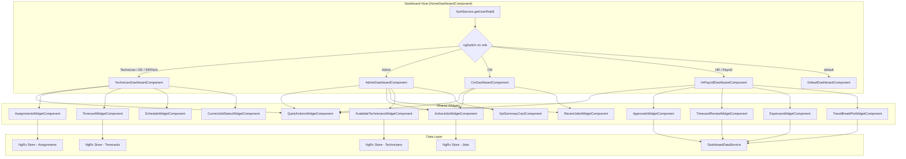

# Design Document: Role-Based Dashboard

## Overview

This design transforms the existing `HomeDashboardComponent` into a role-aware dashboard host that dynamically renders role-specific child views. The host component uses `AuthService.getUserRole()` to detect the current user's role and delegates rendering to one of four specialized dashboard components via `ngSwitch`. Each child dashboard composes a set of reusable widget components that fetch their own data independently from the NgRx store and existing services.

The approach preserves the existing route (`/field-resource-management/dashboard`) and component selector, so no routing changes are needed. The current monolithic template is replaced with a thin host that switches between `TechnicianDashboardComponent`, `AdminDashboardComponent`, `CmDashboardComponent`, and `HrPayrollDashboardComponent`. An unrecognized role falls back to a default view with a welcome message and quick actions.

## Architecture



## Components and Interfaces

### Component Hierarchy

```
HomeDashboardComponent (host)
├── TechnicianDashboardComponent
│   ├── QuickActionsWidgetComponent [actions: technicianActions]
│   ├── AssignmentsWidgetComponent
│   ├── TimecardWidgetComponent
│   ├── ScheduleWidgetComponent
│   └── CurrentJobStatusWidgetComponent
├── AdminDashboardComponent
│   ├── KpiSummaryCardComponent
│   ├── QuickActionsWidgetComponent [actions: adminActions]
│   ├── ActiveJobsWidgetComponent
│   ├── AvailableTechniciansWidgetComponent
│   └── RecentJobsWidgetComponent
├── CmDashboardComponent
│   ├── QuickActionsWidgetComponent [actions: cmActions]
│   ├── ActiveJobsWidgetComponent [marketFilter: user.market]
│   └── RecentJobsWidgetComponent [marketFilter: user.market]
├── HrPayrollDashboardComponent
│   ├── QuickActionsWidgetComponent [actions: hrPayrollActions]
│   ├── ApprovalsWidgetComponent
│   ├── TimecardReviewWidgetComponent
│   ├── ExpensesWidgetComponent
│   └── TravelBreakPtoWidgetComponent
└── DefaultDashboardComponent
    └── QuickActionsWidgetComponent [actions: defaultActions]
```

### Host Component

The `HomeDashboardComponent` is refactored to become a thin host:

```typescript
// home-dashboard.component.ts (refactored)
interface DashboardHost {
  currentRole$: Observable<UserRole>;
  isFieldRole(role: UserRole): boolean;
}
```

Template pattern:
```html
<ng-container [ngSwitch]="currentRole$ | async as role">
  <app-technician-dashboard *ngSwitchCase="isFieldRole(role) ? role : ''">
  </app-technician-dashboard>
  <app-admin-dashboard *ngSwitchCase="UserRole.Admin">
  </app-admin-dashboard>
  <app-cm-dashboard *ngSwitchCase="UserRole.CM">
  </app-cm-dashboard>
  <app-hr-payroll-dashboard *ngSwitchCase="isHrPayrollRole(role) ? role : ''">
  </app-hr-payroll-dashboard>
  <app-default-dashboard *ngSwitchDefault>
  </app-default-dashboard>
</ng-container>
```

The host subscribes to `AuthService.getUserRole$()` to reactively detect role changes. Helper methods `isFieldRole()` and `isHrPayrollRole()` group related roles:

- `isFieldRole`: returns `true` for `Technician`, `DeploymentEngineer`, `SRITech`
- `isHrPayrollRole`: returns `true` for `HR`, `Payroll`

### Widget Component Interfaces

All widgets follow a consistent pattern: they accept configuration inputs, manage their own loading/error state, and emit events for navigation.

#### QuickActionsWidgetComponent

```typescript
interface QuickAction {
  label: string;
  icon: string;        // Material icon name
  route: string;       // Router link
  color: 'primary' | 'accent' | 'orange';
  visible: boolean;
}

@Input() actions: QuickAction[];
```

Each role-specific dashboard passes a different `actions` array. The widget renders `mat-raised-button` or `mat-stroked-button` elements in a flex grid.

#### ActiveJobsWidgetComponent

```typescript
@Input() marketFilter: string | null = null;  // CM passes user.market
@Output() jobSelected = new EventEmitter<string>();  // emits job ID

// Internal state
jobs$: Observable<Job[]>;
loading$: Observable<boolean>;
error: string | null;
```

Selects jobs with status `EnRoute`, `OnSite`, or `NotStarted` from the NgRx jobs store. When `marketFilter` is provided, filters by `job.market`. Displays job ID, client, site name, and status badge.

#### RecentJobsWidgetComponent

```typescript
@Input() marketFilter: string | null = null;
@Input() limit: number = 10;
@Output() jobSelected = new EventEmitter<string>();

// Internal: selects from store, sorts by updatedAt desc, applies market filter and limit
```

#### AssignmentsWidgetComponent

```typescript
@Output() assignmentSelected = new EventEmitter<string>();
@Output() viewAllClicked = new EventEmitter<void>();

// Internal: selects active assignments for current user from store
assignments$: Observable<Assignment[]>;
```

Displays assignment status indicator, job site name, and status text. Shows "No active assignments" empty state.

#### TimecardWidgetComponent

```typescript
@Output() viewTimecardClicked = new EventEmitter<void>();

// Internal: selects current period from timecard store
currentPeriod$: Observable<TimecardPeriod | null>;
```

Shows current pay period dates, total hours, and submission status.

#### ScheduleWidgetComponent

```typescript
@Output() viewScheduleClicked = new EventEmitter<void>();

// Internal: selects this week's jobs assigned to current user
scheduledJobs$: Observable<Job[]>;
```

#### CurrentJobStatusWidgetComponent

```typescript
// Internal: finds the user's assignment with status InProgress, loads related job
activeJob$: Observable<{ job: Job; assignment: Assignment } | null>;
```

Displays job status, site name, client. Shows "No active job" when null.

#### AvailableTechniciansWidgetComponent

```typescript
@Output() technicianSelected = new EventEmitter<string>();

// Internal: selects technicians not assigned to active jobs
availableTechnicians$: Observable<Technician[]>;
availableCount$: Observable<number>;
```

#### KpiSummaryCardComponent

```typescript
interface KpiItem {
  label: string;
  value: number | string;
  icon: string;
  trend?: 'positive' | 'negative' | 'neutral';
  color: 'primary' | 'success' | 'accent';
}

@Input() kpis: KpiItem[];
```

Renders a row of KPI hero cards using the existing `.kpi-hero-card` styling pattern.

#### ApprovalsWidgetComponent

```typescript
interface ApprovalCounts {
  pendingTimecards: number;
  pendingExpenses: number;
  pendingTravelRequests: number;
  pendingBreakRequests: number;
}

// Internal: fetches counts from DashboardDataService
counts$: Observable<ApprovalCounts>;
```

#### TimecardReviewWidgetComponent

```typescript
@Output() timecardSelected = new EventEmitter<string>();

// Internal: fetches pending timecards from DashboardDataService, sorted by submission date desc
pendingTimecards$: Observable<PendingTimecard[]>;
```

#### ExpensesWidgetComponent

```typescript
@Output() expenseSelected = new EventEmitter<string>();

// Internal: fetches pending expenses from DashboardDataService, sorted by submission date desc
pendingExpenses$: Observable<PendingExpense[]>;
```

#### TravelBreakPtoWidgetComponent

```typescript
// Internal: fetches summary from DashboardDataService
summary$: Observable<TravelBreakPtoSummary>;
```

### Widget Loading and Error Pattern

Every widget that fetches data implements a consistent loading/error pattern:

```typescript
// Shared across all data-fetching widgets
interface WidgetState<T> {
  data: T | null;
  loading: boolean;
  error: string | null;
}

// Template pattern used in each widget:
// <mat-spinner *ngIf="loading" diameter="40"></mat-spinner>
// <div *ngIf="error" class="widget-error">
//   <p>Unable to load data. Please try again.</p>
//   <button mat-button (click)="retry()">Retry</button>
// </div>
// <ng-container *ngIf="!loading && !error"> ... data content ... </ng-container>
```

Each widget loads data independently. A failure in one widget does not block others.

### DashboardDataService

A new service to aggregate data for HR/Payroll widgets that don't have existing NgRx store slices:

```typescript
@Injectable({ providedIn: 'root' })
class DashboardDataService {
  getApprovalCounts(): Observable<ApprovalCounts>;
  getPendingTimecards(): Observable<PendingTimecard[]>;
  getPendingExpenses(): Observable<PendingExpense[]>;
  getTravelBreakPtoSummary(): Observable<TravelBreakPtoSummary>;
}
```

This service calls existing API endpoints via `HttpClient` and is consumed only by the HR/Payroll dashboard widgets. The Technician, Admin, and CM dashboards rely entirely on existing NgRx selectors.

## Data Models

### New Interfaces (dashboard.models.ts)

```typescript
/** Quick action button configuration */
export interface QuickAction {
  label: string;
  icon: string;
  route: string;
  color: 'primary' | 'accent' | 'orange';
  visible: boolean;
}

/** KPI display item */
export interface KpiItem {
  label: string;
  value: number | string;
  icon: string;
  trend?: 'positive' | 'negative' | 'neutral';
  color: 'primary' | 'success' | 'accent';
}

/** Approval counts for HR/Payroll dashboard */
export interface ApprovalCounts {
  pendingTimecards: number;
  pendingExpenses: number;
  pendingTravelRequests: number;
  pendingBreakRequests: number;
}

/** Pending timecard for review */
export interface PendingTimecard {
  id: string;
  technicianName: string;
  periodStart: Date;
  periodEnd: Date;
  totalHours: number;
  submittedAt: Date;
  status: string;
}

/** Pending expense for review */
export interface PendingExpense {
  id: string;
  submittedBy: string;
  amount: number;
  type: string;
  submittedAt: Date;
  description: string;
}

/** Travel/Break/PTO summary */
export interface TravelBreakPtoSummary {
  pendingTravelRequests: number;
  pendingBreakRequests: number;
  pendingPtoRequests: number;
}

/** Generic widget state wrapper */
export interface WidgetState<T> {
  data: T | null;
  loading: boolean;
  error: string | null;
}

/** Role-to-dashboard mapping type */
export type DashboardView = 'technician' | 'admin' | 'cm' | 'hr-payroll' | 'default';
```

### Existing Models Reused

- `Job`, `JobStatus` from `job.model.ts` — used by ActiveJobsWidget, RecentJobsWidget, ScheduleWidget, CurrentJobStatusWidget
- `Assignment`, `AssignmentStatus` from `assignment.model.ts` — used by AssignmentsWidget
- `Technician` from `technician.model.ts` — used by AvailableTechniciansWidget
- `TimecardEntry`, `TimecardStatus` from `timecard.model.ts` — used by TimecardWidget
- `UserRole` from `role.enum.ts` — used by host for role switching
- `User` from `user.model.ts` — `user.market` used for CM market filtering

### Role-to-Dashboard Mapping Logic

```typescript
function resolveDashboardView(role: UserRole | null | undefined): DashboardView {
  if (role == null) return 'default';
  switch (role) {
    case UserRole.Technician:
    case UserRole.DeploymentEngineer:
    case UserRole.SRITech:
      return 'technician';
    case UserRole.Admin:
      return 'admin';
    case UserRole.CM:
      return 'cm';
    case UserRole.HR:
    case UserRole.Payroll:
      return 'hr-payroll';
    default:
      return 'default';
  }
}
```

### NgRx Selectors Used Per Dashboard

| Dashboard   | Selectors                                                                                                  |
|-------------|-----------------------------------------------------------------------------------------------------------|
| Technician  | `selectAllAssignments`, `selectCurrentPeriod`, `selectThisWeeksJobs`, `selectActiveAssignments`            |
| Admin       | `selectActiveJobs`, `selectAvailableTechniciansCount`, `selectRecentJobs`, `selectJobStatistics`           |
| CM          | `selectJobsByRegion(market)`, `selectRecentJobs` (filtered), `selectActiveJobs` (filtered)                 |
| HR/Payroll  | None (uses `DashboardDataService` HTTP calls)                                                              |


## Correctness Properties

*A property is a characteristic or behavior that should hold true across all valid executions of a system — essentially, a formal statement about what the system should do. Properties serve as the bridge between human-readable specifications and machine-verifiable correctness guarantees.*

### Property 1: Role-to-dashboard mapping is total and correct

*For any* value of `UserRole` (including `null` and `undefined`), `resolveDashboardView(role)` shall return exactly one of `'technician'`, `'admin'`, `'cm'`, `'hr-payroll'`, or `'default'`, and the returned value shall match the mapping defined in Requirement 1: field roles → technician, Admin → admin, CM → cm, HR/Payroll → hr-payroll, all others (including null/undefined) → default.

**Validates: Requirements 1.2, 1.5, 1.6, 1.7**

### Property 2: Assignments widget shows only active assignments for the current user

*For any* set of assignments and any technician ID, the AssignmentsWidget shall display exactly those assignments where `isActive === true` and `technicianId` matches the current user's ID. The result set shall be a subset of the input and shall contain no inactive or other-user assignments.

**Validates: Requirements 2.2**

### Property 3: Schedule widget shows only current-week jobs

*For any* set of jobs, the ScheduleWidget shall display only jobs whose `scheduledStartDate` falls within the current week boundaries (Sunday 00:00:00 through Saturday 23:59:59). No job outside this range shall appear.

**Validates: Requirements 2.4**

### Property 4: Active jobs widget filters by status correctly

*For any* set of jobs, the ActiveJobsWidget shall include exactly those jobs whose status is `EnRoute`, `OnSite`, or `NotStarted`. No job with status `Completed`, `Cancelled`, or `Issue` shall appear in the result.

**Validates: Requirements 3.1**

### Property 5: Available technicians are those with no active assignment

*For any* set of technicians and assignments, the AvailableTechniciansWidget shall display exactly those active technicians who have zero active assignments. The count displayed shall equal the length of this filtered list.

**Validates: Requirements 3.2**

### Property 6: Recent jobs widget returns at most N jobs sorted by updatedAt descending, optionally filtered by market

*For any* set of jobs, optional market filter string, and limit N, the RecentJobsWidget shall return at most N jobs. If a market filter is provided and is non-empty, only jobs where `job.market` equals the filter shall be included. The returned list shall be sorted by `updatedAt` in descending order (most recent first).

**Validates: Requirements 3.4, 4.4**

### Property 7: CM market filtering returns only jobs in the CM's market

*For any* set of jobs and any non-empty market string, the ActiveJobsWidget with `marketFilter` set shall return only jobs where `job.market` equals the provided market. When market is null or empty, all active jobs shall be returned without filtering.

**Validates: Requirements 4.1, 4.5**

### Property 8: KPI summary values are correctly computed from source data

*For any* set of jobs and technician-assignment pairs, the KPI summary card shall display: active jobs count equal to the number of jobs with status in {EnRoute, OnSite, NotStarted}, available technicians count equal to the number of active technicians with zero active assignments, and utilization percentage equal to (assigned technicians / total active technicians) × 100.

**Validates: Requirements 3.5**

### Property 9: Pending timecards are sorted by submission date descending

*For any* list of pending timecards, the TimecardReviewWidget shall display them sorted by `submittedAt` in descending order. For every adjacent pair (i, i+1) in the displayed list, `list[i].submittedAt >= list[i+1].submittedAt`.

**Validates: Requirements 5.2**

### Property 10: Pending expenses are sorted by submission date descending

*For any* list of pending expenses, the ExpensesWidget shall display them sorted by `submittedAt` in descending order. For every adjacent pair (i, i+1) in the displayed list, `list[i].submittedAt >= list[i+1].submittedAt`.

**Validates: Requirements 5.3**

### Property 11: HR role permissions are restricted to approval-only capabilities

*For any* permission key in the FrmPermissionService, when the role is `HR`, `hasPermission` shall return `true` only for keys in {canApproveExpense, canApproveTravelRequest, canApproveTimecard, canApproveBreakRequest} and `false` for all other permission keys.

**Validates: Requirements 5.6**

### Property 12: Widget data loading independence

*For any* dashboard view containing multiple widgets, if one widget's data source throws an error, all other widgets on the same dashboard shall still successfully load and display their data. The error shall be contained within the failing widget only.

**Validates: Requirements 6.4**

## Error Handling

| Scenario | Handling |
|---|---|
| `AuthService.getUserRole$()` emits `null` / `undefined` | Host renders default dashboard; logs `console.warn` with message |
| Widget HTTP request fails (4xx/5xx) | Widget shows "Unable to load data. Please try again." with a Retry button; other widgets unaffected |
| Widget retry clicked | Widget resets error state, re-subscribes to data source |
| NgRx selector returns empty array | Widget shows its empty-state message (e.g., "No active assignments") |
| CM user has null/empty `market` | CM dashboard shows all jobs unfiltered; logs `console.warn` |
| Unknown `UserRole` enum value | `resolveDashboardView` returns `'default'`; default dashboard rendered |
| `FrmPermissionService.getPermissionsForRole` receives unknown role | Returns all-false permission set (existing behavior) |

## Testing Strategy

### Unit Tests

Unit tests cover specific examples, edge cases, and integration points:

- `resolveDashboardView` returns correct view for each specific role (Admin, CM, HR, Payroll, Technician, DeploymentEngineer, SRITech, null, undefined)
- Host component renders the correct child component for a given role (shallow render tests)
- Each role-specific dashboard includes the correct set of widgets in its template
- QuickActionsWidget renders the correct buttons for each role's action configuration
- Empty state messages display when data arrays are empty
- Error state displays "Unable to load data" message and retry button
- Retry button re-triggers data fetch
- CM dashboard with null market shows all jobs and logs warning
- HR quick actions exclude payroll-specific links; Payroll quick actions include them

### Property-Based Tests

Property-based tests use `fast-check` (already available in the Angular ecosystem via npm) with a minimum of 100 iterations per property. Each test references its design property.

| Test | Property | Library |
|---|---|---|
| Role mapping is total and correct | Property 1 | fast-check |
| Assignments filtered to active + current user | Property 2 | fast-check |
| Schedule filtered to current week | Property 3 | fast-check |
| Active jobs filtered by status | Property 4 | fast-check |
| Available technicians have no active assignments | Property 5 | fast-check |
| Recent jobs sorted desc with limit and optional market | Property 6 | fast-check |
| CM market filter correctness | Property 7 | fast-check |
| KPI computation correctness | Property 8 | fast-check |
| Pending timecards sorted by submittedAt desc | Property 9 | fast-check |
| Pending expenses sorted by submittedAt desc | Property 10 | fast-check |
| HR permissions restricted to approval keys | Property 11 | fast-check |
| Widget independence under failure | Property 12 | fast-check |

Each property test must be tagged with a comment:
```typescript
// Feature: role-based-dashboard, Property 1: Role mapping is total and correct
```

Property tests validate pure functions and selectors (e.g., `resolveDashboardView`, filtering/sorting logic, permission checks). Integration tests with Angular TestBed cover component rendering and widget composition.
