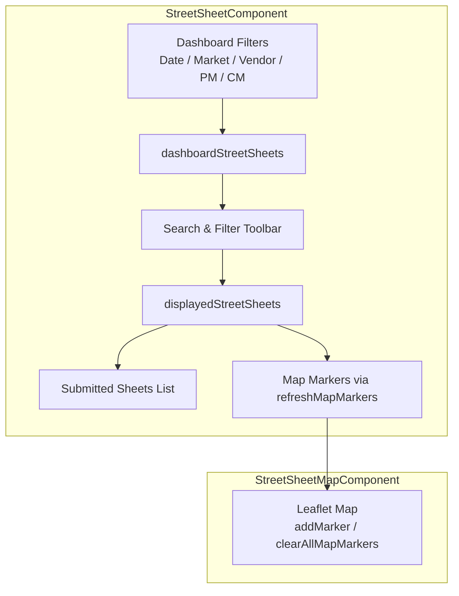
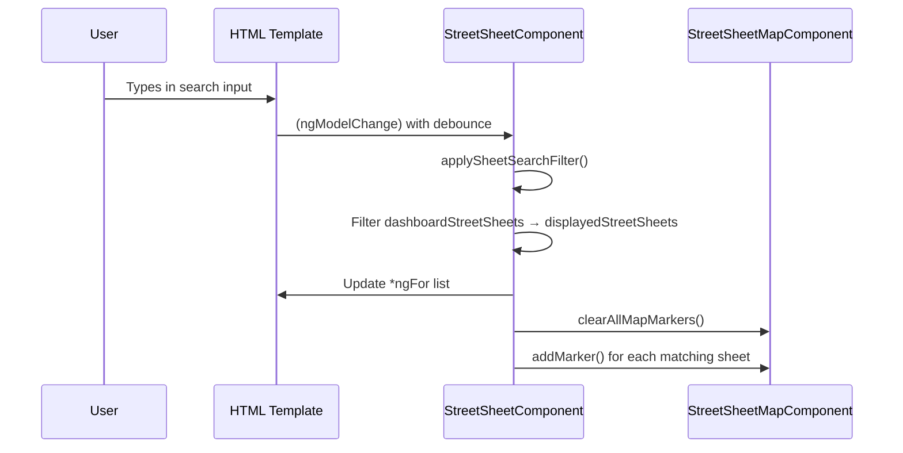
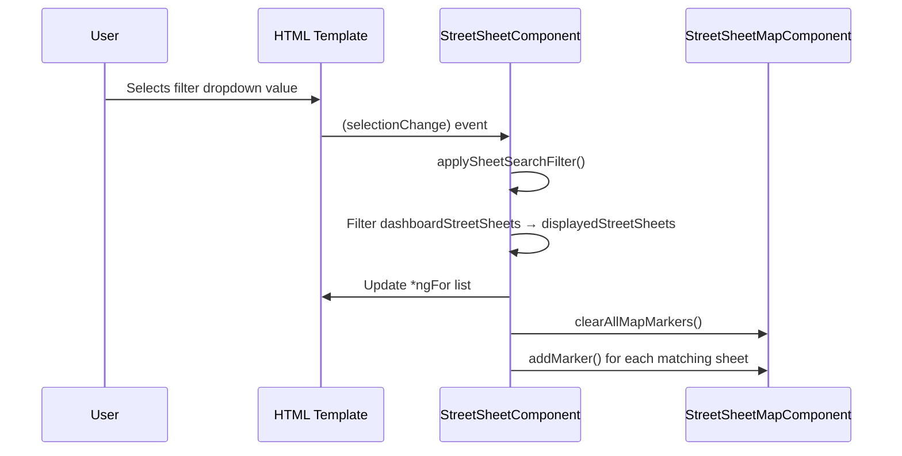

# Design Document: Street Sheet Search & Filter

## Overview

The Street Sheet Map page currently displays 110+ submitted sheets in a scrollable list alongside a Leaflet map. Users have no way to quickly locate a specific sheet by vendor name, segment ID, address, or other fields without manually scrolling. This feature adds a search/filter toolbar to the "Submitted Sheets" panel that filters both the list and the map markers in real-time, enabling fast lookup across all searchable street sheet fields.

The solution integrates into the existing `StreetSheetComponent` by adding a search input and optional dropdown filters above the sheets list. Filtering is performed client-side against the already-loaded `dashboardStreetSheets` array, keeping the implementation lightweight with no additional API calls.

## Architecture



## Sequence Diagrams

### Search Input Flow



### Filter Dropdown Flow



## Components and Interfaces

### Search/Filter Toolbar (inline in StreetSheetComponent template)

**Purpose**: Provides a text search input and optional dropdown filters above the Submitted Sheets list panel.

**Responsibilities**:
- Render a search text input with placeholder text
- Render optional dropdown filters for vendor, state/market, and created-by
- Emit filter changes to the component on input/selection
- Show a clear button when any filter is active
- Display count of matching results

### StreetSheetComponent (modified)

**Purpose**: Orchestrates filtering logic and keeps the list and map in sync.

**New Properties**:
```typescript
// Search/filter state for the sheets list panel
sheetSearchText: string = '';
sheetFilterVendor: string = '';
sheetFilterState: string = '';
sheetFilterCreatedBy: string = '';
displayedStreetSheets: StreetSheet[] = [];
```

**New Methods**:
```typescript
applySheetSearchFilter(): void
clearSheetSearchFilter(): void
hasActiveSheetFilter(): boolean
```

## Data Models

### StreetSheet (existing, no changes)

```typescript
interface StreetSheet {
  id: string;
  segmentId: string;
  pm?: string;
  vendorName: string;
  streetAddress: string;
  city: string;
  state: string;
  deployment: string;
  equipment: string;
  date: Date;
  additionalConcerns: string;
  createdBy?: string;
  marker: MapMarker[];
}
```

**Searchable fields** (text search matches against all of these):
- `segmentId`
- `vendorName`
- `streetAddress`
- `city`
- `state`
- `deployment`
- `pm`
- `createdBy`

**Filterable fields** (dropdown exact-match):
- `vendorName` → uses existing `vendorOptions`
- `state` → uses existing `filteredLocations`
- `createdBy` → uses existing `uniqueCreatedByUsers`


## Key Functions with Formal Specifications

### Function 1: applySheetSearchFilter()

```typescript
applySheetSearchFilter(): void {
  let results = this.dashboardStreetSheets;

  // Text search across multiple fields
  if (this.sheetSearchText.trim()) {
    const term = this.sheetSearchText.trim().toLowerCase();
    results = results.filter(sheet =>
      sheet.segmentId?.toLowerCase().includes(term) ||
      sheet.vendorName?.toLowerCase().includes(term) ||
      sheet.streetAddress?.toLowerCase().includes(term) ||
      sheet.city?.toLowerCase().includes(term) ||
      sheet.state?.toLowerCase().includes(term) ||
      sheet.deployment?.toLowerCase().includes(term) ||
      sheet.pm?.toLowerCase().includes(term) ||
      sheet.createdBy?.toLowerCase().includes(term)
    );
  }

  // Dropdown filters (exact match)
  if (this.sheetFilterVendor) {
    results = results.filter(sheet =>
      sheet.vendorName?.toLowerCase() === this.sheetFilterVendor.toLowerCase()
    );
  }

  if (this.sheetFilterState) {
    results = results.filter(sheet =>
      sheet.state?.toLowerCase() === this.sheetFilterState.toLowerCase()
    );
  }

  if (this.sheetFilterCreatedBy) {
    results = results.filter(sheet =>
      sheet.createdBy?.toLowerCase() === this.sheetFilterCreatedBy.toLowerCase()
    );
  }

  this.displayedStreetSheets = results;
  this.refreshMapMarkers();
}
```

**Preconditions:**
- `this.dashboardStreetSheets` is a valid array (may be empty)
- Filter values are strings (may be empty)

**Postconditions:**
- `this.displayedStreetSheets` is a subset of `this.dashboardStreetSheets`
- If all filters are empty, `displayedStreetSheets` equals `dashboardStreetSheets`
- Map markers reflect only the sheets in `displayedStreetSheets`
- Original `dashboardStreetSheets` array is not mutated

**Loop Invariants:**
- Each filter pass produces a subset of the previous result set
- Filter order does not affect the final result (filters are commutative)

### Function 2: clearSheetSearchFilter()

```typescript
clearSheetSearchFilter(): void {
  this.sheetSearchText = '';
  this.sheetFilterVendor = '';
  this.sheetFilterState = '';
  this.sheetFilterCreatedBy = '';
  this.applySheetSearchFilter();
}
```

**Preconditions:**
- Component is initialized

**Postconditions:**
- All filter values are reset to empty strings
- `displayedStreetSheets` equals `dashboardStreetSheets`
- Map shows all markers from `dashboardStreetSheets`

### Function 3: hasActiveSheetFilter()

```typescript
hasActiveSheetFilter(): boolean {
  return !!(
    this.sheetSearchText.trim() ||
    this.sheetFilterVendor ||
    this.sheetFilterState ||
    this.sheetFilterCreatedBy
  );
}
```

**Preconditions:**
- Filter properties are defined strings

**Postconditions:**
- Returns `true` if any filter has a non-empty value
- Returns `false` if all filters are empty/whitespace

### Function 4: refreshMapMarkers() (modified)

The existing `refreshMapMarkers()` method must be updated to use `displayedStreetSheets` instead of `dashboardStreetSheets` when sheet search filters are active.

```typescript
private refreshMapMarkers(): void {
  if (!this.streetSheetMapComponent) return;
  this.streetSheetMapComponent.clearAllMapMarkers();
  const sheetsToShow = this.hasActiveSheetFilter()
    ? this.displayedStreetSheets
    : this.dashboardStreetSheets;
  sheetsToShow.forEach(sheet => {
    if (Array.isArray(sheet.marker)) {
      sheet.marker.forEach(marker => {
        this.streetSheetMapComponent.addMarker(marker, sheet);
      });
    }
  });
}
```

**Preconditions:**
- `streetSheetMapComponent` ViewChild may or may not be initialized
- `displayedStreetSheets` and `dashboardStreetSheets` are valid arrays

**Postconditions:**
- Map displays markers only for sheets in the active result set
- Previous markers are cleared before new ones are added

## Algorithmic Pseudocode

### Main Filtering Algorithm

```typescript
ALGORITHM applySheetSearchFilter(dashboardSheets, searchText, vendorFilter, stateFilter, createdByFilter)
INPUT: dashboardSheets: StreetSheet[], searchText: string, vendorFilter: string, stateFilter: string, createdByFilter: string
OUTPUT: displayedSheets: StreetSheet[]

BEGIN
  results ← dashboardSheets

  // Phase 1: Text search (OR across fields)
  IF searchText.trim() is not empty THEN
    term ← searchText.trim().toLowerCase()
    results ← results.filter(sheet =>
      ANY of [segmentId, vendorName, streetAddress, city, state, deployment, pm, createdBy]
      contains term (case-insensitive)
    )
  END IF

  // Phase 2: Dropdown filters (AND between filters, exact match)
  IF vendorFilter is not empty THEN
    results ← results.filter(sheet => sheet.vendorName equals vendorFilter, case-insensitive)
  END IF

  IF stateFilter is not empty THEN
    results ← results.filter(sheet => sheet.state equals stateFilter, case-insensitive)
  END IF

  IF createdByFilter is not empty THEN
    results ← results.filter(sheet => sheet.createdBy equals createdByFilter, case-insensitive)
  END IF

  ASSERT results is subset of dashboardSheets
  ASSERT results.length <= dashboardSheets.length

  RETURN results
END
```

**Preconditions:**
- dashboardSheets is a valid array of StreetSheet objects
- All filter parameters are strings

**Postconditions:**
- Output is a subset of dashboardSheets
- Text search matches any field (OR logic)
- Dropdown filters combine with AND logic
- Empty filters are skipped (no filtering effect)

**Loop Invariants:**
- After each filter phase, results.length <= previous results.length
- All items in results satisfy all previously applied filters

## Example Usage

```typescript
// Example 1: User types "oak" in search box
// Matches sheets where segmentId, address, vendor, city, etc. contain "oak"
component.sheetSearchText = 'oak';
component.applySheetSearchFilter();
// displayedStreetSheets now contains only sheets matching "oak"
// Map shows only markers for those sheets

// Example 2: User selects vendor "Acme Corp" from dropdown
component.sheetFilterVendor = 'Acme Corp';
component.applySheetSearchFilter();
// displayedStreetSheets filtered to Acme Corp sheets only

// Example 3: Combined search + filter
component.sheetSearchText = 'main st';
component.sheetFilterState = 'UT';
component.applySheetSearchFilter();
// Shows only sheets in Utah with "main st" in any searchable field

// Example 4: Clear all filters
component.clearSheetSearchFilter();
// displayedStreetSheets === dashboardStreetSheets, all markers restored
```

## Correctness Properties

*A property is a characteristic or behavior that should hold true across all valid executions of a system — essentially, a formal statement about what the system should do. Properties serve as the bridge between human-readable specifications and machine-verifiable correctness guarantees.*

### Property 1: Text search returns only matching sheets

*For any* array of street sheets and any non-empty search term, every sheet in the filtered result contains the search term as a case-insensitive substring in at least one of the eight Searchable Fields (segmentId, vendorName, streetAddress, city, state, deployment, pm, createdBy).

**Validates: Requirements 1.2**

### Property 2: Dropdown filters return only exact-matching sheets

*For any* array of street sheets and any combination of active dropdown filter values (vendor, state, createdBy), every sheet in the filtered result has field values that match each active filter via case-insensitive exact comparison, and filters combine with AND logic.

**Validates: Requirements 2.2, 2.3, 2.4, 2.5**

### Property 3: Subset property

*For any* array of dashboard street sheets and any combination of search text and dropdown filter values, the resulting displayed sheets array is a subset of the dashboard street sheets array.

**Validates: Requirement 3.3**

### Property 4: Identity property

*For any* array of dashboard street sheets, when the search text is empty (or whitespace-only) and all dropdown filters are empty, the displayed sheets array equals the dashboard street sheets array.

**Validates: Requirements 1.3, 1.4, 4.3**

### Property 5: Filter commutativity

*For any* array of street sheets and any set of filter values, applying the text search and dropdown filters in any order produces the same resulting set of sheets.

**Validates: Requirement 3.2**

### Property 6: Filter idempotency

*For any* array of street sheets and any set of filter values, applying the filter function twice with the same inputs produces identical output.

**Validates: Requirement 3.4**

### Property 7: Clear resets to identity

*For any* prior filter state, calling clearSheetSearchFilter sets all filter values to empty strings and produces displayed sheets equal to dashboard sheets.

**Validates: Requirements 4.2, 4.3**

### Property 8: hasActiveSheetFilter correctness

*For any* combination of filter values, hasActiveSheetFilter returns true if and only if at least one filter value is a non-empty, non-whitespace string.

**Validates: Requirements 4.1, 4.4**

### Property 9: Map-list synchronization

*For any* set of displayed sheets after filtering, the map markers correspond exactly to the markers of the sheets in the displayed sheets array — no more, no fewer.

**Validates: Requirements 6.1, 6.2**

### Property 10: Non-mutation of source array

*For any* filter operation, the dashboardStreetSheets array is not modified — its length and contents remain identical before and after filtering.

**Validates: Requirement 8.2**

### Property 11: Null-safe filtering

*For any* street sheet with null or undefined values in searchable or filterable fields, the filter engine completes without error, skips null fields during text search, and excludes the sheet from dropdown filter matches on that field.

**Validates: Requirements 7.1, 7.2**

### Property 12: Case insensitivity

*For any* search term, searching with the uppercase version and the lowercase version of that term produces identical result sets.

**Validates: Requirements 1.2, 2.2, 2.3, 2.4**

## Error Handling

### Empty Search Results

**Condition**: All sheets filtered out by search/filter criteria
**Response**: Display "No matching street sheets found." message in the list panel; map shows no markers
**Recovery**: User can clear filters via the clear button or modify search text

### Null/Undefined Fields

**Condition**: A street sheet has null or undefined values for searchable fields
**Response**: Optional chaining (`?.`) ensures null fields are safely skipped during comparison
**Recovery**: No action needed; sheets with null fields simply won't match on those fields

### Dashboard Filter Interaction

**Condition**: Dashboard-level filters (date range, market, vendor, PM, CM) change while sheet search is active
**Response**: `refreshDashboardData()` updates `dashboardStreetSheets`, then `applySheetSearchFilter()` is re-run to recompute `displayedStreetSheets`
**Recovery**: Automatic; the sheet search filter always operates on the current `dashboardStreetSheets`

## Testing Strategy

### Unit Testing Approach

- Test `applySheetSearchFilter()` with various combinations of search text and dropdown filters
- Test that empty filters return the full `dashboardStreetSheets` array
- Test case-insensitive matching
- Test partial string matching for text search
- Test that `clearSheetSearchFilter()` resets all filter values and restores full list
- Test `hasActiveSheetFilter()` returns correct boolean for various filter states

### Integration Testing Approach

- Verify that typing in the search input updates the displayed list
- Verify that selecting a dropdown filter updates both list and map
- Verify that clearing filters restores the full list and all map markers
- Verify interaction between dashboard-level filters and sheet search filters
- Verify clicking a filtered sheet still centers the map correctly

## Performance Considerations

- Client-side filtering on 110+ items is negligible in cost; no debounce strictly required but a ~200ms debounce on the text input improves UX by avoiding flicker during fast typing
- `refreshMapMarkers()` clears and re-adds all markers on each filter change; for 100-200 markers this is acceptable. If the dataset grows significantly (1000+), consider using Leaflet marker clustering or diffing
- No additional API calls are made; filtering operates on the already-fetched `dashboardStreetSheets` array

## Dependencies

- Angular Material (`MatFormField`, `MatInput`, `MatSelect`, `MatOption`, `MatIcon`, `MatButton`) — already in use
- Angular FormsModule (`ngModel`) — already in use
- No new external dependencies required
