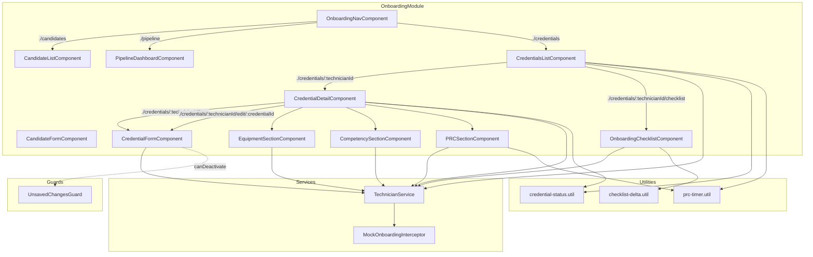

# Design Document: Tech Credentials Onboarding

## Overview

This feature adds a "Tech Credentials" tab to the existing Onboarding navigation, enabling operations managers to view, add, edit, and delete credentials for existing technicians without leaving the onboarding workflow. The implementation leverages the existing `Certification` interface (with `id`, `name`, `issueDate`, `expirationDate`, `status`) and `TechnicianService` API methods, extending the onboarding module with new components and routes that follow established architectural patterns.

Beyond basic credential CRUD, the feature provides:
- **Typed credentials** with type-specific fields (Drivers License, Drug Screen, OSHA Training Cert, Offer Letter, Background Check, SSN Last Four)
- **Onboarding checklist** with delta tracking — comparing required items per role against what's on file
- **Equipment tracking** — badges, laptops, assignment/return workflow
- **Technical competency tracking** — OTDR Knowledge, Fiber Optic Characterization, proficiency levels
- **PRC (Performance Review Cycle) goals and timer** — 60-day cadence, goals, upcoming/overdue indicators

The feature introduces eight components:
1. **CredentialsListComponent** — filterable list of technicians with credential summaries, completion %, and PRC indicators
2. **CredentialDetailComponent** — detail view of all credentials, equipment, competencies, and PRC for a single technician
3. **CredentialFormComponent** — reactive form for adding/editing typed credentials
4. **OnboardingChecklistComponent** — role-based checklist showing delta between required and on-file items
5. **EquipmentSectionComponent** — equipment assignment/return management within the detail view
6. **CompetencySectionComponent** — technical competency tracking within the detail view
7. **PRCSectionComponent** — PRC goals and timer display within the detail view
8. A credential status computation utility and checklist delta computation utility used across components

All components follow the existing inline template/style pattern and integrate with the existing `OnboardingModule`, `OnboardingRoutingModule`, and `MockOnboardingInterceptor`.

## Architecture



### Design Decisions

1. **Reuse TechnicianService** — The existing service already has `getTechnicians()`, `getTechnicianById()`, and `getTechnicianCertifications()` methods. We extend it with credential CRUD, equipment CRUD, competency CRUD, and PRC CRUD methods rather than creating new services.

2. **Credential status computation as a pure utility function** — Status computation (Active/ExpiringSoon/Expired) is a pure function of the expiration date and current date. Extracting it into a standalone utility function makes it testable and reusable across components.

3. **Checklist delta computation as a pure utility function** — The delta between a `RoleCredentialTemplate` and a technician's on-file items is a pure function. This enables property-based testing of the core onboarding gap logic.

4. **PRC timer computation as a pure utility function** — Computing due dates (start + 60 days) and PRC status (upcoming/overdue/completed) is pure date arithmetic, extracted for testability.

5. **Discriminated union for TypedCredential** — Each credential type has different required fields. A TypeScript discriminated union on the `credentialType` field provides compile-time safety and enables the form to dynamically show/hide fields based on type selection.

6. **Extend MockOnboardingInterceptor** — Rather than creating a separate interceptor, we extend the existing one to handle `/technicians/` certification, equipment, competency, and PRC endpoints, keeping mock data management centralized.

7. **Inline templates/styles** — Following the existing project pattern, all new components use inline templates and styles rather than separate HTML/CSS files.

8. **Debounced search with RxJS** — The 300ms debounce on the search field uses `Subject` with `debounceTime` operator, consistent with reactive patterns already in the project.

9. **Section components as child components of CredentialDetailComponent** — Equipment, Competency, and PRC sections are separate components rendered within the detail view via `@Input()` bindings, keeping the detail component manageable and each section independently testable.

10. **OnboardingChecklistComponent as a separate routed view** — The checklist is a distinct view (not embedded in the detail) because it aggregates across credentials, equipment, competencies, and PRC — providing a holistic onboarding status at a glance.

## Components and Interfaces

### CredentialsListComponent

**Selector:** `app-credentials-list`

**Responsibilities:**
- Load all technicians via `TechnicianService.getTechnicians()`
- Load certifications for each technician via `TechnicianService.getTechnicianCertifications()`
- Display technician name, email, region, and credential status counts (Active, ExpiringSoon, Expired)
- Display onboarding completion percentage per technician
- Display PRC indicators ("Upcoming PRC", "Overdue PRC") per technician
- Provide text search (debounced 300ms) filtering by name or email
- Provide status filter dropdown (All, Active, ExpiringSoon, Expired)
- Provide "Incomplete Onboarding" filter (technicians with Missing or Expired required items)
- Provide "Missing Equipment" filter (technicians missing required equipment)
- Provide "Overdue PRC" filter (technicians with overdue PRCs)
- Navigate to credential detail on technician selection
- Navigate to onboarding checklist via checklist icon/button
- Display "No technicians match the current filters." when filters yield no results
- Display "No Credentials" badge for technicians with zero credentials
- Display error state with retry button on load failure

**Inputs:** None (route-activated)

**Outputs:** Navigation via Router

### CredentialDetailComponent

**Selector:** `app-credential-detail`

**Responsibilities:**
- Read `technicianId` from route params
- Load technician info, typed credentials, equipment, competencies, and PRC data
- Display each credential with name, type, issue date, expiration date, and status
- Color-code by status: green (Active), amber (ExpiringSoon), red (Expired)
- Sort credentials: Expired first, then ExpiringSoon, then Active
- Provide "Add Credential" button navigating to the new credential form
- Provide "Edit" and "Delete" actions per credential
- Show confirmation dialog on delete with "Are you sure you want to delete this credential? This action cannot be undone."
- Display "No credentials on file" message with add button when empty
- Render child section components: EquipmentSectionComponent, CompetencySectionComponent, PRCSectionComponent
- Display error state with retry button on load failure

**Inputs:** Route param `technicianId`

**Outputs:** Navigation via Router, deletion via TechnicianService

### CredentialFormComponent

**Selector:** `app-credential-form`

**Responsibilities:**
- Read `technicianId` and optional `credentialId` from route params
- If `credentialId` present, load existing credential and pre-populate form (edit mode)
- Provide credential type selector (Drivers_License, Drug_Screen, OSHA_Training_Cert, Offer_Letter, Background_Check, SSN_Last_Four)
- Dynamically show/hide type-specific fields based on selected credential type
- Provide reactive form with common fields: name (required), issueDate (required), expirationDate (required)
- Provide type-specific fields per credential type (see Data Models section)
- Validate required fields with inline error messages
- Cross-field validation: expirationDate must be after issueDate (for types that have both)
- SSN_Last_Four validation: exactly 4 numeric digits, masked after entry
- Compute and display credential status based on expiration date
- Implement `HasUnsavedChanges` interface for `UnsavedChangesGuard`
- On valid submit: call `addTechnicianCertification()` or `updateTechnicianCertification()`
- For Drug_Screen/OSHA_Training_Cert: also update legacy boolean fields on Candidate record
- Navigate back to credential detail view on success
- Display error message with retry on save failure

**Inputs:** Route params `technicianId`, `credentialId` (optional)

**Outputs:** Persistence via TechnicianService, navigation via Router

### OnboardingChecklistComponent

**Selector:** `app-onboarding-checklist`

**Responsibilities:**
- Read `technicianId` from route params
- Load the `RoleCredentialTemplate` for the technician's role
- Load the technician's on-file credentials, equipment, competencies, and PRC records
- Compute the delta: mark each required item as Complete, Missing, or Expired
- Display all required items grouped by category (Credentials, Equipment, Competencies, PRC)
- Display summary counts: Complete / Missing / Expired out of total
- Display completion percentage
- Display "Ready to Start" indicator when all items are Complete
- Provide links to add missing items (navigate to appropriate forms)
- Display "Not Verified" label with add link for missing competencies

**Inputs:** Route param `technicianId`

**Outputs:** Navigation via Router

### EquipmentSectionComponent

**Selector:** `app-equipment-section`

**Responsibilities:**
- Display all equipment assignments for the technician
- Show asset type, asset identifier, assignment date, return date, and status
- Provide "Assign Equipment" action to add new equipment
- Validate asset identifier uniqueness (no duplicate assigned assets across technicians)
- Provide "Mark as Returned" action to update status and set return date
- Provide "Mark as Lost" action to update status
- Display error state with retry on failure

**Inputs:** `@Input() technicianId: string`, `@Input() equipmentAssignments: EquipmentAssignment[]`

**Outputs:** `@Output() equipmentChanged: EventEmitter<void>` (triggers parent reload)

### CompetencySectionComponent

**Selector:** `app-competency-section`

**Responsibilities:**
- Display all technical competencies for the technician
- Sort by proficiency level: Expert first, then Advanced, Intermediate, Beginner
- Show competency name, verification date, verified by, proficiency level, and notes
- Provide "Add Competency" action with form (name, verification date, verified by, proficiency level, notes)
- Support predefined competency names ("OTDR Knowledge", "Fiber Optic Characterization / OTDR Testing") and custom names
- Display error state with retry on failure

**Inputs:** `@Input() technicianId: string`, `@Input() competencies: TechnicalCompetency[]`

**Outputs:** `@Output() competencyChanged: EventEmitter<void>` (triggers parent reload)

### PRCSectionComponent

**Selector:** `app-prc-section`

**Responsibilities:**
- Display current PRC status, due date, and associated goals
- Show PRC status indicator: "Upcoming" (within 14 days), "Overdue" (past due, not completed), "Completed"
- Display PRC goals with description, target date, status, and completion notes
- Provide "Add Goal" action to add a new PRC goal
- Provide "Mark PRC Complete" action to complete the current PRC and compute next due date
- Provide "Update Goal Status" action to change goal status (not_started → in_progress → completed)
- Display error state with retry on failure

**Inputs:** `@Input() technicianId: string`, `@Input() prc: PRC | null`

**Outputs:** `@Output() prcChanged: EventEmitter<void>` (triggers parent reload)

### OnboardingNavComponent (Modified)

**Change:** Add a third entry to the `navLinks` array:
```typescript
{ label: 'Tech Credentials', route: './credentials' }
```

### TechnicianService (Extended)

**New Credential Methods:**

```typescript
addTechnicianCertification(technicianId: string, certification: Omit<TypedCredential, 'id'>): Observable<TypedCredential>
updateTechnicianCertification(technicianId: string, certificationId: string, certification: Partial<TypedCredential>): Observable<TypedCredential>
deleteTechnicianCertification(technicianId: string, certificationId: string): Observable<void>
```

**New Equipment Methods:**

```typescript
getTechnicianEquipment(technicianId: string): Observable<EquipmentAssignment[]>
assignEquipment(technicianId: string, equipment: Omit<EquipmentAssignment, 'id'>): Observable<EquipmentAssignment>
updateEquipmentAssignment(technicianId: string, equipmentId: string, update: Partial<EquipmentAssignment>): Observable<EquipmentAssignment>
validateAssetUniqueness(assetIdentifier: string, excludeTechnicianId?: string): Observable<boolean>
```

**New Competency Methods:**

```typescript
getTechnicianCompetencies(technicianId: string): Observable<TechnicalCompetency[]>
addTechnicianCompetency(technicianId: string, competency: Omit<TechnicalCompetency, 'id'>): Observable<TechnicalCompetency>
updateTechnicianCompetency(technicianId: string, competencyId: string, update: Partial<TechnicalCompetency>): Observable<TechnicalCompetency>
```

**New PRC Methods:**

```typescript
getTechnicianPRC(technicianId: string): Observable<PRC | null>
createPRC(technicianId: string, prc: Omit<PRC, 'id' | 'goals'>): Observable<PRC>
completePRC(technicianId: string, prcId: string, completionDate: Date): Observable<PRC>
addPRCGoal(technicianId: string, prcId: string, goal: Omit<PRCGoal, 'id'>): Observable<PRCGoal>
updatePRCGoal(technicianId: string, prcId: string, goalId: string, update: Partial<PRCGoal>): Observable<PRCGoal>
```

**New Checklist Methods:**

```typescript
getRoleCredentialTemplate(role: TechnicianRole): Observable<RoleCredentialTemplate>
```

All methods follow the existing pattern: `HttpClient` call with `retry()` and `catchError(this.handleError)`.

### Credential Status Utility

```typescript
// credential-status.util.ts
computeCredentialStatus(expirationDate: Date, referenceDate?: Date): CertificationStatus
```

Pure function that returns:
- `Expired` if `expirationDate < referenceDate`
- `ExpiringSoon` if `expirationDate` is within 30 days of `referenceDate`
- `Active` otherwise

The optional `referenceDate` parameter (defaulting to `new Date()`) enables deterministic testing.

### Checklist Delta Utility

```typescript
// checklist-delta.util.ts
interface ChecklistItem {
  category: 'credential' | 'equipment' | 'competency' | 'prc';
  name: string;
  status: 'complete' | 'missing' | 'expired';
}

interface ChecklistSummary {
  items: ChecklistItem[];
  completeCount: number;
  missingCount: number;
  expiredCount: number;
  totalCount: number;
  completionPercentage: number;
  isReadyToStart: boolean;
}

computeChecklistDelta(
  template: RoleCredentialTemplate,
  credentials: TypedCredential[],
  equipment: EquipmentAssignment[],
  competencies: TechnicalCompetency[],
  prc: PRC | null,
  referenceDate?: Date
): ChecklistSummary
```

Pure function that compares required items against on-file items and returns the delta.

### PRC Timer Utility

```typescript
// prc-timer.util.ts
type PRCStatus = 'upcoming' | 'overdue' | 'completed';

computePRCDueDate(startOrCompletionDate: Date): Date  // adds 60 days

computePRCStatus(dueDate: Date, completionDate: Date | null, referenceDate?: Date): PRCStatus
// Returns 'completed' if completionDate is set
// Returns 'overdue' if referenceDate > dueDate and not completed
// Returns 'upcoming' otherwise
```

## Data Models

### Existing Models (No Changes)

```typescript
// Already defined in technician.model.ts
enum CertificationStatus {
  Active = 'Active',
  ExpiringSoon = 'ExpiringSoon',
  Expired = 'Expired'
}

interface Certification {
  id: string;
  name: string;
  issueDate: Date;
  expirationDate: Date;
  status: CertificationStatus;
}

interface Technician {
  id: string;
  firstName: string;
  lastName: string;
  email: string;
  phone: string;
  role: TechnicianRole;
  region: string;
  // ... other fields
  certifications?: Certification[];
}
```

### Typed Credential (Discriminated Union)

```typescript
// credential-types.model.ts

export type CredentialType =
  | 'Drivers_License'
  | 'Drug_Screen'
  | 'OSHA_Training_Cert'
  | 'Offer_Letter'
  | 'Background_Check'
  | 'SSN_Last_Four';

// Base fields shared by all credential types
interface BaseCredential {
  id: string;
  technicianId: string;
  credentialType: CredentialType;
  name: string;
  status: CertificationStatus;
  createdAt: string;
  updatedAt: string;
}

// Type-specific credential interfaces
export interface DriversLicenseCredential extends BaseCredential {
  credentialType: 'Drivers_License';
  licenseNumber: string;
  issuingState: string;
  issueDate: string;       // ISO date
  expirationDate: string;  // ISO date
}

export interface DrugScreenCredential extends BaseCredential {
  credentialType: 'Drug_Screen';
  testDate: string;        // ISO date
  result: 'pass' | 'fail';
  testingFacility: string;
}

export interface OSHATrainingCertCredential extends BaseCredential {
  credentialType: 'OSHA_Training_Cert';
  certificationNumber: string;
  issueDate: string;       // ISO date
  expirationDate: string;  // ISO date
  trainingProvider: string;
}

export interface OfferLetterCredential extends BaseCredential {
  credentialType: 'Offer_Letter';
  offerDate: string;       // ISO date
  acceptedDate?: string;   // ISO date, optional
  offerStatus: 'pending' | 'accepted' | 'declined';
}

export interface BackgroundCheckCredential extends BaseCredential {
  credentialType: 'Background_Check';
  submissionDate: string;  // ISO date
  completionDate?: string; // ISO date, optional
  result: 'pass' | 'fail' | 'pending';
  provider: string;
}

export interface SSNLastFourCredential extends BaseCredential {
  credentialType: 'SSN_Last_Four';
  lastFourDigits: string;  // exactly 4 numeric digits, stored masked
}

// Discriminated union type
export type TypedCredential =
  | DriversLicenseCredential
  | DrugScreenCredential
  | OSHATrainingCertCredential
  | OfferLetterCredential
  | BackgroundCheckCredential
  | SSNLastFourCredential;
```

### Role Credential Template

```typescript
// role-credential-template.model.ts

export interface RequiredItem {
  category: 'credential' | 'equipment' | 'competency' | 'prc';
  name: string;
  credentialType?: CredentialType;  // for credential items
  assetType?: EquipmentAssetType;   // for equipment items
  competencyName?: string;          // for competency items
}

export interface RoleCredentialTemplate {
  role: TechnicianRole;
  requiredItems: RequiredItem[];
}
```

### Equipment Assignment

```typescript
// equipment.model.ts

export type EquipmentAssetType = 'badge' | 'laptop' | 'other';
export type EquipmentStatus = 'assigned' | 'returned' | 'lost';

export interface EquipmentAssignment {
  id: string;
  technicianId: string;
  assetType: EquipmentAssetType;
  assetIdentifier: string;
  assignmentDate: string;    // ISO date
  returnDate?: string;       // ISO date, optional
  status: EquipmentStatus;
  notes?: string;
  createdAt: string;
  updatedAt: string;
}
```

### Technical Competency

```typescript
// competency.model.ts

export type ProficiencyLevel = 'beginner' | 'intermediate' | 'advanced' | 'expert';

export const PREDEFINED_COMPETENCIES = [
  'OTDR Knowledge',
  'Fiber Optic Characterization / OTDR Testing'
] as const;

export interface TechnicalCompetency {
  id: string;
  technicianId: string;
  competencyName: string;
  verificationDate: string;  // ISO date
  verifiedBy: string;
  proficiencyLevel: ProficiencyLevel;
  notes?: string;
  createdAt: string;
  updatedAt: string;
}
```

### PRC and PRC Goal

```typescript
// prc.model.ts

export type PRCRecordStatus = 'upcoming' | 'overdue' | 'completed';
export type PRCGoalStatus = 'not_started' | 'in_progress' | 'completed';

export interface PRCGoal {
  id: string;
  prcId: string;
  description: string;
  targetDate: string;        // ISO date
  status: PRCGoalStatus;
  completionNotes?: string;
  createdAt: string;
  updatedAt: string;
}

export interface PRC {
  id: string;
  technicianId: string;
  dueDate: string;           // ISO date
  completionDate?: string;   // ISO date, optional
  status: PRCRecordStatus;
  goals: PRCGoal[];
  createdAt: string;
  updatedAt: string;
}
```

### New View Models

```typescript
// Credential summary for the list view (expanded)
interface TechnicianCredentialSummary {
  technician: Technician;
  activeCount: number;
  expiringSoonCount: number;
  expiredCount: number;
  totalCount: number;
  onboardingCompletionPercentage: number;
  prcIndicator: 'upcoming' | 'overdue' | null;
}

// Form model for creating/editing typed credentials
interface CredentialFormValue {
  credentialType: CredentialType;
  name: string;
  // Common date fields (shown/hidden based on type)
  issueDate?: string;
  expirationDate?: string;
  // Type-specific fields
  licenseNumber?: string;
  issuingState?: string;
  testDate?: string;
  result?: 'pass' | 'fail' | 'pending';
  testingFacility?: string;
  certificationNumber?: string;
  trainingProvider?: string;
  offerDate?: string;
  acceptedDate?: string;
  offerStatus?: 'pending' | 'accepted' | 'declined';
  submissionDate?: string;
  completionDate?: string;
  provider?: string;
  lastFourDigits?: string;
}

// Filter state for the credentials list (expanded)
interface CredentialListFilters {
  searchTerm: string;
  statusFilter: CertificationStatus | null;
  incompleteOnboarding: boolean;
  missingEquipment: boolean;
  overduePRC: boolean;
}
```

### Route Parameters

| Route | Params | Component |
|-------|--------|-----------|
| `credentials` | — | CredentialsListComponent |
| `credentials/:technicianId` | `technicianId: string` | CredentialDetailComponent |
| `credentials/:technicianId/checklist` | `technicianId: string` | OnboardingChecklistComponent |
| `credentials/:technicianId/new` | `technicianId: string` | CredentialFormComponent |
| `credentials/:technicianId/edit/:credentialId` | `technicianId: string`, `credentialId: string` | CredentialFormComponent |


## Correctness Properties

*A property is a characteristic or behavior that should hold true across all valid executions of a system — essentially, a formal statement about what the system should do. Properties serve as the bridge between human-readable specifications and machine-verifiable correctness guarantees.*

### Property 1: Credential status computation is correct

*For any* expiration date and reference date, `computeCredentialStatus(expirationDate, referenceDate)` SHALL return:
- `Expired` if `expirationDate < referenceDate`
- `ExpiringSoon` if `expirationDate >= referenceDate` AND `expirationDate <= referenceDate + 30 days`
- `Active` if `expirationDate > referenceDate + 30 days`

**Validates: Requirements 5.4, 7.1, 7.2, 7.3**

### Property 2: Credential status count aggregation is correct

*For any* array of Certification objects, the computed `TechnicianCredentialSummary` counts SHALL satisfy:
- `activeCount + expiringSoonCount + expiredCount === totalCount`
- `totalCount === certifications.length`
- Each credential is counted in exactly one category based on its computed status

**Validates: Requirements 2.2**

### Property 3: Search filtering returns only matching technicians

*For any* list of technicians and any non-empty search term, the filtered result SHALL contain only technicians whose `firstName + lastName` or `email` contains the search term (case-insensitive), and SHALL not exclude any technician that does match.

**Validates: Requirements 2.3**

### Property 4: Status filtering returns only technicians with matching credentials

*For any* list of technicians with credentials and any selected `CertificationStatus`, the filtered result SHALL contain only technicians who have at least one credential with the selected status, and SHALL include all such technicians.

**Validates: Requirements 2.4**

### Property 5: Credential sorting maintains status priority ordering

*For any* array of credentials, after sorting, all Expired credentials SHALL appear before all ExpiringSoon credentials, and all ExpiringSoon credentials SHALL appear before all Active credentials.

**Validates: Requirements 3.4**

### Property 6: Form validation rejects submissions with missing required fields

*For any* subset of required fields (name, issueDate, expirationDate) left empty or null, the form SHALL be invalid AND each empty required field SHALL have a corresponding 'required' validation error.

**Validates: Requirements 4.2, 4.4**

### Property 7: Cross-field date validation rejects invalid date ranges

*For any* pair of dates where `expirationDate <= issueDate`, the form SHALL produce a validation error. For any pair where `expirationDate > issueDate`, no date-range validation error SHALL be present.

**Validates: Requirements 4.5**

### Property 8: Form pre-population preserves credential data

*For any* valid Certification object, when the form is initialized in edit mode with that credential, the form values SHALL match the original credential's name, issueDate, and expirationDate.

**Validates: Requirements 5.1**

### Property 9: SSN Last Four validation accepts only 4-digit strings

*For any* string input, the SSN_Last_Four validator SHALL accept the input if and only if it matches exactly four numeric digits (`/^\d{4}$/`). All other strings (fewer digits, more digits, non-numeric characters, empty string) SHALL be rejected.

**Validates: Requirements 11.7**

### Property 10: Onboarding checklist delta computation is correct

*For any* `RoleCredentialTemplate` and any combination of on-file credentials, equipment assignments, competencies, and PRC records, the `computeChecklistDelta` function SHALL:
- Mark a required item as "Complete" if and only if a matching valid (non-expired) record exists on file
- Mark a required item as "Expired" if and only if a matching credential exists but has status `Expired`
- Mark a required item as "Missing" if and only if no matching record exists on file
- Satisfy the invariant: `completeCount + missingCount + expiredCount === totalCount`
- Set `completionPercentage` to `(completeCount / totalCount) * 100`
- Set `isReadyToStart` to `true` if and only if `missingCount === 0 AND expiredCount === 0`

**Validates: Requirements 12.3, 12.4, 12.5, 12.6, 12.7, 12.8, 13.6, 14.5, 15.9**

### Property 11: Checklist-based filtering returns correct technician subsets

*For any* list of technicians with computed checklist summaries:
- The "Incomplete Onboarding" filter SHALL return exactly those technicians where `missingCount > 0 OR expiredCount > 0`
- The "Missing Equipment" filter SHALL return exactly those technicians who are missing at least one required equipment item per their role template
- The "Overdue PRC" filter SHALL return exactly those technicians whose PRC due date has passed without a completed PRC

**Validates: Requirements 12.9, 13.7, 15.10**

### Property 12: Equipment asset identifier uniqueness validation

*For any* set of equipment assignments across all technicians, if an asset identifier is currently in "assigned" status for one technician, attempting to assign the same asset identifier to a different technician SHALL be rejected. Assigning to the same technician or assigning an identifier that is in "returned" or "lost" status SHALL be allowed.

**Validates: Requirements 13.5**

### Property 13: PRC due date computation is 60 days from reference date

*For any* valid date (start date or PRC completion date), `computePRCDueDate(date)` SHALL return a date exactly 60 days after the input date.

**Validates: Requirements 15.3, 15.4**

### Property 14: PRC status derivation is correct

*For any* PRC due date, optional completion date, and reference date, `computePRCStatus(dueDate, completionDate, referenceDate)` SHALL return:
- `'completed'` if `completionDate` is not null
- `'overdue'` if `completionDate` is null AND `referenceDate > dueDate`
- `'upcoming'` if `completionDate` is null AND `referenceDate <= dueDate`

**Validates: Requirements 15.6, 15.7**

### Property 15: Technical competency sorting by proficiency level

*For any* array of `TechnicalCompetency` objects, after sorting, all competencies with proficiency `'expert'` SHALL appear before `'advanced'`, all `'advanced'` before `'intermediate'`, and all `'intermediate'` before `'beginner'`.

**Validates: Requirements 14.6**

## Error Handling

### Error States by Component

| Component | Error Condition | Message | Recovery |
|-----------|----------------|---------|----------|
| CredentialsListComponent | Failed to load technicians | "Unable to load technicians. Please try again." | Retry button |
| CredentialDetailComponent | Failed to load credentials | "Unable to load credentials for this technician." | Retry button |
| CredentialDetailComponent | Failed to delete credential | "Failed to delete credential. Please try again." | Retry button |
| CredentialFormComponent | Failed to save credential | "Failed to save credential. Please try again." | Retry button |
| CredentialFormComponent | Duplicate asset identifier | "This asset is currently assigned to another technician." | Inline validation |
| OnboardingChecklistComponent | Failed to load template | "Unable to load onboarding checklist. Please try again." | Retry button |
| EquipmentSectionComponent | Failed to assign equipment | "Failed to assign equipment. Please try again." | Retry button |
| EquipmentSectionComponent | Failed to update equipment | "Failed to update equipment status. Please try again." | Retry button |
| CompetencySectionComponent | Failed to add competency | "Failed to add competency. Please try again." | Retry button |
| PRCSectionComponent | Failed to load PRC | "Unable to load performance review data. Please try again." | Retry button |
| PRCSectionComponent | Failed to save PRC goal | "Failed to save PRC goal. Please try again." | Retry button |
| PRCSectionComponent | Failed to complete PRC | "Failed to mark PRC as complete. Please try again." | Retry button |

### Error Handling Pattern

All components follow the same error handling pattern:

```typescript
// Component state
error: string | null = null;
loading = false;

// Load method
loadData(): void {
  this.loading = true;
  this.error = null;
  this.technicianService.getSomeData().subscribe({
    next: (data) => { this.data = data; this.loading = false; },
    error: (err) => { this.error = 'User-facing message'; this.loading = false; }
  });
}

// Template pattern
// <div *ngIf="error" class="error-state">
//   <p>{{ error }}</p>
//   <button (click)="loadData()">Retry</button>
// </div>
```

### Service-Level Error Handling

The `TechnicianService` already implements:
- `retry(2)` for GET requests (automatic retry on transient failures)
- `catchError(this.handleError)` for all requests (maps HTTP errors to user-friendly messages)

New certification methods will follow the same pattern.

### Navigation Guard Error Prevention

The `UnsavedChangesGuard` prevents data loss by:
1. Checking `hasUnsavedChanges()` on the `CredentialFormComponent`
2. Displaying browser-native confirmation dialog if form is dirty
3. Blocking navigation if user cancels

## Testing Strategy

### Property-Based Testing

**Library:** [fast-check](https://github.com/dubzzz/fast-check) (TypeScript property-based testing library)

**Configuration:** Minimum 100 iterations per property test.

**Tag format:** `Feature: tech-credentials-onboarding, Property {number}: {property_text}`

Property-based tests target the pure logic layer:
- `computeCredentialStatus()` utility function
- Credential count aggregation logic
- Search filtering logic
- Status filtering logic
- Credential sorting logic
- Form validation logic (reactive form validators)
- Date cross-validation logic
- SSN Last Four validation logic
- `computeChecklistDelta()` utility function (delta computation, counts, percentage, ready-to-start)
- Checklist-based filtering logic (incomplete onboarding, missing equipment, overdue PRC)
- Equipment asset identifier uniqueness validation
- `computePRCDueDate()` utility function (60-day computation)
- `computePRCStatus()` utility function (upcoming/overdue/completed derivation)
- Technical competency sorting by proficiency level

Each correctness property (1–15) maps to a single property-based test.

### Unit Tests (Example-Based)

Unit tests cover specific scenarios, integration points, and UI behavior:

- **OnboardingNavComponent**: Tab presence, ordering, routing
- **CredentialsListComponent**: Rendering with mock data, empty state, error state, debounce timing, PRC indicators, completion percentage display
- **CredentialDetailComponent**: Color coding by status, empty state message, delete confirmation dialog, navigation, equipment/competency/PRC section rendering
- **CredentialFormComponent**: Empty form for add mode, pre-populated form for edit mode, type-specific field visibility, save success navigation, error display, legacy boolean update for Drug_Screen/OSHA_Training_Cert
- **OnboardingChecklistComponent**: Rendering all template items, Complete/Missing/Expired visual states, "Ready to Start" indicator, summary counts
- **EquipmentSectionComponent**: Equipment list rendering, assign/return/lost actions, duplicate asset validation error display
- **CompetencySectionComponent**: Competency list rendering, proficiency level sorting, predefined vs custom names, add competency form
- **PRCSectionComponent**: PRC status display, goal list rendering, add goal form, mark complete action, upcoming/overdue indicators
- **TechnicianService (new methods)**: HTTP call verification for equipment, competency, and PRC endpoints, error mapping
- **MockOnboardingInterceptor**: Request matching for all new endpoints (equipment, competency, PRC, checklist template), response shapes, CRUD operations
- **Route configuration**: All routes registered correctly with correct components and guards (including checklist route)

### Integration Tests

- Full flow: navigate to credentials tab → view list → select technician → view detail → add typed credential → verify list updates
- Checklist flow: navigate to checklist → verify delta computation → add missing item → verify checklist updates
- Equipment flow: assign equipment → verify assignment → mark as returned → verify status change
- Competency flow: add competency → verify display → verify checklist updates
- PRC flow: view PRC → add goal → mark PRC complete → verify next due date computed
- Delete flow: delete credential → confirm → verify removal
- Guard flow: edit credential → modify → navigate away → confirm dialog appears
- Filter flow: apply "Incomplete Onboarding" filter → verify correct technicians shown → apply "Overdue PRC" → verify

### Mock Interceptor Design (Expanded)

The `MockOnboardingInterceptor` is extended to handle the following additional endpoints:

| Method | URL Pattern | Description |
|--------|-------------|-------------|
| GET | `/technicians/:id/equipment` | Return equipment assignments for technician |
| POST | `/technicians/:id/equipment` | Assign new equipment |
| PUT | `/technicians/:id/equipment/:equipmentId` | Update equipment (return, lost) |
| GET | `/technicians/:id/competencies` | Return competencies for technician |
| POST | `/technicians/:id/competencies` | Add new competency |
| PUT | `/technicians/:id/competencies/:competencyId` | Update competency |
| GET | `/technicians/:id/prc` | Return current PRC for technician |
| POST | `/technicians/:id/prc` | Create new PRC |
| PUT | `/technicians/:id/prc/:prcId/complete` | Mark PRC as complete |
| POST | `/technicians/:id/prc/:prcId/goals` | Add PRC goal |
| PUT | `/technicians/:id/prc/:prcId/goals/:goalId` | Update PRC goal |
| GET | `/role-templates/:role` | Return RoleCredentialTemplate for role |
| GET | `/equipment/validate/:assetIdentifier` | Validate asset uniqueness |

Mock data includes:
- Technicians with varying typed credentials (all 6 types represented)
- Equipment assignments in all statuses (assigned, returned, lost)
- Technical competencies at various proficiency levels
- PRCs in all states (upcoming, overdue, completed) with sample goals
- Role templates for each TechnicianRole with different required items

### Test Organization

```
src/app/features/field-resource-management/
├── components/onboarding/
│   ├── credentials-list/
│   │   └── credentials-list.component.spec.ts
│   ├── credential-detail/
│   │   └── credential-detail.component.spec.ts
│   ├── credential-form/
│   │   └── credential-form.component.spec.ts
│   ├── onboarding-checklist/
│   │   └── onboarding-checklist.component.spec.ts
│   ├── equipment-section/
│   │   └── equipment-section.component.spec.ts
│   ├── competency-section/
│   │   └── competency-section.component.spec.ts
│   └── prc-section/
│       └── prc-section.component.spec.ts
├── utils/
│   ├── credential-status.util.spec.ts       ← Property tests (1-8)
│   ├── checklist-delta.util.spec.ts         ← Property tests (10, 11)
│   ├── prc-timer.util.spec.ts              ← Property tests (13, 14)
│   ├── equipment-validation.util.spec.ts   ← Property test (12)
│   ├── competency-sort.util.spec.ts        ← Property test (15)
│   └── ssn-validation.util.spec.ts         ← Property test (9)
└── services/
    └── technician.service.spec.ts           ← Extended with new method tests
```
