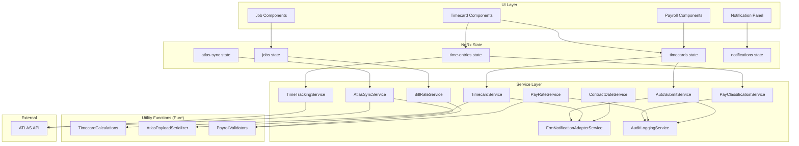

# Design Document: Time & Payroll

## Overview

This design extends the existing FRM Time & Payroll subsystem to address eight capability gaps: time category differentiation (Drive Time vs On Site), holiday/PTO pay classification, automated timecard submission, timecard status notifications, customer bill rate management, role-based user pay rates, contract date management, and reliable ATLAS API synchronization.

The design builds on the existing Angular 18 + NgRx architecture, extending the current `TimeEntry`, `TimecardPeriod`, `Job`, and `Technician` models rather than replacing them. New services are introduced for pay classification, auto-submission scheduling, and ATLAS payload synchronization, while existing services (`TimeTrackingService`, `TimecardService`, `FrmNotificationAdapterService`) are extended with new capabilities.

### Key Design Decisions

1. **Extend existing models** rather than creating parallel structures — `TimeEntry` gains `timeCategory` and `payType` fields; `Job` already has `standardBillRate`/`overtimeBillRate` fields that are formalized.
2. **Pure computation functions** for billable amount calculation, pay rate resolution, and timecard summary aggregation — these are extracted into standalone utility functions to enable property-based testing.
3. **Retry queue with exponential backoff** for ATLAS API sync — implemented as an NgRx-managed queue with effects handling retry logic, replacing the current fire-and-forget HTTP calls.
4. **Notification adapter pattern** — new timecard notification types are added through the existing `FrmNotificationAdapterService` pattern, keeping notification delivery decoupled from business logic.
5. **Audit logging via existing `AuditLoggingService`** — all pay rate changes, time category modifications, and auto-submit events use the established `AuditLogEntry` model.

## Architecture

The feature follows the existing FRM module architecture: Angular components → NgRx Store (actions/effects/reducers/selectors) → Services → HTTP/API layer.



### New NgRx State Slices

- **`atlas-sync`**: Manages the retry queue for ATLAS API synchronization, tracking pending/failed sync operations per time entry.

### Extended State Slices

- **`time-entries`**: Extended with `timeCategory`, `payType`, and `syncStatus` fields.
- **`timecards`**: Extended with per-category and per-pay-type hour summaries, billable amount totals, and auto-submit configuration.
- **`jobs`**: Extended with formalized bill rate fields and contract association.
- **`notifications`**: Extended with new timecard notification types.

## Components and Interfaces

### New Services

#### PayClassificationService
Responsible for determining and applying `PayType` to time entries based on holiday calendar and PTO requests.

```typescript
@Injectable({ providedIn: 'root' })
export class PayClassificationService {
  /** Determine the PayType for a time entry based on date and context */
  classifyPayType(date: Date, technicianId: string, holidays: Holiday[]): PayType;

  /** Check if a date is a company-recognized holiday */
  isHoliday(date: Date, holidays: Holiday[]): boolean;

  /** Validate that a PTO entry doesn't conflict with existing entries */
  validatePtoEntry(date: Date, technicianId: string, existingEntries: TimeEntry[]): ValidationResult;

  /** Request PTO for a technician on a given date */
  requestPto(technicianId: string, date: Date, standardWorkdayHours: number): Observable<TimeEntry>;

  /** Get configured holidays */
  getHolidays(): Observable<Holiday[]>;

  /** Configure holidays (Manager only) */
  saveHolidays(holidays: Holiday[]): Observable<Holiday[]>;

  /** Flag entries affected by holiday date changes */
  flagAffectedEntries(oldDate: Date, newDate: Date): Observable<TimeEntry[]>;
}
```

#### AutoSubmitService
Manages the automated timecard submission process with configurable deadlines per region.

```typescript
@Injectable({ providedIn: 'root' })
export class AutoSubmitService {
  /** Get auto-submit configuration for a region */
  getConfig(region: string): Observable<AutoSubmitConfig>;

  /** Update auto-submit configuration (Manager only) */
  updateConfig(region: string, config: AutoSubmitConfig): Observable<AutoSubmitConfig>;

  /** Check and execute auto-submit for all draft timecards past deadline */
  executeAutoSubmit(): Observable<AutoSubmitResult[]>;

  /** Retry a failed auto-submit (up to 3 retries at 5-min intervals) */
  retryAutoSubmit(periodId: string, attempt: number): Observable<AutoSubmitResult>;
}
```

#### BillRateService
Manages customer bill rates at the job level and calculates billable amounts.

```typescript
@Injectable({ providedIn: 'root' })
export class BillRateService {
  /** Calculate billable amount for a time entry against its job's bill rate */
  calculateBillableAmount(entry: TimeEntry, job: Job): BillableAmount;

  /** Calculate total billable amount for a timecard period grouped by job */
  calculatePeriodBillables(entries: TimeEntry[], jobs: Job[]): JobBillableSummary[];

  /** Validate bill rate values (positive, up to 2 decimal places) */
  validateBillRate(rate: number): ValidationResult;
}
```

#### PayRateService
Manages user pay rates by role level and calculates labor costs.

```typescript
@Injectable({ providedIn: 'root' })
export class PayRateService {
  /** Get pay rate for a technician */
  getPayRate(technicianId: string): Observable<UserPayRate>;

  /** Set pay rate for a technician with effective date */
  setPayRate(technicianId: string, rate: UserPayRate, effectiveDate: Date): Observable<UserPayRate>;

  /** Get default pay rates by role level */
  getDefaultRates(): Observable<RoleLevelPayRate[]>;

  /** Set default pay rates for a role level (Manager only) */
  setDefaultRate(roleLevel: TechnicianRole, rate: RoleLevelPayRate): Observable<RoleLevelPayRate>;

  /** Calculate labor cost for a technician's time entries */
  calculateLaborCost(entries: TimeEntry[], payRate: UserPayRate): LaborCostSummary;

  /** Resolve the applicable pay rate for a time entry based on its creation date */
  resolvePayRateForEntry(entry: TimeEntry, rateHistory: PayRateChange[]): UserPayRate;
}
```

#### ContractDateService
Manages contract date validation and expiration notifications.

```typescript
@Injectable({ providedIn: 'root' })
export class ContractDateService {
  /** Validate that a job's dates fall within its contract period */
  validateJobDatesWithinContract(job: Job, contract: Contract): ValidationResult;

  /** Check if a contract is expired */
  isContractExpired(contract: Contract, referenceDate?: Date): boolean;

  /** Check if a contract is approaching expiration (within 30 days) */
  isContractApproachingExpiration(contract: Contract, referenceDate?: Date): boolean;

  /** Validate a time entry against its job's contract status */
  validateTimeEntryForContract(entry: TimeEntry, job: Job, contract: Contract): ContractValidationResult;
}
```

#### AtlasSyncService
Handles reliable serialization and synchronization of time entries with the ATLAS backend.

```typescript
@Injectable({ providedIn: 'root' })
export class AtlasSyncService {
  /** Serialize a TimeEntry to the ATLAS API payload format */
  serializeToAtlasPayload(entry: TimeEntry): AtlasTimeEntryPayload;

  /** Validate a serialized payload against the ATLAS API schema */
  validateAtlasPayload(payload: AtlasTimeEntryPayload): ValidationResult;

  /** Sync a time entry to ATLAS with retry support */
  syncTimeEntry(entry: TimeEntry): Observable<AtlasSyncResult>;

  /** Queue a failed sync for retry with exponential backoff */
  queueForRetry(entry: TimeEntry, attempt: number): void;

  /** Get all pending sync operations */
  getPendingSyncs(): Observable<PendingSyncEntry[]>;

  /** Detect payload mismatch between local and ATLAS response */
  detectPayloadMismatch(local: TimeEntry, atlasResponse: any): SyncConflict | null;
}
```

### Extended Services

#### TimeTrackingService (Extended)
- `clockIn()` — accepts optional `timeCategory` parameter, defaults to `'OnSite'`
- `updateTimeEntry()` — includes `timeCategory` in the update payload
- `mapResponse()` — maps `timeCategory`, `payType`, and `syncStatus` from API response

#### TimecardService (Extended)
- `calculateHours()` — returns breakdowns by `TimeCategory` and `PayType`
- `createWeeklySummary()` — includes category/pay-type subtotals and billable amounts

#### FrmNotificationAdapterService (Extended)
- `sendTimecardNotSubmittedReminder()` — 24-hour deadline reminder
- `sendTimecardLockedNotification()` — period locked notification
- `sendTimecardNotStartedReminder()` — no entries in first 24 hours
- `sendTimecardRejectedNotification()` — includes rejection reason
- `sendTimecardApprovedNotification()` — approval confirmation
- `sendTimecardAutoSubmittedNotification()` — auto-submit notification
- `sendContractExpiringNotification()` — 30-day contract expiration warning
- `sendSyncConflictNotification()` — ATLAS sync conflict alert

### Pure Utility Functions

#### TimecardCalculations (`utils/timecard-calculations.ts`)
Stateless functions for all timecard math, enabling property-based testing:

```typescript
/** Calculate hours breakdown by TimeCategory */
function calculateHoursByCategory(entries: TimeEntry[]): CategoryHoursSummary;

/** Calculate hours breakdown by PayType */
function calculateHoursByPayType(entries: TimeEntry[]): PayTypeHoursSummary;

/** Calculate billable amount for a single entry */
function calculateEntryBillableAmount(hours: number, isOvertime: boolean, job: Job): number;

/** Calculate total billable amounts grouped by job */
function calculatePeriodBillablesByJob(entries: TimeEntry[], jobs: Map<string, Job>): JobBillableSummary[];

/** Calculate labor cost for entries given a pay rate history */
function calculateLaborCost(entries: TimeEntry[], rateHistory: PayRateChange[]): number;

/** Resolve which pay rate applies to a given entry based on effective dates */
function resolveApplicableRate(entryCreatedAt: Date, rateHistory: PayRateChange[]): UserPayRate;
```

#### AtlasPayloadSerializer (`utils/atlas-payload-serializer.ts`)
Pure functions for ATLAS payload serialization and validation:

```typescript
/** Serialize a TimeEntry to the flat ATLAS API payload format */
function serializeTimeEntry(entry: TimeEntry): AtlasTimeEntryPayload;

/** Deserialize an ATLAS API response to a TimeEntry */
function deserializeAtlasResponse(payload: AtlasTimeEntryPayload): Partial<TimeEntry>;

/** Validate a payload against the ATLAS schema */
function validateAtlasPayload(payload: AtlasTimeEntryPayload): ValidationResult;

/** Detect mismatches between local entry and ATLAS response */
function detectMismatch(local: TimeEntry, remote: AtlasTimeEntryPayload): string[];
```

#### PayrollValidators (`validators/payroll-validators.ts`)
Pure validation functions:

```typescript
/** Validate bill rate: positive number with up to 2 decimal places */
function validateBillRate(rate: number): ValidationResult;

/** Validate contract dates: end must be after start */
function validateContractDates(startDate: Date, endDate: Date): ValidationResult;

/** Validate job dates fall within contract period */
function validateJobWithinContract(jobStart: Date, jobEnd: Date, contractStart: Date, contractEnd: Date): ValidationResult;

/** Validate no PTO conflict: no full-day PTO + regular entry on same date */
function validateNoPtoConflict(date: Date, existingEntries: TimeEntry[]): ValidationResult;
```

## Data Models

### New Types and Enums

```typescript
/** Time category for a time entry */
export enum TimeCategory {
  DriveTime = 'DriveTime',
  OnSite = 'OnSite'
}

/** Pay type classification */
export enum PayType {
  Regular = 'Regular',
  Overtime = 'Overtime',
  Holiday = 'Holiday',
  PTO = 'PTO'
}

/** Sync status for ATLAS API synchronization */
export enum SyncStatus {
  Synced = 'Synced',
  Pending = 'Pending',
  Failed = 'Failed',
  Conflict = 'Conflict'
}
```

### Extended TimeEntry Model

```typescript
export interface TimeEntry {
  // ... existing fields ...
  id: string;
  jobId: string;
  technicianId: string;
  clockInTime: Date;
  clockOutTime?: Date;
  clockOutReason?: 'end_of_day' | 'break' | 'lunch' | 'other';
  clockInLocation?: GeoLocation;
  clockOutLocation?: GeoLocation;
  totalHours?: number;
  regularHours?: number;
  overtimeHours?: number;
  mileage?: number;
  breakMinutes?: number;
  isManuallyAdjusted: boolean;
  adjustedBy?: string;
  adjustmentReason?: string;
  isLocked: boolean;
  lockedAt?: Date;
  createdAt: Date;
  updatedAt: Date;

  // New fields
  timeCategory: TimeCategory;
  payType: PayType;
  syncStatus: SyncStatus;
  lastSyncAttempt?: Date;
  syncRetryCount?: number;
  syncConflictDetails?: string;
}
```

### Extended TimecardPeriod Model

```typescript
export interface TimecardPeriod {
  // ... existing fields ...

  // New summary fields
  driveTimeHours: number;
  onSiteHours: number;
  holidayHours: number;
  ptoHours: number;
  totalBillableAmount: number;
  totalLaborCost: number;

  // Auto-submit tracking
  isAutoSubmitted: boolean;
  autoSubmittedAt?: Date;
}
```

### New Models

```typescript
/** Company-recognized holiday */
export interface Holiday {
  id: string;
  name: string;
  date: Date;
  isRecurring: boolean;
  createdBy: string;
  createdAt: Date;
  updatedAt: Date;
}

/** Auto-submit configuration per region */
export interface AutoSubmitConfig {
  id: string;
  region: string;
  dayOfWeek: 'Monday' | 'Tuesday' | 'Wednesday' | 'Thursday' | 'Friday' | 'Saturday' | 'Sunday';
  timeOfDay: string; // HH:mm format
  enabled: boolean;
  maxRetries: number;       // default: 3
  retryIntervalMinutes: number; // default: 5
  updatedBy: string;
  updatedAt: Date;
}

/** Result of an auto-submit operation */
export interface AutoSubmitResult {
  periodId: string;
  technicianId: string;
  success: boolean;
  attempt: number;
  error?: string;
  timestamp: Date;
}

/** User pay rate with effective date */
export interface UserPayRate {
  id: string;
  technicianId: string;
  roleLevel: TechnicianRole;
  standardHourlyRate: number;
  overtimeHourlyRate: number;
  effectiveDate: Date;
  createdBy: string;
  createdAt: Date;
}

/** Default pay rate for a role level */
export interface RoleLevelPayRate {
  roleLevel: TechnicianRole;
  standardHourlyRate: number;
  overtimeHourlyRate: number;
  updatedBy: string;
  updatedAt: Date;
}

/** Pay rate change audit record */
export interface PayRateChange {
  id: string;
  technicianId: string;
  previousStandardRate: number;
  previousOvertimeRate: number;
  newStandardRate: number;
  newOvertimeRate: number;
  effectiveDate: Date;
  changedBy: string;
  changedAt: Date;
}

/** Contract model (extends existing contract support) */
export interface Contract {
  id: string;
  name: string;
  clientName: string;
  startDate: Date;
  endDate: Date;
  status: 'Active' | 'Expired' | 'Pending';
  region?: string;
  createdBy: string;
  createdAt: Date;
  updatedAt: Date;
}

/** Billable amount calculation result */
export interface BillableAmount {
  entryId: string;
  jobId: string;
  hours: number;
  rate: number;
  isOvertime: boolean;
  amount: number;
}

/** Job billable summary for a timecard period */
export interface JobBillableSummary {
  jobId: string;
  standardHours: number;
  overtimeHours: number;
  standardAmount: number;
  overtimeAmount: number;
  totalAmount: number;
  rateNotSet: boolean;
}

/** Labor cost summary for a technician */
export interface LaborCostSummary {
  technicianId: string;
  regularHours: number;
  overtimeHours: number;
  regularCost: number;
  overtimeCost: number;
  totalCost: number;
}

/** Category hours summary */
export interface CategoryHoursSummary {
  driveTimeHours: number;
  onSiteHours: number;
  totalHours: number;
}

/** Pay type hours summary */
export interface PayTypeHoursSummary {
  regularHours: number;
  overtimeHours: number;
  holidayHours: number;
  ptoHours: number;
  totalHours: number;
}

/** ATLAS API payload format (flat structure) */
export interface AtlasTimeEntryPayload {
  id?: string;
  jobId: string;
  technicianId: string;
  clockInTime: string;   // ISO 8601
  clockOutTime?: string;  // ISO 8601
  clockInLatitude?: number;
  clockInLongitude?: number;
  clockOutLatitude?: number;
  clockOutLongitude?: number;
  mileage?: number;
  adjustmentReason?: string;
  timeCategory?: string;
  payType?: string;
}

/** ATLAS sync result */
export interface AtlasSyncResult {
  entryId: string;
  success: boolean;
  httpStatus?: number;
  errorDetail?: string;
  payloadHash: string;
  timestamp: Date;
  conflict?: SyncConflict;
}

/** Sync conflict details */
export interface SyncConflict {
  entryId: string;
  mismatchedFields: string[];
  localValues: Record<string, any>;
  remoteValues: Record<string, any>;
}

/** Pending sync entry in the retry queue */
export interface PendingSyncEntry {
  entryId: string;
  payload: AtlasTimeEntryPayload;
  attempt: number;
  maxAttempts: number;
  nextRetryAt: Date;
  lastError?: string;
}

/** Contract validation result */
export interface ContractValidationResult {
  valid: boolean;
  expired: boolean;
  requiresApproval: boolean;
  message?: string;
}

/** Timecard notification badge counts */
export interface TimecardBadgeCounts {
  draft: number;
  rejected: number;
  approachingDeadline: number;
  total: number;
}
```

### New API Endpoints

```typescript
export const TIMECARD_ENDPOINTS = {
  // Holiday management
  getHolidays: () => `${API_BASE_URL}/holidays`,
  saveHolidays: () => `${API_BASE_URL}/holidays`,

  // Auto-submit configuration
  getAutoSubmitConfig: (region: string) => `${API_BASE_URL}/auto-submit/config/${region}`,
  updateAutoSubmitConfig: (region: string) => `${API_BASE_URL}/auto-submit/config/${region}`,
  executeAutoSubmit: () => `${API_BASE_URL}/auto-submit/execute`,

  // Pay rates
  getPayRate: (technicianId: string) => `${API_BASE_URL}/pay-rates/${technicianId}`,
  setPayRate: (technicianId: string) => `${API_BASE_URL}/pay-rates/${technicianId}`,
  getPayRateHistory: (technicianId: string) => `${API_BASE_URL}/pay-rates/${technicianId}/history`,
  getDefaultRates: () => `${API_BASE_URL}/pay-rates/defaults`,
  setDefaultRate: () => `${API_BASE_URL}/pay-rates/defaults`,

  // Contract management
  getContract: (contractId: string) => `${API_BASE_URL}/contracts/${contractId}`,
  getContractForJob: (jobId: string) => `${API_BASE_URL}/contracts/by-job/${jobId}`,
  getExpiringContracts: () => `${API_BASE_URL}/contracts/expiring`,

  // ATLAS sync
  syncTimeEntry: (entryId: string) => `${API_BASE_URL}/time-entries/${entryId}/sync`,
  getPendingSyncs: () => `${API_BASE_URL}/time-entries/sync/pending`,
  getSyncStatus: (entryId: string) => `${API_BASE_URL}/time-entries/${entryId}/sync-status`,
} as const;
```

### Extended NgRx Actions

```typescript
// Time Category actions
export const setTimeCategory = createAction(
  '[Time Entry] Set Time Category',
  props<{ entryId: string; category: TimeCategory; previousCategory: TimeCategory }>()
);

// Pay Type actions
export const classifyPayType = createAction(
  '[Time Entry] Classify Pay Type',
  props<{ entryId: string; payType: PayType }>()
);

export const requestPto = createAction(
  '[Time Entry] Request PTO',
  props<{ technicianId: string; date: Date; hours: number }>()
);

// Auto-submit actions
export const triggerAutoSubmit = createAction('[Timecard] Trigger Auto Submit');
export const autoSubmitSuccess = createAction(
  '[Timecard] Auto Submit Success',
  props<{ results: AutoSubmitResult[] }>()
);
export const autoSubmitFailure = createAction(
  '[Timecard] Auto Submit Failure',
  props<{ periodId: string; error: string; attempt: number }>()
);

// ATLAS sync actions
export const syncToAtlas = createAction(
  '[Atlas Sync] Sync Time Entry',
  props<{ entry: TimeEntry }>()
);
export const syncToAtlasSuccess = createAction(
  '[Atlas Sync] Sync Success',
  props<{ result: AtlasSyncResult }>()
);
export const syncToAtlasFailure = createAction(
  '[Atlas Sync] Sync Failure',
  props<{ entryId: string; error: string; attempt: number }>()
);
export const syncConflictDetected = createAction(
  '[Atlas Sync] Conflict Detected',
  props<{ conflict: SyncConflict }>()
);

// Notification badge actions
export const loadTimecardBadgeCounts = createAction('[Timecard] Load Badge Counts');
export const updateTimecardBadgeCounts = createAction(
  '[Timecard] Update Badge Counts',
  props<{ counts: TimecardBadgeCounts }>()
);
```


## Correctness Properties

*A property is a characteristic or behavior that should hold true across all valid executions of a system — essentially, a formal statement about what the system should do. Properties serve as the bridge between human-readable specifications and machine-verifiable correctness guarantees.*

### Property 1: Time category is required for saving

*For any* `TimeEntry` object, the validation function SHALL reject the entry (return invalid) if and only if the `timeCategory` field is missing, null, or not one of the valid `TimeCategory` enum values (`DriveTime`, `OnSite`).

**Validates: Requirements 1.2**

### Property 2: Category change produces correct audit entry

*For any* `TimeEntry` with a valid `timeCategory` and any new `TimeCategory` value different from the current one, changing the category SHALL produce an audit log entry where `previousValue` equals the old category, `newValue` equals the new category, and `user` equals the identity of the user who made the change.

**Validates: Requirements 1.4**

### Property 3: Submitted/Approved periods prevent category modification

*For any* `TimecardPeriod` with status `Submitted` or `Approved`, and *for any* `TimeEntry` within that period, attempting to change the `timeCategory` SHALL be rejected.

**Validates: Requirements 1.5**

### Property 4: Category hours summation is correct

*For any* list of `TimeEntry` objects with valid `totalHours` and `timeCategory` values, `calculateHoursByCategory` SHALL return a `CategoryHoursSummary` where `driveTimeHours` equals the sum of `totalHours` for all entries with `timeCategory === DriveTime`, `onSiteHours` equals the sum for `OnSite`, and `driveTimeHours + onSiteHours === totalHours`.

**Validates: Requirements 1.7**

### Property 5: Holiday date classification

*For any* date and *for any* list of `Holiday` objects, `classifyPayType` SHALL return `PayType.Holiday` if and only if the date matches a holiday date in the list.

**Validates: Requirements 2.1**

### Property 6: PTO entry creation

*For any* valid technician ID, date, and positive standard workday hours value, requesting PTO SHALL produce a `TimeEntry` with `payType === PTO` and `totalHours` equal to the provided standard workday hours.

**Validates: Requirements 2.2**

### Property 7: Pay type hours summation is correct

*For any* list of `TimeEntry` objects with valid `totalHours` and `payType` values, `calculateHoursByPayType` SHALL return a `PayTypeHoursSummary` where each pay type's hours equals the sum of `totalHours` for entries of that type, and `regularHours + overtimeHours + holidayHours + ptoHours === totalHours`.

**Validates: Requirements 2.4**

### Property 8: PTO and regular entry mutual exclusion

*For any* date where a full-day PTO `TimeEntry` exists for a technician, `validateNoPtoConflict` SHALL return invalid when attempting to add a regular `TimeEntry` for the same technician on the same date.

**Validates: Requirements 2.5**

### Property 9: Holiday date change flags correct entries

*For any* set of `TimeEntry` objects and *for any* holiday date change from `oldDate` to `newDate`, `flagAffectedEntries` SHALL return exactly the entries whose date matches `oldDate`.

**Validates: Requirements 2.7**

### Property 10: Auto-submit targets only draft timecards past deadline

*For any* set of `TimecardPeriod` objects with various statuses and *for any* `AutoSubmitConfig` deadline, the auto-submit process SHALL change the status to `Submitted` for exactly those periods that have status `Draft` and whose period end date plus deadline has passed.

**Validates: Requirements 3.2**

### Property 11: Auto-submit audit entries are distinguishable

*For any* auto-submitted `TimecardPeriod`, the resulting audit log entry SHALL contain a `submissionType` value of `"Auto-Submitted"` that is distinct from the `"Manual"` value used for technician-initiated submissions.

**Validates: Requirements 3.3**

### Property 12: Deadline proximity notification targeting

*For any* set of `TimecardPeriod` objects with various statuses and lock deadlines, the notification check SHALL identify exactly those periods where status is `Draft` AND the lock deadline is within 24 hours of the current time.

**Validates: Requirements 4.1**

### Property 13: Period inactivity notification targeting

*For any* pay period start date and *for any* set of `TimeEntry` objects, the inactivity check SHALL flag a technician for notification if and only if no entries exist for that technician with a `clockInTime` within 24 hours of the period start.

**Validates: Requirements 4.3**

### Property 14: Timecard badge count calculation

*For any* set of `TimecardPeriod` objects with various statuses and lock deadlines, the badge count SHALL equal the number of periods with status `Draft` plus the number with status `Rejected` plus the number approaching the lock deadline (within 24 hours, status `Draft`), with no double-counting.

**Validates: Requirements 4.7**

### Property 15: Bill rate validation

*For any* number, `validateBillRate` SHALL return valid if and only if the number is strictly positive and has at most two decimal places (i.e., `number * 100` is an integer).

**Validates: Requirements 5.3**

### Property 16: Period billable amounts by job

*For any* list of `TimeEntry` objects and *for any* map of `Job` objects with bill rates, `calculatePeriodBillablesByJob` SHALL return a `JobBillableSummary` for each job where `standardAmount === standardHours * job.standardBillRate`, `overtimeAmount === overtimeHours * job.overtimeBillRate`, `totalAmount === standardAmount + overtimeAmount`, and `rateNotSet === true` if and only if the job has no bill rates defined.

**Validates: Requirements 5.4, 5.5, 5.6**

### Property 17: Labor cost calculation with rate history

*For any* list of `TimeEntry` objects and *for any* pay rate history (list of `PayRateChange` with effective dates), `calculateLaborCost` SHALL compute the total cost by applying to each entry the rate whose effective date is the most recent one not after the entry's `createdAt` date, multiplying regular hours by `standardHourlyRate` and overtime hours by `overtimeHourlyRate`.

**Validates: Requirements 6.5, 6.7**

### Property 18: Pay rate change audit completeness

*For any* pay rate change operation, the resulting audit log entry SHALL contain `previousStandardRate`, `previousOvertimeRate`, `newStandardRate`, `newOvertimeRate`, `effectiveDate`, and `changedBy` fields that match the change parameters.

**Validates: Requirements 6.6**

### Property 19: Contract date validation

*For any* two dates `startDate` and `endDate`, `validateContractDates` SHALL return valid if and only if `endDate` is strictly after `startDate`.

**Validates: Requirements 7.2**

### Property 20: Job dates within contract period

*For any* job date range (`jobStart`, `jobEnd`) and contract date range (`contractStart`, `contractEnd`), `validateJobWithinContract` SHALL return valid if and only if `jobStart >= contractStart` AND `jobEnd <= contractEnd`.

**Validates: Requirements 7.3**

### Property 21: Contract expiration status classification

*For any* `Contract` with `startDate` and `endDate`, and *for any* reference date:
- `isContractExpired` SHALL return `true` if and only if `referenceDate > endDate`
- `isContractApproachingExpiration` SHALL return `true` if and only if `referenceDate <= endDate` AND `endDate - referenceDate <= 30 days`

**Validates: Requirements 7.4, 7.5**

### Property 22: ATLAS payload serialization round-trip

*For any* valid `TimeEntry`, serializing with `serializeTimeEntry` and then deserializing with `deserializeAtlasResponse` SHALL produce an object where all serialized fields (`jobId`, `technicianId`, `clockInTime`, `clockOutTime`, `clockInLatitude`, `clockInLongitude`, `clockOutLatitude`, `clockOutLongitude`, `mileage`, `adjustmentReason`) match the original entry's values. Additionally, `validateAtlasPayload` SHALL return valid for the serialized payload.

**Validates: Requirements 8.1, 8.2**

### Property 23: Exponential backoff calculation

*For any* retry attempt number `n` where `0 <= n < 3`, the backoff delay SHALL equal `2^(n+1)` seconds (2s, 4s, 8s). For `n >= 3`, no further retry SHALL be attempted.

**Validates: Requirements 8.4**

### Property 24: Payload mismatch detection

*For any* `TimeEntry` and *for any* `AtlasTimeEntryPayload` response, `detectMismatch` SHALL return a non-empty list of field names if and only if at least one comparable field differs between the local entry (after serialization) and the remote payload. The returned field names SHALL be exactly the set of fields that differ.

**Validates: Requirements 8.7**

## Error Handling

### Time Entry Errors
- **Missing time category**: Validation error displayed inline on the time entry form. Entry cannot be saved until a category is selected.
- **PTO conflict**: When a technician attempts to add a regular entry on a PTO date, display a blocking error: "A full-day PTO entry already exists for this date."
- **Locked period modification**: When attempting to modify a category on a Submitted/Approved period, display a read-only indicator and toast: "This timecard period is locked and cannot be modified."

### Pay Classification Errors
- **Holiday calendar not loaded**: If the holiday list fails to load, fall back to treating all dates as non-holiday and display a warning banner: "Holiday calendar unavailable — pay types may need manual review."
- **Holiday date change conflict**: When a holiday date is modified and entries are affected, display a review queue for the Manager with the list of affected entries.

### Auto-Submit Errors
- **Auto-submit failure**: After 3 failed retries, send a notification to the Manager with the period ID and error details. The timecard remains in Draft status.
- **Configuration error**: If the auto-submit config is invalid (e.g., missing region), log the error and skip the region. Do not block other regions.

### Bill Rate / Pay Rate Errors
- **Invalid bill rate**: Inline validation error on the job form: "Bill rate must be a positive number with up to two decimal places."
- **Missing bill rate**: Display "Rate Not Set" badge on job time entry summaries. Do not block time entry creation.
- **Pay rate not found**: If no pay rate exists for a technician, display a warning on the payroll summary and use $0.00 as the rate (flagged for Manager review).

### Contract Errors
- **Expired contract time entry**: Display a warning dialog: "The contract for this job has expired. Manager approval is required to save this time entry." Block save until approval is granted or the entry is cancelled.
- **Invalid contract dates**: Inline validation error: "Contract end date must be after the start date."
- **Job outside contract period**: Inline validation error: "Job scheduled dates must fall within the contract period ({{contractStart}} – {{contractEnd}})."

### ATLAS Sync Errors
- **API error response**: Display a toast with the HTTP status code and error detail from the response body. Log the full error to the audit log.
- **Network error / timeout**: Queue for retry with exponential backoff. Display "Sync Pending" indicator on the affected time entry. After 3 failed retries, set `syncStatus` to `Failed` and display "Sync Failed — contact support."
- **Payload mismatch / conflict**: Set `syncStatus` to `Conflict`, display "Sync Conflict" indicator, and send a notification to the Dispatcher with the mismatched field details.

## Testing Strategy

### Unit Tests (Example-Based)
Unit tests cover specific scenarios, UI interactions, and integration points:

- **Time category UI**: Verify the category selector renders with "Drive Time" and "On Site" options (1.1). Verify default to "On Site" on clock-in (1.3). Verify category label display (1.6).
- **Holiday CRUD**: Verify Manager can create/read/update/delete holidays (2.3). Verify holiday override with approval workflow (2.6).
- **Auto-submit config**: Verify per-region configuration CRUD (3.1, 3.5). Verify retry behavior with mocked failures (3.6).
- **Notification integration**: Verify notification service is called on lock (4.2), rejection with reason (4.4), approval (4.5). Verify in-app delivery channel (4.6).
- **Job form**: Verify bill rate input fields on job create/edit (5.2).
- **Pay rate UI**: Verify role change prompts pay rate confirmation (6.3). Verify default rate CRUD (6.4).
- **Contract workflow**: Verify expired contract warning and approval dialog (7.6).
- **ATLAS error display**: Verify error messages include status code and detail (8.3). Verify "Sync Pending" indicator (8.5).

### Property-Based Tests
Property-based tests verify universal correctness properties using generated inputs. Each test runs a minimum of 100 iterations using a PBT library (e.g., `fast-check` for TypeScript).

Each property test is tagged with:
**Feature: time-and-payroll, Property {number}: {property_text}**

| Property | Target Function | Generator Strategy |
|----------|----------------|-------------------|
| 1: Time category required | `validateTimeEntry` | Random TimeEntry objects with/without timeCategory |
| 2: Category change audit | `auditCategoryChange` | Random entries, categories, user IDs |
| 3: Locked period guard | `canModifyCategory` | Random periods (Submitted/Approved/Draft), random entries |
| 4: Category hours sum | `calculateHoursByCategory` | Random entry lists with DriveTime/OnSite and positive hours |
| 5: Holiday classification | `classifyPayType` | Random dates, random holiday lists |
| 6: PTO entry creation | `createPtoEntry` | Random technician IDs, dates, workday hours (1-24) |
| 7: Pay type hours sum | `calculateHoursByPayType` | Random entry lists with all PayTypes and positive hours |
| 8: PTO mutual exclusion | `validateNoPtoConflict` | Random dates, existing PTO entries, attempted regular entries |
| 9: Holiday flag detection | `flagAffectedEntries` | Random entry sets, random old/new holiday dates |
| 10: Auto-submit targeting | `executeAutoSubmit` | Random period sets with mixed statuses and deadlines |
| 11: Auto-submit audit | `createAutoSubmitAudit` | Random period IDs and timestamps |
| 12: Deadline notification | `checkDeadlineNotifications` | Random periods with various deadlines and statuses |
| 13: Inactivity notification | `checkInactivityNotifications` | Random period starts and entry timestamps |
| 14: Badge count | `calculateBadgeCounts` | Random period sets with mixed statuses and deadlines |
| 15: Bill rate validation | `validateBillRate` | Random numbers (positive, negative, zero, many decimals) |
| 16: Period billables | `calculatePeriodBillablesByJob` | Random entries across jobs with/without rates |
| 17: Labor cost with history | `calculateLaborCost` | Random entries and rate histories with effective dates |
| 18: Pay rate audit | `createPayRateAudit` | Random rate changes with all fields |
| 19: Contract date validation | `validateContractDates` | Random date pairs |
| 20: Job within contract | `validateJobWithinContract` | Random job and contract date ranges |
| 21: Contract expiration | `isContractExpired` / `isContractApproachingExpiration` | Random contracts and reference dates |
| 22: ATLAS round-trip | `serializeTimeEntry` / `deserializeAtlasResponse` | Random valid TimeEntry objects |
| 23: Exponential backoff | `calculateBackoffDelay` | Random attempt numbers (0-5) |
| 24: Mismatch detection | `detectMismatch` | Random entry/payload pairs with matching and differing fields |

### Integration Tests
- **Auto-submit + Notification**: Trigger auto-submit and verify notification delivery end-to-end (3.4).
- **ATLAS sync + Audit**: Perform sync operations and verify audit log entries (8.6).
- **Timecard lock + Notification**: Lock a period and verify notification delivery (4.2).
- **Status change + Notification**: Change period status and verify correct notification type (4.4, 4.5).

### Test Configuration
- **PBT library**: `fast-check` (TypeScript)
- **Minimum iterations**: 100 per property test
- **Test runner**: Existing Karma/Jasmine setup extended with `fast-check`
- **Tag format**: `Feature: time-and-payroll, Property {N}: {description}`
