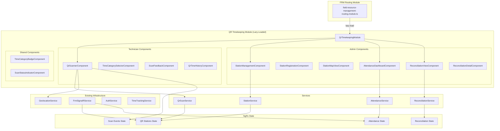
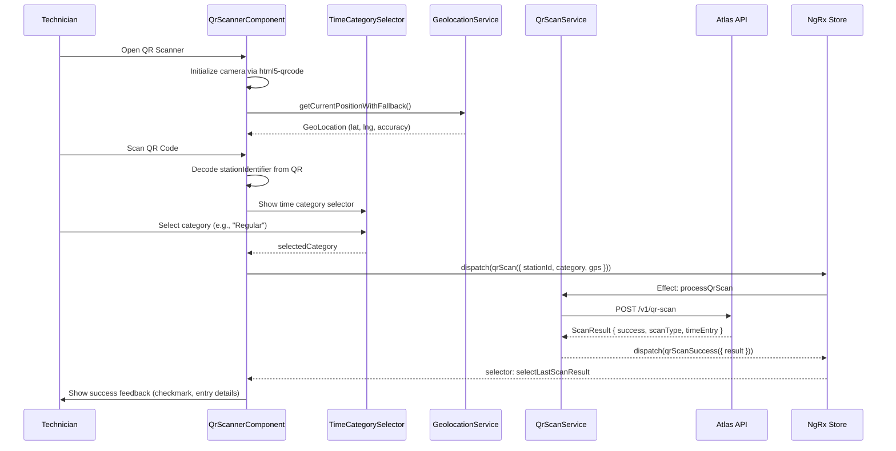
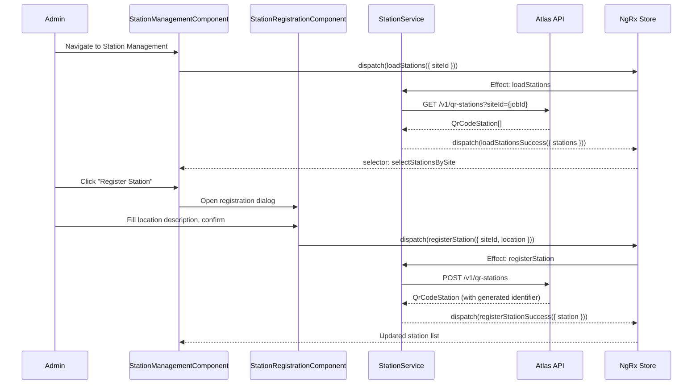

# Design Document: Timekeeping QR Frontend

## Overview

The Timekeeping QR Frontend extends the existing Field Resource Management (FRM) Angular module in the `sri-frontend` application to provide a complete user interface for the QR Code Timekeeping System. The backend API is complete (atlas-platform PR #61), exposing endpoints for QR scanning, station management, attendance reporting, and Celerity reconciliation.

This feature introduces two user-facing surfaces: a **mobile-first technician experience** centered on camera-based QR scanning for clock-in/out, and a **desktop-optimized admin dashboard** for station management, attendance monitoring, and discrepancy resolution. Both surfaces integrate with the existing NgRx state management infrastructure, reuse the established `GeolocationService` for GPS capture, and leverage the existing `FrmSignalRService` for real-time updates.

The design follows the established FRM patterns: lazy-loaded child modules, NgRx entity-adapter state slices, HTTP services behind the Atlas API interceptor, and role-based route guards (AdminGuard, TechnicianGuard).

## Architecture

### High-Level Module Architecture



### Request Flow: QR Scan Clock-In (Frontend)



### Admin Station Management Flow



## Components and Interfaces

### Module Structure

**QR Timekeeping Module** — Lazy-loaded child of FRM routing

```typescript
// Path: components/qr-timekeeping/qr-timekeeping.module.ts
@NgModule({
  declarations: [
    QrScannerComponent,
    TimeCategorySelectorComponent,
    ScanFeedbackComponent,
    QrTimeHistoryComponent,
    StationManagementComponent,
    StationRegistrationComponent,
    StationMapViewComponent,
    AttendanceDashboardComponent,
    ReconciliationViewComponent,
    ReconciliationDetailComponent,
    TimeCategoryBadgeComponent,
    ScanStatusIndicatorComponent
  ],
  imports: [
    CommonModule,
    ReactiveFormsModule,
    SharedMaterialModule,
    SharedComponentsModule,
    RouterModule.forChild(qrTimekeepingRoutes),
    StoreModule.forFeature('qrTimekeeping', qrTimekeepingReducer),
    EffectsModule.forFeature([
      QrStationEffects,
      ScanEventEffects,
      AttendanceEffects,
      ReconciliationEffects
    ])
  ]
})
export class QrTimekeepingModule {}
```

### Routing

```typescript
// Path: components/qr-timekeeping/qr-timekeeping-routing.ts
const qrTimekeepingRoutes: Routes = [
  {
    path: '',
    redirectTo: 'scan',
    pathMatch: 'full'
  },
  // Technician routes
  {
    path: 'scan',
    component: QrScannerComponent,
    canActivate: [TechnicianGuard],
    data: { title: 'QR Clock In/Out', breadcrumb: 'QR Scan' }
  },
  {
    path: 'history',
    component: QrTimeHistoryComponent,
    canActivate: [TechnicianGuard],
    data: { title: 'QR Time History', breadcrumb: 'History' }
  },
  // Admin routes
  {
    path: 'stations',
    component: StationManagementComponent,
    canActivate: [AdminGuard],
    data: { title: 'QR Station Management', breadcrumb: 'Stations' }
  },
  {
    path: 'stations/map/:jobId',
    component: StationMapViewComponent,
    canActivate: [AdminGuard],
    data: { title: 'Station Map', breadcrumb: 'Station Map' }
  },
  {
    path: 'attendance',
    component: AttendanceDashboardComponent,
    canActivate: [AdminGuard],
    data: { title: 'Attendance Dashboard', breadcrumb: 'Attendance' }
  },
  {
    path: 'reconciliation',
    component: ReconciliationViewComponent,
    canActivate: [AdminGuard],
    data: { title: 'Celerity Reconciliation', breadcrumb: 'Reconciliation' }
  },
  {
    path: 'reconciliation/:reportId',
    component: ReconciliationDetailComponent,
    canActivate: [AdminGuard],
    data: { title: 'Reconciliation Report', breadcrumb: 'Report Detail' }
  }
];
```

### Component 1: QrScannerComponent

**Purpose**: Mobile-first camera-based QR code scanning for clock-in/out. Uses html5-qrcode library for cross-browser camera access via the PWA service worker.

**Interface**:
```typescript
@Component({
  selector: 'app-qr-scanner',
  templateUrl: './qr-scanner.component.html',
  styleUrls: ['./qr-scanner.component.scss']
})
export class QrScannerComponent implements OnInit, OnDestroy {
  // State observables
  scanState$: Observable<'idle' | 'scanning' | 'category-select' | 'processing' | 'success' | 'error'>;
  lastScanResult$: Observable<ScanResult | null>;
  activeEntry$: Observable<TimeEntry | null>;
  gpsStatus$: Observable<'acquiring' | 'acquired' | 'failed'>;

  // Camera
  private html5QrCode: Html5Qrcode | null;
  private cameraActive: boolean;

  // GPS
  currentLocation: GeoLocation | null;

  // Category selection
  selectedCategory: QrTimeCategory | null;
  showCategorySelector: boolean;
  scannedStationId: string | null;

  // Methods
  startScanner(): Promise<void>;
  stopScanner(): Promise<void>;
  onQrCodeScanned(decodedText: string): void;
  onCategorySelected(category: QrTimeCategory): void;
  submitScan(): void;
  resetScanner(): void;
  switchCamera(): void;
}
```

**Responsibilities**:
- Initialize and manage camera stream via html5-qrcode
- Decode QR code content (station identifier string)
- Capture GPS coordinates via GeolocationService
- Present time category selection after successful QR decode
- Dispatch scan action to NgRx store
- Display success/error feedback with haptic feedback (navigator.vibrate)
- Handle camera permissions and fallback states
- Support front/rear camera switching on mobile

### Component 2: TimeCategorySelectorComponent

**Purpose**: Reusable time category selector for QR scans, showing categories relevant to the QR system.

**Interface**:
```typescript
@Component({
  selector: 'app-time-category-selector',
  templateUrl: './time-category-selector.component.html'
})
export class TimeCategorySelectorComponent {
  @Input() preselectedCategory: QrTimeCategory | null;
  @Input() disabled: boolean = false;
  @Output() categorySelected = new EventEmitter<QrTimeCategory>();

  categories: QrTimeCategory[] = [
    'Regular', 'PTO', 'Training', 'Recharge', 'Excused_Absence'
  ];
}
```

### Component 3: StationManagementComponent

**Purpose**: Admin view for managing QR stations across job sites.

**Interface**:
```typescript
@Component({
  selector: 'app-station-management',
  templateUrl: './station-management.component.html'
})
export class StationManagementComponent implements OnInit {
  stations$: Observable<QrCodeStation[]>;
  selectedSiteId$: Observable<string | null>;
  loading$: Observable<boolean>;
  stationCount$: Observable<number>;

  // Job site selector (dropdown of active jobs)
  availableJobs$: Observable<Job[]>;

  onSiteSelected(siteId: string): void;
  openRegistrationDialog(): void;
  deactivateStation(stationId: string): void;
  viewStationMap(jobId: string): void;
  viewScanHistory(stationId: string): void;
}
```

**Responsibilities**:
- Display stations in a responsive table/card layout
- Filter by job site
- Enforce max 6 stations per site (disable register button at limit)
- Show activity status badges (Active, Low_Activity, Inactive_Flagged)
- Confirm before deactivation
- Navigate to map view and scan history

### Component 4: AttendanceDashboardComponent

**Purpose**: Admin daily attendance view with filtering and summary stats.

**Interface**:
```typescript
@Component({
  selector: 'app-attendance-dashboard',
  templateUrl: './attendance-dashboard.component.html'
})
export class AttendanceDashboardComponent implements OnInit {
  attendanceRecords$: Observable<AttendanceRecord[]>;
  summary$: Observable<AttendanceSummary>;
  loading$: Observable<boolean>;

  // Filters
  selectedDate: Date;
  selectedSiteId: string | null;
  dateRange: { startDate: Date; endDate: Date } | null;
  statusFilter: 'all' | 'present' | 'absent' | 'incomplete';

  onDateChanged(date: Date): void;
  onSiteChanged(siteId: string): void;
  onDateRangeChanged(range: { startDate: Date; endDate: Date }): void;
  onStatusFilterChanged(status: string): void;
  exportToCsv(): void;
}
```

**Responsibilities**:
- Display attendance summary cards (present, absent, incomplete counts)
- Filterable table of attendance records
- Date picker for single-day or range view (max 90 days)
- Site/job filter dropdown
- Status filter tabs (All, Present, Absent, Incomplete)
- Time category breakdown column
- CSV export capability

### Component 5: ReconciliationViewComponent

**Purpose**: Admin view for generating and reviewing Atlas vs Celerity reconciliation reports.

**Interface**:
```typescript
@Component({
  selector: 'app-reconciliation-view',
  templateUrl: './reconciliation-view.component.html'
})
export class ReconciliationViewComponent implements OnInit {
  reports$: Observable<ReconciliationReport[]>;
  selectedReport$: Observable<ReconciliationReport | null>;
  discrepancies$: Observable<ReconciliationDiscrepancy[]>;
  reportSummary$: Observable<ReconciliationSummary | null>;
  loading$: Observable<boolean>;
  generating$: Observable<boolean>;

  // Generate report form
  startDate: Date;
  endDate: Date;

  generateReport(): void;
  selectReport(reportId: string): void;
  resolveDiscrepancy(discrepancyId: string, note: string): void;
  escalateDiscrepancy(discrepancyId: string, supervisorId: string): void;
  filterDiscrepancies(type: 'all' | 'hours' | 'category' | 'both'): void;
}
```

**Responsibilities**:
- Generate new reconciliation reports with date range
- Display report list with summary stats
- Side-by-side comparison view (Atlas hours vs Celerity hours)
- Discrepancy type badges (Hours, Category, Both)
- Resolve/escalate actions with modal dialogs
- Highlight variance magnitude with color coding

### Component 6: StationMapViewComponent

**Purpose**: Leaflet-based map showing station locations and activity status for a site.

**Interface**:
```typescript
@Component({
  selector: 'app-station-map-view',
  templateUrl: './station-map-view.component.html'
})
export class StationMapViewComponent implements OnInit, OnDestroy {
  @Input() jobId: string;
  
  stationMap$: Observable<StationMapData>;
  loading$: Observable<boolean>;

  // Leaflet map
  private map: L.Map;
  private markers: L.Marker[];

  initMap(): void;
  updateMarkers(stations: StationMapEntry[]): void;
  onMarkerClick(station: StationMapEntry): void;
}
```

## Data Models

### Frontend TypeScript Interfaces

```typescript
// Path: models/qr-timekeeping.model.ts

/**
 * Time categories supported by the QR scan system.
 * Extended from the base TimeCategory enum to include
 * QR-specific categories that require admin approval.
 */
export type QrTimeCategory = 
  | 'Regular' 
  | 'PTO' 
  | 'Training' 
  | 'Recharge' 
  | 'Excused_Absence';

/**
 * QR Code Station — maps to backend QrCodeStation entity
 */
export interface QrCodeStation {
  id: string;
  stationIdentifier: string;  // "{siteId-short}:{sequenceNumber}"
  jobSiteId: string;
  locationDescription: string;
  sequenceNumber: number;
  isActive: boolean;
  activityStatus: 'Active' | 'Low_Activity' | 'Inactive_Flagged';
  createdAt: Date;
  updatedAt: Date;
  deactivatedAt?: Date;
}

/**
 * Scan Event — audit record of every scan attempt
 */
export interface ScanEvent {
  id: string;
  technicianId: string;
  stationId?: string;
  scannedValue: string;
  scanTimestamp: Date;
  latitude?: number;
  longitude?: number;
  gpsAccuracy?: number;
  scanType: 'ClockIn' | 'ClockOut' | 'Rejected';
  isSuccessful: boolean;
  rejectionReason?: string;
  resultingTimeEntryId?: string;
  createdAt: Date;
}

/**
 * QR Scan Request — sent to POST /v1/qr-scan
 */
export interface QrScanRequest {
  stationIdentifier: string;
  technicianId: string;
  scanTimestamp: string;  // ISO 8601
  latitude?: number;
  longitude?: number;
  gpsAccuracy?: number;
  timeCategory?: QrTimeCategory;  // Required for clock-in
}

/**
 * QR Scan Result — response from POST /v1/qr-scan
 */
export interface ScanResult {
  success: boolean;
  scanType: 'ClockIn' | 'ClockOut';
  timeEntry?: TimeEntry;
  errorCode?: string;
  errorMessage?: string;
  proximityWarning: boolean;
}

/**
 * Station Registration Request — sent to POST /v1/qr-stations
 */
export interface RegisterStationRequest {
  jobSiteId: string;
  locationDescription: string;
}

/**
 * Station Map Data — response from GET /v1/qr-stations/site-map/{jobId}
 */
export interface StationMapData {
  jobId: string;
  jobName: string;
  stations: StationMapEntry[];
}

export interface StationMapEntry {
  stationId: string;
  stationIdentifier: string;
  locationDescription: string;
  isActive: boolean;
  activityStatus: 'Active' | 'Low_Activity' | 'Inactive_Flagged';
  totalScansInPeriod: number;
  lastScanTimestamp?: Date;
  uniqueTechniciansCount: number;
}

/**
 * Attendance Record — response from GET /v1/attendance
 */
export interface AttendanceRecord {
  technicianId: string;
  technicianName: string;
  date: Date;
  checkInTime?: Date;
  checkOutTime?: Date;
  status: 'Present' | 'Absent' | 'Incomplete' | 'Still Active';
  totalHours: number;
  timeCategoryBreakdown: Record<string, number>;  // e.g., {"Regular": 6.5, "Training": 1.5}
  payTypeBreakdown: Record<string, number>;
  siteLocation?: string;
  entryCount: number;
}

/**
 * Attendance Summary — response from GET /v1/attendance/summary
 */
export interface AttendanceSummary {
  date: Date;
  totalTechnicians: number;
  presentCount: number;
  absentCount: number;
  incompleteCount: number;
  stillActiveCount: number;
}

/**
 * Reconciliation Report — response from GET /v1/reconciliation/{reportId}
 */
export interface ReconciliationReport {
  id: string;
  startDate: Date;
  endDate: Date;
  generatedBy: string;
  generatedAt: Date;
  totalRecordsCompared: number;
  matchCount: number;
  discrepancyCount: number;
  discrepancyPercentage: number;
  status: 'Generated' | 'InReview' | 'Completed';
  discrepancies: ReconciliationDiscrepancy[];
}

/**
 * Reconciliation Discrepancy — individual mismatch record
 */
export interface ReconciliationDiscrepancy {
  id: string;
  reportId: string;
  technicianId: string;
  technicianName?: string;
  workDate: Date;
  atlasHours: number;
  atlasTimeCategory: string;
  celerityHours: number;
  celerityPayType: string;
  hoursVariance: number;
  discrepancyType: 'Hours' | 'Category' | 'Both';
  status: 'Pending' | 'Resolved' | 'Escalated';
  resolutionNote?: string;
  resolvedBy?: string;
  resolvedAt?: Date;
  escalatedTo?: string;
  escalatedAt?: Date;
}

/**
 * Reconciliation Summary — response from GET /v1/reconciliation/summary/{reportId}
 */
export interface ReconciliationSummary {
  reportId: string;
  totalRecords: number;
  matchCount: number;
  discrepancyCount: number;
  discrepancyPercentage: number;
  resolvedCount: number;
  pendingCount: number;
  escalatedCount: number;
  totalHoursVariance: number;
}

/**
 * Generate Report Request — sent to POST /v1/reconciliation/generate
 */
export interface GenerateReportRequest {
  startDate: string;  // ISO 8601
  endDate: string;    // ISO 8601
}

/**
 * Resolve Discrepancy Request — sent to PUT /v1/reconciliation/discrepancies/{id}/resolve
 */
export interface ResolveDiscrepancyRequest {
  resolutionNote: string;
}

/**
 * Escalate Discrepancy Request — sent to PUT /v1/reconciliation/discrepancies/{id}/escalate
 */
export interface EscalateDiscrepancyRequest {
  supervisorId: string;
}
```

**Validation Rules**:
- `QrScanRequest.stationIdentifier`: Non-empty, matches pattern `{hex}:{digits}`
- `QrScanRequest.timeCategory`: Required for clock-in, must be valid QrTimeCategory
- `QrScanRequest.latitude/longitude`: Required for clock-in, valid coordinate ranges
- `RegisterStationRequest.locationDescription`: Non-empty, max 200 characters
- `GenerateReportRequest`: startDate < endDate, max span 90 days
- `ResolveDiscrepancyRequest.resolutionNote`: Non-empty, max 500 characters

## Algorithmic Pseudocode

### QR Scanner Initialization and Scan Processing

```typescript
// QrScannerComponent — Core scan processing algorithm

/**
 * ALGORITHM: initializeScanner
 * Initializes camera, acquires GPS, prepares scan state
 */
async initializeScanner(): Promise<void> {
  // Step 1: Check camera permissions
  const cameraPermission = await navigator.permissions.query({ name: 'camera' as PermissionName });
  if (cameraPermission.state === 'denied') {
    this.scanState = 'error';
    this.errorMessage = 'Camera permission denied. Enable in browser settings.';
    return;
  }

  // Step 2: Begin GPS acquisition in parallel
  this.gpsStatus = 'acquiring';
  this.geolocationService.getCurrentPositionWithFallback().subscribe({
    next: (loc) => { this.currentLocation = loc; this.gpsStatus = 'acquired'; },
    error: () => { this.gpsStatus = 'failed'; }
  });

  // Step 3: Initialize html5-qrcode scanner
  this.html5QrCode = new Html5Qrcode('qr-reader-container');
  const cameras = await Html5Qrcode.getCameras();
  const backCamera = cameras.find(c => c.label.toLowerCase().includes('back')) || cameras[0];

  await this.html5QrCode.start(
    backCamera.id,
    { fps: 10, qrbox: { width: 250, height: 250 } },
    (decodedText) => this.onQrCodeScanned(decodedText),
    () => {} // ignore errors during scanning
  );

  this.scanState = 'scanning';
}

/**
 * ALGORITHM: onQrCodeScanned
 * Handles decoded QR text, validates format, transitions to category selection
 * 
 * Preconditions:
 *   - decodedText is non-empty string
 *   - Scanner is in 'scanning' state
 * 
 * Postconditions:
 *   - If valid station format: state transitions to 'category-select'
 *   - If invalid: error feedback shown, scanner continues
 */
onQrCodeScanned(decodedText: string): void {
  // Validate station identifier format: "{hex}:{digits}"
  const stationPattern = /^[a-f0-9]+:\d{2}$/;
  if (!stationPattern.test(decodedText)) {
    this.showTemporaryError('Invalid QR code. Please scan a registered station code.');
    return;
  }

  // Pause scanner (no duplicate scans)
  this.html5QrCode?.pause();
  this.scannedStationId = decodedText;

  // Check if technician has active entry (determines clock-in vs clock-out)
  const activeEntry = this.store.selectSignal(selectActiveTimeEntry)();
  
  if (activeEntry) {
    // Clock-out: skip category selector, submit immediately
    this.scanState = 'processing';
    this.submitClockOut(activeEntry.id);
  } else {
    // Clock-in: show category selector
    this.scanState = 'category-select';
    this.showCategorySelector = true;
  }
}

/**
 * ALGORITHM: submitScan
 * Dispatches the QR scan action with all required data
 * 
 * Preconditions:
 *   - scannedStationId is set and valid
 *   - For clock-in: selectedCategory is set, currentLocation is available
 *   - For clock-out: activeEntry exists
 * 
 * Postconditions:
 *   - NgRx action dispatched
 *   - UI transitions to 'processing' state
 */
submitScan(): void {
  if (!this.scannedStationId) return;
  if (!this.currentLocation && this.gpsStatus !== 'failed') return; // Still acquiring

  const request: QrScanRequest = {
    stationIdentifier: this.scannedStationId,
    technicianId: this.authService.getUserId(),
    scanTimestamp: new Date().toISOString(),
    latitude: this.currentLocation?.latitude,
    longitude: this.currentLocation?.longitude,
    gpsAccuracy: this.currentLocation?.accuracy,
    timeCategory: this.selectedCategory ?? undefined
  };

  this.scanState = 'processing';
  this.store.dispatch(QrScanActions.processQrScan({ request }));
}
```

**Preconditions:**
- Camera hardware available and permissions granted
- GPS service accessible (degraded mode acceptable)
- User authenticated with valid technician ID
- Network connectivity for API call

**Postconditions:**
- On success: TimeEntry created/updated in store, feedback shown
- On failure: Error message displayed, scanner resets to allow retry
- GPS coordinates always included when available
- Haptic feedback triggered on scan decode

**Loop Invariants:**
- Scanner continues operating until manually stopped or QR decoded
- GPS acquisition runs independently of scanner state
- Only one scan can be in-flight at a time (guard via scanState)

### Attendance Data Loading and Filtering

```typescript
/**
 * ALGORITHM: loadAndFilterAttendance
 * Loads attendance data with applied filters, computes summary
 * 
 * Preconditions:
 *   - User has Admin role
 *   - selectedDate or dateRange is set
 *   - dateRange span <= 90 days
 * 
 * Postconditions:
 *   - attendanceRecords$ contains filtered results
 *   - summary$ contains aggregate counts
 */
loadAttendance(filters: AttendanceFilter): void {
  // Validate date range
  if (filters.startDate && filters.endDate) {
    const daySpan = differenceInDays(filters.endDate, filters.startDate);
    if (daySpan > 90) {
      this.store.dispatch(AttendanceActions.loadAttendanceFailure({
        error: 'Date range cannot exceed 90 days'
      }));
      return;
    }
  }

  this.store.dispatch(AttendanceActions.loadAttendance({ filters }));
}

/**
 * Client-side status filtering (applied after API response)
 * The API returns all records; client filters by status tab
 */
filterByStatus(records: AttendanceRecord[], status: string): AttendanceRecord[] {
  if (status === 'all') return records;
  return records.filter(r => r.status.toLowerCase() === status.toLowerCase());
}
```

### Reconciliation Report Generation and Discrepancy Resolution

```typescript
/**
 * ALGORITHM: generateReconciliationReport
 * Initiates report generation and polls for completion
 * 
 * Preconditions:
 *   - startDate < endDate
 *   - span <= 90 days
 *   - User has Admin role
 * 
 * Postconditions:
 *   - New ReconciliationReport created and loaded into state
 *   - Discrepancies available for review
 */
generateReport(startDate: Date, endDate: Date): void {
  const request: GenerateReportRequest = {
    startDate: startDate.toISOString(),
    endDate: endDate.toISOString()
  };
  this.store.dispatch(ReconciliationActions.generateReport({ request }));
}

/**
 * ALGORITHM: resolveDiscrepancy
 * Marks a discrepancy as resolved with admin notes
 * 
 * Preconditions:
 *   - discrepancy.status === 'Pending' || discrepancy.status === 'Escalated'
 *   - resolutionNote.length > 0 && resolutionNote.length <= 500
 * 
 * Postconditions:
 *   - discrepancy.status === 'Resolved'
 *   - resolutionNote and resolvedBy recorded
 *   - Summary stats updated
 */
resolveDiscrepancy(discrepancyId: string, note: string): void {
  this.store.dispatch(ReconciliationActions.resolveDiscrepancy({
    discrepancyId,
    request: { resolutionNote: note }
  }));
}
```

## Key Functions with Formal Specifications

### QrScanService.processScan()

```typescript
processScan(request: QrScanRequest): Observable<ScanResult>
```

**Preconditions:**
- `request.stationIdentifier` matches pattern `/^[a-f0-9]+:\d{2}$/`
- `request.technicianId` is non-empty valid UUID
- `request.scanTimestamp` is valid ISO 8601 datetime
- For clock-in: `request.timeCategory` is defined and valid
- For clock-in: `request.latitude` and `request.longitude` are defined

**Postconditions:**
- Returns `ScanResult` with `success: true` and valid `timeEntry` on success
- Returns `ScanResult` with `success: false` and populated `errorCode`/`errorMessage` on failure
- On HTTP 409: returns conflict error (already clocked in)
- On HTTP 400: returns validation error
- No side effects on request object

### StationService.registerStation()

```typescript
registerStation(request: RegisterStationRequest): Observable<QrCodeStation>
```

**Preconditions:**
- `request.jobSiteId` is non-empty valid UUID referencing existing job
- `request.locationDescription` is non-empty, length <= 200
- Current station count for site < 6

**Postconditions:**
- Returns `QrCodeStation` with auto-generated `stationIdentifier`
- `station.sequenceNumber` is next available (1-6)
- `station.isActive === true`
- `station.activityStatus === 'Active'`
- On HTTP 400 (limit reached): throws error "Maximum 6 stations per site"

### AttendanceService.getAttendance()

```typescript
getAttendance(filters: AttendanceFilter): Observable<AttendanceRecord[]>
```

**Preconditions:**
- At least one filter field (date, dateRange, or siteId) is defined
- If dateRange: `endDate - startDate <= 90 days`
- User has Admin role (enforced by guard + backend)

**Postconditions:**
- Returns array of `AttendanceRecord` objects
- Each record has valid `status` enum value
- `totalHours >= 0` for all records
- `timeCategoryBreakdown` values sum approximately equals `totalHours`

### ReconciliationService.generateReport()

```typescript
generateReport(request: GenerateReportRequest): Observable<ReconciliationReport>
```

**Preconditions:**
- `request.startDate < request.endDate`
- Date span <= 90 days
- User has Admin role

**Postconditions:**
- Returns `ReconciliationReport` with `status === 'Generated'`
- `discrepancyPercentage === (discrepancyCount / totalRecordsCompared) * 100`
- `matchCount + discrepancyCount === totalRecordsCompared`
- All discrepancies have `status === 'Pending'`

## Example Usage

```typescript
// Example 1: Technician scans QR code to clock in
// In QrScannerComponent after successful QR decode and category selection:

const scanRequest: QrScanRequest = {
  stationIdentifier: 'a3f2b1:03',
  technicianId: 'tech-uuid-here',
  scanTimestamp: '2024-01-15T08:00:00Z',
  latitude: 33.4484,
  longitude: -112.0740,
  gpsAccuracy: 5.2,
  timeCategory: 'Regular'
};

this.store.dispatch(QrScanActions.processQrScan({ request: scanRequest }));

// Effect handles API call, on success:
// - TimeEntry added to time-entries state
// - ScanEvent added to scan-events state
// - Success feedback shown to user

// Example 2: Admin registers a new QR station
const registerRequest: RegisterStationRequest = {
  jobSiteId: 'job-uuid-here',
  locationDescription: 'Main entrance gate'
};

this.store.dispatch(QrStationActions.registerStation({ request: registerRequest }));

// Example 3: Admin generates reconciliation report
this.store.dispatch(ReconciliationActions.generateReport({
  request: {
    startDate: '2024-01-01T00:00:00Z',
    endDate: '2024-01-15T23:59:59Z'
  }
}));

// Example 4: Admin resolves a discrepancy
this.store.dispatch(ReconciliationActions.resolveDiscrepancy({
  discrepancyId: 'disc-uuid-here',
  request: { resolutionNote: 'Verified with technician - lunch break not logged in Celerity' }
}));

// Example 5: Selecting attendance filters
this.store.dispatch(AttendanceActions.loadAttendance({
  filters: {
    date: '2024-01-15',
    siteId: 'job-uuid-here'
  }
}));
```

## NgRx State Management

### State Shape

```typescript
// Path: state/qr-timekeeping/qr-timekeeping.state.ts

export interface QrTimekeepingState {
  stations: QrStationState;
  scanEvents: ScanEventState;
  attendance: AttendanceState;
  reconciliation: ReconciliationState;
}

export interface QrStationState extends EntityState<QrCodeStation> {
  selectedSiteId: string | null;
  loading: boolean;
  error: string | null;
  stationMap: StationMapData | null;
}

export interface ScanEventState {
  lastScanResult: ScanResult | null;
  scanHistory: ScanEvent[];
  processing: boolean;
  error: string | null;
}

export interface AttendanceState {
  records: AttendanceRecord[];
  summary: AttendanceSummary | null;
  filters: AttendanceFilter;
  loading: boolean;
  error: string | null;
}

export interface ReconciliationState extends EntityState<ReconciliationReport> {
  selectedReportId: string | null;
  selectedReportSummary: ReconciliationSummary | null;
  discrepancies: ReconciliationDiscrepancy[];
  generating: boolean;
  loading: boolean;
  error: string | null;
}
```

### Actions (Key Examples)

```typescript
// QR Scan Actions
export const processQrScan = createAction(
  '[QR Scan] Process Scan',
  props<{ request: QrScanRequest }>()
);
export const processQrScanSuccess = createAction(
  '[QR Scan] Process Scan Success',
  props<{ result: ScanResult }>()
);
export const processQrScanFailure = createAction(
  '[QR Scan] Process Scan Failure',
  props<{ error: string }>()
);
export const clearScanResult = createAction('[QR Scan] Clear Scan Result');

// Station Actions
export const loadStations = createAction(
  '[QR Stations] Load Stations',
  props<{ siteId: string }>()
);
export const loadStationsSuccess = createAction(
  '[QR Stations] Load Stations Success',
  props<{ stations: QrCodeStation[] }>()
);
export const registerStation = createAction(
  '[QR Stations] Register Station',
  props<{ request: RegisterStationRequest }>()
);
export const registerStationSuccess = createAction(
  '[QR Stations] Register Station Success',
  props<{ station: QrCodeStation }>()
);
export const deactivateStation = createAction(
  '[QR Stations] Deactivate Station',
  props<{ stationId: string }>()
);
export const loadStationMap = createAction(
  '[QR Stations] Load Station Map',
  props<{ jobId: string; period?: number }>()
);

// Attendance Actions
export const loadAttendance = createAction(
  '[Attendance] Load Attendance',
  props<{ filters: AttendanceFilter }>()
);
export const loadAttendanceSummary = createAction(
  '[Attendance] Load Summary',
  props<{ date: string }>()
);

// Reconciliation Actions
export const generateReport = createAction(
  '[Reconciliation] Generate Report',
  props<{ request: GenerateReportRequest }>()
);
export const loadReport = createAction(
  '[Reconciliation] Load Report',
  props<{ reportId: string }>()
);
export const resolveDiscrepancy = createAction(
  '[Reconciliation] Resolve Discrepancy',
  props<{ discrepancyId: string; request: ResolveDiscrepancyRequest }>()
);
export const escalateDiscrepancy = createAction(
  '[Reconciliation] Escalate Discrepancy',
  props<{ discrepancyId: string; request: EscalateDiscrepancyRequest }>()
);
```

### Selectors

```typescript
// Path: state/qr-timekeeping/qr-timekeeping.selectors.ts

export const selectQrTimekeepingState = createFeatureSelector<QrTimekeepingState>('qrTimekeeping');

// Station selectors
export const selectStationState = createSelector(selectQrTimekeepingState, s => s.stations);
export const selectAllStations = createSelector(selectStationState, selectAll); // entity adapter
export const selectStationsBySite = (siteId: string) => createSelector(
  selectAllStations,
  stations => stations.filter(s => s.jobSiteId === siteId)
);
export const selectStationCount = (siteId: string) => createSelector(
  selectStationsBySite(siteId),
  stations => stations.length
);
export const selectStationMap = createSelector(selectStationState, s => s.stationMap);

// Scan selectors
export const selectScanState = createSelector(selectQrTimekeepingState, s => s.scanEvents);
export const selectLastScanResult = createSelector(selectScanState, s => s.lastScanResult);
export const selectScanProcessing = createSelector(selectScanState, s => s.processing);

// Attendance selectors
export const selectAttendanceState = createSelector(selectQrTimekeepingState, s => s.attendance);
export const selectAttendanceRecords = createSelector(selectAttendanceState, s => s.records);
export const selectAttendanceSummary = createSelector(selectAttendanceState, s => s.summary);
export const selectAttendanceLoading = createSelector(selectAttendanceState, s => s.loading);

// Reconciliation selectors
export const selectReconciliationState = createSelector(selectQrTimekeepingState, s => s.reconciliation);
export const selectSelectedReport = createSelector(
  selectReconciliationState,
  state => state.selectedReportId ? state.entities[state.selectedReportId] : null
);
export const selectDiscrepancies = createSelector(selectReconciliationState, s => s.discrepancies);
export const selectReportSummary = createSelector(selectReconciliationState, s => s.selectedReportSummary);
export const selectGenerating = createSelector(selectReconciliationState, s => s.generating);
```

## Service Layer

### QrScanService

```typescript
// Path: services/qr-scan.service.ts

@Injectable({ providedIn: 'root' })
export class QrScanService {
  private readonly apiUrl = `${environment.atlasApiUrl}/qr-scan`;

  constructor(private http: HttpClient) {}

  processScan(request: QrScanRequest): Observable<ScanResult> {
    return this.http.post<ScanResult>(this.apiUrl, request).pipe(
      map(raw => this.mapScanResult(raw)),
      catchError(this.handleScanError)
    );
  }

  private mapScanResult(raw: any): ScanResult {
    return {
      success: raw.success ?? raw.Success,
      scanType: raw.scanType ?? raw.ScanType,
      timeEntry: raw.timeEntry ?? raw.TimeEntry,
      errorCode: raw.errorCode ?? raw.ErrorCode,
      errorMessage: raw.errorMessage ?? raw.ErrorMessage,
      proximityWarning: raw.proximityWarning ?? raw.ProximityWarning ?? false
    };
  }

  private handleScanError(error: any): Observable<never> {
    let message = 'Scan processing failed';
    if (error.status === 409) message = 'Already clocked in. Scan again to clock out.';
    else if (error.status === 400) message = error.error?.message || 'Invalid scan data';
    else if (error.status === 404) message = 'Station not found or deactivated';
    return throwError(() => new Error(message));
  }
}
```

### StationService

```typescript
// Path: services/station.service.ts

@Injectable({ providedIn: 'root' })
export class StationService {
  private readonly apiUrl = `${environment.atlasApiUrl}/qr-stations`;

  constructor(private http: HttpClient) {}

  getStationsForSite(siteId: string): Observable<QrCodeStation[]> {
    return this.http.get<any>(this.apiUrl, {
      params: new HttpParams().set('siteId', siteId)
    }).pipe(
      map(response => this.extractArray(response).map(this.mapStation))
    );
  }

  registerStation(request: RegisterStationRequest): Observable<QrCodeStation> {
    return this.http.post<any>(this.apiUrl, request).pipe(
      map(this.mapStation)
    );
  }

  deactivateStation(stationId: string): Observable<void> {
    return this.http.put<void>(`${this.apiUrl}/${stationId}/deactivate`, {});
  }

  getStationMap(jobId: string, period: number = 30): Observable<StationMapData> {
    return this.http.get<StationMapData>(`${this.apiUrl}/site-map/${jobId}`, {
      params: new HttpParams().set('period', period.toString())
    });
  }

  getScanHistory(stationId: string, limit: number = 50): Observable<ScanEvent[]> {
    return this.http.get<any>(`${this.apiUrl}/${stationId}/scan-history`, {
      params: new HttpParams().set('limit', limit.toString())
    }).pipe(
      map(response => this.extractArray(response))
    );
  }

  private mapStation(raw: any): QrCodeStation {
    return {
      id: raw.id ?? raw.Id,
      stationIdentifier: raw.stationIdentifier ?? raw.StationIdentifier,
      jobSiteId: raw.jobSiteId ?? raw.JobSiteId,
      locationDescription: raw.locationDescription ?? raw.LocationDescription,
      sequenceNumber: raw.sequenceNumber ?? raw.SequenceNumber,
      isActive: raw.isActive ?? raw.IsActive ?? true,
      activityStatus: raw.activityStatus ?? raw.ActivityStatus ?? 'Active',
      createdAt: raw.createdAt ?? raw.CreatedAt,
      updatedAt: raw.updatedAt ?? raw.UpdatedAt,
      deactivatedAt: raw.deactivatedAt ?? raw.DeactivatedAt
    };
  }

  private extractArray(response: any): any[] {
    if (Array.isArray(response)) return response;
    if (response?.$values) return response.$values;
    if (response?.data) return response.data;
    return [];
  }
}
```

### AttendanceService

```typescript
// Path: services/attendance.service.ts

@Injectable({ providedIn: 'root' })
export class AttendanceService {
  private readonly apiUrl = `${environment.atlasApiUrl}/attendance`;

  constructor(private http: HttpClient) {}

  getAttendance(filters: AttendanceFilter): Observable<AttendanceRecord[]> {
    let params = new HttpParams();
    if (filters.date) params = params.set('date', filters.date);
    if (filters.siteId) params = params.set('siteId', filters.siteId);
    if (filters.startDate) params = params.set('startDate', filters.startDate);
    if (filters.endDate) params = params.set('endDate', filters.endDate);

    return this.http.get<AttendanceRecord[]>(this.apiUrl, { params });
  }

  getSummary(date: string): Observable<AttendanceSummary> {
    return this.http.get<AttendanceSummary>(`${this.apiUrl}/summary`, {
      params: new HttpParams().set('date', date)
    });
  }
}

export interface AttendanceFilter {
  date?: string;
  siteId?: string;
  startDate?: string;
  endDate?: string;
}
```

### ReconciliationService

```typescript
// Path: services/reconciliation.service.ts

@Injectable({ providedIn: 'root' })
export class ReconciliationService {
  private readonly apiUrl = `${environment.atlasApiUrl}/reconciliation`;

  constructor(private http: HttpClient) {}

  generateReport(request: GenerateReportRequest): Observable<ReconciliationReport> {
    return this.http.post<ReconciliationReport>(`${this.apiUrl}/generate`, request);
  }

  getReport(reportId: string): Observable<ReconciliationReport> {
    return this.http.get<ReconciliationReport>(`${this.apiUrl}/${reportId}`);
  }

  getReportSummary(reportId: string): Observable<ReconciliationSummary> {
    return this.http.get<ReconciliationSummary>(`${this.apiUrl}/summary/${reportId}`);
  }

  resolveDiscrepancy(discrepancyId: string, request: ResolveDiscrepancyRequest): Observable<void> {
    return this.http.put<void>(
      `${this.apiUrl}/discrepancies/${discrepancyId}/resolve`,
      request
    );
  }

  escalateDiscrepancy(discrepancyId: string, request: EscalateDiscrepancyRequest): Observable<void> {
    return this.http.put<void>(
      `${this.apiUrl}/discrepancies/${discrepancyId}/escalate`,
      request
    );
  }
}
```

## Correctness Properties

*A property is a characteristic or behavior that should hold true across all valid executions of a system—essentially, a formal statement about what the system should do. Properties serve as the bridge between human-readable specifications and machine-verifiable correctness guarantees.*

### Property 1: Station Identifier Validation

*For any* string input decoded from a QR code, the QR_Scanner_Component accepts it as a valid station identifier if and only if it matches the pattern `/^[a-f0-9]+:\d{2}$/`. All non-matching strings are rejected with an error message and scanning continues.

**Validates: Requirements 2.1, 2.2**

### Property 2: Scan State Machine — Clock-In vs Clock-Out

*For any* valid station identifier scanned by a technician, if no Active_Entry exists in the NgRx store the scanner transitions to the category-select state, and if an Active_Entry exists the scanner transitions directly to the processing state (skipping category selection).

**Validates: Requirements 3.1, 3.2**

### Property 3: Submit Guard — Category and GPS Required for Clock-In

*For any* scanner state where the flow is a clock-in, the submit action is enabled if and only if both a time category has been selected AND GPS coordinates have been acquired. If either condition is unmet, the submit button remains disabled.

**Validates: Requirements 4.2, 4.3, 5.3**

### Property 4: Scan Idempotency

*For any* QR scan submission, while the scan is in the processing state (scanState === 'processing'), no additional scan can be dispatched until the current one completes or fails.

**Validates: Requirement 5.4**

### Property 5: Scan Request Serialization

*For any* valid scan submission, a clock-in request includes the station identifier, technician ID, scan timestamp, GPS coordinates (latitude, longitude, accuracy), and selected time category; a clock-out request includes the station identifier, technician ID, and scan timestamp without category or GPS requirement.

**Validates: Requirements 5.1, 5.2**

### Property 6: Successful Scan Store Update

*For any* successful ScanResult returned from the API (success === true), the NgRx store is updated to contain the resulting time entry, and the scanner displays success feedback.

**Validates: Requirement 5.5**

### Property 7: Station Limit Invariant

*For any* job site displayed in the Station_Management_Component, the "Register Station" button is disabled when the station count for that site is greater than or equal to 6. The UI never allows submission of a 7th station registration.

**Validates: Requirement 6.4**

### Property 8: Location Description Validation

*For any* string submitted as a station location description, it is accepted if and only if it is non-empty and has a length of at most 200 characters.

**Validates: Requirement 6.1**

### Property 9: Station Activity Badge Rendering

*For any* QrCodeStation with an activityStatus value of Active, Low_Activity, or Inactive_Flagged, the Station_Management_Component renders the corresponding activity status badge correctly.

**Validates: Requirement 7.3**

### Property 10: Attendance Filter Predicate

*For any* set of AttendanceRecord objects and any combination of date, site, and status filters, the Attendance_Dashboard_Component displays only those records that satisfy all active filter predicates simultaneously.

**Validates: Requirements 9.2, 9.3, 9.4**

### Property 11: Date Range Validation

*For any* pair of dates provided as a date range in the attendance dashboard or reconciliation view, validation passes if and only if the start date is before the end date (for reconciliation) and the span between the two dates does not exceed 90 days. The corresponding action buttons are disabled when validation fails.

**Validates: Requirements 9.6, 9.7, 10.2, 10.3**

### Property 12: Reconciliation Report Arithmetic Invariant

*For any* ReconciliationReport, the invariant `matchCount + discrepancyCount === totalRecordsCompared` holds, and `discrepancyPercentage === (discrepancyCount / totalRecordsCompared) * 100`.

**Validates: Requirement 10.6**

### Property 13: Discrepancy Type Filtering

*For any* set of ReconciliationDiscrepancy objects and any type filter (Hours, Category, or Both), the Reconciliation_View_Component displays only discrepancies whose discrepancyType matches the selected filter.

**Validates: Requirement 11.2**

### Property 14: Discrepancy Resolution State Machine

*For any* ReconciliationDiscrepancy, the resolve and escalate actions are available only when the discrepancy status is 'Pending' or 'Escalated'. When the status is 'Resolved', both actions are hidden or disabled.

**Validates: Requirement 11.4**

### Property 15: Resolution Note Validation

*For any* string submitted as a discrepancy resolution note, it is accepted if and only if it is non-empty and has a length of at most 500 characters.

**Validates: Requirement 11.3**

### Property 16: Offline Scan Queuing

*For any* valid QrScanRequest submitted while the network is unavailable, the request is queued via the OfflineQueueService and automatically submitted when connectivity is restored.

**Validates: Requirements 13.1, 13.3**

### Property 17: GPS Position Caching

*For any* successfully acquired GPS position, subsequent position requests within 60 seconds return the cached value without triggering a new hardware query.

**Validates: Requirement 15.4**

### Property 18: Scan Event Display Completeness

*For any* ScanEvent displayed in the QR_Time_History_Component, the rendered output includes the timestamp, station identifier, scan type (ClockIn, ClockOut, or Rejected), and success status.

**Validates: Requirement 16.2**

### Property 19: Attendance Record Display Completeness

*For any* AttendanceRecord displayed in the Attendance_Dashboard_Component, the rendered output includes technician name, check-in time, check-out time, status, total hours, time category breakdown, and entry count.

**Validates: Requirement 9.5**

### Property 20: CSV Export Completeness

*For any* set of attendance records currently displayed, the exported CSV file contains all records with correct column values matching the on-screen data.

**Validates: Requirement 9.8**

## Error Handling

### Error Scenario 1: Camera Permission Denied

**Condition**: Browser denies camera access or user rejects permission prompt
**Response**: Display informational banner with instructions to enable camera in browser settings. Show a manual entry fallback option (navigate to existing manual clock-in flow).
**Recovery**: User enables permission and taps "Retry Camera Access" button, which re-invokes `initializeScanner()`.

### Error Scenario 2: GPS Unavailable

**Condition**: GeolocationService returns `PositionUnavailable` or `Timeout` after fallback attempt
**Response**: Show warning indicator "Location unavailable". For clock-in, disable the submit button with tooltip explaining GPS is required. For clock-out, allow proceeding without GPS (backend accepts null GPS for clock-out).
**Recovery**: Automatic retry via "Retry GPS" button. Background GPS watch continues attempting acquisition.

### Error Scenario 3: Scan Conflict (409)

**Condition**: Backend returns 409 — technician already has an active time entry
**Response**: Display message "You're already clocked in. Scan again to clock out." Transition scanner state to handle as clock-out on next scan.
**Recovery**: Automatic — next scan attempt processes as clock-out.

### Error Scenario 4: Station Not Found / Deactivated (404)

**Condition**: Scanned QR code references a non-existent or deactivated station
**Response**: Display error "This station is not active. Please scan a different station or contact your supervisor."
**Recovery**: Scanner resets to 'scanning' state after 3-second delay, allowing retry with a different QR code.

### Error Scenario 5: Network Offline

**Condition**: HTTP request fails due to network connectivity
**Response**: Show offline banner. If PWA service worker has cached the scan request, queue it for retry via the existing `OfflineQueueService`. Display "Scan queued — will submit when online."
**Recovery**: Automatic submission when connectivity is restored via service worker background sync.

### Error Scenario 6: Reconciliation Report Generation Timeout

**Condition**: Report generation takes longer than expected (large date range, many records)
**Response**: Show progress spinner with "Generating report... This may take a moment for large date ranges." If timeout occurs (30s), show retry option.
**Recovery**: Retry button dispatches `generateReport` action again. Server-side is idempotent for the same date range.

## Testing Strategy

### Unit Testing Approach

- Test each NgRx reducer for correct state transitions on every action
- Test selectors with mocked state for correct derivation
- Test services with `HttpTestingModule` for correct request formation and response mapping
- Test components with `ComponentFixture` for correct template binding and event emission
- Mock `GeolocationService` to test GPS success/failure paths
- Mock `Html5Qrcode` to test scanner lifecycle without real camera

**Key test cases:**
- QrScannerComponent handles all state transitions (idle → scanning → category-select → processing → success/error)
- StationManagementComponent disables register button at 6 stations
- ReconciliationViewComponent correctly groups discrepancies by type
- AttendanceDashboardComponent applies all filter combinations

### Property-Based Testing Approach

**Property Test Library**: fast-check (already in devDependencies)

- **Station Registration**: For any sequence of registration attempts on a site, the station count never exceeds 6 and all identifiers are unique.
- **Scan State Machine**: For any sequence of scan events (success, failure, reset), the component state is always one of the defined states and transitions are valid.
- **Attendance Filter**: For any valid filter combination, the returned records always satisfy the filter predicates.
- **Reconciliation Math**: For any report, `matchCount + discrepancyCount === totalRecordsCompared` and `discrepancyPercentage` is correctly calculated.
- **Date Range Validation**: For any two dates, the UI correctly enables/disables based on the 90-day constraint.

### Integration Testing Approach

- E2E test: Full QR scan flow from camera initialization through API response
- E2E test: Station registration → map view → deactivation cycle
- E2E test: Attendance dashboard with real API (staging environment)
- SignalR integration: Verify real-time station activity updates propagate to UI

## Performance Considerations

- **Lazy Loading**: The QR Timekeeping module is lazy-loaded, adding zero bytes to the initial bundle. html5-qrcode library (~120KB) only loads when technician navigates to scan page.
- **Camera Resource Management**: Scanner is stopped (`html5QrCode.stop()`) on component destroy and on route navigation away. No dangling camera streams.
- **Attendance Pagination**: For large teams, attendance records should be paginated (API supports `page`/`pageSize`). Default page size: 50 records.
- **Reconciliation Reports**: Large reports (1000+ records) render with virtual scrolling via Angular CDK `ScrollingModule` to prevent DOM overload.
- **OnPush Change Detection**: All new components use `ChangeDetectionStrategy.OnPush` with async pipe for NgRx observables, minimizing unnecessary re-renders.
- **GPS Caching**: Once GPS is acquired, cache the position for 60 seconds (lowAccuracyOptions.maximumAge) to avoid redundant hardware queries during rapid successive scans.

## Security Considerations

- **Role-Based Access**: All admin routes protected by `AdminGuard`. Technician routes protected by `TechnicianGuard`. Backend enforces same roles via `[Authorize(Roles = "Admin")]`.
- **Camera Privacy**: Camera stream is never recorded or transmitted. Only the decoded QR text string is sent to the API.
- **GPS Data**: GPS coordinates are transmitted only to the Atlas API over HTTPS. No third-party location sharing.
- **XSS Prevention**: All QR decoded values are sanitized before display. Angular's built-in sanitization handles template bindings.
- **CSRF**: Handled by existing HTTP interceptor that attaches bearer tokens from AuthService.
- **Station Identifier Validation**: Client-side regex validation prevents injection of malformed identifiers. Backend performs additional validation.

## Dependencies

### New Dependencies

| Package | Version | Purpose |
|---------|---------|---------|
| html5-qrcode | ^2.3.8 | Camera-based QR code scanning with cross-browser support |

### Existing Dependencies Leveraged

| Package | Purpose in this feature |
|---------|------------------------|
| @ngrx/store, @ngrx/effects, @ngrx/entity | State management for stations, scans, attendance, reconciliation |
| @angular/material | Dialogs, buttons, date pickers, tabs, tables, snackbars |
| primeng | DataTable for attendance/reconciliation, Calendar for date ranges |
| leaflet + @asymmetrik/ngx-leaflet | Station map view with markers |
| @angular/cdk | Virtual scrolling for large reconciliation reports |
| @microsoft/signalr | Real-time scan event and attendance updates |
| fast-check | Property-based tests for state invariants |
| tailwindcss | Responsive utility classes for mobile-first layout |

### QR Scanning Library Rationale

**Chosen: html5-qrcode** over alternatives:
- **vs @nicolo-ribaudo/qr-scanner**: html5-qrcode has broader browser support, active maintenance, and doesn't require WebAssembly
- **vs ZXing**: html5-qrcode provides a simpler API for Angular integration and handles camera lifecycle management
- **vs native BarcodeDetector API**: Not yet supported in all target browsers (Safari support limited). html5-qrcode uses it when available as internal optimization
- **PWA compatibility**: Works with service worker and can function after app is installed to home screen
- **Bundle size**: ~120KB minified, acceptable for a lazy-loaded module

## Mobile-First Design Considerations

### Layout Strategy

- **Technician views** (scan, history): Full-width mobile layout, large touch targets (min 48px), bottom-sheet modals for category selection
- **Admin views** (stations, attendance, reconciliation): Responsive breakpoints:
  - Mobile (<768px): Stacked cards, collapsible filters
  - Tablet (768-1024px): Side-by-side panels
  - Desktop (>1024px): Full table layouts with inline actions
- **Scanner viewport**: Fixed 250x250px QR scanning area centered on screen with semi-transparent overlay
- **Haptic feedback**: `navigator.vibrate(200)` on successful scan decode for tactile confirmation

### Offline Support

- QR scan requests queued via existing `OfflineQueueService` when network unavailable
- Scanned station identifiers validated client-side (regex) before queueing
- Attendance and reconciliation views show "Data may be stale" banner when offline
- Station list cached in NgRx store (persisted via `state-persistence.service.ts`) for offline reference

### Accessibility

- Camera scanner includes screen-reader announcement for scan success/failure
- Time category selector uses proper ARIA labels and keyboard navigation
- Color-coded status badges include text labels (not color-only differentiation)
- Focus management: After scan success/error feedback, focus returns to scanner control area
